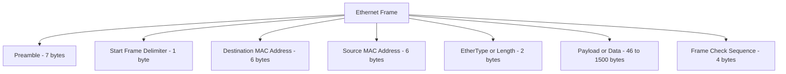
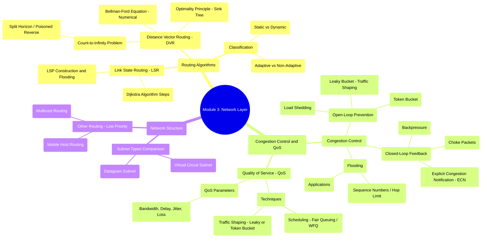

# Ethernet Frame

# Mod 3

## congestion control 
Here is the explanation of the Congestion Control concepts from the notes, presented in a clear, comparative table format.
🚦 Congestion Control Mechanisms
| Category | Mechanism | Goal / When Applied | Key Action |
|---|---|---|---|
| Open-Loop | Open-Loop Control | Prevent congestion before it happens. | Policies are set beforehand; no feedback used. |
| Open-Loop | Retransmission Policy | Handle lost or corrupted packets. | If a sender suspects a loss, the packet is sent again. |
| Open-Loop | Acknowledgement Policy | Confirm successful data receipt. | Receiver informs the sender which packets arrived (often delaying to send one ACK for multiple packets). |
| Open-Loop | Discarding Policy | Shed load during overload (used by intermediate routers). | Congested routers drop packets, forcing senders to slow down. |
| Open-Loop | Admission Policy | Ensure the network can handle new traffic. | A node must reserve resources before sending data. |
| Closed-Loop | Closed-Loop Control | Alleviate congestion after it has been detected. | Uses various signaling methods to fix current issues. |
| Closed-Loop | Backpressure | For very slow networks; local congestion relief. | Warning moves upstream from the congested node only to its immediate neighbor. |
| Closed-Loop | Choke Packet | Directly signal the source to slow down. | A packet is sent back to the original sender to inform them of congestion. |
| Closed-Loop | Implicit Signaling | Infer congestion based on poor performance. | Sender observes signs (e.g., long delays, dropped packets) and infers congestion. |
| Closed-Loop | Explicit Signaling | Directly signal congestion status. | A specific bit is marked in the data packet to notify the source or destination about congestion. |
Would you like a brief analogy for any of these specific mechanisms?
