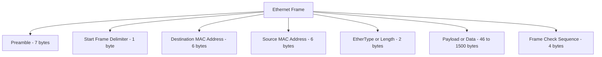
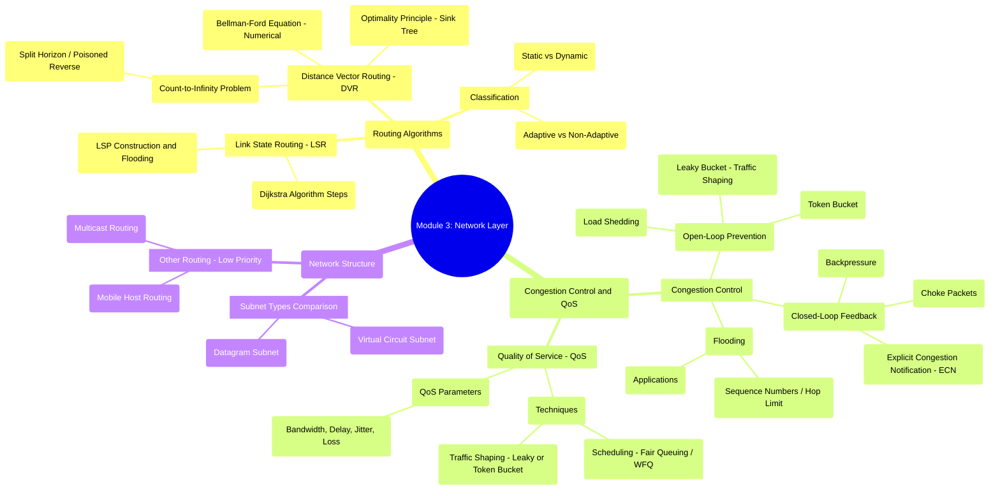

# Ethernet Frame

```mermaid
graph TD
    A[Ethernet Frame]
    A --> B[Preamble - 7 bytes]
    A --> C[Start Frame Delimiter - 1 byte]
    A --> D[Destination MAC Address - 6 bytes]
    A --> E[Source MAC Address - 6 bytes]
    A --> F[EtherType or Length - 2 bytes]
    A --> G[Payload or Data - 46 to 1500 bytes]
    A --> H[Frame Check Sequence - 4 bytes]
```
# Mod 3

```mermaid
mindmap
  root((Module 3: Network Layer))
    A(Routing Algorithms)
      A1[Link State Routing - LSR]
        A1.1(Dijkstra Algorithm Steps)
        A1.2(LSP Construction and Flooding)
      A2[Distance Vector Routing - DVR]
        A2.1(Count-to-Infinity Problem)
          A2.1.1(Split Horizon / Poisoned Reverse)
        A2.2(Bellman-Ford Equation - Numerical)
        A2.3(Optimality Principle - Sink Tree)
      A3[Classification]
        A3.1(Static vs Dynamic)
        A3.2(Adaptive vs Non-Adaptive)
    B(Congestion Control and QoS)
      B1[Congestion Control]
        B1.1(Open-Loop Prevention)
          B1.1.1(Leaky Bucket - Traffic Shaping)
          B1.1.2(Token Bucket)
          B1.1.3(Load Shedding)
        B1.2(Closed-Loop Feedback)
          B1.2.1(Backpressure)
          B1.2.2(Choke Packets)
          B1.2.3(Explicit Congestion Notification - ECN)
        B1.3(Flooding)
          B1.3.1(Applications)
          B1.3.2(Sequence Numbers / Hop Limit)
      B2[Quality of Service - QoS]
        B2.1(QoS Parameters)
          B2.1.1(Bandwidth, Delay, Jitter, Loss)
        B2.2(Techniques)
          B2.2.1(Scheduling - Fair Queuing / WFQ)
          B2.2.2(Traffic Shaping - Leaky or Token Bucket)
    C(Network Structure)
      C1[Subnet Types Comparison]
        C1.1(Datagram Subnet)
        C1.2(Virtual Circuit Subnet)
      C2[Other Routing - Low Priority]
        C2.1(Multicast Routing)
        C2.2(Mobile Host Routing)
```
