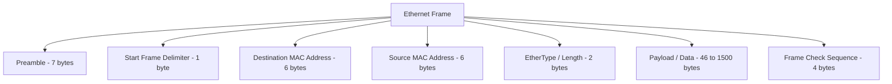

# Ethernet Frame

```mermaid
graph TD
    A[Ethernet Frame]
    A --> B[Preamble - 7 bytes]
    A --> C[Start Frame Delimiter - 1 byte]
    A --> D[Destination MAC Address - 6 bytes]
    A --> E[Source MAC Address - 6 bytes]
    A --> F[EtherType / Length - 2 bytes]
    A --> G[Payload / Data - 46 to 1500 bytes]
    A --> H[Frame Check Sequence - 4 bytes]

```
