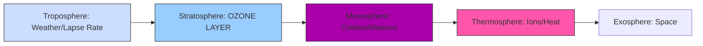
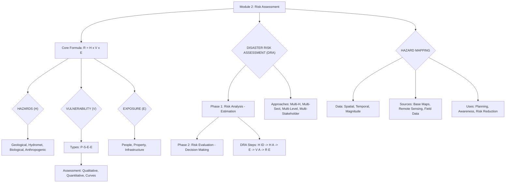

# DM
[Mod1](#module-1)<br><br>
[Mod2](#module-2)<br><br>
[Mod3](#module-3)<br><br>
[Mod4](#module-4)<br><br>
[Mod5](#module-5)<br><br>
## MODULE 1

### I. HIGH PRIORITY: DISASTER RISK REDUCTION FRAMEWORK (DRR/DRM)

The core purpose of this module is to establish the terminology used in risk analysis and management. Master these definitions and how they interrelate (often tested as a single 14-mark comprehensive definition question).

#### A. The Meaning of Disaster Risk Reduction (DRR) and Management (DRM)

| Term | Simple Definition | Key Focus/Action |
| :--- | :--- | :--- |
| **Hazard ($\text{H}$)** | A potentially damaging physical event or phenomenon (e.g., Earthquake, Tsunami, Flood). | **Potential Threat.** (Can be natural or man-made.) |
| **Vulnerability ($\text{V}$)** | Characteristics that make an asset or community susceptible to the damaging effects of a hazard (e.g., poor building quality, lack of awareness). | **Susceptibility to Harm.** |
| **Exposure ($\text{E}$)** | The elements—people, property, systems—located in hazard zones. | **What is at risk?** (Location-specific.) |
| **Capacity ($\text{C}$)** | Strengths and resources available within a community/organization to manage and cope with disaster risks. | **Ability to Cope.** |
| **Risk ($\text{R}$)** | The probability of loss of life/property when exposed to a hazard. | $\text{R} = (\text{H} \times \text{V} \times \text{E}) / \text{C}$ (The likelihood of impact.) |
| **Resilience** | The ability of a system/community to resist, adapt, and recover from a hazard without compromising long-term development. | **Ability to "Bounce Back."** |
| **DRR** | Systematic efforts to analyze, manage, and reduce disaster risk factors. | **Reducing Risk Factors.** (Prevention/Mitigation/Preparedness). |
| **DRM** | The comprehensive application of DRR policies and strategies throughout the entire disaster cycle (preparedness, response, recovery, mitigation). | **The Overall Strategy.** |

#### B. Risk Assessment

Risk Assessment is the process of estimating the risk by looking at all components.

1.  **Process Steps (Reverse-Engineered):**
    *   **Identification:** Identify all potential hazards (H) and determine their characteristics (location, intensity, frequency).
    *   **Analysis:** Analyze the Exposure (E) and the Vulnerability (V) of the exposed elements (physical, social, economic).
    *   **Capacity Evaluation:** Evaluate existing coping capacity (C).
    *   **Scenario Estimation:** Calculate the potential impact (Risk) based on likely scenarios.

#### C. Risk Mapping

Risk Mapping is the graphical representation of the risk.

*   It involves analyzing and overlaying multiple variables (Hazard, Vulnerability, and Capacity) using a scientific methodology (often GIS).
*   **Purpose:** To clearly visualize areas requiring immediate DRR intervention and guide appropriate land-use planning and preparedness measures.

#### D. Early Warning System (EWS)

EWS is crucial for enabling a timely response to hazardous threats.

*   **Key Definition:** EWS is a **socio-technical system** designed to generate and circulate meaningful warning information in a timely manner.
*   **Four Pillars/Steps (Mnemonic: D-A-C-R)**
    1.  **D**etection/Observation (Risk Knowledge)
    2.  **A**nalysis/Forecasting (Warning Generation)
    3.  **C**ommunication/Dissemination (Getting the message out)
    4.  **R**esponse Capacity (Target community must understand and act).
*   *Tip:* Emphasize that EWS success relies not just on accurate prediction (technical) but on community action (socio).

---

### II. HIGH PRIORITY: EARTH SYSTEMS (ATMOSPHERE)

These topics are foundational and frequently tested (especially layers and depletion).

#### A. Atmosphere Layers

The atmosphere is divided based on temperature variation.

*   **Mnemonic for Order (Bottom to Top):** **T**o **S**ee **M**y **T**hermo **E**ggs
    1.  **T**roposphere (0 - 11 km): **Weather** occurs here. Temperature decreases with height (Lapse Rate).
    2.  **S**tratosphere (11 - 50 km): Contains the **Ozone Layer**. Temperature *increases* with height.
    3.  **M**esosphere (50 - 80 km): **Coldest** layer. Most **meteors burn up** here.
    4.  **T**hermosphere (80 - 60,000 km): Very high temperatures. Contains the Ionosphere (radio communication).
    5.  **E**xosphere (Highest): Outermost layer blending into space.

#### B. Ozone Layer and Depletion

*   **Role:** The Ozone Layer ($\text{O}_3$) in the Stratosphere **absorbs harmful Ultraviolet (UV) radiation**, protecting life on Earth.
*   **Depletion:** Thinning of the layer, leading to 'Ozone Holes'.
*   **Major Cause:** Chemicals (like $\text{CFCs}$ and $\text{BFCs}$) release **Chlorine ($\text{Cl}$) and Bromine ($\text{Br}$) radicals**.
*   **Mechanism:** These radicals act as **catalysts**, breaking down ozone molecules ($\text{O}_3 \rightarrow \text{O}_2 + \text{O}$) in a recurrent manner.

#### C. Greenhouse Effect (GHG) and Global Warming

*   **Definition:** The natural process where certain atmospheric gases (GHGs) trap some of the heat (long-wave radiation) radiated by Earth, preventing it from escaping into space.
*   **Function:** It keeps Earth warm enough to sustain life (like a blanket).
*   **Adverse Effect:** Increased concentration of GHGs (due to human activity) traps excess heat, leading to **Global Warming** and accelerated climate change.
*   **Key Greenhouse Gases (GHGs):**
    *   Carbon Dioxide ($\text{CO}_2$)
    *   Methane ($\text{CH}_4$)
    *   Nitrous Oxide ($\text{N}_2\text{O}$)
    *   Water Vapour ($\text{H}_2\text{O}$)

---

### III. MEDIUM PRIORITY: CYCLONES AND CIRCULATIONS

Cyclones are a fundamental atmospheric process, often asked as a differentiation question.

#### A. Cyclones and Anti-Cyclones

| Feature | Cyclone (Low Pressure System) | Anti-Cyclone (High Pressure System) |
| :--- | :--- | :--- |
| **Pressure** | Low pressure at the centre. | High pressure at the centre. |
| **Air Movement** | Air converges at the surface and rises. | Air diverges at the surface and sinks. |
| **N. Hemisphere Flow** | Anti-clockwise (due to Coriolis force). | Clockwise. |
| **S. Hemisphere Flow** | Clockwise. | Anti-clockwise. |
| **Weather** | Cloudy skies, strong winds, heavy rainfall (Stormy). | Clear skies, mild winds, dry conditions (Settled/Pleasant). |
| **Mnemonic (N. Hemisphere):** | **L.A.C.** (Low Pressure, Anti-Clockwise) | **H.A.C.** (High Pressure, Clockwise) |

#### B. Atmospheric Circulations (Overview)

*   **Coriolis Force:** The force produced by Earth’s rotation that deflects moving air (winds) to the right in the Northern Hemisphere and to the left in the Southern Hemisphere.
*   **ITCZ (Inter-Tropical Convergent Zone/Doldrums):** A low-pressure belt formed near the equator where warm air rises, caused by intense heating. This zone is critical as it shifts seasonally, driving the Monsoons.

---

### IV. APPLICATION: MINDMAPS FOR MEMORIZATION

#### Mindmap 1: The Disaster Risk Equation

```mermaid
graph TD
    A["Disaster Risk (R)"] --> B["Hazard (H)"]
    A --> C["Vulnerability (V)"]
    A --> D["Exposure (E)"]
    A --> F["Capacity (C)"]

    style A fill:#ffebee,stroke:#c62828,stroke-width:3px,color:#b71c1c
    style B fill:#fff3e0,stroke:#ef6c00
    style C fill:#fff3e0,stroke:#ef6c00
    style D fill:#fff3e0,stroke:#ef6c00
    style F fill:#e8f5e8,stroke:#2e7d32

    B --> B1["Natural<br/>(earthquake, flood, storm, etc.)"]
    B --> B2["Man-made<br/>(industrial accident, conflict, etc.)"]

    C --> C1["Physical<br/>(weak buildings, poor infrastructure)"]
    C --> C2["Social/Economic<br/>(poverty, marginalisation, inequality)"]

    D --> D1["People"]
    D --> D2["Assets<br/>(houses, crops, infrastructure)"]
    D --> D3["Critical systems<br/>(hospitals, lifelines)"]

    F --> F1["Coping capacity"]
    F --> F2["Adaptive capacity"]
    F --> F3["Transformative capacity"]

    subgraph DRR Goals
        direction TB
        G1["Build Resilience"]
        G2["Reduce Disaster Risk"]
        G3["Effective Disaster Risk Management (DRM)"]
        A -.->|"Reduce/Manage"| G1
        A -.->|"Reduce/Manage"| G2
        A -.->|"Reduce/Manage"| G3
    end

    classDef risk fill:#ffebee,stroke:#c62828,stroke-width:3px
    classDef drivers fill:#fff3e0,stroke:#ef6c00
    classDef capacity fill:#e8f5e8,stroke:#2e7d32
    class A risk
    class B,C,D drivers
    class F capacity
```


#### Mindmap 2: Atmosphere Layers (T S M T)


This guide reverse-engineers the essential knowledge from Module 2 (Hazard, Vulnerability, and Risk Assessment) of MCN301, focusing on clarity, memorization, and high-priority topics.

---

## MODULE 2

### PRIORITY 1: VULNERABILITY (CORE CONCEPT)

Vulnerability (V) is the characteristic or circumstance that makes a person, community, or asset susceptible to the damaging effects of a hazard. It is the **lack of capacity** to cope.

#### 1. Types of Vulnerability (P-S-E-E)

| Type | Focus Area | Example | Mnemonic |
| :--- | :--------- | :------ | :------- |
| **Physical (P)** | Built environment (Design, Structure, Location). | Homes built on low-lying ground; use of weak materials (e.g., mud walls). | **P**hysical = **P**roperty/Place |
| **Social (S)** | Socio-economic status, education, marginalized groups (Age, Gender, Literacy). | Elderly people or children who cannot move quickly during a flood. | **S**ocial = **S**ociety/Status |
| **Economic (E)** | Financial status, assets, livelihoods (Ability to recover financially). | Low-income farmers whose only income source is destroyed by drought. | **E**conomic = **E**arning/Expenses |
| **Environmental (E)** | Natural resources, ecosystem health (Degradation, depletion). | Deforestation on hill slopes leading to high risk of landslides. | **E**nvironmental = **E**cology/Earth |

**Memory Tip (Mnemonic):** **P**lease **S**ave **E**arth's **E**nvironment (P-S-E-E).

#### 2. Vulnerability Assessment Approaches

Assessment is the quantification (measuring the degree of loss) of vulnerability.

- Empirical
   - Analysis of observed damage
   - Expert opinion
   - Score assignment
- Analytical
     - Simple: Computer based methods from geo engg.
     - Detailed 

*   **Key Tool:** **Vulnerability Curves:** Plot the relationship between **Hazard Intensity** (e.g., wind speed) and **Damage Data** (e.g., percentage of property value lost).

---

### PRIORITY 2: DISASTER RISK ASSESSMENT (DRA)

DRA is the process of identifying, analyzing, and evaluating the risk of a potential disaster.

**Core Concept:** **Risk = Hazard (H) x Vulnerability (V) x Exposure (E)**

#### 1. Two Main Components (The Core Structure)

1.  **Risk Analysis:** Using information to **estimate** the risk.
2.  **Risk Evaluation:** Using judgment to **decide** how to manage the risk (Mitigation, Transfer, Acceptance).

#### 2. Risk Analysis Steps (The Process)

This is the standard flow for a Part B 14-mark question.

| Step | Action |
| :--- | :----- |
| 1. **Hazard Identification (H ID)** | Determine what hazards exist in the area (e.g., flood, earthquake, cyclone). |
| 2. **Hazard Assessment (H A)** | Determine the characteristics (magnitude, frequency, duration) of identified hazards. |
| 3. **Exposure / Elements at Risk (E)**| Identify what assets are present and exposed to the hazard (People, Buildings, Infrastructure). |
| 4. **Vulnerability Assessment (V A)** | Determine how susceptible the exposed assets are to damage (P-S-E-E). |
| 5. **Risk Estimation (R E)** | Calculate the potential losses (often monetized or in terms of lives lost). |

**Memory Tip (Mnemonic for Steps 1-5):**
**H**ow **H**eavy **E**very **V**ulcan **R**ocks.

#### 3. Contemporary Approaches to Risk Assessment

Modern approaches must address the complexity of modern society and interconnected systems.

1.  **Multi-Hazard:** Assessing risks from *multiple types of hazards* (e.g., assessing a coastal area for both cyclones and tsunamis).
2.  **Multi-Sectoral:** Hazards impact different sectors (e.g., health, agriculture, transport). Assessment must cover all impacted sectors.
3.  **Multi-Level:** Assessing risk at different scales (National, Regional, Local/Community levels).
4.  **Multi-Stakeholder:** Involving all relevant groups (Individuals, Businesses, NGOs, Authorities) in the assessment process.
5.   **Qualitative:** Uses expert judgment and descriptive terms (High, Moderate, Low). **Relies heavily on perception.**
6.   **Semi-Quantitative:** Uses indices or scoring (0 to 1, or 0 to 100). Provides a relative ranking, but results are dimensionless.
7.   **Quantitative (Analytical/Empirical):**
   - Probability
   - Economic risk
     - Probable maximum Loss
     - Loss Exceedance Curve
     - Average anual loss
   - Population risk
     - Individual
     - Societal

**Memory Tip (Mnemonic):** **M**any **M**ethods **M**ake **M**anagement (4 M’s).

---

### PRIORITY 3: HAZARD MAPPING

Hazard mapping is the graphical representation of hazard characteristics (location, magnitude, frequency) on a map.

#### 1. Significance/Applications

Hazard maps are essential planning tools:

*   **Awareness:** They show the population where the danger zones are.
*   **Spatial Planning:** Used to define hazard zones for communal development plans and building regulations.
*   **Risk Reduction:** Helps in localizing and dimensioning protective measures (e.g., flood walls).
*   **Emergency Planning:** Indicates where the biggest risks are and helps prepare rescue routes.

#### 2. Data Requirements & Sources

| Characteristic | Explanation | Sources (The 3 B.R.F.) |
| :------------- | :---------- | :---------------------- |
| **Spatial** | Location, distribution, dimension. | 1. **B**ase Maps (Topographic layers, roads, water bodies). |
| **Temporal** | Duration and speed of onset. | 2. **R**emotely Sensed Images (Satellite data). |
| **Magnitude** | Intensity or severity of the hazard event. | 3. **F**ield Data (GPS, surveys, Total Station). |

**Memory Tip (Mnemonic for Data Sources):** **B**uy **R**aw **F**ish (Base, Remote, Field).

#### 3. Hazard Mapping Approaches

1.  **GIS Mapping:** Uses Geographic Information Systems (software) to arrange high volumes of data and model hazards in 3D.
2.  **Participatory Mapping:** Integrates **local knowledge** and community input into the map production process, ensuring the data is relevant to those affected.

---

### PRIORITY 4: HAZARDS

A Hazard (H) is a situation that has the **potential** to cause harm or damage.

**Key Distinction:** **Hazard** is the threat (the potential flood). **Disaster** is the realization of the risk (the flood hitting the vulnerable town).

#### 1. Classification based on Origin (The Types)

1.  **Geological:** Earth processes (Earthquakes, Volcanic activity, Tsunamis, Landslides).
2.  **Hydro-meteorological:** Atmospheric/Oceanographic/Hydrological processes (Cyclones, Floods, Drought, Heatwaves, Thunderstorms).
3.  **Biological:** Organic origin/vectors (Epidemics, Pandemics, Locust plagues).
4.  **Anthropogenic (Man-made):** Induced by human activity (Technological failures, Nuclear accidents, Socio-natural hazards).

#### 2. States of Hazard (D.A.A.)

1.  **Dormant:** Potential threat exists, but currently not affecting people (e.g., a riverbank that might flood someday).
2.  **Armed:** The hazard is developing and likely to pose a threat (e.g., a cyclone moving toward the coast).
3.  **Active:** The hazard is striking the habitat; it is now a disaster.

---

## 🧠 Module 2 Conceptual Mind Map (Textual Representation)



## MODULE 3

Module 3 focuses on the Disaster Risk Management (DRM) framework, which is a continuous cycle of planning, coordination, and actions designed to reduce vulnerabilities and build resilience.

### I. HIGH PRIORITY TOPIC 1: THE DRM CYCLE & CORE ELEMENTS

**(Most Frequent Question: Explain the Core Elements/Framework of DRM)**

The DRM framework is a **systematic process** used to implement strategies to lessen the adverse impact of hazards.

#### 1. The Four DRM Phases (The Cycle)
The cycle is often visualized as four stages, focusing on the timing relative to a disaster event:

| Phase | Timing | Primary Goal | Focus Area |
| :--- | :--- | :--- | :--- |
| **P**revention / **M**itigation | Before the event (Long-term) | Eliminate/reduce the root causes of risk. | Land use planning, structural works (dams). |
| **P**reparedness | Before the event (Short-term) | Ensure effective response capacity when the event occurs. | Early warning, evacuation plans, SOPs. |
| **R**esponse / **R**elief | During/Immediately After | Save lives, reduce suffering, and meet basic subsistence needs. | Search & Rescue (S&R), First Aid, Provision of food/shelter. |
| **R**ecovery / **R**econstruction | After the event (Long-term) | Restore normal living conditions and build back better. | Economic rehabilitation, reconstruction of infrastructure. |

> **🔥 Mnemonic for Phases:**
> **P M**ust **R R**ecover (Prevention/Mitigation, Preparedness, Response/Relief, Recovery/Reconstruction).

#### 2. Core Elements of DRM (The Operational Steps)

1.  **Risk Identification and Assessment:**
    *   Determine the nature, origin, and characteristics of the hazard.
    *   Analyze the region's **Vulnerability** (susceptibility) and **Exposure** (what assets are at risk).

2.  **Application of Risk Reduction Measures (Mitigation):** (See Topic 2 below)
    *   Planning and implementing structural (e.g., building dams) and non-structural (e.g., legislation) interventions.

3.  **Disaster Preparedness & Emergency Management:**
    *   Actions taken in advance (e.g., warnings, evacuation).

4.  **Recovery/Reconstruction:**
    *   Post-disaster actions to restore affected populations and infrastructure.

---

### II. HIGH PRIORITY TOPIC 2: MITIGATION MEASURES

**(Most Frequent Question: Explain the types of disaster mitigation measures.)**

Mitigation aims to **reduce the risk** of death, injury, and economic loss by decreasing both hazard likelihood and risk consequence.

#### 1. Objectives of Mitigation (LPR)

*   **L**ikelihood Reduction (e.g., building sea walls to reduce flood chance).
*   **P**repare and enforce structural measures (building codes).
*   **R**isk Consequence Reduction (reducing the impact via resilience).

#### 2. Types of Mitigation Measures

**A. Structural Mitigation (The HARD Measures)**
These involve permanent physical construction and engineering to resist hazards.

*   **Engineering Works:** Constructing dams, embankments, sea defense walls.
*   **Infrastructure:** Designing roads, railways, and bridges to withstand hazard forces (e.g., wind, seismic activity).
*   **Building Codes:** Enforcing hazard-resistant designs (e.g., earthquake-resistant construction).
*   **Retrofitting:** Strengthening existing structures that suffered minor damage in previous events.

**B. Non-Structural Mitigation (The SOFT Measures)**
These involve policies, laws, awareness, and administrative changes.

*   **L**and Use Zoning and Regulation: Avoiding construction on hill slopes or flood plains.
*   **A**wareness and Education: Informing the public about local risks and safety procedures.
*   **C**rop Planning: Advising farmers to grow crops resistant to drought or floods.
*   **P**olicies and Legislation: Implementing robust building regulations and environmental protection laws.

> **💡 Learning Technique: Concept Contrast**
> *   **Structural:** Is it built? (Yes: Hard/Structural)
> *   **Non-Structural:** Is it a rule or a plan? (Yes: Soft/Non-Structural)

---

### III. HIGH PRIORITY TOPIC 3: DISASTER RESPONSE & RELIEF

**(Most Frequent Questions: Define 'relief' and explain its principles; Describe different types of disaster responses.)**

#### 1. Definition and Rationale of Response & Relief

*   **Response:** The stage immediately after a disaster, operationalizing plans to save lives.
*   **Relief:** Provision of assistance (food, shelter, medical care) to meet the basic subsistence needs of the affected population, typically immediate and short-term.

#### 2. Objectives of Response (The 5 L's)

1.  **L**imiting casualties.
2.  **L**ife Support: Restoring essential life support systems (water/power).
3.  **L**iability Mitigation: Mitigating further damage and loss.
4.  **L**owering Hardship: Alleviating immediate suffering (relief).
5.  **L**aying Foundation for recovery.

#### 3. Core Disaster Response Actions

1.  **Search and Rescue (S&R):** Identifying and extracting survivors, often involving specialized teams and aerial searches if transport networks are damaged.
2.  **Medical Care / First Aid:** Providing immediate care (First Aid) and rapid transportation of the seriously injured (Emergency Medical Care).
3.  **Relief Aid Distribution:** Targeted provision of food, water, clothing, and temporary shelter.
4.  **Damage Assessment:** Rapidly calculating the loss of life, injury, and damage to public/private property to prioritize resource allocation.
5.  **Coordination:** Setting up a unified command structure and a control room (manned 24/7) to manage multiple agencies (NGOs, government, military).
6.  **Public Health Support:** Ensuring sanitation, clean water, and managing mass casualties to prevent secondary health hazards (epidemics).

#### 4. Principles Guiding Relief (Humanitarian Charter)

These principles ensure that aid is delivered effectively and ethically:

> **🔥 Mnemonic: HINZU VU**
> 1.  **H**umanity (Alleviate suffering).
> 2.  **I**mpartiality (Aid based on need, not race/religion/politics).
> 3.  **N**eutrality (Do not take sides in conflicts).
> 4.  **I**ndependence (National Societies maintain autonomy).
> 5.  **V**oluntary Service (Service without expectation of gain).
> 6.  **U**nity (Only one Red Cross/Red Crescent society per country).
> 7.  **U**niversality (Movement is worldwide).

---

### IV. HIGH PRIORITY TOPIC 4: INTERNATIONAL RELIEF ORGANIZATIONS

**(Frequent Question: Discuss the role of international relief organizations.)**

These organizations provide global support, funding, coordination, and technical expertise in DRR and response.

> **🔥 Mnemonic for Key Organizations:**
> **W OW U I** (World Bank, OCHA, WHO, UNDP, IFRC)

| Organization | Key Role / Function |
| :--- | :--- |
| **UN-OCHA** (UN Office for Coordination of Humanitarian Affairs) | **Coordination:** Strengthens the UN's response to disasters, ensuring coherent action among various actors. |
| **UNDP** (UN Development Programme) | **Capacity Building & Recovery:** Focuses on poverty reduction, crisis prevention, and supports local governments in needs assessment and capacity building (long-term focus). |
| **IFRC** (International Federation of Red Cross/Red Crescent) | **Frontline Response & Relief:** Largest humanitarian organization. Provides immediate relief and combines relief with development work. Guided by the HINZU VU principles. |
| **WHO** (World Health Organization) | **Health & Standards:** Directing/coordinating authority for health. Provides technical support and manages medical emergencies arising from disasters. |
| **World Bank** | **Funding & Finance:** International financial institution providing loans to developing countries for large-scale disaster management projects (Mitigation, Early Warning Systems). |

---

## MCN 301 MODULE 3: MEMORIZATION MIND MAP

Use this structured map to visualize the connections between the core concepts.

```mermaid
mindmap
  root(MCN 301: DISASTER RISK MANAGEMENT (DRM))

    Strategy (P M R R: The DRM Cycle)
      Mitigation
        1. Prevention & Mitigation
        Structural Measures (Hard Engineering)
          Dams & Embankments
          Hazard-Resistant Building Codes
          Retrofitting Existing Buildings
        Non-Structural Measures (Soft Policy)
          Land Use Zoning (Avoid Flood Plains)
          Public Awareness Campaigns
          Crop Planning
          Legislation
      Preparedness
        2. Planning Beforehand
        Early Warning Systems
        Evacuation Plans
        Standard Operating Procedures (SOPs)
        Inventory of Resources (Equipment, Personnel)
      Response
        3. Immediate Action
        Actions
          Search and Rescue (S&R)
          Medical Care / First Aid
          Damage Assessment
          Coordination (Unified Command)
        Relief (Provision of Basic Needs)
          Principles (HINZU VU)
            Humanity
            Impartiality
            Neutrality
            Independence
            Universality
      Recovery
        4. Post-Disaster Restoration
        Reconstruction of Infrastructure
        Economic Rehabilitation (Livelihoods)
        Building Back Better (Integrating Mitigation)

    Institutions (International Support: W O W U I)
      OCHA (Coordination)
      UNDP (Development & Capacity Building)
      IFRC (Frontline Relief)
      WHO (Health Standards)
      World Bank (Funding)
```
