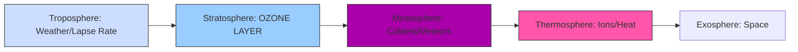

## MODULE 1

### I. HIGH PRIORITY: DISASTER RISK REDUCTION FRAMEWORK (DRR/DRM)

The core purpose of this module is to establish the terminology used in risk analysis and management. Master these definitions and how they interrelate (often tested as a single 14-mark comprehensive definition question).

#### A. The Meaning of Disaster Risk Reduction (DRR) and Management (DRM)

| Term | Simple Definition | Key Focus/Action |
| :--- | :--- | :--- |
| **Hazard ($\text{H}$)** | A potentially damaging physical event or phenomenon (e.g., Earthquake, Tsunami, Flood). | **Potential Threat.** (Can be natural or man-made.) |
| **Vulnerability ($\text{V}$)** | Characteristics that make an asset or community susceptible to the damaging effects of a hazard (e.g., poor building quality, lack of awareness). | **Susceptibility to Harm.** |
| **Exposure ($\text{E}$)** | The elements—people, property, systems—located in hazard zones. | **What is at risk?** (Location-specific.) |
| **Capacity ($\text{C}$)** | Strengths and resources available within a community/organization to manage and cope with disaster risks. | **Ability to Cope.** |
| **Risk ($\text{R}$)** | The probability of loss of life/property when exposed to a hazard. | $\text{R} = (\text{H} \times \text{V} \times \text{E}) / \text{C}$ (The likelihood of impact.) |
| **Resilience** | The ability of a system/community to resist, adapt, and recover from a hazard without compromising long-term development. | **Ability to "Bounce Back."** |
| **DRR** | Systematic efforts to analyze, manage, and reduce disaster risk factors. | **Reducing Risk Factors.** (Prevention/Mitigation/Preparedness). |
| **DRM** | The comprehensive application of DRR policies and strategies throughout the entire disaster cycle (preparedness, response, recovery, mitigation). | **The Overall Strategy.** |

#### B. Risk Assessment

Risk Assessment is the process of estimating the risk by looking at all components.

1.  **Process Steps (Reverse-Engineered):**
    *   **Identification:** Identify all potential hazards (H) and determine their characteristics (location, intensity, frequency).
    *   **Analysis:** Analyze the Exposure (E) and the Vulnerability (V) of the exposed elements (physical, social, economic).
    *   **Capacity Evaluation:** Evaluate existing coping capacity (C).
    *   **Scenario Estimation:** Calculate the potential impact (Risk) based on likely scenarios.

#### C. Risk Mapping

Risk Mapping is the graphical representation of the risk.

*   It involves analyzing and overlaying multiple variables (Hazard, Vulnerability, and Capacity) using a scientific methodology (often GIS).
*   **Purpose:** To clearly visualize areas requiring immediate DRR intervention and guide appropriate land-use planning and preparedness measures.

#### D. Early Warning System (EWS)

EWS is crucial for enabling a timely response to hazardous threats.

*   **Key Definition:** EWS is a **socio-technical system** designed to generate and circulate meaningful warning information in a timely manner.
*   **Four Pillars/Steps (Mnemonic: D-A-C-R)**
    1.  **D**etection/Observation (Risk Knowledge)
    2.  **A**nalysis/Forecasting (Warning Generation)
    3.  **C**ommunication/Dissemination (Getting the message out)
    4.  **R**esponse Capacity (Target community must understand and act).
*   *Tip:* Emphasize that EWS success relies not just on accurate prediction (technical) but on community action (socio).

---

### II. HIGH PRIORITY: EARTH SYSTEMS (ATMOSPHERE)

These topics are foundational and frequently tested (especially layers and depletion).

#### A. Atmosphere Layers

The atmosphere is divided based on temperature variation.

*   **Mnemonic for Order (Bottom to Top):** **T**o **S**ee **M**y **T**hermo **E**ggs
    1.  **T**roposphere (0 - 11 km): **Weather** occurs here. Temperature decreases with height (Lapse Rate).
    2.  **S**tratosphere (11 - 50 km): Contains the **Ozone Layer**. Temperature *increases* with height.
    3.  **M**esosphere (50 - 80 km): **Coldest** layer. Most **meteors burn up** here.
    4.  **T**hermosphere (80 - 60,000 km): Very high temperatures. Contains the Ionosphere (radio communication).
    5.  **E**xosphere (Highest): Outermost layer blending into space.

#### B. Ozone Layer and Depletion

*   **Role:** The Ozone Layer ($\text{O}_3$) in the Stratosphere **absorbs harmful Ultraviolet (UV) radiation**, protecting life on Earth.
*   **Depletion:** Thinning of the layer, leading to 'Ozone Holes'.
*   **Major Cause:** Chemicals (like $\text{CFCs}$ and $\text{BFCs}$) release **Chlorine ($\text{Cl}$) and Bromine ($\text{Br}$) radicals**.
*   **Mechanism:** These radicals act as **catalysts**, breaking down ozone molecules ($\text{O}_3 \rightarrow \text{O}_2 + \text{O}$) in a recurrent manner.

#### C. Greenhouse Effect (GHG) and Global Warming

*   **Definition:** The natural process where certain atmospheric gases (GHGs) trap some of the heat (long-wave radiation) radiated by Earth, preventing it from escaping into space.
*   **Function:** It keeps Earth warm enough to sustain life (like a blanket).
*   **Adverse Effect:** Increased concentration of GHGs (due to human activity) traps excess heat, leading to **Global Warming** and accelerated climate change.
*   **Key Greenhouse Gases (GHGs):**
    *   Carbon Dioxide ($\text{CO}_2$)
    *   Methane ($\text{CH}_4$)
    *   Nitrous Oxide ($\text{N}_2\text{O}$)
    *   Water Vapour ($\text{H}_2\text{O}$)

---

### III. MEDIUM PRIORITY: CYCLONES AND CIRCULATIONS

Cyclones are a fundamental atmospheric process, often asked as a differentiation question.

#### A. Cyclones and Anti-Cyclones

| Feature | Cyclone (Low Pressure System) | Anti-Cyclone (High Pressure System) |
| :--- | :--- | :--- |
| **Pressure** | Low pressure at the centre. | High pressure at the centre. |
| **Air Movement** | Air converges at the surface and rises. | Air diverges at the surface and sinks. |
| **N. Hemisphere Flow** | Anti-clockwise (due to Coriolis force). | Clockwise. |
| **S. Hemisphere Flow** | Clockwise. | Anti-clockwise. |
| **Weather** | Cloudy skies, strong winds, heavy rainfall (Stormy). | Clear skies, mild winds, dry conditions (Settled/Pleasant). |
| **Mnemonic (N. Hemisphere):** | **L.A.C.** (Low Pressure, Anti-Clockwise) | **H.A.C.** (High Pressure, Clockwise) |

#### B. Atmospheric Circulations (Overview)

*   **Coriolis Force:** The force produced by Earth’s rotation that deflects moving air (winds) to the right in the Northern Hemisphere and to the left in the Southern Hemisphere.
*   **ITCZ (Inter-Tropical Convergent Zone/Doldrums):** A low-pressure belt formed near the equator where warm air rises, caused by intense heating. This zone is critical as it shifts seasonally, driving the Monsoons.

---

### IV. APPLICATION: MINDMAPS FOR MEMORIZATION

#### Mindmap 1: The Disaster Risk Equation

```mermaid
graph TD
    A[Disaster Risk (R)] --> B(Hazard H);
    A --> C(Vulnerability V);
    A --> D(Exposure E);
    A --> E(Capacity C);

    style A fill:#f9f,stroke:#333
    style B fill:#ffd,stroke:#333
    style C fill:#ffd,stroke:#333
    style D fill:#ffd,stroke:#333
    style E fill:#ccf,stroke:#333

    B --> B1(Natural);
    B --> B2(Man-made);

    C --> C1(Physical);
    C --> C2(Social/Economic);

    E --> E1(People);
    E --> E2(Assets);

    E --> E3(Systems);

    subgraph DRR Goal
        R -- Reduce/Manage --> G1(Resilience);
        R -- Reduce/Manage --> G2(DRR/DRM);
    end
```

#### Mindmap 2: Atmosphere Layers (T S M T)


