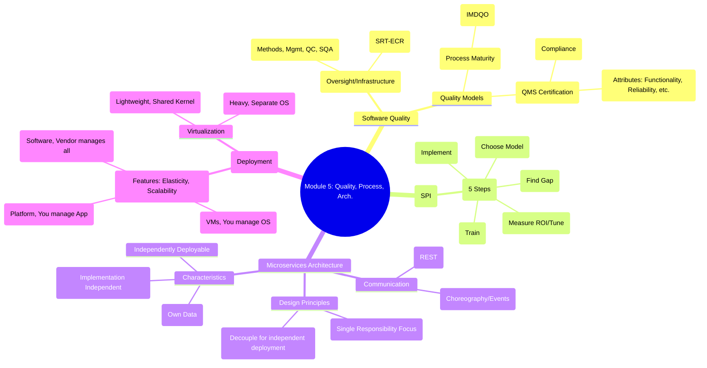

# MSS
[Mod1](#module-1)<br><br>
[Mod2](#module-2)<br><br>
[Mod3](#module-3)<br><br>
[Mod4](#module-4)<br><br>
[Mod5](#module-5)<br><br>
## Module 5

### **I. High-Priority Core Concepts (Master First)**

This covers SQA, CMMI/ISO, and Microservices, which are highly likely to appear in both Part A (3M) and Part B (7M) questions.

#### **A. Software Quality Assurance (SQA) & Quality Models**

**1. Definition and Goal:**
*   SQA is the infrastructure (policies, processes, tools) established to manage software quality throughout the entire development lifecycle.
*   **Goal:** Ensure the software process and products conform to standards and requirements, leading to high-quality software that delivers value.
*   *Mnemonic: SQA provides the 4 I's:* **I**nfrastructure, **I**nsight, **I**nformation, and **I**mproved quality.

**2. Elements/Tasks of SQA (Checklist/Auditing Role):**
The SQA group (often independent) performs these tasks:
*   **Standards:** Ensure that organization and project standards (e.g., coding, documentation) are **followed**.
*   **Reviews/Audits:** Conduct technical reviews to uncover errors (quality control) and audits to ensure compliance with quality guidelines.
*   **Testing:** Ensure testing is properly **planned and executed** to maximize error detection.
*   **Error/Defect Analysis:** Collect data on errors to understand *how* they occur and determine the best elimination methods.
*   **Change Management:** Ensure that changes are properly managed and documented to prevent the introduction of new defects.
*   **Risk Management:** Ensure risk activities are properly conducted and contingency plans are in place.

| 3 Marks Tip: Elements of SQA | **S**tandards, **R**eviews/Audits, **T**esting, **E**rror Analysis, **C**hange Mgmt, **R**isk Mgmt. |
| :--- | :--- |

**3. Achieving Software Quality (Four Broad Activities):**
Software quality results from combining four pillars:
1.  **Software Engineering Methods:** Understanding the problem and using rigorous design/coding practices.
2.  **Project Management Techniques:** Using estimation, scheduling, and risk planning to avoid shortcuts.
3.  **Quality Control Actions:** Activities like **reviews, inspections, and testing** applied early and consistently.
4.  **Quality Assurance (SQA):** Providing the oversight and infrastructure to ensure the above three are effective.

#### **B. Capability Maturity Model Integration (CMMI)**

**1. CMMI Overview:**
*   CMMI is a **process meta-model** (framework) that guides organizations in improving the maturity and capability of their software development processes.
*   It uses a **staged representation** (5 levels) to measure organizational maturity.

**2. The Five Maturity Levels (Must Memorize):**
*   *Mnemonic: **I**nterested **M**anagers **D**efine **Q**uality **O**utcomes* (Initial, Managed, Defined, Quantitatively Managed, Optimizing).

| Level | Name | Characteristic | Focus / Process State |
| :--- | :--- | :--- | :--- |
| **1** | **Initial (Chaotic)** | Ad-hoc, unpredictable, reactive. | Success relies on individual heroes, not repeatable processes. |
| **2** | **Managed** | Processes are planned, performed, and controlled **at the project level**. | Work products are defined, monitored, and reviewed. (Project-specific policies). |
| **3** | **Defined** | Processes are **standardized across the organization**. | Standard processes are tailored for specific projects. Training and documentation are organizational assets. |
| **4** | **Quantitatively Managed** | Process performance is controlled using **statistical and quantitative techniques**. | Focus is on achieving measurable quantitative goals for quality and process performance. |
| **5** | **Optimizing** | Focuses on **continuous process improvement**. | Processes are adapted and optimized using statistical feedback and piloting innovative ideas. |

**3. ISO 9001:2000 vs. CMMI:**
*   **ISO 9001:** Generic QMS standard. Focuses on *if* you have a defined system (binary: compliant/not compliant). Applicable to *any* industry.
*   **CMMI:** Software-specific framework. Focuses on *how well* you manage your processes (5 levels of maturity).

#### **C. Microservices Architecture**

**1. Characteristics (3 Marks Tip):**
*   Small-scale services, each focused on a single business function.
*   **Self-contained:** Manage their own data and UI (no shared database).
*   **Implementation-independent (Polyglot):** Can use different languages/technologies.
*   **Independently Deployable:** Deployable using automated systems without affecting other services.
*   **Resilient (Fault Isolation):** Failure in one service does not crash the entire system.

**2. Key Design Principles (Why Microservices are Good):**
*   **Low Coupling:** Services rely minimally on each other, communicating via explicit messages/APIs. (Changes in one service don't break others).
*   **High Cohesion:** The internal elements of a service are strongly related and focused on one responsibility. (Easier to understand and maintain).

**3. Service Communications (Must Know):**
*   Microservices communicate by exchanging messages.
    *   **Synchronous:** (e.g., REST/HTTP). Client waits for a response. Simple, but higher risk of cascading failure.
    *   **Asynchronous (Choreography):** (e.g., Message Queues, Event-Driven). Services emit events, and other services react accordingly. Highly decoupled, improves resilience.

---

### **II. Medium-Priority Topics (Part B Q20 & Detailed Part A)**

These topics are often combined with the core topics to form the second Part B question (Q20) or appear as detailed Part A questions.

#### **D. Software Process Improvement (SPI)**

**1. SPI Process (Five Iterative Steps):**
SPI is a method to transform an "as-is" process into a "to-be" process.

| Step | Activity | Purpose |
| :--- | :--- | :--- |
| **1** | **Assessment & Gap Analysis** | Evaluate the **current process** (often using CMMI) to identify strengths and weaknesses ("gaps") compared to best practices. |
| **2** | **Education & Training** | Train practitioners and managers on the new process concepts and tools. |
| **3** | **Selection & Justification** | Choose the most suitable process model, methods, and tools for the organization. |
| **4** | **Installation & Migration** | Implement the chosen changes, often via a pilot project first. |
| **5** | **Evaluation & Tuning** | Assess the degree of adoption and the measurable business benefit (ROI). Tune the process for continual improvement. |

**2. Elements of an SPI Framework (3 Marks):**
1.  **Defined Process Characteristics:** What an effective process should look like (e.g., CMMI KPAs).
2.  **Assessment Method:** A procedure to evaluate the current process against these characteristics.
3.  **Mechanism for Summarizing Results:** Providing an indication of **process maturity**.
4.  **Strategy for Implementation:** Guidance on how to address missing or weak characteristics.

#### **E. Cloud-Based Software and Virtualization**

**1. Characteristics of Cloud Software (3 Marks):**
*   *Mnemonic: **RESUME** (Resilience, Elasticity, Scalability, Utility/Measured Service, Multi-tenancy/Resource Pooling, Ease of use/On-Demand).*
    *   **Scalability:** Cope with increasing load (scaling up/out).
    *   **Elasticity:** Scale **up and down dynamically** based on demand (pay only for what you need).
    *   **Resilience:** Architecture tolerates server failures (redundancy/fault isolation).

**2. Cloud Service Levels (Basic and Intermediate):**
*   **Basic/Foundational:** **IaaS (Infrastructure as a Service):** Provides VMs, storage, networking. **You manage:** OS, applications, data.
*   **Intermediate:** **PaaS (Platform as a Service):** Provides OS, databases, web servers, frameworks. **You manage:** Applications, data.
*   **Highest Level:** **SaaS (Software as a Service):** Provides the entire application (e.g., Gmail). **You manage:** User configuration.

**3. Virtualization vs. Containerization:**
*   **Virtualization (VMs):** Uses a **hypervisor**. Each VM has its own **Guest OS and kernel**. Provides strong isolation. Slower startup (minutes).
*   **Containerization (e.g., Docker):** Uses **OS-level virtualization**. Containers **share the host OS kernel**. Lightweight, fast deployment (seconds). Efficient for service-oriented architectures.

---

### **III. Memorization Tools (Mind Map)**

Use this simplified mind map to recall the relationships between the high-priority topics:



```
