# MSS
[Mod1](#module-1)<br><br>
[Mod2](#module-2)<br><br>
[Mod3](#module-3)<br><br>
[Mod4](#module-4)<br><br>
[Mod5](#module-5)<br><br>

## Module 1

### 🎯 1. Part A Core Concepts (Priority 1)

These concepts are essential for the 3-mark questions (Q1, Q2) and form the foundation for Part B.

#### A. Essential Attributes of Good Software (QP1 A1, QP5 A1)

| Attribute | Simple Explanation | Mnemonics: M D E A |
| :--- | :--- | :--- |
| **M**aintainability | Easy to adapt to changing requirements and fix errors. (Crucial for evolution). | **M**y |
| **D**ependability & Security | Trustworthy; reliable, safe, and secure (no physical/economic damage upon failure). | **D**og |
| **E**fficiency | Does not waste system resources (memory, processing time). Includes responsiveness. | **E**ats |
| **A**cceptability / Usability | Understandable, usable, and compatible with other systems by its intended users. | **A**pples |

#### B. Software Engineering Ethics (QP1 A1, QP3 B11a)

Professional software engineers must uphold these standards of honesty and integrity.

| Ethical Point | Core Responsibility | Mnemonics: C C I C |
| :--- | :--- | :--- |
| **C**onfidentiality | Respecting the confidentiality of clients/employers. | **C**an |
| **C**ompetence | Do not misrepresent your skill level; only accept work within your abilities. | **C**ode |
| **I**ntellectual Property (IP) | Awareness of patents and copyright; protecting client/employer IP. | **I**n |
| **C**omputer Misuse | Do not use technical skills to misuse others' computers (e.g., spreading malware). | **C**++ |

#### C. Fundamental Process Activities

All software processes include four basic activities: **S D V E**

1.  **S**pecification (Requirements Engineering): Defining *what* the system must do and constraints (Q11 Focus).
2.  **D**evelopment (Design & Implementation): Designing *how* the system works and coding it.
3.  **V**alidation (Testing): Checking that the software meets the specification and user expectations.
4.  **E**volution (Maintenance): Modifying the software to reflect changing needs and environments.

---

### 2. Traditional Models (Q11 Focus)

#### A. Waterfall Model: Stages and Applicability (QP1 B11b, QP4 B11a)

The Waterfall model follows a linear, sequential path.

| Stage (R D I T M) | Focus/Goal | Max Effort Phase |
| :--- | :--- | :--- |
| **R**equirements Definition | Detailed collection and documentation of all functional/non-functional requirements (SRS). | **M**aintenance (Often 50%+ of cost) |
| **D**esign (System & Software) | Defines system architecture, components, interfaces, and data structures. | |
| **I**mplementation (Coding) | Translating design into executable code (includes Unit Testing). | |
| **T**esting (Integration & System) | Integrating units and verifying that the full system meets requirements. | |
| **M**aintenance | Correcting errors, adapting to new environments, and adding new features. | |

**Applicability (Situations where Waterfall is only appropriate):**

1.  **Well-Defined Requirements:** Requirements are fixed, well-understood, and highly unlikely to change (e.g., embedded systems).
2.  **Small/Simple Projects:** Limited complexity where scope can be clearly defined upfront.
3.  **Critical Systems:** Systems requiring extensive upfront analysis and documentation for safety/security analysis (e.g., medical devices, aerospace).

---

#### B. Spiral Model: Risk Focus (QP2 B11b, QP4 B12a)

The Spiral model is an evolutionary, risk-driven approach suitable for complex projects.

**The Four Quadrants (P R E E):**

1.  **P**lanning (Objective Setting): Define objectives, alternatives, and constraints.
2.  **R**isk Analysis & Reduction: Identify, assess, and mitigate technical and management risks (often involving Prototyping).
3.  **E**ngineering: Develop and validate the software increment (Design, Code, Test).
4.  **E**valuation & Review: Review progress with stakeholders and plan the next spiral cycle.

**Key Trick for Exam:** If a case study mentions **high risk, unclear requirements, or evolving technology**, the **Spiral Model** is the correct answer.

---

### 3. Agile and Incremental (Q12 Focus - HIGH PRIORITY)

#### A. Incremental Model Advantages (QP2 A1, QP6 B12a)

Incremental development delivers the system in small, functional versions (increments).

**Advantages over Waterfall (R F C C):**

1.  **R**educed Cost of Change: Changes only affect the current or future increments, significantly lowering rework costs.
2.  **F**aster Time to Market: Core functionality is delivered early, providing business value sooner (especially critical for e-commerce/business systems).
3.  **C**ustomer Feedback: Continuous feedback is gathered from working software, leading to better validation than relying on paper documents.
4.  **C**ontinuous Risk Reduction: Highest priority/risky components are developed and tested first.

#### B. Principles of Agile Software Development (Agile Manifesto) (QP4 B11b)

The principles guide the iterative approach, prioritizing people and responsiveness over processes and planning.

| Theme | Key Principles | Simple Check |
| :--- | :--- | :--- |
| **Delivery & Feedback** | **Working software** over comprehensive documentation. **Customer collaboration** over contract negotiation. | Deliver tangible value often. |
| **Change** | **Welcome changing requirements**, even late in development. | Be flexible; adaptation is valued. |
| **Team & Communication**| Build projects around **motivated individuals**. **Face-to-face** communication is most effective. **Self-organizing** teams. | Trust the team and talk directly. |
| **Quality & Pace** | Continuous attention to **technical excellence and good design** (Refactoring). Maintain a **sustainable pace**. **Simplicity** (maximizing work not done). | Keep the code clean and the pace steady. |

#### C. Agile Development Techniques (Q12 Focus)

These practices support the quality and collaboration mandated by the Agile principles.

| Technique | Definition | Relevance / Benefit (Q12) |
| :--- | :--- | :--- |
| **Pair Programming** | Two developers work at one workstation (Driver writes code, Navigator reviews it constantly). | **Enhanced Quality** (immediate review reduces bugs). **Knowledge Sharing** (shared codebase understanding). **Continuous Feedback.** |
| **Refactoring** | Restructuring existing code *internally* to improve maintainability, simplicity, or readability, **without changing its external functionality**. | **Reduces Technical Debt** (prevents code degradation). **Continuous Improvement** (maintains system health). **Easier Feature Addition** (flexible codebase). |

---

### 4. Module 1 Mind Map


## Module 2

### I. HIGH PRIORITY DEFINITIONS (PART A FOCUS)

These concepts are vital for 3-mark questions and as components of 14-mark answers.

| Concept | Definition & Key Features | Mnemonic/Tip |
| :--- | :--- | :--- |
| **Functional Requirements (FR)** | Define ***what*** the system must do. Specific services, features, and behaviors (e.g., *The system must allow users to log in*). | **F**eatures = **F**unctional (What?) |
| **Non-Functional Requirements (NFR)** | Define ***how well*** the system performs. Constraints and quality attributes (Performance, Security, Reliability, Usability). Often affect the entire system architecture. | **N**ow **F**ine (How well?). **P**erformance, **S**ecurity, **R**eliability. |
| **Personas** | Fictional, generalized user representatives (e.g., "John, the Data Analyst"). Used to understand user goals, motivations, and pain points, driving user-centric design. | **P**eople **R**epresent **G**oals (**P**ersona $\rightarrow$ **R**epresents **G**oals). |
| **Scenarios** | Narrative stories describing how a Persona interacts with the system to achieve a specific goal in a specific context. Used for identifying usability issues. | **S**tories **S**how **I**nteractions. |
| **User Stories** | Short, simple requirement descriptions from the user's perspective. Format: "As a [role], I want [action] so that [benefit]." | The core agile requirement format. |
| **Traceability Matrix** | A document linking requirements IDs to their corresponding design elements, code modules, and test cases. Ensures comprehensive coverage and simplifies impact analysis. | **T**racking **D**esign, **C**ode, **T**ests. |
| **Software Component** | A modular, self-contained, and reusable unit of functionality with well-defined interfaces. The key building block in modern software architecture. | Modular **B**uilding **B**lock. |

***

### II. CLUSTER 1: REQUIREMENTS PROCESS & SPECIFICATION (Q13 Focus)

#### 1. The Generic Requirements Engineering Process (E-A-S-V-M)

This sequence is the foundation. Master the steps and their purpose.

| Step | Activity | Goal / Output | Mnemonic |
| :--- | :--- | :--- | :--- |
| **1. Elicitation** | Gathering information from stakeholders (interviews, observation, prototyping). | Discover all needs (functional & non-functional). | **E**very |
| **2. Analysis** | Modeling (UML diagrams) and resolving conflicts/ambiguities. | Refined, consistent, and clear requirements. | **A**nalyst |
| **3. Specification** | Documenting the final requirements formally. | Software Requirements Specification (SRS). | **S**hould |
| **4. Validation** | Checking documented requirements against stakeholder expectations (reviews, test generation). | Correctness, completeness, and realism. | **V**alidate |
| **5. Management** | Tracking and controlling changes (versioning, prioritization, traceability). | Maintain integrity throughout the project lifecycle. | **M**anagement |

#### 2. Requirements Validation Techniques

Validation checks that you are building **the right product**.

*   **Requirements Reviews:** Systematic analysis of the SRS by a team to check for errors and inconsistencies.
*   **Prototyping:** Developing an executable model to get user feedback early on system behavior.
*   **Test-Case Generation:** Designing acceptance tests based on requirements. If a test is hard to design, the requirement is likely flawed (i.e., not verifiable).

#### 3. Characteristics of a Good SRS Document
*(Often asked in Part A or as a subset of Q13)*

*   **V**alid: Reflects the real needs of the user.
*   **C**omplete: Includes all necessary functions and constraints.
*   **C**onsistent: No conflicts or contradictions between requirements.
*   **T**estable (Verifiable): Possible to design tests to prove the requirement is met.
*   **T**raceable: Can be linked back to its source (stakeholder need) and forward to design/code.

***

### III. CLUSTER 2: DESIGN & USER MODELING (Q14 Focus)

#### 1. Core Design Concepts (A-M-C-C)

Design concepts ensure the system structure is robust, maintainable, and scalable.

| Concept | Explanation | Aim (High/Low) |
| :--- | :--- | :--- |
| **Abstraction** | Simplification; focusing on essential features while hiding complex internal details. | N/A |
| **Modularity** | Dividing the system into named, discrete components or modules. | High |
| **Cohesion** | Measures how strongly related the internal elements within a single module are. | **HIGH** (Module focuses on one, related function). |
| **Coupling** | Measures the degree of interdependence between different modules. | **LOW** (Modules can be modified independently). |
| **Encapsulation** | Bundling data (attributes) and methods (behavior) into a single unit (like a class) and protecting internal state. | N/A |

#### 2. Architectural Styles
*(Explaining 3-4 styles is usually sufficient for a 6-7 mark question)*

1.  **Layered Architecture:**
    *   **Structure:** Organized into distinct layers (e.g., Presentation $\rightarrow$ Business Logic $\rightarrow$ Data Access).
    *   **Interaction:** Layers communicate only with the adjacent layer below them.
    *   **Benefit:** Excellent Separation of Concerns, highly maintainable.
2.  **Client-Server Architecture:**
    *   **Structure:** System split into service *requesters* (Clients) and service *providers* (Servers).
    *   **Interaction:** Client sends requests; Server processes, stores data, and returns results.
    *   **Benefit:** Centralized control, resource sharing, easy scalability (add more clients/servers).
3.  **Data Flow / Pipe-and-Filter Architecture:**
    *   **Structure:** Data is transformed sequentially by a series of processing units (**Filters**), connected by **Pipes**.
    *   **Interaction:** Output of one filter is input to the next.
    *   **Benefit:** Reusability, easy to add/remove transformation steps.
4.  **Microservices Architecture:**
    *   **Structure:** Application is a collection of small, independent, loosely coupled services. Each service manages its own data.
    *   **Interaction:** Services communicate via lightweight protocols (e.g., HTTP/API gateway).
    *   **Benefit:** Independent deployment, improved fault isolation, high scalability.

#### 3. Use Cases / Use Case Diagram

A Use Case describes a system's behavior in response to an **Actor** (user or external system) to achieve a goal.

| Element | Description | Symbol |
| :--- | :--- | :--- |
| **Actor** | An external entity interacting with the system (Human, Hardware, or another System). | Stick Figure |
| **Use Case** | A specific functionality or goal achieved through interaction. | Oval |
| **System Boundary** | Defines the scope of the system being modeled (What's in/out). | Box |
| **Relationships** | Links between actors and use cases (Association, Include, Extend). | Lines/Arrows |

---

### 🧠 LEARNING & MEMORY TOOLS (MODULE 2)

#### Mind Map Visualization

Visualize Module 2 split into two pillars: **Requirements** and **Design**.


#### Advanced Mnemonics

| Topic | Mnemonic | Use |
| :--- | :--- | :--- |
| **Qualities of a Good SRS** | **V**ery **C**areful **C**ustomers **T**rust **T**esting | **V**alid, **C**omplete, **C**onsistent, **T**estable, **T**raceable. |
| **Design Hierarchy (Best Practices)** | **A**lways **H**ave **L**ow **C**oupling | **A**bstract, **H**igh Cohesion, **L**ow Coupling. |
| **Microservice Characteristics**| **I**n **L**ondon, **D**eploy **B**usiness **I**ndependently | **I**mplementation-independent, **L**ightweight, **D**eployable, **B**usiness-oriented, **I**ndependently deployable. |
## Module 3

### I. Cluster 1: Software Verification Fundamentals (High Priority)

These are fundamental concepts necessary for answering both comparison questions (Part A) and detail questions (Part B).

#### 1. White Box vs. Black Box Testing

This is the most recurring comparison topic.

| Aspect | White Box Testing (Structural/Glass-box) | Black Box Testing (Functional/Behavioral) |
| :--- | :--- | :--- |
| **Focus** | Internal code logic, structure, paths, and flow. | External functionality, user requirements, inputs, and outputs. |
| **Knowledge** | Requires knowledge of the code structure and algorithms. | Requires no knowledge of internal code (treated as a black box). |
| **Who tests?** | Developers, programmers. | Testers, end-users, QA team. |
| **Goal** | Ensure all independent paths are executed and internal errors are found. | Verify the system meets the specifications/requirements. |
| **Techniques** | Basis Path Testing, Loop Testing, Data Flow Testing. | Equivalence Partitioning (EP), Boundary Value Analysis (BVA), Orthog. |

> ##### 💡 Mnemonic Tip:
> *   **W**hite Box sees the **W**orks (internal logic).
> *   **B**lack Box sees the **B**ehavior (user function).

#### 2. Black Box Techniques (EP and BVA)

These are commonly asked for definition and comparison in Q15 (Part B) or Part A.

*   **Equivalence Partitioning (EP):**
    *   **Definition:** Divides the input data into partitions (classes) where the system behavior is assumed to be similar. Only one test case is chosen from each partition.
    *   **Goal:** Reduce redundant test cases while ensuring coverage of all major input types (valid and invalid).
*   **Boundary Value Analysis (BVA):**
    *   **Definition:** Focuses on testing values exactly *at*, *just above*, and *just below* the edge (boundary) of equivalence partitions.
    *   **Goal:** Errors frequently cluster at the boundaries of input ranges. BVA is a high-yield method for finding these edge-case bugs.

> ##### 💡 Mnemonic Tip:
> **B**VA targets the **B**oundaries (edges).

#### 3. System Testing Variants

System testing verifies the complete, integrated system. (High Priority - Part A)

1.  **Functional Testing:** Checks if the system performs its specified requirements (what the user asked for).
2.  **Performance Testing:** Checks speed, stability, and responsiveness under various loads (includes Load and Stress testing).
3.  **Security Testing:** Checks protection mechanisms against unauthorized access, penetration, and malicious attacks.
4.  **Usability Testing:** Checks how easy and intuitive the system is for end-users (User Experience/UX).
5.  **Acceptance Testing (UAT/OAT):** Final testing done by the customer/client to ensure the system is ready for production.

---

### II. Cluster 2: Quality Reviews and Processes (High Priority for Q16)

These are key process-centric topics frequently asked in the detailed Part B questions.

#### 1. Formal Technical Review (FTR)

A structured software quality control activity performed by a team to uncover errors and ensure compliance with standards.

##### FTR Process Steps (Recurring Question)
The process is formal and sequential:

1.  **P**lanning (Set objectives, select team).
2.  **P**reparation (Reviewers study materials independently).
3.  **C**onducting the Review Meeting (Author presents; defects identified, **not solved**).
4.  **R**ecording Findings (Scribe documents all issues/defects).
5.  **R**eviewing Outcome (Decision on major/minor revisions; action items assigned).
6.  **F**ollow-up and Closure (Author fixes defects; verification ensures resolution).

> ##### 💡 Mnemonic Tip (The FTR Meeting Flow):
> **P**lease **P**repare **C**offee, **R**ecorder **R**eads **F**indings.

##### Objectives of FTR (Part A & B)
*   Uncover errors early (function, logic, implementation).
*   Verify compliance with requirements and standards.
*   Achieve uniform software development style.
*   Promote knowledge transfer and team training.

#### 2. Test Documentation

Essential for planning, tracking, resource management, and transparency. (Medium Priority)

| Document Type | Purpose |
| :--- | :--- |
| **Test Policy** | High-level organizational goal settings for testing. |
| **Test Plan** | Detailed document covering scope, approach, resources, and schedule for a specific project. |
| **Test Case** | Detailed steps, input values, and expected results for verifying a specific function. |
| **Traceability Matrix** | Links requirements to test cases (ensures all requirements are covered/tested). |
| **Defect Report** | Documenting any flaw that causes the system to fail its expected function. |

---

### III. Cluster 3: Evolution, Maintenance & Modern Practices (High Priority for Q16)

#### 1. Software Maintenance

Maintenance occurs after delivery to adapt or correct the software. (High Priority - Part A)

> ##### 💡 Mnemonic Tip (Types of Maintenance): **CAPP**

1.  **C**orrective Maintenance: Fixing defects, bugs, and errors found after deployment (e.g., fixing a crash).
2.  **A**daptive Maintenance: Modifying the software to cope with changes in the operating environment (OS, hardware, new libraries).
3.  **P**erfective Maintenance: Improving performance, functionality, or usability based on user feedback or optimization opportunities (adding a new feature).
4.  **P**reventive Maintenance: Proactive changes (like **Refactoring**) to improve reliability and maintainability, slowing down system degradation.

#### 2. Software Evolution Process

Describes how software adapts over time to meet changing needs. (Medium Priority)

**Stages (Cyclical Process):**
1.  **Change Identification:** System change proposals (fault reports, new requirements).
2.  **Impact Analysis:** Assessing the cost, risk, and benefit of implementing the change.
3.  **Release Planning:** Deciding which changes will be included in the next version/release.
4.  **Change Implementation:** Modifying the code and documentation (includes program understanding).
5.  **System Release:** Distributing the new version to customers.

#### 3. CI/CD/CD and DevOps

Automating the software pipeline to increase speed and reliability. (High Priority)

| Practice | Definition | Key Feature |
| :--- | :--- | :--- |
| **DevOps** | Integration of Development and Operations teams and processes, emphasizing automation and collaboration. | Principles: Automation, Measurement, Shared Responsibility. |
| **Continuous Integration (CI)** | Developers frequently merge code into a shared repository, triggering automated builds and tests immediately. | **Key Benefit:** Early detection of integration bugs ("Don't break the build"). |
| **Continuous Delivery (CD)** | Extends CI; code changes are validated, packaged, and kept in a *deployable state* at any time. | **Key Feature:** Ready for production, but **deployment requires manual approval**. |
| **Continuous Deployment (CD)** | Extends Continuous Delivery; every change that passes the automated pipeline is **automatically deployed to production.** | **Key Feature:** No manual approval step; fully automated release cycle. |

#### 4. Open Source Licensing

Defines the legal rights and restrictions for using, modifying, and distributing open-source code. (High Priority - Q15a or Part A)

> ##### 💡 Mnemonic Tip: Licensing Types

| License | Philosophy | Core Rule / Restriction |
| :--- | :--- | :--- |
| **GPL** (GNU General Public License) | **Strong Copyleft** | If you use GPL code, your entire derivative work (including your own additions) **must also be open-source (GPL licensed)**. |
| **LGPL** (Lesser GPL) | **Weak Copyleft** | Used mostly for libraries. Allows proprietary software to link to it **without forcing the proprietary code to be open-source**. |
| **BSD** (Berkeley License) | **Permissive** | Allows code to be used in proprietary products with **minimal restrictions** (often just attribution is required). Best for businesses who want to keep their source private. |

---

### 🗺️ Module 3 Mind Map for Memorization

Use this structure to connect concepts visually:

```mermaid
mindmap
  root((Module 3: Verification & Evolution))

    Testing Strategies
      Black Box Testing - BB
        Focus: Functional - No internal code
        Techniques
          Equivalence Partitioning - EP
          Boundary Value Analysis - BVA
        Comparison
          BB vs WB - High-level
        
      White Box Testing - WB
        Focus: Internal Code Logic
        Techniques
          Basis Path Testing - Medium
          Loop Testing
        Basis Path Process
          1. Flow Graph
          2. Cyclomatic Complexity
          3. Independent Paths
          4. Test Cases
        
      System Testing - High
        Functional Testing
        Performance - Stress/Load
        Security Testing
        Acceptance - UAT, OAT

      Integration Testing - Medium
        Top-Down - Uses Stubs
        Bottom-Up - Uses Drivers

    Quality Assurance & Review
      Formal Technical Review - FTR - High
        Process - P–P–C–R–R–F
          1. Planning
          2. Preparation
          3. Conduct Meeting
          4. Review/Note Issues
          5. Rework
          6. Follow-Up
        Objectives
          Error Detection
          Standard Compliance
        
      Review Comparison
        FTR vs Informal - Low

      Test Documentation - Medium
        Test Plan
        Traceability Matrix
        Purpose
          Tracking
          Transparency
        
      Post-Mortem Evaluation - PME

    Evolution & Modern Practices
      Software Maintenance - High
        Types - C–A–P–P
          Corrective
          Adaptive
          Perfective
          Preventive
        Evolution Process
          Change Analysis
          Implementation
        Concepts
          Refactoring vs Re-engineering
        
      DevOps - High
        Continuous Integration - CI
        Continuous Delivery - CD – Manual Approval
        Continuous Deployment - CD – Automatic to Prod
        
      Licensing - High
        GPL - Strong Copyleft
        LGPL - Weak Copyleft – Libraries
        BSD - Permissive
```


## Module 4

### I. HIGH PRIORITY CORE TOPICS (PILLAR 2)

**Focus: SCM, Version Management, and Cost Estimation (Likely Q18/Q14)**

#### A. Software Configuration Management (SCM)

SCM is the discipline of controlling changes to software artifacts throughout the lifecycle to maintain integrity and consistency.

| Concept | Key Points to Remember | Mnemonics/Tips |
| :--- | :--- | :--- |
| **Definition (Part A/B)** | Set of policies, processes, and tools for managing changing software systems. Ensures that all versions are identified, tracked, and accessible. | SCM ensures **integrity, traceability, and accountability.** |
| **SCM Activities (Part B)** | Four fundamental activities required for managing a changing system: | **V S C R** (Very Secure Configuration Repository) |
| 1. **V**ersion Control | Tracks multiple versions of components; prevents different developers from overwriting each other's work. | *Key Feature:* Branching and Merging. |
| 2. **S**ystem Building | The process of assembling, compiling, and linking components (including external libraries and configuration files) to create an executable system. | Output is the executable system. |
| 3. **C**hange Management | Tracks and manages change requests (from customers/developers). Includes analyzing impact, costing, and deciding if/when changes are implemented. | Decision-making process. |
| 4. **R**elease Management | Preparing the software for external distribution to customers/users (System Release). Includes planning functionality and organizing software distribution. | Connects development to customer use. |

#### B. Cost Estimation Models (COCOMO)

| Concept | Key Study Points (Part B) | Mnemonics/Tips |
| :--- | :--- | :--- |
| **Techniques (Part A)** | 1. **Expert Judgment:** Relying on the experience/intuition of professionals. (Quick but subjective). 2. **Algorithmic Cost Modelling:** Using mathematical formulas (like COCOMO) based on size and complexity. (Systematic but relies on accurate inputs). | **E.J.** (Expert Judgment) is **Q.S.** (Quick/Subjective). |
| **COCOMO Model (Part B)** | **Constructive Cost Model.** Uses inputs like estimated size (KLOC) and cost drivers (M) to predict Effort (Person-Months) and time. | Formula Core: **$Effort = A \times (\text{Size})^B \times \prod(\text{EAF})$** (A, B are constants, EAF is Effort Adjustment Factor/M). |
| **Problems of Algorithmic Models (Q17/Q18 context)** | 1. **Inaccurate Input:** Hard to estimate size (KLOC) accurately early on. 2. **Subjective Multipliers (M):** Factors like complexity, reliability, and team experience are subjective. 3. **Lack of Adaptability:** Doesn't handle dynamic projects or frequently changing requirements well. | **S I M** (Size, Input, Multipliers are problems) |

#### C. Factors Affecting Software Pricing (Part A/B)

Pricing is determined by costs plus profit, but is heavily influenced by external factors.

| Factor | Explanation |
| :--- | :--- |
| **Contractual Terms** | If the developer retains source code ownership (for reuse), the price might be lower. |
| **Cost Estimate Uncertainty** | If estimates are uncertain (risky), the organization adds a contingency margin, increasing the price. |
| **Financial Health** | Companies in financial distress might lower the price (pricing to win) to ensure cash flow, accepting lower profit. |
| **Market Opportunity** | A company might quote a low price to enter a new market segment, hoping for higher profits later via experience/new products. |
| **Requirements Volatility** | If requirements are expected to change frequently, the initial price may be low, but high prices will be charged for later changes. |

***

### II. MEDIUM/HIGH PRIORITY TOPICS (PILLAR 1 & CROSS-MODULE)

**Focus: Part A (3 Marks) Definitions & Part B Plan-Driven Concepts (Likely Q17)**

#### A. Risk Management

| Concept | Key Study Points (Part A) | Mnemonics/Tips |
| :--- | :--- | :--- |
| **Risk Definition (Part A)** | An uncertainty (event or condition) that, if it occurs, has a negative effect on project objectives (scope, schedule, quality, cost). | Risk is **Uncertainty + Loss.** |
| **Types of Risk (Part A)** | 1. **P**roject Risk (Affects budget/schedule, e.g., scope creep, staff turnover). 2. **T**echnical Risk (Affects quality/delivery, e.g., design complexity, unreliable component). 3. **B**usiness Risk (Affects organizational viability, e.g., new competitor, market change). | **PTB** (Project, Technical, Business) |
| **Risk Management Process (Part B - Q17 Focus)** | The process involves four main steps: | **I A P M** (I Am Project Manager) |
| | 1. **I**dentification (Brainstorm potential risks). 2. **A**nalysis (Assess probability and impact/severity). 3. **P**lanning (Mitigation/Contingency strategies: Avoidance, Minimization, Contingency). 4. **M**onitoring (Tracking risks continuously). | Diagram: Cyclical flow is often required for 7M. |

#### B. Project Planning and Scheduling

| Concept | Key Study Points (Part A/B) | Mnemonics/Tips |
| :--- | :--- | :--- |
| **Fundamental Project Management Activities (Part A)** | Activities required to execute and control the project successfully: | **P P R M** (People Plan, Risk Manage) |
| | 1. **P**roject **P**lanning (Scheduling, estimation). 2. **P**eople **M**anagement (Team leadership, motivation). 3. **R**isk Management (Anticipating failures). 4. **R**eporting & **M**onitoring (Tracking progress and communication). | |
| **Critical Path (Part B - Q17 focus)** | The longest sequence of dependent activities in a project network that determines the earliest time the project can be completed. Tasks on the critical path have zero slack. | Delaying a Critical Path task delays the *entire project*. |
| **Plan-Driven Development (Part B)** | Process is planned in detail upfront (like Waterfall). Decisions are made early. High control, high documentation, but low flexibility to change. | Contrast this with Agile (high flexibility, incremental). |

#### C. Agile Management

| Concept | Key Study Points (Part A) | Mnemonics/Tips |
| :--- | :--- | :--- |
| **SCRUM Framework (Part A/B)** | An agile framework focusing on iterative development through fixed-length cycles (Sprints). | Define Roles (PO, SM, Team) and Artifacts (Backlogs). |
| **Role of Backlogs/Sprints (Part A)** | 1. **Product Backlog:** Prioritized list of all requirements/features. (The "What"). 2. **Sprint Backlog:** Subset of tasks chosen from the Product Backlog for the current Sprint. (The "How much in this cycle"). | Sprint = Time-boxed iteration (2-4 weeks). |
| **Kanban/Lean Approaches (Part B - Q17 focus)** | **Kanban:** Focuses on flow and limiting Work-In-Progress (WIP) using visual boards. **Lean:** Philosophy focused on maximizing customer value while minimizing waste. | Lean Principles: Eliminate waste, Amplify learning, Decide late, Deliver fast, Empower team, Build integrity, Optimize the whole. |

***

### 📊 Summary of Topic Frequency and Priority

| Topic | Primary Question Type | Frequency (QPs) | Priority for Exam Focus |
| :--- | :--- | :--- | :--- |
| **SCM Definition & Activities** | Part B (10M), Part A (3M) | 4/6 | **P1 (Master for Part B)** |
| **COCOMO / Algorithmic Models** | Part B (7M), Part A (3M) | 4/6 | **P1 (Master for Part B)** |
| **Risk Management Process** | Part B (7M/10M) | 3/6 | **P2 (Study basics for Q17, but skip if prioritizing Q18)** |
| **Risk Categories/Types** | Part A (3M) | 5/6 | **P1 (Must know for Part A)** |
| **Project Management Activities** | Part A (3M) | 5/6 | **P1 (Must know for Part A)** |
| **SCRUM (Backlogs/Sprints)** | Part A (3M) | 4/6 | **P1 (Must know for Part A)** |
| **Pricing Factors** | Part A (3M) | 3/6 | **P2 (Medium)** |
| **Critical Path / Scheduling** | Part B (7M) | 2/6 | P3 (Skippable for Part B strategy) |

### Mindmap

```mermaid
mindmap
  root((Module 4\nQuick Revision))
    HIGH PRIORITY CORE(Pillar 2 → Q18/Q14)
      SCM(Software Configuration Management)
        Definition["Set of policies, processes & tools\nEnsures integrity, traceability, accountability"]
        Activities(V S C R → Very Secure Configuration Repository)
          Version Control["Tracks versions\nBranching & Merging"]
          System Building["Assemble + Compile + Link → Executable"]
          Change Management["Track requests → Impact analysis → Approve"]
          Release Management["Prepare & distribute to customers"]
      COCOMO(Cost Estimation)
        Techniques
          Expert Judgment["Quick but Subjective\n(E.J. is Q.S.)"]
          Algorithmic["Systematic but input-dependent"]
        Formula["Effort = A × (KLOC)^B × ∏EAF"]
        Problems(S I M)
          Size estimation inaccurate early
          Input data subjective
          Multipliers subjective
      Pricing Factors(Software Pricing)
        Contractual terms (retain code → lower price)
        Cost uncertainty → add contingency
        Financial distress → price to win
        Market opportunity → low entry bid
        Requirements volatility → low initial + high change fees

    MEDIUM/HIGH PRIORITY(Pillar 1 & Cross → Part A 3M + Q17)
      Risk Management
        Definition["Uncertainty + Negative impact\non objectives"]
        Types(P T B)
          Project Risk (budget/schedule)
          Technical Risk (quality/delivery)
          Business Risk (organisational)
        Process(I A P M → I Am Project Manager)
          Identification
          Analysis["Probability × Impact"]
          Planning["Avoid / Minimize / Transfer / Accept"]
          Monitoring(Cyclical)
      Project Planning & Scheduling
        Activities(P P R M)
          Project Planning
          People Management
          Risk Management
          Reporting & Monitoring
        Critical Path["Longest path → Zero slack\nDelay = whole project delay"]
        Plan-Driven["Upfront detailed planning\nHigh control, low flexibility\nvs Agile"]
      Agile Management
        SCRUM
          Roles[PO | Scrum Master | Dev Team]
          Product Backlog["Prioritised WHAT"]
          Sprint Backlog["HOW MUCH this sprint"]
          Sprint["Fixed 2–4 weeks"]
        Kanban/Lean
          Kanban["Visual board + Limit WIP"]
          Lean 7 Principles["Eliminate waste\nAmplify learning\nDecide late\nDeliver fast\nEmpower team\nBuild integrity\nOptimize whole"]
```

## Module 5

### **I. High-Priority Core Concepts (Master First)**

This covers SQA, CMMI/ISO, and Microservices, which are highly likely to appear in both Part A (3M) and Part B (7M) questions.

#### **A. Software Quality Assurance (SQA) & Quality Models**

**1. Definition and Goal:**
*   SQA is the infrastructure (policies, processes, tools) established to manage software quality throughout the entire development lifecycle.
*   **Goal:** Ensure the software process and products conform to standards and requirements, leading to high-quality software that delivers value.
*   *Mnemonic: SQA provides the 4 I's:* **I**nfrastructure, **I**nsight, **I**nformation, and **I**mproved quality.

**2. Elements/Tasks of SQA (Checklist/Auditing Role):**
The SQA group (often independent) performs these tasks:
*   **Standards:** Ensure that organization and project standards (e.g., coding, documentation) are **followed**.
*   **Reviews/Audits:** Conduct technical reviews to uncover errors (quality control) and audits to ensure compliance with quality guidelines.
*   **Testing:** Ensure testing is properly **planned and executed** to maximize error detection.
*   **Error/Defect Analysis:** Collect data on errors to understand *how* they occur and determine the best elimination methods.
*   **Change Management:** Ensure that changes are properly managed and documented to prevent the introduction of new defects.
*   **Risk Management:** Ensure risk activities are properly conducted and contingency plans are in place.

| 3 Marks Tip: Elements of SQA | **S**tandards, **R**eviews/Audits, **T**esting, **E**rror Analysis, **C**hange Mgmt, **R**isk Mgmt. |
| :--- | :--- |

**3. Achieving Software Quality (Four Broad Activities):**
Software quality results from combining four pillars:
1.  **Software Engineering Methods:** Understanding the problem and using rigorous design/coding practices.
2.  **Project Management Techniques:** Using estimation, scheduling, and risk planning to avoid shortcuts.
3.  **Quality Control Actions:** Activities like **reviews, inspections, and testing** applied early and consistently.
4.  **Quality Assurance (SQA):** Providing the oversight and infrastructure to ensure the above three are effective.

#### **B. Capability Maturity Model Integration (CMMI)**

**1. CMMI Overview:**
*   CMMI is a **process meta-model** (framework) that guides organizations in improving the maturity and capability of their software development processes.
*   It uses a **staged representation** (5 levels) to measure organizational maturity.

**2. The Five Maturity Levels (Must Memorize):**
*   *Mnemonic: **I**nterested **M**anagers **D**efine **Q**uality **O**utcomes* (Initial, Managed, Defined, Quantitatively Managed, Optimizing).

| Level | Name | Characteristic | Focus / Process State |
| :--- | :--- | :--- | :--- |
| **1** | **Initial (Chaotic)** | Ad-hoc, unpredictable, reactive. | Success relies on individual heroes, not repeatable processes. |
| **2** | **Managed** | Processes are planned, performed, and controlled **at the project level**. | Work products are defined, monitored, and reviewed. (Project-specific policies). |
| **3** | **Defined** | Processes are **standardized across the organization**. | Standard processes are tailored for specific projects. Training and documentation are organizational assets. |
| **4** | **Quantitatively Managed** | Process performance is controlled using **statistical and quantitative techniques**. | Focus is on achieving measurable quantitative goals for quality and process performance. |
| **5** | **Optimizing** | Focuses on **continuous process improvement**. | Processes are adapted and optimized using statistical feedback and piloting innovative ideas. |

**3. ISO 9001:2000 vs. CMMI:**
*   **ISO 9001:** Generic QMS standard. Focuses on *if* you have a defined system (binary: compliant/not compliant). Applicable to *any* industry.
*   **CMMI:** Software-specific framework. Focuses on *how well* you manage your processes (5 levels of maturity).

#### **C. Microservices Architecture**

**1. Characteristics (3 Marks Tip):**
*   Small-scale services, each focused on a single business function.
*   **Self-contained:** Manage their own data and UI (no shared database).
*   **Implementation-independent (Polyglot):** Can use different languages/technologies.
*   **Independently Deployable:** Deployable using automated systems without affecting other services.
*   **Resilient (Fault Isolation):** Failure in one service does not crash the entire system.

**2. Key Design Principles (Why Microservices are Good):**
*   **Low Coupling:** Services rely minimally on each other, communicating via explicit messages/APIs. (Changes in one service don't break others).
*   **High Cohesion:** The internal elements of a service are strongly related and focused on one responsibility. (Easier to understand and maintain).

**3. Service Communications (Must Know):**
*   Microservices communicate by exchanging messages.
    *   **Synchronous:** (e.g., REST/HTTP). Client waits for a response. Simple, but higher risk of cascading failure.
    *   **Asynchronous (Choreography):** (e.g., Message Queues, Event-Driven). Services emit events, and other services react accordingly. Highly decoupled, improves resilience.

---

### **II. Medium-Priority Topics (Part B Q20 & Detailed Part A)**

These topics are often combined with the core topics to form the second Part B question (Q20) or appear as detailed Part A questions.

#### **D. Software Process Improvement (SPI)**

**1. SPI Process (Five Iterative Steps):**
SPI is a method to transform an "as-is" process into a "to-be" process.

| Step | Activity | Purpose |
| :--- | :--- | :--- |
| **1** | **Assessment & Gap Analysis** | Evaluate the **current process** (often using CMMI) to identify strengths and weaknesses ("gaps") compared to best practices. |
| **2** | **Education & Training** | Train practitioners and managers on the new process concepts and tools. |
| **3** | **Selection & Justification** | Choose the most suitable process model, methods, and tools for the organization. |
| **4** | **Installation & Migration** | Implement the chosen changes, often via a pilot project first. |
| **5** | **Evaluation & Tuning** | Assess the degree of adoption and the measurable business benefit (ROI). Tune the process for continual improvement. |

**2. Elements of an SPI Framework (3 Marks):**
1.  **Defined Process Characteristics:** What an effective process should look like (e.g., CMMI KPAs).
2.  **Assessment Method:** A procedure to evaluate the current process against these characteristics.
3.  **Mechanism for Summarizing Results:** Providing an indication of **process maturity**.
4.  **Strategy for Implementation:** Guidance on how to address missing or weak characteristics.

#### **E. Cloud-Based Software and Virtualization**

**1. Characteristics of Cloud Software (3 Marks):**
*   *Mnemonic: **RESUME** (Resilience, Elasticity, Scalability, Utility/Measured Service, Multi-tenancy/Resource Pooling, Ease of use/On-Demand).*
    *   **Scalability:** Cope with increasing load (scaling up/out).
    *   **Elasticity:** Scale **up and down dynamically** based on demand (pay only for what you need).
    *   **Resilience:** Architecture tolerates server failures (redundancy/fault isolation).

**2. Cloud Service Levels (Basic and Intermediate):**
*   **Basic/Foundational:** **IaaS (Infrastructure as a Service):** Provides VMs, storage, networking. **You manage:** OS, applications, data.
*   **Intermediate:** **PaaS (Platform as a Service):** Provides OS, databases, web servers, frameworks. **You manage:** Applications, data.
*   **Highest Level:** **SaaS (Software as a Service):** Provides the entire application (e.g., Gmail). **You manage:** User configuration.

**3. Virtualization vs. Containerization:**
*   **Virtualization (VMs):** Uses a **hypervisor**. Each VM has its own **Guest OS and kernel**. Provides strong isolation. Slower startup (minutes).
*   **Containerization (e.g., Docker):** Uses **OS-level virtualization**. Containers **share the host OS kernel**. Lightweight, fast deployment (seconds). Efficient for service-oriented architectures.

---

### **III. Memorization Tools (Mind Map)**

Use this simplified mind map to recall the relationships between the high-priority topics:


```
