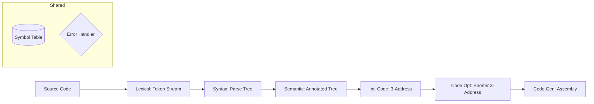

# 🛠️ Module 1: Lexical Analysis & Compiler Basics

## 1. Phases of a Compiler (Example: `a = b + c * 60`)
The compiler transforms code through six specific lenses.

| Phase | Output Example (Simplified) | Key Focus |
| :--- | :--- | :--- |
| **Lexical** | `<id,1> <=> <id,2> <+> <id,3> <*> <60>` | Tokens/Lexemes |
| **Syntax** | Tree with `=` at root, `+` and `*` as children | Grammar/Structure |
| **Semantic** | `inttofloat(60)` | Type Checking |
| **ICG** | `t1 = b * 60.0; t2 = a + t1` | Machine Independent |
| **Code Opt** | `t1 = id3 * 60.0` (removed temps) | Efficiency |
| **Code Gen** | `LDF R2, id3` | Machine Dependent |

## 2. Input Buffering & Sentinels
**The Problem:** Moving the pointer for every character is slow.
**The Solution:** Use **Buffer Pairs** (Two $N$-sized buffers).

*   **Two-Buffer Scheme:** Reload one half while the other is being processed.
*   **Sentinels:** Place an `eof` at the end of *each* buffer half to reduce the number of checks per character from **two** (end of buffer? + what char?) to **one** (is it `eof`?).

## 3. Bootstrapping (T-Diagrams)
To create a compiler for Language **S** (Source), targeting Language **T** (Target), written in Language **I** (Implementation).

*   **Cross Compiler:** A compiler that runs on machine A but generates code for machine B.
*   **Bootstrapping:** Using a simple version of a compiler to compile a more complex version of itself.

---

# 📐 Module 2: Syntax Analysis (Parsing)

## 1. Error Recovery Strategies
| Strategy | Mechanism | Disadvantage |
| :--- | :--- | :--- |
| **Panic-Mode** | Discard input until a **synchronizing token** (`;`, `}`) is found. | Skips large chunks of code. |
| **Phrase-Level** | Local correction (e.g., replace `,` with `;` or insert missing `;`). | May lead to infinite loops. |
| **Error Productions**| Augment grammar with rules for common errors. | Hard to predict all errors. |
| **Global Correction**| Finds the "closest" correct string (minimal changes). | Too costly/Theoretical. |

## 2. Grammar Cleaning (Pre-Processing)
Must be done **before** Top-Down/LL(1) parsing.

### A. Left Recursion Elimination
**Rule:** $A \rightarrow A\alpha \mid \beta$  becomes:
1. $A \rightarrow \beta A'$
2. $A' \rightarrow \alpha A' \mid \epsilon$

### B. Left Factoring (Common Prefixes)
**Rule:** $A \rightarrow \alpha\beta_1 \mid \alpha\beta_2$ becomes:
1. $A \rightarrow \alpha A'$
2. $A' \rightarrow \beta_1 \mid \beta_2$

## 3. LL(1) Parsing Table Logic
A grammar is **LL(1)** if there are no multiple entries in the table.

**Predictive Parsing Algorithm:**
1.  **Input:** String $w\$$, Stack starts with $S\$$ ($S$ is start symbol).
2.  **Compare:** Top of stack $X$ vs. Current input $a$.
    *   If $X == a == \$$, **Accept**.
    *   If $X == a \neq \$$, **Pop** $X$ and **Advance** input.
    *   If $X$ is non-terminal, look up $M[X, a]$.
        *   If $M[X, a] = X \rightarrow Y_1Y_2...Y_k$, **Pop** $X$ and **Push** $Y_k, ..., Y_1$ (reverse order).
        *   If $M[X, a]$ is empty, **Error**.

## 4. Recursive Descent vs. Predictive Parser
| Feature | Recursive Descent (with Backtracking) | Predictive Parser (Non-Recursive) |
| :--- | :--- | :--- |
| **Method** | Recursive function calls for each NT. | Uses a **Stack** and a **Parsing Table**. |
| **Backtracking** | Tries multiple rules; resets pointer on failure. | **No backtracking** (uses lookahead). |
| **Problem** | Very slow; cannot handle Left Recursion. | Requires LL(1) grammar. |

---

# ⚡ Quick Logic Check for LL(1)
*   **FIRST(A):** The set of terminals that can begin a string derived from $A$.
*   **FOLLOW(A):** The set of terminals that can appear immediately to the right of $A$ in some sentential form. 
    *   *Note:* FOLLOW never contains $\epsilon$.
    *   *Note:* The Start Symbol always contains $\$$ in its FOLLOW.
