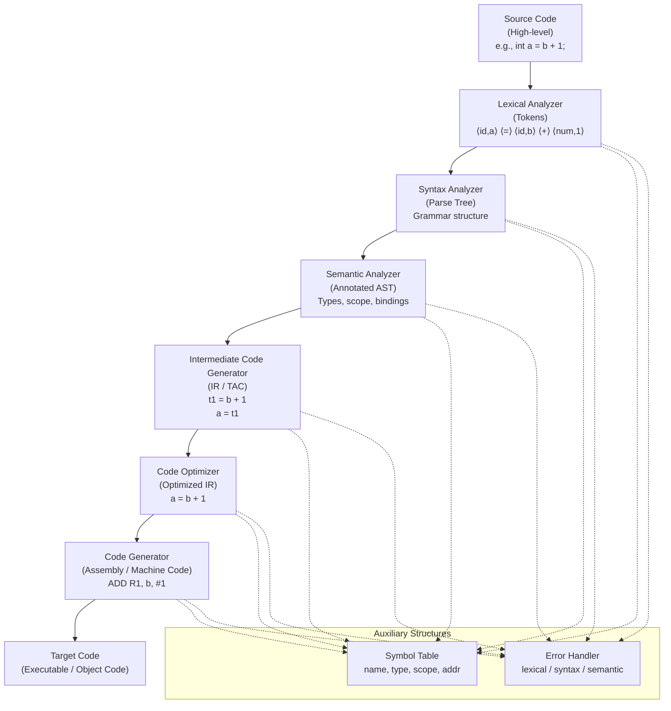
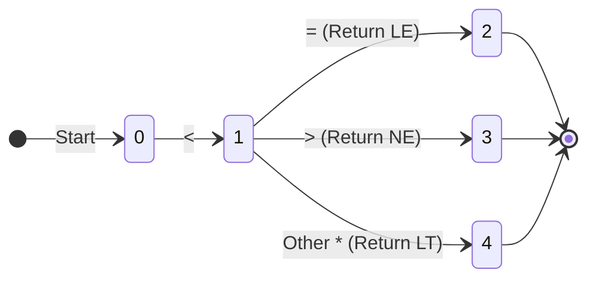

# **1. Phases of a Compiler (8–10 Marks)**
*Frequency: Appears in almost every paper (2022, 2023, 2024).*

### **Definition**
A compiler operates in phases, each transforming the source program from one representation to another. These are grouped into **Analysis** (Front-end) and **Synthesis** (Back-end).

### **The Six Phases**
1.  **Lexical Analysis (Scanning):** Reads the stream of characters and groups them into meaningful sequences called **Lexemes**, producing **Tokens** as output.
2.  **Syntax Analysis (Parsing):** Groups tokens into grammatical phrases. The output is a **Syntax Tree**.
3.  **Semantic Analysis:** Checks for semantic consistency (e.g., type checking). It ensures that operators have matching operands.
4.  **Intermediate Code Generation:** Generates a machine-independent, low-level representation (e.g., Three-Address Code).
5.  **Code Optimization:** Attempts to improve the intermediate code for faster execution and shorter code.
6.  **Target Code Generation:** Maps the intermediate code into the target machine language (Assembly or Machine code).

### **Example Walkthrough: `position = initial + rate * 60`**
*   **Lexical:** `<id,1> <=> <id,2> <+> <id,3> <*> <60>`
*   **Syntax:** (Creates a tree with `=` at the root).
*   **Semantic:** Converts integer `60` to `float` (inttofloat).
*   **Intermediate Code:**
    *   `t1 = inttofloat(60)`
    *   `t2 = id3 * t1`
    *   `t3 = id2 + t2`
    *   `id1 = t3`
*   **Code Optimization:** `t1 = id3 * 60.0` → `id1 = id2 + t1`
*   **Target Code:** `LDF R2, id3`, `MULF R2, #60.0`, etc.

  
Show/hide Diagram

  

---

# **2. Lexemes, Tokens, and Patterns (3–6 Marks)**
*Frequency: Appears as short-note or definition questions (2022, 2023, 2024).*

| Term | Definition | Example (`while (a > b)`) |
| :--- | :--- | :--- |
| **Lexeme** | The sequence of characters in the source code. | `while`, `(`, `a`, `>`, `b`, `)` |
| **Token** | An abstract symbol representing a lexical unit. | `KEYWORD`, `ID`, `RELOP` |
| **Pattern** | The rule describing the set of strings for a token. | `while`, `[a-z]+`, `< | > | <= | >=` |

**PYQ Practice Case:** `sum = a * (b - 10);`
*   **Lexemes:** `sum`, `=`, `a`, `*`, `(`, `b`, `-`, `10`, `;`
*   **Tokens:** `<id, 1>`, `<assign_op>`, `<id, 2>`, `<mult_op>`, `<left_paren>`, `<id, 3>`, `<minus_op>`, `<constant>`, `<right_paren>`, `<semicolon>`

---

# **3. Input Buffering & Sentinels (6–8 Marks)**
*Frequency: High weightage (2023, 2024).*

### **Why is it needed?**
Lexical analysis needs to look ahead (e.g., to see if `=` is followed by another `=` to make `==`). Reading from disk for every character is slow.

### **The Two-Buffer Scheme**
*   Consists of two buffers, each of size $N$ (size of a disk block).
*   Two pointers are used: `lexemeBegin` (start of current lexeme) and `forward` (scans ahead).
*   When `forward` reaches the end of a buffer half, the other half is reloaded.

### **Sentinels (Optimization)**
*   **Problem:** In a standard buffer, we check two conditions for every character: (1) Is it the end of the buffer? (2) What character is it?
*   **Solution:** Place an `eof` (sentinel) at the end of each buffer half.
*   **Advantage:** Most characters only require **one test** (checking if it's `eof`). We only check for the end of the buffer when we actually hit the `eof`.

---

# **4. Transition Diagrams (7–8 Marks)**
*Frequency: Very common for "relop" and "identifier" recognition (2022, 2023, 2024).*

### **Definition**
A flowchart showing how the lexical analyzer moves from state to state as it reads characters.
*   **Circles:** States.
*   **Arrows:** Edges (labeled with the input character).
*   **Double Circle:** Accepting state.
*   **Asterisk (*):** Indicates the `forward` pointer must be **retracted** by one character.

### **Common Diagrams to Practice:**
1.  **Relational Operators (`relop`):** Handles `<`, `<=`, `<>`, `>`, `>=`, `=`.
2.  **Identifiers:** Starts with a letter, followed by letters or digits.
3.  **Unsigned Numbers:** Handles digits, optional decimal points, and optional exponents (E).

  
Show/hide Diagram

  

---

# **5. Bootstrapping (6–7 Marks)**
*Frequency: 2022, 2023, 2024.*

**Definition:** The process of using a compiler to compile itself. It is used to create a **self-hosting compiler**.

**Notation ($S^T_I$):**
A compiler for Source language **S**, Target language **T**, implemented in language **I**.

**The Process:**
To create a compiler for language $L$ on machine $A$:
1.  Write a compiler for a small subset $S$ of $L$ using assembly ($A$).
2.  Write the full compiler for $L$ in the subset $S$.
3.  Compile the full compiler using the subset compiler.

---

# **6. Compiler Construction Tools (6 Marks)**
*Frequency: 2022, 2023, 2024.*

These specialized tools help in building different phases of a compiler efficiently:
1.  **Scanner Generators (e.g., LEX):** Automatically generate lexical analyzers from regular expressions.
2.  **Parser Generators (e.g., YACC):** Produce syntax analyzers from a context-free grammar.
3.  **Syntax-directed Translation Engines:** Generate intermediate code by walking the parse tree.
4.  **Automatic Code Generators:** Use rules to translate intermediate code into machine language.
5.  **Data-flow Analysis Engines:** Help in code optimization by tracking how values move through the program.

---

# **7. LEX and YACC Structure (3-7 Marks)**
*Frequency: Specialized sets (2023).*

*   **LEX:** A tool for generating a scanner. The file has three sections: `Definitions`, `%%`, `Rules`, `%%`, `User Subroutines`.
*   **YACC (Yet Another Compiler-Compiler):** A tool for generating a parser. It works with Lex to turn tokens into a syntax tree. It uses a similar three-section structure.
