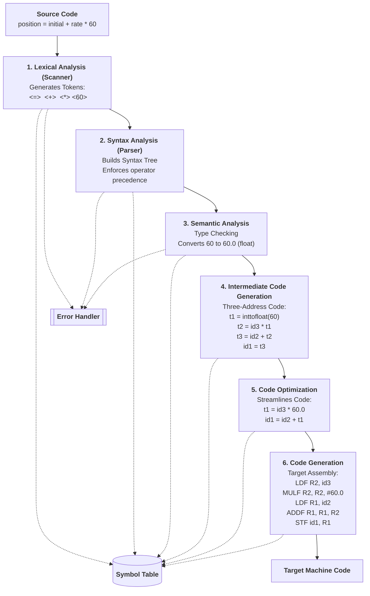
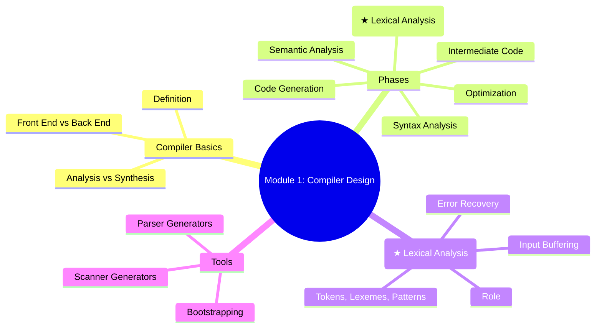

### **Module 1 Cheatsheet: Introduction to Compilers & Lexical Analysis**

#### **1. What is a Compiler? (Core Definition)**
A **compiler** is a program that **translates** a source program (high-level language) into an equivalent **target program** (usually machine code or assembly) and reports errors.

**Mnemonic**: Compiler = **C**onverts **O**ne language **M**eaningfully **P**roducing **I**nstructions **L**egally **E**rror-free **R**esult

#### **2. Phases of a Compiler (Most Important – 6 Phases)**

**Mnemonic to remember order**: **L**exical **S**yntax **S**emantic **I**ntermediate **O**ptimization **G**eneration  
→ **LSSIOG** (sounds like “Let’s See Some Interesting Optimization Goals”)



**Simple Flow Memory Trick**:
Source → **Lex** (breaks into words) → **Syntax** (makes sentences) → **Semantic** (checks meaning) → **ICG** (abstract code) → **Optimize** (makes faster/smaller) → **Generate** (real machine code)

#### **3. Analysis Phase vs Synthesis Phase (Grouping of Phases)**

| Aspect              | **Analysis Phase (Front End)**          | **Synthesis Phase (Back End)**       |
|---------------------|-----------------------------------------|--------------------------------------|
| What it does        | Breaks source code                      | Builds target code                   |
| Phases included     | Lexical + Syntax + Semantic + ICG       | Optimization + Code Generation       |
| Main work           | Understand the program                  | Create efficient executable          |
| Output              | Intermediate Representation + Symbol Table | Final Target Code                   |

**Mnemonic**: **A**nalysis = **A**natomy (breaking down), **S**ynthesis = **S**urgery (building up)

#### **4. Lexical Analysis – Role & Details (Very Important for Exams)**

**Role of Lexical Analyzer (Scanner)**:
- Reads character stream
- Groups characters into **lexemes**
- Produces **tokens** for parser
- Removes whitespace & comments
- Interacts with Symbol Table
- Handles lexical errors

**Key Terms** (Memorize with example):

| Term       | Meaning                                      | Example from `position = initial + rate * 60` |
|------------|----------------------------------------------|-----------------------------------------------|
| **Lexeme** | Actual sequence of characters in source      | `position`, `=`, `initial`, `+`, `rate`, `*`, `60` |
| **Token**  | Abstract symbol + optional attribute         | `<id,1>`, `<=>`, `<+>`, `<*>`, `<60>`         |
| **Pattern**| Rule that describes valid lexemes            | `id → letter(letter|digit)*`                  |

**Mnemonic for Lexeme-Token-Pattern**:
**L**exeme = **L**iteral text you **see**  
**T**oken = **T**ype + pointer you **use** in parsing  
**P**attern = **P**rule that matches it

#### **5. Input Buffering Schemes (Question Bank Favourite)**

**One Buffer Scheme**:
- Single buffer
- **Disadvantages** (Memorize 3):
  1. Cannot look ahead beyond buffer end
  2. Frequent refill when near end
  3. Slow for large lookahead

**Two Buffer Scheme** (Standard):
- Two buffers of size N each
- Lexeme may span both
- **Disadvantage**: When lexeme is very long (near 2N), it fails
- **Solution**: Use **Sentinel** (special character at end) to reduce boundary checks

#### **6. Compiler Writing Tools**

**Mnemonic**: **P**arser **S**canner **S**yntax **A**utomatic **D**ata **C**onstruction  
→ **PSSADC** tools

1. **Parser Generators** (YACC/Bison) → Syntax Analyzer
2. **Scanner Generators** (LEX/Flex) → Lexical Analyzer
3. **Syntax-directed Translation Engines**
4. **Automatic Code Generators**
5. **Data-flow Analysis Engines**
6. **Compiler Construction Toolkits**

#### **7. Bootstrapping & Cross Compiler (3-mark & 9-mark questions)**

**Bootstrapping**: Writing a compiler in its own language (self-hosting).

**T-Diagram Memory Trick**:
```
S → T     (Source to Target)
  I       (Implemented in)
```

**Steps to develop cross compiler using bootstrapping** (when S_M runs on S_A):
1. Write small compiler S in assembly of A
2. Write full compiler L in subset of L
3. Compile using small compiler → get L on A
4. Use it to compile for new machine B

#### **8. Error Recovery Strategies in Lexical Phase**

- **Panic Mode**: Delete tokens until synchronizing token found
- **Phase Level**: Local correction + continue
- **Error Productions**: Add rules for common mistakes
- **Global Correction**: Minimum changes (costly)

**Mnemonic**: **P**anic **P**hase **E**rror **G**lobal → **PPEG**

---

### **Quick Revision Mindmap (Copy-Paste Ready)**




You’ve got this! Keep revising with these visuals and points.
