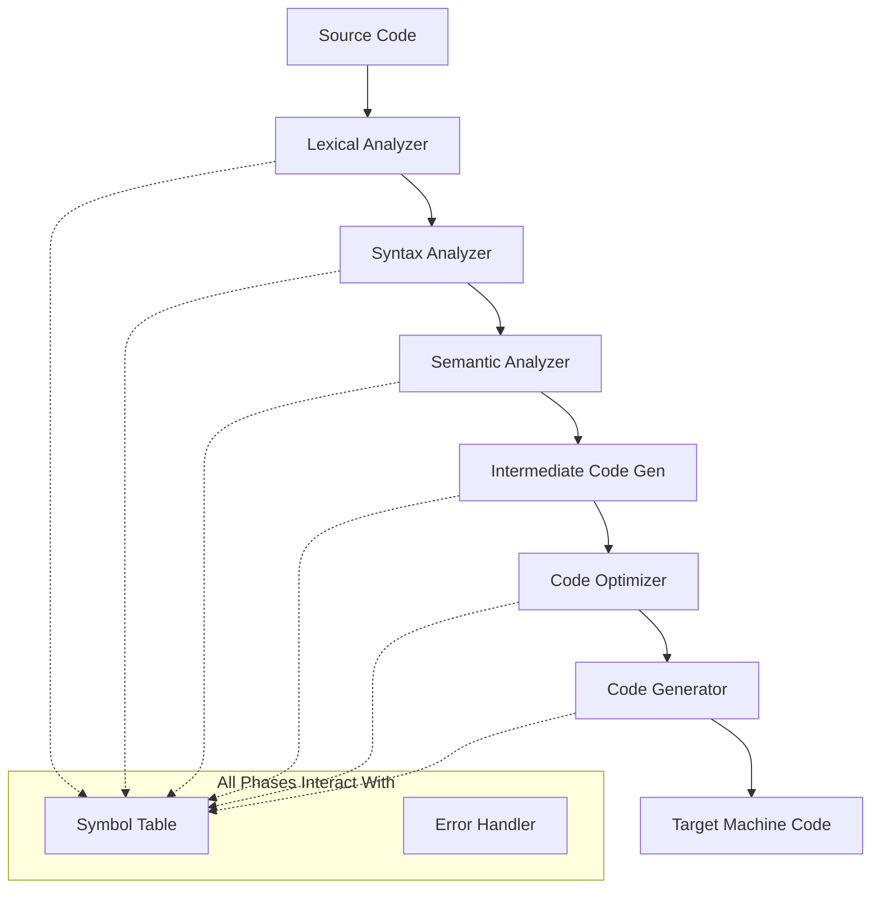
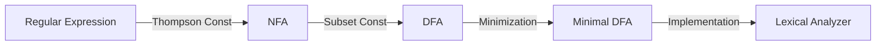
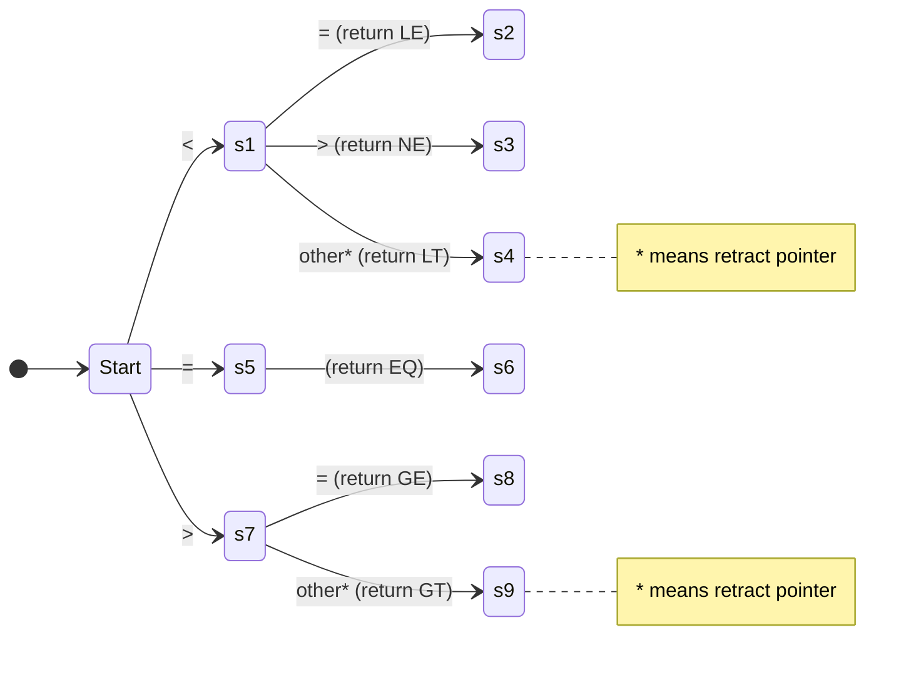
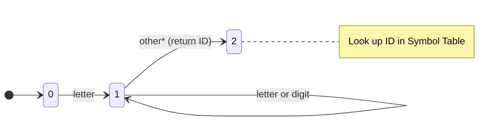
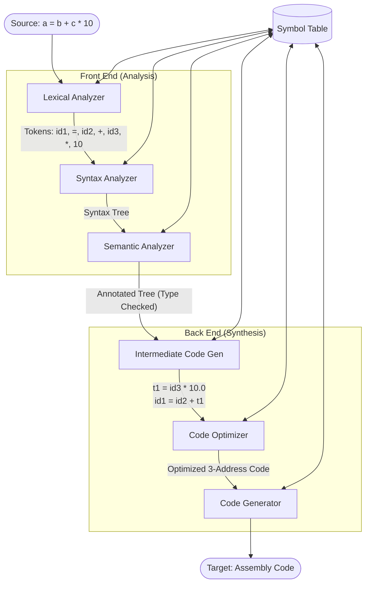

# 🚀 Compiler Design (CST 302) - Module 1 Cheatsheet

## 1. Phases of a Compiler (The "Front End" vs "Back End")
A compiler operates in a linear sequence of phases, all interacting with the **Symbol Table** and **Error Handler**.



| Phase | Input | Output | Primary Task |
| :--- | :--- | :--- | :--- |
| **Lexical** | Source Code | Token Stream | Group characters into lexemes. |
| **Syntax** | Tokens | Parse Tree | Check grammar (CFG). |
| **Semantic** | Parse Tree | Annotated Tree | Type checking & scope verification. |
| **Int. Code** | Annotated Tree | Intermediate Rep (IR) | Generate machine-independent code. |
| **Code Opt.** | IR | Optimized IR | Reduce time/space complexity. |
| **Code Gen.** | Optimized IR | Target Code | Map IR to registers/machine instructions. |

---

## 2. Input Buffering & Sentinels
To speed up Lexical Analysis, we use buffers to minimize I/O operations.

### Buffer Schemes Comparison
| Feature | One-Buffer Scheme | Two-Buffer (Double) | Sentinels (Improved 2-Buffer) |
| :--- | :--- | :--- | :--- |
| **Mechanism** | One block of memory. | Two halves; one loads while other processes. | Uses `EOF` at the end of each buffer half. |
| **Pros** | Simple. | Faster; reduces reloading. | **Most Efficient**: Only one test per character. |
| **Cons** | Lexeme can't exceed buffer size. | Complexity in handling edges. | Slightly more memory used for `EOF`. |

**The Sentinel Advantage:** Instead of checking "Is the pointer at the end of buffer?" AND "What is this character?", we only check the character. If it's `EOF`, then we know the buffer is empty.

---

## 3. Compiler Construction Tools
Specialized software used to automate compiler development.

*   **Scanner Generators (LEX/FLEX):** Generates Lexical Analyzers from Regular Expressions.
*   **Parser Generators (YACC/BISON):** Generates Syntax Analyzers from Context-Free Grammars.
*   **Syntax-Directed Translation Engines:** Produce IR by walking the parse tree.
*   **Data-Flow Analysis Engines:** Used for code optimization.
*   **Code-Generator Generators:** Uses rules to map IR to target machine code.

---

## 4. Bootstrapping & Cross Compilers
### T-Diagram Logic
A compiler is defined by 3 languages: **S** (Source), **T** (Target), and **I** (Implementation/Written-in).

```text
       S -----> T
          | I |
```

*   **Cross Compiler:** A compiler that runs on Machine A but generates code for Machine B.
*   **Bootstrapping:** The process of using a compiler to compile a newer version of itself. 
    *   *Example:* To write a C compiler ($C_{new}$) in C, you first use an existing older C compiler ($C_{old}$) to compile the $C_{new}$ source code.

---

## 5. Token Recognition Flow
How a Lexical Analyzer identifies a "word":



*   **Lexeme:** The actual sequence of characters (e.g., `int`, `123`).
*   **Token:** The abstract symbol (e.g., `KEYWORD`, `NUMBER`).
*   **Pattern:** The rule describing the set of strings (e.g., `[0-9]+`).

---

You are absolutely right! Transition diagrams are a staple for **Part B** questions in Module 1. Here is the missing piece for your cheatsheet, focusing on **Relational Operators (relop)**, **Identifiers**, and **Numbers**.

---

## 6. Transition Diagrams (Recognition of Tokens)
In a Lexical Analyzer, transition diagrams are used to represent how a DFA (Deterministic Finite Automata) recognizes specific tokens.

### A. Relational Operators (`relop`)
This is the most asked diagram. It handles `<`, `<=`, `<>`, `==`, `>`, and `>=`.



### B. Identifiers (ID)
**Rule:** Must start with a letter, followed by letters or digits.



---

## 7. Summary Table: Token Identification Details
When the Lexical Analyzer finds a match, it performs specific actions:

| Token | Lexeme (Example) | Pattern (Regular Expression) | Action / Return Value |
| :--- | :--- | :--- | :--- |
| **Relop** | `<>` | `< \| <= \| > \| >= \| <> \| =` | Return (`RELOP`, `NE`) |
| **Identifier** | `count` | `letter(letter \| digit)*` | Check Symbol Table; Return `ID` |
| **Keyword** | `if` | `i f` | Return `IF` (Fixed String) |
| **Number** | `3.14` | `digit+ ( . digit+ )?` | Return (`NUM`, `value`) |

---

## Phases of compiler (example)

### 1. The Compilation Trace: `a = b + c * 10`

| Phase | Input | Output (Intermediate Representation) |
| :--- | :--- | :--- |
| **1. Lexical Analysis** | `a = b + c * 10` | Tokens: `<id,1> <=> <id,2> <+> <id,3> <*> <num,10>` |
| **2. Syntax Analysis** | Token Stream | **Syntax Tree:** (Multiplication is deeper than addition due to precedence) |
| **3. Semantic Analysis** | Syntax Tree | **Annotated Tree:** Adds `inttofloat` conversion for the number `10` |
| **4. Intermediate Code Gen** | Annotated Tree | **Three-Address Code (TAC):** <br> `t1 = inttofloat(10)` <br> `t2 = id3 * t1` <br> `t3 = id2 + t2` <br> `id1 = t3` |
| **5. Code Optimization** | TAC | **Optimized TAC:** <br> `t1 = id3 * 10.0` <br> `id1 = id2 + t1` |
| **6. Code Generation** | Optimized TAC | **Assembly Code:** <br> `LDF R2, id3` (Load Float) <br> `MULF R2, R2, #10.0` <br> `LDF R1, id2` <br> `ADDF R1, R1, R2` <br> `STF id1, R1` (Store Float) |

---

### 2. Mermaid Diagram: Visualizing the Flow
This diagram illustrates the input/output relationship between the phases.



---

### 3. Key Details to Include for Full Marks:

1.  **Lexical Phase**: Mention that `id1`, `id2`, and `id3` are pointers to the **Symbol Table** entries for `a`, `b`, and `c`.
2.  **Syntax Phase**: Explain that the tree structure enforces **Operator Precedence** (multiplication happens before addition).
    *   *Visual Tip:* In your hand-drawn diagram, put the `*` node lower than the `+` node.
3.  **Semantic Phase**: Highlight **Type Conversion**. Since `a, b, c` are floats, the compiler must convert the integer `10` to `10.0` so the math works.
4.  **Intermediate Code (TAC)**: Use the `t1, t2, t3` notation. It stands for "temporary variables."
5.  **Optimization**: Show that you reduced the number of steps (e.g., combining the `inttofloat` conversion into the multiplication line).
6.  **Code Generation**: Mention that this phase deals with **Registers** (R1, R2) and specific machine instructions (LDF/MULF).
