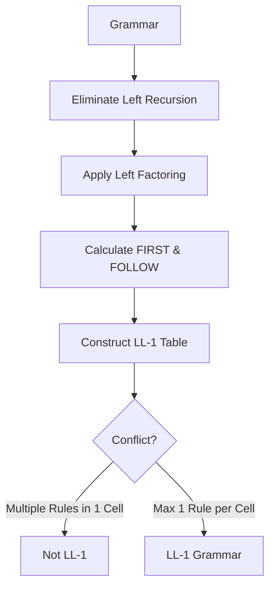
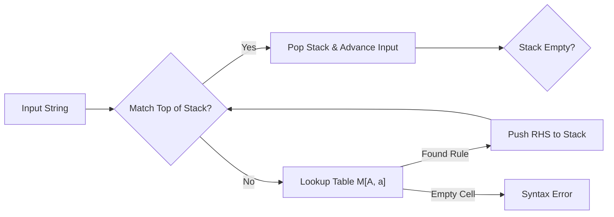

# 🚀 Compiler Design (CST 302) - Module 2 Cheatsheet

## 1. Grammar Pre-Processing (Essential for Top-Down Parsing)
Top-down parsers (LL(1)) cannot handle **Left Recursion** or **Ambiguous Prefixes**.

| Problem | Rule Example | Solution (New Rules) |
| :--- | :--- | :--- |
| **Left Recursion** | $A \rightarrow A\alpha \mid \beta$ | $A \rightarrow \beta A'$   $A' \rightarrow \alpha A' \mid \epsilon$ |
| **Left Factoring** | $A \rightarrow \alpha\beta_1 \mid \alpha\beta_2$ | $A \rightarrow \alpha A'$   $A' \rightarrow \beta_1 \mid \beta_2$ |

---

## 2. Ambiguity & The "Dangling Else"
A grammar is **ambiguous** if one string produces $\geq 2$ Parse Trees or Leftmost Derivations (LMD).

### The Dangling Else Problem
**Ambiguous:** $S \rightarrow \text{if } E \text{ then } S \mid \text{if } E \text{ then } S \text{ else } S \mid a$
**The Logic:** An `else` should always match the closest unmatched `then`.

**Unambiguous Fix (Conceptual):**
1.  **Matched Statement:** An `if-then-else` where the nested statement is also matched.
2.  **Open Statement:** An `if-then` or an `if-then-else` where the nested statement is open.

---

## 3. FIRST and FOLLOW Rules (The "DNA" of LL(1))
These sets determine where a production rule should be placed in the parsing table.

### FIRST(X) Rules
1.  If $X$ is a **terminal**, $FIRST(X) = \{X\}$.
2.  If $X \rightarrow \epsilon$, then add $\epsilon$ to $FIRST(X)$.
3.  If $X \rightarrow Y_1 Y_2...Y_n$:
    *   Add $FIRST(Y_1)$ to $FIRST(X)$.
    *   If $Y_1 \rightarrow \epsilon$, add $FIRST(Y_2)$... and so on.

### FOLLOW(A) Rules

1. If **A** is the **start symbol**, then  
   FOLLOW(A) = { $ }.

2. If there is a production  
   B → α A β,  
   then **everything in FIRST(β) except ε** is added to FOLLOW(A).

3. If there is a production  
   B → α A  
   **or**  
   B → α A β where **ε ∈ FIRST(β)**,  
   then **everything in FOLLOW(B)** is added to FOLLOW(A).

---

## 4. LL(1) Parsing Table Construction
To be **LL(1)**, every cell in the table must contain **at most one** rule.

### Table Entry Rules:
For each production $A \rightarrow \alpha$:
1.  For every terminal $a \in FIRST(\alpha)$, add $A \rightarrow \alpha$ to $M[A, a]$.
2.  If $\epsilon \in FIRST(\alpha)$, for every terminal $b \in FOLLOW(A)$, add $A \rightarrow \alpha$ to $M[A, b]$.

---

## 5. Recursive Descent vs. Predictive Parsers
Both are Top-Down parsers, but they differ in how they handle choices.

| Feature | Recursive Descent | Predictive Parser (Non-Recursive) |
| :--- | :--- | :--- |
| **Method** | Uses a set of recursive procedures. | Uses an explicit Stack and a Parsing Table. |
| **Backtracking** | May use backtracking (trial and error). | **No backtracking** (lookahead symbol decides). |
| **Efficiency** | Slower (high overhead). | Faster and more systematic. |
| **Requirement** | Simple grammar. | Grammar must be LL(1). |

---

## 6. Logic Flow for Part B Problems
When solving a 10-14 mark question, follow this exact order:

1.  **Check for Left Recursion:** If $A \rightarrow A...$ exists, fix it first.
2.  **Check for Left Factoring:** If rules share a prefix, fix it.
3.  **Compute FIRST:** Start from bottom non-terminals and move up.
4.  **Compute FOLLOW:** Start from the Start Symbol ($\$$).
5.  **Build Table:** Rows = Non-terminals, Columns = Terminals.
6.  **Verify LL(1):** Explicitly state: "Since there are no multiple entries, the grammar is LL(1)."

This is the most common 10–14 mark question in **Module 2**. We will solve the classic **Arithmetic Expression Grammar**, as it covers every single rule (Left Recursion, FIRST/FOLLOW, and Table Construction).

---

## 🧠 Worked Solution: LL(1) Analysis
**Question:** Check if the following grammar is LL(1) and construct the parsing table:
$E \rightarrow E + T \mid T$
$T \rightarrow T * F \mid F$
$F \rightarrow ( E ) \mid \text{id}$

---

### Step 1: Eliminate Left Recursion
The grammar is **Left Recursive** (e.g., $E \rightarrow E + T$). We must fix it before calculating FIRST/FOLLOW.

**Modified Grammar ($G'$):**
1. $E \rightarrow T E'$
2. $E' \rightarrow + T E' \mid \epsilon$
3. $T \rightarrow F T'$
4. $T' \rightarrow * F T' \mid \epsilon$
5. $F \rightarrow ( E ) \mid \text{id}$

---

### Step 2: Calculate FIRST and FOLLOW Sets
*Rules applied: FIRST looks forward at the first terminal; FOLLOW looks at what comes after the non-terminal in the RHS.*

| Non-Terminal | FIRST | FOLLOW |
| :--- | :--- | :--- |
| **E** | { (, id } | { $, ) } |
| **E'** | { +, $\epsilon$ } | { $, ) } |
| **T** | { (, id } | { +, $, ) } |
| **T'** | { *, $\epsilon$ } | { +, $, ) } |
| **F** | { (, id } | { *, +, $, ) } |

---

### Step 3: Construct the LL(1) Parsing Table
To fill the table, for rule $A \rightarrow \alpha$:
1. Place the rule under columns in $FIRST(\alpha)$.
2. If $\epsilon \in FIRST(\alpha)$, place the rule under columns in $FOLLOW(A)$.

| NT | id | + | * | ( | ) | $ |
| :--- | :--- | :--- | :--- | :--- | :--- | :--- |
| **E** | $E \rightarrow TE'$ | | | $E \rightarrow TE'$ | | |
| **E'** | | $E' \rightarrow +TE'$ | | | $E' \rightarrow \epsilon$ | $E' \rightarrow \epsilon$ |
| **T** | $T \rightarrow FT'$ | | | $T \rightarrow FT'$ | | |
| **T'** | | $T' \rightarrow \epsilon$ | $T' \rightarrow *FT'$ | | $T' \rightarrow \epsilon$ | $T' \rightarrow \epsilon$ |
| **F** | $F \rightarrow \text{id}$ | | | $F \rightarrow (E)$ | | |

**Result:** Since no cell has multiple entries, the grammar is **LL(1)**.

---

### Step 4: Logic Flow of a Predictive Parser
If the exam asks **"Show the parsing steps for string id + id"**, use this stack-based logic:

---

### 📝 Common Mistakes to Avoid (Exam Checklist)
1.  **Forgetting $\$$ in FOLLOW:** The Start Symbol ($E$) **always** includes $\$$ in its FOLLOW set.
2.  **The $\epsilon$ Rule:** When applying a rule like $E' \rightarrow \epsilon$, you don't look at $FIRST(\epsilon)$. You look at **FOLLOW(E')** to decide where to put it in the table.
3.  **Retracting in FOLLOW:** When calculating $FOLLOW(T)$, and you see $E \rightarrow TE'$, you must include everything in $FIRST(E')$ **except $\epsilon$**. Since $E'$ can be $\epsilon$, you also must include **FOLLOW(E)**.
4.  **Terminals in Table:** Ensure the columns only contain Terminals ($id, +, *, (, ), \$$) and rows only contain Non-Terminals ($E, E', T, T', F$).

---

### 💡 Pro-Tip for Part B:
If the question asks to **"Prove the grammar is LL(1)"**, follow these three steps:
1.  Construct the Table.
2.  Point to the table and state: *"For every entry $M[A, a]$, there is at most one production."*
3.  (Optional but impressive) Mention that $FIRST(A \rightarrow \alpha)$ and $FIRST(A \rightarrow \beta)$ are disjoint.
