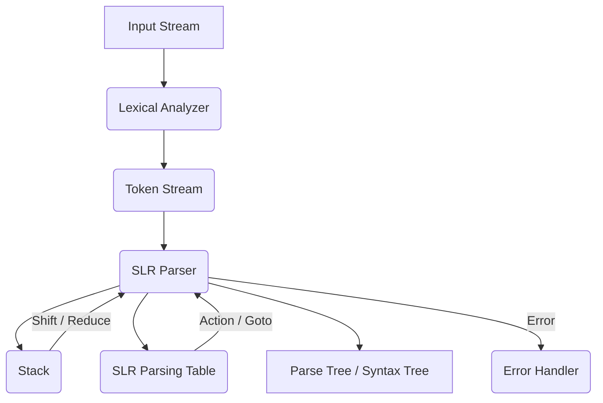

## 📝 Key Concepts for Grammar Transformations

In compiler design, particularly in the syntax analysis phase, grammars often need to be transformed to be suitable for certain parsing techniques, especially top-down parsers. Two crucial transformations are:

1.  **Eliminating Left Recursion**
2.  **Left Factoring**

These transformations ensure that the parser can make unambiguous decisions and avoid infinite loops.

---

### 1. Eliminating Left Recursion

**Purpose:** Left recursion (e.g., `A → Aα`) leads to infinite loops in top-down parsers because the parser would repeatedly try to expand the same non-terminal without consuming any input.

**Definition:** A grammar is left-recursive if there is a non-terminal `A` such that `A → Aα` for some string `α`, or more generally, `A →* Aα` (meaning `A` can derive `Aα` in one or more steps).

**Rule for Immediate Left Recursion:**

If you have a production of the form:
`A → Aα | β`

where `β` does not start with `A` (i.e., `β` is not left-recursive), you can eliminate immediate left recursion by replacing it with two new productions:

`A → βA'`
`A' → αA' | ε` (where `ε` represents the empty string)

**Simple Trick to Memorize:**
"If A sees A on the left, make A go right with A-prime, and A-prime takes what A had, plus itself or nothing."

**Example:**
Consider the grammar:
`E → E + T | T`

Here:
*   `A` is `E`
*   `α` is `+ T`
*   `β` is `T`

Applying the rule:
1.  Replace `E → E + T | T` with `E → T E'`
2.  Add a new production for `E'`: `E' → + T E' | ε`

**Transformed Grammar:**
`E → T E'`
`E' → + T E' | ε`

---

### 2. Left Factoring

**Purpose:** Left factoring is required when a non-terminal has multiple productions that start with the same symbol (common prefix). This makes it difficult for a top-down parser to decide which production to choose without looking ahead.

**Definition:** A grammar is left-factored if, for any non-terminal `A`, if `A → αβ1 | αβ2` are two distinct productions, then `β1` and `β2` must not have a common prefix.

**Rule for Left Factoring:**

If you have productions like:
`A → αβ1 | αβ2 | ... | αβn | γ`

where `α` is the longest common prefix among two or more alternatives, and `γ` represents alternatives that do not start with `α`.

You can left factor by replacing these productions with:

`A → αA' | γ`
`A' → β1 | β2 | ... | βn`

**Simple Trick to Memorize:**
"Factor out the common start, make a new A-prime for the rest."

**Example:**
Consider the grammar:
`S → iEtS | iEtSeS | a`

Here:
*   `A` is `S`
*   The common prefix `α` is `iEtS`
*   `β1` is `ε` (from `iEtS`)
*   `β2` is `eS` (from `iEtSeS`)
*   `γ` is `a`

Applying the rule:
1.  Identify the common prefix: `iEtS`
2.  Factor it out and introduce `S'`:
    `S → iEtSS' | a`
3.  Define `S'` with the remaining parts:
    `S' → ε | eS`

**Transformed Grammar:**
`S → iEtSS' | a`
`S' → ε | eS`

Here are notes on parser design, covering Recursive Descent and SLR parsers, essential topics for compiler design exams.

## 📝 Key Concepts for Parser Design

Parsers are a fundamental part of a compiler's front end, responsible for taking a stream of tokens (output from the lexical analyzer) and building a parse tree or an abstract syntax tree. This process, called syntax analysis, verifies that the input program conforms to the grammar rules of the language.

Two major categories of parsers are:

1.  **Top-Down Parsers** (e.g., Recursive Descent, Predictive Parsers)
2.  **Bottom-Up Parsers** (e.g., SLR, LR(1), LALR)

---

### 1. Recursive Descent Parser

**Purpose:** A recursive descent parser is a top-down parser that directly implements a set of recursive procedures (functions) for each non-terminal in the grammar. Each non-terminal corresponds to a procedure that tries to match a part of the input string to that non-terminal's production rule.

**Working Principle:**
*   Each non-terminal in the grammar has a dedicated procedure (function).
*   The procedure for a non-terminal `A` examines the current input token to decide which production rule for `A` to apply.
*   If a production rule contains terminals, they are matched directly with input tokens.
*   If a production rule contains non-terminals, their corresponding procedures are called recursively.
*   Parsing begins by calling the procedure for the start symbol.

**Key Components & Derivations:**
1.  **Grammar Preparation:** The grammar must be free of left recursion and typically left-factored to enable deterministic parsing (without backtracking).
2.  **Procedure for each Non-Terminal:**
    *   For a non-terminal `A`, a procedure `A()` is created.
    *   Inside `A()`, it checks the lookahead symbol (the current input token).
    *   Based on the lookahead, it selects the appropriate production rule for `A`.
    *   It then sequentially calls procedures for non-terminals and matches terminals as dictated by the chosen production.
    *   If no production matches the lookahead, or if a terminal mismatch occurs, an error is reported.

**Example Grammar (Arithmetic Expressions):**
Let's consider a simple grammar for arithmetic expressions (after eliminating left recursion and left factoring):

Original Grammar (left-recursive and ambiguous):
`E → E + T | T`
`T → T * F | F`
`F → (E) | id`

Transformed Grammar (suitable for Recursive Descent):
`E → T E'`
`E' → + T E' | ε`
`T → F T'`
`T' → * F T' | ε`
`F → (E) | id`

**Pseudocode for Transformed Grammar:**

```pseudocode
// Global variable for the current lookahead token
token lookahead;

// Function to advance to the next token
void match(terminal t) {
    if (lookahead == t) {
        lookahead = getNextToken();
    } else {
        error("Syntax error: expected " + t);
    }
}

void F() {
    if (lookahead == '(') {
        match('(');
        E();
        match(')');
    } else if (lookahead == 'id') {
        match('id');
    } else {
        error("Syntax error: expected '(' or 'id'");
    }
}

void T_prime() { // T'
    if (lookahead == '*') {
        match('*');
        F();
        T_prime();
    }
    // If lookahead is not '*', it implies epsilon (ε), so do nothing.
    // This assumes T' can derive epsilon, which is handled by simply returning.
}

void T() {
    F();
    T_prime();
}

void E_prime() { // E'
    if (lookahead == '+') {
        match('+');
        T();
        E_prime();
    }
    // If lookahead is not '+', it implies epsilon (ε), so do nothing.
}

void E() {
    T();
    E_prime();
}

// Main parsing function
void parse() {
    lookahead = getNextToken(); // Initialize lookahead
    E(); // Start with the start symbol
    if (lookahead == END_OF_INPUT) {
        success("Parsing successful!");
    } else {
        error("Syntax error: unexpected tokens at end of input");
    }
}
```

**Drawbacks of Recursive Descent Parser and Solutions:**
1.  **Left Recursion:** Leads to infinite loops.
    *   **Solution:** Eliminate left recursion from the grammar through transformations (e.g., `A → Aα | β` becomes `A → βA'`, `A' → αA' | ε`).
2.  **Ambiguity:** If the grammar is ambiguous, the parser might not know which production to choose, leading to incorrect parse trees.
    *   **Solution:** Rewrite the grammar to remove ambiguity, often by incorporating operator precedence and associativity into the grammar rules.
3.  **Backtracking:** Simple recursive descent parsers might need to try different productions and backtrack if a choice leads to a dead end. This can be inefficient.
    *   **Solution:** **Predictive Parsing** (a form of recursive descent without backtracking). This requires the grammar to be `LL(1)` (Left-to-right scan, Leftmost derivation, 1-token lookahead). Achieved through:
        *   **Left Factoring:** Eliminates common prefixes to make deterministic choices based on the next input token.
        *   Using **FIRST** and **FOLLOW** sets to determine which production to apply without backtracking.
4.  **Grammar Complexity:** Manual implementation for complex grammars can be tedious and error-prone.
    *   **Solution:** Use parser generators (like YACC/Bison for LR parsers) or build predictive parsers based on parsing tables.

---

### 2. SLR Parser (Simple LR Parser)

**Purpose:** SLR (Simple LR) is a type of bottom-up parser. It constructs a parse tree by starting from the input tokens (leaves) and working its way up to the start symbol (root) by applying reduction rules. SLR parsers are more powerful than predictive parsers and can handle a larger class of grammars.

**Working Principle (Shift-Reduce Parsing):**
*   **Shift:** Moves the next input symbol onto the stack.
*   **Reduce:** If the top of the stack matches the right-hand side of a production rule `A → β`, it replaces `β` on the stack with `A`.
*   **Accept:** If the stack contains only the start symbol and the input is exhausted, the parse is successful.
*   **Error:** If no shift, reduce, or accept action is possible, a syntax error is declared.

**Key Algorithm: Sets-of-Items Construction for SLR Parser**

The core of an SLR parser is its parsing table, which is built using the "canonical collection of LR(0) items."

1.  **Augment the Grammar:** Create a new start production `S' → S`, where `S'` is a new start symbol and `S` is the original start symbol. This helps in identifying the accept state.
    *   *Example:* For `E → E + T | T`, augment to `E' → E`.

2.  **Define an LR(0) Item:** An LR(0) item is a production rule with a dot (`.`) somewhere in its right-hand side, indicating how much of the production has been seen so far.
    *   *Example:* `E → .T E'` means we are looking for a `T` followed by an `E'`.

3.  **Closure Operation:** For a set of items `I`:
    *   Initially, `closure(I)` is `I`.
    *   If `A → α.Bβ` is in `closure(I)` and `B` is a non-terminal, then for every production `B → γ` in the grammar, add `B → .γ` to `closure(I)`.
    *   Repeat until no new items can be added.
    *   *This process adds all items representing non-terminals that can be derived from the symbol immediately after the dot.*

4.  **GOTO Operation:** `goto(I, X)` calculates the set of items that the parser transitions to from state `I` after seeing a grammar symbol `X` (terminal or non-terminal).
    *   `goto(I, X)` is the closure of all items `A → αX.β` where `A → α.Xβ` is in `I`.
    *   *This operation simulates the "shift" or "reduce" based on the symbol X.*

5.  **Construct the Canonical Collection of LR(0) Items (DFA States):**
    *   **Start State (I0):** `I0 = closure({S' → .S})`.
    *   **Iteration:** For each state `I` in the collection and for each grammar symbol `X` (terminal or non-terminal):
        *   Compute `J = goto(I, X)`.
        *   If `J` is not empty and not already in the collection, add `J` to the collection.
        *   Record the transition from `I` to `J` on symbol `X`.
    *   Repeat until no new states can be generated.
    *   *The resulting collection of states forms a Deterministic Finite Automaton (DFA) that recognizes viable prefixes of the grammar.*

**Parsing Table Construction (Action and GOTO tables):**
Once the canonical collection of items is built, the SLR parsing table is constructed as follows:

1.  **ACTION Table (State x Terminal):**
    *   If `A → α.aβ` is in state `Ii` and `goto(Ii, a) = Ij` (where `a` is a terminal), then `ACTION[i, a] = shift j`.
    *   If `A → α.` is in state `Ii` (where `A ≠ S'`), then for every terminal `a` in `FOLLOW(A)`, `ACTION[i, a] = reduce A → α`.
    *   If `S' → S.` is in state `Ii`, then `ACTION[i, $] = accept` (where `$` is the end-of-input marker).
    *   **Conflicts:** If any cell has both shift and reduce actions, or multiple reduce actions, the grammar is not SLR(1).

2.  **GOTO Table (State x Non-Terminal):**
    *   If `goto(Ii, A) = Ij` (where `A` is a non-terminal), then `GOTO[i, A] = j`.

**Conceptual Diagram for SLR Parsing:**


**SLR Parser Limitations:**
SLR parsers are simpler to construct but less powerful than canonical LR(1) or LALR parsers. They can encounter shift-reduce or reduce-reduce conflicts for certain grammars, especially when the `FOLLOW` sets are large, leading to situations where the parser cannot deterministically decide on an action. This is because SLR uses only LR(0) items and the `FOLLOW` set for reduce decisions, which might not always provide enough context.
