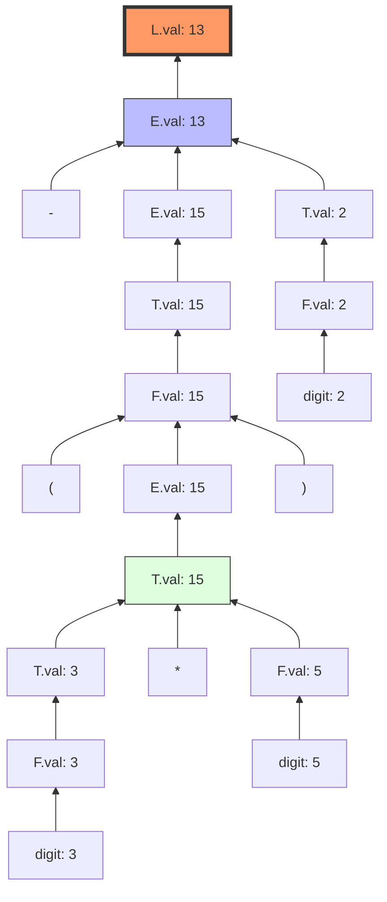
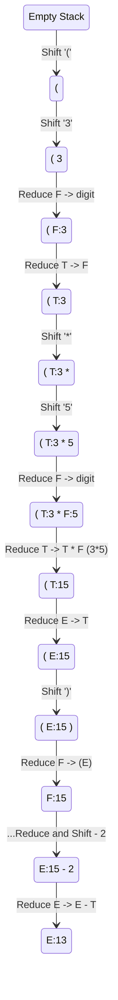
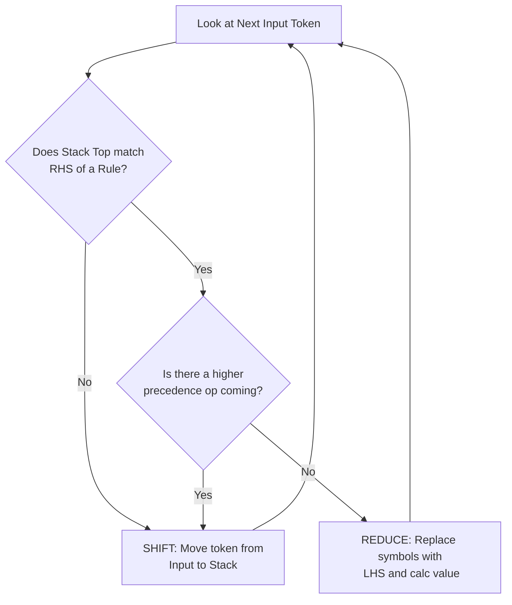

To help you visualize how a compiler actually "thinks" during bottom-up evaluation, we can use Mermaid diagrams to show the **Annotated Parse Tree** and the **Stack States**.

### 1. The Annotated Parse Tree (The "Goal")
In bottom-up evaluation, we start at the leaves (the numbers) and work our way up to the root ($L$). Each node shows the value ($val$) calculated from its children.

---

### 2. Stack Evolution (The "Process")
Bottom-up parsing uses a **Stack**. Think of the stack as a tray where we pile symbols until they match a rule in our SDD. Once they match, we "Reduce" (replace the pile with a single result).

Here is the flow of the stack for `(3*5)-2`:

---

### 3. Shift vs. Reduce Logic
If you are confused about when to "Shift" and when to "Reduce," follow this logic flow:

### Key Takeaways for your SDD:
1.  **Shift:** You are "waiting" for more information (like waiting for the `5` after seeing `3 *`).
2.  **Reduce:** You have found a complete "phrase" (like `3 * 5`) and can now perform the math.
3.  **Synthesis:** In a bottom-up SDD, values always flow **upward** from the children to the parent. This is why it is called "Synthesized Attributes."
