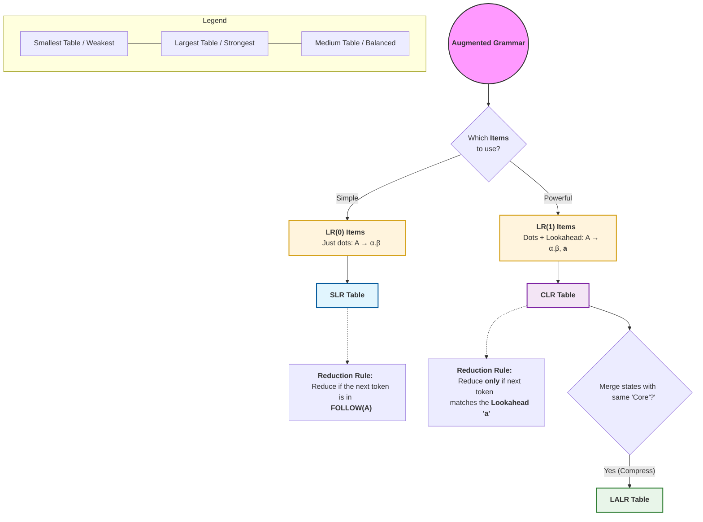

# LR parsing

---

### The "Noob" Summary Table
If the diagram is the "Map," this table is the "Cheat Sheet" for your exams:

| Feature | **SLR** (Simple) | **CLR** (Canonical) | **LALR** (Look-Ahead) |
| :--- | :--- | :--- | :--- |
| **Items Used** | **LR(0)** (No lookaheads) | **LR(1)** (Lookaheads) | **LR(1)** (Lookaheads) |
| **Number of States** | Smallest | **Largest** (Can be huge) | Same as SLR (Merged) |
| **Reduction Logic** | Uses **FOLLOW(A)** set | Uses **specific lookahead** | Uses **specific lookahead** |
| **Power** | Weak (Many conflicts) | **Strongest** | Strong (Best balance) |
| **Memory** | Low | High | Low |

### How to remember the "Reduce" difference:
1.  **SLR (The Lazy Parser):** "I see a finished rule? I'll reduce it if the next token is *any* valid follower of this variable." (Often gets confused).
2.  **CLR (The Strict Parser):** "I only reduce if the next token is *exactly* the one I predicted when I built my state." (Very accurate, but very bulky).
3.  **LALR (The Smart Parser):** "I'll use the strict logic of CLR, but I'll combine similar states together to save space." (What most real-world tools like Yacc/Bison use).
