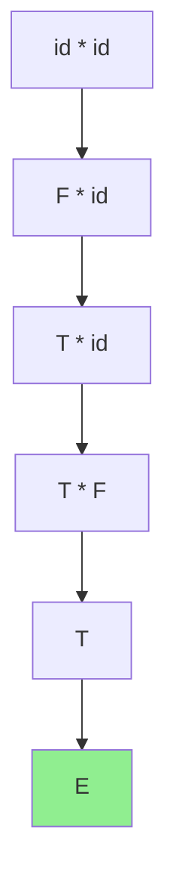
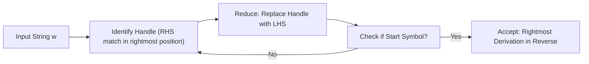
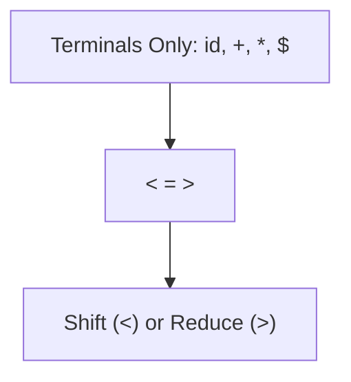

## **Bottom-Up Parsing**

### 1. What is Bottom-Up Parsing? (Big Picture)
- **Definition**: Starts from the **leaves** (input tokens like `id * id`) and builds the **parse tree upwards** to the **root** (start symbol, e.g., `E`).
- Opposite of Top-Down (which starts from root and expands down).
- **Mnemonic**: "Bottoms Up!" → Like drinking from the bottom of the glass and working your way to the top (root).

**Example from document** (Grammar: `E → E + T | T`, `T → T * F | F`, `F → (E) | id`):
- Input: `id * id`
- Reductions: `id * id` → `F * id` → `T * id` → `T * F` → `T` → `E`

**Mindmap (Text Version)**:
```
Bottom-Up Parsing
├── Builds parse tree from leaves → root
├── Process = "Reductions" (reverse of rightmost derivation)
├── Key Idea: Replace "handle" (right substring matching RHS) with LHS non-terminal
└── Techniques: Shift-Reduce → Operator Precedence → LR (SLR, LALR, CLR)
```

**Mermaid Flowchart** (Reduction Flow):


### 2. Reductions in Bottom-Up Parsing
- **Reduction**: Take a substring that matches the **RHS** (right-hand side) of a production and replace it with the **LHS** (left-hand side) non-terminal.
- Goal: Reduce the entire input string `w` to the start symbol.
- **Key Fact**: Bottom-up parsing constructs a **rightmost derivation in reverse**.
- **Mnemonic for Reduction**: "RHS → LHS" (Right Hand Side shrinks to Left Hand Side, like pruning a tree from bottom).

**Document Example Sequence**:
1. `id * id`
2. `F * id`     (reduce `id` using `F → id`)
3. `T * id`     (reduce `F` using `T → F`)
4. `T * F`      (reduce second `id` using `F → id`)
5. `T`          (reduce `T * F` using `T → T * F`)
6. `E`          (reduce `T` using `E → T`)

**Reverse Derivation View** (Rightmost derivation reversed):
```
E ⇒ T ⇒ T * F ⇒ T * id ⇒ F * id ⇒ id * id
```

### 3. Handle & Handle Pruning (Core Concept – Detailed & Thorough)
**What is a Handle?**
- A **handle** is a **specific substring** in the current right-sentential form that:
  1. Matches the **RHS** of some production.
  2. Its reduction is **exactly one step** in the **reverse of a rightmost derivation**.
- **Important**: Not every matching substring is a handle (see counter-example in document: in `T * id`, `T` matches `E → T` but **is NOT** a handle — reducing it would give invalid `E * id`).

**What is Handle Pruning?**
- **Handle Pruning** = The process of repeatedly identifying the correct **handle** and reducing it (replacing with LHS).
- This gives the **rightmost derivation in reverse order**.
- **Mnemonic**: "Prune the Handle" → Like trimming the lowest correct branch (handle) from the bottom of the parse tree until only the root remains.

**Table from Document (id₁ * id₂)**:
| Right Sentential Form | Handle   | Reducing Production |
|-----------------------|----------|---------------------|
| id₁ * id₂            | id₁     | F → id             |
| F * id₂              | F       | T → F              |
| T * id₂              | id₂     | F → id             |
| T * F                | T * F   | T → T * F          |
| T                    | T       | E → T              |
| E                    | -       | -                  |

**Why Leftmost match ≠ Handle?**  
In `T * id₂`, `T` matches `E → T`, but reducing it breaks the rightmost derivation. Always choose the handle that continues the valid reverse rightmost path.

**Learning Technique (Step-by-Step for Any Sentence)**:
1. Start with input string.
2. Scan for the **rightmost** possible handle (matches some RHS).
3. Reduce it → record the production.
4. Repeat until start symbol.
5. Verify it's a valid rightmost derivation in reverse.

**Mnemonic for Identification**: **"Right Handle First"** (RHF) → Look for the handle that would have been expanded last in a rightmost derivation.

**Practice Question Style (from skill)**:
**Example**: Grammar `S → aABb | ...` (adapt from 2022/2024 Qs).  
For sentence `aaabbb`:
- Identify handles step-by-step: e.g., innermost `a` or `b` that fits RHS, reduce, etc.
- Always show: Sentential Form → Handle → Production.

**Mermaid for Handle Pruning Process**:


### 4. Shift-Reduce Parsing (How Handle Pruning is Implemented)
- **Structure**: 
  - **Stack**: Holds grammar symbols + states (bottom = `$`).
  - **Input Buffer**: Remaining tokens (end = `$`).
- **Actions** (4 possible):
  1. **Shift**: Push next input symbol onto stack.
  2. **Reduce**: When handle is on **top** of stack → pop body, push LHS.
  3. **Accept**: Stack has start symbol + input empty (`$ S $`).
  4. **Error**.
- **Key Property**: Handle **always appears at the top** of the stack just before reduction (never inside).
- **Mnemonic**: "Shift until Handle on Top, then Reduce" (SHT).

**Example Table (id * id from document)**:
See the stack/input/action table in pages 5–6. It exactly demonstrates handle pruning via shifts + reduces.

**Conflicts**:
- **Shift/Reduce**: Don't know whether to shift or reduce (e.g., `sa` with `b` coming — shift for one production or reduce for another?).
- **Reduce/Reduce**: Multiple possible reductions for same stack top.
- **Note**: Ambiguous grammars **cannot** be LR (hence not SLR/LALR/CLR).

### 5. Operator Precedence Parsing (Concept Only – Simple Version)
- **Condition for Operator Precedence Grammar**:
  1. No ε-productions on RHS.
  2. **No two non-terminals adjacent** on any RHS.
- **Idea**: Ignore non-terminals; define **precedence relations** only between **terminals**: `<` (yields), `=` (same), `>` (takes precedence).
- **Table Construction**: Terminals only (including `$` as lowest precedence).
- **Parsing**: Use stack + relations to decide shift/reduce.
- **Mnemonic**: "Operators Decide Order" (like * > + in math).

**Simple Example Table** (from document: `id + id * id`):
| Symbol | id | + | * | $ |
|--------|------------|------------|------------|------------|
| id     | —          | >          | >          | >          |
| +      | <          | >          | <          | >          |
| *      | <          | >          | >          | >          |
| $      | <          | <          | <          | Accept     |

- `id` has highest precedence; `$` lowest.

**Parsing Steps**: Shift when `<` or `=`, reduce when `>`.

**Mermaid for Precedence**:


### 6. LR Parsing Overview (SLR, LALR, Canonical LR)
- **LR(k)**: Left-to-right scan, Rightmost derivation in reverse, k lookahead symbols.
- **Types**:
  - **SLR(1)**: Simple LR (uses FOLLOW sets for reductions).
  - **LALR**: Look-Ahead LR (more powerful than SLR, less than CLR).
  - **CLR (Canonical LR)**: Most powerful (full LR(1) items).
- **Advantages** (Mnemonic: **"Powerful, Early Error, General"**):
  1. Handles **all** deterministic CFGs (superset of LL).
  2. Most general non-backtracking shift-reduce method.
  3. Detects errors as soon as possible on left-to-right scan.
- **Drawback**: Hard to build by hand → Use tools like Yacc.

**Core Building Blocks**:
- **LR(0) Item**: Production with a **dot** (e.g., `A → .XYZ`, `A → X.YZ`, `A → XYZ.`).
- **Closure(I)**: Add all productions for non-terminals after the dot.
- **GOTO(I, X)**: Move dot over symbol X and take closure.
- **Canonical Collection**: Start from `S' → .S`, compute all sets via closure + goto.

**SLR Table Construction** (Algorithm in Points):
1. Build LR(0) canonical collection (states = sets of items).
2. For each state:
   - **Shift**: If `A → α.aβ` and GOTO on terminal `a` → shift j.
   - **Reduce**: If `A → α.` → reduce using `A → α` for all `a` in **FOLLOW(A)**.
   - **Accept**: If `S' → S.` on `$`.
3. GOTO for non-terminals.
4. Conflict → Not SLR(1).

**Example SLR Table** (from document for the classic grammar) – See page 22 table with states 0–11, shifts (S), reduces (γ), accept, and GOTO columns for E, T, F.

**Mindmap for LR Family**:
```
LR Parsing
├── LR(0) Items + Closure + GOTO → Automaton
├── SLR(1): Uses FOLLOW for reduce decisions (simple but may have conflicts)
├── LALR: Merges states with lookahead
└── CLR: Full power, more states
```

### 7. Quick Memorization Techniques
- **Acronym for Bottom-Up Actions**: **SRA** (Shift, Reduce, Accept).
- **Handle Pruning Mnemonic**: "Right Handle Prunes to Root" (RHPR).
- **Precedence Relations**: `<` = "less" (yield to next), `>` = "greater" (reduce now).
- **To Memorize Steps**: Repeat the `id * id` example 3 times while drawing the stack table.
- **Conflict Types**: "SR = Shift or Reduce dilemma; RR = Which Reduce?"

## LR Parsing

## 1. Understanding Bottom-Up Parsing
Bottom-up parsing constructs a parse tree starting from the leaves (the input string) and working up toward the root (the start symbol). This process is essentially a **rightmost derivation in reverse**.

* **Reduction:** The process of replacing a substring matching a production body with the head of that production.
* **Handle:** A substring that matches a production body and whose reduction represents one step along the reverse of a rightmost derivation.
* **Handle Pruning:** The process of obtaining the rightmost derivation in reverse by identifying and reducing handles.

---

## 2. Shift-Reduce Parsing
This is a common form of bottom-up parsing using a stack and an input buffer.


### Primary Actions:
1.  **Shift:** Move the next input symbol onto the top of the stack.
2.  **Reduce:** Replace the handle at the top of the stack with the appropriate non-terminal.
3.  **Accept:** Announce successful parsing completion.
4.  **Error:** Discover a syntax error and call a recovery routine.

---

## 3. Constructing LR(0) Collections
LR(0) items and automata form the basis for making shift-reduce decisions.

### The Closure Algorithm
To compute the **CLOSURE** of a set of items **I**:
1.  Add every item in **I** to **CLOSURE(I)**.
2.  If $A \rightarrow \alpha \cdot B\beta$ is in **CLOSURE(I)** and $B \rightarrow \gamma$ is a production, add $B \rightarrow \cdot \gamma$ to **CLOSURE(I)** if it is not already there.
3.  Repeat until no more items can be added.

### The GOTO Function
**GOTO(I, X)** defines the transition from state **I** on grammar symbol **X**. it is the closure of the set of all items $A \rightarrow \alpha X \cdot \beta$ such that $A \rightarrow \alpha \cdot X\beta$ is in **I**.

---

## 4. Identifying Parsing Conflicts
Conflicts occur when the parser cannot decide between actions based on the current stack and lookahead.

* **Shift-Reduce Conflict:** The parser cannot decide whether to shift the next symbol or reduce the current stack content.
    * *Example:* In a grammar where $A \rightarrow sa$ and $B \rightarrow sab$, if the stack is `$sa` and input is `b`, the parser doesn't know whether to reduce $sa$ to $A$ or shift `b`.
* **Reduce-Reduce Conflict:** The parser cannot decide which of several productions to use for reduction.

---


## 5. Comparative Analysis of LR Variants

The primary difference lies in how they handle **reductions** in the parsing table.

| Parser Type | Item Set Used | Reduction Logic | Complexity |
| :--- | :--- | :--- | :--- |
| **SLR** | $LR(0)$ Items  | Reduces $A \rightarrow \alpha$ only for terminals in $FOLLOW(A)$. | Simple and small tables. |
| **LALR** | $LR(1)$ Items  | Merges $CLR$ states that have identical core items but different lookaheads. | Moderate size; used by tools like Yacc. |
| **CLR** | $LR(1)$ Items  | Reduces $A \rightarrow \alpha$ only for the specific lookahead attached to the item $[A \rightarrow \alpha \cdot, a]$. | Most powerful but generates very large tables. |


---

## Subtle Example "Scripts" (Grammar Logic)

To illustrate the differences, let's use a simplified version of the grammar found in your notes: $S \rightarrow CC, C \rightarrow cC | d$.

### 1. SLR (Simple LR)
The SLR parser builds states using $LR(0)$ items. It does not store lookaheads in the states. Instead, it checks the $FOLLOW$ set during table construction.

**Conceptual Logic:**
* **State $I_x$:** Contains $C \rightarrow d \cdot$.
* **Action:** If the next input symbol is in $FOLLOW(C)$, then **Reduce**.
* **Weakness:** If a symbol is in $FOLLOW(C)$ but cannot actually follow $C$ in this specific context, SLR might trigger an invalid reduction.

### 2. CLR (Canonical LR)
CLR tracks the specific terminal that **must** follow a production in each state. Items are represented as $[A \rightarrow \alpha \cdot \beta, a]$, where $a$ is the lookahead.

**Conceptual Logic:**
* **State $I_y$:** Contains $[C \rightarrow d \cdot, c/d]$.
* **State $I_z$:** Contains $[C \rightarrow d \cdot, \$]$.
* **Action:** Even though the production is the same ($C \rightarrow d$), CLR keeps these states separate because their lookaheads differ. This prevents premature reductions but explodes the number of states.

### 3. LALR (Look-Ahead LR)
LALR is the "middle ground." It takes the states from CLR and merges those that have the same "core" (the productions).

**Conceptual Logic:**
* **Action:** Merge State $I_y$ and State $I_z$ into a single state $I_{yz}$.
* **Merged Item:** $[C \rightarrow d \cdot, c/d/\$]$.
* **Result:** The table size becomes as small as SLR, but the parser remains more powerful because it only merges states with the same core items.


---

## The Hierarchy of Power
In terms of the class of grammars they can recognize:
$$SLR < LALR < CLR$$.

While **CLR** is the most powerful, **LALR** is the industry standard for parser generators like **Yacc** or **Bison** because it provides a significant boost in logic over SLR without the massive memory overhead of CLR.

Would you like to see the specific set of items where LALR might encounter a "reduce-reduce" conflict that CLR would avoid?
