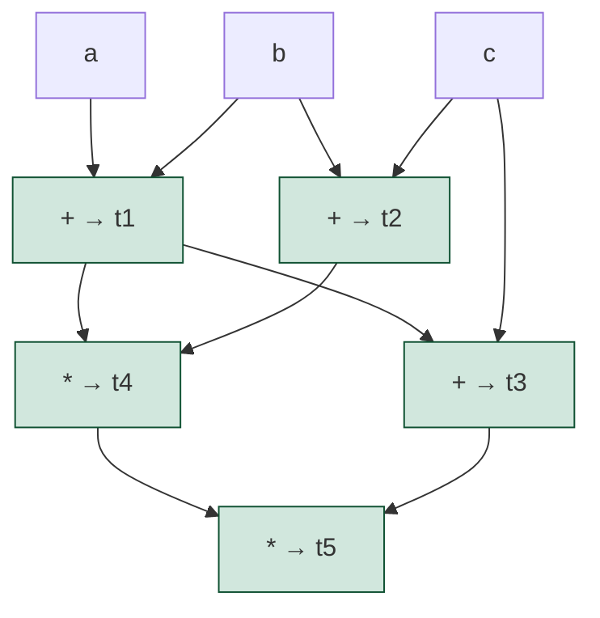
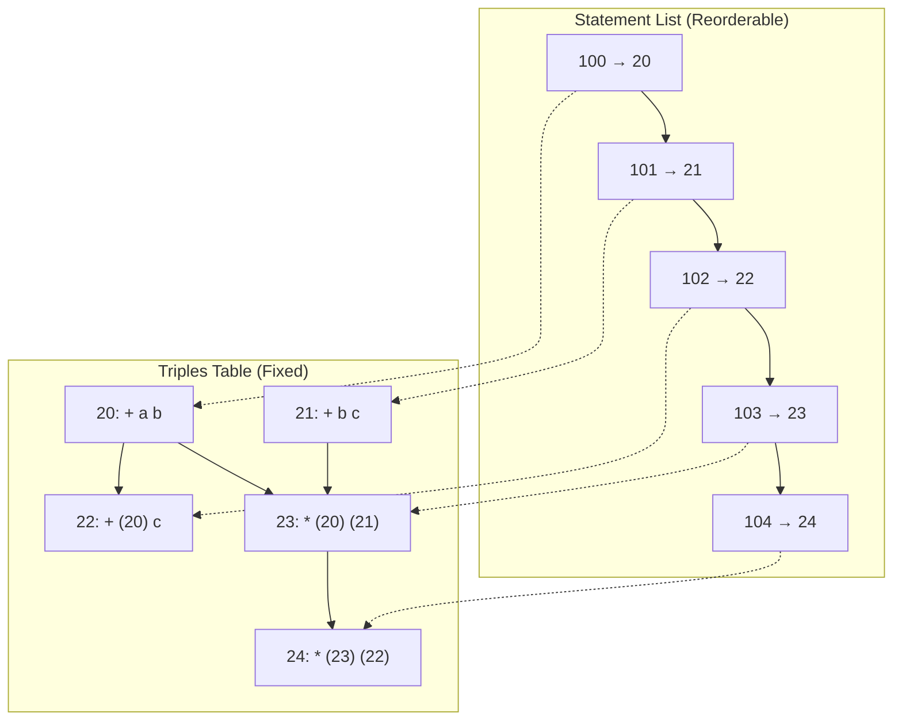

# 3AC

Here is a **simple, exam-oriented** explanation of the different representations of **Three-Address Code (TAC)**, with a clean example using the expression `(a + b) * (b + c) * (a + b + c)` (from our previous discussion). Everything is formatted for quick revision, including Mermaid diagrams to visualize the flow/dependency (very common in university exams/vivas).

### Three Address Code Representations
(As per standard compiler design syllabus – Dragon Book style)

| Representation       | Fields per Instruction          | How result is referenced                  | Advantages                              | Disadvantages                          | Best For                     |
|----------------------|---------------------------------|-------------------------------------------|-----------------------------------------|----------------------------------------|------------------------------|
| **Quadruples**      | op, arg1, arg2, **result**      | Explicit temporary name (t1, t2, …)      | Easy to generate, optimize, read        | Uses more space (extra result field)   | Most practical use           |
| **Triples**         | op, arg1, arg2                  | Implicit = line number/index of triple   | Saves space                             | Hard to reorder/optimize (many refs)   | Space-constrained teaching   |
| **Indirect Triples**| Two tables: statement list + triples | Statement list points to triple index    | Easy to reorder (optimize) without changing triples | Two tables → slightly complex          | Optimization phase demos     |

### Example Expression: `(a + b) * (b + c) * (a + b + c)`

We generate TAC with **common subexpression elimination** (reusing `a + b` where possible – typical in exams).

#### 1. Quadruples (Most common in exams)

```text
(0)  +     a    b    t1     // t1 = a + b
(1)  +     b    c    t2     // t2 = b + c
(2)  +     t1   c    t3     // t3 = a + b + c
(3)  *     t1   t2   t4     // t4 = (a + b) * (b + c)
(4)  *     t4   t3   t5     // t5 = final result
```

**Mermaid visualization** (dependency/flow graph – great for understanding data flow in exams):



#### 2. Triples (Result = instruction number)

```text
(0)  +     a    b          // (0) = a + b
(1)  +     b    c          // (1) = b + c
(2)  +    (0)   c          // (2) = a + b + c
(3)  *    (0)  (1)         // (3) = (a + b) * (b + c)
(4)  *    (3)  (2)         // (4) = final result
```

**Mermaid visualization** (shows reference-by-index):



#### 3. Indirect Triples (Exam favorite for showing optimization)

**Triples Table** (fixed – never changes during optimization)

| Location | op | arg1 | arg2 |
|----------|----|------|------|
| 20       | +  | a    | b    |
| 21       | +  | b    | c    |
| 22       | +  | (20) | c    |
| 23       | *  | (20) | (21) |
| 24       | *  | (23) | (22) |

**Statement List** (pointers – **this list can be reordered** for optimization)

| Stmt # | Points to |
|--------|-----------|
| 100    | 20        |
| 101    | 21        |
| 102    | 22        |
| 103    | 23        |
| 104    | 24        |

**Mermaid visualization** (two-part structure):


**Quick Exam Tips**
- Always show **temporaries** clearly (t1, t2… or (0), (1)…).
- Mention if **CSE** (common subexpression elimination) is applied → fewer instructions.
- For Mermaid: Use `graph TD/LR` for data-flow, label nodes with operation + result.
- Most 5/10-mark questions ask: "Generate quadruples/triples for expression X" or "Compare quadruples vs triples with example".

This format (tables + Mermaid) scores well in theory + diagram-based exams. Let me know if you want another expression!
