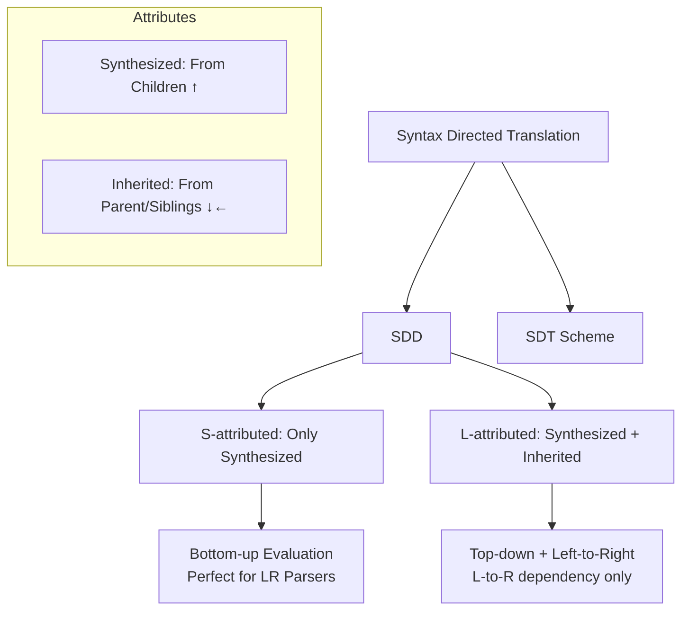
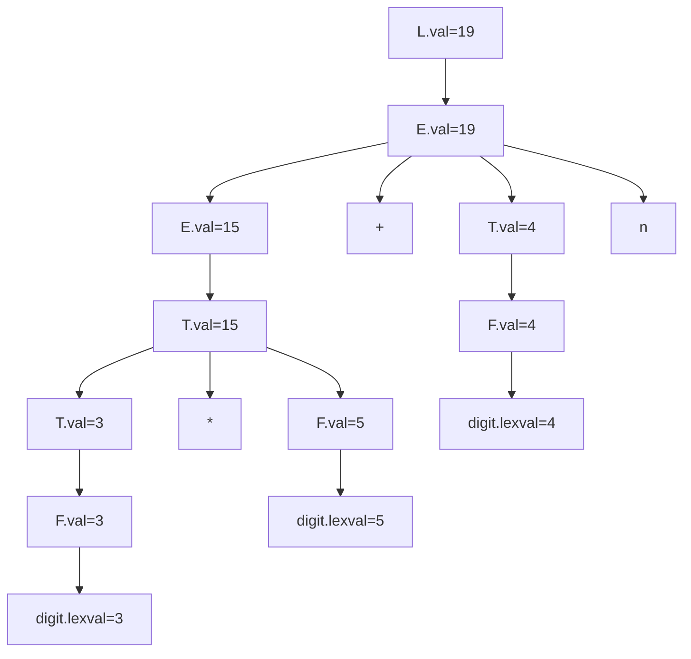

## **Syntax-Directed Translation (SDT)**

### 1. Core Idea (Simple Explanation)
We attach **meaning** (semantics) to a grammar while parsing.  
Instead of just checking if a string is valid (syntax), we compute values, generate code, or build structures using **attributes** attached to grammar symbols.

**Two Notations:**
- **Syntax-Directed Definition (SDD)**: Grammar + semantic rules (hides evaluation order).
- **Syntax-Directed Translation (SDT) Scheme**: Grammar + embedded **semantic actions** (shows order explicitly).

**Mnemonic:** SDD = "Silent Definition" (order hidden), SDT = "Show The order" (actions visible).

### 2. Attributes – The Heart of SDT
Attributes are properties of grammar symbols (like `.val`, `.type`, `.inh`, etc.).

| Type                  | Flows From                  | Computed How?                  | Example                          | Mnemonic |
|-----------------------|-----------------------------|--------------------------------|----------------------------------|----------|
| **Synthesized**      | Children (bottom-up)       | From child attributes          | `E.val = E1.val + T.val`        | **S** = **S**on (children) |
| **Inherited**        | Parent or siblings (top-down/left-to-right) | From parent/siblings           | `T'.inh = F.val`                | **I** = **I**n from above |

**Key Rule:**  
- Synthesized attributes → **bottom-up** evaluation.  
- Inherited attributes → **top-down** or left-to-right.

**Simple Mnemonic for Direction:**
- **Synthesized** → **S**ons give value to **S**elf (up arrow).
- **Inherited** → **I**nherited from **I**mmediate parent/siblings (down/left arrow).

### 3. Types of SDDs

#### A. **S-attributed SDD**
- Contains **only synthesized attributes**.
- No inherited attributes.
- Can be evaluated **purely bottom-up** (perfect for LR parsers / shift-reduce).
- **Advantage:** Simple, no dependency issues from right-to-left.

**Example:** Simple Desk Calculator (all `.val` are synthesized)

```
L → E n          { L.val = E.val }
E → E1 + T       { E.val = E1.val + T.val }
E → T            { E.val = T.val }
T → T1 * F       { T.val = T1.val * F.val }
...
F → digit        { F.val = digit.lexval }
```

**Mind Map (Text Version):**
```
Input (3*5+4 n)
   ↓ (bottom-up)
Leaves (digits) → synthesize lexval
   ↓
F → synthesize val
   ↓
T → synthesize val (multiply)
   ↓
E → synthesize val (add)
   ↓
L → final val
```

#### B. **L-attributed SDD**
- Can have **both** synthesized and inherited attributes.
- Dependency edges in a production go **only left-to-right** (never right-to-left).
- Evaluated **top-down + left-to-right**.
- More powerful but complex.

**Example:** Simple Type Declaration
```
D → T L          { L.inh = T.type }
T → int          { T.type = integer }
L → L1 , id      { L1.inh = L.inh; addType(id, L.inh) }
L → id           { addType(id, L.inh) }
```

**Comparison Table (Easy to Memorize):**

| Feature                      | S-attributed                  | L-attributed                          |
|-----------------------------|-------------------------------|---------------------------------------|
| Attributes allowed          | Only synthesized             | Synthesized + Inherited              |
| Evaluation order            | Pure bottom-up               | Top-down + left-to-right             |
| Dependency direction        | Only upward                  | Left-to-right + upward               |
| Parser suitability          | LR (bottom-up) parsers       | LL (top-down) or modified LR         |
| Complexity                  | Simple                       | More powerful but careful ordering   |
| Mnemonic                    | **S**imple **S**ons only     | **L**eft-to-right flow               |

**Mnemonic to Remember Difference:**  
**S** = **S**ons only (pure bottom-up)  
**L** = **L**eft-to-right (can inherit from left siblings/parent)

### 4. Bottom-Up Evaluation of S-attributed Definitions
(Important for exams – [2023] Q17)

**Process (Step-by-Step):**
1. Use a **bottom-up parser** (shift-reduce / LR).
2. Maintain a **value stack** parallel to the parse stack.
3. When a reduction happens (e.g., `T → T1 * F`):
   - Pop values of right-hand side symbols.
   - Compute the semantic rule for LHS.
   - Push the new value onto the value stack.

**Example Walkthrough:** Input `4 * 5 + 3 n`

I will show it as a table (reverse-engineered from document):

| Stack (State + Value)          | Input          | Action                  | Computation                  |
|--------------------------------|----------------|-------------------------|------------------------------|
| digit 4                        | * 5 + 3 n     | Shift                   | -                            |
| F 4                            | * 5 + 3 n     | Reduce F → digit        | F.val = 4                    |
| T 4                            | * 5 + 3 n     | Reduce T → F            | T.val = 4                    |
| T *                            | 5 + 3 n       | Shift                   | -                            |
| T * digit 5                    | + 3 n         | Shift                   | -                            |
| T * F 5                        | + 3 n         | Reduce F → digit        | F.val = 5                    |
| T 20                           | + 3 n         | Reduce T → T * F        | T.val = 4 * 5 = 20           |
| E 20                           | + 3 n         | Reduce E → T            | E.val = 20                   |
| E +                            | 3 n           | Shift                   | -                            |
| ... (continue)                 | ...           | ...                     | Final L.val = 23             |

**Mnemonic for Bottom-up:**  
**"Reduce → Compute → Push"** (RCP)  
Every time you **R**educe, **C**ompute synthesized value from popped children, **P**ush to stack.

### 5. Dependency Graphs (How to Check Evaluation Order)
- Nodes = attribute instances in parse tree.
- Edge **c → b** means "b depends on c" (evaluate c first).
- No cycles → possible (topological sort exists).
- Cycle → impossible for that parse tree.

**S-attributed** → dependency graph has only upward edges → always acyclic if grammar is proper.

### 6. Quick Mind Map (Mermaid Style – Visualize This)



### 7. Learning Technique to Memorize
**"S-I-L" Mnemonic:**
- **S** → Synthesized, Sons, Simple (S-attributed)
- **I** → Inherited, In from above
- **L** → Left-to-right (L-attributed)

---

## Syntax Directed Translation & Intermediate Code Gen

### 4. Simple Desk Calculator – Classic S-attributed SDD (Memorize this!)

**Grammar + Semantic Rules:**

| Production              | Semantic Rule                     |
|------------------------|-----------------------------------|
| L → E n                | L.val = E.val                     |
| E → E₁ + T             | E.val = E₁.val + T.val            |
| E → T                  | E.val = T.val                     |
| T → T₁ * F             | T.val = T₁.val × F.val            |
| T → F                  | T.val = F.val                     |
| F → ( E )              | F.val = E.val                     |
| F → digit              | F.val = digit.lexval              |

**All attributes are synthesized → Pure S-attributed SDD**

**Annotated Parse Tree for 3 * 5 + 4 n** (Bottom-up evaluation)



**Step-by-step bottom-up computation:**
1. digit 3 → F.val=3 → T.val=3
2. digit 5 → F.val=5
3. T → T * F → T.val = 3 * 5 = 15
4. digit 4 → F.val=4 → T.val=4
5. E → E + T → E.val = 15 + 4 = 19
6. L.val = 19

---

### 5. Inherited Attributes Example (L-attributed style)

**Grammar for multiplication chain (left-recursive removed):**

| Production       | Semantic Rules                          |
|------------------|-----------------------------------------|
| T → F T'         | T'.inh = F.val<br>T.val = T'.syn       |
| T' → * F T₁'     | T₁'.inh = T'.inh × F.val<br>T'.syn = T₁'.syn |
| T' → ε           | T'.syn = T'.inh                         |
| F → digit        | F.val = digit.lexval                    |

For input **3 * 5**:

- F.val = 3
- T'.inh = 3
- Then * F (5) → next T'.inh = 3 × 5 = 15
- Finally T'.syn = 15 → T.val = 15

**Key Point:** Inherited attributes flow **down**, synthesized flow **up**.

---

### 6. Dependency Graph & Evaluation Order

- **Dependency Graph**: Shows which attribute depends on which.
- Edge `c → b` means `b` depends on `c` → evaluate `c` **before** `b`.
- Use **Topological Sort** for evaluation order.
- If cycle → impossible to evaluate.

**Mnemonic:** Dependency Graph = "Who needs whom first?" (prerequisites)

---

### 7. Run-Time Environments (Quick Points)

- **Activation**: One execution of a procedure.
- **Activation Tree**: Shows nested/recursive calls (root = main).
- **Control Stack**: Tracks live activations (push on call, pop on return).
- **Storage Organization**:
  - **Code** (static)
  - **Static Data** (globals, known at compile time)
  - **Stack** (activation records, grows down)
  - **Heap** (dynamic, grows up)

**Activation Record (Frame) Layout (Top to Bottom):**
1. Returned value
2. Actual parameters
3. Optional control link
4. Optional access link
5. Saved machine status
6. Local data
7. Temporaries

**Allocation Strategies:**
- **Static**: Fixed at compile time (no recursion)
- **Stack**: LIFO, perfect for activations
- **Heap**: For dynamic data, retained across activations

---

### 8. Intermediate Code Generation

**Why Intermediate Code?**
- Machine-independent optimization
- Easy retargeting (change only back-end)

**Forms of Intermediate Code:**

1. **Graphical**:
   - **Syntax Tree** (condensed parse tree, operators as internal nodes)
   - **DAG** (more compact, shares common subexpressions)

2. **Linear**:
   - **Postfix** (operators after operands)
   - **Three-Address Code** (most popular)

**Three-Address Code Example:**
``` 
t1 := b * -c
t2 := t1
t3 := -c
t4 := b * t3
t5 := t2 + t4
a  := t5
```

**Representations of Three-Address Code:**

| Representation     | Fields                          | Advantage                     |
|--------------------|---------------------------------|-------------------------------|
| **Quadruples**     | op, arg1, arg2, result          | Easy to rearrange             |
| **Triples**        | op, arg1, arg2 (result = index) | Saves space (no result field) |
| **Indirect Triples**| List of pointers to triples     | Easier to reorder             |

---

### 9. Practice Question Solved: Annotated Parse Tree for 6 * 8 + 5

**Grammar (same as desk calculator, assume + and *):**

Input: **6 * 8 + 5**

**Step-by-step Annotated Parse Tree (S-attributed):**

1. 6 → digit.lexval=6 → F.val=6 → T.val=6
2. 8 → digit.lexval=8 → F.val=8
3. T → T * F → T.val = 6 * 8 = 48
4. 5 → digit.lexval=5 → F.val=5 → T.val=5
5. E → E + T → E.val = 48 + 5 = 53
6. L.val = 53

## Intermediate code gen


### 1. Why Bother with Intermediate Code?
Directly translating source code to machine code is like trying to translate ancient Sanskrit directly into modern Emoji—it's messy and inefficient. Intermediate Code (IC) provides:
* [cite_start]**Retargeting**: You can use the same front-end for different machines by just swapping the back-end[cite: 582].
* [cite_start]**Optimization**: It's much easier to clean up logic on a machine-independent representation than on raw assembly[cite: 583].

#### [cite_start]Common IC Representations [cite: 584-588]:
1.  [cite_start]**Syntax Trees**: Condensed version of a parse tree[cite: 595, 598].
2.  [cite_start]**DAG (Directed Acyclic Graphs)**: Like a syntax tree, but it identifies and "shares" common sub-expressions to save space[cite: 721, 723].
3.  [cite_start]**Three-Address Code (TAC)**: A sequence of instructions where each has at most three addresses (two operands and one result)[cite: 757, 801].


---

### 2. Implementation of Three-Address Code
[cite_start]When you actually implement TAC in a compiler, you generally use one of three record structures [cite: 842-845]:

| Method            | Fields                                      | Key Characteristic |
|------------------|----------------------------------------------|--------------------|
| Quadruples        | op, arg1, arg2, result                      | Uses explicit temporary variables (e.g., t1, t2) to store intermediate results. |
| Triples           | op, arg1, arg2                              | No explicit result field; results are referred to by their position (index) in the triple table. |
| Indirect Triples  | op, arg1, arg2 (args use pointer indices)   | A separate pointer table holds indices to triples; operands refer to these indices. The pointer index is obtained from this table, enabling easy reordering without changing the triple table. |
---

### 3. Practical Task: Solving the PYQs

### [2022] Constructing a DAG and TAC
**Expression**: $a + a * (b + c) + (b + c) * d$

1.  **Identify Common Sub-expressions**: Notice that $(b + c)$ appears twice.
2.  **Three-Address Code (TAC)**:
    * $t_1 = b + c$
    * $t_2 = a * t_1$
    * $t_3 = a + t_2$
    * $t_4 = t_1 * d$
    * $t_5 = t_3 + t_4$
3.  [cite_start]**DAG Construction**: The DAG will have only one node for $(b + c)$, and both the multiplication nodes for $a * \dots$ and $\dots * d$ will point to that single node[cite: 723].

---

#### [2023] Intermediate Code with Type Conversion
**Scenario**: `if(a > b) x = a * b else x = a - b` 
*(Note: $a, x$ are **real**, $b$ is **int**)*

[cite_start]To perform operations between a `real` and an `int`, we must convert the `int` to `real` first[cite: 16].

**TAC with Type Conversion**:
```text
100: if a > b goto 103
101: t1 = intToReal(b)
102: x = a - t1
103: goto 106
104: t2 = intToReal(b)
105: x = a * t2
106: ...
```

---

#### [2024] TAC for a `while` loop
A `while` loop requires labels to handle the repeated test and the exit jump.

**Example**: `while (i < 10) { i = i + 1; }`

**TAC**:
```text
L1: if i < 10 goto L2
    goto L3
L2: t1 = i + 1
    i = t1
    goto L1
L3: (exit)
```
---
