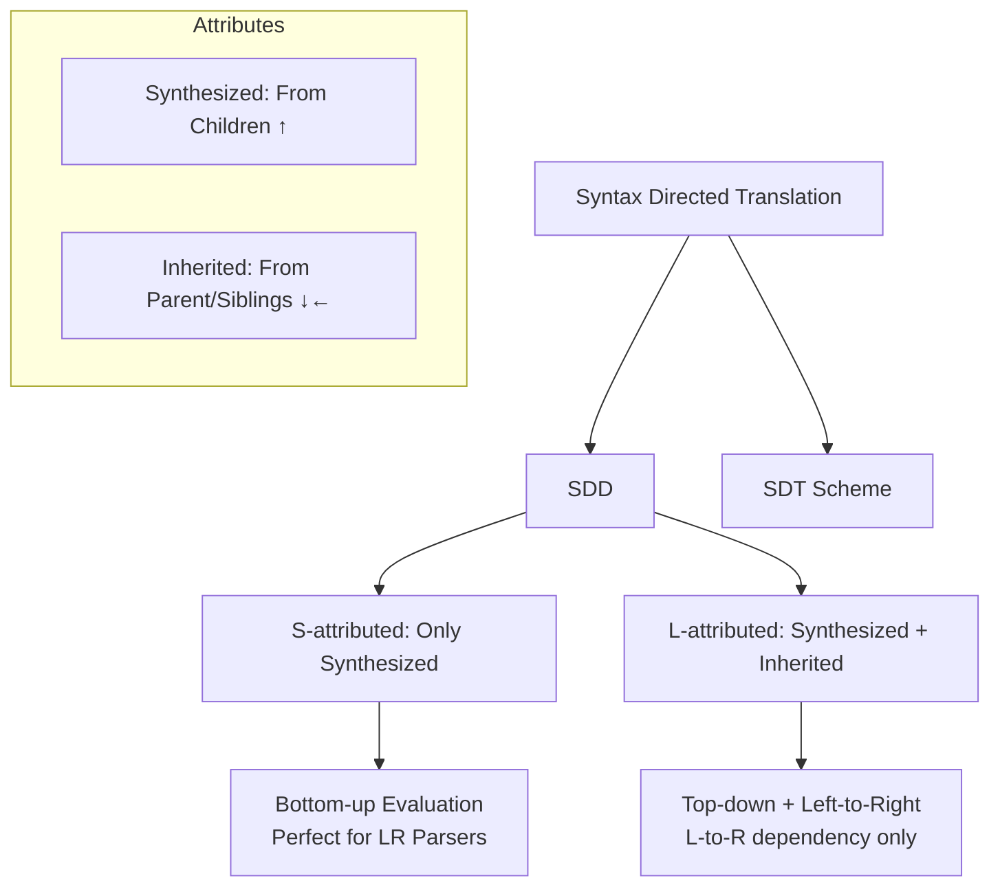

## **Syntax-Directed Translation (SDT)**

### 1. Core Idea (Simple Explanation)
We attach **meaning** (semantics) to a grammar while parsing.  
Instead of just checking if a string is valid (syntax), we compute values, generate code, or build structures using **attributes** attached to grammar symbols.

**Two Notations:**
- **Syntax-Directed Definition (SDD)**: Grammar + semantic rules (hides evaluation order).
- **Syntax-Directed Translation (SDT) Scheme**: Grammar + embedded **semantic actions** (shows order explicitly).

**Mnemonic:** SDD = "Silent Definition" (order hidden), SDT = "Show The order" (actions visible).

### 2. Attributes – The Heart of SDT
Attributes are properties of grammar symbols (like `.val`, `.type`, `.inh`, etc.).

| Type                  | Flows From                  | Computed How?                  | Example                          | Mnemonic |
|-----------------------|-----------------------------|--------------------------------|----------------------------------|----------|
| **Synthesized**      | Children (bottom-up)       | From child attributes          | `E.val = E1.val + T.val`        | **S** = **S**on (children) |
| **Inherited**        | Parent or siblings (top-down/left-to-right) | From parent/siblings           | `T'.inh = F.val`                | **I** = **I**n from above |

**Key Rule:**  
- Synthesized attributes → **bottom-up** evaluation.  
- Inherited attributes → **top-down** or left-to-right.

**Simple Mnemonic for Direction:**
- **Synthesized** → **S**ons give value to **S**elf (up arrow).
- **Inherited** → **I**nherited from **I**mmediate parent/siblings (down/left arrow).

### 3. Types of SDDs

#### A. **S-attributed SDD**
- Contains **only synthesized attributes**.
- No inherited attributes.
- Can be evaluated **purely bottom-up** (perfect for LR parsers / shift-reduce).
- **Advantage:** Simple, no dependency issues from right-to-left.

**Example:** Simple Desk Calculator (all `.val` are synthesized)

```
L → E n          { L.val = E.val }
E → E1 + T       { E.val = E1.val + T.val }
E → T            { E.val = T.val }
T → T1 * F       { T.val = T1.val * F.val }
...
F → digit        { F.val = digit.lexval }
```

**Mind Map (Text Version):**
```
Input (3*5+4 n)
   ↓ (bottom-up)
Leaves (digits) → synthesize lexval
   ↓
F → synthesize val
   ↓
T → synthesize val (multiply)
   ↓
E → synthesize val (add)
   ↓
L → final val
```

#### B. **L-attributed SDD**
- Can have **both** synthesized and inherited attributes.
- Dependency edges in a production go **only left-to-right** (never right-to-left).
- Evaluated **top-down + left-to-right**.
- More powerful but complex.

**Example:** Simple Type Declaration
```
D → T L          { L.inh = T.type }
T → int          { T.type = integer }
L → L1 , id      { L1.inh = L.inh; addType(id, L.inh) }
L → id           { addType(id, L.inh) }
```

**Comparison Table (Easy to Memorize):**

| Feature                      | S-attributed                  | L-attributed                          |
|-----------------------------|-------------------------------|---------------------------------------|
| Attributes allowed          | Only synthesized             | Synthesized + Inherited              |
| Evaluation order            | Pure bottom-up               | Top-down + left-to-right             |
| Dependency direction        | Only upward                  | Left-to-right + upward               |
| Parser suitability          | LR (bottom-up) parsers       | LL (top-down) or modified LR         |
| Complexity                  | Simple                       | More powerful but careful ordering   |
| Mnemonic                    | **S**imple **S**ons only     | **L**eft-to-right flow               |

**Mnemonic to Remember Difference:**  
**S** = **S**ons only (pure bottom-up)  
**L** = **L**eft-to-right (can inherit from left siblings/parent)

### 4. Bottom-Up Evaluation of S-attributed Definitions
(Important for exams – [2023] Q17)

**Process (Step-by-Step):**
1. Use a **bottom-up parser** (shift-reduce / LR).
2. Maintain a **value stack** parallel to the parse stack.
3. When a reduction happens (e.g., `T → T1 * F`):
   - Pop values of right-hand side symbols.
   - Compute the semantic rule for LHS.
   - Push the new value onto the value stack.

**Example Walkthrough:** Input `4 * 5 + 3 n`

I will show it as a table (reverse-engineered from document):

| Stack (State + Value)          | Input          | Action                  | Computation                  |
|--------------------------------|----------------|-------------------------|------------------------------|
| digit 4                        | * 5 + 3 n     | Shift                   | -                            |
| F 4                            | * 5 + 3 n     | Reduce F → digit        | F.val = 4                    |
| T 4                            | * 5 + 3 n     | Reduce T → F            | T.val = 4                    |
| T *                            | 5 + 3 n       | Shift                   | -                            |
| T * digit 5                    | + 3 n         | Shift                   | -                            |
| T * F 5                        | + 3 n         | Reduce F → digit        | F.val = 5                    |
| T 20                           | + 3 n         | Reduce T → T * F        | T.val = 4 * 5 = 20           |
| E 20                           | + 3 n         | Reduce E → T            | E.val = 20                   |
| E +                            | 3 n           | Shift                   | -                            |
| ... (continue)                 | ...           | ...                     | Final L.val = 23             |

**Mnemonic for Bottom-up:**  
**"Reduce → Compute → Push"** (RCP)  
Every time you **R**educe, **C**ompute synthesized value from popped children, **P**ush to stack.

### 5. Dependency Graphs (How to Check Evaluation Order)
- Nodes = attribute instances in parse tree.
- Edge **c → b** means "b depends on c" (evaluate c first).
- No cycles → possible (topological sort exists).
- Cycle → impossible for that parse tree.

**S-attributed** → dependency graph has only upward edges → always acyclic if grammar is proper.

### 6. Quick Mind Map (Mermaid Style – Visualize This)



### 7. Learning Technique to Memorize
**"S-I-L" Mnemonic:**
- **S** → Synthesized, Sons, Simple (S-attributed)
- **I** → Inherited, In from above
- **L** → Left-to-right (L-attributed)
