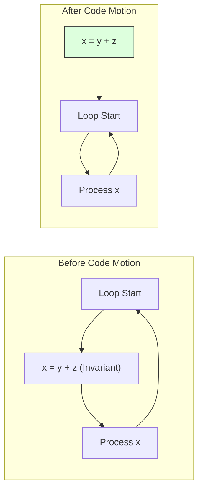
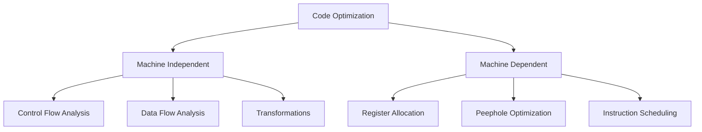
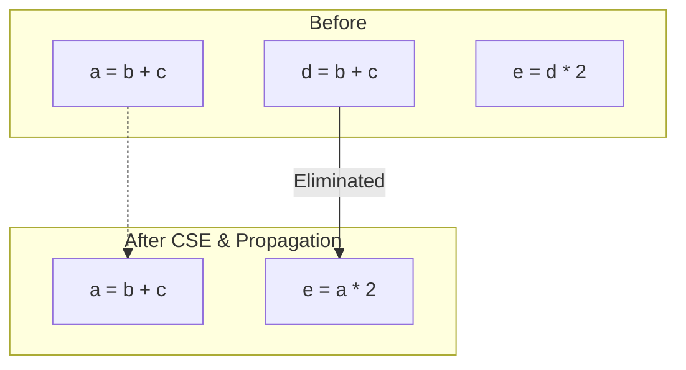
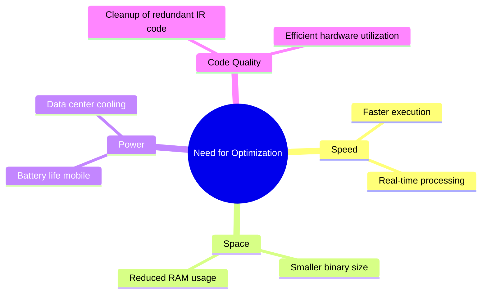

# Module 5

### 1. Loop Optimization Techniques
**Concept:** Loops are where programs spend ~90% of their time. Optimizing them yields the highest performance gains.

| Technique | Definition | Example |
| :--- | :--- | :--- |
| **Code Motion** | Moving loop-invariant computations outside the loop. | `while(i < max-1)` $\rightarrow$ `t = max-1; while(i < t)` |
| **Induction Variable** | Identifying variables that change in lockstep and simplifying them. | Replacing a multiplier with an incrementer. |
| **Strength Reduction** | Replacing expensive operations (like `*`) with cheaper ones (like `+`). | `for i... { x = i * 4 }` $\rightarrow$ `x = x + 4` |
| **Loop Unrolling** | Reducing loop overhead by increasing the loop body size. | Doing 2 operations per iteration instead of 1. |

---

### 2. Code Optimization Techniques
**Concept:** Optimization is categorized by how much of the program the compiler "sees" at once.

**Flashcard:**
*   **Compile-Time Evaluation:** Solving math at compile time (Constant Folding).
*   **Common Subexpression Elimination (CSE):** Don't calculate the same thing twice.
*   **Machine-Independent:** Optimizing logic (applies to all CPUs).
*   **Machine-Dependent:** Optimizing for specific hardware (Registers, Peephole optimization).

---

### 3. Function-Preserving Transformations
**Concept:** These techniques improve efficiency **without** changing what the code actually does (the output remains identical).

| Transformation | How it works |
| :--- | :--- |
| **Common Subexpression Elimination** | If `a=b+c` and `d=b+c`, replace `d` with `a`. |
| **Copy Propagation** | If `f = g`, replace all subsequent uses of `f` with `g` to eliminate `f`. |
| **Dead Code Elimination** | Removing code that is never executed or whose result is never used. |
| **Constant Folding** | Replacing `x = 2 + 3` with `x = 5` during compilation. |

---

### 4. Needs for Optimization Phase
**Concept:** Why do we need it? Can’t we just write good code?

**Flashcard: The "Why"**
1.  **Performance:** Execution speed is the primary metric for software quality.
2.  **Resource Constraints:** Reducing memory usage and power consumption (critical for mobile/embedded).
3.  **High-Level Abstraction:** High-level languages (C++, Java, Python) often produce "messy" intermediate code; the optimizer cleans it up.
4.  **Competitive Edge:** Faster software sells better and scales cheaper in the cloud.

---

### Summary Table for Fast Recall

| Topic | Key Word / Trigger |
| :--- | :--- |
| **Loop Opt** | **Motion** (Move it), **Strength** (Make it cheaper), **Unroll** (Make it bigger). |
| **General Opt** | **Independent** (Logic) vs **Dependent** (Hardware). |
| **Func Preserving** | **Folding** (Math), **Elimination** (Dead code), **Sharing** (CSE). |
| **Needs** | **Speed**, **Space**, **Power**, **Cleanup**. |
