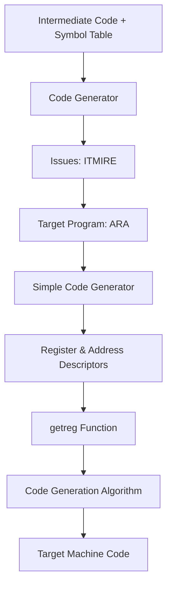

# Mod 5

## Code opt

### **1. Introduction to Code Optimization**

**What is Code Optimization?**  
It is the process of transforming the code (source / intermediate / target) to make it:
- **Faster** (less execution time)
- **Smaller** (less memory)
- **Better** (efficient use of resources)

**Important Rules (Criteria):**
- Must **preserve meaning** of the program (same output for same input)
- Must give **noticeable improvement**
- Effort should be **worth it**

**Need for Optimization:**
- Compiler-generated code is usually not perfect
- Hand optimization is tedious and error-prone
- Programmer doesnt know machine level details
- Modern CPUs (pipelining, caches) need optimized code
- Improves reusability & maintainability

**Mnemonic:**  
**P.E.W.** → Preserve meaning, Efficiency gain, Worth the effort

---

### **2. Where & How Optimization is Done**

Optimization can be applied at **3 places**:

1. **Source code** (Programmer does – loop tuning, better algorithm)
2. **Intermediate code** (Compiler does – most optimizations happen here)
3. **Target code** (Compiler does – peephole, register usage)

**Two Types of Optimization:**

| Type                      | Meaning                              | Example                     |
|---------------------------|--------------------------------------|-----------------------------|
| **Machine Independent**   | Works on any machine                 | CSE, Constant folding, Loop opts |
| **Machine Dependent**     | Specific to a particular CPU         | Peephole, Register allocation |

**Two Phases of Optimization:**

- **Local Optimization** → Inside one **Basic Block** (small straight-line code)
- **Global Optimization** → Across multiple blocks, loops, functions

**Mnemonic (Order):**  
**L**ocal **first**, then **G**lobal → **L**ove **G**lobal (Local before Global)

---

### **3. Basic Block & Flow Graph** (Foundation)

**Basic Block:**  
A sequence of consecutive 3-address statements that:
- Can be entered only at the **beginning**
- Executed **sequentially** without branches

**How to find Basic Blocks? (Algorithm 8.5)**  
Find **Leader** statements using 3 rules:

1. First statement of the program
2. Target of any jump (conditional or unconditional)
3. Statement immediately following a jump

**Flow Graph:**  
Pictorial representation of control flow.  
- **Nodes** = Basic Blocks  
- **Edges** = Possible control flow between blocks  
- Directed graph G = (N, E, n₀)

**Mind Map for Basic Block:**

```
Basic Block
   ├── Leader Rules (3)
   ├── Sequence without branch
   └── Used for Local Optimization
```

---

### **4. Principal Sources of Optimization**

#### **A. Function-Preserving Transformations** (Local + Global)

1. **Common Subexpression Elimination (CSE)**  
   If same expression computed again and variables not changed → reuse previous value.

   **Example (in B5 block):**
   ``` 
   Before: t6=4*i; x=a[t6]; t7=4*i; ...
   After:  t6=4*i; x=a[t6]; t7=t6; ...   (reuse t6)
   ```

2. **Copy Propagation**  
   Replace `x = y` by using `y` directly wherever possible.  
   Often turns the copy into **dead code**.

3. **Dead Code Elimination**  
   Remove statements whose result is never used.

   **Example:**
   ```c
   i=0;
   if(i==1) { a=b+5; }   // if is dead code (never true)
   ```

4. **Constant Folding**  
   Evaluate constant expressions at **compile time**.

   **Example:** `a = 3.14157 / 2` → `a = 1.570785`

**Mnemonic for 4 Function-Preserving:**  
**C**ommon **C**opy **D**ead **C**onstant → **CCDC** (See See Dead Constant)

---

#### **B. Loop Optimization** (Mostly Global)

1. **Code Motion (Loop Invariant Code Motion)**  
   Move code that gives **same value** in every iteration **outside** the loop.

   **Example:**
   ``` 
   Before: for(i=1; i<=100; i++) { x=25*a; y=x+z; }
   After:  x=25*a; for(i=1; i<=100; i++) { y=x+z; }
   ```

2. **Induction Variable Elimination**  
   Variables that change in a predictable way inside loop (usually +1 or *constant).

3. **Strength Reduction**  
   Replace expensive operation with cheaper one.

   **Example:**
   - `t4 = 4 * j`  →  `t4 = t4 - 4` (after j = j-1)
   - Multiplication → Addition/Subtraction or Shift

**Mnemonic for Loop Opts:**  
**C**ode **M**otion → **I**nduction **S**trength → **C**ode **M**otion **I**nduction **S**trength (CMIS)

**Extra Loop Techniques:**
- Loop Jamming (merge two loops into one)
- Loop Unrolling (replace loop with repeated statements)

---

### **5. Optimization of Basic Blocks (Local Optimization)**

**Two Types:**
1. **Structure Preserving Transformations**
2. **Algebraic Transformations**

**Structure Preserving (Important ones):**
- Dead code elimination
- Copy propagation (Variable + Constant)
- Common subexpression elimination
- Strength reduction
- Constant folding
- Interchange of independent statements

**Algebraic Transformations:**
- `x + 0 = x`, `x * 1 = x`
- `x**2 → x*x`, `2*x → x+x`

**Mnemonic:**  
**D**ead **C**opy **C**ommon **S**trength **C**onstant **I**nterchange → **DCCSCI**

---

### **6. Directed Acyclic Graph (DAG)**

**Why use DAG?**  
Helps detect **common subexpressions** visually.

**Rules for constructing DAG:**
1. Leaf nodes = identifiers/constants
2. Interior nodes = operators
3. Check if same node (same children + same operator) already exists → reuse it

**Applications of DAG:**
- Find common subexpressions
- Identify live variables
- Simplify quadruples

**Mind Map:**
```
DAG
 ├── Leaf: variables, constants
 ├── Internal: operators
 └── Reuse identical nodes → CSE
```

---

### **7. Machine Dependent Optimization → Peephole Optimization**

**Peephole** = Small window on target code.

**Techniques:**
1. **Redundant Load/Store elimination**  
   `MOV R0, x; MOV x, R0` → remove second
2. **Remove Unreachable Code**
3. **Flow of Control Optimization** (remove unnecessary jumps)
4. **Algebraic Simplifications**
5. **Use Machine Idioms** (INC, auto-increment)

**Mnemonic:**  
**R**edundant **U**nreachable **F**low **A**lgebraic **M**achine → **RUFAM**

---

### **Quick Mind Map for Whole Code Optimization**

```
Code Optimization
   ├── Machine Independent
   │     ├── Function Preserving (CCDC)
   │     └── Loop Optimization (CMIS + Jamming + Unrolling)
   ├── Machine Dependent (Peephole - RUFAM)
   ├── Local  → Basic Block + DAG
   └── Global → Loops + Procedures
```

## Code gen

### 2. Code Generation – Core Concepts (Reverse Engineered)

**What is Code Generation?**  
The **final phase** of the compiler.  
It takes **optimized intermediate code** (usually 3-address code) and produces **target machine code** (assembly or binary) that can run on the actual hardware.

**Goal:** Generate correct, efficient target code (fast + small size).

---

### 3. Issues in the Design of a Code Generator (Most Asked)

**6 Major Issues** (Learn in order):

1. **Input to Code Generator**  
   - Intermediate Representation (3-address code, quadruples, DAG, etc.)  
   - Symbol table information (type, width, address)

2. **Target Program**  
   - Absolute machine code → fixed memory, fast but inflexible  
   - Relocatable machine code → can be linked  
   - Assembly language → easier to generate  
   **Mnemonic:** ARA (Absolute, Relocatable, Assembly)

3. **Memory Management**  
   - Mapping names → addresses (using symbol table width)  
   - Relative addressing for instructions

4. **Instruction Selection**  
   - Choosing best machine instructions for IR statements  
   - Depends on: IR level, instruction set (RISC/CISC), quality needed  
   **Example:**  
   `x = y + z`  
   Poor: MOV y,R0; ADD z,R0; MOV R0,x  
   Better: Use INC if available

5. **Register Allocation**  
   - Registers are fastest storage  
   - Two sub-problems:  
     - **Register Allocation** → which values stay in registers?  
     - **Register Assignment** → which specific register?  
   **Key Problem:** Limited registers

6. **Evaluation Order**  
   - Order of computing sub-expressions affects register usage  
   - Optimal order is NP-complete → solved partially by optimization

---

### 4. Target Machine (Simple Model used in your notes)

- Byte-addressable, 4 bytes/word  
- n general-purpose registers: R0, R1, ..., Rn-1  
- Two-address instructions: `op source, destination`  
- Important addressing modes (memorize with costs):

| Mode              | Form       | Added Cost | Mnemonic |
|-------------------|------------|------------|----------|
| Register          | R          | 0          | Free     |
| Absolute          | M          | 1          | Memory   |
| Indexed           | c(R)       | 1          | Index    |
| Indirect Register | *R         | 0          | Indirect |
| Immediate         | #C         | 1          | Const    |

**Instruction Cost Rule:**  
**Cost = 1 (base) + cost of source + cost of destination**

---

### 5. Simple Code Generator (Most Important for Exams)

#### Tools Used:
- **Register Descriptor**: What is currently in each register?
- **Address Descriptor**: Where is the current value of a name (register/memory)?

#### Code Generation Algorithm (Step-by-Step)

For every 3-address statement `x := y op z`:

1. Call **getreg()** → find location **L** for result
2. Get location of **y** (prefer register) → generate `MOV y', L` if needed
3. Generate `op z', L`
4. Update descriptors:
   - x is now in L
   - If y or z have **no next use** and **not live** → free their registers

#### getreg() Function (Very Important)

**Rules (in priority order):**

1. If **y** is already in a register **R** → use that R (for `y op z`)
2. Else if there is a free (empty) register **R** → use it
3. Else choose a register **R** that requires **minimum load/store**:
   - Spill (MOV R, M) the value if needed
   - Prefer register whose value is **not live** or has **no next use**

**Mnemonic for getreg:** **Y → Free → Cheap** (Y already in reg → Free reg → Cheapest spill)

---

### 6. Example: Generating Code for Assignment

**Statement:** `d := (a-b) + (a-c) + (a-c)`  
(Assume d is live at end)

**3-Address Code:**
```
t := a - b
u := a - c
v := t + u
d := v + u
```

**Step-by-step Code Generation** (from your PDF):

| Statement       | Code Generated                  | Register Descriptor          | Address Descriptor          |
|-----------------|---------------------------------|------------------------------|-----------------------------|
| (initial)       | -                               | All empty                    | -                           |
| t := a - b      | MOV a, R0<br>SUB b, R0         | R0 = t                       | t in R0                     |
| u := a - c      | MOV a, R1<br>SUB c, R1         | R0=t, R1=u                   | t in R0, u in R1            |
| v := t + u      | ADD R1, R0                     | R0=v, R1=u                   | v in R0, u in R1            |
| d := v + u      | ADD R1, R0<br>MOV R0, d        | R0=d                         | d in R0 (and memory)        |

**Total Cost:** Very efficient (reused R0 cleverly)

---

### 7. Practice Questions Mastery

**Q: Explain code motion with example**  
**Answer:**  
Code motion (loop-invariant code motion) moves code that computes the **same value** every iteration **outside** the loop.

**Example:**
```pascal
for i = 1 to 100
    x := 25 * a;     // loop invariant
    y := x + z;
```

**Optimized:**
```pascal
x := 25 * a;         // moved outside
for i = 1 to 100
    y := x + z;
```

**Mnemonic:** “Invariant → Out” (loop invariant code → move out)

**Q: Code-improving transformations on Basic Block**  
**Structure Preserving:**
- Common Subexpression Elimination (CSE)
- Copy Propagation
- Dead Code Elimination
- Constant Folding
- Strength Reduction
- Interchange independent statements

**Algebraic:**
- x + 0 = x, x * 1 = x, etc.

**Q: Role of Register & Address Descriptor**  
- **Register Descriptor**: Tracks **what value** is in **each register** (updated after every instruction)
- **Address Descriptor**: Tracks **where** the current value of a **variable** is (register or memory)

They work together so the code generator knows whether to generate MOV or not.

---

### 8. Quick Revision Mindmap for Code Generation Phase


