### **Module 2: Production and Cost**

#### **1. Production Function**

**Concept:** A production function is a mathematical or graphical relationship that shows the maximum amount of output that can be produced from a given set of inputs (like labor and capital) at a given level of technology. It defines the technological relationship between inputs and output.

**Mermaid Diagram:**

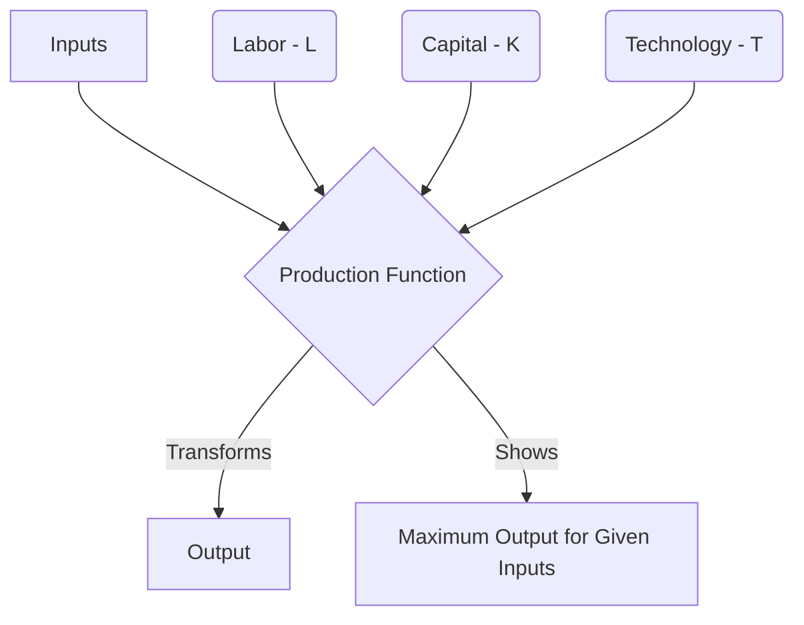

#### **2. Law of Variable Proportions (or Law of Diminishing Returns)**

**Concept:** This law describes how output changes in the short run when one input (variable input, e.g., labor) is varied while other inputs (fixed input, e.g., capital) are kept constant. Initially, increasing the variable input leads to increasing marginal returns, then diminishing marginal returns, and eventually negative marginal returns. It highlights three stages of production.

**Mermaid Diagram:**

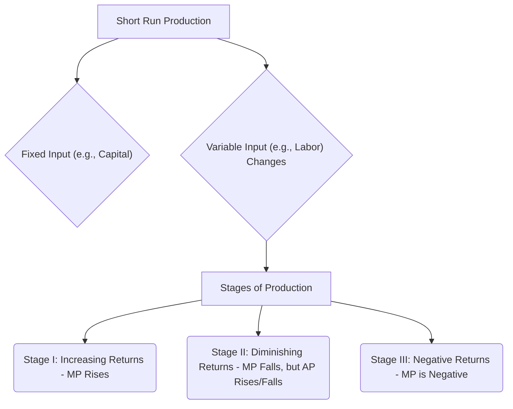

#### **3. Economies of Scale (Internal and External Economies)**

**Concept:** Economies of scale refer to the cost advantages that enterprises obtain due to their scale of operation.
*   **Internal Economies of Scale:** Cost reductions achieved within a firm as it increases its output. These can be technical, managerial, financial, marketing, or risk-bearing.
*   **External Economies of Scale:** Cost reductions for firms in an industry due to the growth of the industry itself or the concentration of firms in a particular area (e.g., improved infrastructure, specialized labor pool, ancillary industries).

**Mermaid Diagram:**

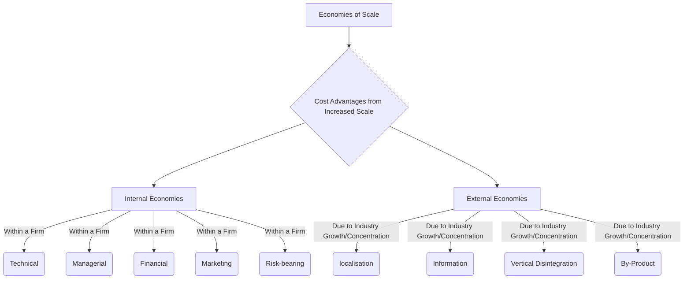

#### **4. Isoquants, Isocost Line, and Producer’s Equilibrium**

**Concept:**
*   **Isoquant:** A curve showing all efficient combinations of two inputs (e.g., labor and capital) that yield the same level of output. Higher isoquants represent higher levels of output.
*   **Isocost Line:** A line showing all combinations of two inputs that can be purchased for a given total cost, given the prices of the inputs.
*   **Producer's Equilibrium:** The point where a producer maximizes output for a given cost, or minimizes cost for a given output. Graphically, it's the tangency point between an isoquant and an isocost line. At this point, the marginal rate of technical substitution (slope of isoquant) equals the ratio of input prices (slope of isocost).

**Mermaid Diagram:**

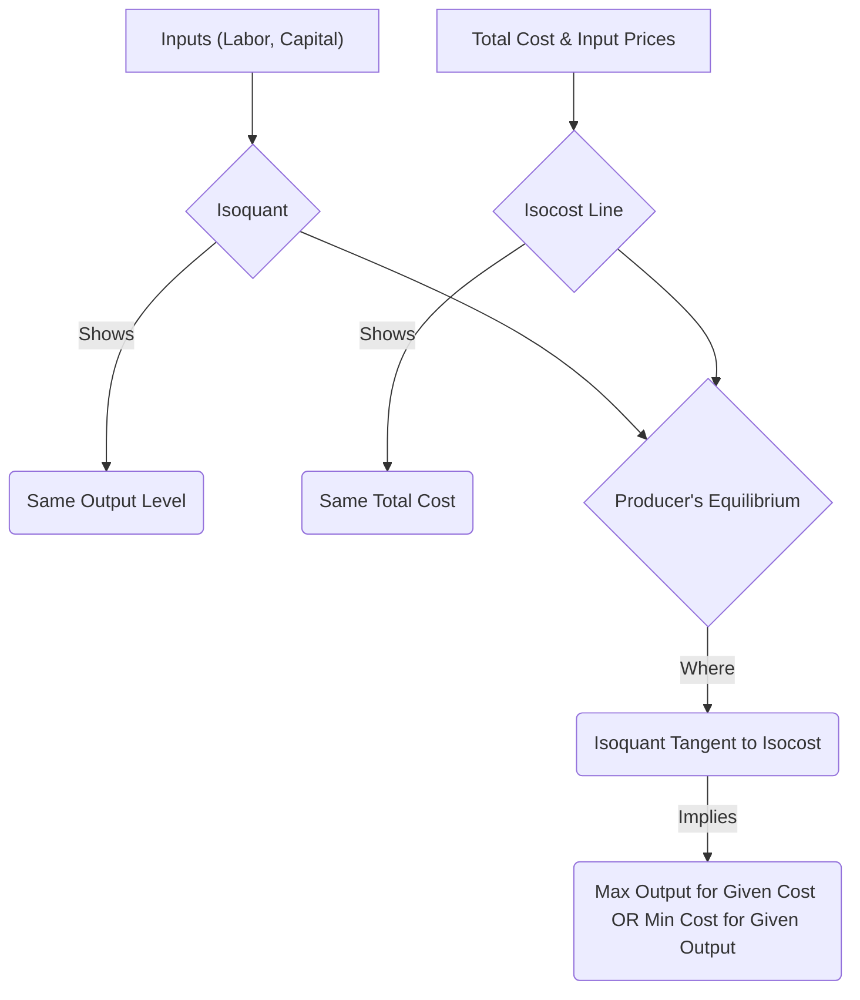

#### **5. Expansion Path**

**Concept:** The expansion path is a curve connecting all the points of producer's equilibrium as the firm expands its scale of production by increasing its total cost while input prices remain constant. It shows the optimal input combinations for different levels of output when the firm is expanding in the long run.

**Mermaid Diagram:**

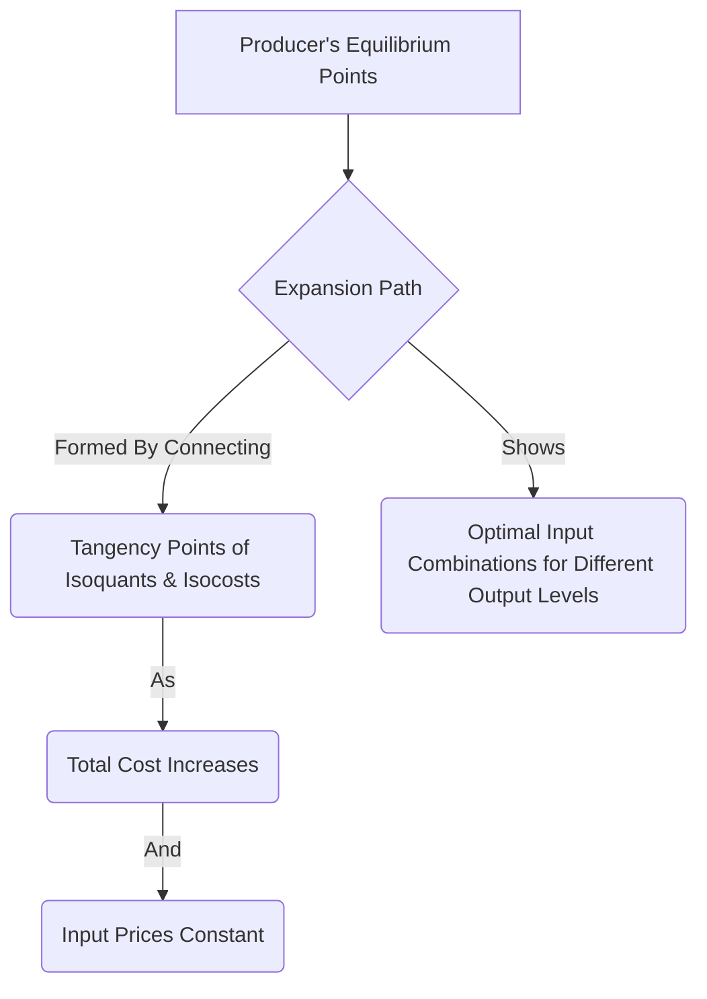

#### **6. Technical Progress and its Implications**

**Concept:** Technical progress refers to advancements in technology that allow a firm to produce more output with the same amount of inputs, or the same output with fewer inputs. It essentially shifts the production function upwards or shifts isoquants inwards, indicating increased efficiency.

**Mermaid Diagram:**

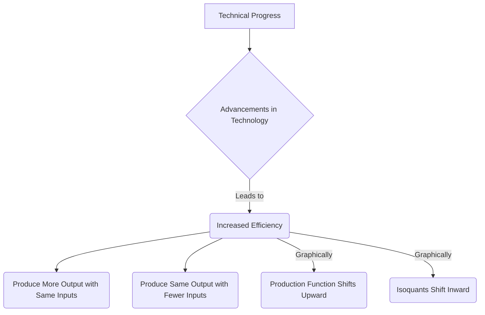

#### **7. Cobb-Douglas Production Function**

**Concept:** A widely used form of the production function, typically expressed as Q = A * L^α * K^β, where Q is total production, L is labor input, K is capital input, A is total factor productivity, and α and β are the output elasticities of labor and capital, respectively. It exhibits constant, increasing, or decreasing returns to scale depending on the sum of α and β.

**Mermaid Diagram:**

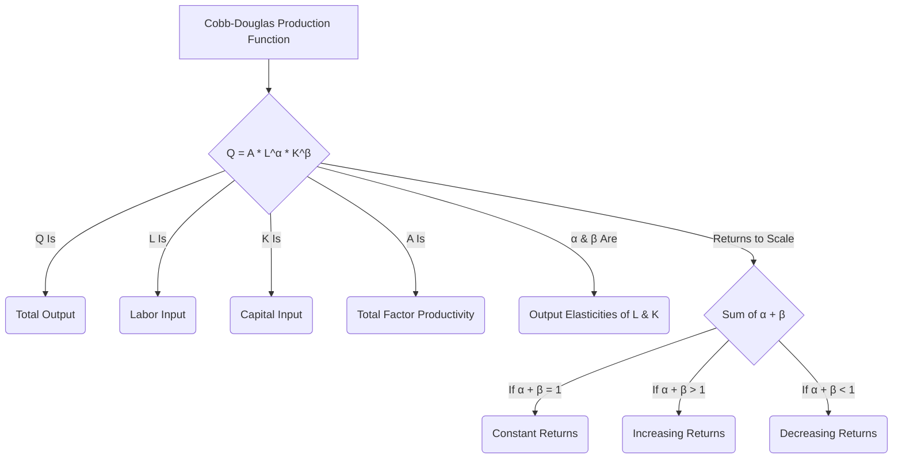

#### **8. Cost Concepts**

**Concept:** Understanding different types of costs is crucial for business decisions.

*   **Social Cost:** The total cost to society of producing a good or service.
    *   **Private Cost:** The cost incurred by the producer (e.g., wages, raw materials).
    *   **External Cost (Externality):** The cost imposed on a third party not directly involved in the production or consumption (e.g., pollution).
*   **Explicit Cost:** Direct, out-of-pocket monetary payments for resources used (e.g., wages, rent, utilities). Also known as accounting costs.
*   **Implicit Cost:** The opportunity cost of using resources already owned by the firm, for which no direct monetary payment is made (e.g., forgone salary of owner, use of owner's building).
*   **Sunk Cost:** A cost that has already been incurred and cannot be recovered. Sunk costs should be irrelevant for future decision-making.

**Mermaid Diagram:**

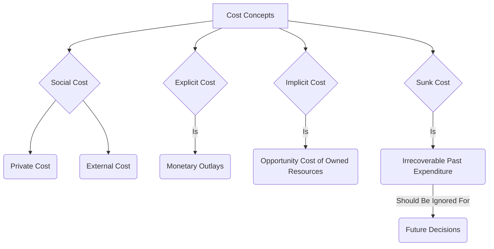

#### **9. Short-Run Cost Curves**

**Concept:** In the short run, at least one input is fixed. Firms typically encounter:
*   **Total Fixed Cost (TFC):** Costs that do not vary with the level of output (e.g., rent).
*   **Total Variable Cost (TVC):** Costs that vary with the level of output (e.g., raw materials, wages for production labor).
*   **Total Cost (TC):** TFC + TVC.
*   **Average Fixed Cost (AFC):** TFC / Quantity. Decreases continuously as output increases.
*   **Average Variable Cost (AVC):** TVC / Quantity. Typically U-shaped.
*   **Average Total Cost (ATC):** TC / Quantity = AFC + AVC. Typically U-shaped.
*   **Marginal Cost (MC):** The additional cost incurred from producing one more unit of output. It typically falls initially and then rises, intersecting AVC and ATC at their minimum points.

**Mermaid Diagram:**

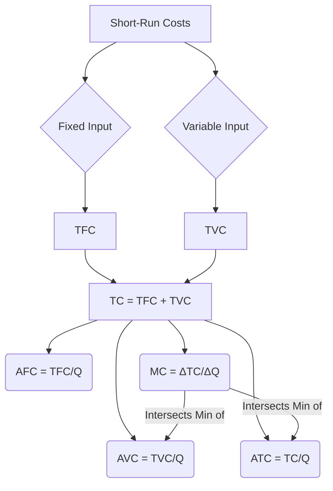

#### **10. Long-Run Cost Curves**

**Concept:** In the long run, all inputs are variable. Firms can choose the optimal scale of operation.
*   **Long-Run Average Cost (LRAC) Curve:** A curve that represents the lowest per-unit cost at which any desired level of output can be produced when all inputs are variable. It's an envelope of all short-run average cost (SRAC) curves. Its shape reflects economies and diseconomies of scale.
*   **Long-Run Marginal Cost (LRMC) Curve:** The additional cost incurred by increasing total output by one unit in the long run. It intersects the LRAC at its minimum point.

**Mermaid Diagram:**

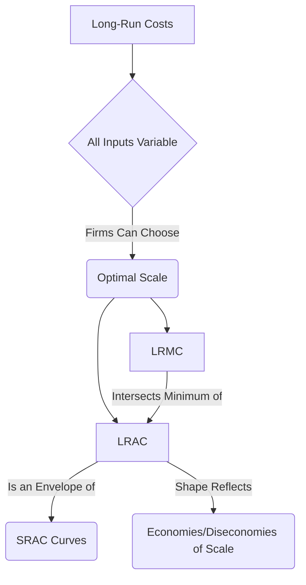

#### **11. Revenue (Concepts)**

**Concept:** Revenue is the income a firm generates from selling its goods or services.
*   **Total Revenue (TR):** The total amount of money received from the sale of output (Price x Quantity).
*   **Average Revenue (AR):** Total revenue divided by the quantity sold (TR / Q = Price). AR is always equal to the price of the good.
*   **Marginal Revenue (MR):** The additional revenue generated from selling one more unit of output.

**Mermaid Diagram:**

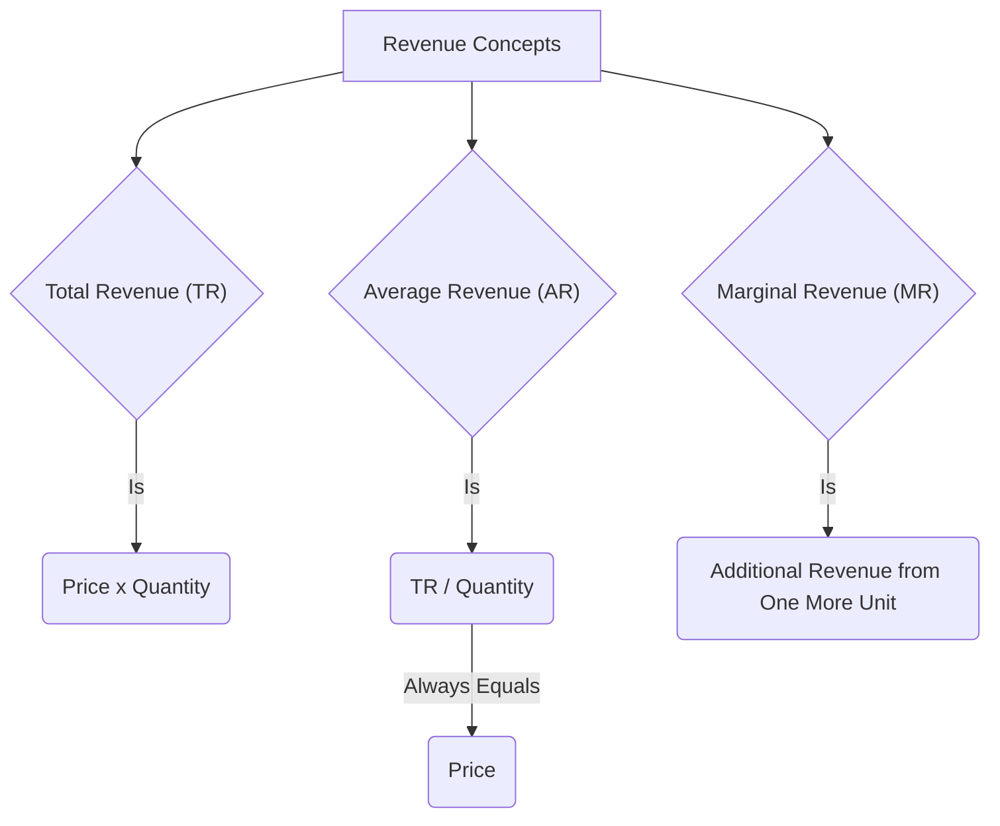

#### **12. Shutdown Point**

**Concept:** In the short run, the shutdown point is the level of output and price at which a firm is indifferent between producing and shutting down. A firm will shut down if the price falls below its minimum average variable cost (P < min AVC), because it cannot even cover its variable costs of production. Above this point, it will continue to produce to cover some portion of its fixed costs.

**Mermaid Diagram:**

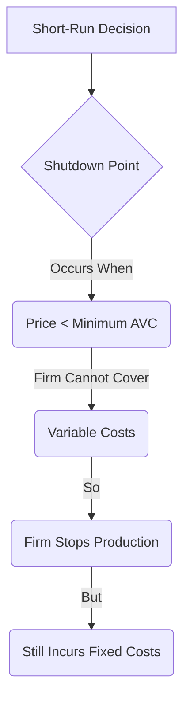

#### **13. Break-Even Point**

**Concept:** The break-even point is the level of output at which a firm's total revenue equals its total costs (both fixed and variable). At this point, the firm is making zero economic profit (or normal profit, covering all opportunity costs). Producing above this point yields a profit, and below it results in a loss.

**Mermaid Diagram:**

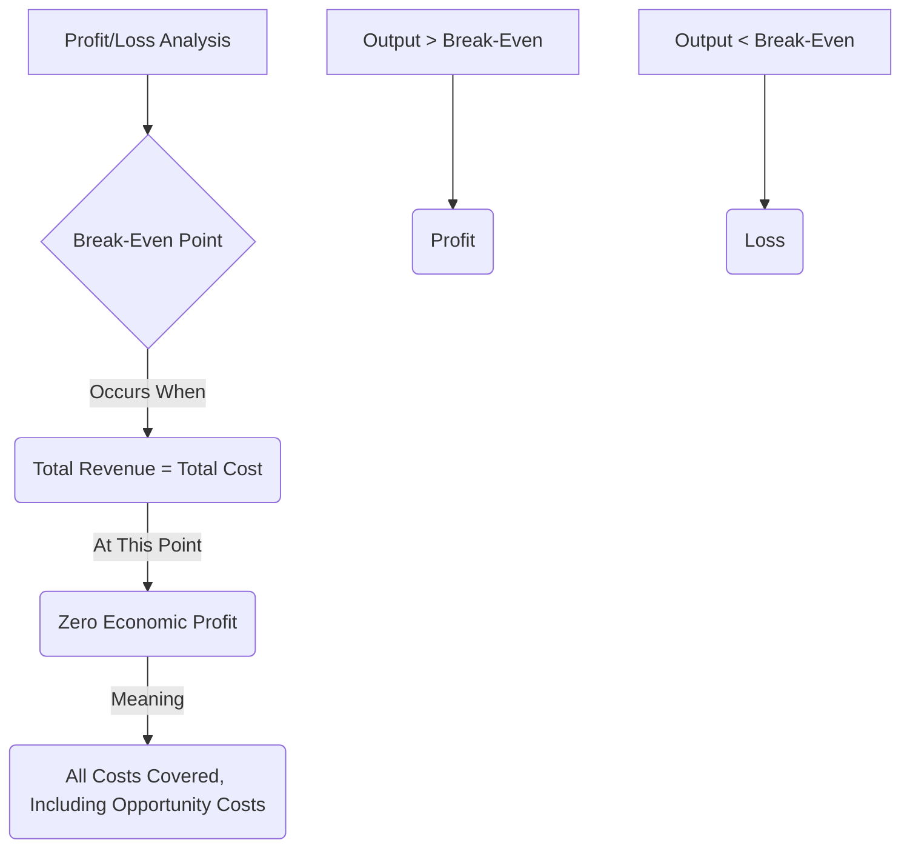

---

This detailed breakdown with Mermaid diagrams should provide a strong foundation for understanding Module 2. Remember to practice drawing these curves and explaining the relationships between them!
