### **Module 3: Market Structure**

#### **1. Perfect and Imperfect Competition**

**Concept:** Market structure refers to the characteristics of a market that influence the behavior of firms within it.
*   **Perfect Competition:** A theoretical market where many small firms sell identical products, there are no barriers to entry/exit, and firms are price takers.
*   **Imperfect Competition:** Any market structure that deviates from perfect competition, where firms have some degree of market power (ability to influence price). This includes monopoly, monopolistic competition, and oligopoly.

**Mermaid Diagram:**

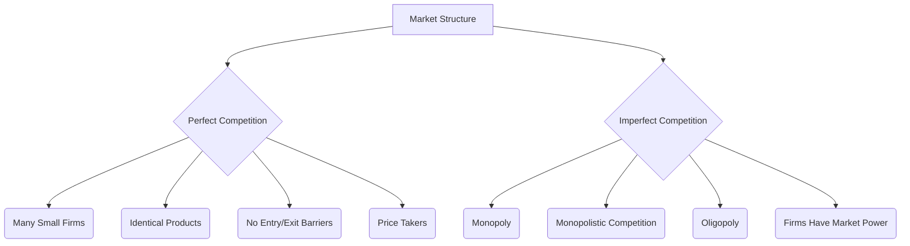

#### **2. Monopoly**

**Concept:** A market structure where there is a single seller of a unique product with no close substitutes. The monopolist has significant market power and faces the entire market demand curve. High barriers to entry prevent other firms from entering.

**Mermaid Diagram:**

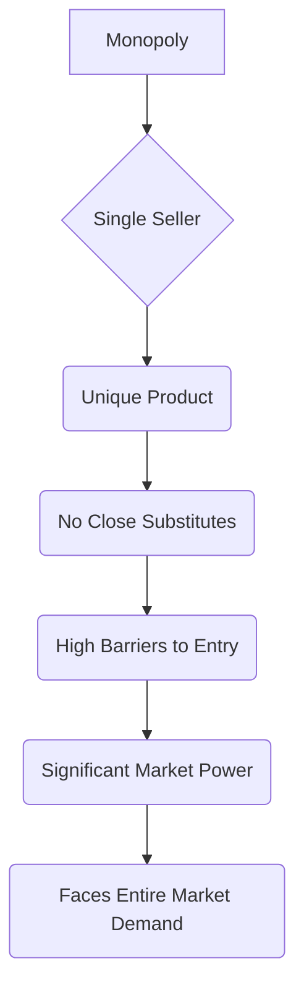

#### **3. Regulation of Monopoly**

**Concept:** Governments often regulate monopolies due to their potential to charge high prices and restrict output, leading to inefficiency and unfairness. Regulation can involve price controls, anti-trust laws, promoting competition, or public ownership.

**Mermaid Diagram:**

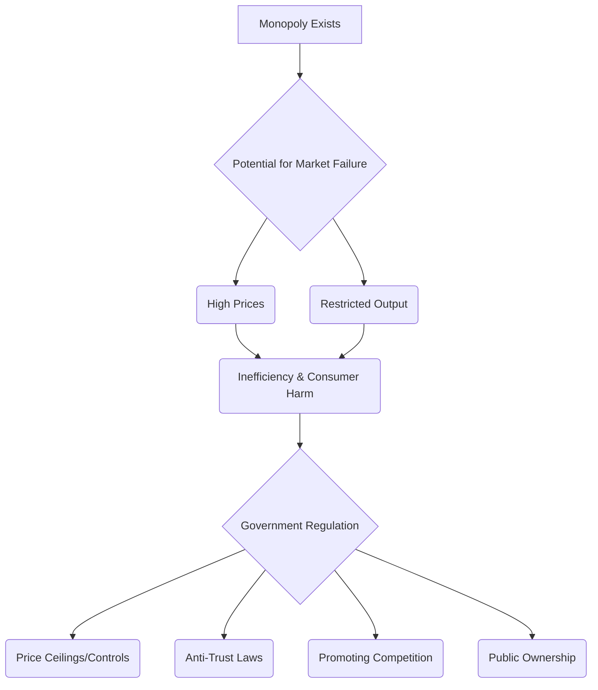

#### **4. Monopolistic Competition (Features and Equilibrium of a Firm)**

**Concept:** A market structure characterized by many firms selling differentiated products. Each firm has some market power due to product differentiation but faces competition from close substitutes. Entry and exit are relatively easy. In the short run, firms can earn economic profits, but in the long run, only normal profits due to entry.

**Mermaid Diagram:**

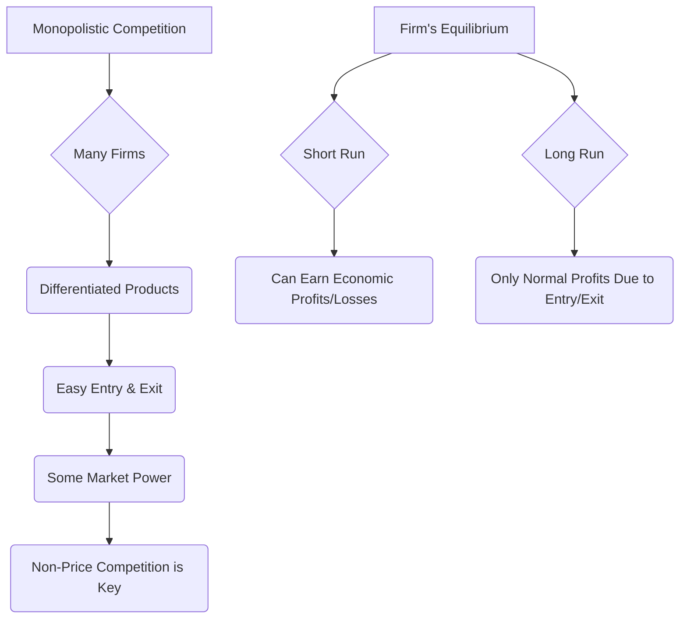

#### **5. Oligopoly**

**Concept:** A market structure dominated by a few large firms. Products can be identical or differentiated. The key characteristic is mutual interdependence, meaning the actions of one firm significantly impact the others, leading to strategic decision-making. High barriers to entry exist.

**Mermaid Diagram:**

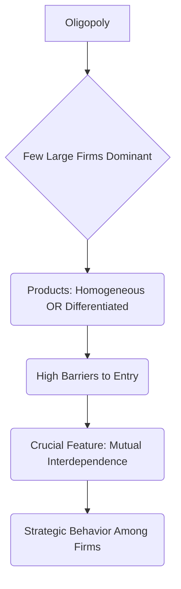

#### **6. Kinked Demand Curve**

**Concept:** A model used to explain price rigidity in oligopolistic markets. It assumes that rival firms will match price cuts but will *not* match price increases. This creates a "kink" in the demand curve faced by an oligopolist, making firms hesitant to change prices.

**Mermaid Diagram:**

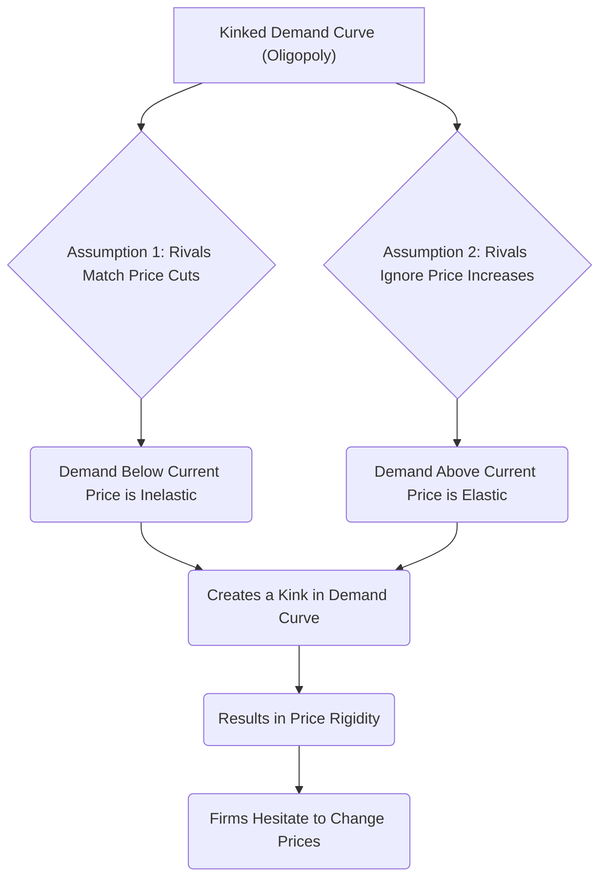

#### **7. Collusive Oligopoly (Meaning)**

**Concept:** Occurs when oligopolistic firms openly or secretly cooperate to limit competition, typically by fixing prices, restricting output, or dividing markets. The goal is to maximize joint profits, acting like a single monopoly. Cartels are a form of explicit collusion. Often illegal.

**Mermaid Diagram:**

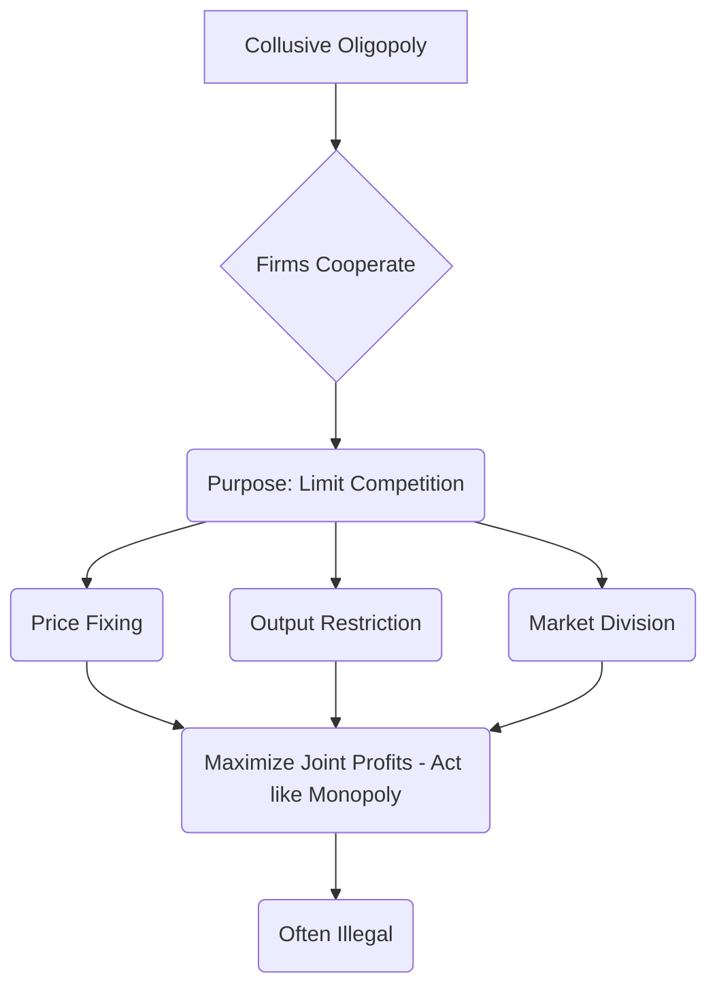

#### **8. Non-Price Competition**

**Concept:** Strategies used by firms to attract customers and increase market share *without* lowering prices. Common in monopolistic competition and oligopoly. Examples include advertising, product differentiation, branding, customer service, and quality improvements.

**Mermaid Diagram:**

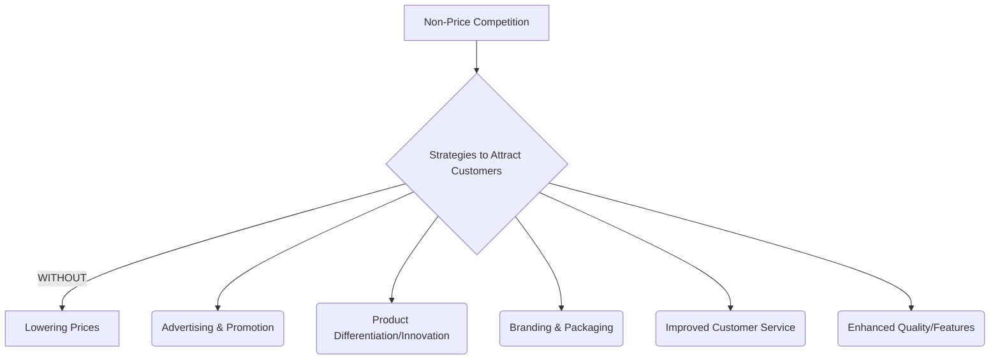

#### **9. Product Pricing (General Overview)**

**Concept:** The process by which firms determine the price at which they will sell their products or services. It involves considering costs, demand, competition, and market objectives. The following concepts are specific strategies.

**Mermaid Diagram:**

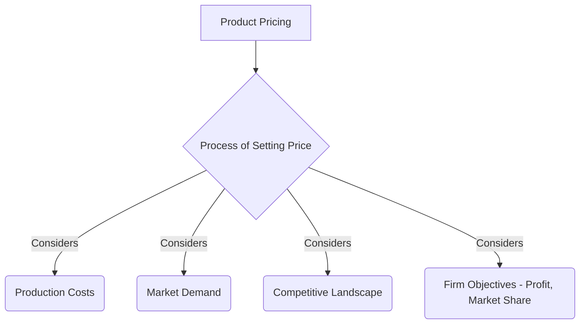

#### **10. Cost-Plus Pricing**

**Concept:** A pricing method where a firm calculates the total cost of producing a product and then adds a predetermined percentage (markup) to that cost to arrive at the selling price. It's simple but doesn't explicitly consider demand or competition.

**Mermaid Diagram:**

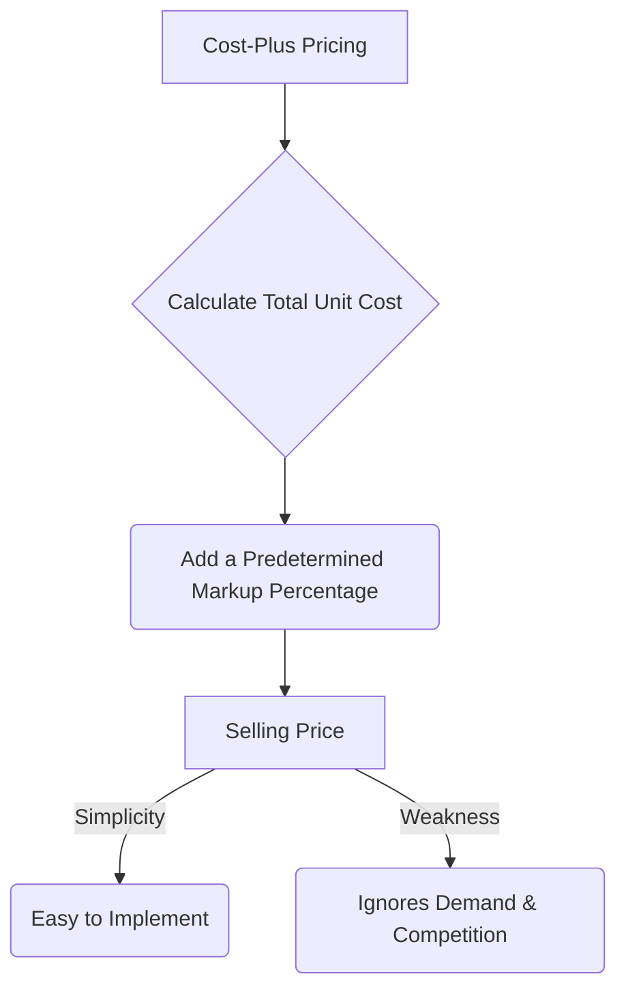

#### **11. Target Return Pricing**

**Concept:** A pricing method where a firm sets a price that will enable it to achieve a specific rate of return on its investment or assets, given a certain sales volume. It focuses on achieving financial objectives.

**Mermaid Diagram:**

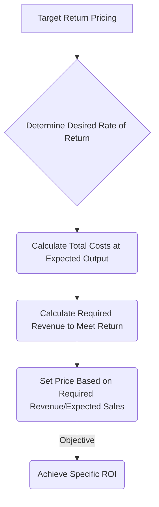

#### **12. Penetration Pricing**

**Concept:** A pricing strategy where a firm sets a relatively low initial price for a new product to quickly gain market share, attract a large number of customers, and build sales volume. It's often used for products with high price elasticity of demand or when aiming for economies of scale.

**Mermaid Diagram:**

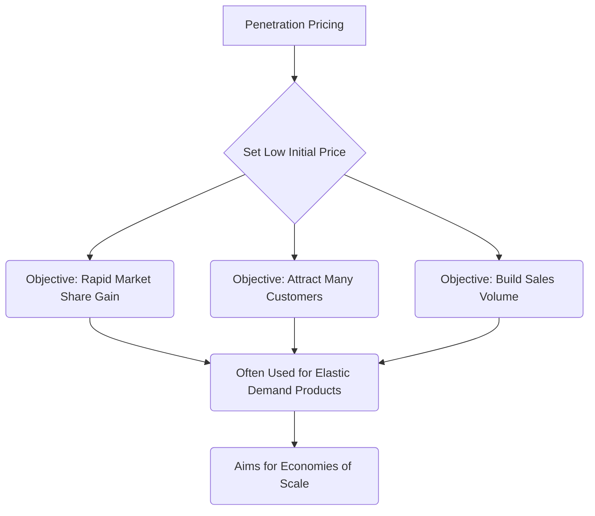

#### **13. Predatory Pricing**

**Concept:** An illegal pricing strategy where a dominant firm sets extremely low prices, sometimes below cost, with the intent of driving competitors out of the market. Once competitors are gone, the predator raises prices to monopoly levels.

**Mermaid Diagram:**

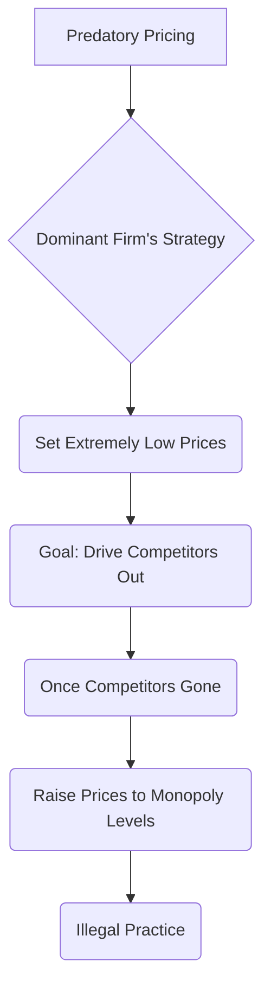

#### **14. Going Rate Pricing**

**Concept:** A pricing strategy where a firm bases its prices primarily on the prices charged by its competitors for similar products. The firm simply matches or slightly undercuts/overcuts the "going rate" in the market, rather than focusing on its own costs or demand.

**Mermaid Diagram:**

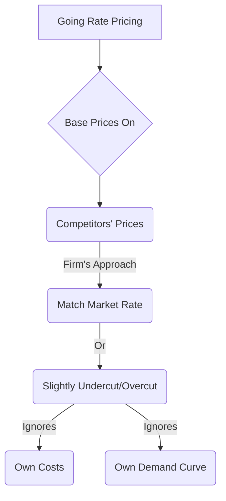

#### **15. Price Skimming**

**Concept:** A pricing strategy where a firm sets a relatively high initial price for a new, innovative product. This allows the firm to "skim" maximum revenue from the segments willing to pay a high price. As demand from high-paying segments is satisfied, the price is gradually lowered to attract more price-sensitive customers.

**Mermaid Diagram:**

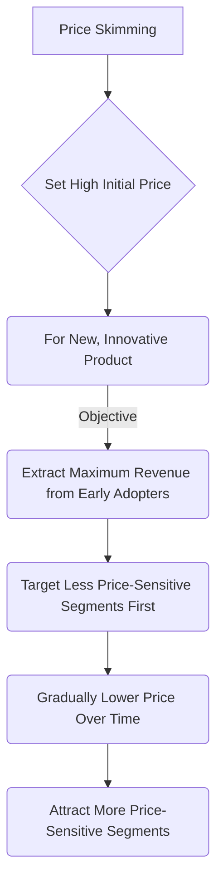
