Here are the answers to your questions, prioritizing the calculation and essay questions with Mermaid diagrams as requested.

### Calculation

1.  **The selling price of a product is ₹20 per unit and the variable cost is ₹15 per unit. Calculate the P/V ratio.**

    *   **Selling Price (S)** = ₹20 per unit
    *   **Variable Cost (V)** = ₹15 per unit

    **1. Calculate Contribution (C):**
    Contribution = Selling Price - Variable Cost
    C = ₹20 - ₹15 = ₹5 per unit

    **2. Calculate P/V Ratio:**
    P/V Ratio = (Contribution / Selling Price) × 100
    P/V Ratio = (₹5 / ₹20) × 100
    P/V Ratio = 0.25 × 100
    **P/V Ratio = 25%**

---

### PART – B (Essay Questions with Diagrams)

#### Module 2 (First Set)

**5 a. Explain the Cobb–Douglas production function.**

The Cobb-Douglas production function is a widely used econometric model to represent the technological relationship between the amounts of two or more inputs (particularly physical capital and labor) and the amount of output that can be produced by those inputs. It is expressed in the form:

`Q = A * L^α * K^β`

Where:
*   `Q` represents total production (output).
*   `A` is the total factor productivity (a measure of technology that indicates how efficiently inputs are converted into output).
*   `L` represents labor input.
*   `K` represents capital input.
*   `α` (alpha) and `β` (beta) are the output elasticities of labor and capital, respectively. These values represent the percentage change in output resulting from a 1% change in labor or capital, assuming other inputs are held constant.

**Properties:**
*   **Returns to Scale:** The sum of `α + β` indicates the returns to scale.
    *   If `α + β = 1`, it implies constant returns to scale (doubling inputs exactly doubles output).
    *   If `α + β > 1`, it implies increasing returns to scale (doubling inputs more than doubles output).
    *   If `α + β < 1`, it implies decreasing returns to scale (doubling inputs less than doubles output).
*   **Elasticity of Substitution:** In the basic Cobb-Douglas form, the elasticity of substitution between labor and capital is constant and equal to one. This means that a given percentage change in the relative price of labor to capital will lead to an equal percentage change in the capital/labor ratio.
*   **Marginal Product:** The marginal product of an input (e.g., labor) is positive but diminishing, meaning that adding more of one input while holding others constant will increase output, but at a decreasing rate.
*   **Factor Shares:** If factors are paid their marginal products, then `α` and `β` also represent the share of total income going to labor and capital, respectively, in a competitive market.

The Cobb-Douglas function is popular due to its mathematical simplicity and its ability to fit a wide range of empirical data, providing insights into productivity and economic growth.

**5 b. Explain the concept of isoquant and iso-cost line. How is producer’s equilibrium determined using them? Illustrate with a diagram.**

**Isoquant:**
An isoquant (from "iso" meaning equal, and "quant" meaning quantity) is a curve that shows all the possible combinations of two inputs (typically labor and capital) that can produce a given level of output. Just as indifference curves represent equal levels of utility for a consumer, isoquants represent equal levels of production for a producer. Key characteristics include:
*   They are downward sloping.
*   They are convex to the origin (reflecting diminishing marginal rate of technical substitution).
*   Higher isoquants represent higher levels of output.
*   They do not intersect.

**Iso-cost Line:**
An iso-cost line is a curve that shows all the combinations of two inputs (labor and capital) that a firm can purchase with a given total cost, assuming constant input prices. It is analogous to a consumer's budget line. The slope of the iso-cost line is determined by the ratio of the prices of the two inputs (e.g., wage rate / rental rate of capital).

**Producer’s Equilibrium:**
Producer's equilibrium, also known as optimal input combination or least-cost combination, occurs when a firm produces a given level of output at the minimum possible cost. Graphically, this is achieved at the point where an isoquant is tangent to an iso-cost line. At this point, the slope of the isoquant (Marginal Rate of Technical Substitution, MRTS) is equal to the slope of the iso-cost line (the ratio of input prices).

Mathematically, producer's equilibrium is where:
`MRTS (L for K) = MPL / MPK = PL / PK`
Where:
*   `MPL` is the marginal product of labor.
*   `MPK` is the marginal product of capital.
*   `PL` is the price of labor (wage rate).
*   `PK` is the price of capital (rental rate).

This condition means that the firm is getting the maximum possible output for a given cost, or producing a given output at the minimum possible cost, by efficiently allocating its expenditure between labor and capital.

View Diagram

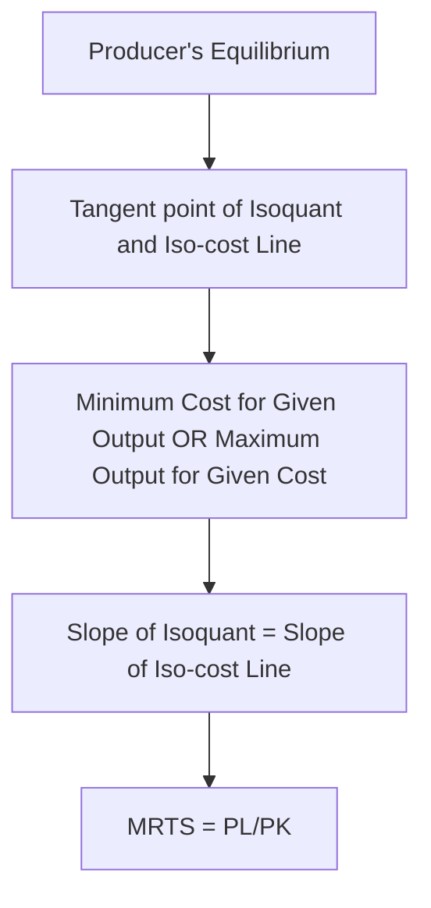
```mermaid
graph TD
    A["Producer's Equilibrium"] --> B["Tangent point of Isoquant and Iso-cost Line"]
    B --> C["Minimum Cost for Given Output OR Maximum Output for Given Cost"]
    C --> D["Slope of Isoquant = Slope of Iso-cost Line"]
    D --> E["MRTS = PL/PK"]
```

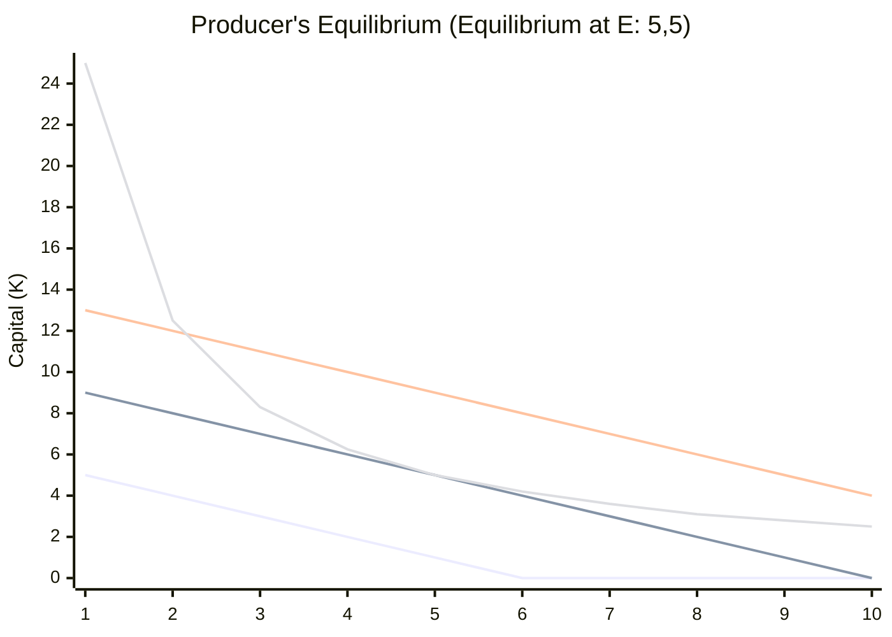
```mermaid
xychart-beta
    title "Producer's Equilibrium (Equilibrium at E: 5,5)"
    x-axis [1, 2, 3, 4, 5, 6, 7, 8, 9, 10]
    y-axis "Capital (K)" 0 --> 25
    line "Iso-cost C1" [5, 4, 3, 2, 1, 0, 0, 0, 0, 0]
    line "Iso-cost C2 (Optimal)" [9, 8, 7, 6, 5, 4, 3, 2, 1, 0]
    line "Iso-cost C3" [13, 12, 11, 10, 9, 8, 7, 6, 5, 4]
    line "Isoquant Q2" [25, 12.5, 8.3, 6.25, 5, 4.2, 3.6, 3.1, 2.8, 2.5]
```

**Explanation of Diagram:**
*   The x-axis represents Labor (L) and the y-axis represents Capital (K).
*   `IsoQ1`, `IsoQ2`, `IsoQ3` are isoquants, showing different levels of output. `Q2` represents a higher output level than `Q1`.
*   `IsoC1`, `IsoC2`, `IsoC3` are iso-cost lines, showing different total costs. `C2` represents a higher total cost than `C1`.
*   The producer's equilibrium is at point `E`, where the isoquant `Q2` is tangent to the iso-cost line `C2`. At this point, the firm produces output `Q2` at the minimum cost `C2`. Any other point on `Q2` would be on a higher iso-cost line (like `C3` for the same output `Q2`), implying higher cost. Any other point on `C2` would be on a lower isoquant (like `Q1` for the same cost `C2`), implying lower output.

**6 a. Explain the short-run and long-run cost curves of a firm with suitable diagrams.**

**Short-Run Cost Curves:**
In the short run, at least one factor of production is fixed (typically capital), while others are variable (typically labor and raw materials). Short-run costs include fixed costs and variable costs.
*   **Total Fixed Cost (TFC):** Costs that do not vary with the level of output (e.g., rent, insurance). TFC curve is a horizontal line.
*   **Total Variable Cost (TVC):** Costs that change with the level of output (e.g., raw materials, wages). TVC curve typically increases at a decreasing rate initially, then at an increasing rate.
*   **Total Cost (TC):** TC = TFC + TVC. The TC curve has the same shape as TVC but starts from the TFC level.
*   **Average Fixed Cost (AFC):** AFC = TFC / Output. It continuously declines as output increases, forming a rectangular hyperbola.
*   **Average Variable Cost (AVC):** AVC = TVC / Output. It typically declines initially, reaches a minimum, and then rises (U-shaped).
*   **Average Total Cost (ATC):** ATC = TC / Output or AFC + AVC. It is also U-shaped, lying above the AVC curve. The minimum point of ATC occurs after the minimum point of AVC.
*   **Marginal Cost (MC):** MC is the additional cost incurred to produce one more unit of output. It intersects both the AVC and ATC curves at their respective minimum points and is also U-shaped.

View Diagram

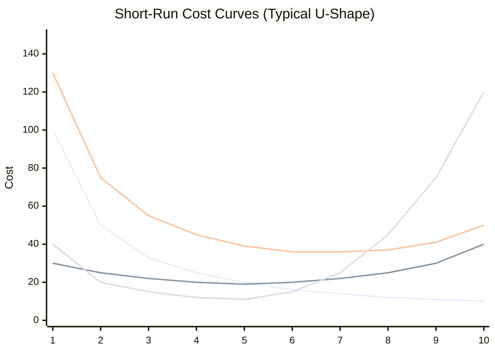
```mermaid
xychart-beta
    title "Short-Run Cost Curves (Typical U-Shape)"
    x-axis [1, 2, 3, 4, 5, 6, 7, 8, 9, 10]
    y-axis "Cost" 0 --> 150
    line "AFC" [100, 50, 33, 25, 20, 16, 14, 12, 11, 10]
    line "AVC" [30, 25, 22, 20, 19, 20, 22, 25, 30, 40]
    line "ATC" [130, 75, 55, 45, 39, 36, 36, 37, 41, 50]
    line "MC"  [40, 20, 15, 12, 11, 15, 25, 45, 75, 120]
```

**Explanation of Short-Run Diagram:**
*   The Y-axis represents Cost, and the X-axis represents Output.
*   **AFC** declines continuously as fixed costs are spread over more units.
*   **AVC** is U-shaped due to the law of variable proportions (increasing, then diminishing returns).
*   **ATC** is also U-shaped, reflecting the combined effect of declining AFC and U-shaped AVC.
*   **MC** is U-shaped and intersects both AVC and ATC at their lowest points. When MC is below AVC or ATC, it pulls them down; when it is above, it pulls them up.

**Long-Run Cost Curves:**
In the long run, all factors of production are variable. Firms can change the scale of their operations (e.g., build new factories, exit industries). There are no fixed costs in the long run.
*   **Long-Run Average Cost (LRAC):** The LRAC curve shows the minimum average cost of producing any given level of output when all inputs are variable. It is derived as the envelope of all possible short-run average total cost (SRATC) curves. The LRAC is typically U-shaped due to economies and diseconomies of scale.
*   **Long-Run Marginal Cost (LRMC):** The LRMC curve shows the additional cost of producing one more unit of output in the long run when all inputs are variable. It intersects the LRAC curve at its minimum point.

View Diagram

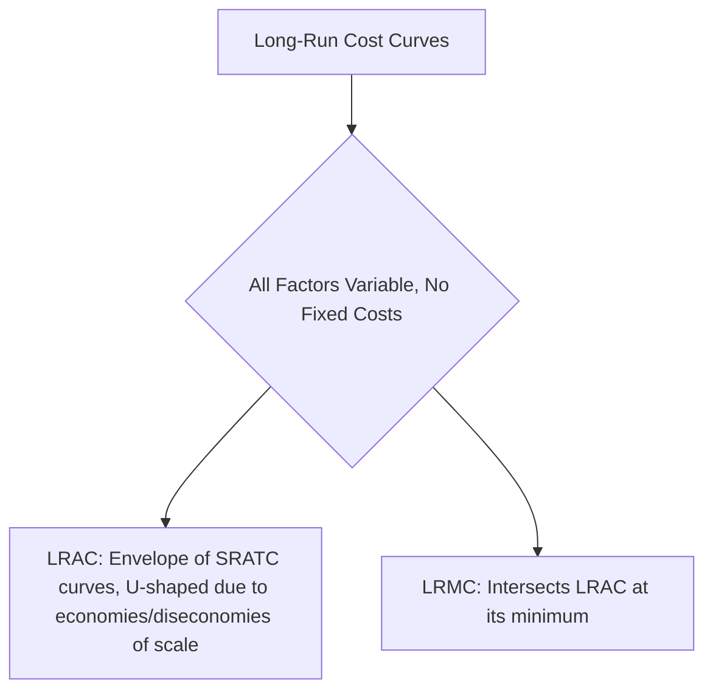
```mermaid
graph TD
    A["Long-Run Cost Curves"] --> B{"All Factors Variable, No Fixed Costs"}
    B --> C["LRAC: Envelope of SRATC curves, U-shaped due to economies/diseconomies of scale"]
    B --> D["LRMC: Intersects LRAC at its minimum"]
```

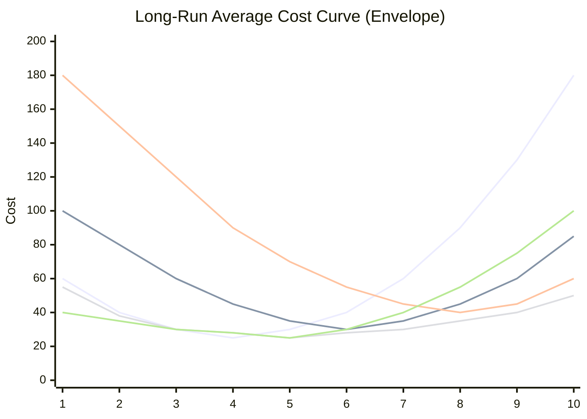
```mermaid
xychart-beta
    title "Long-Run Average Cost Curve (Envelope)"
    x-axis [1, 2, 3, 4, 5, 6, 7, 8, 9, 10]
    y-axis "Cost" 0 --> 200
    line "SRATC 1" [60, 40, 30, 25, 30, 40, 60, 90, 130, 180]
    line "SRATC 2" [100, 80, 60, 45, 35, 30, 35, 45, 60, 85]
    line "SRATC 3" [180, 150, 120, 90, 70, 55, 45, 40, 45, 60]
    line "LRAC (Envelope)" [55, 38, 30, 28, 25, 28, 30, 35, 40, 50]
    line "LRMC" [40, 35, 30, 28, 25, 30, 40, 55, 75, 100]
```

**Explanation of Long-Run Diagram:**
*   The LRAC curve is tangent to the various short-run ATC curves (SRATC1, SRATC2, SRATC3) at their minimum points only when the LRAC is at its own minimum. At other points, LRAC is tangent to a point on the SRATC curves, but not necessarily at their minimums.
*   The LRAC is U-shaped because as the firm increases its scale of operations, it initially experiences **economies of scale** (costs per unit fall), then **constant returns to scale**, and eventually **diseconomies of scale** (costs per unit rise).
*   The LRMC curve intersects the LRAC curve at its minimum point.

**6 b. Explain economies of scale and distinguish between internal and external economies of scale with suitable examples.**

**Economies of Scale:**
Economies of scale refer to the cost advantages that a firm obtains due to expansion. As a firm increases its output, its average cost per unit of production decreases. This occurs because fixed costs are spread over a larger number of units, and variable inputs can be utilized more efficiently. Economies of scale are a major reason for the U-shaped long-run average cost curve.

**Internal Economies of Scale:**
Internal economies of scale are cost reductions that a firm experiences due to its own growth in size or output. These benefits accrue to the firm itself and are within its control. They lead to a downward-sloping segment of the firm's long-run average cost curve.
*   **Examples:**
    *   **Technical Economies:** Large firms can use more specialized and efficient machinery, employ mass production techniques, and divide labor into specialized tasks, leading to higher productivity and lower average costs. *Example: A large car manufacturer using assembly lines and specialized robots, which are too expensive for a small workshop.*
    *   **Managerial Economies:** Large firms can afford to employ specialist managers (e.g., in finance, marketing, human resources) who are more efficient than general managers in smaller firms. Division of managerial labor also improves efficiency. *Example: A large multinational corporation having dedicated departments for legal, R&D, and marketing, each staffed by experts.*
    *   **Financial Economies:** Larger firms can often obtain loans at lower interest rates and have easier access to capital markets (e.g., issuing shares or bonds) compared to smaller firms, which are perceived as less risky. *Example: A major tech company securing a large bank loan at a preferential rate to fund a new project.*
    *   **Marketing Economies:** Large firms can spread the cost of advertising and distribution over a larger output, reducing the average marketing cost per unit. They can also buy inputs in bulk at discounted prices. *Example: A global soft drink company running a national TV advertising campaign, reaching millions of customers at a lower cost per viewer than a local beverage company.*
    *   **Risk-bearing Economies:** Large firms can diversify their product lines and markets, spreading risks. If one product or market performs poorly, others can compensate. *Example: A diversified conglomerate operating in multiple industries like electronics, textiles, and real estate, reducing overall business risk.*

**External Economies of Scale:**
External economies of scale are cost reductions that all firms in a particular industry or geographic area experience as the industry as a whole grows. These benefits arise from factors outside the individual firm and are beyond its direct control. They lead to a downward shift of the entire industry's long-run average cost curve.
*   **Examples:**
    *   **Infrastructure Development:** As an industry grows in a region, local governments or private entities may invest in better transportation networks, communication systems, or power supply, benefiting all firms in that area. *Example: The development of specialized port facilities or road networks to serve a growing automotive manufacturing cluster.*
    *   **Skilled Labor Pool:** A growing industry can lead to the development of a specialized labor pool in the region, reducing search and training costs for individual firms. Educational institutions may offer specialized courses. *Example: The concentration of tech companies in Silicon Valley attracting and fostering a large pool of software engineers and IT professionals.*
    *   **Ancillary Industries:** The growth of a primary industry encourages the development of supporting industries that provide specialized inputs, services, or components at lower costs. *Example: A thriving textile industry leading to the growth of specialized dye suppliers, fabric machinery manufacturers, and logistics services in the same region.*
    *   **Research and Development (R&D):** Industry-specific research institutions or government-funded R&D can generate new technologies and knowledge that benefit all firms in the sector. *Example: Collective research efforts in the pharmaceutical industry leading to advancements that benefit multiple drug manufacturers.*

#### Module 3&4 (First Set)

**7 a. Explain the features of perfect competition and discuss how a firm reaches equilibrium under perfect competition.**

**Features of Perfect Competition:**
Perfect competition is a theoretical market structure characterized by the following features:
1.  **Large Number of Buyers and Sellers:** There are so many buyers and sellers that no single participant has the power to influence the market price. Each firm is a price taker.
2.  **Homogeneous Products:** All firms sell identical products, meaning there is no differentiation in terms of quality, features, or branding. Consumers perceive products from different sellers as perfect substitutes.
3.  **Free Entry and Exit:** Firms can enter or exit the market freely without facing any significant barriers (e.g., legal restrictions, high capital requirements). This ensures that firms cannot earn supernormal profits in the long run.
4.  **Perfect Information:** Both buyers and sellers have complete and symmetric information about prices, products, and market conditions. Consumers know the prices charged by all firms, and firms know all input and output prices.
5.  **Perfect Mobility of Factors of Production:** Resources (labor, capital, land) can move freely between industries in response to changes in economic conditions.

**Firm's Equilibrium Under Perfect Competition:**

Under perfect competition, a firm is a **price taker**, meaning it must accept the market-determined price for its product. This implies that the firm's demand curve is perfectly elastic (horizontal) at the market price. For a perfectly competitive firm, **Price (P) = Marginal Revenue (MR) = Average Revenue (AR)**.

Firms aim to maximize profits, which occurs at the output level where Marginal Cost (MC) equals Marginal Revenue (MR).

**Short-Run Equilibrium:**
In the short run, a firm under perfect competition can earn supernormal profits, normal profits, or incur losses.
*   **Profit Maximization:** The firm produces where `MR = MC`. Since `P = MR`, the condition becomes `P = MC`.
*   **Supernormal Profits:** If `P > ATC` at the equilibrium output, the firm earns supernormal (economic) profits.
*   **Normal Profits:** If `P = ATC` at the equilibrium output, the firm earns normal profits (covering all costs, including implicit costs).
*   **Losses:** If `P < ATC` but `P ≥ AVC` at the equilibrium output, the firm incurs losses but continues to produce to cover at least its variable costs. If `P < AVC`, the firm will shut down to minimize losses.

View Diagram

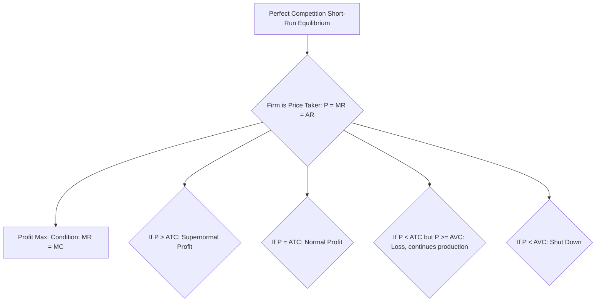
```mermaid
graph TD
    A["Perfect Competition Short-Run Equilibrium"] --> B{"Firm is Price Taker: P = MR = AR"}
    B --> C["Profit Max. Condition: MR = MC"]
    B --> D{"If P > ATC: Supernormal Profit"}
    B --> E{"If P = ATC: Normal Profit"}
    B --> F{"If P < ATC but P >= AVC: Loss, continues production"}
    B --> G{"If P < AVC: Shut Down"}
```

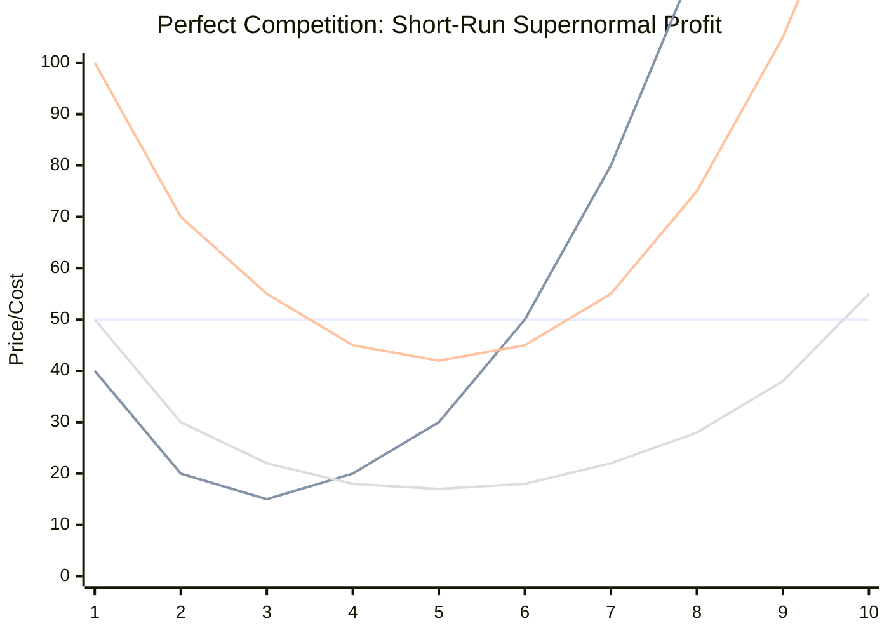
```mermaid
xychart-beta
    title "Perfect Competition: Short-Run Supernormal Profit"
    x-axis [1, 2, 3, 4, 5, 6, 7, 8, 9, 10]
    y-axis "Price/Cost" 0 --> 100
    line "P = MR = AR" [50, 50, 50, 50, 50, 50, 50, 50, 50, 50]
    line "MC" [40, 20, 15, 20, 30, 50, 80, 120, 170, 230]
    line "ATC" [100, 70, 55, 45, 42, 45, 55, 75, 105, 145]
    line "AVC" [50, 30, 22, 18, 17, 18, 22, 28, 38, 55]
```

**Explanation of Short-Run Profit Diagram:**
*   The horizontal line `P=MR=AR` represents the market price the firm takes.
*   The firm produces at `Qe` where `MC` intersects `MR` (and thus `P`).
*   Since `P` is greater than `ATC` at `Qe`, the firm earns supernormal profits, represented by the shaded rectangle.

**Long-Run Equilibrium:**
In the long run, the freedom of entry and exit of firms ensures that all firms in a perfectly competitive market earn only **normal profits**.
*   If firms are earning supernormal profits in the short run, new firms will be attracted to the industry. This increases market supply, drives down the market price, and reduces profits for existing firms until only normal profits remain (`P = ATC`).
*   If firms are incurring losses in the short run, some firms will exit the industry. This decreases market supply, drives up the market price, and reduces losses for remaining firms until they earn normal profits (`P = ATC`).
*   Therefore, in long-run equilibrium, a perfectly competitive firm produces at the output level where `P = MR = MC = minimum LRAC = minimum SRATC`. This is the most efficient point of production.

View Diagram

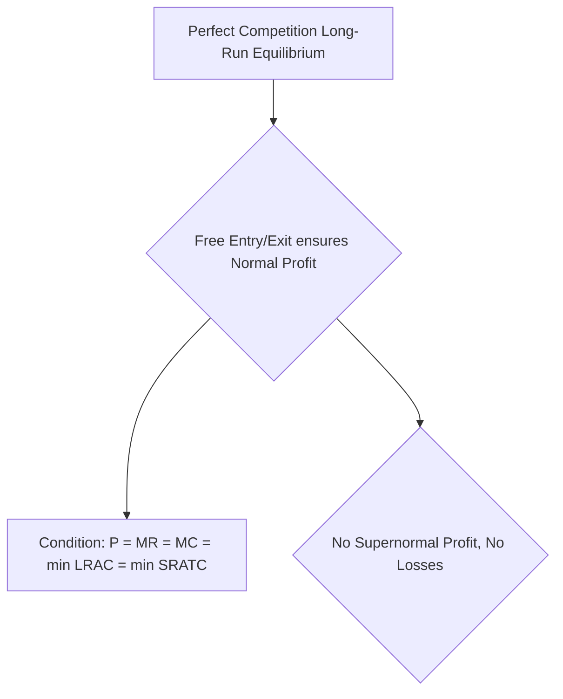
```mermaid
graph TD
    A["Perfect Competition Long-Run Equilibrium"] --> B{"Free Entry/Exit ensures Normal Profit"}
    B --> C["Condition: P = MR = MC = min LRAC = min SRATC"]
    B --> D{"No Supernormal Profit, No Losses"}
```

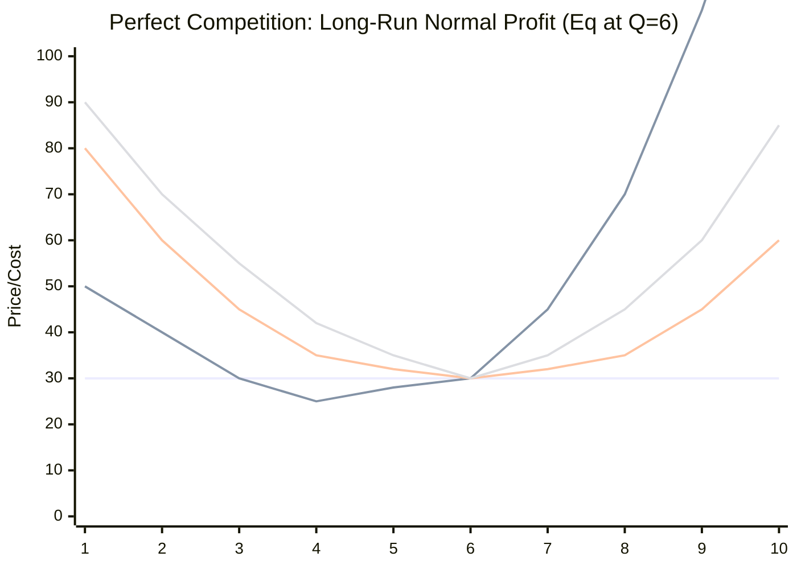
```mermaid
xychart-beta
    title "Perfect Competition: Long-Run Normal Profit (Eq at Q=6)"
    x-axis [1, 2, 3, 4, 5, 6, 7, 8, 9, 10]
    y-axis "Price/Cost" 0 --> 100
    line "P = MR = AR" [30, 30, 30, 30, 30, 30, 30, 30, 30, 30]
    line "LRMC" [50, 40, 30, 25, 28, 30, 45, 70, 110, 160]
    line "LRAC" [80, 60, 45, 35, 32, 30, 32, 35, 45, 60]
    line "SRATC (Optimal)" [90, 70, 55, 42, 35, 30, 35, 45, 60, 85]
```

**Explanation of Long-Run Normal Profit Diagram:**
*   The market price `P=MR=AR` is tangent to the minimum point of both the short-run average total cost (ATC) and long-run average cost (LRAC) curves.
*   The firm produces at `Qe` where `P = MR = MC = min ATC = min LRAC`. This indicates both productive efficiency (producing at the lowest possible cost) and allocative efficiency (P=MC).

**7 b. Explain the types, causes, and effects of inflation, and its impact on debtors, creditors, salaried class, and wage earners.**

**Inflation:**
Inflation is a sustained increase in the general price level of goods and services in an economy over a period of time. As the general price level rises, each unit of currency buys fewer goods and services, meaning inflation reflects a reduction in the purchasing power per unit of money.

**Types of Inflation:**
1.  **Demand-Pull Inflation:** Occurs when aggregate demand in an economy outpaces aggregate supply. Too much money chasing too few goods.
2.  **Cost-Push Inflation:** Occurs when there is an increase in the costs of production (e.g., wages, raw material prices, energy prices), which firms then pass on to consumers in the form of higher prices.
3.  **Built-in Inflation (or Wage-Price Spiral):** Results from adaptive expectations, where people expect current inflation rates to continue into the future. Workers demand higher wages to maintain their real income, and firms pass these higher wage costs on as higher prices, leading to a self-perpetuating cycle.
4.  **Hyperinflation:** Extremely rapid or out-of-control inflation, often exceeding 50% per month. It leads to a complete collapse of currency value and economic disruption.
5.  **Stagflation:** A portmanteau of stagnation and inflation, referring to a period of high inflation combined with high unemployment and stagnant demand in an economy.

**Causes of Inflation:**
*   **Excessive Money Supply:** When the central bank prints too much money or expands credit too rapidly, the value of money falls, leading to higher prices (monetarist view).
*   **High Aggregate Demand (Demand-Pull):**
    *   Increased government spending without corresponding tax increases.
    *   Rapid growth in consumer spending, often fueled by easy credit.
    *   Booming exports leading to higher foreign demand for domestic goods.
    *   Reduced taxes, leaving more disposable income.
*   **Increased Production Costs (Cost-Push):**
    *   **Wage Increases:** Strong labor unions or labor shortages leading to higher wages.
    *   **Raw Material Price Hikes:** Increases in global commodity prices (e.g., oil, food).
    *   **Supply Shocks:** Natural disasters or geopolitical events disrupting supply chains.
    *   **Indirect Taxes:** Government imposing higher indirect taxes (e.g., VAT, excise duty).
    *   **Monopoly Power:** Firms with significant market power raising prices to increase profits.

**Effects of Inflation:**
*   **Reduced Purchasing Power:** The most direct effect, as money buys less than before.
*   **Uncertainty:** High or volatile inflation makes economic planning difficult for businesses and individuals.
*   **Redistribution of Income and Wealth:** Inflation can arbitrarily redistribute wealth from some groups to others.
*   **Reduced Investment:** High inflation can discourage investment due to uncertainty and reduced real returns.
*   **Increased Interest Rates:** Central banks often raise interest rates to combat inflation, which can slow down economic growth.
*   **Wage-Price Spiral:** If wages try to catch up with prices, it can lead to further inflation.
*   **Menu Costs:** Businesses incur costs from changing prices (reprinting menus, catalogs).
*   **Shoe-Leather Costs:** People spend more time and effort to minimize the effects of inflation (e.g., frequently withdrawing money).
*   **Balance of Payments Impact:** High domestic inflation can make a country's exports more expensive and imports cheaper, potentially leading to a trade deficit.

**Impact on Specific Groups:**

1.  **Debtors (Borrowers):** Generally **benefit** from inflation. They repay loans with money that has less purchasing power than the money they borrowed. The real value of their debt decreases. *Example: A person who took a fixed-rate loan before a period of high inflation will find it easier to repay the principal and interest with inflated future earnings.*
2.  **Creditors (Lenders):** Generally **lose** from inflation. They receive repayments with money that has less purchasing power than the money they lent. The real value of their assets (loans) decreases. *Example: A bank that provided a fixed-rate loan will receive interest and principal payments that are worth less in real terms during an inflationary period.*
3.  **Salaried Class:** Generally **lose** from inflation, especially if their salaries are fixed or do not keep pace with the rate of inflation. Their real income and purchasing power decline until their wages are adjusted, which often lags behind price increases. *Example: A government employee with a fixed salary for a year will see their purchasing power erode as prices of goods and services rise throughout the year.*
4.  **Wage Earners (with strong unions or indexed wages):** The impact can vary. If wage earners have strong bargaining power (e.g., through unions) or if their wages are indexed to inflation, they might be able to demand and receive wage increases that match or even exceed inflation, thus protecting their real income. However, many wage earners, especially in unorganized sectors, may experience a decline in real wages. *Example: Unionized workers whose collective bargaining agreement includes cost-of-living adjustments (COLA) may be protected, while non-unionized workers might struggle to get their wages adjusted quickly enough.*

**8 a. Explain the characteristics of oligopoly and discuss the kinked demand curve model.**

**Characteristics of Oligopoly:**
Oligopoly is a market structure characterized by a few large firms dominating the market. Key features include:
1.  **Few Sellers:** There are only a small number of large firms that account for the majority of the market share. This implies that the actions of one firm significantly impact others.
2.  **Interdependence:** Firms are highly interdependent. Each firm must consider the likely reactions of its rivals when making decisions about pricing, output, advertising, or product development. This leads to strategic behavior.
3.  **Barriers to Entry:** Significant barriers to entry exist, preventing new firms from easily entering the market. These barriers can be economic (high capital requirements), legal (patents, licenses), or strategic (control over raw materials, aggressive pricing by incumbents).
4.  **Product Differentiation (or Homogeneous Products):** Products can be either homogeneous (e.g., steel, aluminum) or differentiated (e.g., automobiles, soft drinks, mobile phones). In differentiated oligopolies, firms compete through advertising and branding.
5.  **Non-Price Competition:** Due to the interdependence and fear of price wars, firms often engage in non-price competition, such as advertising, product innovation, quality improvements, and customer service.
6.  **Uncertainty and Rigidity of Prices:** The interdependence often leads to price rigidity, where prices tend to be stable for extended periods, as firms are reluctant to change them for fear of triggering undesirable reactions from rivals.

**The Kinked Demand Curve Model (by Paul Sweezy):**

The kinked demand curve model is an important explanation for price rigidity in an oligopolistic market. It suggests that firms in an oligopoly face a demand curve that is "kinked" at the prevailing market price. This kink arises from asymmetric reactions of competitors to price changes.

**Assumptions:**
1.  **Price Increase:** If an oligopolist increases its price above the current market price, its rivals will **not** follow suit. They will keep their prices unchanged to capture the price-increasing firm's customers. This makes the demand curve for price increases relatively elastic.
2.  **Price Decrease:** If an oligopolist decreases its price below the current market price, its rivals **will** follow suit. They will also lower their prices to avoid losing market share. This makes the demand curve for price decreases relatively inelastic.

**Consequences of the Kink:**
*   **Demand Curve:** The firm's demand curve `DD'` is kinked at the prevailing price `P0` and quantity `Q0`. The segment above `P0` is relatively elastic (d), and the segment below `P0` is relatively inelastic (D).
*   **Marginal Revenue Curve:** Because of the kink in the demand curve, the marginal revenue (MR) curve has a discontinuous gap or a vertical "break" directly below the kink. This gap exists between `MR1` and `MR2`.
*   **Price Rigidity:** Due to this vertical gap in the MR curve, the marginal cost (MC) curve can fluctuate within this gap without affecting the equilibrium price `P0` and quantity `Q0`. As long as the MC curve intersects the MR curve within this discontinuous segment, the firm will have no incentive to change its price or output. This explains why prices tend to be stable in oligopolistic markets.

View Diagram

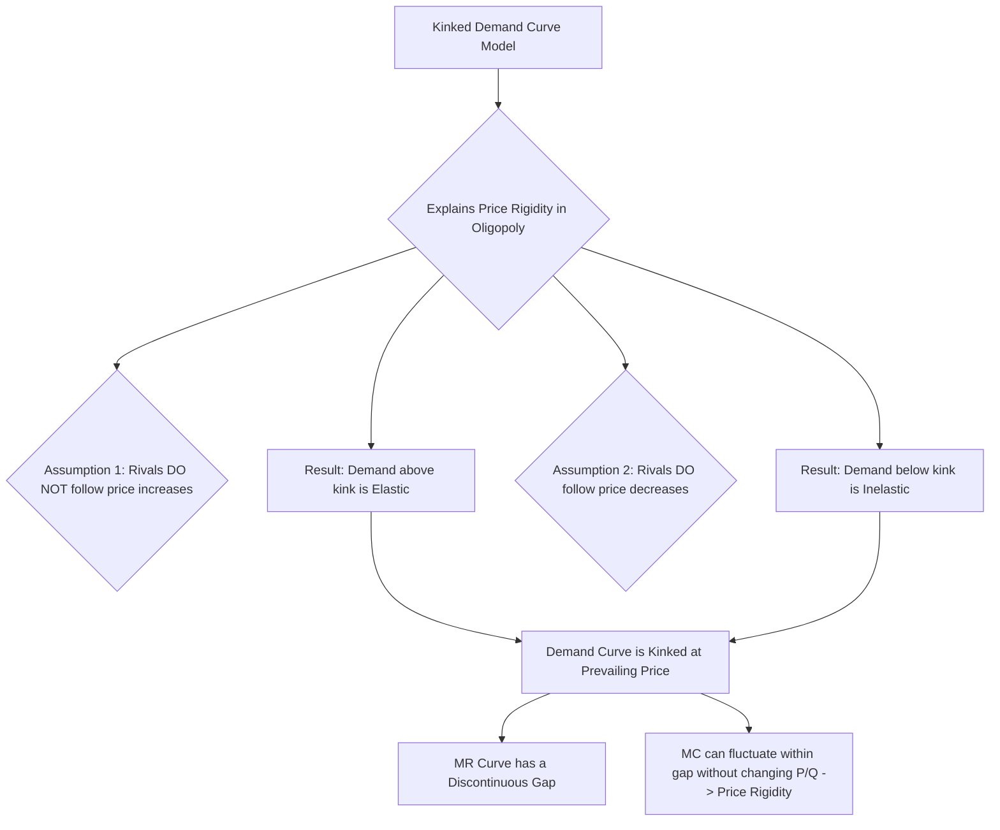
```mermaid
graph TD
    A["Kinked Demand Curve Model"] --> B{"Explains Price Rigidity in Oligopoly"}
    B --> C{"Assumption 1: Rivals DO NOT follow price increases"}
    B --> D["Result: Demand above kink is Elastic"]
    B --> E{"Assumption 2: Rivals DO follow price decreases"}
    B --> F["Result: Demand below kink is Inelastic"]
    D & F --> G["Demand Curve is Kinked at Prevailing Price"]
    G --> H["MR Curve has a Discontinuous Gap"]
    G --> I["MC can fluctuate within gap without changing P/Q -> Price Rigidity"]
```

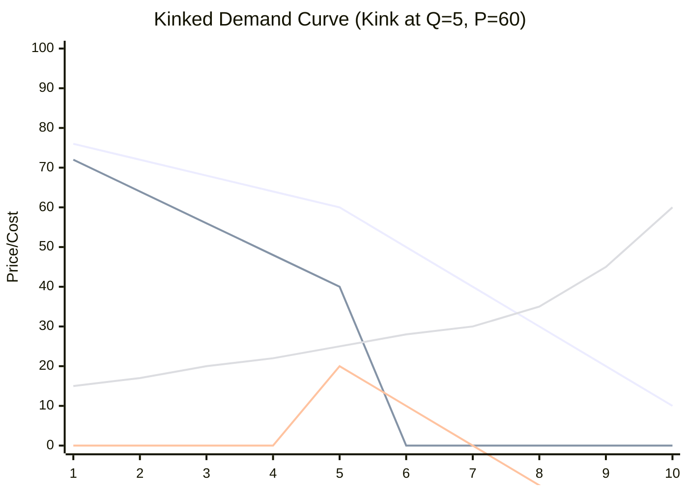
```mermaid
xychart-beta
    title "Kinked Demand Curve (Kink at Q=5, P=60)"
    x-axis [1, 2, 3, 4, 5, 6, 7, 8, 9, 10]
    y-axis "Price/Cost" 0 --> 100
    line "Demand (dD)" [76, 72, 68, 64, 60, 50, 40, 30, 20, 10]
    line "MR Upper" [72, 64, 56, 48, 40, 0, 0, 0, 0, 0]
    line "MR Lower" [0, 0, 0, 0, 20, 10, 0, -10, -20, -30]
    line "MC Curve" [15, 17, 20, 22, 25, 28, 30, 35, 45, 60]
```

**Explanation of Diagram:**
*   The demand curve `DD'` is kinked at the prevailing price `P0` and quantity `Q0`.
*   The upper segment (`d`) is flatter (more elastic), reflecting that a price increase by one firm is not followed by rivals.
*   The lower segment (`D`) is steeper (less elastic), reflecting that a price decrease by one firm is followed by rivals.
*   The marginal revenue curve `MR` has a discontinuous vertical gap directly below the kink.
*   The `MC` curve can shift within this gap without changing the profit-maximizing price and quantity, thus explaining price rigidity.

**8 b. Explain the functions and importance of the stock market, including the role of NIFTY and SENSEX.**

**Stock Market (or Equity Market):**
The stock market is a platform where investors can buy and sell shares of publicly listed companies. It is a critical component of the capital market, facilitating capital formation and allocation in an economy.

**Functions of the Stock Market:**

1.  **Capital Formation for Businesses:**
    *   **Primary Market:** Enables companies to raise capital by issuing new shares (Initial Public Offerings - IPOs) to finance expansion, research, or debt repayment. This is vital for economic growth.
2.  **Liquidity for Investors:**
    *   **Secondary Market:** Provides a platform for existing shareholders to buy and sell their shares, allowing them to convert their investments into cash relatively easily. This liquidity attracts investors.
3.  **Price Discovery:**
    *   Through the forces of supply and demand, the stock market determines the fair value of a company's shares. This provides a real-time valuation of companies.
4.  **Indicator of Economic Health:**
    *   Stock market indices (like NIFTY and SENSEX) serve as barometers of the overall economic health and investor sentiment. A rising market often signals optimism about future economic growth.
5.  **Mobilization of Savings:**
    *   It channels household savings into productive investments, allowing individuals to participate in the growth of companies and potentially earn returns.
6.  **Corporate Governance:**
    *   Publicly listed companies are subject to regulations and scrutiny, which promotes transparency and better corporate governance practices.
7.  **Wealth Creation:**
    *   For investors, the stock market offers potential for capital appreciation and dividend income, contributing to wealth creation over the long term.

**Importance of the Stock Market:**

*   **Fuels Economic Growth:** By providing a mechanism for companies to raise capital, it directly supports business expansion, innovation, and job creation.
*   **Efficient Allocation of Capital:** It helps direct capital towards the most productive and promising businesses, promoting efficiency in resource allocation.
*   **Transparency and Regulation:** A well-regulated stock market ensures fair trading practices and protects investors, fostering confidence in the financial system.
*   **Democratization of Investment:** Allows individuals, even with small amounts, to invest in large, established companies, sharing in their success.

**Role of NIFTY and SENSEX:**

**Stock Market Indices:** NIFTY and SENSEX are the two most prominent stock market indices in India. An index represents a basket of stocks and serves as a benchmark for the performance of the overall market or a specific sector.

1.  **SENSEX (Sensitive Index):**
    *   **Origin:** India's oldest stock index, managed by the **Bombay Stock Exchange (BSE)**.
    *   **Composition:** Comprises **30 of the largest and most actively traded companies** listed on the BSE, representing various sectors of the Indian economy.
    *   **Methodology:** It is a **free-float market-capitalization-weighted** index. This means that companies with larger market capitalization (market value of outstanding shares, excluding those held by promoters or governments) have a greater impact on the index's value.
    *   **Significance:** It is often considered the benchmark for the overall performance of the Indian stock market and the broader Indian economy, especially for large-cap companies.

2.  **NIFTY 50:**
    *   **Origin:** Managed by the **National Stock Exchange (NSE)**.
    *   **Composition:** Comprises **50 of the largest and most liquid Indian securities** across major sectors, listed on the NSE.
    *   **Methodology:** Similar to SENSEX, NIFTY 50 is also a **free-float market-capitalization-weighted** index.
    *   **Significance:** It is the benchmark for the performance of the top 50 Indian companies and is widely followed by investors, analysts, and fund managers both domestically and internationally. It reflects the health and direction of India's large-cap segment.

**Significance in the Stock Market:**
*   **Performance Benchmarks:** NIFTY and SENSEX act as benchmarks against which the performance of individual stocks, mutual funds, and portfolio managers is measured.
*   **Economic Barometers:** Their movement (upward or downward) is widely interpreted as an indicator of the overall health, sentiment, and future expectations of the Indian economy. A rising index suggests economic growth and investor confidence, while a falling index indicates pessimism.
*   **Investment Tools:** Index funds and Exchange Traded Funds (ETFs) are passively managed funds that track these indices, allowing investors to invest in a diversified portfolio mirroring the index's performance.
*   **Derivative Trading:** They serve as underlying assets for derivative products like futures and options, allowing investors to hedge risks or speculate on market movements.
*   **Global Comparison:** They allow international investors to quickly assess the performance of the Indian market relative to other global markets.

---

#### Module 2 (Second Set)

**5 a. Explain the law of variable proportion with the help of a diagram. Discuss the three stages of production.**

**The Law of Variable Proportion (or Law of Diminishing Marginal Returns):**

The Law of Variable Proportion states that as more and more units of a variable factor (e.g., labor) are added to a fixed factor (e.g., capital), the total physical product (TPP) will initially increase at an increasing rate, then increase at a diminishing rate, and eventually start to decline. This implies that the marginal physical product (MPP) of the variable factor will first increase, then decrease, and eventually become negative.

**Assumptions:**
1.  One factor (e.g., capital) is fixed, and the other (e.g., labor) is variable.
2.  Technology remains constant.
3.  All units of the variable factor are homogeneous.
4.  The law operates in the short run.

**The Three Stages of Production:**

The law of variable proportion can be divided into three distinct stages based on the behavior of Total Product (TP), Average Product (AP), and Marginal Product (MP).

**Stage I: Increasing Returns (Irrational Region for Production)**
*   **TP:** Increases at an increasing rate.
*   **MP:** Increases and reaches its maximum point.
*   **AP:** Increases throughout this stage.
*   **End of Stage I:** MP = AP (AP is at its maximum).
*   **Reason:** Under-utilization of the fixed factor. Adding more variable units initially leads to greater specialization and more efficient use of the fixed factor, causing productivity to rise rapidly.
*   **Rationality:** A rational producer will not operate in Stage I because by adding more variable input, output can be increased at a lower average cost.

**Stage II: Diminishing Returns (Rational Region for Production)**
*   **TP:** Increases at a diminishing rate and reaches its maximum point at the end of this stage.
*   **MP:** Declines continuously and becomes zero at the end of this stage (when TP is maximum).
*   **AP:** Continues to decline after its maximum point (which is at the beginning of Stage II).
*   **End of Stage II:** MP = 0 (TP is maximum).
*   **Reason:** Optimal utilization of the fixed factor has been reached, and further additions of the variable factor lead to overcrowding, less efficient coordination, and diminishing returns.
*   **Rationality:** A rational producer will always operate in Stage II, as this is where positive but diminishing returns occur, and efficiency is still high. The optimal point within this stage depends on the relative prices of inputs and output.

**Stage III: Negative Returns (Irrational Region for Production)**
*   **TP:** Starts to decline.
*   **MP:** Becomes negative.
*   **AP:** Continues to decline.
*   **Reason:** Excessive use of the variable factor relative to the fixed factor. The variable factor starts to hinder production rather than helping it (e.g., too many workers getting in each other's way).
*   **Rationality:** A rational producer will never operate in Stage III because by removing some units of the variable input, total output can be increased while simultaneously reducing costs.

View Diagram

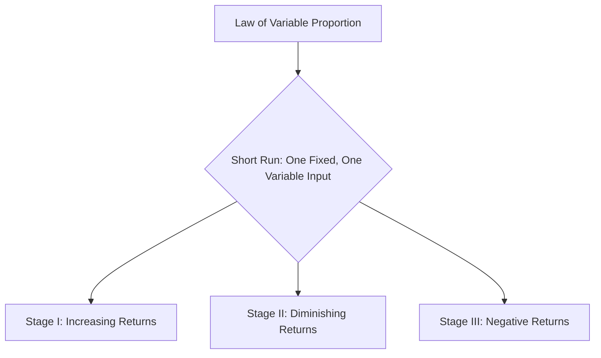
```mermaid
graph TD
    A["Law of Variable Proportion"] --> B{"Short Run: One Fixed, One Variable Input"}
    B --> C["Stage I: Increasing Returns"]
    B --> G["Stage II: Diminishing Returns"]
    B --> K["Stage III: Negative Returns"]
```

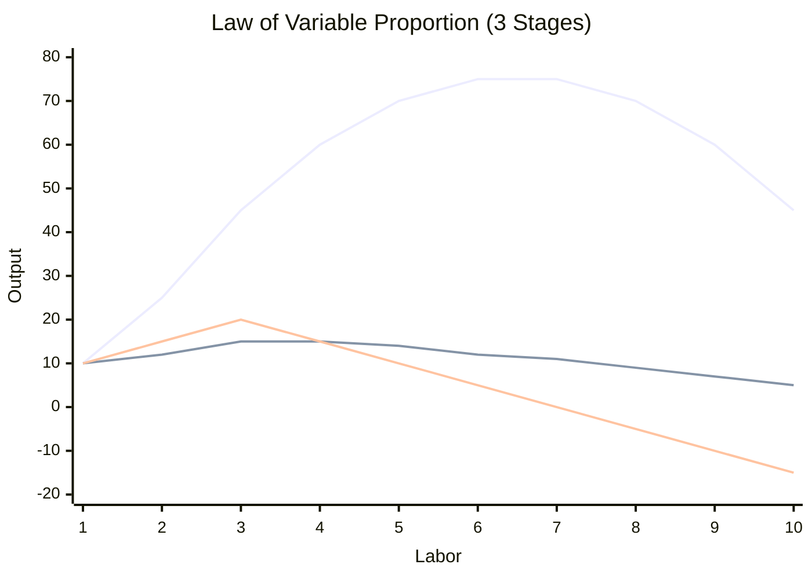
```mermaid
xychart-beta
    title "Law of Variable Proportion (3 Stages)"
    x-axis "Labor" [1, 2, 3, 4, 5, 6, 7, 8, 9, 10]
    y-axis "Output" -20 --> 80
    line "Total Product (TP)" [10, 25, 45, 60, 70, 75, 75, 70, 60, 45]
    line "Average Product (AP)" [10, 12, 15, 15, 14, 12, 11, 9, 7, 5]
    line "Marginal Product (MP)" [10, 15, 20, 15, 10, 5, 0, -5, -10, -15]
```

**Explanation of Diagram:**
*   The X-axis represents the units of the variable input (e.g., labor).
*   The Y-axis represents the output (Total Product, Average Product, Marginal Product).
*   **TP Curve:** Starts from the origin, rises at an increasing rate (convex), then at a decreasing rate (concave), reaches a maximum, and then declines.
*   **MP Curve:** Initially rises, reaches its maximum, then declines, crosses the AP curve at AP's maximum, becomes zero when TP is maximum, and then becomes negative.
*   **AP Curve:** Initially rises, reaches its maximum (where it intersects MP), and then declines, but always remains positive.
*   **Stage I** is from the origin to `L1`, where MP is increasing and AP is rising.
*   **Stage II** is from `L1` to `L2`, where MP is declining but positive, AP is declining, and TP is still increasing but at a diminishing rate. `L2` is where MP is zero and TP is maximum.
*   **Stage III** is beyond `L2`, where MP is negative, and TP is declining.

**5 b. Explain the concept of break-even analysis. How does it help managers in decision-making?**

**Break-Even Analysis:**
Break-even analysis is a financial tool used to determine the point at which total costs and total revenues are equal. At this "break-even point," a business neither makes a profit nor incurs a loss. It calculates the minimum number of units that need to be sold, or the minimum revenue that needs to be generated, to cover all costs.

**Key Components:**
1.  **Fixed Costs (FC):** Costs that do not change with the level of production (e.g., rent, salaries of administrative staff, insurance).
2.  **Variable Costs (VC):** Costs that vary directly with the level of production (e.g., raw materials, direct labor, sales commissions).
3.  **Total Costs (TC):** TC = FC + VC.
4.  **Selling Price per Unit (P):** The price at which each unit of product is sold.
5.  **Revenue (R):** Revenue = P × Quantity.
6.  **Contribution Margin (CM):** The amount of revenue per unit that contributes towards covering fixed costs and generating profit. CM per unit = P - VC per unit.
7.  **Contribution Margin Ratio (CMR):** CMR = (P - VC per unit) / P or Total Contribution / Total Sales.

**Break-Even Point (BEP) Calculation:**
*   **In Units:** `BEP (Units) = Fixed Costs / (Selling Price per Unit - Variable Cost per Unit)`
    `BEP (Units) = Fixed Costs / Contribution Margin per Unit`
*   **In Sales Revenue:** `BEP (Revenue) = Fixed Costs / Contribution Margin Ratio`

View Diagram

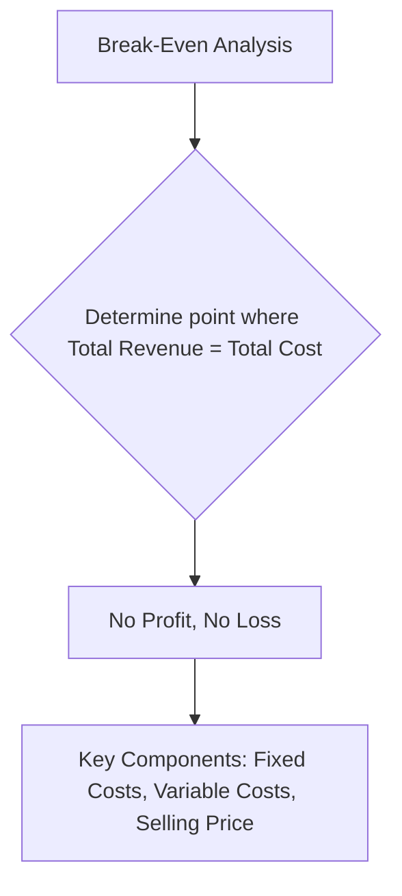
```mermaid
graph TD
    A["Break-Even Analysis"] --> B{"Determine point where Total Revenue = Total Cost"}
    B --> C["No Profit, No Loss"]
    C --> D["Key Components: Fixed Costs, Variable Costs, Selling Price"]
```

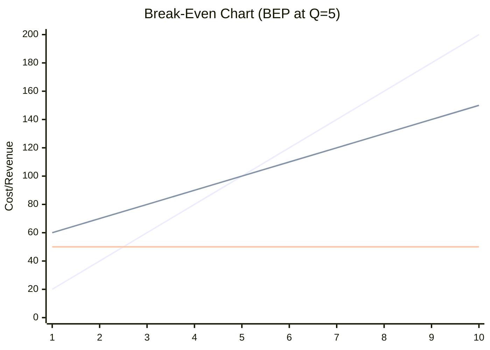
```mermaid
xychart-beta
    title "Break-Even Chart (BEP at Q=5)"
    x-axis [1, 2, 3, 4, 5, 6, 7, 8, 9, 10]
    y-axis "Cost/Revenue" 0 --> 200
    line "Total Revenue (TR)" [20, 40, 60, 80, 100, 120, 140, 160, 180, 200]
    line "Total Cost (TC)" [60, 70, 80, 90, 100, 110, 120, 130, 140, 150]
    line "Fixed Cost (FC)" [50, 50, 50, 50, 50, 50, 50, 50, 50, 50]
```

**Explanation of Diagram:**
*   The X-axis represents the Quantity of Output, and the Y-axis represents Cost/Revenue.
*   **Fixed Cost Line:** A horizontal line because fixed costs remain constant regardless of output.
*   **Total Cost Line:** Starts from the fixed cost level (because even at zero output, fixed costs are incurred) and slopes upwards, representing the sum of fixed and variable costs.
*   **Total Revenue Line:** Starts from the origin (zero revenue at zero output) and slopes upwards.
*   **Break-Even Point (BEP):** The point where the Total Revenue line intersects the Total Cost line. At this point, profit is zero.
*   **Profit Area:** The region where Total Revenue is above Total Cost.
*   **Loss Area:** The region where Total Revenue is below Total Cost.

**How it helps Managers in Decision-Making:**

1.  **Pricing Decisions:** Helps determine the minimum price at which a product can be sold to cover costs. Managers can use it to analyze the impact of different pricing strategies on profitability.
2.  **Production Planning:** Guides managers in setting production targets. They know exactly how many units they need to produce and sell to avoid losses.
3.  **Cost Control:** By clearly separating fixed and variable costs, it highlights areas where costs can be managed. Managers can analyze the impact of changes in fixed or variable costs on the break-even point.
4.  **Profit Planning and Target Setting:** Allows managers to calculate the sales volume needed to achieve a target profit. This is often used for budgeting and setting sales goals.
5.  **Investment Decisions:** Helps evaluate the viability of new projects or investments by estimating their break-even point and potential profitability.
6.  **Sensitivity Analysis (What-if Analysis):** Managers can perform "what-if" scenarios, such as how a change in selling price, variable costs, or fixed costs would affect the break-even point and profitability.
7.  **Make or Buy Decisions:** Can be used to compare the costs of producing a component in-house versus purchasing it from an external supplier.
8.  **Capacity Planning:** Helps assess how changes in production capacity (which might affect fixed costs) will impact the break-even point.

**6 a. Explain different cost concepts used in managerial decision making, such as explicit cost, implicit cost, sunk cost, and social cost.**

**Cost Concepts in Managerial Decision Making:**

**1. Explicit Costs (Accounting Costs):**
*   **Definition:** These are direct, out-of-pocket expenses that a firm incurs for using factors of production that it does not own. They involve a direct monetary payment to an external party.
*   **Nature:** Recorded in the firm's accounting books and easily identifiable.
*   **Examples:** Wages paid to employees, rent for factory premises, cost of raw materials, interest payments on loans, utility bills, advertising expenses.
*   **Relevance to Decision Making:** Crucial for calculating accounting profit, which is total revenue minus explicit costs. They form the basis for financial reporting and tax calculations.

**2. Implicit Costs (Opportunity Costs / Imputed Costs):**
*   **Definition:** These are the opportunity costs of using resources already owned by the firm (or its owner) for which no direct monetary payment is made. They represent the income that could have been earned if those resources were put to their best alternative use.
*   **Nature:** Not recorded in accounting books; they are "foregone" or "imputed" costs.
*   **Examples:**
    *   The salary the owner could have earned working elsewhere (foregone salary).
    *   The rent the firm could have earned by renting out its own building.
    *   The interest that could have been earned on the owner's capital invested in the business.
*   **Relevance to Decision Making:** Essential for calculating economic profit, which is total revenue minus both explicit and implicit costs. Economic profit provides a more complete picture of a firm's true profitability and helps determine whether the firm is earning at least a normal rate of return on its resources. If economic profit is negative, the firm might be better off allocating its resources elsewhere.

**3. Sunk Costs:**
*   **Definition:** These are costs that have already been incurred and cannot be recovered, regardless of any future decision. They are irretrievable.
*   **Nature:** Past costs that are unavoidable.
*   **Examples:** The cost of specialized machinery that has no alternative use, the expenditure on an advertising campaign that has already run, research and development costs for a failed product.
*   **Relevance to Decision Making:** According to economic theory, sunk costs should be **ignored** when making future decisions. Rational decision-making focuses on future costs and benefits. Continuing a project simply because a lot of money has already been spent on it (the "sunk cost fallacy") is irrational and can lead to further losses.

**4. Social Costs:**
*   **Definition:** These are the total costs to society for producing a good or service. They include both the private costs incurred by the producer and any external costs (negative externalities) imposed on third parties or society at large.
*   **Nature:** Broader than private costs; they account for societal well-being.
*   **Formula:** Social Cost = Private Cost + External Cost.
*   **Examples of External Costs:** Pollution from a factory (air, water, noise pollution), traffic congestion caused by increased trucking, health costs from smoking.
*   **Relevance to Decision Making:** Important for public policy decisions, environmental regulations, and welfare economics. While individual firms primarily focus on private costs for their profit decisions, governments and policymakers consider social costs when evaluating the overall desirability of certain industries or activities. By internalizing external costs (e.g., through taxes on pollution), firms can be incentivized to make socially optimal decisions.

**Summary Table:**

| Cost Concept | Definition                                                                | Nature                             | Relevance to Decision Making                                       |
| :----------- | :------------------------------------------------------------------------ | :--------------------------------- | :----------------------------------------------------------------- |
| **Explicit** | Out-of-pocket payments for factors not owned.                             | Recorded, direct monetary payment. | Accounting profit, financial reporting, tax.                       |
| **Implicit** | Opportunity cost of resources owned by the firm.                           | Not recorded, foregone income.     | Economic profit, true profitability, resource allocation.          |
| **Sunk**     | Costs already incurred and unrecoverable.                                 | Past, unavoidable.                 | **Should be ignored** in future decisions.                         |
| **Social**   | Private costs plus external costs imposed on society.                     | Broader societal impact.           | Public policy, environmental regulation, welfare.                  |

**6 b. Explain the expansion path in production theory and discuss its significance for firms.**

**Expansion Path:**

In production theory, the expansion path (also known as the scale line or scale ridge) is a curve connecting all the points of producer's equilibrium that occur when a firm changes its level of output while holding input prices constant. It illustrates how a firm's optimal combination of inputs (e.g., labor and capital) changes as it expands its total expenditure (or scale of production) while minimizing costs for each output level.

Graphically, the expansion path is derived by connecting the tangency points of successively higher iso-cost lines with successively higher isoquants. Each tangency point represents the least-cost combination of inputs for a specific level of output, given the prevailing input prices.

**Key Characteristics:**
    *   **Increasing Output:** As the firm expands its output, it moves to higher isoquants.
*   **Increasing Total Cost:** As output increases, the total cost also increases, requiring higher iso-cost lines.
*   **Constant Input Price Ratio:** The slope of the iso-cost lines (ratio of input prices) remains constant along a given expansion path, as the firm is assumed to face fixed input prices.
*   **Optimal Input Mix:** Each point on the expansion path represents the most efficient (least-cost) way to produce that specific level of output.

View Diagram

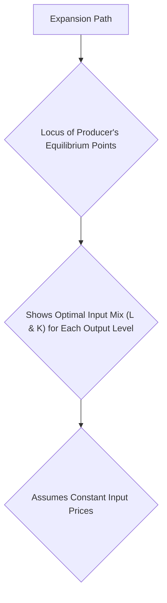
```mermaid
graph TD
    A["Expansion Path"] --> B{"Locus of Producer's Equilibrium Points"}
    B --> C{"Shows Optimal Input Mix (L & K) for Each Output Level"}
    C --> D{"Assumes Constant Input Prices"}
```

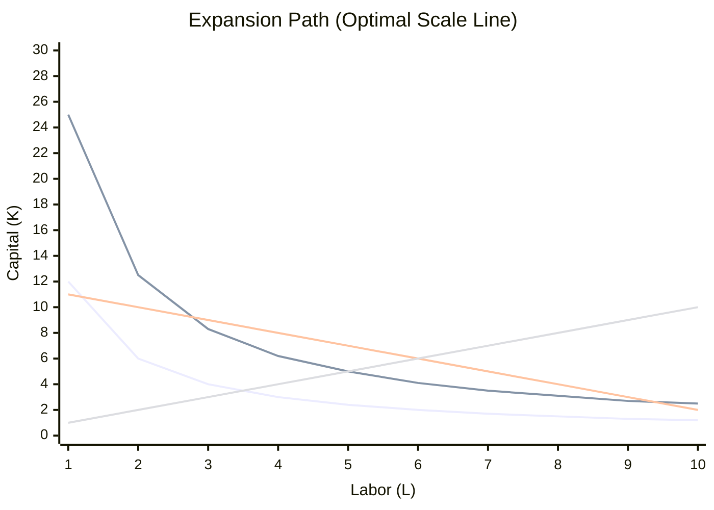
```mermaid
xychart-beta
    title "Expansion Path (Optimal Scale Line)"
    x-axis "Labor (L)" [1, 2, 3, 4, 5, 6, 7, 8, 9, 10]
    y-axis "Capital (K)" 0 --> 30
    line "Isoquant Q1" [12, 6, 4, 3, 2.4, 2, 1.7, 1.5, 1.3, 1.2]
    line "Isoquant Q2" [25, 12.5, 8.3, 6.2, 5, 4.1, 3.5, 3.1, 2.7, 2.5]
    line "Iso-cost C2" [11, 10, 9, 8, 7, 6, 5, 4, 3, 2]
    line "Expansion Path" [1, 2, 3, 4, 5, 6, 7, 8, 9, 10]
```

**Explanation of Diagram:**
*   The X-axis represents Labor (L) and the Y-axis represents Capital (K).
*   `Q1`, `Q2`, `Q3` are isoquants representing increasing levels of output.
*   `C1`, `C2`, `C3` are iso-cost lines, with `C3` representing a higher total cost than `C2`, and `C2` higher than `C1`. The slopes of these lines are the same, reflecting constant input prices.
*   `E1`, `E2`, `E3` are the points of producer's equilibrium, where an isoquant is tangent to an iso-cost line.
*   The `Expansion Path` is the line connecting `E1`, `E2`, and `E3`. It shows how the firm expands its use of labor and capital as it increases production, maintaining cost efficiency.

**Significance for Firms:**

1.  **Optimal Resource Allocation:** The expansion path guides firms in choosing the most efficient (least-cost) combination of inputs for any desired level of output, given the market prices of labor and capital. This is crucial for maximizing profits or minimizing costs.
2.  **Long-Run Planning:** It is a fundamental concept for long-run production planning. Since all inputs are variable in the long run, firms can adjust their scale of operations along the expansion path to achieve different output levels most efficiently.
3.  **Cost Prediction:** By tracing the expansion path, a firm can derive its long-run total cost (LRTC) curve and subsequently its long-run average cost (LRAC) and long-run marginal cost (LRMC) curves. This helps in forecasting costs for different scales of operation.
4.  **Technological Changes:** While the basic expansion path assumes constant technology and input prices, the framework can be adapted to analyze the impact of technological improvements (which shift isoquants) or changes in input prices (which change iso-cost slopes) on the optimal input mix and production strategy.
5.  **Understanding Returns to Scale:** The shape of the expansion path, when combined with the spacing of isoquants, can provide insights into returns to scale. If isoquants are closer together along the expansion path, it suggests increasing returns to scale.
6.  **Strategic Decisions:** Firms can use the expansion path to determine whether to expand operations, and if so, how much to invest in labor versus capital to maintain cost-effectiveness. It helps in making decisions about plant size, automation, and workforce size.

#### Module 3&4 (Second Set)

**7 a. Explain the features of monopoly and discuss how a monopolist determines equilibrium using the MR = MC rule.**

**Features of Monopoly:**

Monopoly is a market structure where there is a single seller of a product with no close substitutes, and significant barriers to entry prevent other firms from entering the market. Key features include:

1.  **Single Seller:** There is only one firm producing the good or service in the entire market. The firm *is* the industry.
2.  **No Close Substitutes:** The product offered by the monopolist is unique, and there are no readily available substitutes. This gives the monopolist considerable power.
3.  **High Barriers to Entry:** Significant obstacles prevent other firms from entering the market. These can be:
    *   **Legal Barriers:** Patents, copyrights, licenses, government franchises.
    *   **Control of Essential Resources:** Exclusive ownership of a key raw material or production technique.
    *   **Economies of Scale (Natural Monopoly):** A single large firm can produce the entire market output at a lower average cost than multiple smaller firms.
    *   **Strategic Barriers:** Predatory pricing, extensive advertising, large capital requirements.
4.  **Price Maker (or Price Setter):** The monopolist has substantial control over the market price of its product because it faces the entire market demand curve, which is downward sloping. However, it cannot set both price and quantity independently; it can choose either the price or the quantity.
5.  **Downward-Sloping Demand Curve:** The demand curve for a monopolist is the market demand curve, which slopes downwards. This means to sell more output, the monopolist must lower its price. Consequently, `Price (P) > Marginal Revenue (MR)`.
6.  **Potential for Supernormal Profits:** Due to barriers to entry, a monopolist can potentially earn supernormal (economic) profits in both the short run and the long run.

**Monopolist's Equilibrium using the MR = MC Rule:**

A monopolist, like any other firm, aims to maximize profits. Profit maximization occurs at the output level where Marginal Revenue (MR) equals Marginal Cost (MC).

**Steps to Determine Equilibrium:**
1.  **Identify MR and MC:** The monopolist's demand curve is downward sloping, so its MR curve lies below the demand (AR) curve and is also downward sloping. The MC curve typically has a U-shape.
2.  **Find Output where MR = MC:** The firm will produce the quantity (Qm) where the MR curve intersects the MC curve.
3.  **Determine Price from Demand Curve:** Once the profit-maximizing quantity (Qm) is determined, the monopolist will charge the highest price (Pm) that consumers are willing to pay for that quantity. This price is found by going vertically up from Qm to the demand (AR) curve.
4.  **Calculate Profit/Loss:**
    *   **Average Total Cost (ATC):** Find the ATC at the output level Qm.
    *   **Profit:** If `Pm > ATC` at Qm, the monopolist earns supernormal profits.
    *   **Loss:** If `Pm < ATC` but `Pm >= AVC` at Qm, the monopolist incurs losses (but might continue producing in the short run). If `Pm < AVC`, the monopolist will shut down.
    *   **Normal Profit:** If `Pm = ATC` at Qm, the monopolist earns normal profits (less common for a monopoly, but possible if costs are high or demand is weak).

View Diagram

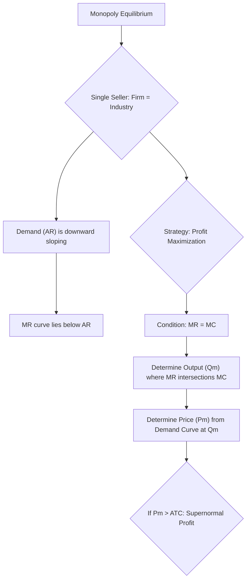
```mermaid
graph TD
    A["Monopoly Equilibrium"] --> B{"Single Seller: Firm = Industry"}
    B --> C["Demand (AR) is downward sloping"]
    C --> D["MR curve lies below AR"]
    B --> E{"Strategy: Profit Maximization"}
    E --> F["Condition: MR = MC"]
    F --> G["Determine Output (Qm) where MR intersections MC"]
    G --> H["Determine Price (Pm) from Demand Curve at Qm"]
    H --> I{"If Pm > ATC: Supernormal Profit"}
```

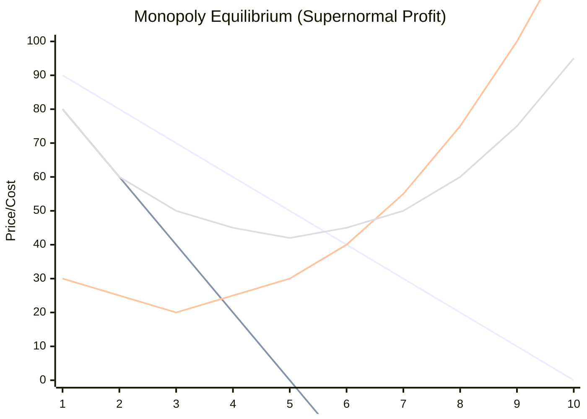
```mermaid
xychart-beta
    title "Monopoly Equilibrium (Supernormal Profit)"
    x-axis [1, 2, 3, 4, 5, 6, 7, 8, 9, 10]
    y-axis "Price/Cost" 0 --> 100
    line "Demand (AR)" [90, 80, 70, 60, 50, 40, 30, 20, 10, 0]
    line "Marginal Revenue (MR)" [80, 60, 40, 20, 0, -20, -40, -60, -80, -100]
    line "Marginal Cost (MC)" [30, 25, 20, 25, 30, 40, 55, 75, 100, 130]
    line "ATC" [80, 60, 50, 45, 42, 45, 50, 60, 75, 95]
```

**Explanation of Diagram:**
*   The X-axis represents Quantity and the Y-axis represents Price/Cost.
*   The `Demand (AR)` curve is downward sloping. The `MR` curve lies below the demand curve.
*   The `MC` curve is U-shaped and intersects the `ATC` curve at its minimum.
*   The monopolist maximizes profit by producing `Qm` where `MR = MC` (point `E`).
*   The price `Pm` is then determined by finding the corresponding point on the demand curve directly above `Qm`.
*   The average total cost `ATC@Qm` is found by going up from `Qm` to the `ATC` curve.
*   The shaded rectangle represents the supernormal profit, as `Pm > ATC@Qm`. This profit can persist in the long run due to barriers to entry.

**7 b. Explain the circular flow of income in an economy with a suitable diagram.**

**Circular Flow of Income:**

The circular flow of income is an economic model that illustrates how money, goods, and services move through an economy. It shows the interdependence between different sectors of the economy (households, firms, government, and the foreign sector) and how income generated in one sector flows to another. This model highlights the continuous nature of economic activity.

**Key Sectors:**

1.  **Households:**
    *   Own factors of production (land, labor, capital, entrepreneurship).
    *   Supply factors of production to firms.
    *   Receive factor incomes (wages, rent, interest, profit).
    *   Consume goods and services produced by firms.
    *   Save a part of their income.
    *   Pay taxes to the government.
    *   Buy imported goods.

2.  **Firms (Producers):**
    *   Hire factors of production from households.
    *   Produce goods and services.
    *   Sell goods and services to households, government, and other firms, and export them.
    *   Make payments for factors of production.
    *   Receive revenue from selling goods and services.
    *   Invest in new capital.

**Simplified Two-Sector Model (Households and Firms):**

In the simplest model, there are only households and firms.
*   **Real Flow:** Households supply factors of production (labor, capital) to firms. Firms use these factors to produce goods and services, which are then supplied to households.
*   **Money Flow:** Firms pay factor incomes (wages, rent, interest, profit) to households. Households, in turn, spend this income on goods and services, providing revenue to firms.
This creates a continuous loop of income and expenditure.

**Three-Sector Model (Adding Government):**

Adding the government sector introduces:
*   **Injections:** Government spending (G) on goods and services (e.g., infrastructure, defense).
*   **Leakages (Withdrawals):** Taxes (T) paid by households and firms to the government.
*   The government spends money, injects it into the flow, and taxes money, withdrawing it from the flow.

**Four-Sector Model (Adding Foreign Sector):**

Adding the foreign sector (Rest of the World) introduces:
*   **Injections:** Exports (X) – foreign spending on domestically produced goods and services.
*   **Leakages (Withdrawals):** Imports (M) – domestic spending on foreign-produced goods and services.

**Leakages (Withdrawals):** Income that is not spent on domestically produced goods and services in the current period.
*   Savings (S) by households and firms.
*   Taxes (T) paid to the government.
*   Imports (M) purchased from the foreign sector.

**Injections:** Spending that comes from outside the basic circular flow of household consumption of domestic output.
*   Investment (I) by firms.
*   Government spending (G).
*   Exports (X) to the foreign sector.

**Equilibrium Condition:** For the economy to be in equilibrium, total leakages must equal total injections:
`S + T + M = I + G + X`

View Diagram

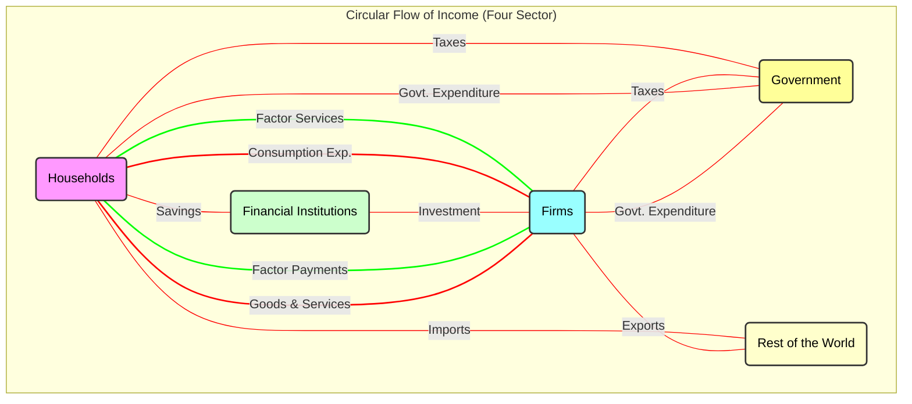
```mermaid
graph TD
    subgraph "Circular Flow of Income (Four Sector)"
        direction LR
        H("Households")
        F("Firms")
        G("Government")
        FI("Financial Institutions")
        ROW("Rest of the World")

        H --- |"Factor Services"| F
        F --- |"Factor Payments"| H
        H --- |"Consumption Exp."| F
        F --- |"Goods & Services"| H

        H --- |"Savings"| FI
        FI --- |"Investment"| F

        H --- |"Taxes"| G
        F --- |"Taxes"| G
        G --- |"Govt. Expenditure"| H
        G --- |"Govt. Expenditure"| F

        H --- |"Imports"| ROW
        F --- |"Exports"| ROW

        style H fill:#f9f,stroke:#333,stroke-width:2px,color:#000
        style F fill:#9ff,stroke:#333,stroke-width:2px,color:#000
        style G fill:#ff9,stroke:#333,stroke-width:2px,color:#000
        style FI fill:#cfc,stroke:#333,stroke-width:2px,color:#000
        style ROW fill:#ffc,stroke:#333,stroke-width:2px,color:#000

        linkStyle 0 stroke:#0f0,stroke-width:2px,fill:none;
        linkStyle 1 stroke:#0f0,stroke-width:2px,fill:none;
        linkStyle 2 stroke:#f00,stroke-width:2px,fill:none;
        linkStyle 3 stroke:#f00,stroke-width:2px,fill:none;

        linkStyle 4 stroke:#f00,stroke-width:1px,fill:none;
        linkStyle 5 stroke:#f00,stroke-width:1px,fill:none;

        linkStyle 6 stroke:#f00,stroke-width:1px,fill:none;
        linkStyle 7 stroke:#f00,stroke-width:1px,fill:none;
        linkStyle 8 stroke:#f00,stroke-width:1px,fill:none;
        linkStyle 9 stroke:#f00,stroke-width:1px,fill:none;

        linkStyle 10 stroke:#f00,stroke-width:1px,fill:none;
        linkStyle 11 stroke:#f00,stroke-width:1px,fill:none;
    end
```

**Explanation of Diagram:**
*   **Households (H)** provide factor services (labor, land, capital, entrepreneurship) to **Firms (F)**. In return, Firms make factor payments (wages, rent, interest, profit) to Households.
*   Households use this income to make consumption expenditure on goods and services provided by Firms. Firms receive this as revenue. (These are the core inner money and real flows).
*   **Leakages (Money flowing out of the inner loop):**
    *   **Savings:** Households save a portion of their income with **Financial Institutions (FI)**.
    *   **Taxes:** Households and Firms pay taxes to the **Government (G)**.
    *   **Imports:** Households purchase goods and services from the **Rest of the World (ROW)**.
*   **Injections (Money flowing into the inner loop):**
    *   **Investment:** Financial Institutions lend savings to Firms for investment.
    *   **Government Expenditure:** Government spends money on goods and services, benefiting Households and Firms.
    *   **Exports:** Firms sell goods and services to the Rest of the World, bringing in revenue.

**Significance:**
*   **Interdependence:** Clearly demonstrates how different sectors of an economy are interconnected.
*   **National Income Measurement:** Provides the conceptual basis for measuring national income through three methods: income method (factor payments), expenditure method (consumption, investment, government spending, net exports), and product/value-added method (goods and services produced).
*   **Policy Formulation:** Helps policymakers understand the impact of various fiscal (government spending, taxation) and monetary (interest rates, money supply) policies on the economy.
*   **Economic Equilibrium:** Highlights the condition for macroeconomic equilibrium where total injections equal total leakages.
*   **Growth and Stability:** Illustrates how disruptions in any flow (e.g., a fall in investment or rise in savings) can affect the overall economic activity.

**8 a. Explain the features of monopolistic competition and discuss the short run and long-run equilibrium of a firm under monopolistic competition.**

**Features of Monopolistic Competition:**

Monopolistic competition is a market structure that combines elements of both perfect competition and monopoly. It is characterized by:

1.  **Many Buyers and Sellers:** There are a relatively large number of firms and buyers, but not as many as in perfect competition. Each firm has a small, but not negligible, market share.
2.  **Product Differentiation:** This is the most defining feature. Firms sell similar but not identical (heterogeneous) products. Differentiation can be based on branding, quality, features, design, location, customer service, packaging, or perceived differences. This gives each firm a degree of market power, allowing it to act as a "mini-monopolist" for its specific product variant.
3.  **Free Entry and Exit:** There are relatively low barriers to entry and exit, meaning new firms can enter the market if existing firms are making supernormal profits, and firms can leave if they are incurring losses. This ensures that firms earn only normal profits in the long run.
4.  **Non-Price Competition:** Due to product differentiation, firms heavily rely on non-price competition strategies like advertising, sales promotion, and product development to attract customers and maintain market share, rather than just competing on price.
5.  **Downward-Sloping Demand Curve:** Because products are differentiated, each firm faces its own downward-sloping demand curve (less elastic than perfect competition but more elastic than monopoly). This means the firm has some control over its price, but it's limited by the availability of close substitutes. Hence, `P > MR`.

**Short-Run Equilibrium of a Firm under Monopolistic Competition:**

In the short run, a firm under monopolistic competition behaves much like a monopolist. It faces a downward-sloping demand curve and a marginal revenue (MR) curve that lies below it. The firm maximizes profit by producing the output level where `MR = MC`.

*   **Profit Maximization:** The firm determines its equilibrium quantity (`Qs`) where `MR = MC`.
*   **Price Determination:** It then sets the price (`Ps`) corresponding to this quantity on its demand (AR) curve.
*   **Profit/Loss:**
    *   If `Ps > ATC` at `Qs`, the firm earns **supernormal (economic) profits**.
    *   If `Ps = ATC` at `Qs`, the firm earns **normal profits**.
    *   If `Ps < ATC` but `Ps ≥ AVC` at `Qs`, the firm incurs **losses** but continues to operate.

View Diagram

```mermaid
graph TD
    A["Monopolistic Competition Short-Run Equilibrium"] --> B{"Product Differentiation gives some market power"}
    B --> C["Firm faces downward-sloping Demand (AR)"]
    C --> D["MR curve lies below AR"]
    D --> E["Profit Max. Condition: MR = MC"]
    E --> F["Determine Quantity (Qs) where MR intersects MC"]
    F --> G["Determine Price (Ps) from Demand Curve at Qs"]
    G --> H{"If Ps > ATC: Supernormal Profit"}
```

```mermaid
xychart-beta
    title "Monopolistic Competition: Short-Run Supernormal Profit"
    x-axis [1, 2, 3, 4, 5, 6, 7, 8, 9, 10]
    y-axis "Price/Cost" 0 --> 100
    line "Demand (AR)" [95, 87, 80, 73, 67, 61, 55, 50, 45, 41]
    line "Marginal Revenue (MR)" [90, 75, 60, 48, 37, 27, 18, 10, 3, -4]
    line "Marginal Cost (MC)" [30, 25, 20, 25, 30, 40, 55, 75, 100, 130]
    line "ATC" [80, 60, 50, 45, 42, 45, 50, 60, 75, 95]
```

**Explanation of Short-Run Diagram:**
*   Similar to monopoly, the firm finds `Qs` where `MR = MC`.
*   Price `Ps` is set on the demand curve at `Qs`.
*   Since `Ps > ATC@Qs`, the firm earns supernormal profits, represented by the shaded area.

**Long-Run Equilibrium of a Firm under Monopolistic Competition:**

In the long run, the freedom of entry and exit plays a crucial role.
*   **Entry of New Firms:** If firms in the industry are earning supernormal profits in the short run, new firms will be attracted to the market. As new firms enter, they offer differentiated products, leading to:
    *   The demand curve for each existing firm shifting to the left (consumers have more choices, so demand for each individual firm's product decreases).
    *   The demand curve becoming more elastic (more substitutes available).
*   **Exit of Firms:** If firms are incurring losses, some will exit the market. This will cause the demand curve for the remaining firms to shift to the right and become less elastic.
*   **Result:** This process of entry and exit continues until all firms in the industry earn only **normal profits**. In long-run equilibrium, the demand (AR) curve for each firm becomes tangent to its Average Total Cost (ATC) curve. At this tangency point, `P = ATC`, and also `MR = MC`.

View Diagram

```mermaid
graph TD
    A["Monopolistic Competition Long-Run Equilibrium"] --> B{"Free Entry/Exit ensures Normal Profit"}
    B --> C["Process continues until Demand (AR) curve is tangent to ATC curve"]
    C --> D["Condition: P = ATC and MR = MC"]
    D --> E["Only Normal Profits earned"]
```

```mermaid
xychart-beta
    title "Monopolistic Competition: Long-Run Normal Profit"
    x-axis [1, 2, 3, 4, 5, 6, 7, 8, 9, 10]
    y-axis "Price/Cost" 0 --> 100
    line "Demand (AR)" [65, 60, 55, 51, 47, 43, 40, 37, 34, 32]
    line "Marginal Revenue (MR)" [60, 50, 40, 32, 25, 19, 13, 8, 3, -2]
    line "ATC" [90, 70, 55, 48, 47, 48, 52, 60, 75, 95]
    line "MC" [40, 35, 30, 28, 25, 30, 40, 55, 75, 100]
```

**Explanation of Long-Run Diagram:**
*   The `Demand (AR)` curve is tangent to the `ATC` curve at output `QL` and price `PL`.
*   At this tangency point, `PL = ATC`, meaning the firm earns only normal profits.
*   The `MR` curve intersects the `MC` curve at `QL`, satisfying the profit-maximization condition.
*   It's important to note that in long-run monopolistic competition, `P > MC`, indicating that the firm does not achieve allocative efficiency. Also, `P` is not at the minimum of the ATC curve, meaning firms operate with excess capacity, not achieving productive efficiency.

**8 b. Explain the methods of measuring national income and discuss the Importance of NI in evaluating economic performance.**

**Methods of Measuring National Income:**

National Income (NI) represents the total value of all final goods and services produced within a country's borders during a specific period (usually a year), adjusted for net income from abroad. There are three main methods of measuring national income, which theoretically yield the same result:

**1. Product (or Value-Added) Method:**
*   **Concept:** This method measures the sum of the money value of all final goods and services produced in an economy during an accounting year. To avoid double-counting, only the value added at each stage of production is considered.
*   **Calculation:**
    *   Identify all producing enterprises in the economy.
    *   Estimate the Gross Value Added (GVA) at market prices for each sector by subtracting intermediate consumption from the value of output.
    *   Sum up the GVAs across all sectors to get Gross Domestic Product at Market Prices (GDPmp).
    *   To get National Income (NNPfc): `GDPmp - Depreciation - Net Indirect Taxes + Net Factor Income from Abroad (NFIA)`.
*   **Formula:** `GDPmp = Sum of (Value of Output - Intermediate Consumption) across all sectors`
    `NNPfc = GDPmp - Depreciation - Indirect Taxes + Subsidies + NFIA`
*   **Suitability:** Best suited for less developed countries where data on production is more readily available than income or expenditure.

**2. Income Method:**
*   **Concept:** This method measures national income by summing up all factor incomes (payments made to factors of production) generated in the production of goods and services within a country during an accounting year.
*   **Calculation:**
    *   Sum up compensation of employees (wages, salaries, benefits).
    *   Add operating surplus (rent, interest, profits).
    *   Add mixed income of the self-employed (for unincorporated businesses).
    *   This gives Net Domestic Product at Factor Cost (NDPfc).
    *   To get National Income (NNPfc): `NDPfc + Net Factor Income from Abroad (NFIA)`.
*   **Formula:** `NDPfc = Compensation of Employees + Operating Surplus + Mixed Income of Self-employed`
    `NNPfc = NDPfc + NFIA`
*   **Suitability:** Used in countries where data on income distribution is robust.

**3. Expenditure Method:**
*   **Concept:** This method measures national income by summing up all final expenditures on goods and services produced within an economy during an accounting year. It aggregates what different sectors spend.
*   **Calculation:**
    *   Add private final consumption expenditure (C) by households.
    *   Add government final consumption expenditure (G).
    *   Add gross domestic capital formation (I) (investment by firms and government).
    *   Add net exports (X-M) (exports minus imports).
    *   This sum gives Gross Domestic Product at Market Prices (GDPmp).
    *   To get National Income (NNPfc): `GDPmp - Depreciation - Net Indirect Taxes + Net Factor Income from Abroad (NFIA)`.
*   **Formula:** `GDPmp = C + I + G + (X - M)`
    `NNPfc = C + I + G + (X - M) - Depreciation - Indirect Taxes + Subsidies + NFIA`
*   **Suitability:** Commonly used in developed economies with comprehensive data on consumption, investment, and government spending.

**Importance of National Income (NI) in Evaluating Economic Performance:**

National income statistics are critical indicators of a country's economic health and performance for several reasons:

1.  **Indicator of Economic Growth:** A sustained increase in real National Income over time signifies economic growth, indicating that the economy is producing more goods and services, leading to higher living standards.
2.  **Standard of Living:** Per capita national income (NI divided by population) provides a rough measure of the average standard of living in a country. A higher per capita NI generally implies a higher standard of living.
3.  **Policy Formulation:** Governments use NI data to formulate economic policies (fiscal, monetary, trade). For instance, if NI growth is slowing, the government might implement expansionary policies.
4.  **International Comparisons:** NI data allows for comparisons of economic performance between different countries, helping to understand relative development levels and competitiveness.
5.  **Business Decisions:** Businesses use NI trends to forecast demand for their products, make investment decisions, and plan for expansion or contraction.
6.  **Resource Allocation:** Analysis of NI data across different sectors can reveal which sectors are growing or declining, aiding in resource allocation decisions.
7.  **Assessment of Welfare:** While NI is not a perfect measure of welfare, it provides insights into the economic capacity to provide for the well-being of its citizens. A higher NI generally means more resources for healthcare, education, and infrastructure.
8.  **Inflation and Deflation Analysis:** By comparing nominal NI (at current prices) with real NI (at constant prices), economists can gauge the extent of inflation or deflation in the economy.
9.  **Measurement of Economic Fluctuations:** NI data helps identify business cycles (recessions, booms) and measure their magnitude, enabling better stabilization policies.
10. **Budgetary Planning:** Governments rely on NI projections to estimate tax revenues and plan public expenditure, including social programs and infrastructure projects.

---

### PART – A (Short Answer Questions)

#### First Set

**2. Why is the demand curve of a firm under perfect competition perfectly elastic?**

The demand curve of a firm under perfect competition is perfectly elastic (horizontal) because there are a very large number of buyers and sellers, and all firms sell homogeneous (identical) products. No single firm can influence the market price; it must accept the prevailing market price. If a firm tries to charge even a slightly higher price than the market price, all its customers will immediately switch to other sellers because the products are identical and perfect information exists. Conversely, there's no incentive to sell below the market price because the firm can sell all it wants at the market price. Therefore, the firm faces an infinitely elastic demand curve at the market price.

**3. Distinguish between predatory pricing and penetration pricing.**

| Feature           | Predatory Pricing                                       | Penetration Pricing                                      |
| :---------------- | :------------------------------------------------------ | :------------------------------------------------------- |
| **Objective**     | Drive out existing competitors or deter new entrants.   | Gain market share quickly, attract new customers.        |
| **Pricing Level** | Often set below average variable cost (loss-making).   | Set low, but usually above cost (initially low profit).  |
| **Time Horizon**  | Short-term strategy, with an expectation of higher prices later once competitors are gone. | Short-term to medium-term strategy, with an expectation of increasing prices later. |
| **Intent**        | Anti-competitive, illegal in many jurisdictions.        | Market-oriented, legitimate competitive strategy.        |
| **Target**        | Competitors.                                            | New customers, mass market.                              |
| **Risk**          | High risk of legal action, potential for significant losses. | Moderate risk; requires careful cost management to avoid losses. |
| **Example**       | A large airline drastically cuts prices on a route to force a new, smaller airline out of business. | A new mobile phone brand launching its products at significantly lower prices to attract initial buyers and build a user base. |

**4. Define Gross Domestic Product (GDP).**

Gross Domestic Product (GDP) is the total monetary or market value of all the finished goods and services produced within a country's borders in a specific time period, typically a year or a quarter. It serves as a comprehensive measure of a country's economic activity and is often used as an indicator of its economic health. GDP can be calculated using three main approaches: the expenditure approach, the income approach, and the production (or value-added) approach.

#### Second Set

**1. What is producer’s equilibrium?**

Producer's equilibrium refers to the situation where a firm produces a given level of output at the minimum possible cost, or conversely, produces the maximum possible output for a given level of total cost. Graphically, it occurs at the point where an isoquant (representing a specific output level) is tangent to an iso-cost line (representing a specific total cost). At this point, the marginal rate of technical substitution (MRTS) between inputs equals the ratio of their prices.

**2. Define shutdown point in production.**

The shutdown point in production is the level of output where a firm's total revenue is equal to its total variable costs (TR = TVC), or equivalently, where price (P) equals average variable cost (AVC). If the price falls below the average variable cost, the firm is better off shutting down production in the short run because it cannot even cover its variable costs. By shutting down, the firm minimizes its losses to its fixed costs. If the price is at least equal to AVC, the firm can continue to operate in the short run to cover some of its fixed costs.

**3. What is collusive oligopoly?**

Collusive oligopoly refers to a market situation where a few dominant firms (oligopolists) in an industry explicitly or implicitly agree to cooperate rather than compete with each other. The primary goal of collusion is to reduce uncertainty, maximize joint profits, and act collectively like a monopolist. Common forms of collusion include:
*   **Cartels:** Formal agreements to fix prices, restrict output, or divide markets. (e.g., OPEC).
*   **Price Leadership:** One dominant firm sets the price, and other firms follow.
Collusion is generally illegal in most countries due to its anti-competitive nature, which harms consumers by leading to higher prices and reduced output.

**4. What are SENSEX and NIFTY? State their significance in the stock market.**

**SENSEX (Sensitive Index)** and **NIFTY 50** are the two primary stock market indices in India.
*   **SENSEX** is managed by the Bombay Stock Exchange (BSE) and comprises 30 financially sound, actively traded companies across major sectors.
*   **NIFTY 50** is managed by the National Stock Exchange (NSE) and comprises 50 of the largest and most liquid Indian securities.

**Significance in the Stock Market:**
1.  **Market Barometers:** They act as key indicators of the overall health, performance, and direction of the Indian stock market and the broader economy. A rising index generally reflects investor confidence and economic optimism.
2.  **Performance Benchmarks:** Investors, fund managers, and analysts use these indices to measure the performance of their own portfolios, individual stocks, and mutual funds.
3.  **Investment Avenues:** They serve as underlying assets for various investment products like index funds and Exchange Traded Funds (ETFs), allowing investors to invest in a diversified basket of top companies.
4.  **Derivatives Trading:** Futures and options contracts are actively traded based on SENSEX and NIFTY, providing tools for hedging risk and speculation.
5.  **International Comparisons:** They enable global investors to quickly assess India's economic performance and market sentiment relative to other international markets.

---
**Citations:**
1.  https://www.kotaksecurities.com/markets/stock-market-basics/difference-between-sensex-and-nifty/
2.  https://www.groww.in/demat-account/nse/nifty
3.  https://www.investopedia.com/articles/basics/09/bse-sensex.asp
4.  https://www.angelone.in/knowledge-centre/share-market/what-is-nifty-50
5.  https://www.investopedia.com/terms/p/predatory-pricing.asp
6.  https://www.investopedia.com/terms/g/gdp.asp
7.  https://www.brainkart.com/article/Producer's-Equilibrium_38799/
8.  https://www.investopedia.com/terms/s/shutdownpoint.asp
9.  https://quickonomics.com/collusive-oligopoly/
