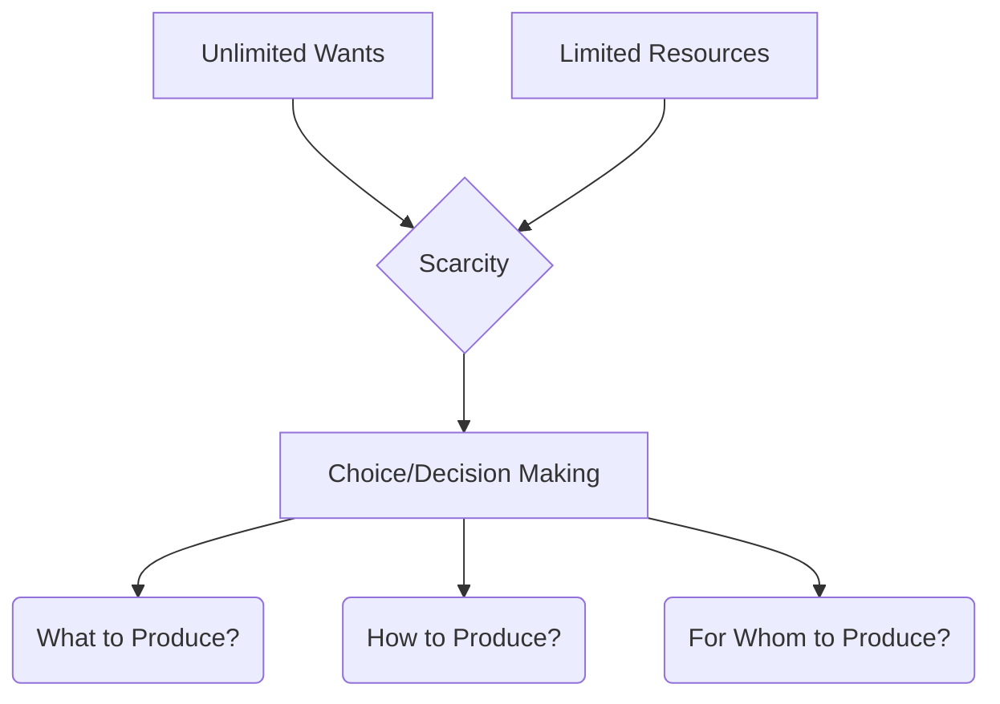
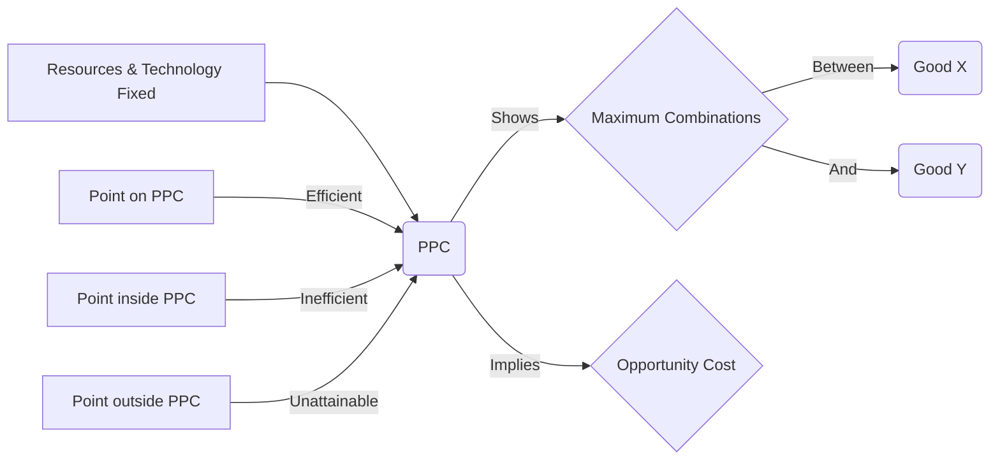
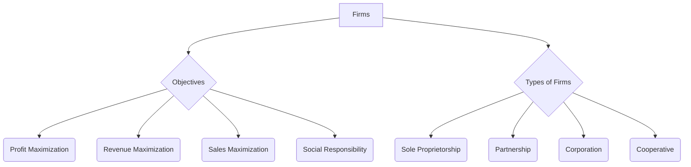
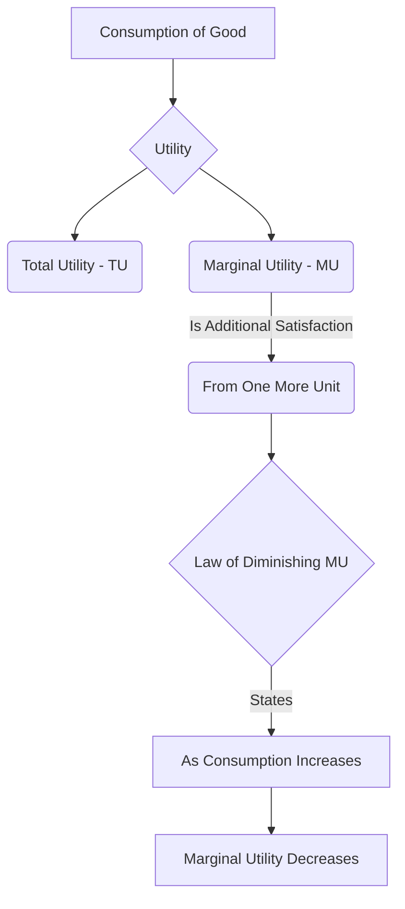
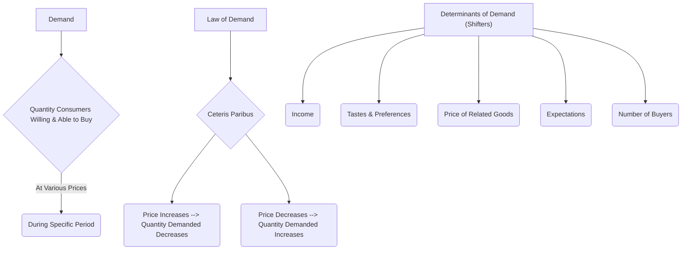
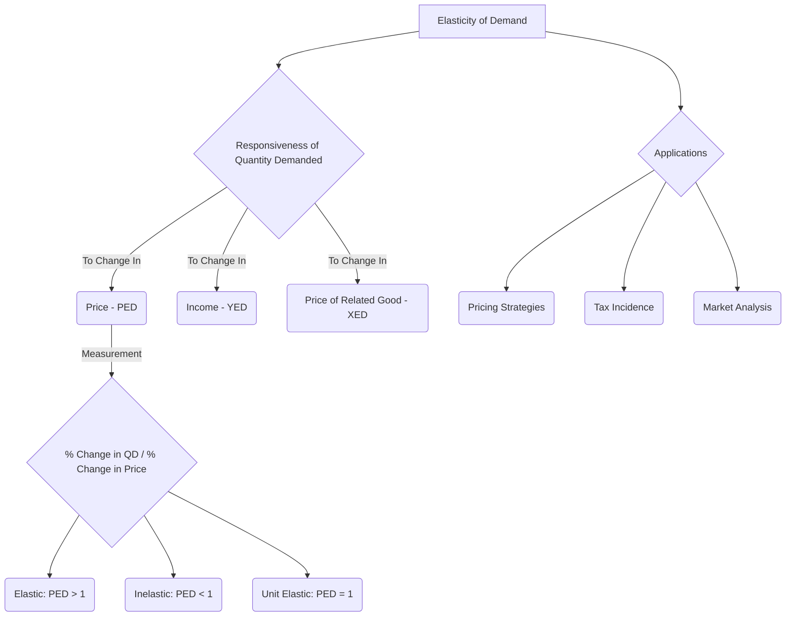
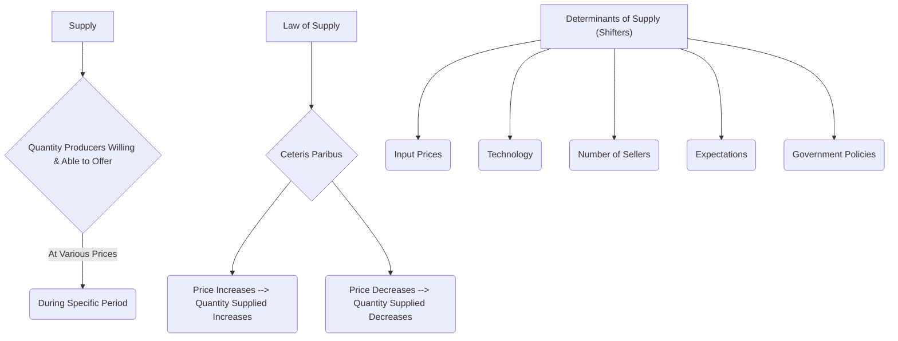
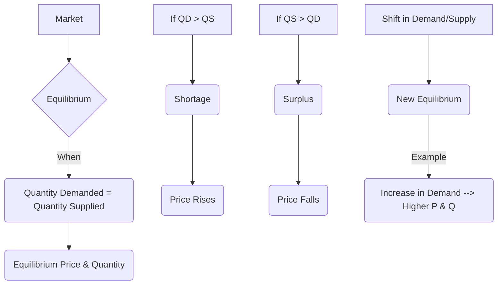
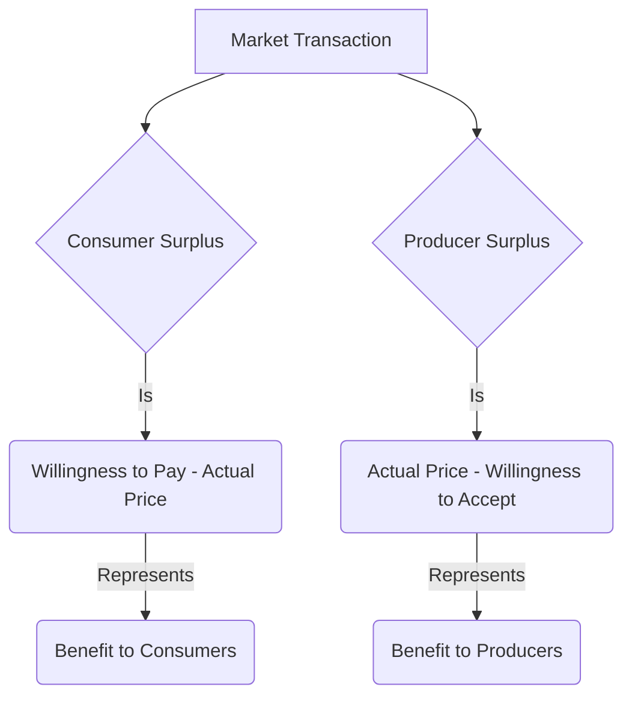
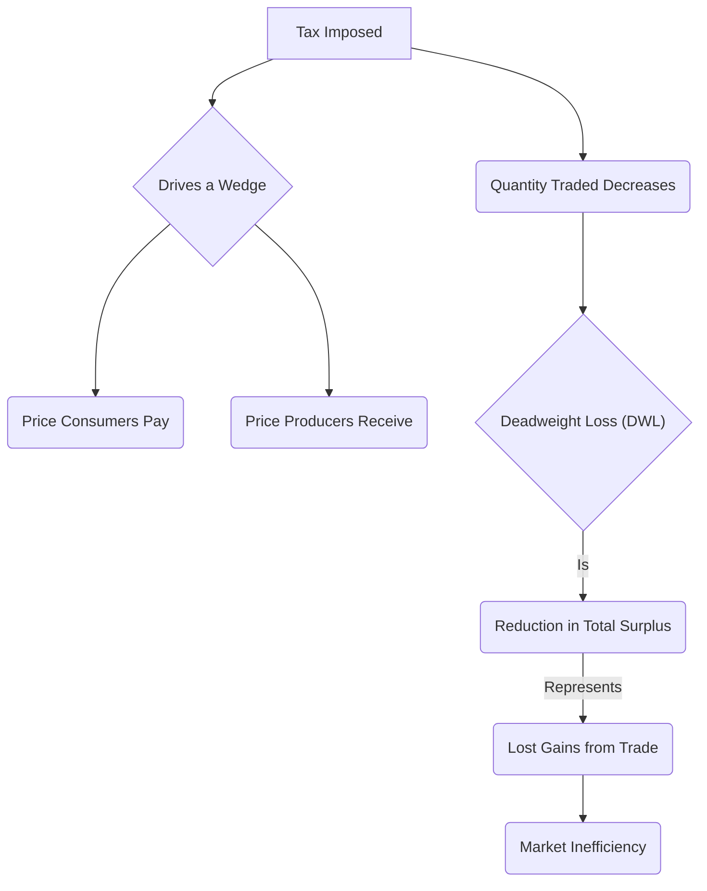

### **Module 1: Basic Concepts and Demand and Supply Analysis**

#### **1. Scarcity and Choice & Basic Economic Problems**

**Concept:** Economics fundamentally deals with scarcity. Resources are limited, but human wants are unlimited. This fundamental conflict forces us to make choices. The basic economic problems are *what* to produce, *how* to produce, and *for whom* to produce.

**Mermaid Diagram:**

#### **2. Production Possibility Curve (PPC)**

**Concept:** The PPC illustrates the maximum combinations of two goods or services that an economy can produce efficiently, given its available resources and technology. It shows the trade-offs involved in allocating resources between different goods. Points on the curve are efficient, inside are inefficient, and outside are unattainable. The slope represents opportunity cost.

**Mermaid Diagram:**

#### **3. Firms and Their Objectives & Types of Firms**

**Concept:** Firms are organizations that produce goods and services. Their primary objective is typically profit maximization, but other objectives can include revenue maximization, sales maximization, or even social responsibility. Firms can be sole proprietorships, partnerships, corporations, or cooperatives, each with different ownership structures and liabilities.

**Mermaid Diagram:**

#### **4. Utility & Law of Diminishing Marginal Utility (LDMU)**

**Concept:** Utility refers to the satisfaction or pleasure a consumer derives from consuming a good or service. Marginal utility is the additional satisfaction gained from consuming one more unit. The Law of Diminishing Marginal Utility states that as a consumer consumes more units of a good, the additional utility (marginal utility) gained from each successive unit tends to decrease.

**Mermaid Diagram:**

#### **5. Demand and its Determinants & Law of Demand**

**Concept:** Demand is the quantity of a good or service that consumers are willing and able to purchase at various prices during a specific period. The Law of Demand states that, *ceteris paribus* (all else equal), as the price of a good increases, the quantity demanded decreases, and vice-versa. Determinants of demand (factors that shift the entire demand curve) include income, tastes, price of related goods (substitutes and complements), expectations, and number of buyers.

**Mermaid Diagram:**

#### **6. Elasticity of Demand & Measurement of Elasticity and its Applications**

**Concept:** Elasticity of demand measures the responsiveness of the quantity demanded to a change in one of its determinants (typically price, income, or the price of a related good). Price Elasticity of Demand (PED) is particularly important:
*   **Elastic (PED > 1):** Quantity demanded changes proportionally more than price.
*   **Inelastic (PED < 1):** Quantity demanded changes proportionally less than price.
*   **Unit Elastic (PED = 1):** Quantity demanded changes proportionally the same as price.
It's measured as the percentage change in quantity demanded divided by the percentage change in price. Applications include pricing strategies, tax incidence, and understanding market reactions.

**Mermaid Diagram:**

#### **7. Supply, Law of Supply, and Determinants of Supply**

**Concept:** Supply is the quantity of a good or service that producers are willing and able to offer for sale at various prices during a specific period. The Law of Supply states that, *ceteris paribus*, as the price of a good increases, the quantity supplied increases, and vice-versa. Determinants of supply (factors that shift the entire supply curve) include input prices, technology, number of sellers, expectations, and government policies (taxes/subsidies).

**Mermaid Diagram:**

#### **8. Equilibrium & Changes in Demand and Supply and their Effects**

**Concept:** Market equilibrium occurs at the price where the quantity demanded equals the quantity supplied. At this point, there is no tendency for the price to change.
*   **Shortage:** Quantity demanded > Quantity supplied (price tends to rise).
*   **Surplus:** Quantity supplied > Quantity demanded (price tends to fall).
Changes (shifts) in demand or supply curves lead to new equilibrium prices and quantities. For example, an increase in demand (rightward shift) leads to a higher equilibrium price and quantity.

**Mermaid Diagram:**

#### **9. Consumer Surplus and Producer Surplus (Concepts)**

**Concept:**
*   **Consumer Surplus:** The difference between the maximum price consumers are willing to pay for a good and the actual market price they pay. It represents the benefit consumers receive from purchasing a good at a price lower than their maximum willingness to pay.
*   **Producer Surplus:** The difference between the market price producers receive for a good and the minimum price they are willing to accept to supply it. It represents the benefit producers receive from selling at a price higher than their minimum acceptable price.

**Mermaid Diagram:**

#### **10. Taxation and Deadweight Loss**

**Concept:** When a government imposes a tax on a good (e.g., a sales tax), it drives a wedge between the price consumers pay and the price producers receive. This usually leads to a decrease in the quantity traded in the market.
*   **Deadweight Loss (DWL):** The reduction in total surplus (sum of consumer and producer surplus) that results from a market distortion, such as a tax. It represents the lost gains from trade that no one receives, indicating an inefficiency created by the tax.

**Mermaid Diagram:**

---

By understanding these core concepts and visualizing them with Mermaid diagrams, you should be well-prepared to tackle Module 1 in your exams! Good luck!
