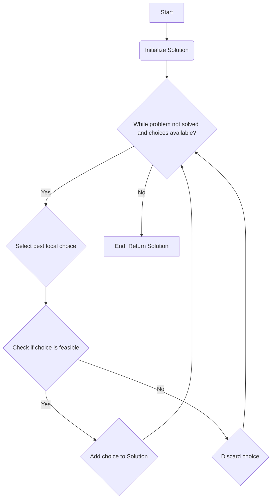
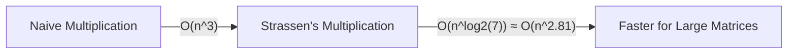
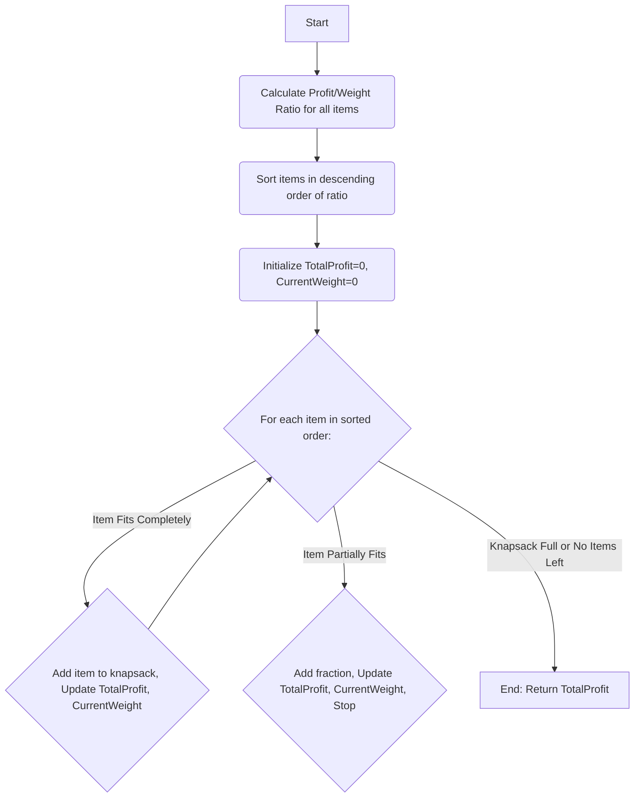

The user wants concise, understandable notes using Mermaid diagrams for quick grasping. I'll go through each question and provide a suitable Mermaid diagram and a brief explanation.

---

### **PART - A**

#### 1. Explain Strassen's matrix multiplication.
Strassen's algorithm is a divide-and-conquer algorithm for matrix multiplication that reduces the number of recursive multiplications from 8 to 7, improving time complexity from O(n³) to O(n^log₂(7)) ≈ O(n^2.81).

```mermaid
graph TD
    A[Start: Multiply A * B] --> B{Divide A, B into n/2 x n/2 sub-matrices};
    B --> C{Compute 7 intermediate products (M1-M7) recursively};
    C --> D{Combine M1-M7 with additions/subtractions};
    D --> E[End: Resulting matrix C];
```

#### 2. Write the control abstraction of greedy strategy to solve a problem.
A greedy algorithm makes the locally optimal choice at each step with the hope that this choice will lead to a globally optimal solution.



#### 3. List out the main steps involved in solving a computational problem using the algorithm design strategy in dynamic programming.
Dynamic programming solves complex problems by breaking them into overlapping subproblems, solving each subproblem only once, and storing the solutions.

```mermaid
graph TD
    A[Start] --> B(Characterize optimal solution structure);
    B --> C(Recursively define optimal solution value/recurrence relation);
    C --> D(Compute optimal solution value (bottom-up/memoization));
    D --> E(Construct optimal solution from computed info);
    E --> F[End];
```

#### 4. Define the control abstraction for Backtracking.
Backtracking is a general algorithmic technique for finding all (or some) solutions to a computational problem, especially constraint satisfaction problems, by incrementally building candidates to the solutions and abandoning a candidate ("backtracking") as soon as it determines that the candidate cannot possibly be completed to a valid solution.

```mermaid
graph TD
    A[Start: Solve(path)] --> B{Is path a solution?};
    B -- Yes --> C[Add path to solutions];
    B -- No --> D{For each choice 'c' from current state:};
    D --> E{Add 'c' to path (explore)};
    E --> F{If path is feasible?};
    F -- Yes --> A;
    F -- No --> G{Remove 'c' from path (backtrack)};
    G --> D;
    D --> H[End];
```

#### 5. Write the control abstraction for Divide and Conquer strategy for solving a problem.
Divide and Conquer is an algorithmic paradigm that recursively breaks down a problem into two or more sub-problems of the same or related type, until these become simple enough to be solved directly. The solutions to the sub-problems are then combined to give a solution to the original problem.

```mermaid
graph TD
    A[Start: Solve(Problem)] --> B{Is Problem small enough?};
    B -- Yes --> C[Solve directly];
    B -- No --> D(Divide Problem into sub-problems P1, P2...);
    D --> E(Recursively Solve(P1));
    D --> F(Recursively Solve(P2));
    E & F --> G(Combine solutions of P1, P2...);
    G --> H[End: Return Combined Solution];
```

#### 6. Analyze the time complexity of Strassen's multiplication.
The time complexity of Strassen's matrix multiplication algorithm is O(n^log₂(7)), which is approximately O(n^2.81). This is an improvement over the brute-force O(n³) algorithm.



#### 7. Draw the State space tree of 4 queens' problem.
The 4-Queens problem state-space tree represents all possible placements of queens on a 4x4 chessboard. Each level corresponds to placing a queen in a row, and branches represent valid column choices. (A full 4-queens tree is too large for a concise diagram, so a conceptual structure is provided.)

```mermaid
graph TD
    A[Root: Empty Board (Q0)] --> B1[Q1 at (1,1)];
    A --> B2[Q1 at (1,2)];
    A --> B3[Q1 at (1,3)];
    A --> B4[Q1 at (1,4)];
    B1 --> C1[Q2 at (2,x) - valid];
    B1 -- x -- C2[Q2 at (2,y) - invalid];
    C1 --> D1[Q3 at (3,z) - valid];
    D1 --> E1[Q4 at (4,w) - solution/conflict];
```

#### 8. Compare backtracking and branch and bound design techniques.
Backtracking and Branch and Bound are both state-space search techniques. Backtracking finds all (or any) feasible solutions and typically uses Depth-First Search (DFS) with a feasibility function. Branch and Bound finds the optimal solution, can use DFS or Breadth-First Search (BFS), and employs a bounding function to prune unpromising branches.

```mermaid
graph TD
    SubGraph "Backtracking"
        BT_Start(Start) --> BT_Explore{Explore path (DFS)};
        BT_Explore --> BT_Feasible{Is path feasible?};
        BT_Feasible -- Yes --> BT_Solution{Found a solution?};
        BT_Solution -- No --> BT_Explore;
        BT_Feasible -- No --> BT_Backtrack(Backtrack);
        BT_Backtrack --> BT_Explore;
        BT_Solution -- Yes --> BT_End(End);
    end

    SubGraph "Branch and Bound"
        BB_Start(Start) --> BB_Explore{Explore path (DFS/BFS)};
        BB_Explore --> BB_Bound{Compute/Update Bound};
        BB_Bound --> BB_Prune{Is path worse than best found?};
        BB_Prune -- Yes --> BB_Discard(Discard path);
        BB_Prune -- No --> BB_Optimal{Found optimal solution?};
        BB_Optimal -- No --> BB_Explore;
        BB_Discard --> BB_Explore;
        BB_Optimal -- Yes --> BB_End(End);
    end

    style BT_Start fill:#f9f,stroke:#333,stroke-width:2px
    style BB_Start fill:#9cf,stroke:#333,stroke-width:2px
```

---

### **PART - B - Module 3**

#### 5. Fractional Knapsack problem.
The Fractional Knapsack problem is solved using a greedy approach by prioritizing items with the highest profit-to-weight ratio.



#### 6. Compute the Minimum Spanning Tree and its cost for the following graph using Kruskal's Algorithm. Indicate each step clearly. Find the complexity.
Kruskal's Algorithm is a greedy algorithm that finds a Minimum Spanning Tree (MST) for a weighted undirected graph. It sorts all edges by weight and adds the smallest-weight edges that do not form a cycle.
The complexity of Kruskal's algorithm is O(E log E) or O(E log V), where E is the number of edges and V is the number of vertices, primarily due to sorting the edges.

```mermaid
graph TD
    A[Start] --> B(Create a list of all edges with weights);
    B --> C(Sort edges by weight in ascending order);
    C --> D(Initialize MST = empty set, Disjoint Set Union for vertices);
    D --> E{For each edge (u, v) with weight w in sorted list:};
    E -- If u and v are in different sets --> F{Add (u, v) to MST};
    F --> G{Union sets of u and v};
    G --> E;
    E -- Else (Forms Cycle) --> H{Discard edge};
    H --> E;
    E -- All edges processed or MST has V-1 edges --> I[End: Return MST and total cost];
```

#### 7. Explain 2-way merge sort algorithm using divide and conquer strategy and analyze its complexity.
Merge Sort is a divide-and-conquer sorting algorithm. It recursively divides an array into two halves, sorts them, and then merges the sorted halves. Its time complexity is O(n log n) in all cases.

```mermaid
graph TD
    A[Start: MergeSort(Array)] --> B{Is Array size <= 1?};
    B -- Yes --> C[Return Array (sorted)];
    B -- No --> D(Divide Array into two halves: Left, Right);
    D --> E(MergeSort(Left) - Conquer);
    D --> F(MergeSort(Right) - Conquer);
    E & F --> G(Merge Left and Right sorted halves - Combine);
    G --> H[End: Return Sorted Array];
```

#### 8. Using Dijkstra's algorithm, find the shortest distance from source vertex ‘S' to remaining vertices in the following graph. Also write the order of visit.
Dijkstra's algorithm finds the shortest paths from a single source vertex to all other vertices in a weighted graph with non-negative edge weights.

```mermaid
graph TD
    A[Start: Dijkstra(Graph, Source_S)] --> B(Initialize distances[v]=infinity for all v, distance[S]=0, priority_queue with (0,S));
    B --> C(Initialize visited_nodes = empty set);
    C --> D{While priority_queue not empty:};
    D -- Yes --> E(Extract u with min distance from priority_queue, Add u to visited_nodes);
    E --> F{For each neighbor v of u:};
    F -- If v not visited and dist[u] + weight(u,v) < dist[v] --> G{Update dist[v] = dist[u] + weight(u,v)};
    G --> H{Add (dist[v], v) to priority_queue};
    H --> F;
    F -- All neighbors processed --> D;
    D -- No --> I[End: Return distances array and order of visit];
```

---

### **PART - B - Module 4**

#### 9. Write the greedy Knapsack algorithm and solve the given instance of 0/1 Knapsack problem using Dynamic Programming.
The 0/1 Knapsack problem is solved using dynamic programming because items cannot be broken (0 or 1, take or leave). A greedy approach is not optimal for 0/1 Knapsack. The dynamic programming approach typically involves building a table `K[i][w]` representing the maximum profit for `i` items with a knapsack capacity of `w`.

```mermaid
graph TD
    A[Start: 0/1 Knapsack(Items, Capacity W)] --> B(Create DP table K[n+1][W+1]);
    B --> C(Initialize K[0][w]=0 and K[i][0]=0);
    C --> D{For i from 1 to n (items):};
    D --> E{For w from 1 to W (capacity):};
    E --> F{If weight[i-1] <= w:};
    F -- Yes --> G{K[i][w] = Max(K[i-1][w], profit[i-1] + K[i-1][w - weight[i-1]])};
    F -- No --> H{K[i][w] = K[i-1][w]};
    G --> E;
    H --> E;
    E -- End of w loop --> D;
    D -- End of i loop --> I[End: Max Profit = K[n][W]];
```

#### 11. Construct the weight adjacency matrix of the given graph. Apply the Floyd Warshall algorithm to construct the matrix D2 that represents the shortest paths distance between all vertices i and j (1 <= i <= 5 and 1 <= j <= 5) through intermediate vertices 1 and 2.
The Floyd-Warshall algorithm finds the shortest paths between all pairs of vertices in a weighted graph. It works by iteratively improving estimates for shortest paths by considering intermediate vertices.

```mermaid
graph TD
    A[Start: Floyd-Warshall(Graph)] --> B(Initialize Distance Matrix D0 from adjacency matrix);
    B --> C{For k from 1 to V (intermediate vertices):};
    C --> D{For i from 1 to V (source vertices):};
    D --> E{For j from 1 to V (destination vertices):};
    E --> F{Dk[i][j] = Min(Dk-1[i][j], Dk-1[i][k] + Dk-1[k][j])};
    F --> E;
    E -- End of j loop --> D;
    D -- End of i loop --> C;
    C -- End of k loop --> G[End: Final Distance Matrix DV];
```

#### 12. Define Travelling Salesman Problem (TSP). Apply branch and bound technique to solve the following instance of TSP. Assume the starting vertex as A. Draw the state space tree for each step.
The Travelling Salesman Problem (TSP) asks for the shortest possible route that visits each city exactly once and returns to the origin city. Branch and Bound is an optimization technique that explores a state-space tree, using bounding functions to prune branches that cannot lead to an optimal solution.

```mermaid
graph TD
    A[Start: TSP Branch & Bound] --> B(Initialize current_best_path_cost = infinity);
    B --> C(Create root node in State Space Tree (start city, cost=0));
    C --> D{While active nodes in priority queue (e.g., min lower bound):};
    D -- Yes --> E(Extract node 'u' with lowest lower bound);
    E --> F{If lower bound of 'u' < current_best_path_cost:};
    F -- Yes --> G{For each unvisited city 'v' from 'u':};
    G --> H(Create child node 'v' from 'u');
    H --> I(Calculate lower bound for 'v' (cost_so_far + min_remaining_cost));
    I --> J{If path to 'v' is complete tour:};
    J -- Yes --> K{If cost of tour < current_best_path_cost, update current_best_path_cost};
    J -- No --> L{Add 'v' to priority queue};
    L --> G;
    G -- All children explored --> D;
    F -- No --> M{Prune node 'u' (its branch won't beat current_best_path_cost)};
    M --> D;
    D -- No --> N[End: Return current_best_path_cost and path];
```

---

### **PART - B - Module 5**

#### 13. Given matrices A1, A2, A3 and A4 of order 5x6, 6x4, 4x2, and 2x3 respectively. Compute M using matrix chain multiplication algorithm. Also write the optimal parenthesis.
Matrix Chain Multiplication is a dynamic programming problem that finds the most efficient way to multiply a given sequence of matrices. The goal is to minimize the total number of scalar multiplications.

```mermaid
graph TD
    A[Start: MatrixChainOrder(p)] --> B(Initialize M[i][j]=0 for all i,j, S[i][j]=0);
    B --> C{For len = 2 to n (chain length):};
    C --> D{For i = 1 to n - len + 1:};
    D --> E{j = i + len - 1};
    E --> F{M[i][j] = infinity};
    F --> G{For k = i to j-1 (split point):};
    G --> H{cost = M[i][k] + M[k+1][j] + p[i-1]*p[k]*p[j]};
    H --> I{If cost < M[i][j]:};
    I -- Yes --> J{M[i][j] = cost, S[i][j] = k};
    J --> G;
    G -- End of k loop --> E;
    E -- End of i loop --> C;
    C -- End of len loop --> K[End: Min Scalar Multiplications = M[1][n], Optimal Parenthesization from S];
```

#### 15. Prove that vertex cover problem is NP Complete.
To prove that the Vertex Cover problem is NP-Complete, you need to show two things:
1.  **Vertex Cover is in NP:** Given a graph G=(V, E) and an integer k, and a candidate set C ⊆ V, we can verify if C is a vertex cover of size at most k in polynomial time. (Check if |C| ≤ k and if every edge in E has at least one endpoint in C).
2.  **Vertex Cover is NP-Hard:** Every problem in NP can be reduced to Vertex Cover in polynomial time. This is typically done by showing a polynomial-time reduction from a known NP-Complete problem (e.g., 3-SAT or Independent Set) to Vertex Cover.

```mermaid
graph LR
    subgraph NP-Completeness Proof
        VC_in_NP[1. Vertex Cover is in NP] --> VC_Verify[Verify: |C| <= k AND for all (u,v) in E, u in C OR v in C (in poly time)];
        Known_NPC[Known NP-Complete Problem (e.g., 3-SAT)] -- Polynomial-time Reduction --> VC_is_NPHard[2. Vertex Cover is NP-Hard];
        VC_in_NP & VC_is_NPHard --> VC_NPC[Vertex Cover is NP-Complete];
    end
```

#### 16. Explain the four different complexity classes with suitable examples.
The four common complexity classes are P, NP, NP-Complete, and NP-Hard.

```mermaid
graph TD
    A[Computational Complexity Classes] --> P(P: Polynomial Time);
    P --> P_Ex(Ex: Sorting, Searching, Shortest Path);
    A --> NP(NP: Nondeterministic Polynomial Time);
    NP --> NP_Verify(Solutions verifiable in Poly Time);
    NP --> NP_Ex(Ex: Subset Sum, Hamiltonian Cycle Verification);
    A --> NPC(NP-Complete: Hardest in NP);
    NPC --> NPC_Def1(In NP);
    NPC --> NPC_Def2(Every NP problem reduces to it in Poly Time);
    NPC --> NPC_Ex(Ex: 3-SAT, Vertex Cover, TSP (Decision));
    A --> NPH(NP-Hard: At least as hard as NP-Complete);
    NPH --> NPH_Def1(May not be in NP);
    NPH --> NPH_Def2(Optimization problems often NP-Hard);
    NPH --> NPH_Ex(Ex: TSP (Optimization), Halting Problem);

    P -- Subset of --> NP;
    NPC -- Subset of --> NP;
    NPC -- Subset of --> NPH;
```
