The user wants concise, understandable notes using Mermaid diagrams for quick grasping. I'll go through each question and provide a suitable Mermaid diagram and a brief explanation.

---

### **PART - A**

#### 1. Explain Strassen's matrix multiplication.
Strassen's algorithm is a divide-and-conquer algorithm for matrix multiplication that reduces the number of recursive multiplications from 8 to 7, improving time complexity from O(n³) to O(n^log₂(7)) ≈ O(n^2.81).

View Diagram

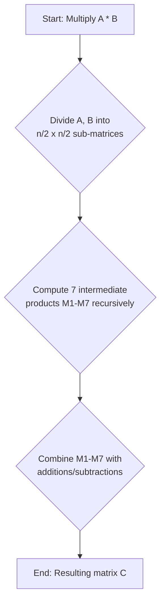

#### 2. Write the control abstraction of greedy strategy to solve a problem.
A greedy algorithm makes the locally optimal choice at each step with the hope that this choice will lead to a globally optimal solution.

View Diagram

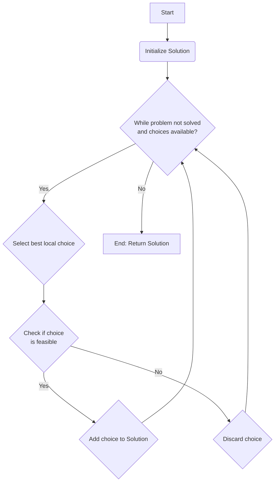

#### 3. List out the main steps involved in solving a computational problem using the algorithm design strategy in dynamic programming.
Dynamic programming solves complex problems by breaking them into overlapping subproblems, solving each subproblem only once, and storing the solutions.

View Diagram

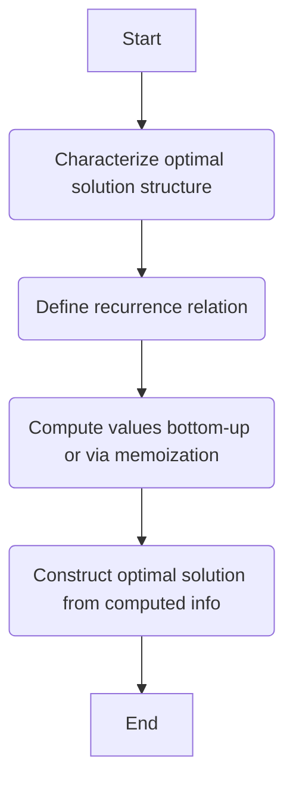

#### 4. Define the control abstraction for Backtracking.
Backtracking is a general algorithmic technique for finding all (or some) solutions to a computational problem, especially constraint satisfaction problems, by incrementally building candidates to the solutions and abandoning a candidate ("backtracking") as soon as it determines that the candidate cannot possibly be completed to a valid solution.

View Diagram

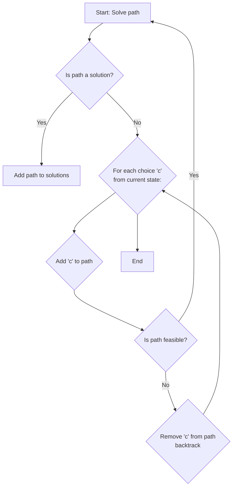

#### 5. Write the control abstraction for Divide and Conquer strategy for solving a problem.
Divide and Conquer is an algorithmic paradigm that recursively breaks down a problem into two or more sub-problems of the same or related type, until these become simple enough to be solved directly. The solutions to the sub-problems are then combined to give a solution to the original problem.

View Diagram

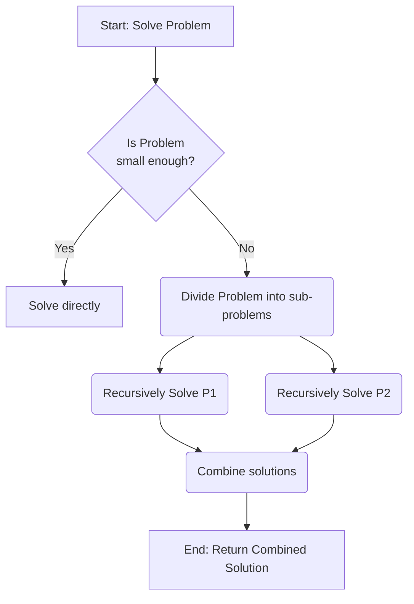

#### 6. Analyze the time complexity of Strassen's multiplication.
The time complexity of Strassen's matrix multiplication algorithm is O(n^log₂(7)), which is approximately O(n^2.81). This is an improvement over the brute-force O(n³) algorithm.

View Diagram

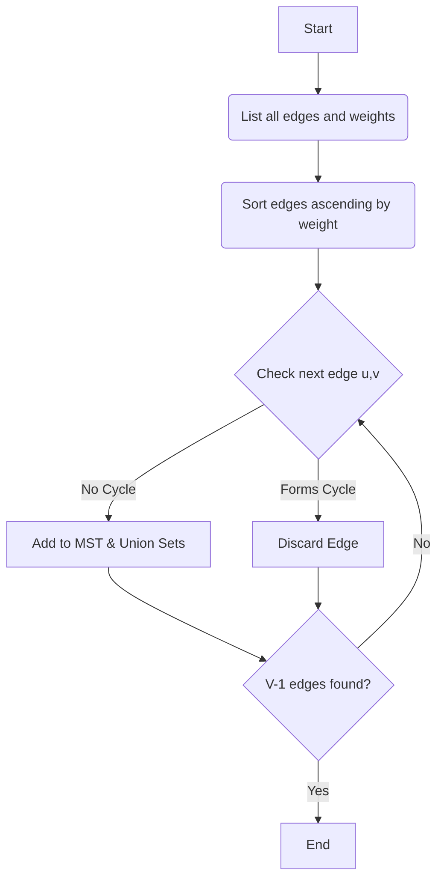

#### 7. Draw the State space tree of 4 queens' problem.
The 4-Queens problem state-space tree represents all possible placements of queens on a 4x4 chessboard. Each level corresponds to placing a queen in a row, and branches represent valid column choices. (A full 4-queens tree is too large for a concise diagram, so a conceptual structure is provided.)

View Diagram

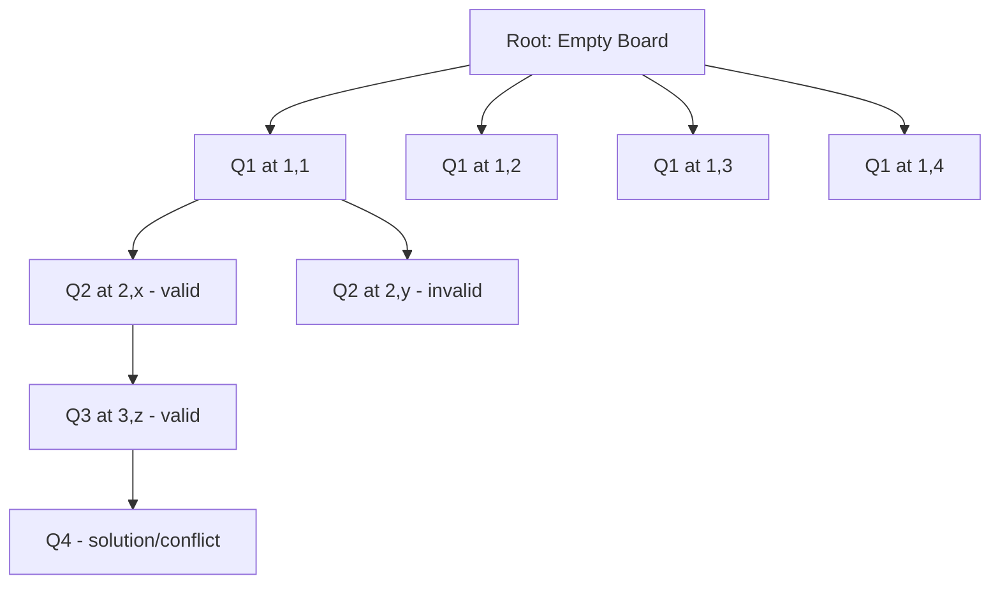

#### 8. Compare backtracking and branch and bound design techniques.
Backtracking and Branch and Bound are both state-space search techniques. Backtracking finds all (or any) feasible solutions and typically uses Depth-First Search (DFS) with a feasibility function. Branch and Bound finds the optimal solution, can use DFS or Breadth-First Search (BFS), and employs a bounding function to prune unpromising branches.

View Diagram

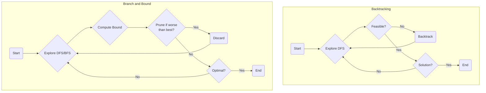

---

### **PART - B - Module 3**

#### 5. Fractional Knapsack problem.
The Fractional Knapsack problem is solved using a greedy approach by prioritizing items with the highest profit-to-weight ratio.

View Diagram

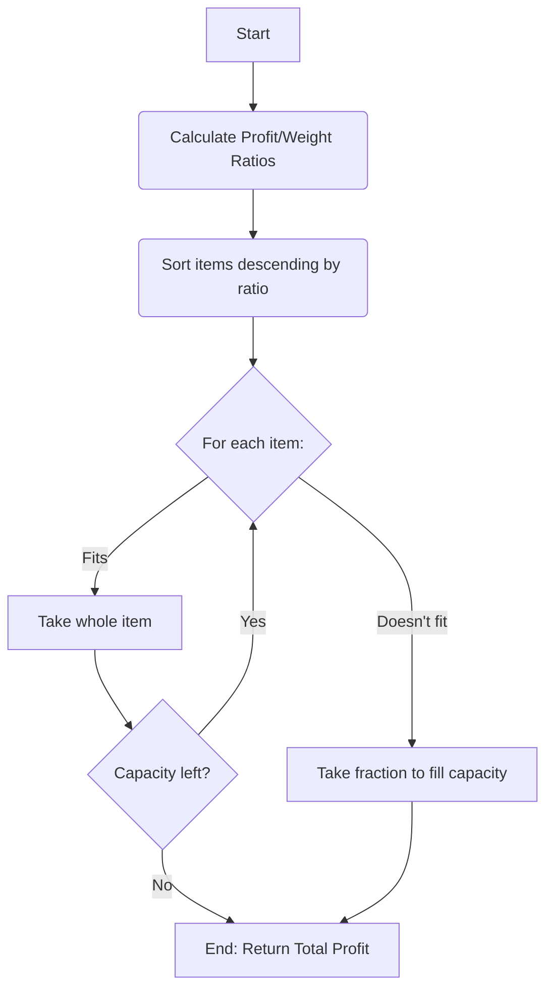

#### 6. Compute the Minimum Spanning Tree and its cost for the following graph using Kruskal's Algorithm. Indicate each step clearly. Find the complexity.
Kruskal's Algorithm is a greedy algorithm that finds a Minimum Spanning Tree (MST) for a weighted undirected graph. It sorts all edges by weight and adds the smallest-weight edges that do not form a cycle.
The complexity of Kruskal's algorithm is O(E log E) or O(E log V), where E is the number of edges and V is the number of vertices, primarily due to sorting the edges.

View Diagram

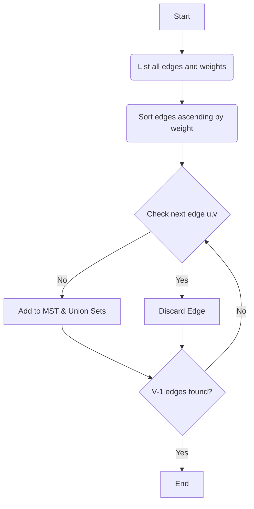

#### 7. Explain 2-way merge sort algorithm using divide and conquer strategy and analyze its complexity.
Merge Sort is a divide-and-conquer sorting algorithm. It recursively divides an array into two halves, sorts them, and then merges the sorted halves. Its time complexity is O(n log n) in all cases.

View Diagram

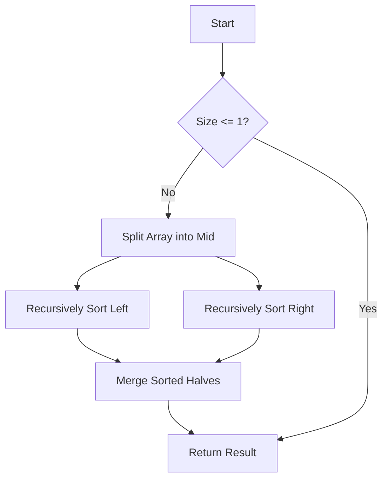

#### 8. Using Dijkstra's algorithm, find the shortest distance from source vertex ‘S' to remaining vertices in the following graph. Also write the order of visit.
Dijkstra's algorithm finds the shortest paths from a single source vertex to all other vertices in a weighted graph with non-negative edge weights.

View Diagram

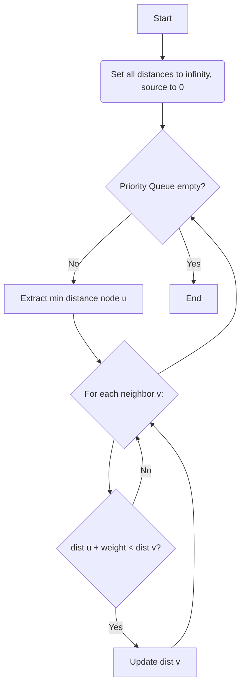

---

### **PART - B - Module 4**

#### 9. Write the greedy Knapsack algorithm and solve the given instance of 0/1 Knapsack problem using Dynamic Programming.
The 0/1 Knapsack problem is solved using dynamic programming because items cannot be broken (0 or 1, take or leave). A greedy approach is not optimal for 0/1 Knapsack. The dynamic programming approach typically involves building a table `K[i][w]` representing the maximum profit for `i` items with a knapsack capacity of `w`.

View Diagram

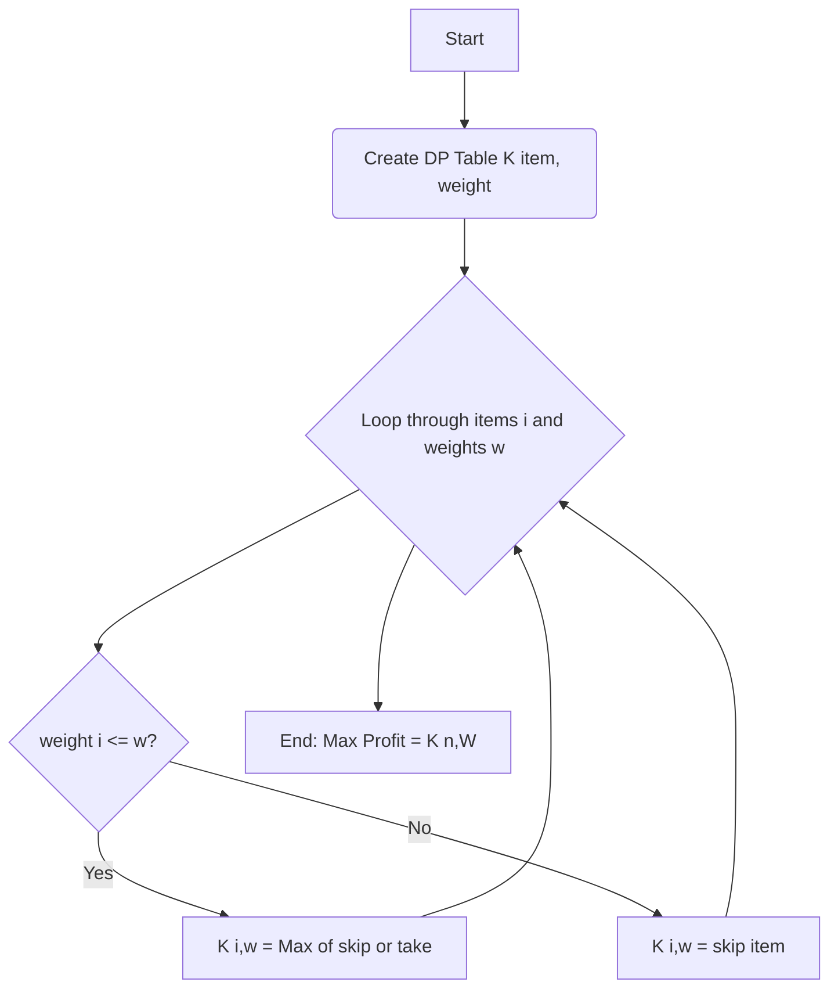

#### 11. Construct the weight adjacency matrix of the given graph. Apply the Floyd Warshall algorithm to construct the matrix D2 that represents the shortest paths distance between all vertices i and j (1 <= i <= 5 and 1 <= j <= 5) through intermediate vertices 1 and 2.
The Floyd-Warshall algorithm finds the shortest paths between all pairs of vertices in a weighted graph. It works by iteratively improving estimates for shortest paths by considering intermediate vertices.

View Diagram

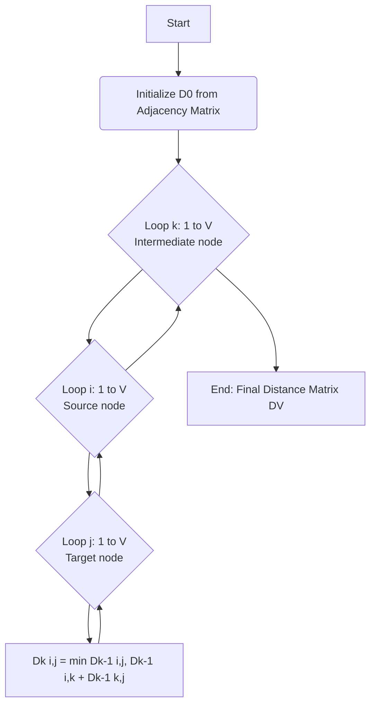

#### 12. Define Travelling Salesman Problem (TSP). Apply branch and bound technique to solve the following instance of TSP. Assume the starting vertex as A. Draw the state space tree for each step.
The Travelling Salesman Problem (TSP) asks for the shortest possible route that visits each city exactly once and returns to the origin city. Branch and Bound is an optimization technique that explores a state-space tree, using bounding functions to prune branches that cannot lead to an optimal solution.

View Diagram

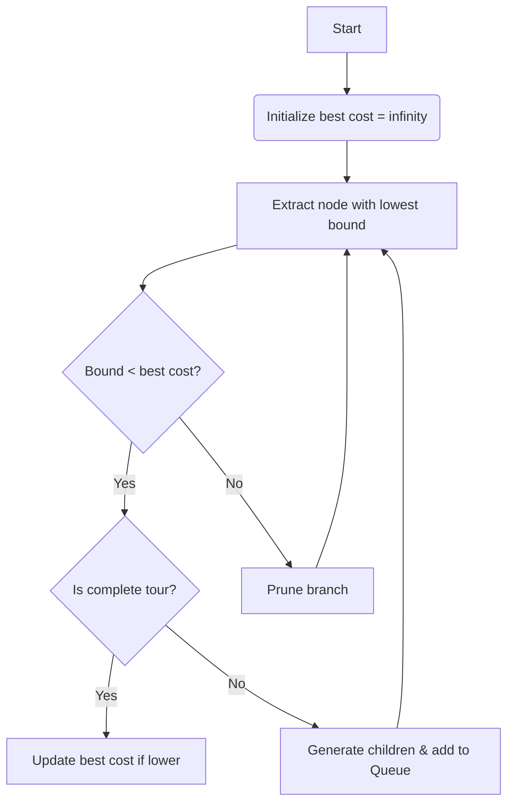

---

### **PART - B - Module 5**

#### 13. Given matrices A1, A2, A3 and A4 of order 5x6, 6x4, 4x2, and 2x3 respectively. Compute M using matrix chain multiplication algorithm. Also write the optimal parenthesis.
Matrix Chain Multiplication is a dynamic programming problem that finds the most efficient way to multiply a given sequence of matrices. The goal is to minimize the total number of scalar multiplications.

View Diagram

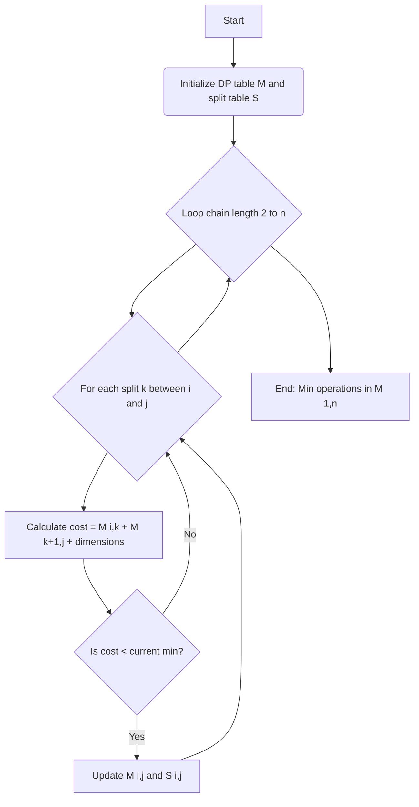

#### 15. Prove that vertex cover problem is NP Complete.
To prove that the Vertex Cover problem is NP-Complete, you need to show two things:
1.  **Vertex Cover is in NP:** Given a graph G=(V, E) and an integer k, and a candidate set C ⊆ V, we can verify if C is a vertex cover of size at most k in polynomial time. (Check if |C| ≤ k and if every edge in E has at least one endpoint in C).
2.  **Vertex Cover is NP-Hard:** Every problem in NP can be reduced to Vertex Cover in polynomial time. This is typically done by showing a polynomial-time reduction from a known NP-Complete problem (e.g., 3-SAT or Independent Set) to Vertex Cover.

View Diagram

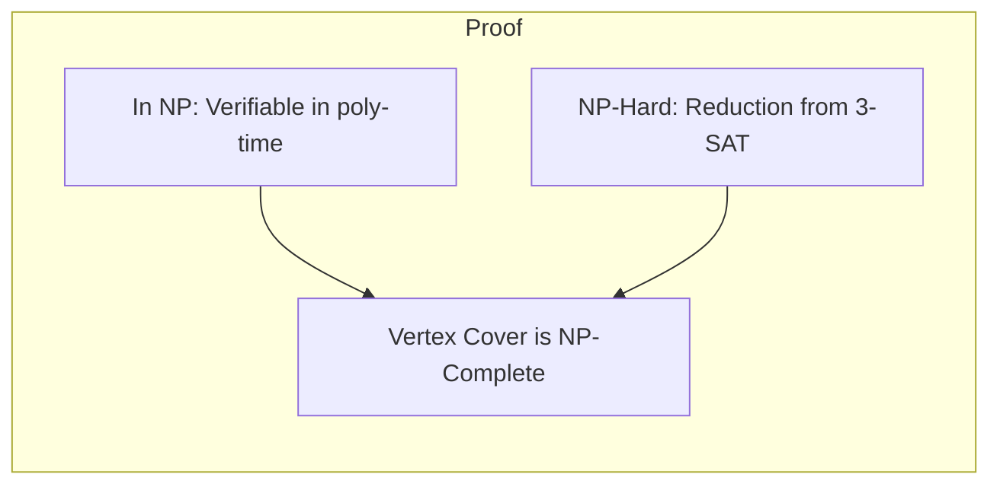

#### 16. Explain the four different complexity classes with suitable examples.
The four common complexity classes are P, NP, NP-Complete, and NP-Hard.

View Diagram

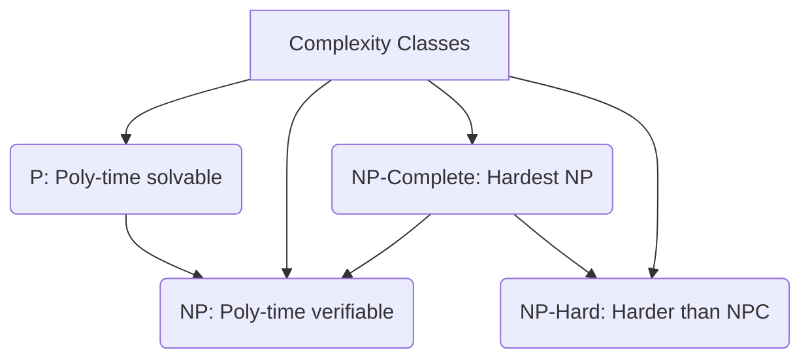

