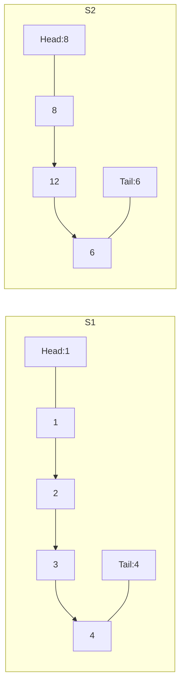
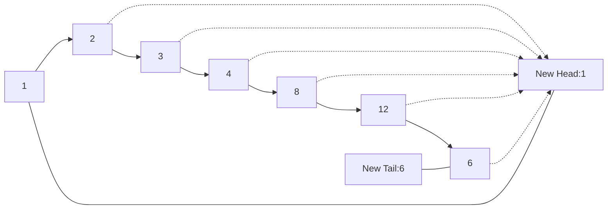
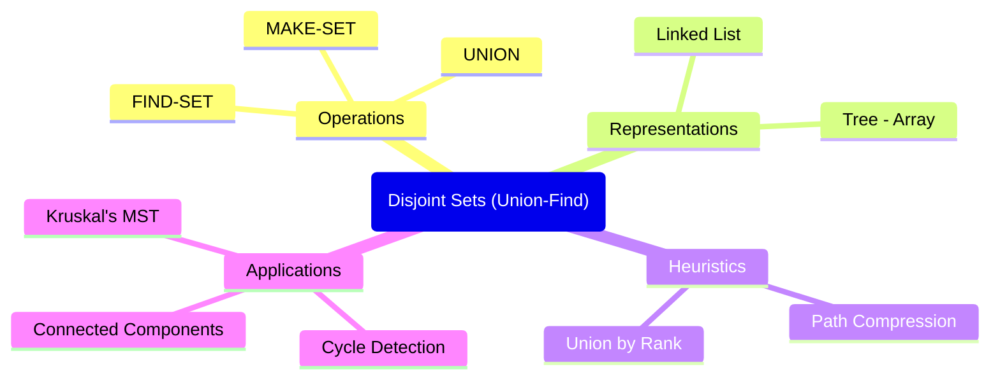

## Graph Traversals and Connectivity: A Comprehensive Guide

This module delves into fundamental graph algorithms: Breadth-First Search (BFS) and Depth-First Search (DFS), exploring their mechanisms, applications, and performance characteristics. We will also examine advanced concepts such as Strongly Connected Components (SCCs) in directed graphs and Topological Sorting for Directed Acyclic Graphs (DAGs), along with the utility of Disjoint Set Data Structures.

---

### 1. Introduction to Graph Traversals

Graph traversal is the process of visiting (checking and/or updating) each vertex in a graph. The order in which vertices are visited can reveal important properties about the graph. Two primary methods for graph traversal are Breadth-First Search (BFS) and Depth-First Search (DFS).

---

### 2. Breadth-First Search (BFS)

**Mnemonic:** "Breadth-First: **B**e **F**airly **S**hallow First!" (Explore all neighbors at the current level before moving to the next level.)

#### 2.1 Explanation and Working Principle

BFS is an algorithm for traversing or searching tree or graph data structures. It starts at the tree root (or some arbitrary node of a graph, sometimes referred to as a 'search key') and explores all of the neighbor nodes at the present depth prior to moving on to the nodes at the next depth level. It uses a **queue** data structure to manage the order of visiting nodes.

**Working Principle:**
1.  Start at a chosen source vertex `s`.
2.  Mark `s` as visited and add it to a queue.
3.  While the queue is not empty:
    *   Dequeue a vertex `v`.
    *   For each unvisited neighbor `u` of `v`:
        *   Mark `u` as visited.
        *   Enqueue `u`.

#### 2.2 Pseudocode

```
Algorithm BFS(G, start_node)
  1. Initialize a Queue Q
  2. Initialize a set/array 'visited' to keep track of visited nodes, all set to false
  3. Mark start_node as visited
  4. Enqueue start_node into Q

  5. While Q is not empty:
  6.   v = Dequeue(Q)
  7.   Print v (or process v)

  8.   For each unvisited neighbor u of v:
  9.     Mark u as visited
  10.    Enqueue u into Q
```


#### 2.3 Applications
*   **Finding the shortest path** between two nodes in an unweighted graph.
*   **GPS Navigation systems** (finding the shortest route).
*   **Broadcasting in a network**.
*   **Peer-to-Peer networks** (e.g., BitTorrent).
*   **Parsing social graphs**.
*   Testing a graph for bipartiteness.
*   Finding nodes in any connected component of a graph.
*   Serialization/Deserialization of a binary tree.

#### 2.4 Time and Space Complexity Analysis

**Time Complexity:**
*   **Adjacency List Representation:** Each vertex is enqueued and dequeued at most once (O(V)). Each edge is examined twice (once for each direction in an undirected graph, or once for each outgoing edge in a directed graph) when iterating through neighbors (O(E)). Therefore, the total time complexity is **O(V + E)**.
*   **Adjacency Matrix Representation:** For each vertex, checking all possible V neighbors takes O(V) time. Since there are V vertices, the total time complexity is O(V * V) = **O(V²)**.

**Space Complexity:**
*   In the worst case, the queue can hold all vertices in the graph (e.g., for a star graph where the central node is the starting point), requiring **O(V)** space for the queue and **O(V)** for the visited array. Thus, total space complexity is **O(V)**.

#### 2.5 Example BFS Traversal

Let's perform BFS traversal on the graph from the OCR (page 21) starting from node A, choosing nodes in alphabetical order when multiple are available.

```
      A -- B -- C
      |  \ |  / | \
      |   \| /  |  G
      |    E    | /
      D ------- F
```

**Connections:**
*   **A:** B, D, E
*   **B:** A, C, E
*   **C:** B, E, F, G
*   **D:** A, E
*   **E:** A, B, C, D, F
*   **F:** C, E
*   **G:** C

Let's perform the BFS traversal starting from node A, choosing nodes in alphabetical order when multiple unvisited neighbors are available.

**BFS Traversal Steps:**

1.  **Initialize:**
    *   Queue: `[]`
    *   Visited: `{}`
    *   BFS Order: `[]`

2.  **Start at A:**
    *   Enqueue `A`.
    *   Mark `A` as visited.
    *   Queue: `[A]`
    *   Visited: `{A}`

3.  **Dequeue A:**
    *   Add `A` to BFS Order.
    *   Neighbors of `A`: `B`, `D`, `E`. (All unvisited)
    *   Enqueue `B`, `D`, `E` in alphabetical order.
    *   Mark `B`, `D`, `E` as visited.
    *   BFS Order: `[A]`
    *   Queue: `[B, D, E]`
    *   Visited: `{A, B, D, E}`

4.  **Dequeue B:**
    *   Add `B` to BFS Order.
    *   Neighbors of `B`: `A` (visited), `C`, `E` (visited).
    *   Unvisited neighbor: `C`.
    *   Enqueue `C`.
    *   Mark `C` as visited.
    *   BFS Order: `[A, B]`
    *   Queue: `[D, E, C]`
    *   Visited: `{A, B, D, E, C}`

5.  **Dequeue D:**
    *   Add `D` to BFS Order.
    *   Neighbors of `D`: `A` (visited), `E` (visited).
    *   No unvisited neighbors.
    *   BFS Order: `[A, B, D]`
    *   Queue: `[E, C]`
    *   Visited: `{A, B, D, E, C}`

6.  **Dequeue E:**
    *   Add `E` to BFS Order.
    *   Neighbors of `E`: `A` (visited), `B` (visited), `C` (visited), `D` (visited), `F`.
    *   Unvisited neighbor: `F`.
    *   Enqueue `F`.
    *   Mark `F` as visited.
    *   BFS Order: `[A, B, D, E]`
    *   Queue: `[C, F]`
    *   Visited: `{A, B, D, E, C, F}`

7.  **Dequeue C:**
    *   Add `C` to BFS Order.
    *   Neighbors of `C`: `B` (visited), `E` (visited), `F` (visited), `G`.
    *   Unvisited neighbor: `G`.
    *   Enqueue `G`.
    *   Mark `G` as visited.
    *   BFS Order: `[A, B, D, E, C]`
    *   Queue: `[F, G]`
    *   Visited: `{A, B, D, E, C, F, G}`

8.  **Dequeue F:**
    *   Add `F` to BFS Order.
    *   Neighbors of `F`: `C` (visited), `E` (visited).
    *   No unvisited neighbors.
    *   BFS Order: `[A, B, D, E, C, F]`
    *   Queue: `[G]`
    *   Visited: `{A, B, D, E, C, F, G}`

9.  **Dequeue G:**
    *   Add `G` to BFS Order.
    *   Neighbors of `G`: `C` (visited).
    *   No unvisited neighbors.
    *   BFS Order: `[A, B, D, E, C, F, G]`
    *   Queue: `[]`
    *   Visited: `{A, B, D, E, C, F, G}`

10. **Queue is empty.**

**Final BFS Traversal Order for the corrected graph:** A, B, D, E, C, F, G.

### 3. Depth-First Search (DFS)

**Mnemonic:** "Depth-First: **D**ive **F**arther, then **S**urrender!" (Explore as far as possible along each branch before backtracking.)

#### 3.1 Explanation and Working Principle

DFS is an algorithm for traversing or searching a tree or graph data structure. The algorithm starts at the root (or some arbitrary node) and explores as far as possible along each branch before backtracking. It uses a **stack** (either explicitly or implicitly through recursion) to keep track of the next vertex to visit.

**Working Principle:**
1.  Start at a chosen source vertex `s`.
2.  Mark `s` as visited and push it onto a stack.
3.  While the stack is not empty:
    *   Pop a vertex `v`.
    *   Print `v` (or process `v`).
    *   For each unvisited neighbor `u` of `v`:
        *   Mark `u` as visited.
        *   Push `u` onto the stack.

Alternatively, a recursive approach:
1.  Define a recursive function `DFS(v)`:
    *   Mark `v` as visited.
    *   Print `v` (or process `v`).
    *   For each unvisited neighbor `u` of `v`:
        *   Call `DFS(u)`.

#### 3.2 Pseudocode

```
Algorithm DFS(G, start_node)
  1. Initialize a Stack S
  2. Initialize a set/array 'visited' to keep track of visited nodes, all set to false
  3. Push start_node onto S
  4. Mark start_node as visited

  5. While S is not empty:
  6.   v = Pop(S)
  7.   Print v (or process v)

  8.   For each unvisited neighbor u of v (often in reverse alphabetical or insertion order
       to simulate standard DFS behavior when popping):
  9.     If u is not visited:
  10.      Mark u as visited
  11.      Push u onto S

// Recursive DFS (more common implementation)
Algorithm Recursive_DFS(G, v, visited)
  1. Mark v as visited
  2. Print v (or process v)

  3. For each neighbor u of v:
  4.   If u is not visited:
  5.     Recursive_DFS(G, u, visited)
```


#### 3.3 Applications
*   **Finding connected components** in a graph.
*   **Topological sorting** in a DAG.
*   **Cycle detection** in graphs.
*   Finding 2-connected (edge or vertex) components.
*   Finding strongly connected components.
*   Solving puzzles with only one solution (e.g., mazes).
*   Finding biconnectivity in graphs.

#### 3.4 Time and Space Complexity Analysis

**Time Complexity:**
*   **Adjacency List Representation:** Similar to BFS, each vertex is visited once (O(V)), and each edge is examined twice (O(E)). Therefore, the total time complexity is **O(V + E)**.
*   **Adjacency Matrix Representation:** For each vertex, checking all possible V neighbors takes O(V) time. Since there are V vertices, the total time complexity is O(V * V) = **O(V²)**.

**Space Complexity:**
*   In the worst case, the stack can hold all vertices (e.g., for a path graph), requiring **O(V)** space for the stack (or recursion call stack) and **O(V)** for the visited array. Thus, total space complexity is **O(V)**.

#### 3.5 Edge Classification based on DFS

During a DFS traversal on a directed graph, edges can be classified into four types relative to the DFS tree (or forest) being formed:

1.  **Tree Edge:** An edge `(u, v)` that is part of the DFS forest, where `v` is discovered during the `DFS(u)` call. These are the edges that lead to an unvisited node.
2.  **Back Edge:** An edge `(u, v)` where `v` is an ancestor of `u` in the DFS tree. Back edges indicate the presence of a **cycle** in a directed graph.
3.  **Forward Edge:** An edge `(u, v)` where `v` is a descendant of `u` in the DFS tree, but not a tree edge. This edge connects a node to a descendant that has already been visited.
4.  **Cross Edge:** An edge `(u, v)` where `v` is neither an ancestor nor a descendant of `u`, and `u` and `v` are in different DFS trees (or in the same tree but not ancestrally related). These edges connect nodes that are not directly related in the DFS tree.

#### 3.6 Cycle Detection using DFS

**Can we use DFS to detect cycles in a graph? Justify your answer.**

**Yes, DFS can be effectively used to detect cycles in both directed and undirected graphs.**

**Justification:**

*   **Undirected Graphs:** In an undirected graph, a cycle is detected if, during DFS, we encounter a visited node that is not the immediate parent of the current node in the DFS tree. If `DFS(u)` is called, and `v` is a neighbor of `u`, if `v` is already visited and `v` is not the parent of `u`, then there is a back edge `(u, v)`, indicating a cycle.
    *   *Example:* If we are at node `u`, and we explore its neighbor `v`. If `v` is already visited and `v` is not the node from which `u` was visited (i.e., `v` is not `parent[u]`), then `u` and `v` form a cycle with the path from the root to `v` and then to `u`.

*   **Directed Graphs:** In a directed graph, cycle detection is more precise. A cycle is detected if, during DFS, we encounter a **back edge**. A back edge `(u, v)` occurs when `v` is an ancestor of `u` in the current DFS tree. To track this, we need three states for nodes:
    1.  **Unvisited:** The node has not been discovered yet.
    2.  **Visiting (or In Recursion Stack):** The node has been discovered, and its DFS call is currently active (i.e., it's in the current recursion stack).
    3.  **Visited (or Finished):** The node's DFS call has completed, and all its descendants have been explored.

    If, while traversing from `u`, we encounter a neighbor `v` that is in the **Visiting** state, it means `v` is an ancestor of `u` in the current DFS path, and thus, a back edge `(u, v)` exists, forming a cycle.

**Mnemonic for Cycle Detection:** "DFS finds **B**ack **E**dges, **C**ycles **A**re **R**evealed!"

---

### 4. Strongly Connected Components (SCCs)

**Mnemonic:** "SCC: **S**ame **C**rew, **C**onnected!" (All members of the crew can reach each other.)

#### 4.1 Definition

A **Strongly Connected Component (SCC)** of a directed graph is a maximal subgraph such that for every pair of vertices `(u, v)` in the subgraph, there is a path from `u` to `v` and a path from `v` to `u`. In simpler terms, all vertices within an SCC can reach every other vertex in that same SCC. These components form a partition of the graph.

#### 4.2 Algorithm (Kosaraju's Algorithm)

Kosaraju's algorithm is a two-pass algorithm that efficiently finds all SCCs in a directed graph.

**Working Principle (Kosaraju's Algorithm):**
**Pass 1:**
1.  Initialize all vertices as unvisited.
2.  Create an empty stack `S`.
3.  Perform DFS traversal on the graph `G`. For each unvisited vertex, start a DFS. When a DFS call finishes (i.e., a vertex has no unvisited neighbors), push that vertex onto stack `S`. This ensures that vertices with higher finishing times (and thus likely part of SCCs that appear "earlier" in the topological sort of the component graph) are at the top of the stack.

**Pass 2:**
1.  Compute the **transpose** of the graph `G`, denoted `Gᵀ`. In `Gᵀ`, all edge directions are reversed.
2.  Reset all vertices to unvisited.
3.  While stack `S` is not empty:
    *   Pop a vertex `v` from `S`.
    *   If `v` is unvisited:
        *   Start a DFS traversal on `Gᵀ` from `v`. All vertices visited during this DFS traversal belong to one SCC. Mark them as visited.

**Time Complexity:**
*   First DFS pass: O(V + E)
*   Transposing the graph: O(V + E) (or O(V²) for adjacency matrix)
*   Second DFS pass: O(V + E)
*   Total time complexity: **O(V + E)**.

#### 4.3 Example

Let's illustrate Kosaraju's algorithm with the example graph from the OCR (page 41).

**Graph G:**
```
     1 <--- 7 <--- 9 <--- 6 <--- 8 <--- 2
     ^    ^             ^
     |    |             |
     4    3 ---------> 5
```
*(Note: The OCR diagram for G shows edges 7->1, 9->7, 6->9, 8->6, 2->8. Also 3->7, 3->5, 4->1. This is a directed graph).*

**Pass 1: DFS on G and fill stack S**
*   **Start DFS from 1:**
    *   DFS(1): Push 1 onto stack `S` when finished.
    *   Neighbor 4: DFS(4) -> Push 4 onto `S`.
    *   Neighbor 7: DFS(7) -> Push 7 onto `S`.
    *   Neighbor 9: DFS(9) -> Push 9 onto `S`.
    *   Neighbor 6: DFS(6) -> Push 6 onto `S`.
    *   Neighbor 8: DFS(8) -> Push 8 onto `S`.
    *   Neighbor 2: DFS(2) -> Push 2 onto `S`.
    *   (Assuming we visit in order 1 -> 4 -> 7 -> 9 -> 6 -> 8 -> 2. The stack `S` will contain nodes in the order of their finishing times, with the earliest finished at the bottom and latest at the top.)
    *   Let's follow the OCR:
        *   DFS(1): visits 4, then 7, then 9, then 6, then 8, then 2.
        *   Order pushed onto stack S (bottom to top): (This is an example from the OCR, actual order depends on tie-breaking rules if not explicitly followed).
        *   The stack at the end of Pass 1 in the OCR example: [S, 7, 4, 1, 6, 3, 9, 2, 8] (bottom to top).

**Pass 2: DFS on Gᵀ using stack S**

**Graph Gᵀ (Transpose of G):**
```
     1 ---> 7 ---> 9 ---> 6 ---> 8 ---> 2
     ^    ^             ^
     |    |             |
     4    3 <--------- 5
```
*(Note: Edge 3->7 and 3->5 remain the same in transpose. Edges 7->1, 9->7, 6->9, 8->6, 2->8 become 1<-7, 7<-9, 9<-6, 6<-8, 8<-2. This creates edges like 1<-7, 7<-3 from 3->7, etc. The provided example in the OCR for G^T (page 43) seems to have simply reversed the *arrows* without changing the numeric labels, which effectively means reversing the edges.)*

Let's assume the stack from OCR: S = (top to bottom).

1.  **Pop 8:** Start DFS(8) on Gᵀ.
    *   DFS(8) explores neighbors in Gᵀ (which is 6).
    *   DFS(6) explores neighbors in Gᵀ (which is 9).
    *   DFS(9) explores neighbors in Gᵀ (which is 7).
    *   DFS(7) explores neighbors in Gᵀ (which is 3, 1).
    *   DFS(3) explores neighbors in Gᵀ (none). SCC found: **{3}**
    *   DFS(1) explores neighbors in Gᵀ (none). SCC found: **{1}**
    *   This is not how the OCR is illustrating. Let's trace the OCR's Pass 2:

    **OCR's Pass 2 trace:**
    *   **Pop 8:** DFS traversal based on 8 on Gᵀ. Neighbors of 8 in Gᵀ are none. SCC: **{8}**.
    *   **Pop 2:** DFS traversal based on 2 on Gᵀ. Neighbors of 2 in Gᵀ are 8 (visited). SCC: **{2}**.
    *   **Pop 9:** DFS traversal based on 9 on Gᵀ. Neighbors of 9 in Gᵀ are 6. DFS(6). Neighbors of 6 in Gᵀ are 9 (ancestor). SCC: **{9, 6}**.
    *   **Pop 3:** DFS traversal based on 3 on Gᵀ. Neighbors of 3 in Gᵀ are 7. DFS(7). Neighbors of 7 in Gᵀ are 1. DFS(1). SCC: **{3, 7, 1}**.

This gives us the SCCs: **{8}, {2}, {9, 6}, {3, 7, 1}**.

---

### 5. Topological Sorting

**Mnemonic:** "Topological Sort: **T**hink **O**rder, **P**re-requisites **S**atisfied!" (Finish tasks in the correct dependency order.)

#### 5.1 Definition and Conditions

**Topological Sorting** (or Topological Ordering) is a linear ordering of vertices in a directed acyclic graph (DAG) such that for every directed edge `(u, v)`, vertex `u` comes before `v` in the ordering.

**Conditions:**
*   It is only possible on a **Directed Acyclic Graph (DAG)**. If the graph contains a cycle, no linear ordering is possible.
*   A DAG may have multiple different topological orderings.

#### 5.2 Algorithms

Two common algorithms for topological sorting are Kahn's algorithm (based on in-degrees) and a DFS-based algorithm.

##### 5.2.1 Kahn's Algorithm (In-degree based)

**Working Principle:**
1.  Compute the in-degree of every vertex (number of incoming edges).
2.  Initialize a queue with all vertices that have an in-degree of 0.
3.  Initialize an empty list for the topological order.
4.  While the queue is not empty:
    *   Dequeue a vertex `u`.
    *   Add `u` to the topological order list.
    *   For each neighbor `v` of `u`:
        *   Decrement the in-degree of `v`.
        *   If the in-degree of `v` becomes 0, enqueue `v`.
5.  If the number of vertices in the topological order list is less than the total number of vertices in the graph, it means there was a cycle (and thus not a DAG). Otherwise, the list contains a valid topological ordering.

**Time Complexity:** O(V + E)

##### 5.2.2 DFS-based Algorithm

**Working Principle:**
1.  Perform a DFS traversal on the graph.
2.  Maintain a stack. When a DFS call finishes for a vertex (i.e., all its neighbors and their descendants have been explored), push the vertex onto the stack.
3.  After the DFS completes for all vertices, pop the vertices from the stack. The popped order will be a topological ordering.

**Time Complexity:** O(V + E)

#### 5.3 Example

Let's find the possible topological orderings for a given graph from the OCR (page 35).

**Graph:**
```
     a --> b --> e
     |     ^
     v     |
     c --> d
```

**Using DFS-based approach (or similar logic as in OCR):**

The OCR examples show finding nodes with an in-degree of 0 and processing them. This aligns more with Kahn's algorithm, but the notation for "topological ordering-1: a" and then adding elements suggests a step-by-step construction of the order. Let's demonstrate for this graph.

1.  **Identify nodes with no incoming edges (in-degree = 0):** Only `a`.
2.  **Add `a` to ordering:** `Order: [a]`
3.  **Remove `a` and its outgoing edges (`a -> b`, `a -> c`):**
    *   Now, `b` has an in-degree of 0 (from `d` not `a` anymore).
    *   `c` has an in-degree of 0.
    *   Remaining graph:
        ```
             b --> e
             ^
             |
             d
        ```
4.  **Identify nodes with in-degree = 0:** `b` and `c`.
    *   **Case 1: Choose `b`**
        *   Add `b` to ordering: `Order: [a, b]`
        *   Remove `b` and its outgoing edge `b -> e`.
        *   `e`'s in-degree from `b` decreases.
        *   Now `c` has in-degree 0.
        *   Remaining graph:
            ```
                c --> d --> e
            ```
        *   Choose `c`. Add `c`. `Order: [a, b, c]`
        *   Remove `c` and `c -> d`.
        *   `d` has in-degree 0.
        *   Choose `d`. Add `d`. `Order: [a, b, c, d]`
        *   Remove `d` and `d -> e`.
        *   `e` has in-degree 0.
        *   Choose `e`. Add `e`. `Order: [a, b, c, d, e]`
        *   **Topological Ordering 1: a, b, c, d, e**

    *   **Case 2: Choose `c`** (from step 4, where `b` and `c` had in-degree 0)
        *   Add `c` to ordering: `Order: [a, c]`
        *   Remove `c` and its outgoing edge `c -> d`.
        *   `d`'s in-degree from `c` decreases.
        *   Now `b` has in-degree 0.
        *   Remaining graph:
            ```
                 b --> e
                 ^
                 |
                 d
            ```
        *   Choose `b`. Add `b`. `Order: [a, c, b]`
        *   Remove `b` and `b -> e`.
        *   `e`'s in-degree from `b` decreases.
        *   Now `d` has in-degree 0.
        *   Choose `d`. Add `d`. `Order: [a, c, b, d]`
        *   Remove `d` and `d -> e`.
        *   `e` has in-degree 0.
        *   Choose `e`. Add `e`. `Order: [a, c, b, d, e]`
        *   **Topological Ordering 2: a, c, b, d, e**

The OCR provides the order `acbde` as another example.

---

### 6. Disjoint Set Data Structures

**Mnemonic:** "Disjoint Sets: **U**nite **F**amilies, **F**ind **R**oots!" (Operations are Union and Find, which identify and connect sets through representatives/roots.)

#### 6.1 Operations Supported by Disjoint Set Data Structure

A Disjoint Set Data Structure (also known as Union-Find Data Structure) maintains a collection of disjoint (non-overlapping) sets. Each set has a representative element, which is typically the "root" of a tree structure. It supports the following key operations:

1.  **MakeSet(x):** Creates a new set whose only member is `x`. `x` is the representative of this new set. This operation is performed for each item when the data structure is initialized.
2.  **Find(x):** Returns the representative (or root) of the set containing `x`. This operation is crucial for determining if two elements are in the same set. It typically traverses parent pointers until it reaches the root.
3.  **Union(x, y):** Merges the sets containing `x` and `y` into a single set. If `x` and `y` are already in the same set, nothing happens. Otherwise, the two sets are combined by making the representative of one set point to the representative of the other.

#### 6.2 Working of Disjoint Set Data Structure for Computing Connected Components of an Undirected Graph

The Disjoint Set Data Structure is highly effective for finding the connected components of an undirected graph. A connected component is a subgraph in which any two vertices are connected to each other by paths, and which is connected to no additional vertices in the supergraph.

**Algorithm for Connected Components using Disjoint Sets:**
1.  **Initialization:** For each vertex `v` in the graph, call `MakeSet(v)`. This creates `V` individual sets, each containing one vertex, and each vertex is its own representative.
2.  **Process Edges:** For each edge `(u, v)` in the graph:
    *   Perform `Find(u)` to get the representative of `u`'s set.
    *   Perform `Find(v)` to get the representative of `v`'s set.
    *   If `Find(u)` is not equal to `Find(v)` (meaning `u` and `v` are in different connected components):
        *   Call `Union(u, v)` to merge their respective sets. This effectively connects the components that `u` and `v` belong to.
3.  **Result:** After processing all edges, each distinct set remaining in the Disjoint Set Data Structure represents a unique connected component of the graph. The number of disjoint sets will be the number of connected components.

**Optimizations (Path Compression and Union by Rank/Size):**
To achieve near-constant time complexity for `Find` and `Union` operations (amortized O(α(N)), where α is the inverse Ackermann function, which grows extremely slowly), two optimizations are commonly used:
*   **Path Compression:** During a `Find(x)` operation, after finding the root, all nodes encountered on the path from `x` to the root are directly attached to the root.
*   **Union by Rank (or Size):** When performing `Union(x, y)`, the smaller tree is attached under the root of the larger tree (either by rank/height or by size/number of nodes). This helps to keep the trees flat and minimizes path lengths.

#### 6.3 Example

Let's consider an undirected graph to illustrate:

**Graph:** V = {A, B, C, D, E}, E = {(A, B), (B, C), (D, E)}

1.  **Initialization:**
    *   `MakeSet(A)` -> {A} (rep: A)
    *   `MakeSet(B)` -> {B} (rep: B)
    *   `MakeSet(C)` -> {C} (rep: C)
    *   `MakeSet(D)` -> {D} (rep: D)
    *   `MakeSet(E)` -> {E} (rep: E)
    *   Sets: {A}, {B}, {C}, {D}, {E}

2.  **Process Edges:**
    *   **Edge (A, B):**
        *   `Find(A)` = A
        *   `Find(B)` = B
        *   A != B, so `Union(A, B)`. Let's say B's root points to A.
        *   Sets: {A, B}, {C}, {D}, {E} (rep of {A,B} is A)
    *   **Edge (B, C):**
        *   `Find(B)` = A
        *   `Find(C)` = C
        *   A != C, so `Union(B, C)`. Let's say C's root points to A.
        *   Sets: {A, B, C}, {D}, {E} (rep of {A,B,C} is A)
    *   **Edge (D, E):**
        *   `Find(D)` = D
        *   `Find(E)` = E
        *   D != E, so `Union(D, E)`. Let's say E's root points to D.
        *   Sets: {A, B, C}, {D, E} (rep of {D,E} is D)

3.  **Result:**
    After processing all edges, we have two disjoint sets:
    *   Set 1: {A, B, C} (representative A)
    *   Set 2: {D, E} (representative D)

    Therefore, the graph has two connected components: **{A, B, C}** and **{D, E}**.

---

## **✅ Disjoint Set Data Structure (Union-Find) – Complete Reverse-Engineered Notes**

Here’s a **thorough, easy-to-memorize** guide tailored for your KTU CST 306 Module 2. I’ll use simple language, points, mnemonics, step-by-step examples, and visual Mermaid diagrams.

---

### 1. What are Disjoint Sets? (Union-Find)

**Disjoint Sets** are a collection of **non-overlapping (disjoint)** sets.  
No element belongs to more than one set at any time.

**Real-life analogy**:  
- Students divided into different groups for projects.  
- Once two groups are merged (union), they become one group.

**Main Purpose**: Efficiently manage **dynamic partitioning** of elements and answer “Are these two elements in the same set?” quickly.

**Key Operations** (Must remember these 3):

| Operation       | Meaning                                      | What it does                              |
|-----------------|----------------------------------------------|-------------------------------------------|
| **MAKE-SET(x)** | Create a new set containing only element x   | Initializes singleton set {x}             |
| **FIND-SET(x)** | Find the representative (leader) of the set containing x | Returns the root/parent of the set        |
| **UNION(x, y)** | Merge the sets containing x and y            | Combines two sets into one                |

**Mnemonic for Operations**: **M**ake → **F**ind → **U**nion → **MFU** (like "My Favorite University")

---

### 2. Basic Implementation using Linked List Representation

Each set is represented as a **linked list**.  
- Every element points to the **head** (representative) of its list.  
- The head has a pointer to the **tail** (for fast union).

**MAKE-SET(x)**:
- Create a new list with single node x.
- x points to itself as head.

**FIND-SET(x)**:
- Return the head of the list that x belongs to.

**UNION(x, y)**:
- Find head of set containing x and head of set containing y.
- Append the smaller list to the end of the larger list (or any heuristic).
- Update all elements in the appended list to point to the new head.

**Practice Question [2025 Q4]:**  
Draw the linked list representation of **UNION(2,6)** where  
S1 = {1,2,3,4} and S2 = {8,12,6}

**Before UNION**:



**After UNION(2,6)** (assuming we append S2 to S1):



All elements now point to **1** as their representative.

**Note**: In basic linked list, UNION can be slow if we always append and have to update pointers.

---

### 3. Heuristics to Improve Performance (Very Important for Exams)

Naive implementation can be slow. Two powerful heuristics make it **almost O(1)** per operation (amortized).

#### A. **Union by Rank** (or Union by Size)

- Each set has a **rank** (approximate height of the tree).
- When doing UNION, attach the **tree with smaller rank** under the **tree with larger rank**.
- If ranks are equal, increase rank of the new root by 1.

**Benefit**: Keeps the tree flat → FIND operation is fast.

**Mnemonic**: "Marry the shorter person to the taller one" → Union by Rank

#### B. **Path Compression**

- During **FIND-SET(x)**, make all nodes on the path from x to root point **directly to the root**.
- This flattens the tree dramatically for future finds.

**Two-pass or One-pass** implementation is common.

**Mnemonic**: "Compress the path like a spring — make everyone report directly to the boss (root)"

**Combined Effect (Union by Rank + Path Compression)**:  
**Ackermann function** inverse → Practically constant time (extremely slow growing).

**Exam Tip [2022 Q3]**: Always explain both heuristics with diagrams showing tree height reduction.

---

### 4. Tree Representation (Array-based) – Most Common in Practice

- Use an array `parent[]` and `rank[]`.
- `parent[i] = i` means i is root.
- `FIND-SET` with path compression (recursive or iterative).

**Pseudocode** (Simple version):

```python
MAKE-SET(x):
    parent[x] = x
    rank[x] = 0

FIND-SET(x):
    if parent[x] != x:
        parent[x] = FIND-SET(parent[x])   # Path Compression
    return parent[x]

UNION(x, y):
    px = FIND-SET(x)
    py = FIND-SET(y)
    if px == py: return                    # Already same set
    if rank[px] > rank[py]:
        parent[py] = px
    elif rank[px] < rank[py]:
        parent[px] = py
    else:
        parent[py] = px
        rank[px] = rank[px] + 1
```

---

### 5. Application: Finding Connected Components in Undirected Graph [2024 Q13]

**Algorithm using Disjoint Sets**:

1. For each vertex `v` in graph: **MAKE-SET(v)**
2. For each edge `(u, v)` in graph:
   - If **FIND-SET(u) != FIND-SET(v)**:
     - **UNION(u, v)**
3. The number of distinct roots = number of connected components.
4. All vertices with same `FIND-SET(root)` belong to same component.

**Why it works?**  
Every time we process an edge, we merge the sets of connected vertices. Finally, each connected component becomes one disjoint set.

**Memory Tip**: "Process all edges → merge friends → count distinct families left"

---

### 6. Mind Map for Quick Revision



---

### Quick Mnemonics for Memorization

- **3 Operations**: **M**ake a set → **F**ind its boss → **U**nite two sets (**MFU**)
- **Union by Rank**: "Attach small tree under big tree"
- **Path Compression**: "Everyone reports directly to the root (CEO)"
- **Linked List UNION**: Append one list to another and update head pointer
- **Performance**: With both heuristics → "Almost constant time"

---

**Practice Questions You Should Solve:**

1. Define **MAKE-SET**, **UNION**, **FIND-SET** with example [2023 Q3]
2. Explain **Union by Rank** and **Path Compression** [2022 Q3]
3. Implement **UNION** using **linked list** representation [2024 Q13]
4. Find connected components of a given graph using Disjoint Sets [2024 Q13]
5. Draw linked list after **UNION(2,6)** for the given sets [2025 Q4]
