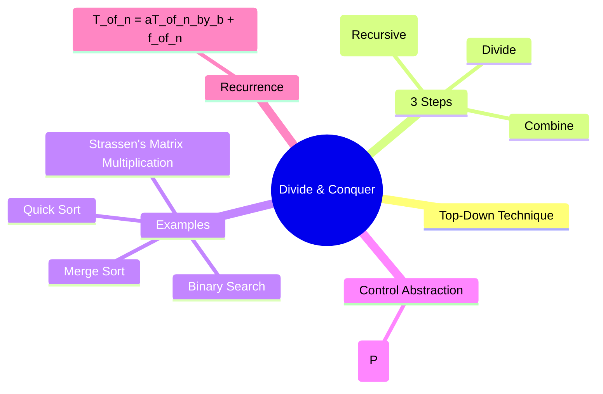
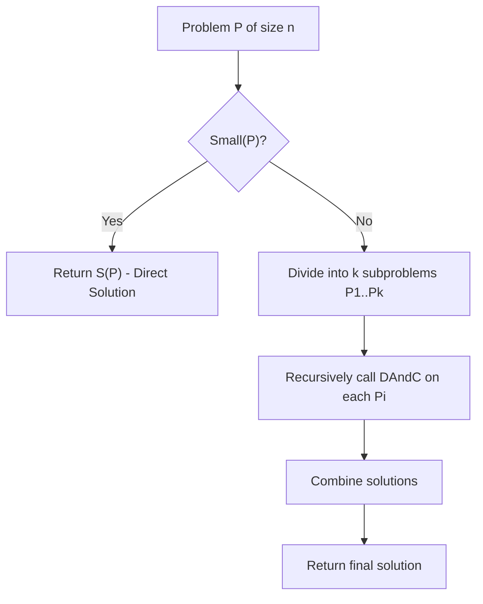
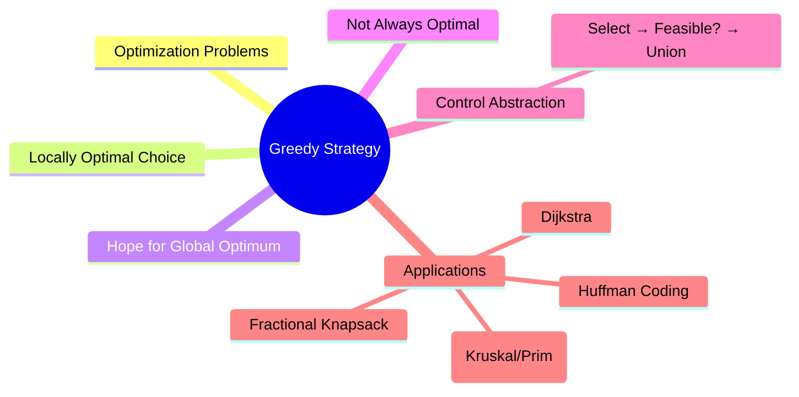

## **✅ Module 3: Divide & Conquer + Greedy Strategy**  
**Subject: Algorithm Analysis and Design (CST 306) – KTU S6 CSE**  
**Reverse Engineered Notes for Thorough Understanding**

---

### 1. Divide and Conquer (D&C) – Big Picture (Mind Map Style)



**Simple Explanation (in points):**
- **Divide**: Break big problem into smaller **identical** subproblems.
- **Conquer**: Solve subproblems **recursively** (until too small).
- **Combine**: Merge solutions of subproblems to get final answer.
- Works best when subproblems are **independent** and **similar**.

**Mnemonic for 3 steps**: **D**ivide → **C**onquer → **C**ombine → **DCC** (like "Doctor of Computer Concepts" 😂)

---

### 2. Control Abstraction of Divide & Conquer



**Algorithm (Pseudocode):**
```pseudocode
DAndC(P):
    if Small(P) then
        return S(P)
    else
        Divide P into P1, P2, ..., Pk
        return Combine( DAndC(P1), DAndC(P2), ..., DAndC(Pk) )
```

- **Small(P)**: Base case (e.g., 1 element in Merge Sort)
- **S(P)**: Trivial solution
- **Combine**: Most important part (e.g., Merge in Merge Sort)

---

### 3. 2-Way Merge Sort – Step by Step Mastery

**Core Idea**: 
- Divide array into two halves
- Sort both halves recursively
- **Merge** the two sorted halves

**Divide & Conquer in Merge Sort**:
- **Divide**: `mid = (low + high)/2`
- **Conquer**: `MergeSort(low, mid)` and `MergeSort(mid+1, high)`
- **Combine**: `Merge(low, mid, high)`

**Merge Function Logic (Simple)**:
- Use two pointers (one for each half)
- Compare and pick smaller element
- Copy remaining elements at the end

**Time Complexity Derivation (Iteration Method)** – Learn to derive yourself:

$$
T(n) = 2T(n/2) + cn
$$

**Unrolling:**

T(n) = 2T(n/2) + cn  
= 2[2T(n/4) + c(n/2)] + cn  
= 4T(n/4) + 2cn  
...  
= 2^k T(n/2^k) + k cn  

When $\frac{n}{2^k} = 1$, $k = \log_2 n$.

$T(n) = nT(1) + cn \log n = O(n \log n)$

**Key Point**: Merge Sort is **stable** and has **same complexity** in Best/Average/Worst case = **O(n log n)**

**Mnemonic**: "Merge Sort = Divide → Sort Halves → **Merge** like merging two sorted queues"

---

### 4. Strassen’s Matrix Multiplication (Faster than Naive!)

**Naive Method**: 8 multiplications + 4 additions → **O(n³)**

**Strassen’s Trick**: Reduce **8 multiplications → 7 multiplications** (at cost of more additions/subtractions)

**7 Magic Formulas** (Memorize with mnemonic **PQRSTUV**):

- **P** = (A₁₁ + A₂₂)(B₁₁ + B₂₂)
- **Q** = (A₂₁ + A₂₂)B₁₁
- **R** = A₁₁(B₁₂ − B₂₂)
- **S** = A₂₂(B₂₁ − B₁₁)
- **T** = (A₁₁ + A₁₂)B₂₂
- **U** = (A₂₁ − A₁₁)(B₁₁ + B₁₂)
- **V** = (A₁₂ − A₂₂)(B₂₁ + B₂₂)

Then:
- C₁₁ = P + S − T + V
- C₁₂ = R + T
- C₂₁ = Q + S
- C₂₂ = P + R − Q + U

**Recurrence**:
$$
T(n) = 7T(n/2) + O(n^2)
$$

**Solution using Master’s Theorem**: **O(n^{log₂7}) ≈ O(n^{2.807})** → Better than O(n³)!

**Trade-off**: Fewer multiplications but **more additions/subtractions**.

---

### 5. Greedy Strategy – “Take the Best Now” Approach

**Mind Map**:



**Control Abstraction**:

```pseudocode
Greedy(a, n):
    solution = empty
    for i = 1 to n:
        x = Select(a)          // best candidate
        if Feasible(solution, x):
            solution = Union(solution, x)
    return solution
```

**Key Functions**:
- **Select**: Chooses next best item (greedy choice)
- **Feasible**: Checks if adding it is safe
- **Union**: Adds it and updates solution

---

### 6. Fractional Knapsack Problem (Classic Greedy Example)

**Problem**: Maximize profit with knapsack capacity **m**. Items can be taken in **fractions**.

**Greedy Choice Property**: Sort items by **Profit/Weight (p/w)** ratio in **decreasing** order.

**Algorithm Steps**:
1. Compute **pᵢ / wᵢ** for all items
2. **Sort** in decreasing order of ratio
3. Pick items one by one:
   - If full item fits → take whole (x=1)
   - Else → take fraction (x = remaining/U wᵢ)
4. Stop when knapsack is full

**Time Complexity**: **O(n log n)** (due to sorting)

**Why Greedy Works Here?**  
Because fractional items are allowed → taking highest value density first is **optimal**.

**Mnemonic**: “**Highest bang for buck** first!” (bang = profit, buck = weight)

---

### 7. Minimum Spanning Tree (MST) + Kruskal’s Algorithm

**Spanning Tree**: Connects all vertices with **n-1 edges**, no cycles.

**MST**: Spanning tree with **minimum total edge weight**.

**Kruskal’s Algorithm** (Greedy!):

1. Sort all edges in **increasing** order of weight
2. Pick smallest edge
3. If it **doesn’t form cycle** → add it (use Union-Find)
4. Repeat until **n-1** edges

**Time Complexity**: **O(E log E)** or **O(E log V)**

**Union-Find** is crucial for cycle detection.

**Properties of Spanning Tree** (Memorize):
- Always **n-1** edges
- No cycles
- Minimally connected
- Maximally acyclic

---

### Quick Revision Mnemonics Summary

| Topic                    | Mnemonic                          | Key Complexity      |
|-------------------------|-----------------------------------|---------------------|
| D&C Steps               | **D**ivide **C**onquer **C**ombine | -                   |
| Merge Sort              | Halves → Sort → **Merge**         | O(n log n)          |
| Strassen                | **PQRSTUV** formulas              | O(n².⁸⁰⁷)           |
| Greedy Control          | **S**elect → **F**easible → **U**nion | -                |
| Fractional Knapsack     | **Highest p/w first**             | O(n log n)          |
| Kruskal                 | **Sort edges** → Add if **no cycle** | O(E log E)       |

---
