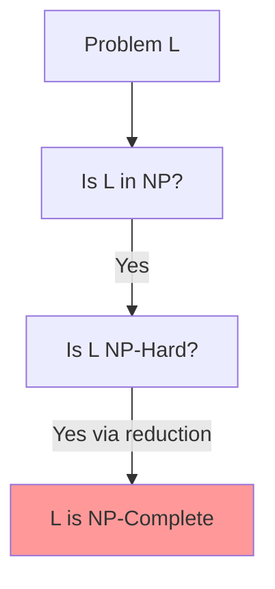
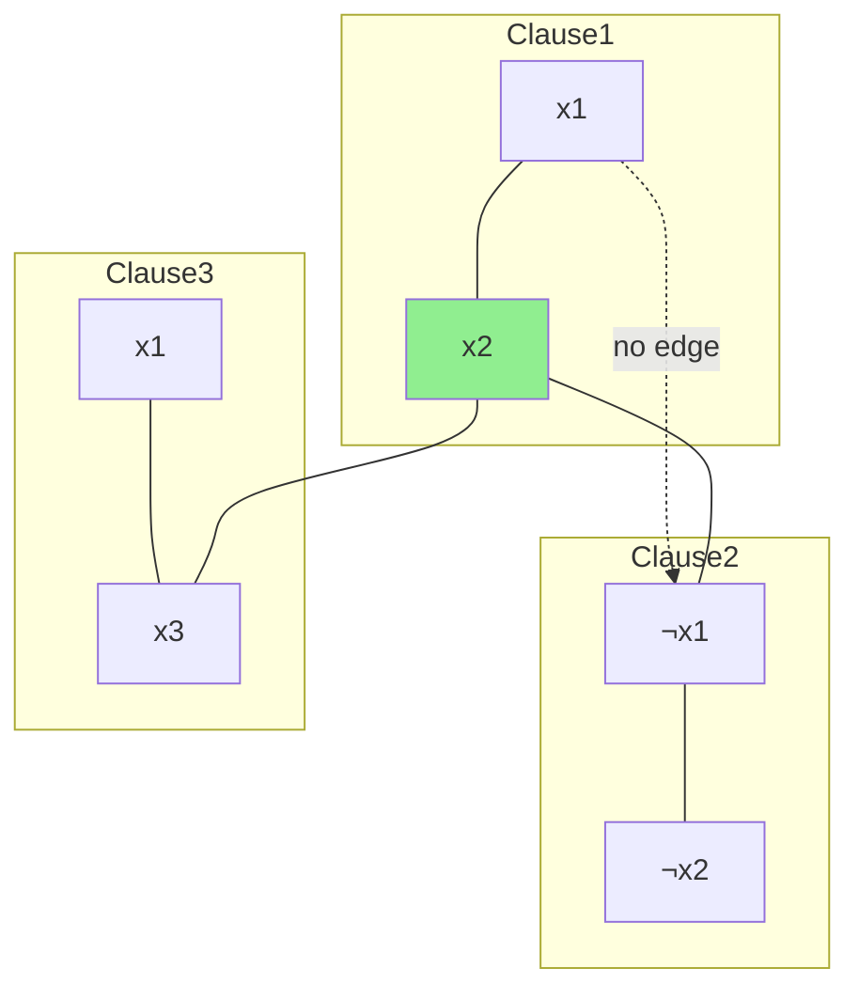
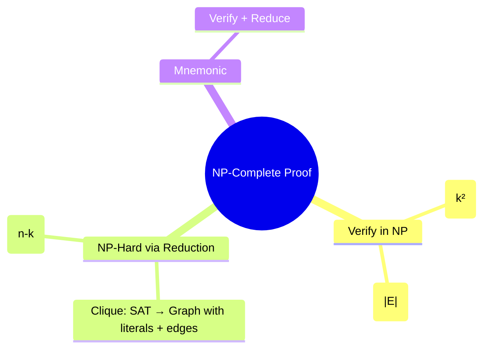

## **Module 5: NP-Completeness Proofs**  
**Reverse-Engineered Notes (Focus: Clique & Vertex Cover)**

These notes are crafted for **thorough understanding + long-term memorization**. We use **simple language**, **step-by-step structure**, **mnemonics**, **mindmaps (Mermaid)**, and **exam-style walkthroughs** for the exact practice questions from your syllabus.

### 1. General Template to Prove Any Problem is NP-Complete (Memorize This First!)

To prove a decision problem **L** is **NP-Complete**, you **MUST** show **two** things:

1. **L ∈ NP** (Solution is **verifiable** in polynomial time)  
2. **L is NP-Hard** (Some known NP-Complete problem reduces to L in polynomial time)

**Mnemonic (2-Step Rule):**  
**"Verify + Reduce"** → V&R  
- **V**erify → L is in NP  
- **R**educe → L is NP-Hard (use a known NPC problem like **SAT** or **CLIQUE**)

**Why this order?**  
First show it's "not too easy" (in NP), then show it's "very hard" (NP-Hard).

**Learning Tip:** Write "Verify + Reduce" at the top of every proof you practice.

---

### 2. Clique Problem – NP-Completeness Proof

**Definition (Simple):**  
A **clique** of size **k** in graph G=(V,E) is a subset V' ⊆ V with |V'| = k such that **every pair** of vertices in V' is connected by an edge (complete subgraph).

**Decision Version:**  
Given G and integer k, does G have a clique of size **at least k**?

#### Step-by-Step Proof (Exam-Ready)

**1. Clique ∈ NP (Verification in Poly Time)**  
- Given a candidate subset V' of size k.  
- Check: For **every pair** (u,v) in V', does edge (u,v) exist in G?  
- Number of pairs = O(k²) → Polynomial time (k ≤ n).  

**Mnemonic:** "Pair Check" → Just verify all pairs are friends.

**2. Clique is NP-Hard (Reduction from SAT)**  
We reduce **3-SAT** (or SAT) to Clique in polynomial time.

**How the Reduction Works (Visual + Simple):**  
- Take a 3-CNF formula with **m clauses**.  
- Create a graph with **one vertex per literal** in each clause.  
- **Rules for edges:**  
  - Connect two vertices **if** they are from **different clauses** AND they are **not negations** of each other.  
  - No edges inside same clause or between x and ¬x.  

- Then: The formula is **satisfiable** ⇔ The graph has a **clique of size m** (one literal per clause that can all be true together).

**Example from Notes (CNF: (x1 ∨ x2) ∧ (¬x1 ∨ ¬x2) ∧ (x1 ∨ x3))**  
- Build graph → Find clique {x2, ¬x1, x3} of size 3 → Assignment x1=0, x2=1, x3=1 makes formula true.

**Conclusion:**  
SAT ≤_p Clique (in poly time) → Clique is NP-Hard.  
Since Clique ∈ NP and NP-Hard → **Clique is NP-Complete**.

**Mnemonic for Reduction:** "Different Clause + Compatible Literal = Edge"  
(Compatible = not negation)

**Exam Tip (2022 Q19):** Always start with "To prove Clique is NP-Complete, show (1) Clique ∈ NP (2) Clique is NP-Hard by reducing SAT to Clique."

---

### 3. Vertex Cover Problem – NP-Completeness Proof

**Definition (Simple):**  
A **vertex cover** of graph G=(V,E) is a set S ⊆ V such that **every edge** has at least one endpoint in S.

**Decision Version:**  
Given G and integer k, does G have a vertex cover of size **at most k**?

#### Step-by-Step Proof

**1. Vertex Cover ∈ NP (Verification in Poly Time)**  
- Given a candidate set S of size ≤ k.  
- For **every edge** (u,v) in G, check if u ∈ S or v ∈ S.  
- Number of edges = O(|E|) → Polynomial time.

**Mnemonic:** "Edge Touch" → Every edge must be "touched" by at least one vertex in S.

**2. Vertex Cover is NP-Hard (Reduction from Clique)**  
We reduce **Clique** to **Vertex Cover** in polynomial time.

**Key Idea (Complement Graph):**  
- Given graph G with n vertices and we ask for clique of size **k**.  
- Construct **complement graph** Ḡ (edges where G does **not** have them).  
- Then: G has a clique of size k ⇔ Ḡ has a **vertex cover of size n - k**.

**Why?**  
- The vertices **not** in the clique must cover all the "missing edges" in the complement.  
- Vertices in clique have **all** edges between them → In complement, they have **no** edges between them.

**Construction:**  
- Take G, create Ḡ (poly time).  
- Set k' = n - k.  
- G has clique ≥ k ⇔ Ḡ has vertex cover ≤ k'.

**Example from Notes:**  
G with 6 vertices, max clique size 4 → Complement has vertex cover of size 2 (the 2 vertices outside the clique cover all non-edges).

**Conclusion:**  
Clique ≤_p Vertex Cover → Vertex Cover is NP-Hard.  
Since Vertex Cover ∈ NP → **Vertex Cover is NP-Complete**.

**Mnemonic for Reduction:** "Clique in G = Independent Set in Ḡ = (n - size) Vertex Cover in Ḡ"

**Exam Tip (2023/2024 Q20):** Mention "We reduce from Clique (already known NP-Complete) using the complement graph."

---

### 4. Quick Mindmap Summary (Draw This!)

