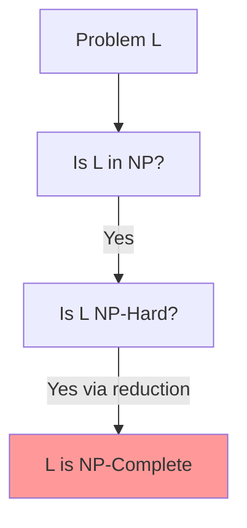
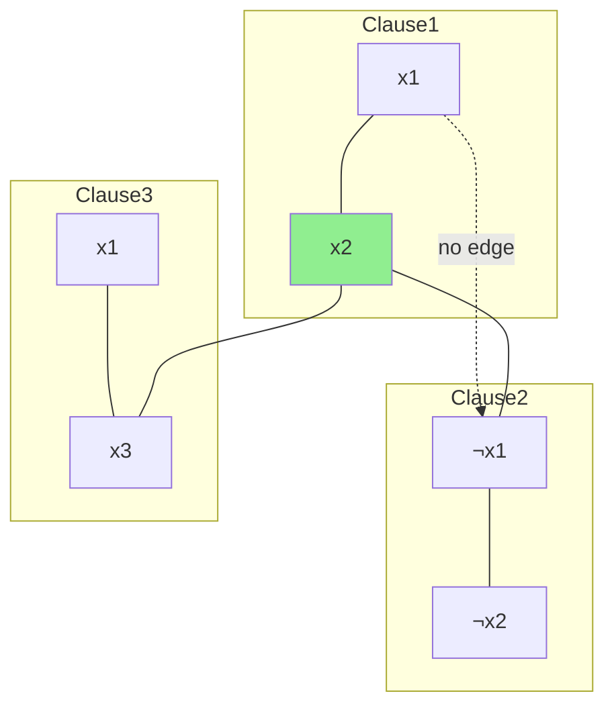
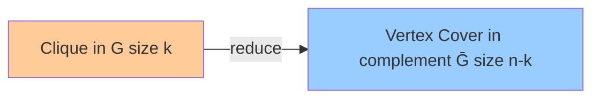
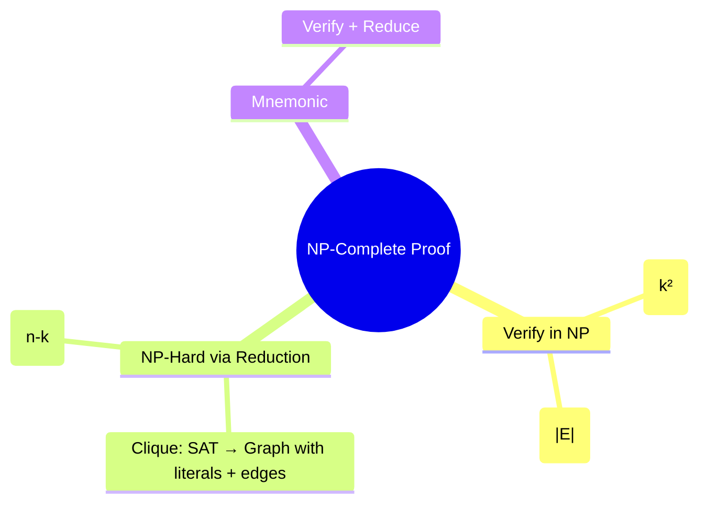
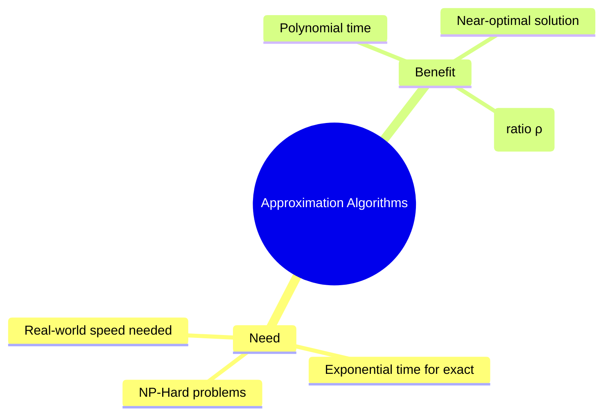
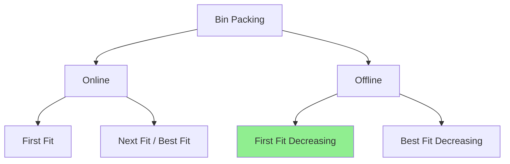
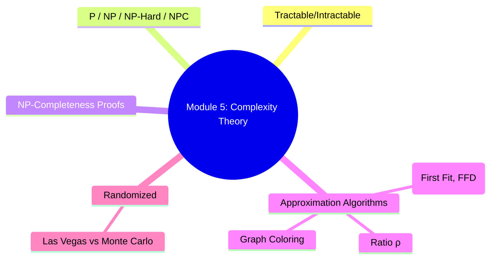

## **Module 5: NP-Completeness Proofs**  
**Reverse-Engineered Notes (Focus: Clique & Vertex Cover)**

These notes are crafted for **thorough understanding + long-term memorization**. We use **simple language**, **step-by-step structure**, **mnemonics**, **mindmaps (Mermaid)**, and **exam-style walkthroughs** for the exact practice questions from your syllabus.

### 1. General Template to Prove Any Problem is NP-Complete (Memorize This First!)

To prove a decision problem **L** is **NP-Complete**, you **MUST** show **two** things:

1. **L ∈ NP** (Solution is **verifiable** in polynomial time)  
2. **L is NP-Hard** (Some known NP-Complete problem reduces to L in polynomial time)

**Mnemonic (2-Step Rule):**  
**"Verify + Reduce"** → V&R  
- **V**erify → L is in NP  
- **R**educe → L is NP-Hard (use a known NPC problem like **SAT** or **CLIQUE**)

**Why this order?**  
First show it's "not too easy" (in NP), then show it's "very hard" (NP-Hard).

**Learning Tip:** Write "Verify + Reduce" at the top of every proof you practice.

---

### 2. Clique Problem – NP-Completeness Proof

**Definition (Simple):**  
A **clique** of size **k** in graph G=(V,E) is a subset V' ⊆ V with |V'| = k such that **every pair** of vertices in V' is connected by an edge (complete subgraph).

**Decision Version:**  
Given G and integer k, does G have a clique of size **at least k**?

#### Step-by-Step Proof (Exam-Ready)

**1. Clique ∈ NP (Verification in Poly Time)**  
- Given a candidate subset V' of size k.  
- Check: For **every pair** (u,v) in V', does edge (u,v) exist in G?  
- Number of pairs = O(k²) → Polynomial time (k ≤ n).  

**Mnemonic:** "Pair Check" → Just verify all pairs are friends.

**2. Clique is NP-Hard (Reduction from SAT)**  
We reduce **3-SAT** (or SAT) to Clique in polynomial time.

**How the Reduction Works (Visual + Simple):**  
- Take a 3-CNF formula with **m clauses**.  
- Create a graph with **one vertex per literal** in each clause.  
- **Rules for edges:**  
  - Connect two vertices **if** they are from **different clauses** AND they are **not negations** of each other.  
  - No edges inside same clause or between x and ¬x.  

- Then: The formula is **satisfiable** ⇔ The graph has a **clique of size m** (one literal per clause that can all be true together).

**Example from Notes (CNF: (x1 ∨ x2) ∧ (¬x1 ∨ ¬x2) ∧ (x1 ∨ x3))**  
- Build graph → Find clique {x2, ¬x1, x3} of size 3 → Assignment x1=0, x2=1, x3=1 makes formula true.

**Conclusion:**  
SAT ≤_p Clique (in poly time) → Clique is NP-Hard.  
Since Clique ∈ NP and NP-Hard → **Clique is NP-Complete**.

**Mnemonic for Reduction:** "Different Clause + Compatible Literal = Edge"  
(Compatible = not negation)

**Exam Tip (2022 Q19):** Always start with "To prove Clique is NP-Complete, show (1) Clique ∈ NP (2) Clique is NP-Hard by reducing SAT to Clique."

---

### 3. Vertex Cover Problem – NP-Completeness Proof

**Definition (Simple):**  
A **vertex cover** of graph G=(V,E) is a set S ⊆ V such that **every edge** has at least one endpoint in S.

**Decision Version:**  
Given G and integer k, does G have a vertex cover of size **at most k**?

#### Step-by-Step Proof

**1. Vertex Cover ∈ NP (Verification in Poly Time)**  
- Given a candidate set S of size ≤ k.  
- For **every edge** (u,v) in G, check if u ∈ S or v ∈ S.  
- Number of edges = O(|E|) → Polynomial time.

**Mnemonic:** "Edge Touch" → Every edge must be "touched" by at least one vertex in S.

**2. Vertex Cover is NP-Hard (Reduction from Clique)**  
We reduce **Clique** to **Vertex Cover** in polynomial time.

**Key Idea (Complement Graph):**  
- Given graph G with n vertices and we ask for clique of size **k**.  
- Construct **complement graph** Ḡ (edges where G does **not** have them).  
- Then: G has a clique of size k ⇔ Ḡ has a **vertex cover of size n - k**.

**Why?**  
- The vertices **not** in the clique must cover all the "missing edges" in the complement.  
- Vertices in clique have **all** edges between them → In complement, they have **no** edges between them.

**Construction:**  
- Take G, create Ḡ (poly time).  
- Set k' = n - k.  
- G has clique ≥ k ⇔ Ḡ has vertex cover ≤ k'.

**Example from Notes:**  
G with 6 vertices, max clique size 4 → Complement has vertex cover of size 2 (the 2 vertices outside the clique cover all non-edges).

**Conclusion:**  
Clique ≤_p Vertex Cover → Vertex Cover is NP-Hard.  
Since Vertex Cover ∈ NP → **Vertex Cover is NP-Complete**.

**Mnemonic for Reduction:** "Clique in G = Independent Set in Ḡ = (n - size) Vertex Cover in Ḡ"

**Exam Tip (2023/2024 Q20):** Mention "We reduce from Clique (already known NP-Complete) using the complement graph."

---

### 4. Quick Mindmap Summary (Draw This!)

## **Module 5: Approximation Algorithms**  
**Reverse-Engineered Notes (Simple + Thorough for Exam & Understanding)**

These notes cover **why we need approximation algorithms**, **approximation ratio**, **Bin Packing** (with First Fit & First Fit Decreasing), **Graph Coloring**, and **Las Vegas vs Monte Carlo** algorithms. Everything is in **clear points**, with **mnemonics**, **mindmaps**, and **Mermaid diagrams** to help you **learn fast and memorize permanently**.

### 1. Why Approximation Algorithms? (Need & Motivation)

NP-Hard problems (like Bin Packing, Graph Coloring, TSP) are **intractable** — no known polynomial-time algorithm gives the **optimal** solution for large inputs.

**Approximation Algorithms** come to the rescue:
- They run in **polynomial time**.
- They give a **near-optimal** (good enough) solution.
- They **do not guarantee** the best solution, but guarantee how close it is (via approximation ratio).

**Mnemonic:** "Approx = Almost Perfect in Poly time"  
(When exact is Explosive, use Almost-Perfect)

**Key Points:**
- Also called **heuristic algorithms**.
- Useful for real-world optimization where "good enough, fast" is better than "perfect but impossible".
- Goal: Come as close as possible to optimal in reasonable time.

**Mindmap:**

---

### 2. Approximation Ratio (ρ(n)) – The Quality Measure

**Definition:**  
For any input of size n, if C = cost of approximate solution and C* = cost of optimal solution, then the algorithm has **approximation ratio ρ(n)** if:  
**max(C / C*, C* / C) ≤ ρ(n)**

- ρ(n) = 1 → Perfect (optimal)  
- ρ(n) = 2 → Solution is at most **twice** as bad as optimal (or optimal is at most twice as good)  
- Smaller ρ(n) → Better approximation

**Mnemonic:** "Ratio ρ tells how much **Worse** (or **Better**) it can be"

**Advanced Concepts (From Practice Q):**
- **PTAS (Polynomial Time Approximation Scheme):** For any ε > 0, there is a (1+ε)-approximation algorithm that runs in polynomial time (time depends on ε).
- **FPTAS (Fully Polynomial Time Approximation Scheme):** PTAS where time is also polynomial in 1/ε (even better).

**Learning Tip:** Remember "ρ measures **relative error**" — draw the formula 3 times.

---

### 3. Bin Packing Problem (Core Example)

**Definition:**  
Given **n items** with different sizes/weights and **bins** each of capacity **c** (usually c=1), assign each item to a bin such that the **number of bins used is minimized**. All items have size ≤ c.

**Decision + Optimization:** Minimize total bins.

**Lower Bound (Quick Check):**  
Minimum bins ≥ **Ceil(Total Weight / Bin Capacity)**

**Mnemonic for Problem:** "Pack items into boxes without overflow — use as few boxes as possible."

#### Algorithms for Bin Packing

**Online Algorithms** (items come one by one, no future knowledge): Next Fit, First Fit, Best Fit, Worst Fit  
**Offline Algorithms** (all items known in advance — sort first): First Fit Decreasing, Best Fit Decreasing

##### 1. First Fit Strategy (Most Asked in Exams)

**Steps:**
1. Process items in the given order.
2. For each item, scan bins from the **first** one.
3. Place it in the **first** (earliest) bin that has enough remaining space.
4. If no bin fits, open a **new bin**.

**Example (Sizes: 0.5, 0.7, 0.5, 0.2, 0.4, 0.2, 0.5, 0.1, 0.6; c=1)**  
- Lower bound = 4 bins  
- First Fit uses **5 bins** (good but not optimal)

**Approximation Ratio:** **≤ 2** (uses at most twice the optimal number of bins in worst case). Often much better in practice.

**Mnemonic:** "First Fit = Greedy First Available Bin"

##### 2. First Fit Decreasing (Better Offline Version)

**Steps:**
1. **Sort** all items in **decreasing** order of size.
2. Then apply **First Fit** on the sorted list.

**Same Example:** After sorting → {0.7, 0.6, 0.5, 0.5, 0.5, 0.4, 0.2, 0.2, 0.1}  
- Uses only **4 bins** (matches optimal in this case).

**Advantage:** Sorting helps pack large items first → fewer wasted spaces.  
**Approximation Ratio:** Better than plain First Fit (often ≤ 1.7 in practice, though worst-case analysis is similar).

**Mnemonic:** "Big First → First Fit Decreasing = BFD (Better Fit Daily)"

**Visual Mindmap for Bin Packing Algorithms:**

**Practice Tip:** Always mention **Lower Bound** and compare number of bins used in your answer.

---

### 4. Graph Coloring Problem (Quick Overview)

**Definition:**  
Assign colors to vertices of a graph so that **no two adjacent vertices** have the **same color**.  
- Use **minimum** number of colors → **Chromatic number**.  
- k-coloring: Can we color with **at most k** colors?

**Types:** Vertex coloring, Edge coloring, Face coloring.

**Applications (Memorize with "TSRM"):**  
- **T**imetable scheduling  
- **S**udoku  
- **R**egister allocation in compilers  
- **M**ap coloring / Frequency assignment

**Exact Solution:** Backtracking (exponential time O(M^n)).  
Hence we need **approximation algorithms** for large graphs.

---

### 5. Randomized Algorithms: Las Vegas vs Monte Carlo (Compare – Very Common Question)

**Randomized Algorithm (General):** Uses random bits/numbers during execution. Output or runtime may vary on same input.

**Las Vegas Algorithms:**
- **Always correct** (produces exact right answer).
- Runtime is **random** (may be fast or slow depending on luck).
- Expected runtime is bounded (good on average).
- **Mnemonic:** "Las Vegas = Lucky but Always Wins the Jackpot" (correct, but time varies)

**Monte Carlo Algorithms:**
- **Fixed (usually fast) runtime**.
- May produce **wrong answer** with small probability.
- We can make error probability very low by running more times.
- **Mnemonic:** "Monte Carlo = Might be Wrong but Quick Gamble" (fast, probabilistic correctness)

**Comparison Table (Memorize This!)**

| Feature              | Las Vegas                          | Monte Carlo                        |
|----------------------|------------------------------------|------------------------------------|
| Correctness          | Always correct                     | May be incorrect (small prob.)     |
| Runtime              | Varies (random)                    | Usually fixed                      |
| Expected Time        | Bounded                            | Fixed                              |
| Use Case             | When correctness is must           | When speed matters, error tolerable|
| Example              | Randomized QuickSort               | Some primality tests               |

**Mnemonic Sentence:** "Las Vegas Always Wins, Monte Carlo Might Gamble Wrong."

---

**Overall Module 5 Connection Mindmap:**

