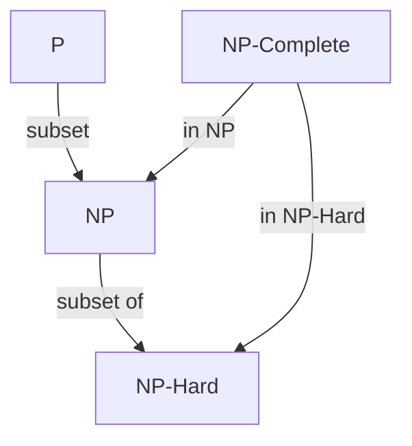

## **Module 5: Introduction to Complexity Theory**  
**Reverse-Engineered Notes (Tractable/Intractable Problems + Complexity Classes P, NP, NP-Hard)**

Here’s a **simple, thorough, point-wise breakdown** using **mnemonics, mindmap-style structure, and learning techniques** to help you **understand + memorize** easily. I’ll use **Mermaid diagrams** for visual clarity.

### 1. Tractable vs Intractable Problems (Core Foundation)

**Tractable (Easy) Problems**  
- Solvable by a **polynomial-time algorithm**  
- Time complexity: **O(n^k)** where **k** is a **constant** (e.g., O(n), O(n²), O(n³))  
- Runs in **reasonable time** even for large n  
- **Efficient** → Practical for real-world use  

**Mnemonic:** "Poly = Polite" → Polynomial time is **polite** (doesn't explode).

**Examples (Memorize with "SSM"):**  
- **S**orting (e.g., QuickSort average O(n log n))  
- **S**earching (Binary search O(log n))  
- **M**atrix multiplication (standard O(n³))

**Intractable (Hard) Problems**  
- **No** known polynomial-time algorithm  
- Usually require **exponential time** → O(k^n), O(n!), O(2^n)  
- Time explodes very fast → **Not practical** for large inputs  

**Mnemonic:** "Expo = Explosive" → Exponential time **explodes** like a bomb.

**Examples (Memorize with "TGSK"):**  
- **T**ower of Hanoi  
- **G**raph Coloring  
- **S**udoku (general case)  
- **K**napsack (0/1) / **T**SP (Travelling Salesman)

#### Quick Comparison Table (Memorize this)

| Feature              | Tractable (Easy)          | Intractable (Hard)             |
|----------------------|---------------------------|--------------------------------|
| Time Complexity      | O(n^k) — Polynomial       | O(k^n) or worse — Exponential  |
| Practical?           | Yes (reasonable time)     | No (explodes quickly)          |
| Examples             | Sorting, Searching        | TSP, Graph Coloring, Sudoku    |
| Mnemonic             | **Poly = Polite**         | **Expo = Explosive**           |

**Learning Tip:** Draw this table in your notebook 3 times while saying the mnemonic aloud.

---

### 2. Complexity Classes – P, NP, NP-Hard, NP-Complete

#### **P Class** (Polynomial time)
- Problems solvable in **polynomial time** by a **deterministic** algorithm  
- **Easy to solve** + **Easy to verify**  
- **P = Polynomial-time**  

**Mnemonic:** P = **Polite** (solvable politely in poly time)

#### **NP Class** (Non-deterministic Polynomial time)
- Problems whose **solution can be verified** in polynomial time  
- May be **hard to solve**, but **easy to check** if a given solution is correct  
- Includes **all P problems** (P ⊆ NP)  
- **NP = Non-deterministic Polynomial** (or "Nice Proof" – easy to verify proof/solution)

**Mnemonic:** NP = **"Not Proven"** yet solvable in poly time? (We can check answer quickly)

#### **P vs NP** (The Million-Dollar Question)
- **P ⊆ NP** always true  
- **Is P = NP?** → **Open problem** (widely believed **P ≠ NP**)  
- If P = NP → Every hard problem becomes easy!  
- If P ≠ NP → Some problems are **much harder to solve** than to verify

**Simple Analogy:**  
- **P** = You can **bake** the cake in reasonable time  
- **NP** = Someone gives you a cake; you can **check** if it's good in reasonable time (but baking might be hard)

#### **NP-Hard**
- **At least as hard** as the hardest problems in NP  
- **Every** problem in NP can be **polynomially reduced** to it  
- Not necessarily in NP itself  
- **Mnemonic:** NP-Hard = **"Nightmare Problem"** – hardest in NP family

#### **NP-Complete (NPC)**
- A problem is **NP-Complete** if:  
  1. It is in **NP** (solution verifiable in poly time)  
  2. It is **NP-Hard** (every NP problem reduces to it)  

- **All NP-Complete problems are NP-Hard**, but **not vice versa**  
- **Mnemonic:** NPC = **"Notoriously Popular Culprits"** (famous hard problems like Clique, Vertex Cover)

**Visual Relationship (Mindmap Style)**

---

### 3. Polynomial-Time Reduction (Key Tool for Proofs)

- If problem **A** can be transformed into problem **B** in **polynomial time**, we write **A ≤_p B**  
- Meaning: If we can solve B efficiently → we can solve A efficiently  
- Used to prove **NP-Hardness** and **NP-Completeness**

**Properties (Memorize):**
1. If A ≤_p B and B ∈ P → A ∈ P  
2. If A ≤_p B and A is NP-Hard → B is NP-Hard

---

### 4. Quick Summary Mindmap (Draw This!)

**Central Node:** Complexity Theory

**Branches:**
- **Tractable** → P Class → Examples: Sorting, Searching
- **Intractable** → NP, NP-Hard, NPC
- **P** = Solve in poly time
- **NP** = Verify in poly time
- **NP-Hard** = Hardest (reduction target)
- **NP-Complete** = NP + NP-Hard (Clique, Vertex Cover, SAT, etc.)

**Mnemonic Sentence for Classes:**  
**"Polite People Never Hate Complete Nightmares"**  
→ **P**olite **P**eople **N**ever **H**ate **C**omplete **N**ightmares  
(P → NP → NP-Hard → NP-Complete)

---

### 5. Practice Question Answers (From Your Skill)

**Q: Differentiate P and NP problems. Give one example each.**  
- **P:** Solvable in polynomial time (e.g., **Sorting**)  
- **NP:** Verifiable in polynomial time (e.g., **Clique** – given a set, easy to check if it's a clique)

**Q: What is a tractable problem? Give example.**  
A problem solvable in polynomial time O(n^k).  
Example: **Matrix Multiplication** (O(n³))

**Q: Define P, NP, and NP-Hard.**  
- **P:** Decision problems solvable by deterministic poly-time algorithm  
- **NP:** Decision problems verifiable in poly time (solution checkable quickly)  
- **NP-Hard:** Problems to which every NP problem reduces in poly time (at least as hard as hardest NP problems)
