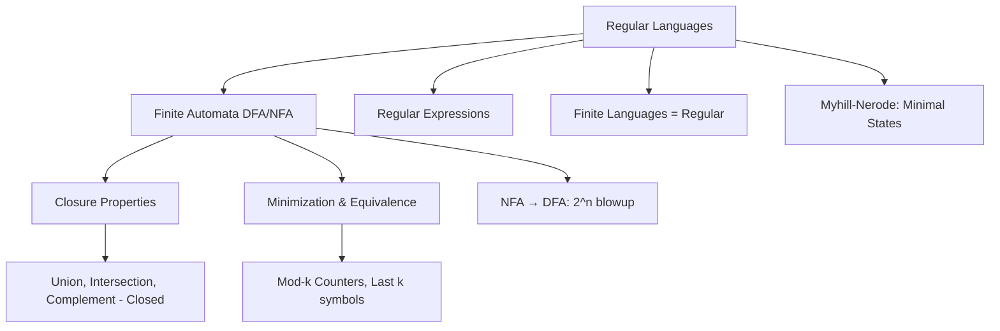
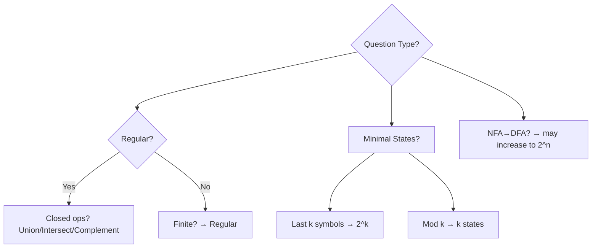
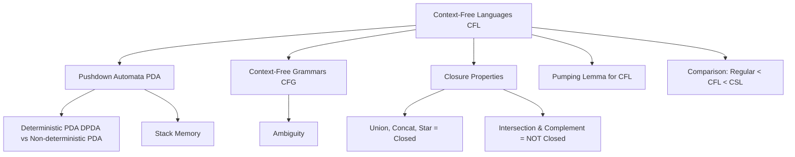
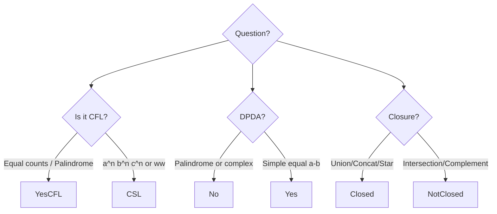
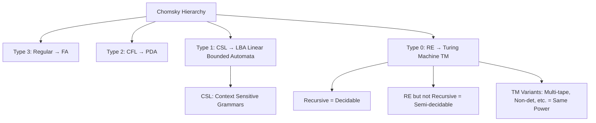
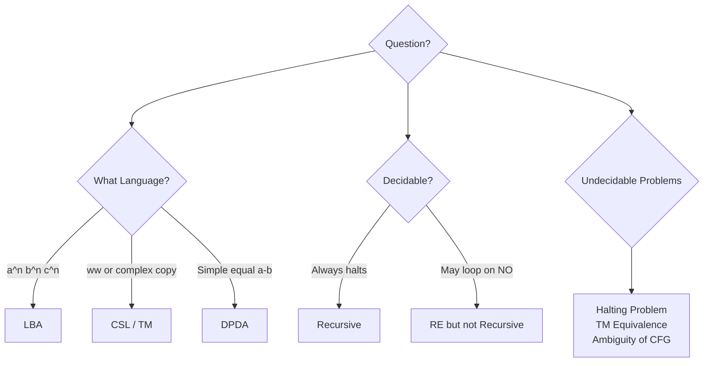

## **FLAT (Formal Languages and Automata Theory) – Chapter 1**  
**Finite Automata and Regular Sets**  
**Master Notes for MCQs** (Reverse-engineered from Kerala Notes sample questions)

### 1. Big Picture Mindmap (Mermaid)

**Mnemonic for Regular Language Power**: "Regular = Finite Memory" (no stack, only fixed states).

### 2. Core Concepts – Simple Breakdown

#### **Regular Sets Closure Properties** (Q01)
- **Closed under**:
  - Finite union
  - Finite intersection
  - Complement
  - Concatenation
  - Kleene star
- **Not closed under** infinite union generally.

**MCQ Tip**: "All of the above" often correct when finite operations mentioned.  
**Mnemonic**: **U**nion **I**ntersection **C**omplement = **UIC** (You I See – regular stays regular).

#### **NFA vs DFA** (Q02, Q05, Q08)
- NFA → DFA: **Number of states sometimes remains same, sometimes increases** (up to 2^n).
- Minimal DFA for "last two symbols same" (0+1)* → **5 states**.
- For "4th symbol from right is 1" → **16 states** (2^4) → exponential blowup example.

**Learning Technique**: Draw power set construction mentally.  
**Mnemonic**: NFA is **lazy** (guesses), DFA is **responsible** (tracks all possibilities).

#### **Finite Languages** (Q03)
- Every finite language **is regular**.
- Can be accepted by DFA (or NFA).

**Mnemonic**: "Finite = Regular" (no infinite patterns to remember).

#### **Minimal DFA States** (Myhill-Nerode Theorem)
- **Mod-k counter** (divisible by k): **k states**.
  - Example: Div by 3 → 3 states (Q07).
  - Div by 4 (binary) → 3? Wait, actually 4? Standard is number of remainders.
- Last k symbols specific → **2^k states**.
- Even number of 0s and 1s → **4 states** (Q Level2).

**Mnemonic Table**:
| Pattern                  | States     | Mnemonic          |
|--------------------------|------------|-------------------|
| Mod k                    | k          | Remainder tracker |
| k-th from right          | 2^k        | Memory of last k  |
| Even 0s & Even 1s        | 4          | (Even/Odd) x (Even/Odd) |

#### **Regular Expressions – Common Traps** (Q09, Q11, Q14, Q19)
- No two consecutive 1s: `(0+10)*(ε+0)` or similar.
- At least two consecutive 0s: `(0+1)*00(0+1)*`
- Not containing 000: `(0+01+001)*(ε+0+00)`

**Technique to verify RE**:
1. Generate small strings (0,1,00,01,10,11).
2. Check if language matches.
3. Use elimination.

**Mnemonic for No two 1s**: "1 must be followed by 0 or end" → `10*` pattern repeated.

#### **Non-Regular Examples** (Later chapters but hinted)
- {ww^R} → CFL, not regular.
- Pumping lemma questions appear indirectly.

### 3. Quick Decision Tree for MCQs

### 4. Key Solved Patterns from Document

**Q05**: Last two same → 5 states (states for last symbol + accept/reject pairs).  
**Q08**: 4th from right =1 → 16 states (memory of last 4 bits).  
**Q10**: Binary divisible by 4 → **3 states** (last 2 bits decide).  
**Q22**: Start 00 end 11 → `00(0+1)*11`.

### 5. Memorization Techniques

**Acronym for FA Types**:
- **D**eterministic FA → **D**ead sure path
- **N**on-deterministic → **N**o single path, guesses
- **M**inimal → **M**yhill-Nerode (distinguishable strings)

**Story Mnemonic**:
"Finite memory guy (DFA) can remember last few symbols or modulo. He can't count arbitrarily or match pairs (that's PDA)."

### 6. Practice Strategy for MCQs
1. **First pass**: Identify if regular (finite / mod / last k / simple RE).
2. **States question**: Ask "how much memory needed?"
3. **RE question**: Plug in ε, 0, 1, 01, 10 and eliminate.
4. **Closure**: Finite ops = safe for regular.
5. **Always draw small DFA** mentally for 3-4 states.

---

## **FLAT Module 2**  
**Chapter 2: Context-Free Languages & Pushdown Automata**  
**Master Notes for MCQs** (Reverse-engineered from Kerala Notes)

### 1. Big Picture Mindmap

**Core Idea (Simple Language)**:  
Regular languages = **Finite Memory** (DFA).  
CFL = **Finite Memory + One Stack** (PDA) → can match pairs, count in limited ways, palindromes, etc.

---

### 2. Key Concepts – Pointwise

#### **Closure Properties of CFL** (Very Important for MCQs)
- **Closed under**:
  - Union
  - Concatenation
  - Kleene Star
  - Homomorphism, Inverse Homomorphism
  - Substitution
- **NOT Closed under**:
  - Intersection
  - Complement
  - Difference

**Mnemonic**: CFL loves **UCS** (Union, Concat, Star) but hates **IC** (Intersection, Complement).

**MCQ Tip**: If question says "intersection of two CFLs" → answer is **may be CFL** or **CSL**, not always CFL.

#### **DPDA vs PDA** (Most Confusing Topic)
| Feature                  | PDA (Nondeterministic)      | DPDA (Deterministic)       |
|--------------------------|-----------------------------|----------------------------|
| Power                    | Accepts all CFLs            | Accepts only **DCFLs** (proper subset) |
| Palindromes {ww^R}       | Yes                         | No                         |
| {a^n b^n}                | Yes                         | Yes                        |
| Ambiguity                | Can handle                  | More restricted            |

**Mnemonic**: PDA = **Playful** (can guess), DPDA = **Disciplined** (no choice, deterministic).

**Key Examples**:
- {ww^R} → CFL but **not DCFL**
- Language of palindromes over {a,b} → not DCFL

#### **Pumping Lemma for CFL** (For proving NOT CFL)
If L is CFL, then there exists p (pumping length) such that any string s ∈ L with |s| ≥ p can be divided as **s = uvxyz** where:
- |vxy| ≤ p
- |vy| ≥ 1
- For all i ≥ 0, uv^i x y^i z ∈ L

**Simple Trick**: Use **a^n b^n c^n** or **{ww}** to prove not CFL.

---

### 3. Grammar & Language Identification

**Common Languages & Their Types**:

| Language                          | Type          | Accepted by          | Mnemonic                     |
|-----------------------------------|---------------|----------------------|------------------------------|
| {a^n b^n | n≥0}                   | DCFL          | DPDA                     | Equal count a-b             |
| {ww^R | w ∈ {a,b}*}               | CFL (not DCFL)| PDA                      | Mirror / Palindrome         |
| {a^n b^n c^n | n≥0}               | CSL (not CFL) | LBA                      | Three equal counts          |
| {a^i b^j c^k | i<j<k}             | Not CFL       | -                        | Pumping kills it            |
| ww (copy without reverse)         | CSL           | -                        | Hardest among common        |

**From Document (Q03, Q15, Q16)**:
- L1 = {1^n 0^{n-1} 0^n} → **CSL** (not CFL)
- L2 = {a^n b^k | n ≤ k ≤ 2n} → **CFL**
- {ww | w ∈ Σ*} → **CSL, not CFL**

---

### 4. Pushdown Automata Models
- Two equivalent acceptance methods:
  1. **By Final State**
  2. **By Empty Stack**

**Mnemonic**: PDA can "accept by reaching happy state" or "accept by emptying its memory stack".

**Important Fact**:
- Every CFL has a PDA.
- Not every CFL has a **DPDA**.

---

### 5. Ambiguity & Normal Forms
- **Inherently Ambiguous** Language: No unambiguous grammar exists.
  - Example: {a^n b^n c^m} ∪ {a^n b^m c^m} is inherently ambiguous.

**Normal Forms**:
- **Chomsky Normal Form (CNF)**: A → BC or A → a
- **Greibach Normal Form (GNF)**: A → aα (starts with terminal)

**Mnemonic for CNF**: "Clean Normal Form" → Binary or Terminal.

---

### 6. Decision Tree for MCQ Answering

---

### 7. Direct Solutions from Document (Key Questions)

**Q01**: Intersection of two CFLs → **may be CFL** (b) or **always CSL** (d)  
**Q02**: Union of CFLs = CFL (True). Complement of CFL = CSL (True)  
**Q07**: Palindromes {wcw^R} and {ww^R} → **not accepted by DPDA**  
**Q17**: L1 = {a^n b^{2n}}, L2 = {a^n b^{2n}} → Union may not be DCFL  
**Q18**: Inherently ambiguous examples appear.

---

### 8. Memorization Techniques

**Acronym: PCUG**  
**P**umping Lemma → prove **not** CFL  
**C**losure → UCS yes, IC no  
**U**nion & **G**rammar → CFL power  
**G** → Greibach / Chomsky

**Story Mnemonic**:  
"Regular guy has only pockets (finite states). CFL guy has one backpack (stack) — he can match left and right things, but struggles when there are three things to match or copy exactly."

---

**Module 2 Complete!** ✅

**Quick Self-Test** (Try answering):
1. Is intersection of two CFLs always CFL?  
2. Can DPDA accept all palindromes?  
3. Is {a^n b^n c^n} CFL or CSL?

## **FLAT Module 3**  
**Chapter 3: Turing Machines, Modifications, Context-Sensitive Languages (CSL), Recursive & Recursively Enumerable (R.E.) Sets**  
**Master Notes for MCQs**

### 1. Big Picture Mindmap

**Core Idea (Simple Analogy)**:  
- FA = Pocket calculator (limited memory)  
- PDA = Calculator + one notebook (stack)  
- **LBA** = Calculator with notebook of size proportional to input  
- **TM** = Unlimited notebook + can move left/right → most powerful

---

### 2. Chomsky Hierarchy – Quick Recall Table

| Type | Language       | Grammar                  | Machine              | Key Properties                  |
|------|----------------|--------------------------|----------------------|---------------------------------|
| 0    | RE             | Unrestricted             | Turing Machine       | Semi-decidable (may loop)      |
| 1    | CSL            | Context-Sensitive        | Linear Bounded Automata (LBA) | Decidable                      |
| 2    | CFL            | Context-Free             | Pushdown Automata    | Not closed under intersection  |
| 3    | Regular        | Regular                  | Finite Automata      | Closed under many ops          |

**Mnemonic**: **3-2-1-0** → Regular → CFL → CSL → RE (power increases as number decreases).

---

### 3. Key Concepts – Pointwise

#### **Turing Machine Basics**
- TM can simulate any algorithm.
- **Recursive** (Decidable): TM always halts (yes/no answer).
- **Recursively Enumerable (RE)**: TM halts on yes instances, may loop on no.
- **RE but not Recursive**: Halting problem, Post Correspondence Problem (PCP), etc.

**Mnemonic**: Recursive = **Reliable** (always stops). RE = **Optimistic** (may never come back).

#### **Power of Variants** (Common MCQ)
- Multi-tape TM = Same power as single-tape TM.
- Non-deterministic TM = Same power as deterministic TM.
- 2-stack PDA = Equivalent to TM.
- LBA = Accepts CSL.

**From Document**: Palindromes need PDA, but complex matching needs TM.

#### **Closure Properties**
- **RE sets**: Closed under Union, Concat, Star, Intersection.
- **Recursive sets**: Closed under Complement also.
- CFLs are properly inside CSL which are inside RE.

**Mnemonic for Closure**: RE is very friendly (almost all ops closed). Recursive is even better (adds complement).

#### **Undecidability** (High-weight MCQs)
- Halting problem is **undecidable**.
- Equivalence of two TMs is undecidable.
- Emptiness, finiteness for TM — many are undecidable.
- Intersection of two DCFLs can encode TM computations → undecidable.

**Simple Trick**: If a problem reduces to "Does TM halt on input?" → **Undecidable**.

---

### 4. Decision Tree for MCQ Answering (Turing Machine Questions)

---

### 5. Important Languages & Their Classes (From Document)

- {a^n b^n c^n} → **CSL** (not CFL)
- {ww | w ∈ {a,b}*} → **CSL** (not CFL)
- Valid computations of TM → **CSL**
- Halting problem → **RE but not Recursive**

---

### 6. Key Solved Patterns from Document

**Q01 (Ch3)**: To evaluate certain languages → needs **Turing Machine** (stack not enough).  
**Power Comparisons**: 2-stack PDA ≈ TM.  
**LBA**: Accepts CSL.  
**TM Modifications**: Multi-tape, non-det, etc., have same power.

**Common Ordering Questions** (e.g., power order):
- DPDA < PDA < LBA < TM

---

### 7. Memorization Techniques

**Hierarchy Mnemonic**: **"Regularly Cool Freshers Love Tasty Mangoes"**  
→ Regular → CFL → CSL → RE (Type 3 to 0)

**TM vs Others**:
- "If it needs to go back and forth or use unlimited space → TM"
- "If input size bounds the memory → LBA (CSL)"

**Undecidability Mnemonic**: **"HE is Undecidable"** → **H**alting, **E**quivalence.

---
