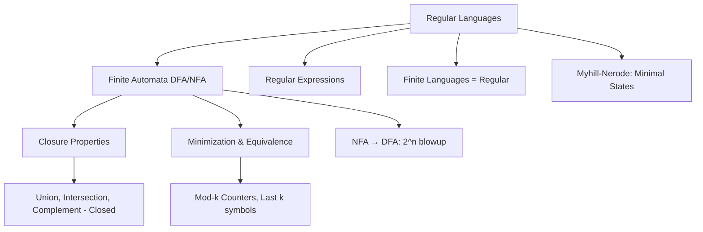
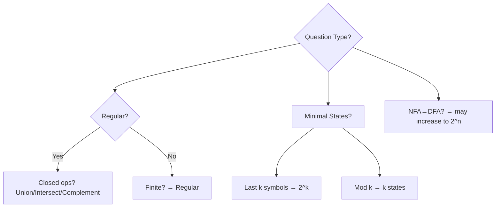

## **FLAT (Formal Languages and Automata Theory) – Chapter 1**  
**Finite Automata and Regular Sets**  
**Master Notes for MCQs** (Reverse-engineered from Kerala Notes sample questions)

### 1. Big Picture Mindmap (Mermaid)

**Mnemonic for Regular Language Power**: "Regular = Finite Memory" (no stack, only fixed states).

### 2. Core Concepts – Simple Breakdown

#### **Regular Sets Closure Properties** (Q01)
- **Closed under**:
  - Finite union
  - Finite intersection
  - Complement
  - Concatenation
  - Kleene star
- **Not closed under** infinite union generally.

**MCQ Tip**: "All of the above" often correct when finite operations mentioned.  
**Mnemonic**: **U**nion **I**ntersection **C**omplement = **UIC** (You I See – regular stays regular).

#### **NFA vs DFA** (Q02, Q05, Q08)
- NFA → DFA: **Number of states sometimes remains same, sometimes increases** (up to 2^n).
- Minimal DFA for "last two symbols same" (0+1)* → **5 states**.
- For "4th symbol from right is 1" → **16 states** (2^4) → exponential blowup example.

**Learning Technique**: Draw power set construction mentally.  
**Mnemonic**: NFA is **lazy** (guesses), DFA is **responsible** (tracks all possibilities).

#### **Finite Languages** (Q03)
- Every finite language **is regular**.
- Can be accepted by DFA (or NFA).

**Mnemonic**: "Finite = Regular" (no infinite patterns to remember).

#### **Minimal DFA States** (Myhill-Nerode Theorem)
- **Mod-k counter** (divisible by k): **k states**.
  - Example: Div by 3 → 3 states (Q07).
  - Div by 4 (binary) → 3? Wait, actually 4? Standard is number of remainders.
- Last k symbols specific → **2^k states**.
- Even number of 0s and 1s → **4 states** (Q Level2).

**Mnemonic Table**:
| Pattern                  | States     | Mnemonic          |
|--------------------------|------------|-------------------|
| Mod k                    | k          | Remainder tracker |
| k-th from right          | 2^k        | Memory of last k  |
| Even 0s & Even 1s        | 4          | (Even/Odd) x (Even/Odd) |

#### **Regular Expressions – Common Traps** (Q09, Q11, Q14, Q19)
- No two consecutive 1s: `(0+10)*(ε+0)` or similar.
- At least two consecutive 0s: `(0+1)*00(0+1)*`
- Not containing 000: `(0+01+001)*(ε+0+00)`

**Technique to verify RE**:
1. Generate small strings (0,1,00,01,10,11).
2. Check if language matches.
3. Use elimination.

**Mnemonic for No two 1s**: "1 must be followed by 0 or end" → `10*` pattern repeated.

#### **Non-Regular Examples** (Later chapters but hinted)
- {ww^R} → CFL, not regular.
- Pumping lemma questions appear indirectly.

### 3. Quick Decision Tree for MCQs

### 4. Key Solved Patterns from Document

**Q05**: Last two same → 5 states (states for last symbol + accept/reject pairs).  
**Q08**: 4th from right =1 → 16 states (memory of last 4 bits).  
**Q10**: Binary divisible by 4 → **3 states** (last 2 bits decide).  
**Q22**: Start 00 end 11 → `00(0+1)*11`.

### 5. Memorization Techniques

**Acronym for FA Types**:
- **D**eterministic FA → **D**ead sure path
- **N**on-deterministic → **N**o single path, guesses
- **M**inimal → **M**yhill-Nerode (distinguishable strings)

**Story Mnemonic**:
"Finite memory guy (DFA) can remember last few symbols or modulo. He can't count arbitrarily or match pairs (that's PDA)."

### 6. Practice Strategy for MCQs
1. **First pass**: Identify if regular (finite / mod / last k / simple RE).
2. **States question**: Ask "how much memory needed?"
3. **RE question**: Plug in ε, 0, 1, 01, 10 and eliminate.
4. **Closure**: Finite ops = safe for regular.
5. **Always draw small DFA** mentally for 3-4 states.

---

