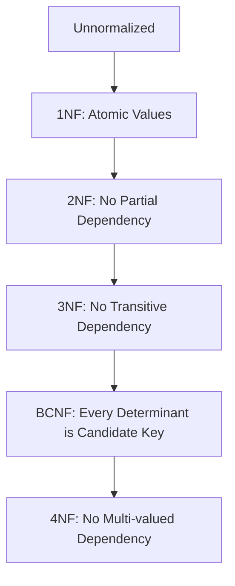
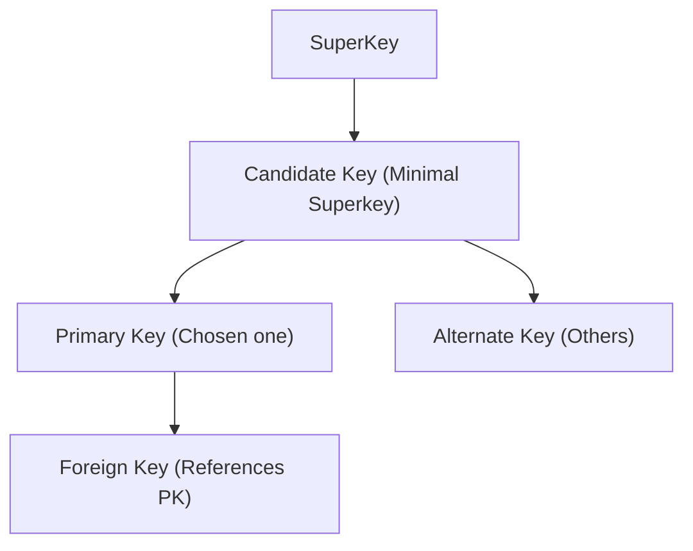

**DBMS Normalization & Keys Cheatsheet** (Reverse-Engineered from the PDF)

### 1. Why Normalization? (Core Purpose)
- **Goal**: Eliminate data redundancies and inconsistencies caused by **modification anomalies** (Insert, Update, Delete problems).
- Focus of 1NF–BCNF: Remove redundancies due to **bad Functional Dependencies (FDs)**.
- Higher forms (4NF+): Handle other redundancies (e.g., multi-valued).

**Hierarchy Mnemonic**: **1 < 2 < 3 < BCNF** (Each level builds on the previous).



### 2. Normal Forms – Simple Breakdown

| Normal Form | Condition | What it Eliminates | Mnemonic |
|-------------|-----------|--------------------|----------|
| **1NF** | All attributes have **single atomic (indivisible)** values. No multi-valued or composite attributes. | Repeating groups, non-atomic data | "One value per cell" |
| **2NF** | Must be in 1NF + No **partial dependency** (non-prime attributes fully dependent on entire candidate key, not a part of it). | Partial dependency on composite keys | "Full key dependency" |
| **3NF** | Must be in 2NF + No **transitive dependency** (non-prime attributes depend only on candidate keys). | Transitive dependency (A→B→C) | "Direct dependency only" |
| **BCNF** (Stronger 3NF) | For every non-trivial FD **X → A**, **X must be a superkey** (candidate key). | All anomalies from FDs | "Determinant = Key" |
| **4NF** | In BCNF + No **multi-valued dependency** (independent multi-values). | Multi-valued facts | "One fact per row" |

**Key Definitions**:
- **Non-prime attribute**: Not part of any candidate key.
- **Transitive Dependency**: X → Z → Y (Z is not a key).
- **Determinant**: Left side of FD (X in X → Y).

### 3. Keys – Hierarchy & Rules



- **Super Key**: Set of attributes that uniquely identifies a tuple (can have extra attributes).
- **Candidate Key**: **Minimal** super key (no redundant attributes). Cannot be NULL.
- **Primary Key (PK)**: One chosen candidate key. Uniquely identifies rows. No NULL, no duplicates.
- **Alternate Key**: Candidate keys not chosen as PK.
- **Foreign Key (FK)**: Attribute(s) that reference PK of another table → establishes **Parent-Child** relationship.

**Mnemonic for Keys**: "Super → Candidate (Minimal) → Primary (Chosen) → Foreign (Link)".

### 4. Functional Dependencies (FDs) – Foundation

**Definition**: X → Y means values of X **uniquely determine** values of Y.
- Left side (X): Determinant.
- Right side (Y): Dependent.
- Trivial FD: Y is subset of X.

**Closure (X⁺)**: All attributes determined by X (including itself). Important for finding keys.

**Example from PDF (QUE3)**: Relation with tuples:
- (1,4,2), (1,5,3), (1,6,3), (3,2,2)
- Correct: **b) YZ → X and Y → Z** (verified by checking consistency).

### 5. Learning Techniques & Mnemonics

**Story Mnemonic for Normal Forms**:
- 1NF: "Atomic family – everyone has one clear identity."
- 2NF: "No partial love – whole family (key) must decide."
- 3NF: "No middlemen (transitive) – direct talk only."
- BCNF: "Boss (determinant) must be a full leader (candidate key)."

**Practice Technique**:
1. Write table → Find all FDs.
2. Find candidate keys (attributes that determine all others).
3. Check violations step-by-step (1NF → 2NF → ...).
4. Decompose if needed.

**Mind Map Structure** (Text version):
```
Normalization
├── Purpose: No redundancy/anomalies
├── FDs → Violations
│   ├── Partial → 2NF
│   └── Transitive → 3NF
├── Keys
│   ├── Candidate = Minimal Superkey
│   └── PK + FK = Relationships
└── 4NF: No Multi-valued Dep.
```

### 6. Quick MCQ Answers from Document (with Reasoning)

- **QUE1**: 3NF is based on **transitive dependency** → **c**.
- **QUE2**: Minimal super key → **Candidate Key** → **b**.
- **QUE2-A**: Role of PK → **Uniquely identify record** → **A**.
- **QUE2-B**: PK + FK → **Parent-Child** → **a (i)**.
- **QUE2-C**: Required for FK → **Primary Key** → **b**.
- **QUE2-D**: Characteristic of FK → **Establishes relationship** → **b**.
- **QUE4**: BCNF → X is superkey (includes candidate keys) → **C (i,ii,iv)**.
- **QUE5**: Every BCNF is in 3NF → **c**.
- **QUE6**: Minimal key for given FDs → **D (UY)** (as per highlighted answer).
- **QUE8**: Highest NF → Often **3NF** (check for BCNF violation).

### 7. Common Pitfalls & Tips
- A relation in BCNF is **always** in 3NF, but not vice versa.
- Partial dependency needs **composite** candidate key.
- To find candidate keys: Compute closures of attribute sets.
- Always ensure atomic values first (1NF).

**Memorization Hack**: Repeat "1-Atomic, 2-Full, 3-Direct, BCNF-Boss" daily.

Use this cheatsheet for quick revision. Practice by taking sample relations, finding FDs, normalizing step-by-step, and drawing your own Mermaid diagrams. Want me to expand on any section (e.g., full example decomposition or more MCQs)? Let me know!
