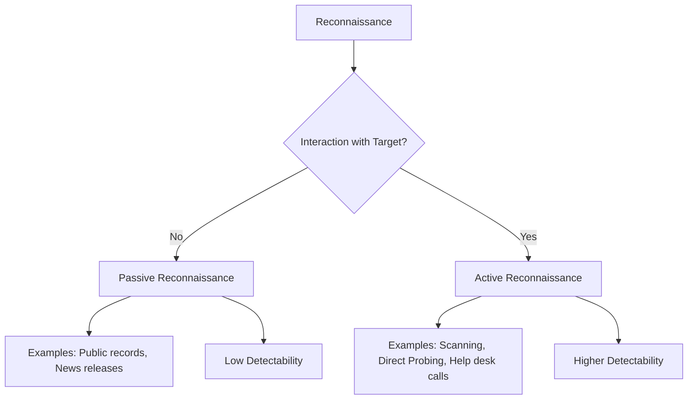
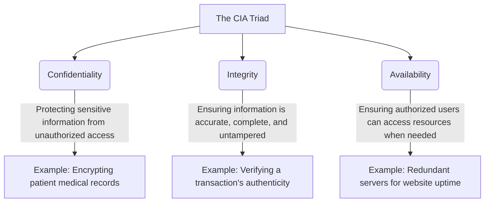
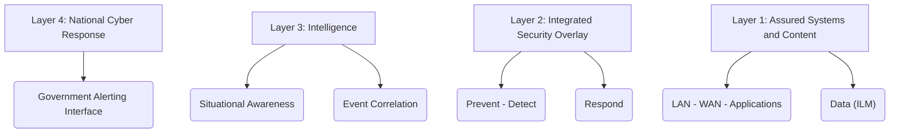

### 1. Guidelines for Ethical Hackers to Keep Their Test Plans Legal

Ethical hackers must follow these guidelines to ensure their test plans remain legal:

*   **Get Permission:** Always obtain written authorization from the system owner before starting any ethical hacking activities. This authorization should clearly define the scope of work and what the hacker can and cannot do.
*   **Follow Industry Standards:** Utilize recognized frameworks and methodologies for penetration testing, such as OWASP, PTES, and NIST SP 800-115.
*   **Respect Privacy:** Do not access, use, or disclose any information obtained during the test without proper authorization.
*   **Comply with Laws:** Ensure all activities comply with laws and regulations regarding data privacy, computer misuse, and unauthorized access.
*   **Be Professional:** Maintain integrity, honesty, and transparency throughout the process.
*   **Protect Findings:** Keep findings confidential and only share them with the owning organization.
*   **Document the Test:** Prepare a formal report of vulnerabilities and other findings, including recommendations for improving security.

**Mnemonic for Legal Ethical Hacking (PG FRCD):**
*   **P**ermission (Get written authorization)
*   **G**uidelines (Follow industry standards)
*   **F**indings (Protect findings)
*   **R**espect (Respect privacy)
*   **C**omply (Comply with laws)
*   **D**ocument (Document the test)

### 2. What is Hacking? Explain the Different Types of Hackers.

**What is Hacking?**
Hacking refers to exploiting system vulnerabilities and compromising security controls to gain unauthorized or inappropriate access to system resources. It is a form of planning or a technique used by people to gain access to various unauthorized systems, software, and devices. In simpler terms, it's the process of gaining access to a computer or network that might not be legal or permitted for any random user. People skilled in hacking have extensive knowledge of computer systems, software, and hardware.

**Types of Hackers:**
Hackers are broadly categorized into different types based on their intent and actions:

1.  **Black Hat Hackers:** These hackers have malicious intent and gain unauthorized access to computer systems and networks.
2.  **White Hat Hackers:** Also known as security researchers, they help organizations improve cybersecurity by identifying weaknesses with permission. They are often employed to test and improve security systems.
3.  **Gray Hat Hackers:** These hackers may sometimes violate laws or ethical standards but are not necessarily malicious.
4.  **Red Hat Hackers:** These are ethical hackers who use their skills to protect systems and networks from malicious attacks.
5.  **Blue Hat Hackers:** Experts who focus on penetration tests and malware analysis.
6.  **Script Kiddies:** Amateur hackers who download tools or use hacking codes written by others, often to impress friends or gain attention.
7.  **Green Hat Hackers:** Novices or beginners in hacking and cybersecurity whose intent is usually not malicious.
8.  **Hacktivists:** Hackers who gain unauthorized access to websites to raise awareness of political, religious, or social issues.

**Mnemonic for Types of Hackers (BWG RBS GH):**
*   **B**lack Hat
*   **W**hite Hat
*   **G**ray Hat
*   **R**ed Hat
*   **B**lue Hat
*   **S**cript Kiddies
*   **G**reen Hat
*   **H**acktivists

### 3. Differentiate Between Active Reconnaissance and Passive Reconnaissance.

Reconnaissance, also known as footprinting, is the initial phase of gathering preliminary data or intelligence about a target organization to plan an attack.

| Feature           | Passive Reconnaissance                                                                                                                                                                                                     | Active Reconnaissance                                                                                                                                                                                                                                                                                                                       |
| :---------------- | :------------------------------------------------------------------------------------------------------------------------------------------------------------------------------------------------------------------------- | :------------------------------------------------------------------------------------------------------------------------------------------------------------------------------------------------------------------------------------------------------------------------------------------------------------------------------------------ |
| **Definition**    | Involves acquiring information without directly interacting with the target. This is considered a passive information gathering step.                                                                  | Involves interacting with the target directly by any means. This is an active step of attempting to connect to systems to elicit a response.                                                                                                                                                                                |
| **Interaction**   | No direct interaction with the target system.                                                                                                                                                                   | Direct interaction with the target system.                                                                                                                                                                                                                                                                                       |
| **Detectability** | Less likely to be detected as it doesn't involve direct engagement.                                                                                                                                                        | More likely to be detected as it involves active probing (e.g., injecting packets, scanning). Many organizations use intrusion detection systems (IDS) to detect this type of activity.                                                                                                                                        |
| **Examples**      | Searching public records or news releases.                                                                                                                                                                      | Telephone calls to the help desk or technical department. Using scanning tools like Nmap to map open ports and applications, grabbing banners, and checking for down-level software with known vulnerabilities. Using dialers, port scanners, network mappers, ping tools, vulnerability scanners. |
| **Information**   | Focuses on publicly available information to build a profile of the target.                                                                                                                                                | Gathers more in-depth information such as open shares, user account information, live machines, port status, OS details, device type, and system uptime.                                                                                                                                                                      |
| **Purpose**       | Understand the target's public-facing presence and gather initial intelligence.                                                                                                                                           | Identify network and system weaknesses, specific vulnerabilities, and detailed system configurations.                                                                                                                                                                                                                            |

### 4. Which are the Objectives, Advantages, and Disadvantages of Security Testing?

**Objectives of Security Testing:**
The main goals and objectives of security testing are to:

*   **Identify Threats:** To identify the threats present in the system.
*   **Measure Vulnerabilities:** To measure the potential vulnerabilities of the system.
*   **Detect Security Risks:** To help in detecting every possible security risk within the system.
*   **Fix Problems:** To help developers fix security problems through coding.
*   **Identify Vulnerabilities:** Helps identify vulnerabilities like weak passwords, unpatched software, and misconfigured systems.
*   **Evaluate Resistance:** Evaluates the system's ability to withstand various attacks (network, social engineering, application-level).
*   **Ensure Compliance:** Helps ensure the system meets relevant security standards and regulations (e.g., HIPAA, PCI DSS, SOC2).
*   **Provide Assessment:** Provides a comprehensive security assessment of the system's security posture.
*   **Prepare for Incidents:** Helps organizations understand risks and vulnerabilities to prepare for and respond to security incidents.
*   **Fix Before Deployment:** Identifies and fixes potential security issues before deployment to production, reducing risk.

**Mnemonic for Security Testing Objectives (TVR FIVES PPF):**
*   **T**hreats (Identify)
*   **V**ulnerabilities (Measure)
*   **R**isks (Detect)
*   **F**ix (Fix problems)
*   **I**dentify (Identify vulnerabilities)
*   **V**aluate (Evaluate resistance)
*   **E**nsure (Ensure compliance)
*   **S**ecurity (Provide assessment)
*   **P**repare (Prepare for incidents)
*   **P**roduction (Fix before deployment)

**Advantages of Security Testing:**
Security testing offers several benefits:

*   **Identifying Vulnerabilities:** Helps identify exploitable weaknesses such as weak passwords, unpatched software, and misconfigured systems.
*   **Improving System Security:** Enhances overall system security by identifying and fixing vulnerabilities and potential threats.
*   **Ensuring Compliance:** Guarantees the system adheres to relevant security standards and regulations like HIPAA, PCI DSS, and SOC2.
*   **Reducing Risk:** Lowers the risk of security incidents by fixing vulnerabilities before deployment.
*   **Improving Incident Response:** Helps organizations understand potential risks, enabling better preparation and response to security incidents.

**Mnemonic for Advantages (I ICE R):**
*   **I**dentifying vulnerabilities
*   **I**mproving system security
*   **E**nsuring compliance
*   **R**educing risk
*   **I**mproving incident response

**Disadvantages of Security Testing:**
Despite its benefits, security testing has some drawbacks:

*   **Resource-intensive:** Requires significant hardware and software resources to simulate various attacks.
*   **Complexity:** Can be complex, demanding specialized knowledge and expertise to set up and execute effectively.
*   **Limited Testing Scope:** May not identify all types of vulnerabilities and threats.
*   **False Positives and Negatives:** Can produce inaccurate results, leading to confusion and wasted effort.
*   **Time-consuming:** Can be time-consuming, especially for large and complex systems.
*   **Difficulty in Simulating Real-World Attacks:** It's challenging to accurately simulate real-world attacks and predict attacker interaction.

**Mnemonic for Disadvantages (RC LFT D):**
*   **R**esource-intensive
*   **C**omplexity
*   **L**imited testing scope
*   **F**alse positives and negatives
*   **T**ime-consuming
*   **D**ifficulty in simulating real-world attacks

### 5. Compare and Contrast Hackers and Crackers.

The primary difference between hackers and crackers lies in their intent and the legality/ethics of their actions.

| Parameter           | Hackers                                                                                                                                                                                                                                                                                             | Crackers                                                                                                                                                                                                                                                                                            |
| :------------------ | :-------------------------------------------------------------------------------------------------------------------------------------------------------------------------------------------------------------------------------------------------------------------------------------------------- | :-------------------------------------------------------------------------------------------------------------------------------------------------------------------------------------------------------------------------------------------------------------------------------------------------- |
| **Definition**      | Good people who hack devices and systems with good intentions, possibly for a specified purpose or to gain knowledge. They find and cover loopholes.                                                                                                                                | People who hack systems by breaking into them and violating them with bad intentions, often to steal data or permanently harm the system. They destroy data and information by gaining unauthorized access.                                                                               |
| **Skills & Knowledge** | Possess advanced knowledge of programming languages and computer OS; they are very skilled and intelligent.                                                                                                                                                                                 | May be skilled, but often do not need extensive skills, sometimes only knowing a few illegal tricks to steal data.                                                                                                                                                                       |
| **Role in an Organization** | Work with specific organizations to protect their information and important data, providing expertise in security and internet safety.                                                                                                                                                 | Harm organizations; hackers defend sensitive data and protect organizations from crackers.                                                                                                                                                                                            |
| **Ethics**          | Ethical types of professionals. They never intend to harm, compromise, or damage system data.                                                                                                                                                                                      | Illegal and unethical types of people who focus only on benefiting themselves through hacking. Their work is hidden because it is illegal and prohibited.                                                                                                                               |
| **Data Security**   | Protect data and never steal or damage it; their intention is to gain knowledge from the data and information.                                                                                                                                                                               | Usually steal, delete, corrupt, or compromise data found through system loopholes, making data vulnerable.                                                                                                                                                                             |
| **Use of Tools**    | Use their own legal tools for checking network strength, establishing security, and protecting organizations from internet threats.                                                                                                                                                           | Do not have their own tools; they use someone else's tools for illegal activities and harming/compromising systems.                                                                                                                                                                      |
| **Network Strength** | Help improve a network's strength.                                                                                                                                                                                                                                                        | Harm and deplete a network's strength.                                                                                                                                                                                                                                                   |
| **Certification**   | Always have legal certificates for hacking (e.g., XCEH certificates); they have nothing to hide and perform legal activities, hence needing certification for their work.                                                                                                                    | Usually do not have any certificates as they may be unskilled; some may have certificates. Crackers often avoid certification to remain anonymous about their work.                                                                                                                    |
| **Intent**          | Good intentions; aim to secure systems and find vulnerabilities to fix them.       | Bad intentions; aim to steal, damage, or exploit for personal gain or malice.                                                                                                                                                                                                            |

Information security laws and standards are critical frameworks enforced by countries or communities to govern user behavior and protect digital assets. They ensure a structured approach to cybersecurity, define responsibilities, and establish penalties for non-compliance.

### 6. Explain Information Security Laws and Standards enforced by a particular country or community to govern the behavior of a user.

**Laws** function as a system of rules and guidelines enforced by a particular country or community to govern behavior. They are legally binding and typically carry penalties for violations.

**Standards** are documents established by consensus and approved by a recognized body that provide rules, guidelines, or characteristics for activities to achieve an optimum degree of order in a given context. While not always legally binding in the same way as laws, they often become mandatory through regulatory requirements or industry best practices.

Here are some key Information Security Laws and Standards:

1.  **Payment Card Industry Data Security Standard (PCI-DSS):** This is a proprietary information security standard for organizations that handle cardholder information for major debit, credit, prepaid, e-purse, ATM, and POS cards. It applies to all entities involved in payment card processing. Failure to meet PCI-DSS requirements can result in fines or termination of payment-card processing privileges.
2.  **ISO/IEC 27001:2013:** This international standard specifies the requirements for establishing, implementing, maintaining, and continually improving an Information Security Management System (ISMS) within the context of an organization.
3.  **Health Insurance Portability and Accountability Act (HIPAA):** HIPAA Privacy Rules provide federal protections for individually identifiable health information (PHI) held by covered entities and their business associates. It grants patients rights regarding their health information while permitting disclosure for patient care and other important purposes.
4.  **Federal Information Security Management Act (FISMA):** FISMA provides a comprehensive framework to ensure the effectiveness of information security controls over information resources supporting federal operations and assets. It includes standards for categorizing information, minimum security requirements, guidance for selecting controls, assessing effectiveness, and authorizing information systems.
5.  **Cyber Security Enhancement Act (2002) and SPY ACT (2007):** The Cyber Security Enhancement Act of 2002 mandates life sentences for hackers who "recklessly" endanger lives by attacking computer networks for transportation systems, power companies, or other public services. The Securely Protect Yourself Against Cyber Trespass Act (SPY ACT) of 2007 prohibits actions like taking remote control of a computer without authorization, sending unsolicited information (spamming), redirecting web browsers, displaying unwanted advertisements (pop-up windows), and collecting personal information using keystroke logging.
6.  **Federal Managers Financial Integrity Act (FMFIA) of 1982:** FMFIA is a responsibility act ensuring that those managing financial accounts do so with utmost responsibility and protect assets. It ensures that funds, property, and other assets are safeguarded against waste, loss, unauthorized use, or misappropriation, and that costs comply with applicable laws.
7.  **Freedom of Information Act (FOIA):** FOIA (5 USC 552) makes many pieces of information and documents about organizations public, particularly government records. Information gathered using FOIA is considered fair game during reconnaissance and information gathering for a potential target.
8.  **Privacy Act of 1974:** The Privacy Act of 1974 (5 USC 552a) ensures nondisclosure of personal information by government agencies without the prior written consent of the person whose information is in question.

**Mnemonic for Information Security Laws and Standards (P.I. H.F. C.F.F.P.):**
*   **P**CI-DSS
*   **I**SO/IEC 27001:2013
*   **H**IPAA
*   **F**ISMA
*   **C**yber Security Enhancement Act and SPY Act
*   **F**ederal Managers Financial Integrity Act
*   **F**reedom of Information Act
*   **P**rivacy Act

### 7. Explain the ethical hacker’s process in detail.

The ethical hacker's process mirrors that of an attacker but is conducted with permission and aims to "do no harm". The methodology used to secure an organization can be broken down into five key steps, which align with the attacker's six-step process.

**The Ethical Hacker's Five Key Steps:**

1.  **Assessment:** This step involves ethical hacking, penetration testing, and hands-on security tests to identify vulnerabilities.
2.  **Policy Development:** Based on the organization's goals and mission, policies are developed with a focus on critical assets.
3.  **Implementation:** Technical, operational, and managerial controls are built to secure key assets and data.
4.  **Training:** Employees are trained on how to follow policies and configure key security controls, such as Intrusion Detection Systems (IDS) and firewalls.
5.  **Audit:** Periodic reviews of the implemented controls are conducted to ensure good security. Regulations like HIPAA often mandate yearly audits.

**Mnemonic for Ethical Hacker's Five Key Steps (A.P.I.T.A.):**
*   **A**ssessment
*   **P**olicy Development
*   **I**mplementation
*   **T**raining
*   **A**udit

It is important to note that this five-step methodology fundamentally follows the same six-step hacking process an attacker uses:
1.  **Reconnaissance:** Gathering preliminary data or intelligence.
2.  **Scanning and Enumeration:** Using tools to gather more detailed intelligence.
3.  **Gaining Access:** Obtaining control of network devices or systems.
4.  **Escalation of Privilege:** Gaining complete control of the system.
5.  **Maintaining Access:** Remaining present on the network stealthily to gather information.
6.  **Covering Tracks and Placing Backdoors:** Removing traces of activity and creating re-entry points.

This alignment ensures that ethical hackers can effectively identify and mitigate potential attack vectors.

### 8. Explain confidentiality, integrity, and availability with suitable examples.

Confidentiality, Integrity, and Availability (CIA) form the "CIA Triad," a fundamental model in information security. It represents the three core principles that guide security policies and solutions.

1.  **Confidentiality:**
    *   **Definition:** Confidentiality ensures that data is accessible only to authorized parties. It prevents unauthorized disclosure of information.
    *   **To protect confidentiality:** Organizations use measures like information classification, secure document storage, application of general security policies, and education for end-users.
    *   **Example:** Encrypting sensitive patient medical records so that only authorized healthcare professionals can view them. If an unauthorized person gains access, they would only see scrambled, unreadable data.

2.  **Integrity:**
    *   **Definition:** Integrity ensures that data cannot be modified without authorization and that it remains whole, complete, and uncorrupted. It's about maintaining the accuracy and trustworthiness of information.
    *   **To protect integrity:** Measures include data validation, hashing, digital signatures, and access controls to prevent unauthorized changes.
    *   **Example:** When you make an online bank transfer, integrity ensures that the amount you intended to send is the exact amount received by the recipient, and that no one in between has altered the transaction details.

3.  **Availability:**
    *   **Definition:** Availability ensures that assets (systems, data, and resources) are accessible to authorized parties at appropriate times and are available when needed.
    *   **To protect availability:** This involves preventing service disruptions due to power outages, hardware failures, and system upgrades. Solutions include redundant systems, disaster recovery plans, and robust network infrastructure.
    *   **Example:** A company's e-commerce website must be available 24/7 for customers to make purchases. If the servers crash due to a power outage and there's no backup system, the website becomes unavailable, leading to lost sales and reputational damage.

**Mnemonic for CIA Triad (CIA):**
*   **C**onfidentiality
*   **I**ntegrity
*   **A**vailability

### 9. Explain the Attacker’s process in detail. Also explain password cracking and the methods used by attackers to crack a password.

The attacker's process is a systematic approach used to gain unauthorized access to computer systems. It typically involves six distinct phases.

**The Attacker's Process (Six Phases):**

1.  **Performing Reconnaissance:**
    *   **Definition:** This is the first pre-attack phase, involving gathering preliminary data or intelligence about the target organization (also called footprinting). The goal is to find as much information as possible about the victim.
    *   **Types:**
        *   **Passive Reconnaissance:** Acquiring information without directly interacting with the target (e.g., searching public records, news releases).
        *   **Active Reconnaissance:** Directly interacting with the target to gather information (e.g., telephone calls to the help desk).
    *   **Information Collected:** Initial information, network range, active machines, open ports, access points, OS fingerprints, services on ports, and network maps.

2.  **Scanning and Enumeration:**
    *   **Definition:** This second pre-attack phase uses technical tools to gather more detailed intelligence on the target's systems and applications. Scanning actively connects to systems to elicit a response, while enumeration gathers in-depth information like open shares and user accounts.
    *   **Activities:** Hackers inject packets, use scanning tools like Nmap to map open ports and applications, grab banners (software versions), and identify down-level software with known vulnerabilities.
    *   **Tools:** Dialers, port scanners, network mappers, ping tools, vulnerability scanners.

3.  **Gaining Access:**
    *   **Definition:** In this phase, the attacker gains control of one or more network devices to obtain data from the target system or network. This is a crucial step where the hacker moves from probing to actively attacking.
    *   **Methods:** Finding open wireless access points, social engineering (e.g., tricking help desk for modem numbers), or exploiting vulnerabilities in web server software. Access can be gained at the operating system, application, or network level.

4.  **Escalation of Privilege:**
    *   **Definition:** The attacker escalates privileges to obtain complete control of the system, often compromising intermediate systems connected to it.
    *   **Process:** Leveraging a bug or vulnerability in an application or OS to gain access to resources typically protected from an average user. The application then performs actions within a higher security context than intended.
    *   **Examples:** Password cracking, buffer overflows, denial of service, session hijacking.

5.  **Maintaining Access:**
    *   **Definition:** The attacker maintains presence on the target network to gather as much information as possible while remaining stealthy to avoid detection.
    *   **Activities:** Stealing passwords (e.g., `etc/passwd` file), using rootkits (tools that help maintain access, hide presence, and keep activity secret).
    *   **Purpose:** Upload, download, or manipulate data, applications, and configurations of the owned system, and use the compromised system to launch further attacks.

6.  **Covering Tracks and Placing Backdoors:**
    *   **Definition:** The final phase involves removing all traces of activity to avoid detection by administrators. Attackers also place backdoors for future re-entry.
    *   **Activities:** Overwriting server, system, and application logs to avoid suspicion, hiding files (e.g., hidden directories, hidden attributes, Alternate Data Streams), and deploying countermeasures.
    *   **Backdoors:** Methods hackers use to re-enter the computer at will.

**Mnemonic for Attacker's Process (R.S. G.E.M.C.):**
*   **R**econnaissance
*   **S**canning and Enumeration
*   **G**aining Access
*   **E**scalation of Privilege
*   **M**aintaining Access
*   **C**overing Tracks and placing backdoors

---

**Password Cracking and Methods Used:**

**Password Cracking:**
Password cracking is the most popular and simplest type of hacking where attackers try to guess or crack login credentials and passwords. Successful password cracking can lead to financial loss, sensitive data breaches, and legal consequences, granting access to personal information, financial details, and documents.

**Methods Used by Attackers to Crack a Password:**

1.  **Brute Force Attack:** The attacker attacks the system by trying every possible combination of characters, digits, and alphabets until the correct password is found.
2.  **Dictionary Attack:** This method involves guessing passwords using common phrases and words from pre-compiled lists (dictionaries).
3.  **Hybrid Attack:** This method combines elements of both Brute Force and Dictionary attacks to improve efficiency.
4.  **Rainbow Table Attack:** This attack uses pre-calculated tables to quickly crack hashed passwords.
5.  **Phishing:** Cybercriminals use fake login pages or email scams to trick users into entering their credentials, allowing attackers to obtain their passwords.

**Mnemonic for Password Cracking Methods (B.D. H.R.P.):**
*   **B**rute Force
*   **D**ictionary
*   **H**ybrid
*   **R**ainbow Table
*   **P**hishing

### 10. Illustrate the Security Stack and explain its layers.

The Security Stack is a conceptual model that illustrates multiple layers of security designed to protect cyber systems. It emphasizes a "security-by-design" approach, where systems are made secure from the start of their design, rather than relying solely on security overlays.

*Figure 1: The Security Stack*

**Explanation of the Security Stack Layers:**

1.  **Layer 1 - Assured Systems and Content (AS&C):**
    *   **Focus:** This foundational layer is about designing and architecting information-communication technologies (ICT) to operate securely within an appropriate cyber-threat environment.
    *   **Concept:** It embodies "security-by-design," meaning inherent security is built into systems from the outset. For example, government information processing systems, operating in higher cyber threat environments, would require a greater degree of inherent security and software assurance disciplines in development.
    *   **Components:** LAN-WAN-Applications and Data (ILM - Information Lifecycle Management).

2.  **Layer 2 - Integrated Security Overlay:**
    *   **Focus:** This is the traditional "security" layer where defense-in-depth mechanisms are added based on sensitivity to risk. It comprises various control planes across both network and application layers.
    *   **Concept:** It includes various forms of overlays, from engineered hardware to software evaluation tools. Historically, the security industry has focused on "point solutions" (e.g., Web application firewalls, anti-virus software) to address specific problems.
    *   **Components:** Prevent - Detect and Respond.

3.  **Layer 3 - Intelligence:**
    *   **Focus:** This layer is about achieving situational awareness by seeing the world of cyberspace both inside and outside computing enclaves.
    *   **Concept:** It correlates information from sensors to provide advance warning of threats. By detecting threats, defenses can be adjusted, ports closed, and mitigations enacted before attacks achieve their intended purposes. It also addresses the problem of attribution and the need for better intelligence regarding network perimeter activities and external threats.
    *   **Components:** Situational Awareness and Event Correlation.

4.  **Layer 4 - National Cyber Response:**
    *   **Focus:** This topmost layer addresses the protection of national sovereignty and critical national infrastructures through cybersecurity.
    *   **Concept:** It represents recent considerations where national security intersects with private sector interests. Protecting telecommunications networks, the power grid, and air space is crucial for national security. It also emphasizes the needed exchanges of threat information in these vital areas.
    *   **Components:** Government Alerting Interface.

**Mnemonic for Security Stack Layers (A.I.I.N.):**
*   **A**ssured Systems and Content (AS&C)
*   **I**ntegrated Security Overlay
*   **I**ntelligence
*   **N**ational Cyber Response
