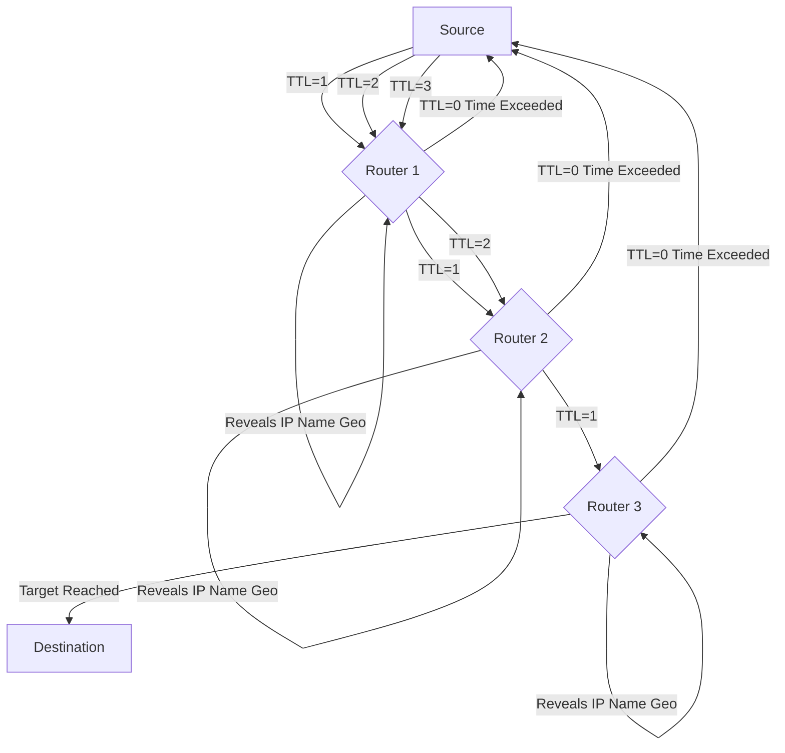

Here are the explanations for the ethical hacking concepts, including differentiations, tools, techniques, mnemonics, and Mermaid diagrams for enhanced understanding:

### 1. Differentiate between active fingerprinting and passive fingerprinting.

OS fingerprinting is the process a hacker uses to determine the type of operating system on a targeted computer, which helps identify potential security vulnerabilities. It can be done through two main approaches: active and passive.

*   **Active Fingerprinting:**
    *   **Definition:** Active fingerprinting involves directly interacting with the target system by sending specially crafted packets and then analyzing its responses to determine the operating system (OS).
    *   **Mechanism:** This method relies on the fact that different OS vendors implement the TCP stack differently. By observing how the target responds to unusual packet combinations (e.g., specific TTL values, window sizes, or fragment bits), the OS can be identified by comparing the responses against a database of known OS signatures.
    *   **Footprint & Accuracy:** It leaves a detectable footprint because of the direct interaction but is generally considered more accurate than passive fingerprinting.
    *   **Example Tool:** Nmap is a popular tool for active OS detection.

*   **Passive Fingerprinting:**
    *   **Definition:** Passive fingerprinting involves analyzing sniffer traces of packets originating from the remote system without directly interacting with the target.
    *   **Mechanism:** This method captures existing network traffic generated by the target and infers the OS based on characteristics found in packet IP headers, such as the initial Time-To-Live (TTL), TCP window size, Don't Fragment (DF) bit, and Type of Service (TOS) values.
    *   **Footprint & Accuracy:** It leaves no footprint on the target system, making it a stealthier method. However, it is generally less accurate than active fingerprinting because it relies on observation rather than direct probing.
    *   **Example Tool:** Wireshark is often used to capture packets for passive fingerprinting.

**Mnemonic:**
*   **A**ctive = **A**ction (sends packets, direct interaction)
*   **P**assive = **P**eeking (sniffs traffic, no direct interaction)

**Mermaid Diagram:**
```mermaid
graph TD
    A[OS Fingerprinting] --> B{Interaction?};
    B -- Yes: Active --> C[Sends crafted packets];
    C --> D[Analyzes system response];
    D --> E["Determines OS (higher accuracy)"];
    C -- Leaves a footprint --;

    B -- No: Passive --> F[Sniffs network traffic];
    F --> G["Analyzes packet headers (TTL, Window Size, DF, TOS)"];
    G --> H["Infers OS (lower accuracy)"];
    F -- Leaves no footprint --;
```

### 2. Which are the different types of information gathered about a target during footprinting?

Footprinting is the initial phase of information gathering in ethical hacking, aiming to create a comprehensive blueprint or map of an organization's network and systems. This process involves collecting data discreetly, without alerting the target.

The different types of information gathered about a target during footprinting include:
*   **Domain name:** Identifying the main domain and associated subdomains.
*   **Network blocks:** Information about the IP address ranges owned by the organization.
*   **Network services and applications:** Discovering what services and applications are running on the target's network.
*   **System architecture:** Understanding the overall design and structure of the target's systems.
*   **Intrusion detection system:** Identifying if and where an IDS is deployed.
*   **Authentication mechanisms:** Learning about the methods used for user authentication.
*   **Specific IP addresses:** Pinpointing individual IP addresses of servers or key systems.
*   **Access control mechanisms:** Understanding how access to resources is managed.
*   **Phone numbers:** Collecting contact phone numbers of the organization and its personnel.
*   **Contact addresses:** Gathering physical and email addresses for key contacts or the organization.

**Mnemonic:** To remember the types of information gathered, think of **D.N.S. A.I.S. P.A.C.**
*   **D**omain name
*   **N**etwork blocks
*   **S**ervices & applications
*   **A**rchitecture (System)
*   **I**ntrusion detection system
*   **S**pecific IP addresses
*   **P**hone numbers
*   **A**uthentication mechanisms
*   **C**ontact addresses (and Access control mechanisms)

### 3. What is the use of Nmap and Traceroute tools in hacking?

Both Nmap and Traceroute are fundamental tools in ethical hacking for reconnaissance and network mapping.

*   **Nmap (Network Mapper):**
    *   **Purpose:** Nmap is a powerful, open-source port scanner and network exploration tool widely used by network engineers and security professionals. It's designed to discover hosts and services on a computer network by sending packets and analyzing the responses.
    *   **Uses in Hacking:**
        *   **Finding Open Ports:** Identifies open ports on target hosts, which represent potential entry points for attackers.
        *   **Discovering Assets and Services:** Maps the network to discover all connected devices, their IP addresses, and the services running on them, including application names and versions.
        *   **OS Fingerprinting and Version Detection:** Helps determine the target's operating system and the versions of running services, crucial for identifying outdated or vulnerable software.
        *   **Vulnerability Assessment:** Can be used to scan for known vulnerabilities and misconfigurations in systems and applications, often through its scripting engine (NSE).
        *   **Firewall Analysis:** Helps in configuring Linux firewalls by understanding what traffic is allowed or blocked on specific ports.

*   **Traceroute:**
    *   **Purpose:** Traceroute (or `tracert` on Windows) is a diagnostic tool used to map the path that data packets take from a source machine to a target destination across a network.
    *   **Uses in Hacking:**
        *   **Mapping Network Topology:** Reveals the sequence of routers (hops) that IP packets traverse to reach a destination, helping to construct a working topology of the target's network infrastructure.
        *   **Identifying Routers and Gateways:** Each hop typically represents a router, and the tool can reveal the IP addresses and sometimes the DNS names of these intermediate devices.
        *   **Discovering Network Affiliation and Geographic Location:** DNS entries associated with routers can reveal the network providers, affiliations, and even the approximate geographic locations through which the target's traffic flows. This can uncover unexpected routing paths or geographic anomalies.
        *   **Assessing Network Performance:** By displaying the time it takes to reach each hop, it can highlight areas of latency or packet loss, which might indicate network congestion or defense mechanisms.
    *   **Mechanism:** Traceroute works by exploiting the Time-To-Live (TTL) field in IP packet headers. It sends a series of packets with incrementally increasing TTL values. Each router that processes a packet decrements the TTL. When the TTL reaches zero, the router discards the packet and sends an "ICMP Time Exceeded" message back to the source, thereby revealing its presence.

**Mermaid Diagram for Traceroute:**


### 4. Explain any four tools used to determine network range in ethical hacking. Also explain the scanning techniques and tools used in hacking.

#### Four Tools Used to Determine Network Range:

1.  **ARIN (American Registry of Internet Numbers):** ARIN is one of the five Regional Internet Registries (RIRs) responsible for managing and distributing IP addresses and Autonomous System Numbers (ASNs) in specific geographic regions. In ethical hacking, ARIN's Whois database allows you to search for information on network blocks, ASNs, and related contact details for organizations. This helps in identifying the IP address ranges an organization owns and understanding its subnet addressing strategy.
2.  **Traceroute:** As explained previously, Traceroute is a network diagnostic tool that maps the path of IP packets across a network. By listing the intermediate routers (hops) and their associated IP addresses, network administrators and ethical hackers can determine the network range and the logical layout of the target network.
3.  **NeoTrace (Now McAfee Visual Trace):** NeoTrace is a graphical traceroute utility that visually displays the path of data packets, often showing a map view, node view, and IP view. This visual representation helps in understanding the geographical and network range that data traverses, making it easier to conceptualize the target's network infrastructure.
4.  **SmartWhois:** Unlike standard Whois utilities, SmartWhois is designed to intelligently query the correct databases worldwide to find comprehensive information about an IP address, hostname, or domain. This includes details like country, state, city, name of the network provider, and administrative/technical contact information, which can help in outlining the network's geographical and administrative scope.

#### Scanning Techniques and Tools Used in Hacking:

Scanning is a crucial phase in ethical hacking, aiming to identify active devices, open ports, running services, and potential vulnerabilities on a target network.

**Scanning Techniques:**
*   **Pinging / Ping Sweeps:** This technique involves sending ICMP (Internet Control Message Protocol) Echo Request packets to a range of IP addresses to determine which hosts are active ("live") on the network by waiting for an ICMP Echo Reply. If ICMP is blocked, TCP/UDP packets can be used. Ping also helps assess network traffic by timestamping packets and can resolve hostnames.
*   **Port Scanning:** This technique involves sending requests to specific ports on a target system to determine which ports are open, closed, or filtered, and which services are running on them. Common types include:
    *   **TCP Connect Scan:** The most basic scan, attempting to complete a full TCP three-way handshake.
    *   **TCP SYN Scan (Half-Open Scan):** Sends a SYN packet and waits for a SYN/ACK without completing the handshake, making it stealthier as the connection is not fully established.
    *   **XMAS Scan:** Manipulates TCP flags (URG, PSH, FIN) to bypass simple firewalls and identify port states.
    *   **UDP Scan:** Scans UDP ports, which often do not send a direct reply if open, but may send an ICMP "port unreachable" if closed.
*   **Wardialing & Wardriving:**
    *   **Wardialing:** A legacy technique involving scanning a large pool of telephone numbers to detect vulnerable modems, which could provide access to a system.
    *   **Wardriving:** Activities related to discovering wireless networks, often from a moving vehicle.
*   **Vulnerability Scanning:** Involves identifying known weaknesses in a target system by comparing its configuration and software against databases of known vulnerabilities.

**Scanning Tools:**
*   **Nmap (Network Mapper):** (As explained above) A versatile open-source tool for network discovery, port scanning, OS detection, service version detection, and vulnerability assessment.
*   **Netstat:** A command-line tool that displays active network connections, routing tables, and network interface statistics. Using `netstat -a` can show all open ports on a computer.
*   **Wireshark:** A free and open-source network protocol analyzer (sniffer) that captures and inspects data packets flowing across a network. It can detect open ports (passively) and malicious activity in network traffic.
*   **Sam Spade:** A suite of network query tools used for various reconnaissance tasks including DNS lookups, Whois queries, and other network information gathering.
*   **NSlookup:** A command-line tool used to query Internet domain name servers, displaying information that can diagnose Domain Name System (DNS) infrastructure. It helps find additional IP addresses if authoritative DNS is known.
*   **SmartWhois:** A network information utility that intelligently queries various databases to find all available information about an IP address, hostname, or domain.
*   **SNMP Tools:** Tools that leverage the Simple Network Management Protocol (SNMP) to collect and organize information about network devices like routers, switches, and firewalls, revealing network architecture and configurations.

**Mnemonic for Scanning Techniques (P.P.W.W.):**
*   **P**inging
*   **P**ort Scanning
*   **W**ardialing
*   **W**ardriving

**Mnemonic for Key Scanning Tools (N.N.W.S.):**
*   **N**map
*   **N**etstat
*   **W**ireshark
*   **S**martWhois (or Sam Spade)

### 5. Explain proxy servers, anonymizers and zombies.

*   **Proxy Servers:**
    *   **Definition:** A proxy server is a network computer that acts as an intermediary or gateway between a user's device and the internet. When a user sends a request (e.g., to visit a website), it first goes to the proxy server, which then forwards the request to the internet on the user's behalf and returns the response.
    *   **Purposes/Uses:**
        *   **Firewall Functionality:** Proxies can act as a firewall, protecting the local network from outside access by filtering incoming and outgoing traffic.
        *   **IP Address Multiplexer:** Allows multiple internal computers to connect to the internet using a single external IP address.
        *   **Anonymize Web Surfing:** Hides the user's actual IP address, making it appear that the request originated from the proxy server, thereby enhancing anonymity.
        *   **Content Filtering:** Can filter out unwanted content, such as ads or 'unsuitable' material, based on predefined rules.
        *   **Security against Attacks:** Can inspect, log, or modify requests, helping to prevent cyber attackers from directly accessing private networks or identifying user data.
        *   **Caching:** Stores frequently accessed web pages to improve browsing speed for users.

*   **Anonymizers:**
    *   **Definition:** Anonymizers are tools or services specifically designed to conceal a user's digital identity, location, and online activities to maintain privacy and security on the internet.
    *   **How They Work:** They achieve anonymity by masking the user's original IP address and routing internet traffic through intermediary servers. The anonymizer strips away identifying information and forwards the request using its own IP address. This makes it difficult for websites, advertisers, or other third parties to trace online activities back to the user.
    *   **Examples:** Proxy servers can act as a form of anonymizer. Other advanced anonymizers include VPNs (Virtual Private Networks) and the Tor network (The Onion Router), which offer different levels of encryption and routing through multiple servers for enhanced anonymity.
    *   **Importance:** Essential for privacy protection, bypassing geo-restrictions or censorship, threat research, and penetration testing where anonymity is required.

*   **Zombies:**
    *   **Definition:** In cybersecurity, a "zombie" refers to a compromised computer or electronic device that has been infected with malware (such as a rootkit or Trojan horse program) and is remotely controlled by an attacker without the owner's knowledge or consent.
    *   **Functionality:** The compromised machine often continues to function normally for its legitimate user, but secretly executes commands from the attacker in the background. This might lead to slower performance.
    *   **Botnets:** Zombies are frequently organized into large networks known as **botnets** (short for "robot networks"). Attackers use botnets to control thousands of compromised systems simultaneously.
    *   **Malicious Purposes:** These botnets of zombie computers are then used for various illegal activities, including:
        *   **Distributed Denial-of-Service (DDoS) Attacks:** Flooding a target server or network with traffic to make it unavailable.
        *   **Spam and Phishing Campaigns:** Sending massive amounts of spam emails or phishing attempts to spread more malware or steal credentials.
        *   **Malware Distribution:** Propagating malware by infecting other computers.
        *   **Data Theft:** Stealing personal data, intellectual property, or financial information.
        *   **Cryptocurrency Mining:** Using the computational power of compromised devices to mine cryptocurrencies.
