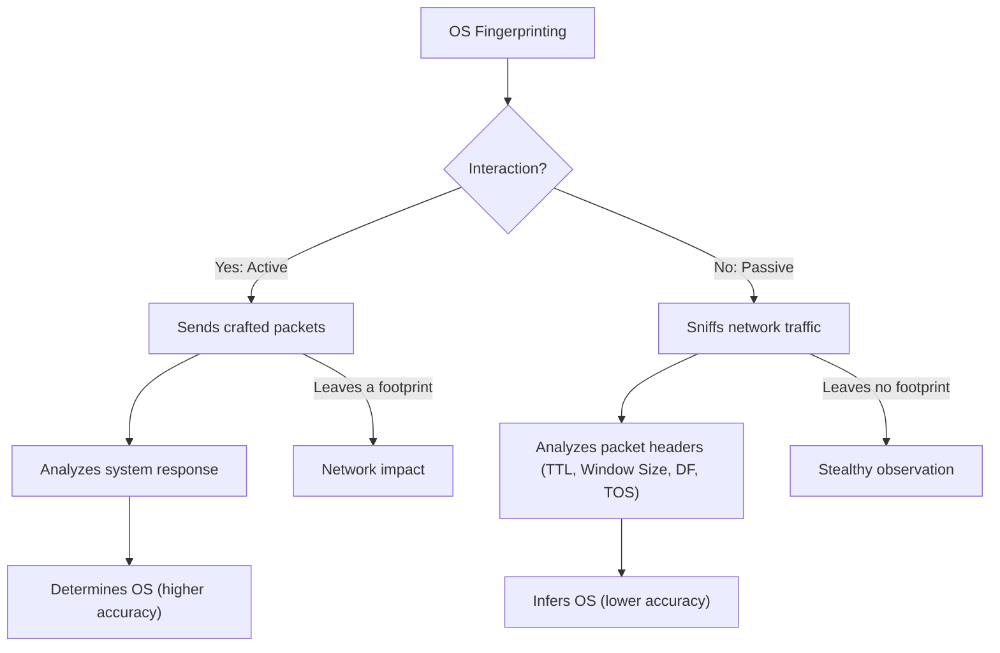
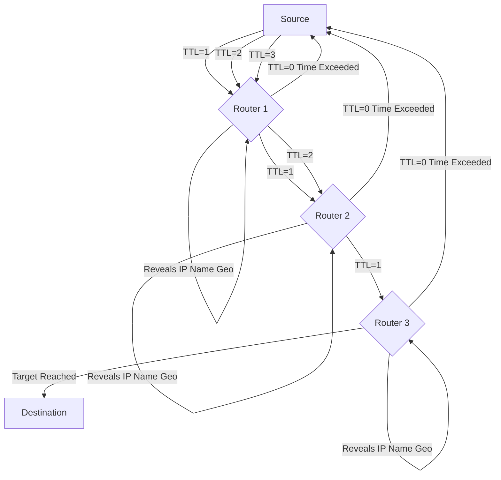
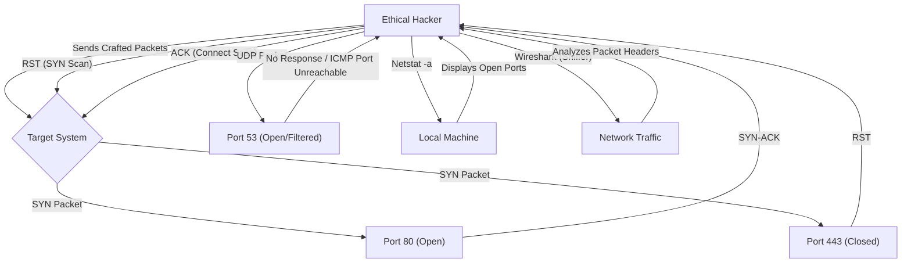
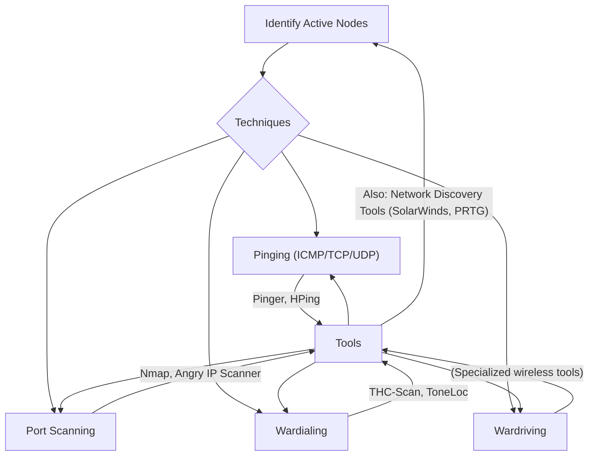
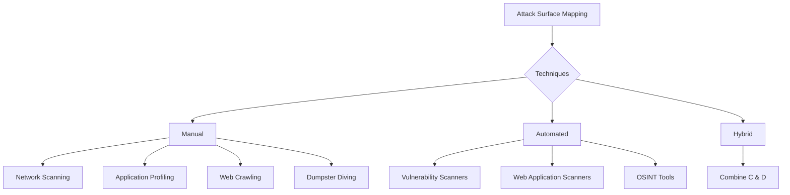
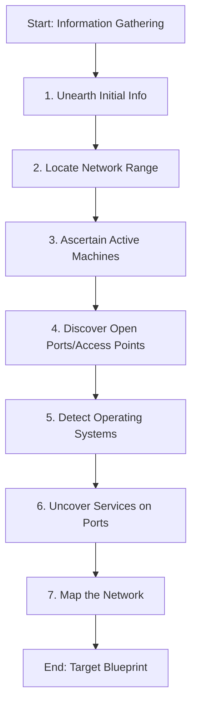
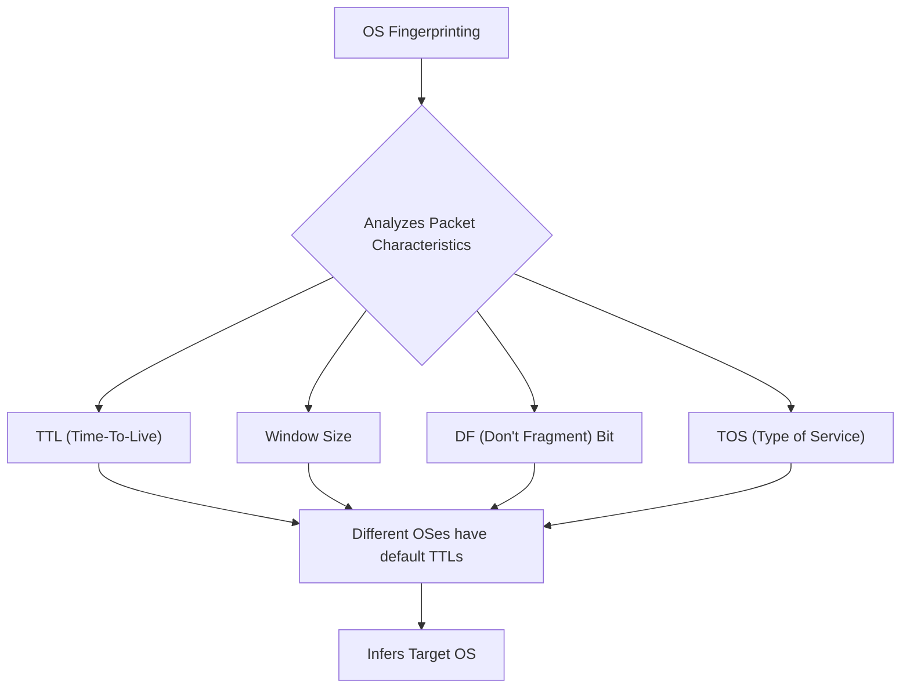

Here are the explanations for the ethical hacking concepts, including differentiations, tools, techniques, mnemonics, and Mermaid diagrams for enhanced understanding:

### 1. Differentiate between active fingerprinting and passive fingerprinting.

OS fingerprinting is the process a hacker uses to determine the type of operating system on a targeted computer, which helps identify potential security vulnerabilities. It can be done through two main approaches: active and passive.

*   **Active Fingerprinting:**
    *   **Definition:** Active fingerprinting involves directly interacting with the target system by sending specially crafted packets and then analyzing its responses to determine the operating system (OS).
    *   **Mechanism:** This method relies on observing how the target responds to unusual packet combinations (e.g., specific TTL values, window sizes, or fragment bits), the OS can be identified by comparing the responses against a database of known OS signatures.
    *   **Footprint & Accuracy:** It leaves a detectable footprint because of the direct interaction but is generally considered more accurate than passive fingerprinting.
    *   **Example Tool:** Nmap is a popular tool for active OS detection.

*   **Passive Fingerprinting:**
    *   **Definition:** Passive fingerprinting involves analyzing sniffer traces of packets originating from the remote system without directly interacting with the target.
    *   **Mechanism:** This method captures existing network traffic generated by the target and infers the OS based on characteristics found in packet IP headers, such as the initial Time-To-Live (TTL), TCP window size, Don't Fragment (DF) bit, and Type of Service (TOS) values.
    *   **Footprint & Accuracy:** It leaves no footprint on the target system, making it a stealthier method. However, it is generally less accurate than active fingerprinting because it relies on observation rather than direct probing.
    *   **Example Tool:** Wireshark is often used to capture packets for passive fingerprinting.

**Mnemonic:**
*   **A**ctive = **A**ction (sends packets, direct interaction)
*   **P**assive = **P**eeking (sniffs traffic, no direct interaction)

**Mermaid Diagram:**

### 2. Which are the different types of information gathered about a target during footprinting?

Footprinting is the initial phase of information gathering in ethical hacking, aiming to create a comprehensive blueprint or map of an organization's network and systems. This process involves collecting data discreetly, without alerting the target.

The different types of information gathered about a target during footprinting include:
*   **Domain name:** Identifying the main domain and associated subdomains.
*   **Network blocks:** Information about the IP address ranges owned by the organization.
*   **Network services and applications:** Discovering what services and applications are running on the target's network.
*   **System architecture:** Understanding the overall design and structure of the target's systems.
*   **Intrusion detection system:** Identifying if and where an IDS is deployed.
*   **Authentication mechanisms:** Learning about the methods used for user authentication.
*   **Specific IP addresses:** Pinpointing individual IP addresses of servers or key systems.
*   **Access control mechanisms:** Understanding how access to resources is managed.
*   **Phone numbers:** Collecting contact phone numbers of the organization and its personnel.
*   **Contact addresses:** Gathering physical and email addresses for key contacts or the organization.

**Mnemonic:** To remember the types of information gathered, think of **D.N.S. A.I.S. P.A.C.**
*   **D**omain name
*   **N**etwork blocks
*   **S**ervices & applications
*   **A**rchitecture (System)
*   **I**ntrusion detection system
*   **S**pecific IP addresses
*   **P**hone numbers
*   **A**uthentication mechanisms
*   **C**ontact addresses (and Access control mechanisms)

### 3. What is the use of Nmap and Traceroute tools in hacking?

Both Nmap and Traceroute are fundamental tools in ethical hacking for reconnaissance and network mapping.

*   **Nmap (Network Mapper):**
    *   **Purpose:** Nmap is a powerful, open-source port scanner and network exploration tool widely used by network engineers and security professionals. It's designed to discover hosts and services on a computer network by sending packets and analyzing the responses.
    *   **Uses in Hacking:**
        *   **Finding Open Ports:** Identifies open ports on target hosts, which represent potential entry points for attackers.
        *   **Discovering Assets and Services:** Maps the network to discover all connected devices, their IP addresses, and the services running on them, including application names and versions.
        *   **OS Fingerprinting and Version Detection:** Helps determine the target's operating system and the versions of running services, crucial for identifying outdated or vulnerable software.
        *   **Vulnerability Assessment:** Can be used to scan for known vulnerabilities and misconfigurations in systems and applications, often through its scripting engine (NSE).
        *   **Firewall Analysis:** Helps in configuring Linux firewalls by understanding what traffic is allowed or blocked on specific ports.

*   **Traceroute:**
    *   **Purpose:** Traceroute (or `tracert` on Windows) is a diagnostic tool used to map the path that data packets take from a source machine to a target destination across a network.
    *   **Uses in Hacking:**
        *   **Mapping Network Topology:** Reveals the sequence of routers (hops) that IP packets traverse to reach a destination, helping to construct a working topology of the target's network infrastructure.
        *   **Identifying Routers and Gateways:** Each hop typically represents a router, and the tool can reveal the IP addresses and sometimes the DNS names of these intermediate devices.
        *   **Discovering Network Affiliation and Geographic Location:** DNS entries associated with routers can reveal the network providers, affiliations, and even the approximate geographic locations through which the target's traffic flows. This can uncover unexpected routing paths or geographic anomalies.
        *   **Assessing Network Performance:** By displaying the time it takes to reach each hop, it can highlight areas of latency or packet loss, which might indicate network congestion or defense mechanisms.
    *   **Mechanism:** Traceroute works by exploiting the Time-To-Live (TTL) field in IP packet headers. It sends a series of packets with incrementally increasing TTL values. Each router that processes a packet decrements the TTL. When the TTL reaches zero, the router discards the packet and sends an "ICMP Time Exceeded" message back to the source, thereby revealing its presence.

**Mermaid Diagram for Traceroute:**

### 4. Explain any four tools used to determine network range in ethical hacking. Also explain the scanning techniques and tools used in hacking.

#### Four Tools Used to Determine Network Range:

1.  **ARIN (American Registry of Internet Numbers):** ARIN is one of the five Regional Internet Registries (RIRs) responsible for managing and distributing IP addresses and Autonomous System Numbers (ASNs) in specific geographic regions. In ethical hacking, ARIN's Whois database allows you to search for information on network blocks, ASNs, and related contact details for organizations. This helps in identifying the IP address ranges an organization owns and understanding its subnet addressing strategy.
2.  **Traceroute:** As explained previously, Traceroute is a network diagnostic tool that maps the path of IP packets across a network. By listing the intermediate routers (hops) and their associated IP addresses, network administrators and ethical hackers can determine the network range and the logical layout of the target network.
3.  **NeoTrace (Now McAfee Visual Trace):** NeoTrace is a graphical traceroute utility that visually displays the path of data packets, often showing a map view, node view, and IP view. This visual representation helps in understanding the geographical and network range that data traverses, making it easier to conceptualize the target's network infrastructure.
4.  **SmartWhois:** Unlike standard Whois utilities, SmartWhois is designed to intelligently query the correct databases worldwide to find comprehensive information about an IP address, hostname, or domain. This includes details like country, state, city, name of the network provider, and administrative/technical contact information, which can help in outlining the network's geographical and administrative scope.

#### Scanning Techniques and Tools Used in Hacking:

Scanning is a crucial phase in ethical hacking, aiming to identify active devices, open ports, running services, and potential vulnerabilities on a target network.

**Scanning Techniques:**
*   **Pinging / Ping Sweeps:** This technique involves sending ICMP (Internet Control Message Protocol) Echo Request packets to a range of IP addresses to determine which hosts are active ("live") on the network by waiting for an ICMP Echo Reply. If ICMP is blocked, TCP/UDP packets can be used. Ping also helps assess network traffic by timestamping packets and can resolve hostnames.
*   **Port Scanning:** This technique involves sending requests to specific ports on a target system to determine which ports are open, closed, or filtered, and which services are running on them. Common types include:
    *   **TCP Connect Scan:** The most basic scan, attempting to complete a full TCP three-way handshake.
    *   **TCP SYN Scan (Half-Open Scan):** Sends a SYN packet and waits for a SYN/ACK without completing the handshake, making it stealthier as the connection is not fully established.
    *   **XMAS Scan:** Manipulates TCP flags (URG, PSH, FIN) to bypass simple firewalls and identify port states.
    *   **UDP Scan:** Scans UDP ports, which often do not send a direct reply if open, but may send an ICMP "port unreachable" if closed.
*   **Wardialing & Wardriving:**
    *   **Wardialing:** A legacy technique involving scanning a large pool of telephone numbers to detect vulnerable modems, which could provide access to a system.
    *   **Wardriving:** Activities related to discovering wireless networks, often from a moving vehicle.
*   **Vulnerability Scanning:** Involves identifying known weaknesses in a target system by comparing its configuration and software against databases of known vulnerabilities.

**Scanning Tools:**
*   **Nmap (Network Mapper):** (As explained above) A versatile open-source tool for network discovery, port scanning, OS detection, service version detection, and vulnerability assessment.
*   **Netstat:** A command-line tool that displays active network connections, routing tables, and network interface statistics. Using `netstat -a` can show all open ports on a computer.
*   **Wireshark:** A free and open-source network protocol analyzer (sniffer) that captures and inspects data packets flowing across a network. It can detect open ports (passively) and malicious activity in network traffic.
*   **Sam Spade:** A suite of network query tools used for various reconnaissance tasks including DNS lookups, Whois queries, and other network information gathering.
*   **NSlookup:** A command-line tool used to query Internet domain name servers, displaying information that can diagnose Domain Name System (DNS) infrastructure. It helps find additional IP addresses if authoritative DNS is known.
*   **SmartWhois:** A network information utility that intelligently queries various databases to find all available information about an IP address, hostname, or domain.
*   **SNMP Tools:** Tools that leverage the Simple Network Management Protocol (SNMP) to collect and organize information about network devices like routers, switches, and firewalls, revealing network architecture and configurations.

**Mnemonic for Scanning Techniques (P.P.W.W.):**
*   **P**inging
*   **P**ort Scanning
*   **W**ardialing
*   **W**ardriving

**Mnemonic for Key Scanning Tools (N.N.W.S.):**
*   **N**map
*   **N**etstat
*   **W**ireshark
*   **S**martWhois (or Sam Spade)

### 5. Explain proxy servers, anonymizers and zombies.

*   **Proxy Servers:**
    *   **Definition:** A proxy server is a network computer that acts as an intermediary or gateway between a user's device and the internet. When a user sends a request (e.g., to visit a website), it first goes to the proxy server, which then forwards the request to the internet on the user's behalf and returns the response.
    *   **Purposes/Uses:**
        *   **Firewall Functionality:** Proxies can act as a firewall, protecting the local network from outside access by filtering incoming and outgoing traffic.
        *   **IP Address Multiplexer:** Allows multiple internal computers to connect to the internet using a single external IP address.
        *   **Anonymize Web Surfing:** Hides the user's actual IP address, making it appear that the request originated from the proxy server, thereby enhancing anonymity.
        *   **Content Filtering:** Can filter out unwanted content, such as ads or 'unsuitable' material, based on predefined rules.
        *   **Security against Attacks:** Can inspect, log, or modify requests, helping to prevent cyber attackers from directly accessing private networks or identifying user data.
        *   **Caching:** Stores frequently accessed web pages to improve browsing speed for users.

*   **Anonymizers:**
    *   **Definition:** Anonymizers are tools or services specifically designed to conceal a user's digital identity, location, and online activities to maintain privacy and security on the internet.
    *   **How They Work:** They achieve anonymity by masking the user's original IP address and routing internet traffic through intermediary servers. The anonymizer strips away identifying information and forwards the request using its own IP address. This makes it difficult for websites, advertisers, or other third parties to trace online activities back to the user.
    *   **Examples:** Proxy servers can act as a form of anonymizer. Other advanced anonymizers include VPNs (Virtual Private Networks) and the Tor network (The Onion Router), which offer different levels of encryption and routing through multiple servers for enhanced anonymity.
    *   **Importance:** Essential for privacy protection, bypassing geo-restrictions or censorship, threat research, and penetration testing where anonymity is required.

*   **Zombies:**
    *   **Definition:** In cybersecurity, a "zombie" refers to a compromised computer or electronic device that has been infected with malware (such as a rootkit or Trojan horse program) and is remotely controlled by an attacker without the owner's knowledge or consent.
    *   **Functionality:** The compromised machine often continues to function normally for its legitimate user, but secretly executes commands from the attacker in the background. This might lead to slower performance.
    *   **Botnets:** Zombies are frequently organized into large networks known as **botnets** (short for "robot networks"). Attackers use botnets to control thousands of compromised systems simultaneously.
    *   **Malicious Purposes:** These botnets of zombie computers are then used for various illegal activities, including:
        *   **Distributed Denial-of-Service (DDoS) Attacks:** Flooding a target server or network with traffic to make it unavailable.
        *   **Spam and Phishing Campaigns:** Sending massive amounts of spam emails or phishing attempts to spread more malware or steal credentials.
        *   **Malware Distribution:** Propagating malware by infecting other computers.
        *   **Data Theft:** Stealing personal data, intellectual property, or financial information.
        *   **Cryptocurrency Mining:** Using the computational power of compromised devices to mine cryptocurrencies.
     
To help you understand these ethical hacking concepts for your exam, here are detailed explanations with mnemonics and Mermaid diagrams where applicable:

### 6. Explain the mechanisms deployed to find open ports and access points while gathering the information.

Finding open ports and access points is a critical step in ethical hacking to identify potential entry points into a target system or network. Several tools and their underlying mechanisms are deployed for this purpose:

*   **Nmap (Network Mapper):**
    *   **Mechanism:** Nmap is a powerful port scanner that works by sending various types of crafted packets to target systems and analyzing their responses.
        *   **TCP Connect Scan (`-sT`):** Nmap attempts to complete a full TCP three-way handshake (SYN, SYN-ACK, ACK) with each target port. If the handshake is successful, the port is considered open. If a RST (Reset) packet is received, the port is closed.
        *   **TCP SYN Scan (`-sS`, Half-Open Scan):** This is a stealthier method. Nmap sends a SYN packet and waits for a SYN/ACK response. If received, it immediately sends an RST packet to tear down the connection before a full handshake is completed. This prevents the connection from being fully logged by the target system.
        *   **UDP Scan (`-sU`):** For UDP ports, Nmap sends UDP packets to target ports. If no response is received, the port might be open or filtered. If an ICMP "port unreachable" error is received, the port is likely closed.
        *   **XMAS Scan (`-sX`):** Sends packets with FIN, PSH, and URG flags set. For open ports on many systems, no response is received. For closed ports, an RST is sent. This can sometimes bypass basic firewalls.
    *   **Function:** Nmap helps identify which services are running on open ports and can detect OS types and service versions.

*   **Netstat:**
    *   **Mechanism:** Netstat (Network Statistics) is a command-line utility that displays active network connections (both incoming and outgoing), routing tables, and a variety of network interface statistics.
    *   **Function:** By using commands like `netstat -a` (for Windows), an ethical hacker can see all currently open ports on their own computer, including those listening for incoming connections. This is useful for understanding the local attack surface or for analyzing compromised machines.

*   **Wireshark:**
    *   **Mechanism:** Wireshark is a network protocol analyzer or "packet sniffer." It captures and displays network traffic in real-time, allowing for deep inspection of individual packets.
    *   **Function:** While not actively probing for ports, Wireshark can *passively* detect open ports and running services by observing the existing communication patterns and the source/destination ports involved in legitimate or malicious traffic. It can also help detect malicious activity in network traffic.

*   **SNMP Tools:**
    *   **Mechanism:** Simple Network Management Protocol (SNMP) is a protocol used for managing and monitoring network devices. SNMP tools can query devices configured with SNMP to retrieve information.
    *   **Function:** These tools can discover network devices, their configurations, and sometimes even their open ports and services, by querying the SNMP agents running on those devices. This helps in understanding the network's structure and identifying potential access points related to network management.

**Mnemonic (N.N.W.S. for Tools):**
*   **N**map (Active probing)
*   **N**etstat (Local view)
*   **W**ireshark (Passive sniffing)
*   **S**NMP Tools (Management queries)

**Mermaid Diagram (Port Scanning Simplified):**

### 7. Explain the techniques and tools used to identify active nodes on the network.

Identifying active nodes (devices connected to the network) is a fundamental step in reconnaissance to determine what machines are "live" and potentially vulnerable.

**Techniques to Identify Active Nodes:**

1.  **Pinging (ICMP Echo Request):**
    *   **Mechanism:** This is a basic technique where an ICMP Echo Request packet is sent to a target IP address. If the host is active, it should respond with an ICMP Echo Reply.
    *   **Use:** It helps assess if a host is online and can also be used in "ping sweeps" (sending pings to a range of IPs) to quickly identify multiple active machines.
    *   **Limitation:** Many networks block ICMP traffic at the firewall, making this method less effective in some scenarios. In such cases, TCP/UDP packets can be used as alternatives.

2.  **Port Scanning:**
    *   **Mechanism:** As discussed in Q6, port scanning involves sending various types of packets (e.g., TCP SYN, TCP Connect, UDP) to a range of ports on a target IP. If a port responds (indicating it's open), it confirms the host is active.
    *   **Use:** Port scanning is more comprehensive than pinging as it not only identifies active hosts but also the services running on them.

3.  **Wardialing:**
    *   **Mechanism:** A legacy technique involving a tool that scans a large pool of telephone numbers to detect modems configured for remote access.
    *   **Use:** Identifies systems with vulnerable modems, which could provide entry to a network.

4.  **Wardriving:**
    *   **Mechanism:** Involves physically driving around an area with wireless detection equipment to identify active wireless networks and access points.
    *   **Use:** Helps map out an organization's wireless infrastructure, potentially uncovering unsecured networks.

**Tools Used to Identify Active Nodes:**

1.  **Pinger / Ping Utilities:**
    *   **Tools:** `ping` (built-in to most OS), `WS_Ping ProPack`, `NetScan Tools`, `HPing`, `icmpenum`.
    *   **Function:** These tools implement the ping technique to send ICMP Echo Request packets and analyze responses to determine if a host is active.

2.  **Nmap:**
    *   **Tool:** Nmap (Network Mapper)
    *   **Function:** Nmap is highly effective for identifying active hosts through its various scanning capabilities, including ping scans (`-sn` or `-sP`) and port scanning. It can discover active devices and provide details like IP, MAC, and hostname.

3.  **War Dialers:**
    *   **Tools:** `THC-Scan`, `ToneLoc`, `TBA`.
    *   **Function:** These tools automate the process of dialing phone numbers to detect active modems.

4.  **Angry IP Scanner:**
    *   **Tool:** Angry IP Scanner.
    *   **Function:** A fast and lightweight network scanner that checks IP addresses and ports to identify active devices, validate network inventory, and uncover visibility gaps. It can reveal information like IP, MAC, hostname, and open ports.

5.  **Network Discovery Tools (e.g., SolarWinds Network Performance Monitor, PRTG Network Monitor):**
    *   **Tools:** SolarWinds Network Performance Monitor, Paessler PRTG Network Monitor, Intermapper, Advanced IP Scanner.
    *   **Function:** These tools automatically scan IP address ranges and subnets, often using SNMP, to discover and map network devices, providing detailed information about active nodes and their status.

**Mnemonic (P.P.W.W. + N.A.S. for Tools):**
*   **P**inging
*   **P**ort Scanning
*   **W**ardialing
*   **W**ardriving
*   **N**map
*   **A**ngry IP Scanner
*   **S**olarWinds (and similar Network Discovery tools)

**Mermaid Diagram (Active Node Identification):**

### 8. Explain in detail the techniques used for attack surface mapping. Also explain the network attack surface mapping and its key elements.

Attack surface mapping and analysis is the process of identifying and examining all potential entry points or vulnerabilities an unauthorized user could exploit to gain access to or extract data from an environment. It's crucial for understanding an organization's security posture and prioritizing defenses.

#### Techniques Used for Attack Surface Mapping:

Attack surface mapping involves a mix of manual and automated approaches to ensure comprehensive coverage.

**1. Manual Techniques:**
These hands-on approaches provide a nuanced understanding and can uncover issues that automated tools might miss.
*   **Network Scanning:** Manually inspecting network configurations, including routers, switches, and firewalls, to identify open ports, running services, and other potential entry points. This requires a deep understanding of network protocols.
*   **Application Profiling:** Manually reviewing the features, configurations, and behaviors of applications to find security weaknesses. This involves examining code, understanding data flow, and identifying where sensitive data is handled.
*   **Web Crawling:** Systematically browsing a website, much like a search engine bot, to map its structure and discover hidden or unprotected areas. Useful for finding outdated pages, unprotected directories, or misconfigured servers.
*   **Dumpster Diving:** Sifting through a company's physical trash to find sensitive information like discarded documents, old hard drives, passwords, IP addresses, or contact details. This highlights the importance of secure data disposal and physical security.

**2. Automated Techniques:**
These leverage software tools to quickly scan and map vulnerabilities across vast digital landscapes at a scale and speed unattainable manually.
*   **Vulnerability Scanners:** Automated tools that scan networks, systems, and applications for known vulnerabilities by comparing system details against databases of known security issues. They identify misconfigurations, outdated software, and susceptibilities to attacks.
*   **Web Application Scanners:** Automate the testing of web applications for security vulnerabilities. They simulate attacks on web forms, scripts, and pages to identify flaws like SQL injection, cross-site scripting, and other common vulnerabilities.
*   **OSINT (Open Source Intelligence) Tools:** Gather data from publicly available sources (e.g., domain registrations, exposed datasets, social media) to understand potential vulnerabilities and social engineering attack vectors.

**3. Hybrid Approaches:**
Combine automated tools with manual efforts for comprehensive coverage and accuracy. An automated scan might identify potential vulnerabilities, which are then manually reviewed to confirm validity and context. This balances speed with human analysis.

#### Network Attack Surface Mapping and its Key Elements:

**Network Attack Surface Mapping** specifically refers to identifying and documenting all potential entry points or vulnerabilities within a network that a malicious actor could exploit to gain access. It creates a visual representation of all possible attack vectors across an organization's network infrastructure, enabling targeted security improvements and risk mitigation strategies.

**Key Elements of Network Attack Surface Mapping:**

1.  **Asset Inventory:** Identifying all connected devices on the network, including servers, workstations, routers, switches, firewalls, printers, IoT devices, and cloud instances. This creates a full scope of potential attack targets.
2.  **Service Enumeration:** Discovering all active services running on each device, including open ports, protocols, and applications, as these can represent potential entry points for attackers.
3.  **Vulnerability Assessment:** Scanning identified assets for known vulnerabilities in software, operating systems, and applications to assess their potential risk level.
4.  **Network Segmentation:** Analyzing how different network segments are interconnected and identifying potential pathways for lateral movement within the network once an initial breach occurs.
5.  **User Access Controls:** Evaluating user accounts and privileges to identify potential areas where unauthorized access could be granted.
6.  **External Exposure:** Identifying publicly accessible network interfaces, web servers, and exposed services that could be targeted by attackers from the internet.

**Mnemonic for Techniques (M.A.H.):**
*   **M**anual Techniques
*   **A**utomated Techniques
*   **H**ybrid Approaches

**Mnemonic for Key Elements (A.S.V.N.U.E.):**
*   **A**sset Inventory
*   **S**ervice Enumeration
*   **V**ulnerability Assessment
*   **N**etwork Segmentation
*   **U**ser Access Controls
*   **E**xternal Exposure

**Mermaid Diagram (Attack Surface Mapping Techniques):**

### 9. Explain the process of information gathering methodology in ethical hacking.

Information gathering, also known as footprinting or reconnaissance, is the crucial initial phase in ethical hacking. It involves collecting as much information about a target as possible using non-intrusive methods to create a comprehensive blueprint of its network and systems. The methodology typically follows a structured process:

1.  **Unearth Initial Information:**
    *   This is the very first step, focusing on gathering foundational details about the target. It commonly includes identifying the domain name, physical locations, and contact information (phone/mail).
    *   **Tools/Sources:** Open-source intelligence (OSINT), search engines (like Google with advanced dorking techniques), Whois lookups, NSlookup.

2.  **Locate the Network Range:**
    *   Once initial information is gathered, the next step is to determine the IP address ranges and subnet masks used by the target organization.
    *   **Tools/Sources:** ARIN (American Registry of Internet Numbers) for Whois database searches, Traceroute/NeoTrace/Visual Route to map network paths.

3.  **Ascertain Active Machines:**
    *   After defining the network range, the goal is to identify which specific devices (nodes) within that range are currently active and reachable on the network.
    *   **Techniques:** Pinging (ICMP, TCP/UDP packets), Wardialing, Wardriving, initial Port Scanning.
    *   **Tools:** Pinger, Nmap, Angry IP Scanner, War Dialers (e.g., THC-Scan, ToneLoc).

4.  **Discover Open Ports / Access Points:**
    *   For the identified active machines, this step involves determining which ports are open and what services are listening on them. This reveals potential entry points and services that could be exploited.
    *   **Tools:** Nmap, Netstat, Wireshark, SNMP tools.

5.  **Detect Operating Systems:**
    *   This is known as OS Fingerprinting. It involves identifying the type and version of the operating system running on the active machines.
    *   **Techniques:** Active fingerprinting (sending crafted packets and analyzing responses) and passive fingerprinting (analyzing network traffic passively).
    *   **Tools:** Nmap is commonly used for active OS fingerprinting. Wireshark can be used for passive analysis.

6.  **Uncover Services on Ports:**
    *   Beyond just knowing a port is open, this step aims to identify the specific applications and service versions running on those ports. This information is crucial for pinpointing known vulnerabilities associated with particular software versions.

7.  **Map the Network:**
    *   With all the gathered information (active machines, open ports, OS types, services), the final step is to create a detailed blueprint or map of the target's network architecture. This visual representation helps in understanding the target's infrastructure and identifying attack vectors.
    *   **Tools:** NeoTrace, Visual Route, or even manual drawing based on collected data.

**Mnemonic (U.L.A.D.D.U.M.):**
*   **U**nearth initial information
*   **L**ocate the network range
*   **A**scertain active machines
*   **D**iscover open ports / access points
*   **D**etect operating systems
*   **U**ncover services on ports
*   **M**ap the Network

**Mermaid Diagram (Information Gathering Flow):**

### 10. Define OS fingerprinting and the elements of operating system that are verified during fingerprinting.

**OS Fingerprinting Definition:**
OS fingerprinting is the process a hacker goes through to determine the type of operating system (OS) being used on a targeted computer. It's the science of determining the operating system of a remote computer on the Internet. This is beneficial because knowing the OS provides useful information about any security vulnerabilities specific to that operating system that can be exploited to launch an attack. Both security professionals and hackers use OS fingerprinting to analyze and map remote networks and identify potential vulnerabilities.

**Elements of Operating System that are Verified During Fingerprinting:**
OS fingerprinting leverages the subtle differences in how various operating systems implement network protocols, particularly TCP/IP. These differences manifest in specific characteristics that can be observed and analyzed. The four important elements typically looked at to determine the operating system are:

1.  **TTL (Time-To-Live):**
    *   **Explanation:** This refers to the value the operating system sets for the Time-To-Live field on the outbound IP packets it sends. The TTL specifies how many hops (routers) a packet can traverse before being discarded. Different operating systems often start with different default TTL values (e.g., Windows commonly starts with 128, while Linux often starts with 64).
    *   **Verification:** By observing the remaining TTL value in a received packet, an attacker can infer the initial TTL and thus the likely OS, especially if the number of hops is known.

2.  **Window Size:**
    *   **Explanation:** This element indicates the size of the TCP receive window that the operating system sets. The TCP window size determines how much data can be sent before an acknowledgment is required. Different OSes use distinct default window sizes.
    *   **Verification:** Analyzing the window size advertised in TCP packets can provide clues about the underlying OS.

3.  **DF (Don't Fragment) Bit:**
    *   **Explanation:** This is a flag within the IP header. The Don't Fragment bit, when set, prevents IP packets from being fragmented (broken into smaller pieces) when traversing networks with smaller Maximum Transmission Unit (MTU) sizes. Some operating systems set this bit by default, while others do not, or handle it differently.
    *   **Verification:** Observing whether the DF bit is set in outbound packets helps distinguish between OS types.

4.  **TOS (Type of Service):**
    *   **Explanation:** The Type of Service field in the IP header is used to specify how a packet should be handled. While less commonly used for fingerprinting than TTL or Window Size, some operating systems might set specific TOS values by default or in certain scenarios.
    *   **Verification:** Identifying if and how the operating system sets the Type of Service can contribute to the fingerprinting process.

These elements are verified through both active (sending crafted packets and analyzing responses) and passive (sniffing network traffic) fingerprinting techniques.

**Mnemonic (T.W.D.T. for Elements):**
*   **T**TL
*   **W**indow Size
*   **D**F (Don't Fragment) Bit
*   **T**OS (Type of Service)

**Mermaid Diagram (OS Fingerprinting Elements):**

