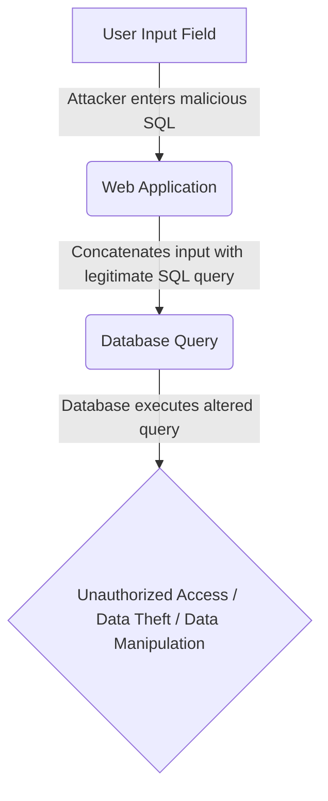
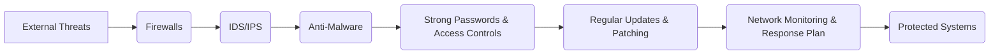
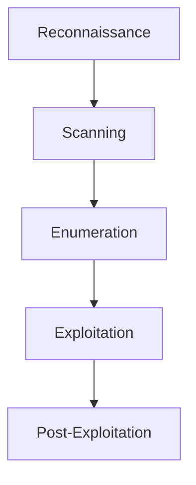
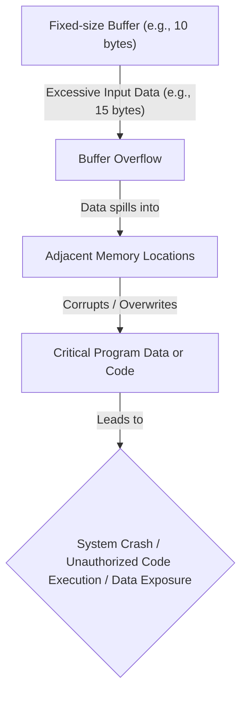
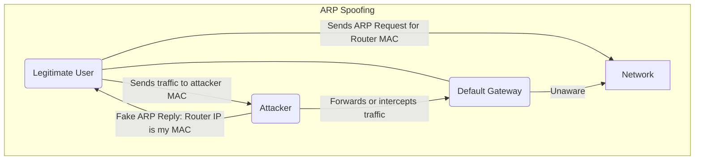
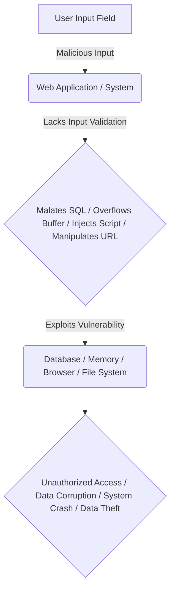
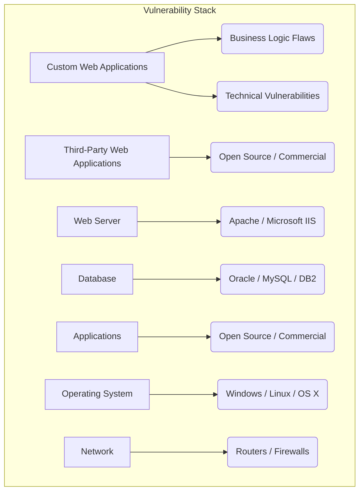
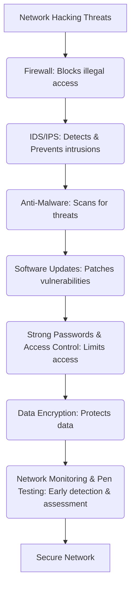
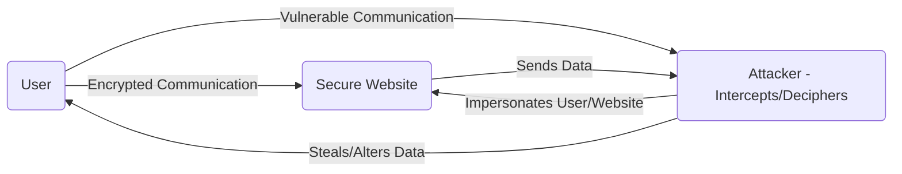
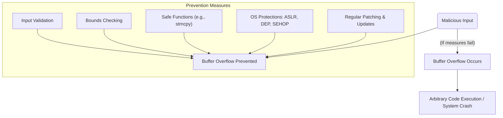

### 1. Explain SQL injection attack with an example.

**Definition:** An SQL injection (SQLi) attack is a common web security vulnerability that allows an attacker to interfere with the queries an application makes to its database. It involves the placement of malicious SQL code in SQL statements via web page input, which the server then executes without proper validation. This can lead to unauthorized data access, data theft, or complete data deletion.

**How it works (Mnemonic: I.M.P.):**
*   **I**nject: Malicious SQL code is inserted into input fields (e.g., username, search bar).
*   **M**anipulate: The application inadvertently concatenates this malicious input with its legitimate SQL query.
*   **P**roblem: The database executes the altered query, potentially revealing hidden data, bypassing authentication, or modifying/deleting data.

**Example:**
Consider a website with a login form where the server constructs an SQL query like this:
`SELECT * FROM Users WHERE UserId = '` *`txtUserId`* `'`

If a legitimate user enters `105`, the query becomes:
`SELECT * FROM Users WHERE UserId = '105'`

However, an attacker could enter a malicious string like `105 OR 1=1` into the `txtUserId` field. The SQL statement would then become:
`SELECT * FROM Users WHERE UserId = '105 OR 1=1'`

Since `1=1` is always true, this query will bypass the intended user ID check and return all rows from the `Users` table, allowing the attacker to gain unauthorized access to all usernames and passwords.

Another example involves using a semicolon to separate two fields, potentially deleting an entire user database. Or, using a `UNION SELECT` statement to combine two unrelated `SELECT` queries to retrieve data from different database tables, such as usernames and passwords from an `admin_users` table.

**Mermaid Diagram: SQL Injection Flow**



---

### 2. Which are the policies that an organization can adopt to prevent Denial of Service attacks?

Organizations can adopt several policies and measures to prevent Denial of Service (DoS) attacks:

**Mnemonic: F.I.S.H. M.U.S.H. (Firewall, IDS/IPS, Security patches, High bandwidth, Monitoring, Updates, Strong passwords, Hygiene)**

1.  **Use anti-malware protection:** Install reliable antivirus software to scan for and protect against malware.
2.  **Use firewalls:** Implement robust network firewall systems to add multiple layers of protection, block illegal access, scan incoming traffic, and limit insider threats.
3.  **Keep your software updated:** Regularly update software to patch new vulnerabilities and prevent cybercriminals from exploiting outdated systems, as seen in attacks like WannaCry.
4.  **Use strong passwords:** Enforce strong password policies to make it difficult for hackers to compromise systems.
5.  **Deploy Intrusion Detection and Prevention Systems (IDS/IPS):** These systems identify and prevent illegitimate activities and actively monitor network traffic to identify and block potential threats in real time.
6.  **Implement Strong Data Encryption:** Encrypt sensitive data both at rest and in transit to protect it even if intercepted.
7.  **Implement Strong Access Controls:** Restrict user access permissions to limit who can view or modify sensitive data.
8.  **Conduct Regular Vulnerability Assessments and Penetration Testing:** Identify system weaknesses and gaps in defenses before they can be exploited.
9.  **Implement Comprehensive Network Monitoring:** Continuously monitor network traffic to identify unusual activity and potential DDoS related traffic patterns, enabling early detection.
10. **Regular Updates and Patching:** Ensure all systems and applications are regularly updated and patched to address known vulnerabilities.

Other practices include:
*   **Install security patches** to minimize SYN flooding.
*   **Use Access Control Lists (ACLs)** to configure routers and block unauthorized traffic.
*   **Know your network's traffic patterns** to easily spot anomalies.
*   **Create a Denial of Service Response Plan** to detect, contain, and recover from attacks.
*   **Scale up bandwidth** to handle traffic spikes.
*   **Utilize DDoS protection services** and technologies like Content Delivery Networks (CDNs) and Web Application Firewalls (WAFs) to filter malicious traffic.
*   **Implement rate limiting** to restrict the number of requests a server accepts from a specific IP address within a timeframe.
*   **Educate employees** on cybersecurity best practices.

**Mermaid Diagram: DoS Prevention Layers**



---

### 3. Explain the steps involved in network hacking.

The steps involved in network hacking, especially within an ethical hacking context, typically follow a structured process.

**Mnemonic: R.S.E.E.P. (Reconnaissance, Scanning, Enumeration, Exploitation, Post-Exploitation)**

1.  **Reconnaissance (Footprinting):** This initial phase involves gathering as much information as possible about the target network without directly interacting with it (passive) or with direct interaction (active). Information collected includes IP addresses, domain names, network infrastructure, public information, and potential targets for social engineering.
    *   *Example:* Using WHOIS to obtain domain registration information or searching public databases.

2.  **Scanning:** In this phase, the ethical hacker uses network scanning tools to discover active systems, open ports, and services running on the target network. Techniques include port scanning, network mapping, and vulnerability scanning to identify potential entry points or weaknesses.
    *   *Example:* Identifying open ports and active services on the target system.

3.  **Enumeration:** Once active systems and services are identified, the ethical hacker attempts to gather more detailed information about those systems, such as user accounts, network shares, or system configurations. This helps in identifying potential vulnerabilities or misconfigurations that could be exploited.
    *   *Example:* Enumerating usernames, shares, and system information.

4.  **Exploitation (Gaining Access):** In this stage, the ethical hacker attempts to exploit identified vulnerabilities to gain unauthorized access or escalate privileges. Exploitation techniques may include using known exploits, social engineering, or password cracking. The objective is to validate the existence and severity of vulnerabilities.
    *   *Example:* Launching a full-fledged attack by exploiting exposed vulnerabilities to gain control.

5.  **Post-Exploitation (Maintaining Access & Covering Tracks):** After successfully exploiting a vulnerability and gaining access, ethical hackers explore the compromised system to understand the extent of the potential damage a malicious attacker could inflict. This also involves maintaining access for future use and covering tracks to avoid detection.
    *   *Example:* Deleting system logs, modifying file timestamps, or installing rootkits to maintain access and hide evidence.

**Mermaid Diagram: Network Hacking Steps**



---

### 4. What is buffer overflow attack? Illustrate with an example. Which programming languages are more vulnerable to buffer overflow attack? Explain how it can be prevented.

**Definition:** A buffer overflow (or buffer overrun) is a software coding error or vulnerability where a program attempts to write more data into a memory buffer than it can hold. This excess data overflows into adjacent memory locations, corrupting or overwriting existing data. Hackers can exploit this to gain unauthorized access, execute arbitrary code, or compromise the affected system.

**How it works (Mnemonic: O.C.A.):**
*   **O**verfill: Input data exceeds the allocated buffer size.
*   **C**orrupt: Excess data spills into and corrupts adjacent memory locations.
*   **A**lter: An attacker manipulates this to alter the program's execution path, inject malicious code, or expose data.

**Example:**
A common buffer overflow example occurs when code relies on external data and uses functions that do not perform bounds-checking.
Consider a C program with a buffer designed to hold a fixed number of characters:
```c
char buffer[10]; // Buffer designed to hold 10 bytes
gets(buffer);     // Unsafe function: reads input without checking size
```
If a user inputs a string longer than 9 characters (plus the null terminator), the `gets()` function will write the excess data beyond the allocated `buffer[10]` space, overflowing into adjacent memory. An attacker can exploit this by sending a specially crafted input that overwrites critical parts of the program's memory, such as the return address, to execute their own malicious code.

**Programming Languages More Vulnerable:**
*   **C and C++:** These languages are highly susceptible to buffer overflow attacks because they allow direct memory access and do not have built-in safeguards or automatic bounds checking for memory management. Most operating systems like Mac OSX, Windows, and Linux use code written in C and C++.
*   **Assembly and Fortran:** These languages are also particularly vulnerable.

Languages like Python, Java, JavaScript, C#, and Perl are generally less vulnerable because they have built-in safety mechanisms and automatic memory management that minimize the likelihood of buffer overflows, although their interpreters can still be affected by bugs.

**How it can be prevented (Mnemonic: S.A.D. P.R.O.P.):**
*   **S**ecure Coding Practices: Developers should build security measures into their development code.
*   **A**void Unsafe Functions: Avoid standard library functions like `gets()`, `scanf()`, and `strcpy()` that do not perform bounds-checking. Use safer alternatives like `strncpy()` or `fgets()`.
*   **D**ata Validation and Bounds Checking: Always validate input sizes and implement runtime bounds-checking to ensure data written to a buffer stays within its allocated boundaries.
*   **P**atch Software: Quickly patch software when buffer overflow vulnerabilities are discovered.
*   **R**untime Protections (OS-level): Modern operating systems deploy runtime protections:
    *   **Address Space Layout Randomization (ASLR):** Randomizes memory addresses, making it difficult for attackers to predict where executable code is located.
    *   **Data Execution Prevention (DEP):** Prevents code from running in non-executable memory regions.
    *   **Structured Exception Handling Overwrite Protection (SEHOP):** Protects against attackers overwriting structured exception handlers.
*   **O**rganizational Policies: Implement strong security policies and regular security audits.
*   **P**en testing: Conduct regular vulnerability assessments and penetration testing.

**Mermaid Diagram: Buffer Overflow Concept**



---

### 5. Explain any five malware attacks and different types of spoofing attacks in detail.

#### Five Malware Attacks

Malware, or malicious software, is designed to damage, steal, or control computer systems.

**Mnemonic for Malware: V.W.T.R.S. (Virus, Worm, Trojan, Ransomware, Spyware)**

1.  **Virus:**
    *   **Definition:** A malicious program that replicates by attaching itself to another program.
    *   **How it spreads:** Usually when an unsuspecting user runs an infected program or downloads an infected file, often via email attachments.
    *   **Functions:** Propagation and destruction.
    *   **Examples:** Melissa, Sasser, Zeus, Conficker, Stuxnet.

2.  **Worm:**
    *   **Definition:** A self-contained program designed to propagate without human intervention.
    *   **How it spreads:** Replicates on infected systems and uses available network connections to infect other systems, without attaching to an executable file.
    *   **Impact:** May delete files (e.g., ExploreZip worm), encrypt files (like ransomware), or disclose sensitive data.
    *   **Key Difference from Virus:** A worm propagates independently, while a virus requires attachment to an executable file.

3.  **Trojan Horse:**
    *   **Definition:** A malicious program or code fragment disguised as a legitimate program, covertly performing malicious functions.
    *   **Functions:** Destructive activities like modifying or replacing existing programs.
    *   **Examples:** Password grabbers, Exploit, Rootkit, Trojan-Banker, Trojan-DDoS, Trojan-Downloader, Trojan-Dropper, Trojan-GameThief.

4.  **Ransomware:**
    *   **Definition:** Malware that holds a computer or its resources hostage by encrypting files, demanding a ransom (usually in cryptocurrency like Bitcoin) for their release.
    *   **How it works:** Identifies drives on an infected system or network, encrypts files, and prevents legitimate users from gaining access. Often adds specific extensions to encrypted files (e.g., .micro, .encrypted, .locky, .petya).
    *   **Examples:** Cryptolocker, Locker, Bad Rabbit, Goldeneye, Zcryptor, Jigsaw, LeChiffre, Petya.

5.  **Spyware and Adware:**
    *   **Spyware Definition:** Malicious software that steals sensitive information from infected computers.
    *   **Spyware Impact:** Steals personal data like internet usage, credit card details, bank account info, and monitors user login/password information, sending it to advertisers or external users.
    *   **Adware Definition:** Monitors browser history and downloads to predict user interests for marketing purposes.
    *   **Adware Impact:** Can reduce computer performance.

#### Different Types of Spoofing Attacks

Spoofing is a type of cybercriminal activity where attackers disguise themselves as trusted sources by falsifying data to gain unauthorized access, steal information, or disrupt services. It relies on deception and impersonation to bypass defenses.

**Mnemonic for Spoofing: A.D.M. (ARP, DNS, MAC)**

1.  **ARP Spoofing (Address Resolution Protocol Poisoning):**
    *   **Definition:** Occurs when an attacker modifies the MAC (Media Access Control) address in the ARP cache of a target computer by inserting forged ARP request and reply packets.
    *   **How it works:** The attacker links their MAC address with the IP address of another computer (e.g., the default gateway), essentially "poisoning" the ARP cache. This can lead to man-in-the-middle (MitM) attacks, where the attacker intercepts traffic meant for other devices.
    *   **Impact:** Can obtain confidential information, be used in DoS and MitM attacks, or enable session hijacking.

2.  **DNS Spoofing (DNS Cache Poisoning):**
    *   **Definition:** An attack in which legitimate domain names are resolved into fake IP addresses.
    *   **How it works:** The attacker introduces malicious DNS data into a DNS server's cache, causing domain name queries to return an incorrect IP address. This diverts traffic meant for the victim's system to the attacker's system.
    *   **Impact:** Users are led to fake websites designed to steal information (e.g., banking credentials). It's difficult to detect as it evades firewalls or antiviruses.

3.  **MAC Spoofing:**
    *   **Definition:** Occurs when an attacker changes the MAC address of their computer to match the MAC address of a legitimate victim's machine.
    *   **How it works:** The attacker sends messages on the network using the victim's MAC address instead of their own. This can be used to bypass MAC-based authentication or filtering systems, allowing unauthorized access.

Other common types of spoofing include:
*   **IP Spoofing:** Attackers manipulate a packet's IP header to mask its source, bypassing IP filtering or impersonating another system. Often used in DDoS attacks.
*   **Email Spoofing:** Sending emails with a forged sender address to trick recipients into believing the email is from a trusted source, often for phishing.
*   **Website/URL Spoofing:** Creating a fake version of a legitimate website to steal login credentials or other sensitive information.

**Mermaid Diagram: ARP Spoofing**



Here are the explanations for the remaining questions, formatted with mnemonics and Mermaid diagrams for better understanding:

---

### 6. Describe different types of input validation attacks and the measures taken to prevent those attacks.

**Definition:** An input validation attack is a malicious action against a computer system that involves manually entering strange or malformed information into a normal user input field. These attacks occur when an attacker intentionally provides invalid or unexpected data to a system or application with the goal of disrupting its functionality, gaining unauthorized access, or executing malicious code.

**Mechanism (Mnemonic: I.N.J.E.C.T.):**
*   **I**njection: Harmful inputs are injected into systems expecting validated input.
*   **N**oticeable: Often involves manual feeding of data to hamper system performance.
*   **J**ustification: Malicious inputs can cause unauthorized changes and destructive commands.
*   **E**xploitation: Leverage applications that don't adequately verify or sanitize user input.
*   **C**an cause: System vulnerability, data corruption, or information disclosure.
*   **T**riggers: Programming errors or web applications running in the background can contribute.

**Types of Input Validation Attacks (Mnemonic: B.C.X.S. - Buffer, Canonical, XSS, SQL):**

1.  **Buffer Overflow Input Validation:**
    *   **Description:** This type overloads the computer system by sending a huge chunk of information, exceeding the fixed-size buffer's capacity. This leads to successive memory consumption and can make the system unresponsive.
    *   **Impact:** System crash, arbitrary code execution, denial of service.

2.  **Canonical Ideation Input Validation Attack:**
    *   **Description:** Caused by manipulating file paths to gain access to secure information. By changing the file path's meaning without altering its structure, an attacker can access, modify, or steal sensitive data.
    *   **Impact:** Unauthorized access to sensitive files and data.

3.  **XSS Attack (Cross-Site Scripting) as Input Validation:**
    *   **Description:** Occurs when a suspicious link is placed alongside valid, legitimate URLs. Users, unable to distinguish between the two, unknowingly click the malicious link.
    *   **Impact:** Stealing user data, session hijacking, defacement of websites.

4.  **SQL Injection Attack as Input Validation:**
    *   **Description:** Involves tampering with a public URL by injecting SQL code. The hacker injects code to copy confidential user data, manipulate sensitive information, or delete important information.
    *   **Impact:** Unauthorized database access, data theft, data manipulation, or deletion.

**Measures to Prevent Input Validation Attacks (Mnemonic: M.F.D.A.P.P. - Monitoring, Filters, Data type, Application testing, Patches, Proper configuration):**

1.  **Monitoring Input Length:** Set a maximum limit for input length to prevent buffer overflows.
2.  **Use of Filters:** Implement filters to validate and sanitize all inputs given to computer systems.
3.  **Specify Data Types:** Define the allowed data type for input fields, restricting unwanted data entry.
4.  **Application Testing:** Test for input validation issues prior to deploying an application. This is the best form of defense.
5.  **Regular Patches and Updates:** Install regular patches and updates to fix vulnerabilities, especially for web server configurations.
6.  **Proper Configuration:** Ensure web server and application configurations are secure and restrict access where necessary.

**Mermaid Diagram: Input Validation Attack Flow**



---

### 7. Explain the webserver attacks by illustrating the vulnerability stack of a webserver.

**Definition:** Web server attacks are malicious actions targeting vulnerabilities in web servers, their hosted applications, databases, or underlying operating systems and networks to gain unauthorized access, steal data, disrupt services, or take control of the server. Organizations make information resources and services available to users by hosting their websites on web servers, making them prime targets.

**Vulnerability Stack of a Webserver:**
The vulnerability stack illustrates the different layers of a web server where attackers can find weaknesses. Each layer can be exploited if not properly secured.

**Mermaid Diagram: Vulnerability Stack of a Webserver**



**Webserver Attacks (Mnemonic: D.U.I.D.M. - DoS, URL, Impersonation, Directory, Misconfiguration):**

1.  **Denial of Service (DoS) Attack:**
    *   **Description:** Hackers flood the server with many packets simultaneously, overwhelming its capacity and preventing it from responding to legitimate clients' requests. Alternatively, they exploit programming errors in the application to cause a crash.
    *   **Impact:** Unavailability of website/service, system crashes.

2.  **URL Interpretation Attack (URL Poisoning):**
    *   **Description:** An attacker manipulates the URL by changing its meaning and parameters without altering the structure to obtain additional information from the web server. Common in CGI-based websites.
    *   **Impact:** Information disclosure, unauthorized data access.
    *   **Prevention:** Regular patches/updates and in-depth checking of web server configuration.

3.  **Impersonation Attack (IP Spoofing):**
    *   **Description:** A hacker uses the IP address of a legitimate user to access the web server. They falsify IP addresses to gain unauthorized access, often leveraging weaknesses in authentication protocols.
    *   **Impact:** Unauthorized access to web servers and databases, data theft.
    *   **Prevention:** Strong authentication algorithms, verifying all traffic, locking down web configurations, firewalls, disabling cookies.

4.  **Directory Traversal:**
    *   **Description:** Allows a hacker to gain privileged access via the application to get beyond the Webroot directory. The attacker can execute OS commands and obtain sensitive information or access restricted directories.
    *   **Impact:** Arbitrary code execution, sensitive data exposure, unauthorized access to file system.

5.  **Misconfiguration Attack:**
    *   **Description:** Occurs due to wrong or insecure configuration of the server. Attackers can exploit this by leveraging unnecessary services, default configuration files, or verbose error information.
    *   **Impact:** Password cracking, phishing, error-based SQL injection, command injection.

---

### 8. Explain network hacking and the measures to be taken to prevent it.

**Definition:** Network hacking is the process of identifying and exploiting weaknesses in a network to gain illegal or unauthorized access to computing devices and networks. Once inside, hackers can perform various unauthorized activities like downloading files, changing configurations, stealing passwords, or infecting the network with malware. It involves gaining unauthorized access to the computer network and its infrastructure resources, such as devices, servers, software, and other services.

**Network Hacking Preventive Measures (Mnemonic: F.U.S.H. I.D.E.M.A.R. - Firewalls, Updates, Strong passwords, Hardening, IDS/IPS, Data encryption, Access controls, Monitoring, Anti-malware, Regular testing):**

1.  **Use Anti-Malware Protection:**
    *   **Measure:** Download and install reliable antivirus software to protect the network from malware. These solutions scan for incoming and existing threats, prevent access to suspicious websites, and are regularly updated.

2.  **Use Firewalls:**
    *   **Measure:** Implement a robust network firewall system with strong security features. Firewalls add multiple layers of protection, block illegal access, scan incoming traffic for threats, check for data exfiltration, and limit insider threats.

3.  **Keep Your Software Updated:**
    *   **Measure:** Regularly update all software, operating systems, and applications. Outdated software creates vulnerabilities that cybercriminals can exploit, as demonstrated by the WannaCry ransomware attack.

4.  **Use Strong Passwords:**
    *   **Measure:** Enforce the use of strong, complex passwords across all systems and networks. Weak passwords are a common entry point for hackers.

5.  **Deploy Intrusion Detection and Prevention Systems (IDS/IPS):**
    *   **Measure:** Implement IDS/IPS to identify and prevent illegitimate activities. These systems monitor network traffic for suspicious patterns and can block attacks in real-time.

6.  **Implement Strong Data Encryption:**
    *   **Measure:** Encrypt sensitive data both at rest (stored) and in transit (during transmission). This protects data even if it is intercepted by an attacker.

7.  **Implement Strong Access Controls:**
    *   **Measure:** Apply strict user access permissions, limiting who can view, modify, or access sensitive data and resources. Implement the principle of least privilege.

8.  **Conduct Regular Vulnerability Assessments and Penetration Testing:**
    *   **Measure:** Periodically assess systems and networks to identify vulnerabilities and potential security risks before attackers can exploit them.

9.  **Implement Comprehensive Network Monitoring:**
    *   **Measure:** Continuously monitor network traffic for unusual activities or anomalies. This helps in early detection of potential security threats and attacks.

10. **Regular Updates and Patching:**
    *   **Measure:** Beyond general software updates, ensure a consistent patching strategy for all network devices, servers, and applications to address newly discovered vulnerabilities.

**Mermaid Diagram: Network Hacking Prevention Layers**



---

### 9. Explain the attacks that adversely affect the privacy of a user.

**Definition:** A "privacy attack" in cybersecurity refers to any malicious action designed to access or exploit sensitive personal information without authorization. These attacks breach data protection measures and violate user privacy, often by intercepting data, manipulating databases, or analyzing data patterns to deduce sensitive details about individuals.

**Key Aspects of Privacy Attacks (Mnemonic: D.D.T.S. - Data breaches, Data exfiltration, Tracking/Profiling, Spoofing):**

1.  **Data Breaches:** Direct unauthorized access to personal data stored on systems, such as customer information or medical records.
2.  **Data Exfiltration:** Stealing sensitive data from a system and transferring it to an unauthorized location.
3.  **Data Inference Attacks:** Analyzing seemingly anonymized data to identify specific individuals based on patterns or correlations.
4.  **Tracking and Profiling:** Gathering information about user behavior across websites and applications to build detailed profiles without consent.
5.  **Spoofing:** Impersonating a legitimate entity to trick users into revealing sensitive information.

**Examples of Privacy Attacks (Mnemonic: P.S.M.M.M.C.M. - Phishing, SQLi, Membership, Model Extraction, Model Inversion, XSS, MitM):**

1.  **Phishing:**
    *   **Description:** An attacker pretends to be a trusted organization or person to trick a victim into giving away sensitive information (e.g., login credentials, credit card details).

2.  **SQL Injection (SQLi):**
    *   **Description:** An attacker inserts malicious SQL code into a server's database queries, forcing the server to reveal information it normally wouldn't, including private user data.

3.  **Membership Inference Attack:**
    *   **Description:** An attack where an adversary tries to determine if a particular data record was part of the training dataset of a machine learning model, thereby revealing private information about individuals.

4.  **Model Extraction Attack:**
    *   **Description:** An attack aiming to steal or reconstruct a machine learning model, potentially infringing on copyright and revealing details about the training data.

5.  **Model Inversion Attack:**
    *   **Description:** An attack that exploits a trained classifier's ability to memorize training data. It attempts to reconstruct sensitive features of the training data from the model's output, thus exposing private information.

6.  **Cross-site Scripting (XSS):**
    *   **Description:** Injecting malicious code into a website, which then executes in the victim's browser, allowing attackers to steal user data (e.g., session cookies).

7.  **Man-in-the-Middle (MitM) Attacks:**
    *   **Description:** An attacker intercepts communication between two parties, eavesdropping on or altering data transmission. This allows them to steal sensitive information during online transactions.

**How to Mitigate Privacy Attacks (Mnemonic: S.A.D.U.R.P. - Strong Encryption, Access Controls, Data Minimization, User Awareness, Regular Audits, Periodic Assessments):**

1.  **Strong Encryption:** Encrypt sensitive data at rest and in transit to protect it even if intercepted.
2.  **Access Controls:** Implement strict user access permissions to limit who can view sensitive data.
3.  **Data Minimization:** Only collect necessary personal data and delete it when no longer required.
4.  **User Awareness Training:** Educate users about phishing attempts and best practices for protecting personal information.
5.  **Regular Security Audits:** Perform regular security audits to identify vulnerabilities and potential privacy risks.
6.  **Periodic Assessments:** Conduct periodic assessments to identify vulnerabilities and potential privacy risks.

**Mermaid Diagram: Privacy Attack Scenario (MitM example)**



---

### 10. Explain the types, consequences, and the preventive mechanisms of Buffer Overflow Attacks.

**Definition:** A buffer overflow attack exploits a software coding error where more data is written to a temporary memory buffer than it can hold. This excess data spills over into adjacent memory locations, corrupting or overwriting existing data. Hackers manipulate this to alter the application's execution path and gain control of the system.

**Types of Buffer Overflow Attacks (Mnemonic: S.H.F. - Stack, Heap, Format String):**

1.  **Stack-based Buffer Overflows:**
    *   **Description:** This is the most common form. An attacker sends data containing malicious code to an application, which stores the data in a stack buffer. The overflow overwrites data on the stack, including the return pointer, which then hands control of the program's execution to the attacker's malicious code.

2.  **Heap-based Buffer Overflows:**
    *   **Description:** More difficult to carry out than stack-based attacks. It involves flooding a program's memory space beyond the memory it uses for current runtime operations, specifically targeting data stored on the heap. The goal is to corrupt data structures or overwrite pointers on the heap.

3.  **Format String Attack:**
    *   **Description:** Occurs when an application processes user-supplied input data as a format string (e.g., in `printf()` or `sprintf()` functions) without proper validation. This can enable an attacker to execute code, read data from the stack, or cause segmentation faults in the application, triggering new actions that threaten security.

**Consequences of Buffer Overflow Attacks (Mnemonic: C.A.F. - Crashes, Access Loss, Further Issues):**

1.  **System Crashes:** A buffer overflow attack typically leads to the system crashing, causing a lack of availability and potentially putting programs into an infinite loop.
2.  **Access Control Loss:** Often involves the use of arbitrary code, which is outside the scope of the program's security policies, leading to a loss of access control.
3.  **Further Security Issues (Arbitrary Code Execution):** When an attack results in arbitrary code execution, the attacker can exploit other vulnerabilities, subvert other security services, or gain full control over the compromised system. This includes injecting malicious code to trigger additional actions or send new instructions to the application.

**Preventive Mechanisms (Mnemonic: S.U.B.P.A.D.S. - Secure coding, Unsafe function avoidance, Bounds checking, Patching, ASLR, DEP, SEHOP):**

1.  **Secure Coding Practices:** Application developers must build security measures into their development code and use programming languages with built-in protection. Regularly testing code for errors is crucial.
2.  **Avoid Unsafe Functions:** Do not use standard library functions that lack bounds-checking, such as `gets()`, `scanf()`, and `strcpy()`. Opt for safer alternatives like `fgets()` or `strncpy()`.
3.  **Implement Bounds Checking:** Enforce bounds-checking at runtime to ensure that data written to a buffer stays within its appropriate boundaries.
4.  **Regular Patching:** When a buffer overflow vulnerability is discovered, it is crucial to quickly patch the software and ensure it is made available to all users.
5.  **Address Space Layout Randomization (ASLR):** Modern operating systems deploy ASLR, which randomizes the locations of data regions in memory. This makes it difficult for attackers to predict where executable code is located, thwarting many overflow attacks.
6.  **Data Execution Prevention (DEP):** This method prevents an attack from running code in non-executable memory regions by flagging areas of memory as either executable or non-executable.
7.  **Structured Exception Handling Overwrite Protection (SEHOP):** SEHOP prevents attackers from overwriting the structured exception handling (SEH) mechanism, which attackers might target through stack-based overflows to execute malicious code.

**Mermaid Diagram: Buffer Overflow Prevention**


