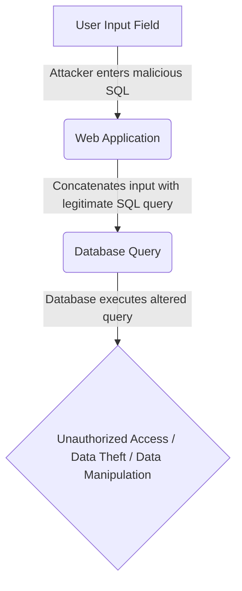
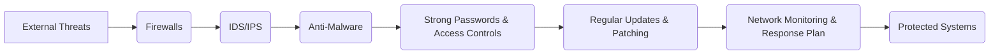
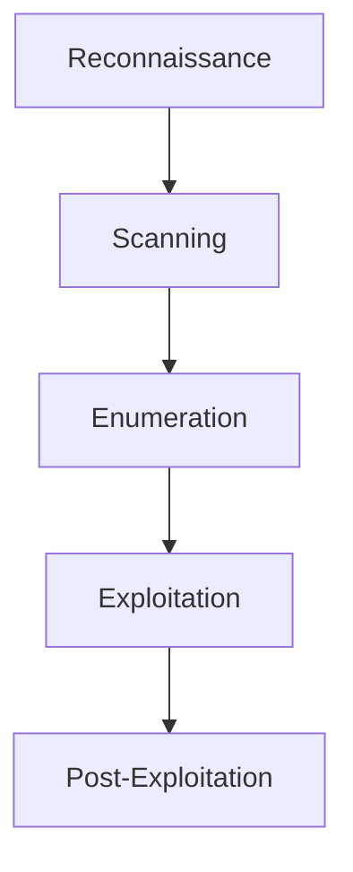
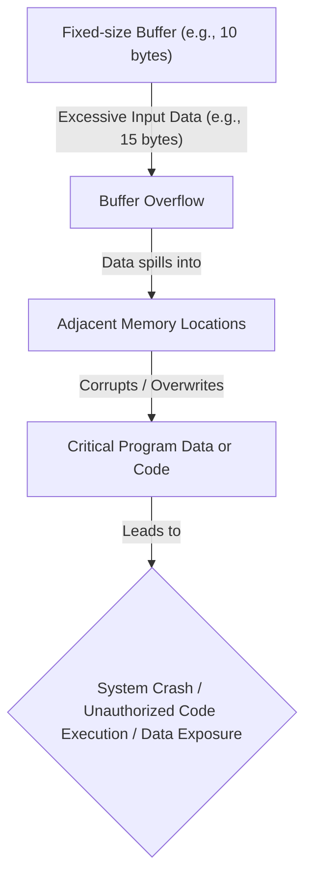
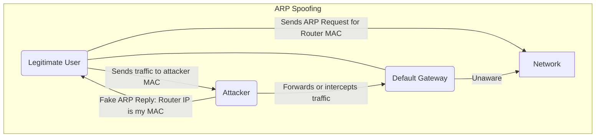

### 1. Explain SQL injection attack with an example.

**Definition:** An SQL injection (SQLi) attack is a common web security vulnerability that allows an attacker to interfere with the queries an application makes to its database. It involves the placement of malicious SQL code in SQL statements via web page input, which the server then executes without proper validation. This can lead to unauthorized data access, data theft, or complete data deletion.

**How it works (Mnemonic: I.M.P.):**
*   **I**nject: Malicious SQL code is inserted into input fields (e.g., username, search bar).
*   **M**anipulate: The application inadvertently concatenates this malicious input with its legitimate SQL query.
*   **P**roblem: The database executes the altered query, potentially revealing hidden data, bypassing authentication, or modifying/deleting data.

**Example:**
Consider a website with a login form where the server constructs an SQL query like this:
`SELECT * FROM Users WHERE UserId = '` *`txtUserId`* `'`

If a legitimate user enters `105`, the query becomes:
`SELECT * FROM Users WHERE UserId = '105'`

However, an attacker could enter a malicious string like `105 OR 1=1` into the `txtUserId` field. The SQL statement would then become:
`SELECT * FROM Users WHERE UserId = '105 OR 1=1'`

Since `1=1` is always true, this query will bypass the intended user ID check and return all rows from the `Users` table, allowing the attacker to gain unauthorized access to all usernames and passwords.

Another example involves using a semicolon to separate two fields, potentially deleting an entire user database. Or, using a `UNION SELECT` statement to combine two unrelated `SELECT` queries to retrieve data from different database tables, such as usernames and passwords from an `admin_users` table.

**Mermaid Diagram: SQL Injection Flow**



---

### 2. Which are the policies that an organization can adopt to prevent Denial of Service attacks?

Organizations can adopt several policies and measures to prevent Denial of Service (DoS) attacks:

**Mnemonic: F.I.S.H. M.U.S.H. (Firewall, IDS/IPS, Security patches, High bandwidth, Monitoring, Updates, Strong passwords, Hygiene)**

1.  **Use anti-malware protection:** Install reliable antivirus software to scan for and protect against malware.
2.  **Use firewalls:** Implement robust network firewall systems to add multiple layers of protection, block illegal access, scan incoming traffic, and limit insider threats.
3.  **Keep your software updated:** Regularly update software to patch new vulnerabilities and prevent cybercriminals from exploiting outdated systems, as seen in attacks like WannaCry.
4.  **Use strong passwords:** Enforce strong password policies to make it difficult for hackers to compromise systems.
5.  **Deploy Intrusion Detection and Prevention Systems (IDS/IPS):** These systems identify and prevent illegitimate activities and actively monitor network traffic to identify and block potential threats in real time.
6.  **Implement Strong Data Encryption:** Encrypt sensitive data both at rest and in transit to protect it even if intercepted.
7.  **Implement Strong Access Controls:** Restrict user access permissions to limit who can view or modify sensitive data.
8.  **Conduct Regular Vulnerability Assessments and Penetration Testing:** Identify system weaknesses and gaps in defenses before they can be exploited.
9.  **Implement Comprehensive Network Monitoring:** Continuously monitor network traffic to identify unusual activity and potential DDoS related traffic patterns, enabling early detection.
10. **Regular Updates and Patching:** Ensure all systems and applications are regularly updated and patched to address known vulnerabilities.

Other practices include:
*   **Install security patches** to minimize SYN flooding.
*   **Use Access Control Lists (ACLs)** to configure routers and block unauthorized traffic.
*   **Know your network's traffic patterns** to easily spot anomalies.
*   **Create a Denial of Service Response Plan** to detect, contain, and recover from attacks.
*   **Scale up bandwidth** to handle traffic spikes.
*   **Utilize DDoS protection services** and technologies like Content Delivery Networks (CDNs) and Web Application Firewalls (WAFs) to filter malicious traffic.
*   **Implement rate limiting** to restrict the number of requests a server accepts from a specific IP address within a timeframe.
*   **Educate employees** on cybersecurity best practices.

**Mermaid Diagram: DoS Prevention Layers**



---

### 3. Explain the steps involved in network hacking.

The steps involved in network hacking, especially within an ethical hacking context, typically follow a structured process.

**Mnemonic: R.S.E.E.P. (Reconnaissance, Scanning, Enumeration, Exploitation, Post-Exploitation)**

1.  **Reconnaissance (Footprinting):** This initial phase involves gathering as much information as possible about the target network without directly interacting with it (passive) or with direct interaction (active). Information collected includes IP addresses, domain names, network infrastructure, public information, and potential targets for social engineering.
    *   *Example:* Using WHOIS to obtain domain registration information or searching public databases.

2.  **Scanning:** In this phase, the ethical hacker uses network scanning tools to discover active systems, open ports, and services running on the target network. Techniques include port scanning, network mapping, and vulnerability scanning to identify potential entry points or weaknesses.
    *   *Example:* Identifying open ports and active services on the target system.

3.  **Enumeration:** Once active systems and services are identified, the ethical hacker attempts to gather more detailed information about those systems, such as user accounts, network shares, or system configurations. This helps in identifying potential vulnerabilities or misconfigurations that could be exploited.
    *   *Example:* Enumerating usernames, shares, and system information.

4.  **Exploitation (Gaining Access):** In this stage, the ethical hacker attempts to exploit identified vulnerabilities to gain unauthorized access or escalate privileges. Exploitation techniques may include using known exploits, social engineering, or password cracking. The objective is to validate the existence and severity of vulnerabilities.
    *   *Example:* Launching a full-fledged attack by exploiting exposed vulnerabilities to gain control.

5.  **Post-Exploitation (Maintaining Access & Covering Tracks):** After successfully exploiting a vulnerability and gaining access, ethical hackers explore the compromised system to understand the extent of the potential damage a malicious attacker could inflict. This also involves maintaining access for future use and covering tracks to avoid detection.
    *   *Example:* Deleting system logs, modifying file timestamps, or installing rootkits to maintain access and hide evidence.

**Mermaid Diagram: Network Hacking Steps**



---

### 4. What is buffer overflow attack? Illustrate with an example. Which programming languages are more vulnerable to buffer overflow attack? Explain how it can be prevented.

**Definition:** A buffer overflow (or buffer overrun) is a software coding error or vulnerability where a program attempts to write more data into a memory buffer than it can hold. This excess data overflows into adjacent memory locations, corrupting or overwriting existing data. Hackers can exploit this to gain unauthorized access, execute arbitrary code, or compromise the affected system.

**How it works (Mnemonic: O.C.A.):**
*   **O**verfill: Input data exceeds the allocated buffer size.
*   **C**orrupt: Excess data spills into and corrupts adjacent memory locations.
*   **A**lter: An attacker manipulates this to alter the program's execution path, inject malicious code, or expose data.

**Example:**
A common buffer overflow example occurs when code relies on external data and uses functions that do not perform bounds-checking.
Consider a C program with a buffer designed to hold a fixed number of characters:
```c
char buffer[10]; // Buffer designed to hold 10 bytes
gets(buffer);     // Unsafe function: reads input without checking size
```
If a user inputs a string longer than 9 characters (plus the null terminator), the `gets()` function will write the excess data beyond the allocated `buffer[10]` space, overflowing into adjacent memory. An attacker can exploit this by sending a specially crafted input that overwrites critical parts of the program's memory, such as the return address, to execute their own malicious code.

**Programming Languages More Vulnerable:**
*   **C and C++:** These languages are highly susceptible to buffer overflow attacks because they allow direct memory access and do not have built-in safeguards or automatic bounds checking for memory management. Most operating systems like Mac OSX, Windows, and Linux use code written in C and C++.
*   **Assembly and Fortran:** These languages are also particularly vulnerable.

Languages like Python, Java, JavaScript, C#, and Perl are generally less vulnerable because they have built-in safety mechanisms and automatic memory management that minimize the likelihood of buffer overflows, although their interpreters can still be affected by bugs.

**How it can be prevented (Mnemonic: S.A.D. P.R.O.P.):**
*   **S**ecure Coding Practices: Developers should build security measures into their development code.
*   **A**void Unsafe Functions: Avoid standard library functions like `gets()`, `scanf()`, and `strcpy()` that do not perform bounds-checking. Use safer alternatives like `strncpy()` or `fgets()`.
*   **D**ata Validation and Bounds Checking: Always validate input sizes and implement runtime bounds-checking to ensure data written to a buffer stays within its allocated boundaries.
*   **P**atch Software: Quickly patch software when buffer overflow vulnerabilities are discovered.
*   **R**untime Protections (OS-level): Modern operating systems deploy runtime protections:
    *   **Address Space Layout Randomization (ASLR):** Randomizes memory addresses, making it difficult for attackers to predict where executable code is located.
    *   **Data Execution Prevention (DEP):** Prevents code from running in non-executable memory regions.
    *   **Structured Exception Handling Overwrite Protection (SEHOP):** Protects against attackers overwriting structured exception handlers.
*   **O**rganizational Policies: Implement strong security policies and regular security audits.
*   **P**en testing: Conduct regular vulnerability assessments and penetration testing.

**Mermaid Diagram: Buffer Overflow Concept**



---

### 5. Explain any five malware attacks and different types of spoofing attacks in detail.

#### Five Malware Attacks

Malware, or malicious software, is designed to damage, steal, or control computer systems.

**Mnemonic for Malware: V.W.T.R.S. (Virus, Worm, Trojan, Ransomware, Spyware)**

1.  **Virus:**
    *   **Definition:** A malicious program that replicates by attaching itself to another program.
    *   **How it spreads:** Usually when an unsuspecting user runs an infected program or downloads an infected file, often via email attachments.
    *   **Functions:** Propagation and destruction.
    *   **Examples:** Melissa, Sasser, Zeus, Conficker, Stuxnet.

2.  **Worm:**
    *   **Definition:** A self-contained program designed to propagate without human intervention.
    *   **How it spreads:** Replicates on infected systems and uses available network connections to infect other systems, without attaching to an executable file.
    *   **Impact:** May delete files (e.g., ExploreZip worm), encrypt files (like ransomware), or disclose sensitive data.
    *   **Key Difference from Virus:** A worm propagates independently, while a virus requires attachment to an executable file.

3.  **Trojan Horse:**
    *   **Definition:** A malicious program or code fragment disguised as a legitimate program, covertly performing malicious functions.
    *   **Functions:** Destructive activities like modifying or replacing existing programs.
    *   **Examples:** Password grabbers, Exploit, Rootkit, Trojan-Banker, Trojan-DDoS, Trojan-Downloader, Trojan-Dropper, Trojan-GameThief.

4.  **Ransomware:**
    *   **Definition:** Malware that holds a computer or its resources hostage by encrypting files, demanding a ransom (usually in cryptocurrency like Bitcoin) for their release.
    *   **How it works:** Identifies drives on an infected system or network, encrypts files, and prevents legitimate users from gaining access. Often adds specific extensions to encrypted files (e.g., .micro, .encrypted, .locky, .petya).
    *   **Examples:** Cryptolocker, Locker, Bad Rabbit, Goldeneye, Zcryptor, Jigsaw, LeChiffre, Petya.

5.  **Spyware and Adware:**
    *   **Spyware Definition:** Malicious software that steals sensitive information from infected computers.
    *   **Spyware Impact:** Steals personal data like internet usage, credit card details, bank account info, and monitors user login/password information, sending it to advertisers or external users.
    *   **Adware Definition:** Monitors browser history and downloads to predict user interests for marketing purposes.
    *   **Adware Impact:** Can reduce computer performance.

#### Different Types of Spoofing Attacks

Spoofing is a type of cybercriminal activity where attackers disguise themselves as trusted sources by falsifying data to gain unauthorized access, steal information, or disrupt services. It relies on deception and impersonation to bypass defenses.

**Mnemonic for Spoofing: A.D.M. (ARP, DNS, MAC)**

1.  **ARP Spoofing (Address Resolution Protocol Poisoning):**
    *   **Definition:** Occurs when an attacker modifies the MAC (Media Access Control) address in the ARP cache of a target computer by inserting forged ARP request and reply packets.
    *   **How it works:** The attacker links their MAC address with the IP address of another computer (e.g., the default gateway), essentially "poisoning" the ARP cache. This can lead to man-in-the-middle (MitM) attacks, where the attacker intercepts traffic meant for other devices.
    *   **Impact:** Can obtain confidential information, be used in DoS and MitM attacks, or enable session hijacking.

2.  **DNS Spoofing (DNS Cache Poisoning):**
    *   **Definition:** An attack in which legitimate domain names are resolved into fake IP addresses.
    *   **How it works:** The attacker introduces malicious DNS data into a DNS server's cache, causing domain name queries to return an incorrect IP address. This diverts traffic meant for the victim's system to the attacker's system.
    *   **Impact:** Users are led to fake websites designed to steal information (e.g., banking credentials). It's difficult to detect as it evades firewalls or antiviruses.

3.  **MAC Spoofing:**
    *   **Definition:** Occurs when an attacker changes the MAC address of their computer to match the MAC address of a legitimate victim's machine.
    *   **How it works:** The attacker sends messages on the network using the victim's MAC address instead of their own. This can be used to bypass MAC-based authentication or filtering systems, allowing unauthorized access.

Other common types of spoofing include:
*   **IP Spoofing:** Attackers manipulate a packet's IP header to mask its source, bypassing IP filtering or impersonating another system. Often used in DDoS attacks.
*   **Email Spoofing:** Sending emails with a forged sender address to trick recipients into believing the email is from a trusted source, often for phishing.
*   **Website/URL Spoofing:** Creating a fake version of a legitimate website to steal login credentials or other sensitive information.

**Mermaid Diagram: ARP Spoofing**


