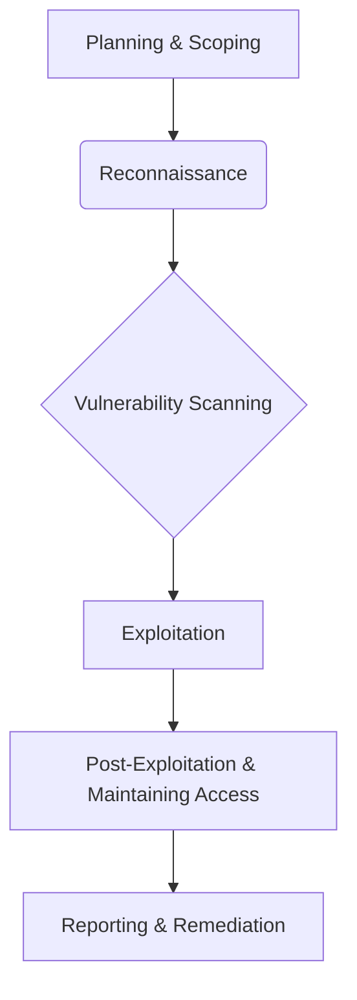
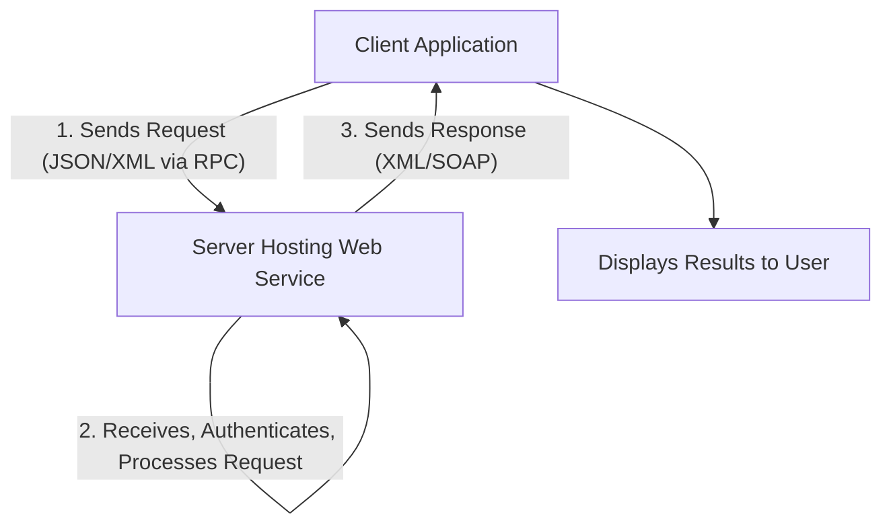
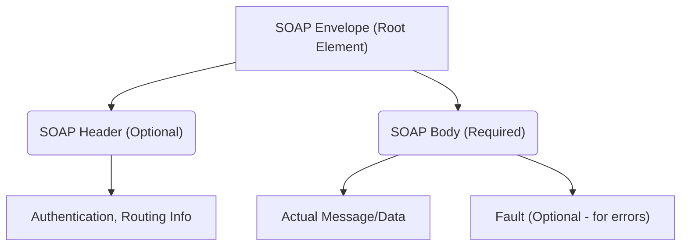
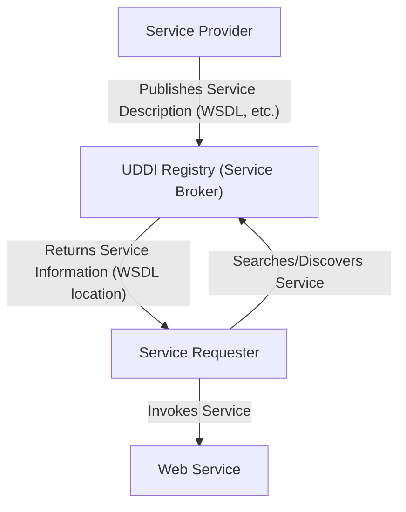
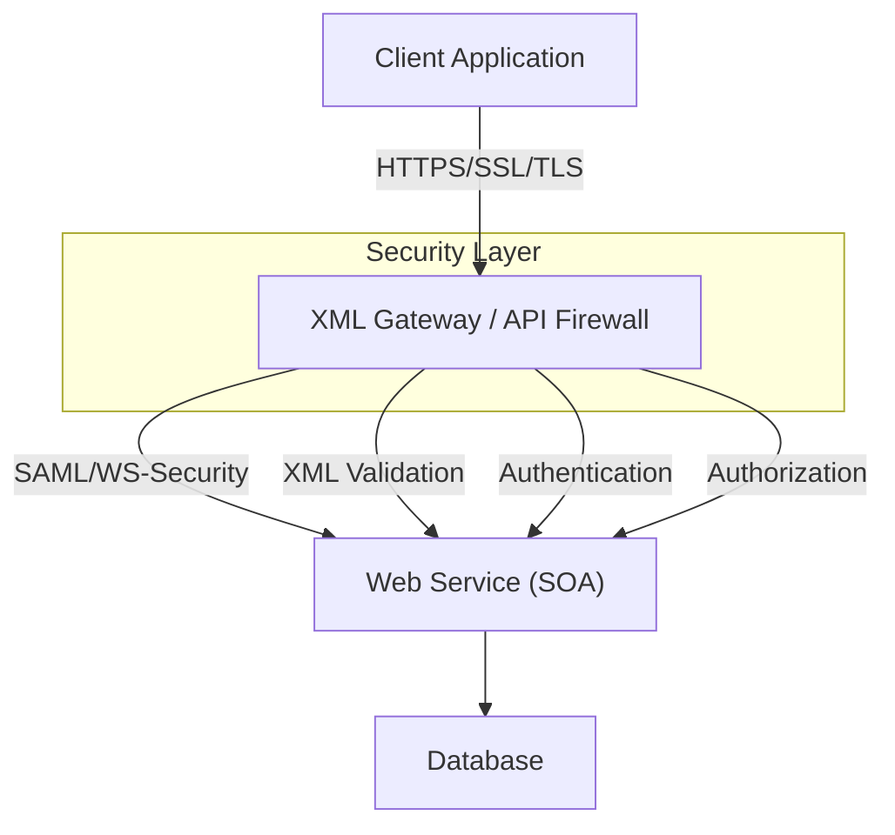
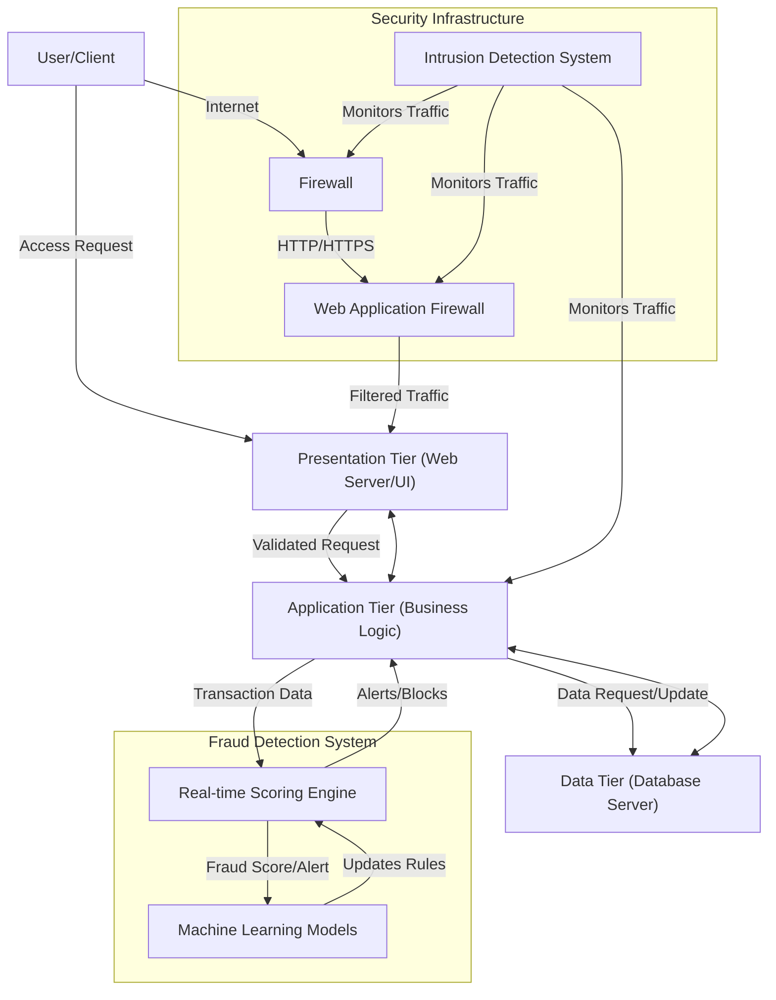
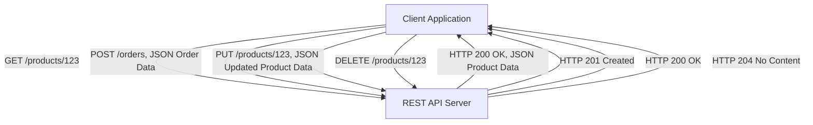
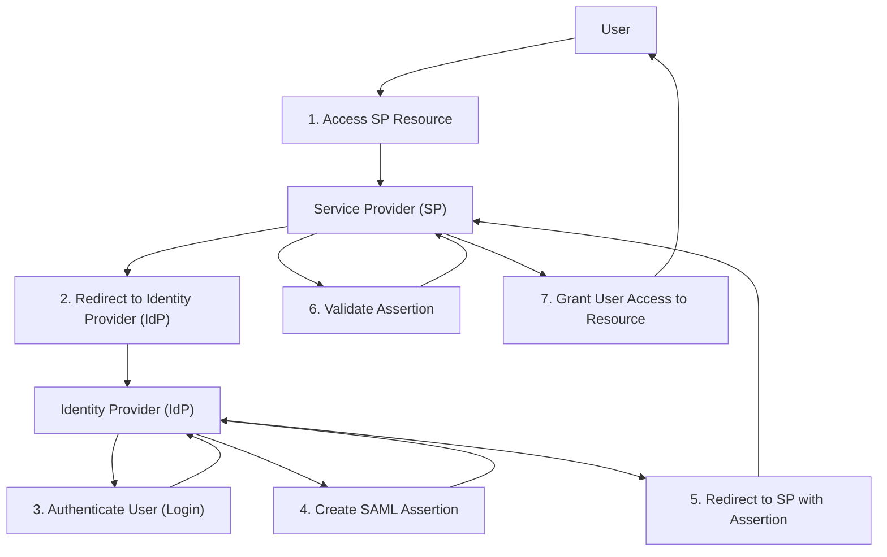

### 1. Challenges of Web Services

Web services, despite their advantages, face several challenges that can impact their performance, security, and overall effectiveness. These challenges include:

*   **Connectivity:** Web services rely heavily on network connectivity, making them vulnerable to bandwidth limitations, network unreliability, latency issues, and downtime.
*   **Overhead:** The standardized communication layers and protocols used by web services can introduce processing overhead, affecting communication performance and increasing resource consumption and operational costs.
*   **Complexity and Compatibility:** Building, implementing, and maintaining web services can be complex due to varied communication protocols, data formats, and security measures. Version control also adds to this complexity, often requiring applications to update over time.
*   **Security risks:** While security tools exist, improper implementation and testing can lead to privacy issues, data breaches, unauthorized use, and other attacks.
*   **Troubleshooting:** Web services create complex communication and data exchange environments, making troubleshooting difficult as problems can arise at the client, server, network, or within the web service itself.
*   **Vendor lock-in:** Relying on a third-party web service provider can lead to vendor lock-in, making it hard to switch to alternative services in the future.

**Mnemonic for Web Service Challenges: "COCATS V"**

*   **C**onnectivity
*   **O**verhead
*   **C**omplexity and Compatibility
*   **A**ttack (Security risks)
*   **T**roubleshooting
*   **S**ecurity risks
*   **V**endor lock-in

### 2. What is Penetration Testing?

Penetration testing, often referred to as pen testing or ethical hacking, is a proactive security assessment designed to identify and exploit vulnerabilities in computer systems, networks, or web applications before malicious actors can exploit them. It simulates real-world cyberattacks to assess an organization's security posture.

The primary objectives and goals of penetration testing are:

*   **Identify Security Vulnerabilities:** To uncover weaknesses in software, hardware, and network configurations.
*   **Assess Effectiveness of Security Measures:** To evaluate how well existing security controls (like firewalls, IDS, encryption, and access controls) perform under attack.
*   **Provide Actionable Insights:** To offer detailed reports on discovered vulnerabilities, their potential impact, and recommendations for remediation to improve overall security.
*   **Emulate Hackers:** At its most fundamental level, it aims to emulate a hacker by assessing the security strengths and weaknesses of a target network.
*   **Test Real-World Vulnerabilities:** A comprehensive pen test will surface and test for real-world vulnerabilities, such as open services, detected during a network security scan.

Different types of penetration tests exist, including internal (simulating an insider threat) and external (testing perimeter defenses from the internet).

**Mnemonic for Penetration Testing Goals: "IAPA TE"**

*   **I**dentify Security Vulnerabilities
*   **A**ssess Effectiveness of Security Measures
*   **P**rovide Actionable Insights
*   **A**ssess system's security posture (general objective)
*   **T**est Real-World Vulnerabilities
*   **E**mulate Hackers

**Mermaid Diagram for a Simplified Penetration Testing Process:**

### 3. What are the functions of an intrusion detection system?

An Intrusion Detection System (IDS) is a security tool that acts as a "watchdog" to monitor network traffic or system activities for suspicious inbound and outbound activity that could indicate malicious behavior or unauthorized access. Its purpose is to detect security breaches and alert the IT security team, rather than prevent the attack directly.

The key functions of an IDS include:

*   **Monitoring and analysis of user and system activity:** It continuously observes user behavior and system processes for anything unusual.
*   **Auditing of system configurations and vulnerabilities:** It checks for misconfigurations and known weaknesses in the system setup.
*   **Assessment of the integrity of critical system and data files:** It verifies that important files haven't been tampered with.
*   **Recognition of activity patterns reflecting known attacks:** It identifies malicious activity by comparing observed data against a database of known attack signatures.
*   **Statistical analysis for abnormal activity patterns:** It establishes a baseline of normal behavior and flags deviations from this norm as potential threats (anomaly-based detection).
*   **Operating system audit trail management:** It manages and reviews logs to recognize user activity that violates security policies.
*   **Alerting and Reporting:** When suspicious or malicious activity is detected, it triggers alerts and generates reports for administrators and security teams.

**Mnemonic for IDS Functions: "MACROS A"**

*   **M**onitoring user/system activity
*   **A**uditing configurations/vulnerabilities
*   **C**ritical file integrity assessment
*   **R**ecognition of known attack patterns
*   **O**perating system audit trail management
*   **S**tatistical analysis for abnormal patterns
*   **A**lerting and Reporting

### 4. What is a web service? Explain how a web service work.

A web service is a standardized method for propagating messages between client and server applications over the Internet. It is essentially a software module designed to carry out a specific set of functions, allowing different applications or systems, often written in various programming languages and running on diverse platforms, to exchange data via computer networks. Web services commonly use standardized web protocols like HTTP or HTTPS and typically exchange data messages using XML (Extensible Markup Language).

**Mnemonic for Web Service Definition: "SAD"**

*   **S**tandardized method for message propagation
*   **A**pplication-to-application data exchange
*   **D**ifferent platforms/languages interoperability

**How a Web Service Works:**

Web services typically operate using a client-server model, involving a three-step process:

1.  **Client Request:** The client application (e.g., running on a computer or mobile device) sends a request to the server that hosts the web service. This request includes details and data the web service needs, often in formats like JSON or XML. Remote Procedure Calls (RPC) are used to make these requests, essentially calling methods hosted by the web service.
2.  **Server Processing:** The server receives and authenticates the request. It then parses the required details, processes the request (e.g., accesses appropriate data or performs a computation), and generates results.
3.  **Server Response:** The server accesses the results and sends them back to the client application. The client application then displays these results in a suitable format and style.

For transmitting XML data, web services often employ SOAP (Simple Object Access Protocol) over standard HTTP. A SOAP message is an XML document containing the request or response data, structured with an "envelope" that includes a header (for routing data) and a body (for the actual message). WSDL (Web Services Description Language) is an XML-based file that describes what the web service does and how to connect to it, enabling client applications to understand and utilize the service.

**Mermaid Diagram for How a Web Service Works:**

### 5. Distinguish between NIDS and HIDS.

Network Intrusion Detection Systems (NIDS) and Host-Based Intrusion Detection Systems (HIDS) are both types of IDS, but they differ significantly in their deployment, data sources, and the scope of their monitoring.

| Feature           | NIDS (Network Intrusion Detection System)                                                                                                                                                                                                                                                                         | HIDS (Host-Based Intrusion Detection System)                                                                                                                                                                                                                                                                                                                                     |
| :---------------- | :------------------------------------------------------------------------------------------------------------------------------------------------------------------------------------------------------------------------------------------------------------------------------------------------------ | :------------------------------------------------------------------------------------------------------------------------------------------------------------------------------------------------------------------------------------------------------------------------------------------------------------------------------------------------------------------------------ |
| **Primary Focus** | Monitors and analyzes network traffic (raw network packets) across a network segment.                                                                                                                                                                                                | Monitors and analyzes activity on an individual host (computer or server).                                                                                                                                                                                                                                                                                     |
| **Deployment**    | Deployed at strategic points within the network (e.g., network adapter in promiscuous mode to capture all traffic on a segment). Can be dedicated hardware appliances or software on network servers.                                                                                   | Installed as software agents directly on the operating system of individual host devices (servers, desktops, laptops).                                                                                                                                                                                                                                          |
| **Data Source**   | Raw network packets, network traffic data.                                                                                                                                                                                                                                                                  | Host operating system audit trails, system logs (e.g., Windows NT system, event, and security logs; UNIX Syslog files), file integrity checks, process monitoring.                                                                                                                                                                                        |
| **Scope**         | Broad coverage of the network segment it's connected to. Detects external and internal network attacks.                                                                                                                                                                              | In-depth monitoring of the specific host it's installed on. Detects suspicious activity within the organization (e.g., malicious insiders) and malware originating from a host.                                                                                                                                                                         |
| **Strengths**     | - Detects network-based attacks, including new forms.   - Anomaly detectors can identify unusual behavior without specific attack knowledge.   - No modifications needed on production servers/hosts.   - Generally no negative impact on production services.   - Self-contained and easy to install.   - Broad coverage, external threat detection. | - Provides more detailed and relevant information from the host.   - Lower false-positive rates than network-based systems.   - Effective where broad intrusion detection isn't needed or bandwidth is limited for sensor communication.   - Less risky for active responses (e.g., terminating a service).   - In-depth monitoring and log analysis. |
| **Weaknesses**    | - Limited to the network segment it's directly connected to; cannot detect attacks on other segments.   - Can be expensive due to multiple sensors for coverage.   - Limited detection for complex information threats.   - Difficulty with encrypted sessions.   - Can generate false positives (anomaly detection).   - Misses threats not involving network activity. | - Requires installation on each device to be protected.   - Configuration changes on production machines can be a significant management problem.   - Relatively expensive per host.   - Ignorant of the broader network environment.   - Resource intensive on hosts.   - Can only monitor the host, not the whole network.         |

**Mnemonic for NIDS vs. HIDS Key Differences: "SPAN-DR"**

*   **S**cope (Network vs. Host)
*   **P**lacement (Strategic Network Points vs. Individual Host OS)
*   **A**nalysis (Traffic vs. Logs/System Activity)
*   **N**etwork impact (Minimal vs. Resource Intensive)
*   **D**etection (Broad vs. Deep, Local)
*   **R**eporting (Network-wide alerts vs. Host-specific details)

The user wants detailed explanations of several concepts related to web services, security, and fraud prevention, including mnemonics and Mermaid diagrams. I will address each question systematically, drawing from the provided text and supplementing with information from the search results to ensure completeness and accuracy.

---

### 6. Explain SOAP and UDDI in detail.

**a) Simple Object Access Protocol (SOAP)**

SOAP, originally an acronym for Simple Object Access Protocol, is an XML-based web service protocol used to transfer data using SOAP messages. It serves as a foundational application protocol for implementing web services within a Service-Oriented Architecture (SOA). Its primary purpose is to enable different programming languages and platforms to communicate quickly and with minimal effort, often using HTTP or SMTP as transport protocols. SOAP is platform-independent and language-independent, making it versatile for communication between diverse applications.

**Key Characteristics of SOAP:**
*   **XML-Based:** SOAP messages are entirely XML documents, ensuring structured data exchange.
*   **Highly Structured:** It defines a strict structure for messages, consisting of an Envelope, an optional Header, and a Body.
    *   **Envelope:** The root element that defines the message's start, end, and overall structure.
    *   **Header (optional):** Contains application-specific information like authentication, addressing, or routing details.
    *   **Body (required):** Carries the actual application message, including the invoked operation and exchanged data.
    *   **Fault (optional):** Reports any processing errors.
*   **Transport-Independent:** While commonly transported over HTTP or HTTPS, SOAP can also use other protocols like SMTP, FTP, or middleware messaging systems.
*   **Stateful:** SOAP uses WSDL to describe its web service model, defining how requests and responses are structured and incorporating well-defined security standards.
*   **Supports RPC:** SOAP allows remote invocation of functions or procedures on distributed systems, enabling complex distributed services.

**Mnemonic for SOAP Characteristics: "EXACTS"**
*   **E**nvelope-based (message structure)
*   **X**ML-Based
*   **A**pplication-level protocol (transports over HTTP, SMTP)
*   **C**ommunication between applications
*   **T**ransparent to platforms and languages
*   **S**tructured and **S**tateful

**Mermaid Diagram for SOAP Message Structure:**

**b) Universal Description, Discovery and Integration (UDDI)**

UDDI is an XML-based standard that lists and details what services are available in an application, making web services discoverable to other services and facilitating digital transactions and e-commerce. It acts as a distributed registry for web service descriptions, storing information about companies and their services in a standard XML format. UDDI is considered one of the three foundational standards of web services, alongside SOAP and WSDL.

**Key Functions and Components of UDDI:**
*   **Publishing:** Businesses publish information about their web services to a UDDI registry. This information typically includes "White Pages" (basic company info like name, address, contact), "Yellow Pages" (categorizing businesses by industry), and "Green Pages" (detailed technical info on how to invoke services, including binding information).
*   **Discovery:** Service requestors can query the UDDI registry to find web services based on specific criteria or categories, rather than needing to know the exact access details.
*   **Integration:** By providing a standardized way to describe services, UDDI facilitates the integration of web services into broader applications and systems.
*   **Repository for WSDL:** UDDI provides a repository where WSDL files can be hosted, allowing client applications to discover a WSDL file to learn about the various actions a web service offers.
*   **Types of Registries:** UDDI registries can be public (Universal Business Registries, accessible over the Internet) or private (internal to an organization, behind firewalls).

**Mnemonic for UDDI Functions: "P-D-I"**
*   **P**ublishing services
*   **D**iscovering services
*   **I**ntegrating services

**Mermaid Diagram for UDDI Interaction:**

---

### 7. Explain the Web Services Security for a Service Oriented Architecture. Also describe the characteristics of Web Services.

**a) Web Services Security for a Service Oriented Architecture (SOA)**

Web services are crucial for implementing Service-Oriented Architectures (SOAs), acting as the connection point and often utilizing XML for robust interaction. However, this interconnectedness introduces significant security concerns because SOA aims to eliminate application boundaries and technology differences, which can expose vulnerabilities more widely. Securing web services within an SOA is paramount, especially as they often expose critical business logic and sensitive data, thereby increasing the attack surface.

**Technical Security Concerns:**
*   **Transmission of Executables:** Web services can allow the hidden transmission of executables and other malicious content within message transactions.
*   **Cyber Attacks:** Web services are vulnerable to various cyber attacks, and security vendors are still maturing their defenses against these sophisticated threats.
*   **Improperly Secured Endpoints:** APIs and network services within SOA systems transmit critical business data. If endpoints are not properly secured, it can lead to breaches.
*   **Authentication and Authorization Challenges:** Complex, multi-service environments require robust token-based authentication systems.
*   **Service Chaining Risks:** Dependencies between multiple services mean that a weakness in one can lead to cascading failures if exploited.
*   **Message Interception and Tampering:** Unsecured communication can result in Man-in-the-Middle (MITM) attacks or XML message tampering.
*   **Service Registry Poisoning:** Malicious actors could alter service registries to redirect requests to rogue endpoints.
*   **Weak Access Control:** Overexposed endpoints with limited restrictions are easy targets.

**Major Groups Involved in Establishing Standards:**
*   **OASIS (Organization for the Advancement of Structured Information Standards):** A global consortium driving e-business standards, including WS-Security and SAML.
*   **W3C (World Wide Web Consortium):** Develops interoperable technologies and specifications, such as XML encryption, XML signature, and XKMS.
*   **Liberty Alliance:** Focuses on establishing open standards for federated network identity, with key standards including SAML.
*   **WS-I (Web Services Interoperability Organization):** Promotes web services interoperability across platforms and languages.

**Specific Web Services Security Solutions:**
*   **SSL (Secure Sockets Layer) / TLS (Transport Layer Security):** Network encryption and authentication mechanisms used in HTTPS to protect data in transit.
*   **HTTPS:** Secure form of HTTP using SSL/TLS for encrypted communication and server authentication.
*   **XML Digital Signature:** Ensures message integrity and provides non-repudiation.
*   **XKMS (XML Key Management Specification):** Aims to simplify public key infrastructure (PKI) for web services.
*   **Message-Level Authentication:** Includes HTTP basic and HTTP digest authentication.
*   **Security Assertion Markup Language (SAML):** An XML vocabulary for conveying trustworthy, digitally signed authentication and user credential information.
*   **XML Application Firewall:** A non-invasive solution deployed in front of XML or web services interfaces to enforce security.

**Mnemonic for WS-Security Concerns: "TEAM CSAW"**
*   **T**ransmission of Executables
*   **E**ndpoint (Improperly secured)
*   **A**ttacks (Cyber Attacks, MITM, XML injection)
*   **M**ismatches (Architectural, from Q8, but can lead to security gaps)
*   **C**onfidentiality (Lack of)
*   **S**ervice Chaining Risks
*   **A**uthentication/Authorization Challenges
*   **W**eak Access Control

**Mermaid Diagram for a Simplified WS-Security Architecture:**

**b) Characteristics of Web Services**

Web services are designed to facilitate machine-to-machine interaction over a network, offering a standardized, platform-independent, and flexible approach to integrating diverse systems.

Key characteristics include:
*   **XML-Based:** Web services use XML for data representation and transportation, enabling high interoperability by eliminating the need for specific networking, operating system, or platform bindings.
*   **Loosely Coupled:** A consumer of a web service is not directly tied to that service. This allows the web service interface to change over time without compromising the client's ability to interact, making software systems more manageable and enabling easier integration.
*   **Capability to be Synchronous or Asynchronous:** Web services can support both synchronous (client blocks and waits for immediate results) and asynchronous (client invokes a task and continues with other operations, getting results later) invocations. Asynchronous capability is crucial for loosely coupled systems.
*   **Coarse-Grained:** Web services typically expose coarse-grained services with sufficient commercial enterprise logic, rather than fine-grained individual methods.
*   **Supports Remote Procedural Call (RPC):** Consumers can use an XML-based protocol to call procedures, functions, and methods on remote objects, with the web service supporting the input and output framework exposed by remote systems.
*   **Supports Document Exchanges:** Web services facilitate the simple exchange of archives and complex entities (documents) aiding in integration.
*   **Interoperability:** They enable systems built on different platforms, languages, or technologies to communicate and work together effortlessly.
*   **Standardized Protocol:** Web services communicate via defined industry protocols across all layers (Service Transport, XML Messaging, Service Description, and Service Discovery).
*   **Low Cost of Communication:** By employing SOAP over HTTP, web services can leverage existing low-cost internet connections.
*   **Modular and Reusable:** Web services are modular components that can be used independently or aggregated to form more complex services, promoting software reusability.
*   **Self-Contained:** No additional software is needed on the client side other than a programming language with XML and HTTP support.
*   **Self-Describing:** They use XML semantics (like WSDL) to provide all necessary information for invocation.
*   **Discoverable:** Through mechanisms like UDDI.
*   **Platform-Independent:** Not specific to one programming language or operating system.
*   **UI-Independent:** Designed for programmatic access, not for human interaction through a graphical interface.

**Mnemonic for Web Service Characteristics: "CLOAC SIRS PUD"**
*   **C**oarse-Grained
*   **L**oosely Coupled
*   **O**pen Standards / Protocols
*   **A**synchronous/Synchronous
*   **C**ommunication (Low Cost)
*   **S**upports RPC
*   **I**nteroperable
*   **R**eusable / Modular
*   **S**elf-describing / Self-contained
*   **P**latform-independent
*   **U**I-independent
*   **D**ocument Exchange
*   **X**ML-Based (add X to make it CLOAC SIRS PUDX)

---

### 8. Illustrate the architecture strategies for computer fraud prevention.

Computer fraud prevention requires a robust architectural design that considers various components and strategies to mitigate risks. The information technology infrastructure itself, with its unique security risks and controls, forms the foundation for these strategies.

**Components of an Information Technology Infrastructure (Relevant to Fraud Prevention):**
*   **Firewall:** Various types, including Packet Filter, Packet Inspection, Application Gateway, Circuit Level Gateway, and Proxy Server, control network traffic and restrict unauthorized access.
*   **Router:** Directs network traffic.
*   **Host/Server/PC Workstation:** Individual computing devices that can be targets or sources of fraud.
*   **Intrusion Detection Systems (IDS):** Monitor for suspicious activity.

**Architectural Strategies to Prevent and Detect Computer Fraud (ICF - Insider Computer Fraud):**

1.  **Scalability:** The ease with which system processing capacity, throughput, or transactions can be increased or decreased over time. A scalable system can handle increased load without performance degradation, which is important for real-time fraud detection.
2.  **Replication:** Adding processing resources that replicate and share part of the workload. This ensures high availability and can distribute the load, making the system more resilient to attacks.
3.  **Clustering:** Physically centralizing resources but logically distributing the processing load. This can improve performance and fault tolerance.
4.  **Locality of Decision-Making Authority:** Distributing the ability to affect modification while centralizing the decision for which modifications to incorporate. This can prevent single points of failure and ensure consistent policy enforcement.
5.  **Adaptability:** The ease with which the existing architectural design or configuration can be updated to respond to changing conditions, performance congestion, security attacks, and so forth. This is crucial for evolving fraud patterns.
6.  **Mitigating Architectural Mismatches:** Ensuring that system components can interconnect and exchange data seamlessly to avoid vulnerabilities arising from incompatible systems.
7.  **Architectural Security Gaps:** Proactively identifying and closing architectural security gaps that could allow unauthorized access or update capabilities to system resources.
8.  **Component-Based:** Configuring the architecture using separable, independent components. This promotes modularity and makes it easier to secure individual parts of the system.
9.  **Multitier Architecture:** Configuring the architecture into distinct tiers that separate the user interface, network access gateways (e.g., web servers, security firewalls), and data storage/retrieval repositories. This isolation enhances security by compartmentalizing different functionalities.

**Mnemonic for Architectural Strategies for Fraud Prevention: "SCALM CAMM"** (Scalability, Clustering, Adaptability, Locality, Mismatches, Components, Architectural Security Gaps, Multitier)

**Mermaid Diagram for a Multi-Tier Architecture with Fraud Prevention Elements:**

---

### 9. Explain the factors to be considered while assessing the risk in web services.

Assessing risk in web services is a crucial part of securing a Service-Oriented Architecture (SOA) given that web services often handle sensitive data and are exposed over networks. The risk assessment process should identify, evaluate, and prioritize potential security threats and vulnerabilities. When conducting a risk assessment for web services, several key factors need to be considered:

1.  **Authentication:**
    *   **Credential Binding:** How credentials (e.g., username/password, tokens) are securely bound to the web services request.
    *   **Credential Type:** The strength and type of credentials used (e.g., strong passwords, multi-factor authentication).
    *   **Session Token Usage:** Whether session tokens are used, how they are generated, managed, and validated to prevent session hijacking.
    *   **Authentication Processing:** Where and how authentication is performed (e.g., at the web service layer, through an identity provider).

2.  **Authorization:**
    *   **Authorization Policy Richness:** The granularity and complexity of the authorization policy, ranging from simple implied entitlements to complex policy-based and instance-based authorization.
    *   **Authorization Enforcement Point:** Where authorization decisions are made and enforced within the web service architecture.

3.  **Administration:**
    *   **Web Services Administration:** Determining appropriate administrative controls and processes for managing web services.
    *   **Infrastructure Security:** Ensuring that the underlying software infrastructure elements (e.g., operating systems, databases, network components) supporting the web services are also secure. This includes a comprehensive approach that secures not just the web service tier but also its dependencies.

4.  **Security Infrastructure Integration (Federation):**
    *   **Business Partner Trust:** The need for a security infrastructure that enables business partners or divisions within an enterprise to recognize and trust each other's users. This often involves federated identity management solutions (e.g., SAML for SSO).

5.  **Data Confidentiality and Integrity:**
    *   **Data in Transit:** Risks of data being intercepted or modified during transmission (e.g., Man-in-the-Middle attacks). This requires strong encryption (HTTPS/TLS).
    *   **Data at Rest:** Protection of sensitive data stored by the web service.
    *   **XML Vulnerabilities:** Risks associated with XML data, such as XML injection or SOAP tampering.

6.  **Availability:**
    *   **Denial of Service (DoS) / Distributed Denial of Service (DDoS) Attacks:** Web services must be resilient to attacks aiming to make them unavailable.
    *   **Network Connectivity Issues:** Dependence on network reliability and bandwidth can impact availability.

7.  **Vulnerabilities in Web Service Implementation:**
    *   **Coding Errors:** Flaws in the web service code itself (e.g., SQL injection, cross-site scripting, improper error handling).
    *   **Configuration Weaknesses:** Misconfigurations in web servers, application servers, or web service settings.
    *   **Dependency Vulnerabilities:** Weaknesses in third-party libraries or components used by the web service.

8.  **Logging and Monitoring:**
    *   **Insufficient Logging:** Lack of adequate logging can create blind spots, making it difficult to detect unusual activity or breaches.
    *   **Monitoring Effectiveness:** The ability to effectively monitor web service activity for suspicious patterns.

**Mnemonic for Web Services Risk Assessment Factors: "AAAS DVL"**
*   **A**uthentication
*   **A**uthorization
*   **A**dministration
*   **S**ecurity Infrastructure Integration (Federation)
*   **D**ata Confidentiality & Integrity
*   **V**ulnerabilities (Implementation)
*   **L**ogging & Monitoring

---

### 10. Explain REST and WSDL and SAML in detail.

**a) Representational State Transfer (REST)**

REST is an architectural style for designing networked applications, particularly web services, that emphasizes a stateless, client-server communication model. It leverages existing web standards and protocols, most notably HTTP, for communication. A REST API, conforming to REST principles, allows clients to access and manipulate resources using a predefined set of stateless operations. Resources can be any piece of information (e.g., a user, product, document) identifiable by a URL.

**Key Characteristics and Principles of REST:**
*   **Client-Server Architecture:** Separation of concerns between client and server, allowing independent development and evolution.
*   **Statelessness:** Each request from client to server must contain all the information needed to understand the request, and the server should not store any client context between requests.
*   **Cacheable:** Responses from a server can be cached by clients to improve performance and network efficiency.
*   **Uniform Interface:** A standardized way for clients to interact with resources, simplifying the overall architecture. This includes:
    *   **Resource Identification:** Resources are identified by URIs.
    *   **Resource Manipulation through Representations:** Clients interact with resources by exchanging representations (e.g., JSON, XML).
    *   **Self-Descriptive Messages:** Each message contains enough information to describe how to process the message.
    *   **Hypermedia as the Engine of Application State (HATEOAS):** Resources include links to other related resources, guiding the client through the application state.
*   **Layered System:** Components can be organized in hierarchical layers, where each layer cannot see beyond its immediate layer.
*   **Code-on-Demand (Optional):** Servers can temporarily extend or customize the functionality of a client by transferring executable code.

**How REST APIs work:**
REST APIs communicate through HTTP requests to perform standard database functions like creating, reading, updating, and deleting records (CRUD) within a resource.
*   **GET:** Retrieves a resource.
*   **POST:** Creates a new resource.
*   **PUT:** Updates an existing resource (or creates if it doesn't exist).
*   **DELETE:** Deletes a resource.

Data is transferred as a "representation" of the state of the resource, commonly in JSON or XML format.

**Mnemonic for REST Principles: "CLS HUN"** (Client-Server, Stateless, Cacheable, Uniform Interface, Layered System, (Optional) Code on Demand)

**Mermaid Diagram for RESTful API Interaction:**

**b) Web Services Description Language (WSDL)**

WSDL is an XML-based interface description language used for describing the functionality offered by a web service. It acts as a contract between the service provider and the service requester, outlining how to communicate with the service, what operations are available, and what input and output they require.

**Key Aspects of WSDL:**
*   **XML Format:** WSDL documents are written in XML, providing a machine-readable description of the web service.
*   **Interface Description:** It specifies the operations (methods) a service provides, the data types of messages it sends and receives, the communication protocols it supports, and the network address (endpoint) of the service.
*   **Separation of Concerns:** WSDL separates the abstract definition of operations and messages from their concrete network deployment or data format bindings, allowing for reuse of abstract definitions.
*   **Interoperability:** WSDL promotes interoperability by providing a standardized, machine-readable format that allows applications developed in different programming languages and on various platforms to communicate seamlessly.
*   **Usage:** A client application uses the WSDL document to understand where the web service is located and how to use it, enabling correct invocation of the service.

**Mnemonic for WSDL Purpose: "DOCS"**
*   **D**escribe (functionality)
*   **O**perations (what it does)
*   **C**onnect (how to connect)
*   **S**tructure (of messages)

**c) Security Assertion Markup Language (SAML)**

SAML is an XML-based open standard for exchanging authentication and authorization data between an identity provider (IdP) and a service provider (SP). Its primary role in online security is to enable single sign-on (SSO) by allowing users to access multiple web applications using one set of login credentials.

**How SAML Works:**
1.  **User attempts to access a service provider (SP):** The user tries to access a web application.
2.  **SP redirects to Identity Provider (IdP):** The SP recognizes that the user needs to be authenticated and redirects the user's browser to the IdP.
3.  **User authenticates with IdP:** The IdP authenticates the user (e.g., by checking username/password).
4.  **IdP generates SAML Assertion:** Upon successful authentication, the IdP creates a digitally signed SAML assertion (an XML document) containing authentication, attribute, and authorization information about the user.
5.  **IdP redirects back to SP with Assertion:** The IdP sends the SAML assertion back to the SP.
6.  **SP validates Assertion and grants access:** The SP verifies the digital signature of the assertion and its contents. If valid, the SP grants the user access to the requested application without requiring another login.

SAML is a technology for user authentication, telling an SP *who* a user is and that their identity has been confirmed. It is not directly for user authorization (what actions they are allowed to perform), though it can carry authorization information as attributes.

**Mnemonic for SAML Function: "AIS SSO"**
*   **A**uthentication
*   **I**dentity Provider
*   **S**ervice Provider
*   **S**ingle **S**ign-**O**n
*   **X**ML-Based (add X to make it AIS SSOX)

**Mermaid Diagram for SAML SSO Flow:**

