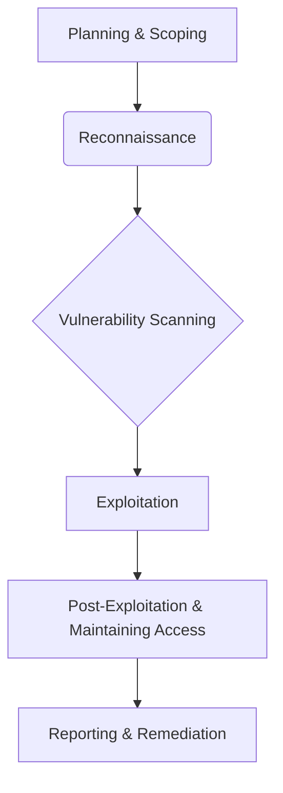
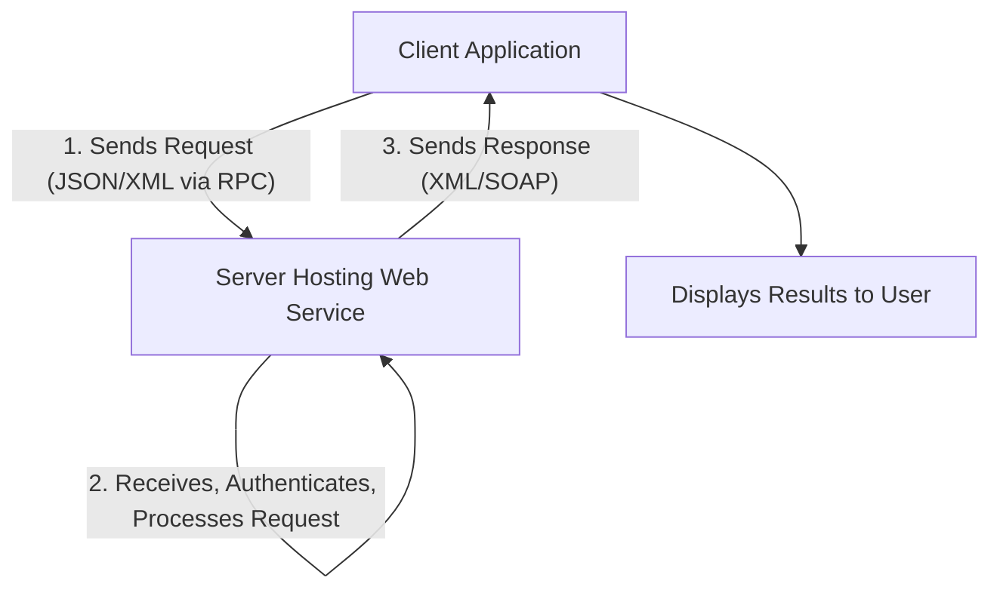

### 1. Challenges of Web Services

Web services, despite their advantages, face several challenges that can impact their performance, security, and overall effectiveness. These challenges include:

*   **Connectivity:** Web services rely heavily on network connectivity, making them vulnerable to bandwidth limitations, network unreliability, latency issues, and downtime.
*   **Overhead:** The standardized communication layers and protocols used by web services can introduce processing overhead, affecting communication performance and increasing resource consumption and operational costs.
*   **Complexity and Compatibility:** Building, implementing, and maintaining web services can be complex due to varied communication protocols, data formats, and security measures. Version control also adds to this complexity, often requiring applications to update over time.
*   **Security risks:** While security tools exist, improper implementation and testing can lead to privacy issues, data breaches, unauthorized use, and other attacks.
*   **Troubleshooting:** Web services create complex communication and data exchange environments, making troubleshooting difficult as problems can arise at the client, server, network, or within the web service itself.
*   **Vendor lock-in:** Relying on a third-party web service provider can lead to vendor lock-in, making it hard to switch to alternative services in the future.

**Mnemonic for Web Service Challenges: "COCATS V"**

*   **C**onnectivity
*   **O**verhead
*   **C**omplexity and Compatibility
*   **A**ttack (Security risks)
*   **T**roubleshooting
*   **S**ecurity risks
*   **V**endor lock-in

### 2. What is Penetration Testing?

Penetration testing, often referred to as pen testing or ethical hacking, is a proactive security assessment designed to identify and exploit vulnerabilities in computer systems, networks, or web applications before malicious actors can exploit them. It simulates real-world cyberattacks to assess an organization's security posture.

The primary objectives and goals of penetration testing are:

*   **Identify Security Vulnerabilities:** To uncover weaknesses in software, hardware, and network configurations.
*   **Assess Effectiveness of Security Measures:** To evaluate how well existing security controls (like firewalls, IDS, encryption, and access controls) perform under attack.
*   **Provide Actionable Insights:** To offer detailed reports on discovered vulnerabilities, their potential impact, and recommendations for remediation to improve overall security.
*   **Emulate Hackers:** At its most fundamental level, it aims to emulate a hacker by assessing the security strengths and weaknesses of a target network.
*   **Test Real-World Vulnerabilities:** A comprehensive pen test will surface and test for real-world vulnerabilities, such as open services, detected during a network security scan.

Different types of penetration tests exist, including internal (simulating an insider threat) and external (testing perimeter defenses from the internet).

**Mnemonic for Penetration Testing Goals: "IAPA TE"**

*   **I**dentify Security Vulnerabilities
*   **A**ssess Effectiveness of Security Measures
*   **P**rovide Actionable Insights
*   **A**ssess system's security posture (general objective)
*   **T**est Real-World Vulnerabilities
*   **E**mulate Hackers

**Mermaid Diagram for a Simplified Penetration Testing Process:**

### 3. What are the functions of an intrusion detection system?

An Intrusion Detection System (IDS) is a security tool that acts as a "watchdog" to monitor network traffic or system activities for suspicious inbound and outbound activity that could indicate malicious behavior or unauthorized access. Its purpose is to detect security breaches and alert the IT security team, rather than prevent the attack directly.

The key functions of an IDS include:

*   **Monitoring and analysis of user and system activity:** It continuously observes user behavior and system processes for anything unusual.
*   **Auditing of system configurations and vulnerabilities:** It checks for misconfigurations and known weaknesses in the system setup.
*   **Assessment of the integrity of critical system and data files:** It verifies that important files haven't been tampered with.
*   **Recognition of activity patterns reflecting known attacks:** It identifies malicious activity by comparing observed data against a database of known attack signatures.
*   **Statistical analysis for abnormal activity patterns:** It establishes a baseline of normal behavior and flags deviations from this norm as potential threats (anomaly-based detection).
*   **Operating system audit trail management:** It manages and reviews logs to recognize user activity that violates security policies.
*   **Alerting and Reporting:** When suspicious or malicious activity is detected, it triggers alerts and generates reports for administrators and security teams.

**Mnemonic for IDS Functions: "MACROS A"**

*   **M**onitoring user/system activity
*   **A**uditing configurations/vulnerabilities
*   **C**ritical file integrity assessment
*   **R**ecognition of known attack patterns
*   **O**perating system audit trail management
*   **S**tatistical analysis for abnormal patterns
*   **A**lerting and Reporting

### 4. What is a web service? Explain how a web service work.

A web service is a standardized method for propagating messages between client and server applications over the Internet. It is essentially a software module designed to carry out a specific set of functions, allowing different applications or systems, often written in various programming languages and running on diverse platforms, to exchange data via computer networks. Web services commonly use standardized web protocols like HTTP or HTTPS and typically exchange data messages using XML (Extensible Markup Language).

**Mnemonic for Web Service Definition: "SAD"**

*   **S**tandardized method for message propagation
*   **A**pplication-to-application data exchange
*   **D**ifferent platforms/languages interoperability

**How a Web Service Works:**

Web services typically operate using a client-server model, involving a three-step process:

1.  **Client Request:** The client application (e.g., running on a computer or mobile device) sends a request to the server that hosts the web service. This request includes details and data the web service needs, often in formats like JSON or XML. Remote Procedure Calls (RPC) are used to make these requests, essentially calling methods hosted by the web service.
2.  **Server Processing:** The server receives and authenticates the request. It then parses the required details, processes the request (e.g., accesses appropriate data or performs a computation), and generates results.
3.  **Server Response:** The server accesses the results and sends them back to the client application. The client application then displays these results in a suitable format and style.

For transmitting XML data, web services often employ SOAP (Simple Object Access Protocol) over standard HTTP. A SOAP message is an XML document containing the request or response data, structured with an "envelope" that includes a header (for routing data) and a body (for the actual message). WSDL (Web Services Description Language) is an XML-based file that describes what the web service does and how to connect to it, enabling client applications to understand and utilize the service.

**Mermaid Diagram for How a Web Service Works:**

### 5. Distinguish between NIDS and HIDS.

Network Intrusion Detection Systems (NIDS) and Host-Based Intrusion Detection Systems (HIDS) are both types of IDS, but they differ significantly in their deployment, data sources, and the scope of their monitoring.

| Feature           | NIDS (Network Intrusion Detection System)                                                                                                                                                                                                                                                                         | HIDS (Host-Based Intrusion Detection System)                                                                                                                                                                                                                                                                                                                                     |
| :---------------- | :------------------------------------------------------------------------------------------------------------------------------------------------------------------------------------------------------------------------------------------------------------------------------------------------------ | :------------------------------------------------------------------------------------------------------------------------------------------------------------------------------------------------------------------------------------------------------------------------------------------------------------------------------------------------------------------------------ |
| **Primary Focus** | Monitors and analyzes network traffic (raw network packets) across a network segment.                                                                                                                                                                                                | Monitors and analyzes activity on an individual host (computer or server).                                                                                                                                                                                                                                                                                     |
| **Deployment**    | Deployed at strategic points within the network (e.g., network adapter in promiscuous mode to capture all traffic on a segment). Can be dedicated hardware appliances or software on network servers.                                                                                   | Installed as software agents directly on the operating system of individual host devices (servers, desktops, laptops).                                                                                                                                                                                                                                          |
| **Data Source**   | Raw network packets, network traffic data.                                                                                                                                                                                                                                                                  | Host operating system audit trails, system logs (e.g., Windows NT system, event, and security logs; UNIX Syslog files), file integrity checks, process monitoring.                                                                                                                                                                                        |
| **Scope**         | Broad coverage of the network segment it's connected to. Detects external and internal network attacks.                                                                                                                                                                              | In-depth monitoring of the specific host it's installed on. Detects suspicious activity within the organization (e.g., malicious insiders) and malware originating from a host.                                                                                                                                                                         |
| **Strengths**     | - Detects network-based attacks, including new forms.   - Anomaly detectors can identify unusual behavior without specific attack knowledge.   - No modifications needed on production servers/hosts.   - Generally no negative impact on production services.   - Self-contained and easy to install.   - Broad coverage, external threat detection. | - Provides more detailed and relevant information from the host.   - Lower false-positive rates than network-based systems.   - Effective where broad intrusion detection isn't needed or bandwidth is limited for sensor communication.   - Less risky for active responses (e.g., terminating a service).   - In-depth monitoring and log analysis. |
| **Weaknesses**    | - Limited to the network segment it's directly connected to; cannot detect attacks on other segments.   - Can be expensive due to multiple sensors for coverage.   - Limited detection for complex information threats.   - Difficulty with encrypted sessions.   - Can generate false positives (anomaly detection).   - Misses threats not involving network activity. | - Requires installation on each device to be protected.   - Configuration changes on production machines can be a significant management problem.   - Relatively expensive per host.   - Ignorant of the broader network environment.   - Resource intensive on hosts.   - Can only monitor the host, not the whole network.         |

**Mnemonic for NIDS vs. HIDS Key Differences: "SPAN-DR"**

*   **S**cope (Network vs. Host)
*   **P**lacement (Strategic Network Points vs. Individual Host OS)
*   **A**nalysis (Traffic vs. Logs/System Activity)
*   **N**etwork impact (Minimal vs. Resource Intensive)
*   **D**etection (Broad vs. Deep, Local)
*   **R**eporting (Network-wide alerts vs. Host-specific details)
