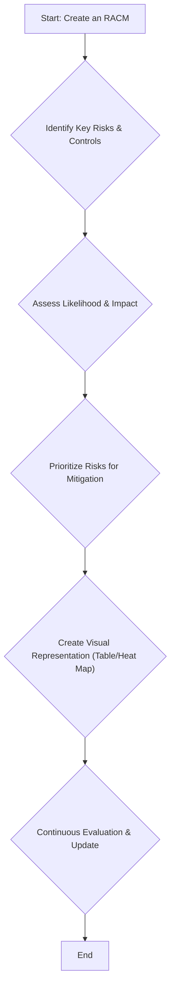
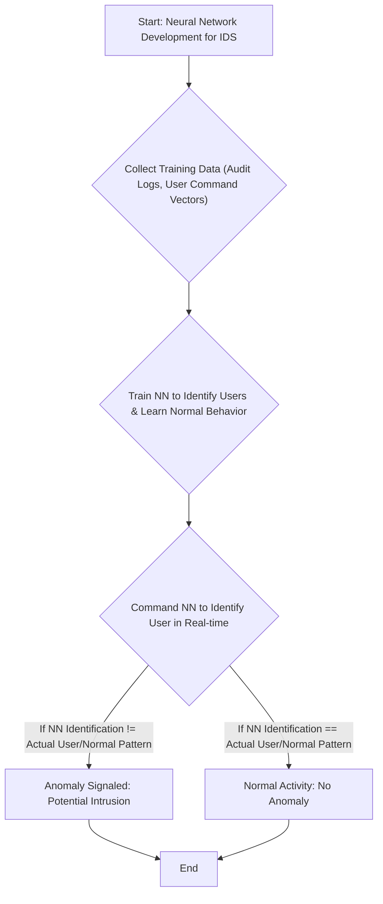
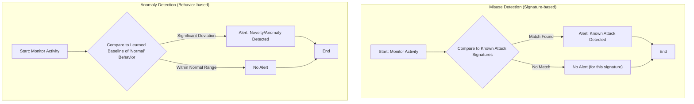

### 1. Computer Forensics and Journaling Requirements

**Computer Forensics** is a field of technology that employs investigative techniques to identify, preserve, and analyze digital evidence from various sources like computers, mobile devices, and networks. This evidence is often used in legal proceedings.

**Key Requirements for Effective Computer Forensics Journaling:**

Journaling, or detailed documentation, is paramount in computer forensics to ensure the integrity and admissibility of evidence.

**Mnemonic for Journaling Requirements: CSI-RCL**

*   **C**hain of Custody: Maintains a clear record of who handled evidence, when, and how.
*   **S**pecific Details: Each entry must include:
    *   **W**ho: The person performing the action.
    *   **W**hat: Description of the action taken.
    *   **W**hen: Date and time of the action.
    *   **W**here: Location of the action.
    *   **W**hy: Reason for performing the action.
    *   **H**ow: Tools, methods, and procedures used.
    *   **R**esults: Outcome of the action.
*   **I**ntegrity: Guarantees evidence remains unaltered and untampered.
*   **R**eproducibility & Re-analysis: Allows other experts to review and potentially re-analyze the investigation process.
*   **C**hronological Order: All entries recorded in the order they occurred.
*   **L**egal Admissibility: Ensures documentation meets legal requirements for court acceptance.

### 2. Building a Risk Control Matrix (RACM) and Implementation Challenges

A **Risk and Control Matrix (RACM)** is a structured framework for evaluating the likelihood and impact of potential risks and implementing appropriate controls to mitigate them.

**Steps to Create an RACM:**

**Mnemonic: IRPC-CE**

1.  **I**dentify Key Risks and Controls: Brainstorm potential risks and existing controls, reviewing documentation and using risk estimation tools.
2.  **A**ssess Likelihood and Impact of Risks: Define clear criteria (low, medium, high) for probability and impact, then combine these to create a risk matrix.
3.  **P**rioritize Risks for Mitigation: Assign scores based on likelihood and impact, focusing resources on high-priority risks.
4.  **C**reate a Visual Representation of the RACM: Organize information in a table with columns for risk description, likelihood, impact, controls, owner, and status. Use color-coding and risk heat maps for clarity.
5.  **C**ontinuous Evaluation: Regularly review and update the RACM to reflect organizational changes, regulatory updates, and emerging risks.

**Common Challenges in RACM Implementation:**

**Mnemonic: DR. FR**

1.  **D**ata Quality and Availability: Inaccurate or incomplete data compromises risk evaluations. Establish strict data management policies and regular audits.
2.  **R**esistance to Change and Stakeholder Scepticism: Employees and management may resist new systems. Conduct educational sessions and involve stakeholders from early stages.
3.  **F**requent Updates Required: Keeping the RACM up-to-date is resource-intensive. Set a regular review schedule and assign team members for updates.
4.  **R**esource Limitations in Risk Prioritization: Focus resources on high-priority risks and gradually expand.

**Mermaid Diagram: RACM Creation Process**

### 3. Different Types of Computer Forensics

**Mnemonic: CNMM-EM**

*   **C**omputer Forensics: Investigates data from computers and related devices.
*   **N**etwork Forensics: Investigates suspicious activities and events related to digital networks.
*   **M**obile Device Forensics: Focuses on mobile devices like smartphones and tablets.
*   **M**emory Forensics: Analyzes computer memory to investigate cyberattacks and other incidents.
*   **E**mail Forensics: Investigates and recovers evidence from email systems and services.
*   **M**edia Forensics: Confirms the legitimacy of multimedia files (pictures, videos, audio).

### 4. Benefits of Using a Risk and Control Matrix (RACM)

Utilizing an RACM provides a structured approach to risk management, offering several crucial benefits.

**Mnemonic: I'M ICE**

1.  **I**mproved Risk Visibility and Management: Provides a clear overview of potential threats and helps develop targeted control measures.
2.  **M**ore Objective Decision-Making: Aids informed decisions on resource allocation and mitigation based on understanding risk likelihood and impact.
3.  **I**ncreased Compliance: Helps ensure adherence to relevant regulations and standards, reducing fines and penalties.
4.  **C**ontrol Effectiveness Enhanced: Identifies gaps in control activities and ensures controls align with risks.
5.  **E**ffective Communication: Provides a common language and framework for discussing risks and controls across the organization.

### 5. Comparing Misuse Detection and Novelty Detection

These two detection methods, often employing Neural Networks (NNs), serve distinct purposes in identifying threats.

| Feature         | Misuse Detection Using Neural Networks                                  | Novelty Detection Using Neural Networks                                |
| :-------------- | :---------------------------------------------------------------------- | :--------------------------------------------------------------------- |
| **Focus**       | Identifying known malicious activities.                      | Identifying new or unknown data/patterns.                   |
| **Approach**    | Compares current behaviors against a database of known attack signatures. | Models "normal" behaviors and flags significant deviations as anomalous. |
| **Strengths**   | Effective against known threats; highly accurate with well-defined signatures. | Detects previously unseen patterns/behaviors, indicating emerging trends or threats. |
| **Limitations** | Cannot detect novel or previously unseen attacks.            | Can generate false positives if the model is not well-trained or "normal" is too broad. |
| **Example**     | Detecting a login attempt with a known malicious username.   | Detecting a new type of network traffic pattern not in training data. |

**Key Characteristics of Novelty Detection (Incremental, Nonparametric, Malleable, Unified Representation, No Overtraining - INMUN):**
*   **I**ncremental: Starts from zero, learns case-by-case.
*   **N**onparametric: No knob-tweaking to build.
*   **M**alleable: Adapts on the fly to new features.
*   **U**nified Representation: Various inferences computed at query time.
*   **N**o Overtraining: Does not get worse as more data is seen.

  ### 6. What is Risk and Control Matrix? Explain with an example.

A **Risk and Control Matrix (RACM)**, also known as a Risk Assessment Matrix or Probability and Severity/Likelihood and Impact Risk Matrix, is a strategic tool used to systematically identify, assess, and manage potential risks within an organization. It provides a structured framework for evaluating the likelihood and impact of risks and outlines the control measures in place to mitigate them. This comprehensive overview helps organizations understand their risk profile and identify gaps in their control activities.

**Purpose and Function:**
The RACM's primary purpose is to systematically identify, assess, and manage risks. Its function is to map potential risks against established control measures, offering a clear picture of the organization's overall risk landscape.

**Key Elements of an RACM (P-R-E):**
*   **P**otential Risk Events: Identifies specific risks that could impact the organization.
*   **R**isk Control Strategies: Outlines the controls and measures in place to mitigate identified risks.
*   **E**xpected Outcome of Controls: Assesses the effectiveness of the implemented controls in reducing the risk.

**Example:**

Consider a small e-commerce business facing the risk of a **data breach**.

*   **Potential Risk Event:** Unauthorized access to customer credit card information stored on the company's servers.
*   **Likelihood:** Medium (due to online presence and potential vulnerabilities).
*   **Impact:** High (financial losses, reputational damage, legal penalties, loss of customer trust).
*   **Control Measures (Strategies):**
    *   **Encryption:** All sensitive customer data is encrypted both at rest and in transit.
    *   **Firewalls:** Implement and maintain robust firewalls to restrict unauthorized network access.
    *   **Regular Security Audits:** Conduct quarterly vulnerability scans and penetration testing.
    *   **Access Control:** Strict access controls for databases, limiting access only to authorized personnel.
    *   **Employee Training:** Mandatory cybersecurity training for all employees handling customer data.
*   **Expected Outcome of Controls:**
    *   Reduce the likelihood of a successful data breach from Medium to Low.
    *   Minimize the impact if a breach occurs (e.g., encrypted data may be unreadable).
*   **Residual Risk:** Even with controls, a Residual Risk of Low-Medium might remain, indicating that while mitigated, some risk persists.

This RACM helps the business prioritize efforts, allocate resources, and ensure a structured approach to managing the significant risk of a data breach.

### 7. Explain standardized logging criteria that ensure that the data records comply with the regulations.

Standardized logging criteria are essential in computer forensics to ensure that logs are comprehensive, consistent, and easily analyzable for investigations, ultimately complying with regulations. These criteria encompass details like user actions, system events, and security incidents.

**Categories of Standardized Logging Criteria (C-C-F-S):**

1.  **Content Requirements:** What information should be logged.
    *   **User Activity:** Log all user actions, including logins, logouts, file access, and application usage, along with timestamps, user IDs, and IP addresses.
    *   **System Events:** Capture system-level events such as process creation/termination, module loading/unloading, and file system changes, including process IDs, executable paths, and arguments.
    *   **Security Events:** Log security-related events like failed login attempts, security policy violations, and suspicious activity, noting source IP, target resource, and user involved.
    *   **Data Integrity:** Ensure logs are tamper-proof and maintain integrity using techniques like hashing and digital signatures.
    *   **Retention:** Maintain logs for a sufficient period as determined by legal and regulatory requirements and organizational policies.

2.  **Correlation Requirements:** How log events relate to each other.
    *   **User Association:** Link log events to specific users for accountability and investigation.
    *   **System Association:** Link log events to specific systems or devices to pinpoint the source of an incident.
    *   **Event Correlation:** Design logs to be easily correlated to identify sequences of actions and build event timelines.

3.  **Format and Structure Requirements:** How logs are presented and stored.
    *   **Standardized Format:** Use consistent log formats (e.g., CEF, syslog) to facilitate log processing and analysis.
    *   **Machine-Readable:** Logs should be in a machine-readable format to enable automated analysis and integration with security tools.
    *   **Timestamping:** Include accurate timestamps for every log entry to enable chronological analysis.
    *   **Contextual Information:** Include relevant contextual details like the user's role, system configuration, and application version.

4.  **Security Considerations:** Protecting the logs themselves.
    *   **Access Control:** Restrict log access to authorized personnel only to prevent unauthorized access and tampering.
    *   **Log Storage:** Store logs securely using encrypted storage and implementing access controls.
    *   **Log Integrity:** Implement mechanisms like hashing and digital signatures to detect and prevent log tampering.
    *   **Log Rotation:** Implement a log rotation policy to manage log file size and ensure efficient storage and retrieval.

These criteria ensure that audit logs are not only generated but also preserved and analyzed effectively, providing credible evidence for investigations and regulatory compliance.

### 8. Explain security auditing and the guidelines to be followed to keep the audit records safe.

**Security auditing** involves recognizing, recording, storing, and analyzing information related to security-relevant activities within an IT system. The purpose of security auditing is to determine which activities occurred and which user or process was responsible for them. These audit records are crucial for identifying cybercrime, data breaches, and other digital incidents.

The National Industrial Security Program Operating Manual (NISPOM) sets standards for the protection of classified information and includes specific audit requirements for contractors with access to such information.

**Guidelines to be Followed to Keep Audit Records Safe (NISPOM-based):**

To ensure the safety and integrity of audit records, several guidelines must be strictly followed:

**Mnemonic: PRATS**

1.  **P**rotection of Audit Trails (Audit Trail Protection):
    *   The contents of audit trails must be protected against unauthorized access, modification, or deletion.
    *   This includes setting logical protections on the audit log so that only privileged users have write access.
    *   Storing the audit log to another computer specifically dedicated to storing audit logs, where no one has access to the machine, is a key protection method.

2.  **R**etention of Audit Records (Audit Record Retention):
    *   Audit records must be retained for at least one review cycle or as required by the Cognizant Security Agency (CSA).
    *   Organizational policies should also dictate retention periods, aligned with legal and regulatory requirements.

3.  **A**utomated Audit Trail Creation:
    *   Systems should automatically create and maintain audit trails or logs.
    *   Audit records must contain enough information to determine the date and time of action, the system locale, the entity initiating/completing the action, resources involved, and the action itself.
    *   This includes successful/unsuccessful log-ons and log-offs, access to security-relevant objects/directories (creation, open, close, modification, deletion), changes in user authenticators, and denial of access from excessive failed log-on attempts.

4.  **T**imely Audit Trail Analysis (Audit Trail Analysis):
    *   Audit analysis and reporting must be scheduled and performed regularly.
    *   Security-relevant events should be documented and reported, with a review frequency of at least weekly.

5.  **S**ecure Storage:
    *   Beyond logical protection, physical security and encryption for stored logs are crucial to prevent tampering and unauthorized access.

By adhering to these guidelines, organizations can ensure the reliability and integrity of their audit records, which are vital for investigations, compliance, and maintaining a strong security posture.

### 9. Explain the neural network development process within an intrusion detection system.

The neural network development process within an intrusion detection system (IDS) focuses on enabling NNs to detect unknown or anomalous insider user behaviors by learning from historical data. This process is crucial for identifying deviations from "normal" patterns, which could indicate a security incident.

The building of a Neural Network for use within intrusion detection systems typically consists of three main phases:

**Mnemonic: T-T-C (Training, Training, Command)**

1.  **Collect Training Data:**
    *   The first step involves obtaining audit logs for each user over a certain period.
    *   From these logs, a "vector" is formed for each day and each user, which quantifies how often the user executed specific commands. This vector serves as the input for the neural network.

2.  **Train the Neural Network to Identify the User:**
    *   The collected training data (the command distribution vectors) are then used to train the Neural Network.
    *   During this phase, the NN learns to associate specific command distribution patterns with individual users, effectively building a baseline profile of "normal" behavior for each user.

3.  **Command the Neural Network to Identify the User (Detection Phase):**
    *   Once trained, the NN is used to identify the current user based on their real-time command distribution vector.
    *   If the network's "suggestion" or identification of the user differs significantly from the actual user (or if the command pattern deviates from the learned normal behavior for that user), then an anomaly is signaled. This signals a potential intrusion or insider threat.

This iterative process allows the neural network to establish a baseline of normal user activity and then flag any deviations as potential anomalies, making it a powerful tool for misuse and novelty detection in IDSs.

**Mermaid Diagram: NN Development in IDS**

### 10. Explain misuse detection and anomaly detection in detail.

Misuse detection and anomaly detection are two primary approaches used in intrusion detection systems (IDSs) to identify malicious activities. While both aim to enhance security, they operate on different principles.

#### Misuse Detection (Signature-based Detection)

**Definition:** Misuse detection focuses on identifying known malicious activities by matching current system behaviors or network traffic against a database of predefined attack signatures or patterns.

**Mechanism:**
*   **Signature Database:** A database stores signatures of known attacks (e.g., specific byte sequences in network packets, system call patterns of malware, known malicious usernames).
*   **Pattern Matching:** The IDS continuously monitors system or network activity and compares it to these signatures. If a match is found, an alert is triggered, indicating a known attack.
*   **Neural Network Application:** In the context of NNs, misuse detection could involve training a network to recognize patterns that correspond to known attack signatures. The network defines abnormal system behaviors first, and then all other behaviors are defined as normal.

**Strengths:**
*   **High Accuracy for Known Threats:** Very effective and accurate in identifying attacks for which signatures exist.
*   **Low False Positives:** Tends to produce fewer false positives for known attacks because it looks for specific, predefined patterns.
*   **Clear Identification:** When an attack is detected, its type is usually clearly identifiable due to the matching signature.

**Limitations:**
*   **Cannot Detect Novel Attacks:** The most significant limitation is its inability to detect new, unknown, or "zero-day" attacks for which no signatures yet exist.
*   **Requires Constant Updates:** The signature database must be constantly updated to keep pace with new threats, which can be resource-intensive.
*   **Scalability Issues:** Maintaining a comprehensive database of attack signatures can lead to problems with scalability.

**Example:** Detecting a login attempt using a username known to be associated with a botnet attack, or identifying a specific exploit code signature in network traffic.

#### Anomaly Detection (Novelty Detection)

**Definition:** Anomaly detection, also known as novelty detection, focuses on identifying unusual or "abnormal" behaviors that deviate significantly from an established baseline of "normal" system or user activity. It identifies new or unknown data or patterns that a machine learning system has not been exposed to during training.

**Mechanism:**
*   **Baseline Profile:** The system first learns and establishes a baseline profile of what constitutes "normal" behavior (e.g., typical network traffic patterns, user command sequences, system resource usage). This learning process involves understanding the regular variations without impeding normal associative memory creation.
*   **Deviation Flagging:** Any activity that falls outside this learned normal baseline or deviates significantly from it is flagged as an anomaly or novel behavior.
*   **Neural Network Application:** NNs are well-suited for anomaly detection because they can model complex, nonlinear relationships and learn from chaotic time series data without explicit programming. Fuzzy clustering, for instance, trains itself by creating a baseline profile of the network in various states, determining what happens under normal conditions, and then flagging deviations.

**Strengths:**
*   **Detects Novel Attacks:** Capable of identifying new, unknown, or "zero-day" attacks for which no signatures exist. This includes detecting emerging trends or new threats.
*   **Insider Threat Detection:** Effective at identifying subtle deviations from normal user behavior that might indicate an insider threat.
*   **Adaptable:** Can adapt to evolving threats and system environments as the "normal" baseline is continuously updated.

**Limitations:**
*   **High False Positives:** Can sometimes generate false positives if the "normal" model is not well-trained, or if the definition of "normal" is too broad, leading to legitimate activities being flagged as anomalous.
*   **Training Complexity:** Building an accurate baseline of normal behavior can be complex and time-consuming, requiring extensive training data.
*   **Concept Drift:** Normal behavior can change over time (concept drift), requiring continuous retraining of the model.

**Example:** Detecting a sudden surge in network traffic to an unusual port, an employee accessing files outside their typical working hours, or a new type of network traffic pattern not observed during the training phase.

**Mermaid Diagram: Comparison Flow**

