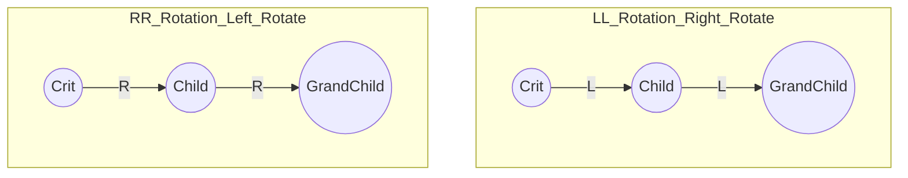

### 1. Complexity Analysis & Asymptotic Notations
**Time Complexity:** The amount of time an algorithm takes to run as a function of the input size ($n$).
**Space Complexity:** The amount of memory space required by an algorithm during execution.

| Notation | Name | Meaning | Graphical Relation |
| :--- | :--- | :--- | :--- |
| **$O(g(n))$** | Big-Oh | Upper Bound (Worst Case) | $f(n) \le c \cdot g(n)$ |
| **$\Omega(g(n))$** | Big-Omega | Lower Bound (Best Case) | $f(n) \ge c \cdot g(n)$ |
| **$\Theta(g(n))$** | Theta | Tight Bound (Average Case) | $c_1 g(n) \le f(n) \le c_2 g(n)$ |
| **$o(n) / \omega(n)$**| Little-o/$\omega$ | Non-tight Upper/Lower bound | Strict inequality ($<$ or $>$) |

**Common Complexities (Low to High):**
$O(1) < O(\log n) < O(n) < O(n \log n) < O(n^2) < O(n^3) < O(2^n)$

---

### 2. Solving Recurrences

#### The Extended Master Theorem
For the recurrence: **$T(n) = aT(n/b) + \Theta(n^k \log^p n)$**
First, calculate the critical value: **$c = \log_b a$**

##### **Case 1: $c > k$ (Work at root is insignificant)**
The recursive part dominates.
*   **Result:** $T(n) = \Theta(n^c)$

##### **Case 2: $c = k$ (Work is balanced)**
The $\log$ power $p$ determines the extra logarithmic factor.
*   If **$p > -1$**: $T(n) = \Theta(n^k \log^{p+1} n)$  *(Most common case)*
*   If **$p = -1$**: $T(n) = \Theta(n^k \log \log n)$
*   If **$p < -1$**: $T(n) = \Theta(n^k)$

##### **Case 3: $c < k$ (Work at root dominates)**
$f(n)$ dominates, provided it satisfies the **Regularity Condition**: $a f(n/b) \le \delta f(n)$ for some $\delta < 1$.
*   If **$p \ge 0$**: $T(n) = \Theta(n^k \log^p n)$
*   If **$p < 0$**: $T(n) = \Theta(n^k)$

---

#### Application to your Exam Questions

Using this extended logic, let's solve the specific problems from your paper:

**1. Question 2b: $T(n) = 2T(n/2) + n \log n$**
*   $a = 2, b = 2 \implies c = \log_2 2 = \mathbf{1}$
*   $f(n) = n^1 \log^1 n \implies k = \mathbf{1}, p = \mathbf{1}$
*   **Comparison:** $c = k$ (Case 2) and $p = 1$.
*   **Formula:** $n^k \log^{p+1} n$
*   **Result:** $T(n) = \Theta(n \log^2 n)$

**2. Question 5b: $T(n) = 2T(n/2) + 10n$**
*   $a = 2, b = 2 \implies c = \log_2 2 = \mathbf{1}$
*   $f(n) = 10n^1 \log^0 n \implies k = \mathbf{1}, p = \mathbf{0}$
*   **Comparison:** $c = k$ (Case 2) and $p = 0$.
*   **Formula:** $n^1 \log^{0+1} n$
*   **Result:** $T(n) = \Theta(n \log n)$

**3. Question 2a: $T(n) = 3T(n/2) + n^2$**
*   $a = 3, b = 2 \implies c = \log_2 3 \approx \mathbf{1.58}$
*   $f(n) = n^2 \log^0 n \implies k = \mathbf{2}, p = \mathbf{0}$
*   **Comparison:** $c < k$ (Case 3)
*   **Check Regularity:** $3(n/2)^2 \le \delta n^2 \implies \frac{3}{4}n^2 \le \delta n^2$ (True for $\delta = 0.75$)
*   **Result:** $T(n) = \Theta(n^2)$

---

#### Quick Summary Table for Cheat Sheet
| Condition | $p$ value | Result |
| :--- | :--- | :--- |
| **$c > k$** | Any | $\Theta(n^c)$ |
| **$c = k$** | $p > -1$ | $\Theta(n^k \log^{p+1} n)$ |
| **$c = k$** | $p = -1$ | $\Theta(n^k \log \log n)$ |
| **$c < k$** | $p \ge 0$ | $\Theta(n^k \log^p n)$ |

#### **B. Iteration Method**
Repeatedly substitute the recurrence into itself until a pattern emerges (usually a geometric series).
*   *Example:* $T(n) = 2T(n/2) + n$ solves to **$O(n \log n)$** (standard Merge Sort complexity).

---

### 3. AVL Trees (Height-Balanced Trees)
An AVL tree is a self-balancing Binary Search Tree (BST) where the **Balance Factor (BF)** of every node is **-1, 0, or 1**.

$$\text{Balance Factor (BF)} = \text{Height(Left Subtree)} - \text{Height(Right Subtree)}$$

#### **AVL Rotations (To fix imbalance)**
Imbalance occurs when $|BF| > 1$. Identify the "Critical Node" (the lowest ancestor where BF is invalid).



| Type of Insertion | Rotation Required | Description |
| :--- | :--- | :--- |
| **Left-Left (LL)** | **Single Right** | Rotate the critical node to the right. |
| **Right-Right (RR)** | **Single Left** | Rotate the critical node to the left. |
| **Left-Right (LR)** | **Left then Right** | Left rotate child, then Right rotate critical node. |
| **Right-Left (RL)** | **Right then Left** | Right rotate child, then Left rotate critical node. |

#### **AVL Properties**
*   **Search/Insert/Delete Time:** $O(\log n)$ (Guaranteed due to balancing).
*   **Max Height:** Approximately $1.44 \log_2 n$.
*   **Difference from BST:** BST can become a "skewed tree" ($O(n)$ complexity); AVL stays logarithmic.

---

### 4. Code Analysis (Algorithm Multiply)
```cpp
for (int i=0; i<n; i++)          // Runs n times
  for (int j=0; j<n; j++)        // Runs n times
    for (int k=0; k<n; k++)      // Runs n times
      C[i][j] += A[i][k] * B[k][j];
```
*   **Time Complexity:** $n \times n \times n = \mathbf{O(n^3)}$.
*   **Space Complexity:** $\mathbf{O(n^2)}$ (to store the 2D matrices).

---

### 5. Quick Check for Balance Factors (Ref: Q8)
To solve the diagram in Question 8:
1.  **Leaves** always have BF = 0.
2.  Work bottom-up.
3.  **Example:** If a node has a left child of height 2 and a right child of height 0, $BF = 2 - 0 = 2$ (**Imbalance: Left-Heavy**). Requires a Right Rotation.
