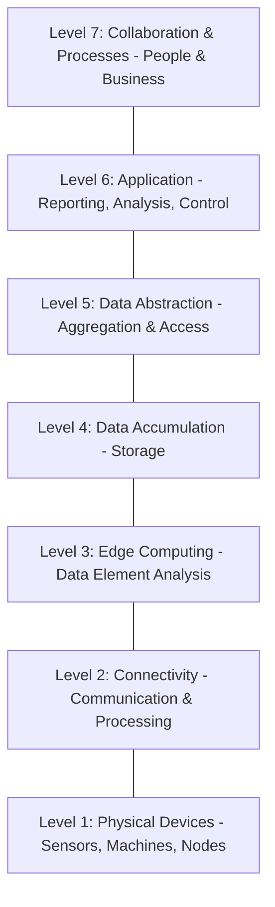
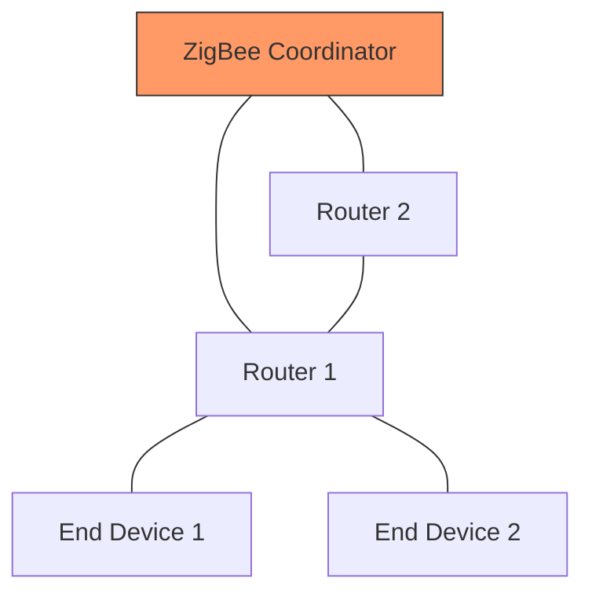

# Module 1 and module 2

## 3 mark answers

Click to view

  
### 1. Three Applications of IoT
1.  **Smart Cities:** Making urban areas more efficient through smart streetlighting and traffic management.
2.  **Health & Fitness:** Wearable devices like smartwatches (e.g., Fitbit) that track steps, heart rate, and sleep patterns.
3.  **Connected Cars:** Enabling vehicle-to-vehicle communication and the development of self-driving functional cars.

### 2. Differentiate between IoT and M2M (Briefly)
*   **M2M (Machine-to-Machine):** Focuses on direct, device-to-device communication (point-to-point) for monitoring and control without necessarily using the Internet.
*   **IoT (Internet of Things):** A broader concept that deploys internet protocols, cloud servers, and data analytics to manage services and business processes.

### 3. Explain the Types of RFID Tags
1.  **Passive Tags:** Have no internal battery; they use the energy transferred from the RFID reader’s electromagnetic field to function.
2.  **Active Tags:** Contain a small internal battery to signal over longer distances and record new data.
3.  **Semi-active Tags:** Battery-powered, but they only send a signal when triggered by an RFID reader rather than emitting continuously.

### 4. Wireless Communication Technology in IoT
In the context of IoT, this refers to the **Physical and Data-Link layer** technologies that enable "things" to exchange data without wires. It includes short-range protocols like **NFC, RFID, and Bluetooth** for local connectivity, and long-range protocols like **ZigBee or Cellular** for connecting to a gateway or the internet.

### 5. Define IoT with an Example
**Definition:** IoT is a network of physical things (objects) embedded with electronics, software, and sensors that enable them to send, receive, and exchange data through the Internet.
**Example:** A **Smart Umbrella** that connects to a weather service via the internet and flashes a yellow LED to remind the owner to carry it if the forecast predicts rain.

### 6. Components of the IoT Conceptual Framework
The fundamental framework is expressed by the equation:
> **Physical Object + Controller, Sensor and Actuators + Internet = Internet of Things.**
It consists of a physical thing, the hardware to manage it (MCU/Sensors), and connectivity to provide web/mobile services.

### 7. Evaluate the term NFC
**Near-Field Communication (NFC)** is a short-distance (within 20 cm) wireless technology based on the ISO/IEC 14443 standard. It is evaluated as a highly secure, low-latency method for:
*   Contactless proximity payments (Mobile Wallets).
*   Zero-touch pairing of Bluetooth devices.
*   Biometric passport and electronic key reading.

### 8. Define RFID and its Importance in IoT
**Definition:** Radio Frequency Identification (RFID) is an automatic identification method that uses radio waves to identify and track tags attached to physical objects.
**Importance:** It is a key technology that allows "dumb" objects to become part of the IoT by giving them a unique identity, enabling real-time monitoring, and automating supply chain management.
  

## Part B answers

### 1. Fundamental View of IoT
**Core Concept:** IoT is a network where physical objects ("things") become "smart" by sensing, computing, and communicating. They function like living entities by interacting with the environment and remote servers.

**Conceptual Framework Equation:**
> **Physical Object + Controller, Sensor & Actuators + Internet = Internet of Things**

**Example (The Smart Umbrella):**
*   **Input:** Receives weather reports from a web service.
*   **Processing:** Analyzes data to see if it’s a rainy or sunny day.
*   **Output:** Notifies the owner via mobile (SMS/NFC) or flashes LEDs (Yellow for rain, Red for sun).

---

### 2. Traditional OSI Model Adapted for IoT/M2M
IoT systems modify the classical 7-layer OSI model for simplicity and efficiency.

| Layer | Name | IoT/M2M Function |
| :--- | :--- | :--- |
| **7** | **Application** | Human-computer interaction; user apps access services. |
| **6** | **Presentation** | Ensures data is in a usable format; handles encryption. |
| **5** | **Session** | Maintains connections; controls ports/sessions. |
| **4** | **Transport** | Transmits data via protocols like **TCP/UDP**. |
| **3** | **Network** | Decides the physical path (Routing); **IPv6/6LowPAN**. |
| **2** | **Data Link** | Defines data format; handles MAC addresses. |
| **1** | **Physical** | Transmits raw bit streams over physical medium (RF, Fiber). |

---

### 3. Working of Wireless Sensor Networks (WSN)
**Definition:** A network of spatially distributed autonomous devices using sensors to cooperatively monitor physical/environmental conditions.

**How it Works:**
1.  **Sensing:** Nodes acquire data (temp, pressure, motion) from remote or inaccessible locations.
2.  **Computation:** Nodes have limited power but can perform data compaction and aggregation.
3.  **Communication:** Uses radio-frequency transceivers to send data to a gateway or central unit.
4.  **Self-Management:** WSNs are **ad-hoc**, meaning they are self-configuring, self-healing, and self-organizing.

---

### 4. M2M Communication in IoT
**Machine-to-Machine (M2M)** refers to the automated communication between devices without human intervention.

*   **Process:** A device senses data $\rightarrow$ performs computation $\rightarrow$ communicates it to another machine.
*   **Hardware:** Every machine in an M2M system embeds a "smart device."
*   **Protocols:** Uses 6LowPAN, LWM2M, MQTT, and XMPP.
*   **Identification:** Each device is assigned a **48-bit IPv6 address**.

---

### 5. Architectural View of IoT (CISCO Model)
CISCO’s reference model comprises **seven levels (tiers)** to depict how data moves from the physical world to business processes.

---

### 6. Technologies Behind IoT
IoT is supported by a diverse ecosystem of hardware and software:

1.  **Hardware:** Development boards like **Arduino Yún**, **Raspberry Pi**, **Intel Galileo**, and **BeagleBone**.
2.  **Protocols (IDE):** MQTT, CoAP, RESTful HTTP, and AMQP.
3.  **Communication:** Short-range (NFC, RFID, ZigBee, Bluetooth) and Long-range (GSM, GPRS, LTE).
4.  **Operating Systems:** **RIOT** (for low power), **Contiki**, and **Raspbian**.
5.  **Cloud Platforms:** AWS IoT, IBM BlueMix, and Cisco Fog.

---

### 7. M2M Communication supporting IoT
M2M is often considered the "foundation" or "subset" of IoT, particularly in industrial contexts (IIoT).

**How M2M Supports IoT:**
*   **Infrastructure:** M2M provides the device-to-device connectivity required for IoT to scale.
*   **Integration:** In industry, IoT integrates complex M2M machinery with big data analytics and machine learning.

**Key Difference Points:**
*   **Connection:** M2M is primarily **Point-to-Point** (device to device); IoT uses **IP networks** to connect to the cloud.
*   **Internet:** M2M can function without the Internet; IoT requires Internet/Cloud for services.

---

### 8. Role of RFID and WSN in IoT
Both are "edge" technologies that bridge the physical and digital worlds.

**Role of RFID (Radio Frequency Identification):**
*   **Identification:** Automatically identifies and tracks tags attached to objects.
*   **Efficiency:** Automates supply chains and reduces labor costs by eliminating manual data entry.
*   **Types:** Passive (no battery), Active (internal battery), and Semi-active (triggered by reader).

**Role of WSN (Wireless Sensor Network):**
*   **Data Acquisition:** Monitors environments (forests, factories) where humans cannot easily go.
*   **Connectivity:** Acts as the "eyes and ears" of the IoT system, providing the raw data that is eventually analyzed by cloud servers.
*   **Autonomy:** Nodes function independently to route data through the network.

These study notes are based on **Module 2: Communication Technologies** from your documents. They are designed for quick revision with a focus on comparison tables and technical specifications.

---

### 9. Comparison: Bluetooth vs. Wi-Fi
| Feature | Bluetooth (BT/BLE) | Wi-Fi (802.11) |
| :--- | :--- | :--- |
| **Range** | 1m to 100m (Class dependent) | 30m to 125m |
| **Power Consumption**| **Very Low** (especially BLE) | **High** (requires more power for range/speed) |
| **Data Rate** | 1 – 3 Mbps (v5 up to 2 Mbps) | 11 Mbps (802.11b) to 600 Mbps (802.11n) |
| **Typical Use** | Personal Area Networks (PAN), wearables | Local Area Networks (LAN), Internet access |

---

### 10. Bluetooth BR/EDR vs. Bluetooth Low Energy (BLE)
**Bluetooth v4.0+** supports two distinct modes:

*   **BR/EDR (Basic Rate/Enhanced Data Rate):** Optimized for **continuous** data streaming.
    *   *Data Rate:* 1, 2, or 3 Mbps.
    *   *Example:* Wireless speakers or headphones streaming high-quality audio.
*   **BLE (Bluetooth Low Energy / "Smart"):** Optimized for **short bursts** of data to save battery.
    *   *Data Rate:* 1 Mbps (smaller packets).
    *   *Setup Time:* Very fast (< 6 seconds).
    *   *Example:* A Fitbit fitness tracker sending step counts to a phone or a heart rate monitor.

---

### 11. Near-Field Communication (NFC)
**Working Principle:** A short-range (within **20 cm**) wireless technology that uses electromagnetic fields to exchange data between two devices in close proximity.
*   **Modes of Operation:**
    1.  **Reader Mode:** Device reads a passive RFID tag.
    2.  **P2P Mode:** Two active devices exchange data (e.g., sharing a contact).
    3.  **Card Emulation:** Device acts like a smart card (e.g., mobile payments).

**Advantages in IoT:**
*   **Speed:** Extremely fast setup time (0.1 seconds).
*   **Security:** Physical proximity is required, making "eavesdropping" difficult.
*   **Ease of Use:** Used for "Zero-touch" pairing of Bluetooth/Wi-Fi devices.

---

### 12. Role of Cellular Networks in IoT
Cellular networks allow IoT devices to access the **Wireless Wide Area Network (WWAN)** over long distances.
*   **Connectivity:** Uses GSM, GPRS, UMTS/LTE, and 5G.
*   **Gateway Access:** IoT/M2M gateways use cellular modules to send local sensor data to a remote cloud server when Wi-Fi is unavailable (e.g., a smart tracker on a moving truck).
*   **Mobility:** Provides seamless connectivity for devices moving across large geographic areas.

---

### 13. How RFID Enables Communication
**Radio Frequency Identification (RFID)** acts as the "identity" layer of IoT.
1.  **The Tag:** Contains a microchip and antenna; it is attached to the physical object.
2.  **The Reader:** Emits radio waves to activate the tag.
3.  **The Exchange:** The tag sends back its unique ID and stored data.
*   **IoT Role:** It allows the "Internet" to know exactly **what** an object is and **where** it is in real-time (e.g., inventory management in a warehouse).

---

### 14. ZigBee in IoT Systems
**ZigBee** is a low-power, short-range wireless protocol based on the **IEEE 802.15.4** standard.

**Why it is used in IoT:**
*   **Mesh Topology:** If one node fails, data can "hop" through other nodes (Self-healing).
*   **Low Power:** Designed for "sleepy" devices that wake up only to send small data packets, lasting years on a single battery.
*   **High Capacity:** Can support a large number of nodes (thousands) in a single network.
*   **Use Case:** Smart Home lighting and Industrial Smart Grids (ZigBee NAN).

---

### 15. Role of GSM/GPRS in IoT
*   **GSM (Global System for Mobile):** Provides the basic circuit-switched infrastructure for voice and simple data.
*   **GPRS (General Packet Radio Service):** A packet-based data service that allows "Always-on" internet connectivity.
*   **IoT Function:** It is used for **telemetric applications** and remote monitoring where low-cost, long-distance data transmission is needed, especially in legacy systems or rural areas.

---

### 16. Wi-Fi and its IoT Role
**Wi-Fi (IEEE 802.11)** is the most common interface for connecting high-power IoT devices to the internet.
*   **Infrastructure Mode:** Devices connect to a central **Access Point (AP)** which links them to the IP network.
*   **Ad-hoc Mode (IBSS):** Peer-to-peer nodes communicate directly without an AP for fast, easy setup.
*   **Key IoT Roles:**
    *   Handling high data rates (video surveillance).
    *   Connecting common consumer devices (Smart TVs, Fridges).
    *   **Scalability:** Systems can grow by adding more APs and routers.
*   **Challenge:** Higher power consumption compared to BLE or ZigBee; usually requires devices to be plugged into a power source.
