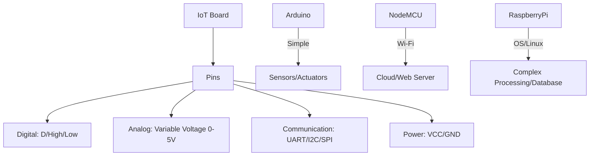
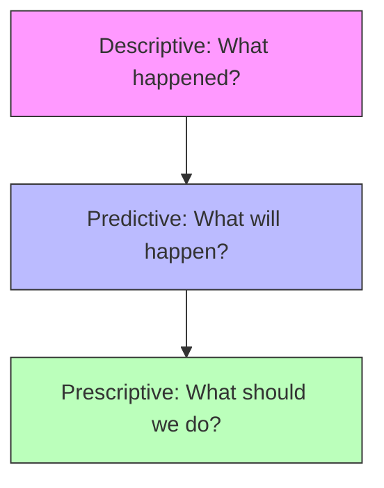

This comprehensive study guide merges both question papers into a prioritized, conceptual framework. I have organized them logically from **Hardware** to **Data Processing** to **Analytics** for easier learning.

---

### Phase 1: IoT Hardware Platforms (Arduino, Raspberry Pi, NodeMCU)
*High Priority: Understanding these boards is the foundation of IoT.*

#### 1. Pin Configuration & Hardware Architecture
| Feature | **Arduino (Uno)** | **NodeMCU (ESP8266)** | **Raspberry Pi** |
| :--- | :--- | :--- | :--- |
| **Core Role** | Microcontroller for simple logic/sensing. | Wi-Fi enabled microcontroller for web-based IoT. | Single Board Computer (SBC) for heavy processing/OS. |
| **Digital Pins** | D0-D13 (Control on/off) | D0-D8 (GPIOs) | 40-pin header (GPIOs) |
| **Analog Pins** | A0-A5 (Read sensor values) | 1 Analog Pin (A0) | No native Analog pins (needs ADC) |
| **Communication** | UART, SPI, I2C | Integrated Wi-Fi, UART, SPI | Ethernet, Wi-Fi, Bluetooth, HDMI |
| **Power Pins** | 5V, 3.3V, GND, Vin | 3.3V, GND, Vin | 5V, 3.3V, GND |

#### 2. Visualizing Board Interfaces (Mermaid)

---

### Phase 2: Sensors and Actuators
*High Priority: The "Eyes" and "Hands" of IoT.*

#### 1. Sensors (Input)
*   **PIR Motion Sensor:** Detects Infrared radiation from moving heat sources (humans/animals).
    *   *Pins:* VCC, GND, OUT (Digital High when motion detected).
*   **Ultrasonic Sensor (HC-SR04):** Measures distance using sound waves.
    *   *Working:* Emits a "Trigger" pulse; waits for "Echo" pulse. Distance = (Time × Speed of Sound) / 2.
*   **Temp/Humidity (DHT11/22):** Uses a thermistor and capacitive humidity sensor to provide digital data.
*   **Light (LDR) & Sound:** LDR changes resistance based on light; Sound sensors use a microphone to detect decibel thresholds.

#### 2. Actuators (Output)
*   **Relay:** An electromagnetic switch that allows a low-power IoT board to control high-power appliances (like a 220V bulb).
*   **Servo Motor:** Provides precise control of angular position (0-180°). Used in robotic arms.
*   **DC Motor:** Provides continuous rotation. Used in smart fans or wheels.

---

### Phase 3: IoT Data Acquisition & Management
*Medium Priority: How data moves from sensor to storage.*

#### 1. The Data Acquisition Pipeline

1.  **Data Generation:** Sensors produce raw signals (Analog/Digital).
2.  **Data Validation:** Checking for errors, noise, or missing values (e.g., ignoring a -100°C reading from a faulty sensor).
3.  **Data Categorization:** Organizing data into types (e.g., Metadata, State data, Event data).
4.  **Storage:** Sending data to local or cloud databases.

#### 2. Distributed vs. Centralized Databases
*   **Centralized:** All data stored in one single location. Easy to manage but creates a "Single Point of Failure."
*   **Distributed:** Data is spread across multiple nodes/servers. 
    *   *Role in IoT:* Essential for large-scale systems to ensure high availability and faster local access (Edge computing).

---

### Phase 4: Data Processing & Analytics
*High Priority: Converting raw data into decisions.*

#### 1. Transaction Processing Techniques
| Type | Explanation |
| :--- | :--- |
| **Batch Processing** | Large volumes of data collected and processed at once (e.g., daily reports). |
| **Streaming** | Data processed continuously as it arrives (e.g., live heart-rate monitoring). |
| **Interactive** | User requests specific data and gets a response (e.g., checking smart home status). |
| **Real-time** | Guaranteed response within strict time constraints (e.g., airbag deployment). |

#### 2. The Three Levels of Analytics

1.  **Descriptive Analytics:** Summarizes past data (e.g., "The average temperature yesterday was 30°C").
2.  **Predictive Analytics:** Uses historical data + ML to forecast future trends (e.g., "Based on trends, the machine will likely fail next week").
3.  **Prescriptive Analytics:** Suggests actions to handle predictions (e.g., "Schedule maintenance now to prevent the predicted failure").

---

### Quick Cheat-Sheet for Exam Success:
*   **PIR vs. Ultrasonic:** PIR = Motion (Yes/No); Ultrasonic = Distance (cm/m).
*   **Arduino vs. Raspberry Pi:** Arduino = Low power/Simple; RPi = High power/Mini-computer.
*   **Validation:** It’s "Filter" or "Check" for errors.
*   **Analytics Hierarchy:** Past (Descriptive) → Future (Predictive) → Action (Prescriptive).
