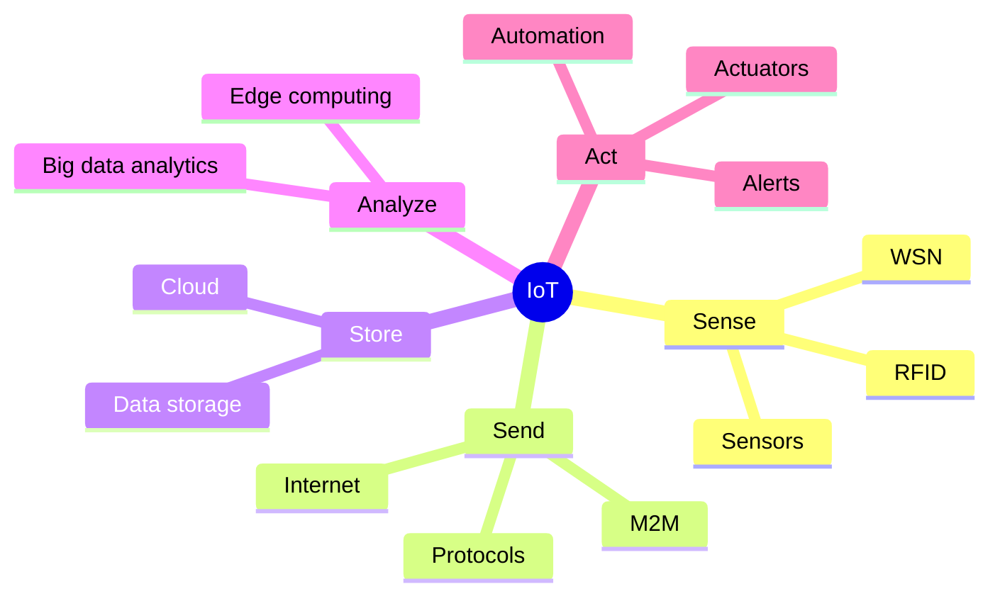
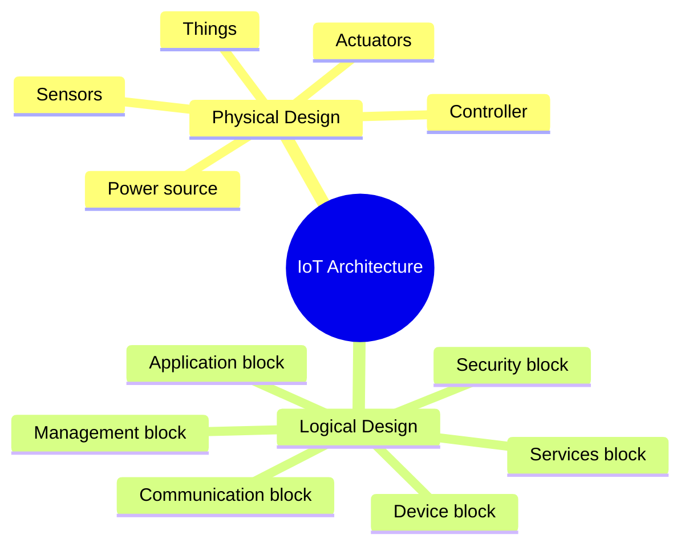
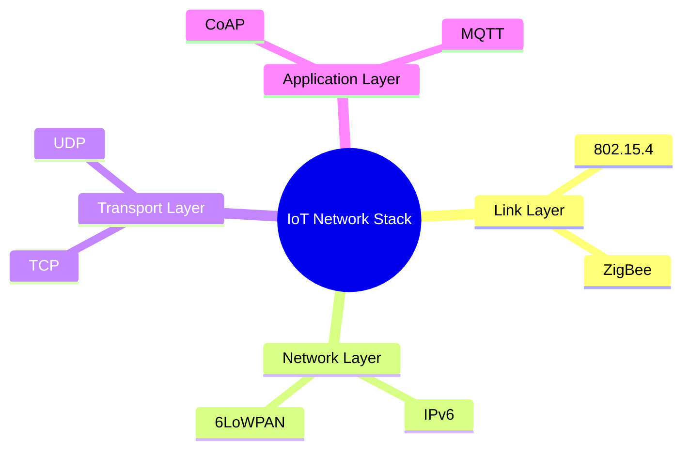

# Study First, Details Later

### 1) IoT in one line
IoT is a system where things sense data, send it through networks, process it in edge/cloud, and act automatically.

### 2) Fast memory flow
Sense -> Send -> Store -> Analyze -> Act

### 3) Big-picture mindmap

### 4) Architecture mindmap

### 5) Network layer mindmap

### 6) Easy mnemonics
- IoT flow: S-S-S-A-A = Sense, Send, Store, Analyze, Act
- Arduino: A for Action and simple control
- Raspberry Pi: P for Powerful processing
- RFID: Remote Fast Item ID
- WSN: Wide Sensor Net
- M2M: Machines Message Machines
- 4-layer stack: L-N-T-A = Link, Network, Transport, Application

### 7) What to remember quickly
- IoT connects physical things to the internet.
- Sensors collect data, actuators perform actions.
- Cloud and edge help with processing and storage.
- RFID, WSN, and M2M are key technologies.
- MQTT, CoAP, IPv6, and 6LoWPAN are important for constrained IoT devices.

### 8) Ultra-short comparison
- RFID: identify and track objects
- WSN: collect environmental data
- M2M: direct machine communication
- IoT: connects all of these with cloud and apps

## Fund IOT

### 1. Definition of the Internet of Things (IoT)
**The Internet of Things (IoT)** represents the entire process of collecting data, processing it, taking corresponding actions based on that data, and storing everything in the cloud utilizing the internet. Formally, it is defined as a **dynamic global network infrastructure** with self-configuring capabilities, built on standard and interoperable communication protocols. In this environment, physical and virtual "things" possess unique identities (such as IP addresses), physical attributes, and virtual personalities that seamlessly integrate into the broader information network. 

Key characteristics of IoT systems include their ability to be **dynamic and self-adapting** to changing contexts, **self-configuring** to fetch software upgrades or setup networking with minimal human intervention, and entirely **interoperable** across various communication protocols.

### 2. The IoT Conceptual Framework
In IoT design, the conceptual framework is what allows us to visualize how all the moving parts of an IoT system work together. Specifically, a reference model is used to depict the **building blocks, their successive interactions, and their integration**. 

This framework conceptualizes how smart sensors capture data and perform necessary transformations, how communication subsystems (like message routers and protocol handlers) manage interactions, and how data routes from a gateway over the internet to application servers. Ultimately, this framework illustrates how raw data is acquired and utilized by organization subsystems to enable complex business processes and services.

### 3. The Architectural View of IoT Systems
To actually organize and map out the conceptual framework, IoT systems are defined in different operational levels called "tiers" within an **architectural view**. A primary reference model used to define this architecture is the **7-level CISCO model**, which breaks the system down into the following layers:

*   **Level 1 - Physical Devices and Controllers:** The foundational "things" in IoT, including sensors, machines, and intelligent edge nodes.
*   **Level 2 - Connectivity:** The communication networks and processing units.
*   **Level 3 - Edge Computing:** Where initial data element analysis and transformation occur near the source.
*   **Level 4 - Data Accumulation:** The storage systems for the gathered data.
*   **Level 5 - Data Abstraction:** The aggregation and access layer.
*   **Level 6 - Application:** Functions involving reporting, analysis, and system control.
*   **Level 7 - Collaboration and Processes:** The highest tier, which involves people and the integration of broader business processes.

### 4. Foundational Knowledge for Subsequent Modules
To fully grasp advanced IoT modules, it is essential to understand that IoT systems are generally analyzed through two distinct design lenses:

*   **Physical Design:** This refers to the actual tangible components of the system. The "Things" in the physical design are the IoT devices that perform remote sensing, actuating, and monitoring capabilities. These devices collect data and exchange it with other connected devices or send it to centralized servers and cloud-based back-ends for processing.
*   **Logical Design:** This provides an abstract representation of the system's entities and processes without getting bogged down in low-level hardware specifics. The logical design is organized into **Functional Blocks** that provide the system its capabilities, including the **Device, Communication, Services, Management, Security, and Application** blocks.

## Tech sources

### Core Technologies Behind IoT
The implementation of the Internet of Things relies on a combination of foundational technologies that allow devices to collect, transmit, and analyze data:
*   **Wireless Sensor Networks (WSN):** Networks of distributed devices equipped with sensors that monitor environmental and physical conditions, acting as the data-gathering front line.
*   **Cloud Computing:** Delivers applications, computing power, and storage over the internet on demand, providing the necessary infrastructure to handle IoT data without local servers.
*   **Big Data Analytics:** Provides the tools to manage, process, and analyze the massive volume, velocity, and variety of data generated by IoT systems to produce actionable insights.
*   **Embedded Systems:** Computer hardware and software embedded into devices (using microprocessors or microcontrollers) to perform specific tasks.
*   **Communication Protocols:** The backbone of IoT connectivity, these protocols define how data is encoded, addressed, and routed from the source to the destination.

### Sources and Components of an IoT System
An IoT device typically consists of a few essential sources and components working together:
*   **The "Thing" (Physical Object):** The actual hardware being connected to the network.
*   **Sensors and Actuators:** Sensors detect changes in the environment (like temperature or motion) and convert them into data. Actuators receive control signals to perform mechanical actions, such as rotating a motor or opening a valve.
*   **The Controller (The "Brain"):** The processing unit that directs the actuator based on the sensor data it receives.
*   **Networks (Internet):** The communication mediums that allow the device to transmit its data to cloud platforms or other devices.
*   **Power Sources:** Critical for deployment, IoT devices are powered by various sources depending on their mobility and environment. These include **batteries** (portable but limited lifespan), **solar power** (renewable but weather-dependent), **wired power** (reliable but fixed), and **energy harvesting** (capturing kinetic or thermal energy from the environment).

### IoT Development Boards
Development boards are hardware platforms used by developers and hobbyists to prototype, test, and build IoT applications. The sources highlight two primary platforms:

**1. Arduino**
Arduino is an open-source prototype platform based on easy-to-use microcontrollers. 
*   **Purpose:** It is designed to read inputs from sensors (like light or temperature) and turn them into outputs (like activating a motor, turning on an LED, or connecting to the cloud). It is excellent for interacting with external devices but is strictly a microcontroller, meaning it lacks the advanced computing features of a full mini-computer.
*   **Features:** It is programmed via a USB cable using the Arduino IDE, which utilizes a simplified version of C++. 
*   **Examples:** Popular boards include the **Arduino Uno R3** (the most common board for beginners), the **Arduino Mega 2560** (for projects requiring more inputs/outputs), and the **Arduino Leonardo**.

**2. Raspberry Pi**
The Raspberry Pi is a series of highly capable, credit-card-sized single-board computers originally developed in the UK.
*   **Purpose:** Unlike the Arduino, the Raspberry Pi is a fully functional mini-computer. It is used for projects that require heavier processing power, operating systems, and complex networking. 
*   **Features:** It typically runs on a Linux operating system (though it is Android compatible) and features a 64-bit quad-core processor. Modern versions (like the Pi 3 and Pi 4) come with built-in Wi-Fi, Bluetooth, HDMI video output, and multiple USB ports. It also features General Purpose Input-Output (GPIO) pins, which allow it to physically interact with external sensors and components.

## Technologies used in IoT

### 1. RFID Technology in IoT
**Radio Frequency Identification (RFID)** is a form of wireless communication that uses radio waves to automatically identify, track, and communicate with objects, animals, or people. 

*   **Role and Significance:** RFID acts as a digital label. Data is encoded into an RFID tag (which consists of a microcircuit and an antenna) and is captured by a reader device. It replaces traditional barcodes by allowing items to be read without direct line-of-sight and can read hundreds of tags in a very short time. 
*   **Types:** Tags can be **Passive** (drawing power from the reader's signal, which keeps them cheap and battery-free) or **Active** (having their own battery power for longer ranges).

### 2. Wireless Sensor Networks (WSN)
A **Wireless Sensor Network (WSN)** consists of a distributed group of devices equipped with sensors to monitor physical and environmental conditions. 

*   **Basic Components:** A typical WSN includes **end nodes** (which collect the data), **routers** (which help pass the data along), and a **coordinator** (which aggregates the data from all nodes and acts as a gateway to connect the network to the internet). 
*   **Applications:** WSNs are heavily used for structural health monitoring (detecting vibrations in bridges), weather monitoring systems, soil moisture tracking in agriculture, and surveillance systems. 

### 3. Machine-to-Machine (M2M) Communication
**M2M communication** is the direct exchange of data between two or more machines without any human interaction. 

*   **Characteristics:** M2M systems are typically characterized by a large number of nodes, low cost, energy efficiency, and small traffic per device. They traditionally use proprietary or non-IP-based point-to-point communication.
*   **Relation to IoT:** M2M is the foundational precursor to IoT. While M2M refers to direct hardware-to-hardware communication (like a wired connection between two machines), IoT is the evolution of this concept, integrating these connected machines into cloud platforms, software, and IP-based internet networks where multiple users can access the data.

### 4. Practical Examples in IoT
These enabling technologies are often integrated together to build complete IoT systems:
*   **Retail and Logistics (RFID):** RFID technology is used in supply chain management to track shipping containers, pallets, and remote inventory. 
*   **Smart Utilities (M2M):** Smart energy meters utilize M2M communication to automatically track a household's energy usage and send the data directly to the power company for accurate billing, replacing manual human readings. 
*   **Agriculture (WSN):** In smart irrigation, WSN nodes are placed throughout a field to collect soil moisture data. The coordinator aggregates this data, sends it to the cloud, and triggers an automated watering schedule if the soil is too dry.

### 5. Adapted OSI Model for IoT/M2M Systems
*(Note: The standard 7-layer OSI model—Physical, Data Link, Network, Transport, Session, Presentation, and Application—is a general networking framework and this specific 7-layer definition relies on information outside of your provided sources. However, your sources detail how this model is condensed and adapted for IoT).*

For IoT and M2M systems, the networking model is adapted into a **4-layer architecture** to account for the unique constraints of IoT devices (such as low memory, limited battery life, and low processing power). 

*   **Link Layer:** Determines how data is physically sent over a medium. While traditional internet uses Ethernet (802.3) or Wi-Fi (802.11), IoT heavily utilizes protocols like **802.15.4 (LR-WPAN)** for low-rate, low-power wireless personal area networks (like ZigBee).
*   **Network Layer:** Responsible for addressing and routing packets. To accommodate billions of small devices, IoT uses **IPv6** (which provides a massive number of IP addresses) and **6LoWPAN**, a specifically adapted protocol that allows IPv6 to run efficiently on low-power, constrained sensor networks.
*   **Transport Layer:** Provides end-to-end message transfer using standard internet protocols like **TCP** (reliable, connection-oriented) and **UDP** (connectionless, useful for time-sensitive, small IoT data exchanges).
*   **Application Layer:** Defines how applications interface with the network. Because standard web protocols like HTTP are too "heavy" for simple sensors, IoT utilizes lightweight protocols such as **CoAP** (Constrained Application Protocol) and **MQTT** (Message Queue Telemetry Transport). These are specifically designed for constrained M2M environments to efficiently send telemetry data with very little overhead. 

**Necessity of these changes:** Standard internet protocols demand too much computing power and bandwidth. The modifications (like 6LoWPAN and MQTT) are strictly necessary because IoT devices often run on small batteries, utilize low-bandwidth wireless connections, and only need to transmit tiny amounts of data.
