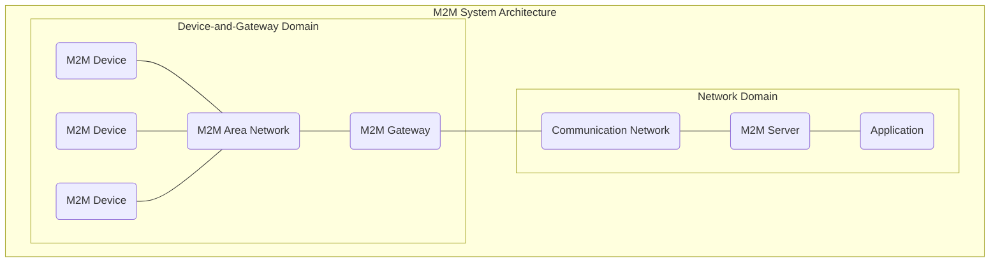

### 1. What is meant by the Internet of Things (IoT)? State its important features.

**Definition of IoT:**
The Internet of Things (IoT) is a dynamic global network infrastructure with self-configuring capabilities based on standard and interoperable communication protocols. In this infrastructure, physical and virtual "things" possess identities, physical attributes, and virtual personalities, using intelligent interfaces to seamlessly integrate into information networks. These "things" often communicate data associated with users and their environments. (Page 3)
The Internet of Things represents the entire process from collecting data, processing it, taking action based on the data's significance, to storing everything in the cloud, all made possible by the internet. (Page 3)

**Important Features (Characteristics of IoT):**
The key characteristics of IoT are:
*   **Dynamic & Self Adapting:** IoT devices and systems can dynamically adapt to changing contexts and take actions based on their operating conditions, user's context, or sensed environment. An example is a surveillance system adjusting its mode based on whether it is day or night. (Page 3)
*   **Self Configuring:** IoT devices have the ability to self-configure, allowing a large number of devices to work together to provide specific functionality. They can set up networking and fetch software upgrades with minimal manual interaction. (Page 3)
*   **Inter Operable Communication Protocols:** IoT systems support various interoperable communication protocols, enabling communication with other devices and infrastructure. (Page 3)
*   **Unique Identity:** Each IoT device possesses a unique identity, typically an IP address. (Page 3)
*   **Integrated into Information Network:** IoT devices are integrated into information networks, allowing them to communicate and exchange data with other devices and systems. (Page 4)

---

### 2. Give a definition of RFID and describe how it is used in IoT systems.

**Definition of RFID:**
Radio Frequency Identification (RFID) is a form of wireless communication that uses electromagnetic or electrostatic coupling in the radio frequency spectrum to uniquely identify objects, animals, or persons. It employs radio frequency to search, identify, track, and communicate with items and people. Data is digitally encoded in an RFID tag, which can be read by a reader, often without a line of sight, unlike traditional barcodes or QR codes. (Page 50)

**How it is used in IoT systems:**
In IoT systems, RFID plays a crucial role in automatic identification and data capture (AIDC). An RFID system typically consists of three components: a scanning antenna, a transceiver (reader), and a transponder (tag). (Page 52)

Here's how it's used:
1.  **Tag Activation:** When an RFID reader emits radio waves, it activates the RFID tag. (Page 52)
2.  **Data Transmission:** The activated tag sends a wave back to the antenna. This wave contains digitally encoded data from the tag. (Page 52)
3.  **Data Translation:** The reader translates the received wave into data, which can then be stored in a database or used by other IoT system components for analysis and action. (Page 52)
4.  **Applications:** RFID is extensively used in various IoT applications for tracking and identification:
    *   **Asset Tracking:** Tracking shipping containers, trucks, railroad cars, and other assets. (Page 52)
    *   **Access Control:** Used in credit-card shaped forms for access applications, personnel tracking, and controlling access to restricted areas. (Page 52)
    *   **Supply Chain Management:** Improving efficiency and traceability of production. (Page 52)
    *   **Inventory Management:** Remote monitoring of inventory in retail. (Page 18)
    *   **Counterfeit Prevention:** Used in industries like pharmaceuticals. (Page 52)

There are two main types of RFID tags:
*   **Passive RFID:** These tags do not have their own power source and draw power from the reader's radio waves. They are widely used and operate at various frequencies (e.g., 125-134 KHz, 13.56 MHz, 856-960 MHz). (Page 51)
*   **Active RFID:** These tags have their own power source (like a battery) and emit a signal, allowing for longer read ranges. (Page 51)

---

### 3. What do you understand by M2M communication? Explain its connection with IoT.

**Definition of M2M Communication:**
Machine-to-machine (M2M) communication refers to the direct communication between two machines or devices, exchanging data without human interfacing or interaction. This can involve wired connections (e.g., serial connection, powerline communication) or wireless communications, often in industrial settings, which is sometimes called industrial Internet of Things (IIoT). (Page 20)
Examples include vending machines sending inventory information or ATM machines getting authorization to dispense cash. (Page 20)

**Connection with IoT:**
M2M and IoT share similar objectives: to fundamentally change how the world operates by enabling virtually any sensor or device to communicate, allowing systems to monitor themselves and automatically respond to environmental changes with reduced human involvement. (Page 20)

However, there are key distinctions:
*   **Scope:** While M2M traditionally focused on point-to-point communication between machines, often in industrial telematics, IoT is a broader concept encompassing a network of physical devices embedded with sensors, software, and other technologies that communicate and exchange data over the internet infrastructure. (Page 20, 23)
*   **Communication Protocols:** M2M often uses proprietary or non-IP based communication protocols within M2M area networks. In contrast, IoT primarily relies on IP-based communication protocols for broader internet connectivity. (Page 24)
*   **Hardware vs. Software Emphasis:** M2M tends to have a greater emphasis on hardware with embedded modules, whereas IoT places more emphasis on software and cloud-based solutions. (Page 25)
*   **Data Collection & Analysis:** M2M data is typically collected in point solutions and stored in on-premises infrastructure. IoT data, however, is largely collected in the cloud (public, private, or hybrid) and is accessible by cloud applications for analytics, remote diagnosis, and management. (Page 25)
*   **Evolution:** The document states that as businesses realized the value of M2M, it took on a new name: The Internet of Things. IoT is considered the "newer term" and typically refers to wireless communications, while M2M can refer to any two machines, wired or wireless, communicating. (Page 20)

In essence, M2M can be seen as a foundational technology or a subset of IoT, dealing with direct device communication, while IoT extends this connectivity to a global internet infrastructure, enabling more complex applications and services through cloud integration and advanced analytics.

---

### 4. Mention four real-world uses of IoT and briefly explain them.

Here are four real-world uses of IoT:

1.  **Smart Cities:**
    IoT is used in smart cities to enhance urban living by improving efficiency and sustainability. This includes:
    *   **Smart Parking:** IoT systems detect available parking spots using sensors and send this information to smart applications, helping drivers find parking faster. (Page 17, 100)
    *   **Smart Lighting:** IoT-enabled streetlights can adapt their lighting schedules and intensity based on ambient conditions, saving energy. (Page 16, 17, 100)
    *   **Smart Waste Management:** Waste bins equipped with sensors can monitor waste levels, optimizing collection routes and schedules for waste management services. (Page 100)
    *   **Smart Traffic Management:** Sensors and GPS data help monitor vehicle and pedestrian levels, optimize traffic light timings, and provide real-time information on driving conditions to prevent congestion and estimate travel times. (Page 17, 100)

2.  **Home Automation:**
    IoT enables the creation of "smart homes" where devices are connected and can be remotely monitored and controlled. This aims to integrate home automation for convenience, safety, and energy efficiency. (Page 16, 101)
    *   **Smart Lighting:** Adapting lighting to ambient conditions and allowing remote control (on/off, dimming) to save energy. (Page 16)
    *   **Smart Appliances:** Managing home appliances remotely and providing status information to users. (Page 16)
    *   **Intrusion Detection:** Using security cameras and sensors (PIR, door sensors) to detect intrusions and raise alerts via SMS or email. (Page 16)
    *   **Smart Irrigation Systems:** Controlling water waste by automatically adjusting irrigation schedules based on soil moisture data. (Page 101)

3.  **Healthcare and Telemedicine:**
    IoT devices and wearables collect vital health data, enabling healthcare professionals to monitor patients remotely and provide personalized care. (Page 18, 90)
    *   **Patient Monitoring:** Wearable devices and internet-connected sensors can track patient vitals, detect anomalies, and visualize health trends, allowing for timely medical decisions. (Page 90)
    *   **Emergency Response:** M2M-connected life support devices could automatically administer oxygen or additional care if a patient's vital signs drop, even before a human professional arrives. (Page 21)
    *   **Fall Detection:** Devices tracking normal movement of elderly individuals can detect falls and alert healthcare workers. (Page 21)

4.  **Smart Grids (Energy Management):**
    IoT is transforming traditional electrical grids into "smart grids" that collect and analyze data about power transmission, distribution, and consumption in near real-time. (Page 17, 106)
    *   **Energy Consumption Monitoring:** Smart meters track energy usage, providing consumers with real-time billing information and helping utilities manage demand. (Page 106)
    *   **Renewable Energy Integration:** Smart grids are designed to accept power inputs from renewable resources like solar panels and windmills, tracking energy generation and reimbursing net-positive establishments. (Page 107)
    *   **Disaster Mitigation:** Decentralized energy generation in smart grids makes them more resilient to blackouts caused by disasters, as multiple alternative sources can sustain the grid. (Page 107)
    *   **Prognostics:** Specialized electrical sensors (Phasor Measurement Units - PMUs) collect real-time information to estimate system states and predict failures in power grids. (Page 18)

---

### 5. Describe the conceptual framework of IoT with a diagram and explain its main elements.

The conceptual framework of IoT can be understood through a reference model that depicts its building blocks, successive interactions, and integration. The Cisco presentation of a 7-level reference model provides such a framework: (Page 19)

```mermaid
graph TD
    Level7(Level 7: Collaboration and Processes) --> Level6(Level 6: Application)
    Level6 --> Level5(Level 5: Data Abstraction)
    Level5 --> Level4(Level 4: Data Accumulation)
    Level4 --> Level3(Level 3: Edge Computing)
    Level3 --> Level2(Level 2: Connectivity)
    Level2 --> Level1(Level 1: Physical Devices and Controllers)

    style Level1 fill:#f9f,stroke:#333,stroke-width:2px
    style Level2 fill:#bbf,stroke:#333,stroke-width:2px
    style Level3 fill:#9f9,stroke:#333,stroke-width:2px
    style Level4 fill:#ff9,stroke:#333,stroke-width:2px
    style Level5 fill:#f99,stroke:#333,stroke-width:2px
    style Level6 fill:#cff,stroke:#333,stroke-width:2px
    style Level7 fill:#fcf,stroke:#333,stroke-width:2px

    subgraph "CISCO 7-Level IoT Reference Model"
        Level1
        Level2
        Level3
        Level4
        Level5
        Level6
        Level7
    end
```

**Main Elements (Functions of Each Level):**

1.  **Level 1: Physical Devices and Controllers (The "Things" in IoT):** This foundational layer comprises sensors, machines, intelligent edge nodes, and other physical devices. Their primary function is to capture data from the environment and, in some cases, perform actuation. (Page 19)
2.  **Level 2: Connectivity (Communication and Processing Units):** This layer handles the physical and logical connections of devices to the network. It involves communication management subsystems with protocol handlers, message routers, and access management. (Page 19)
3.  **Level 3: Edge Computing (Data Element Analysis and Transformation):** This level focuses on pre-processing data close to the source (at the "edge" of the network) to filter, aggregate, and transform raw sensor data before sending it further upstream. This reduces latency and bandwidth requirements. (Page 19)
4.  **Level 4: Data Accumulation (Storage):** This layer is responsible for storing the processed data from edge devices. It often involves distributed databases or cloud-based storage solutions to handle the massive volumes of IoT data. (Page 19)
5.  **Level 5: Data Abstraction (Aggregation and Access):** This level aggregates data from various sources and provides a unified view, making it accessible for applications and higher-level processing. It often involves data normalization and formatting. (Page 19)
6.  **Level 6: Application (Reporting, Analysis, Control):** This layer provides the functionalities for IoT applications, including reporting, analytics, and control mechanisms. It generates insights from the data and allows users to interact with and manage the IoT system. (Page 19)
7.  **Level 7: Collaboration and Processes (Involving People and Business Processes):** The topmost layer integrates IoT data and insights into broader business processes and human decision-making. It supports enterprise integration, complex processes, and collaboration based on the actionable insights derived from the IoT system. (Page 19)

**Features of the Architecture:**
*   It serves as a reference for IoT applications in services and business processes. (Page 19)
*   Smart sensors capture data, perform data element analysis and transformation, and connect to a communication manager. (Page 19)
*   Data flows from gateways through the internet and data centers to application or enterprise servers for acquisition. (Page 19)
*   Organization and analysis subsystems enable services, business processes, enterprise integration, and complex processes. (Page 19)

---

### 6. Explain the overall architecture of IoT systems and discuss the layers involved.

The overall architecture of IoT systems can be viewed as a layered structure that facilitates communication and data flow from physical devices to applications and services. While conceptual models exist (like the 7-level Cisco model), a fundamental way to understand the architecture is through communication protocol layers. (Page 5, 6, 7)

**Physical Design of IoT:**
At its core, an IoT device ("Thing") has unique identities and can perform remote sensing, actuating, and monitoring. These devices can:
*   Exchange data with other connected devices and applications.
*   Collect data, process it locally, or send it to centralized servers/cloud for processing.
*   Perform local tasks and other tasks within the IoT infrastructure based on constraints. (Page 4)
A generic IoT device includes interfaces for sensors, internet connectivity (wired/wireless), memory and storage, and audio/video interfaces. (Page 4, 5)

**IoT Protocols (Layered Architecture):**
IoT systems rely on a stack of communication protocols, often mapped to a variation of the Internet Protocol Suite (TCP/IP model), to enable end-to-end communication.

1.  **Link Layer (Physical Data Transmission):**
    *   **Function:** Determines how data is physically sent over the network's physical medium. It handles data packet coding and signaling. (Page 5)
    *   **Protocols:**
        *   **802.3-Ethernet:** Wired Ethernet standards (e.g., coaxial cable, twisted pair, fiber optic). (Page 6)
        *   **802.11-WiFi:** Wireless LAN standards (e.g., 802.11a, b, g, n, ac) operating in 2.4GHz or 5GHz bands. (Page 6)
        *   **802.16-WiMax:** Wireless broadband standards offering data rates from 1.5 Mb/s to 1 Gb/s. (Page 6)
        *   **802.15.4-LR-WPAN:** Low Rate Wireless Personal Area Network, forming the basis for protocols like ZigBee (40kb/s to 250kb/s). (Page 6)
        *   **2G/3G/4G-Mobile Communication:** Cellular communication providing data rates from 9.6kb/s to 100Mb/s. (Page 6)

2.  **Network/Internet Layer (IP Datagrams & Routing):**
    *   **Function:** Responsible for sending IP datagrams from a source network to a destination network, performing host addressing and packet routing. (Page 6)
    *   **Protocols:**
        *   **IPv4:** Uses 32-bit addresses. (Page 6)
        *   **IPv6:** Uses 128-bit addresses, offering a vast number of addresses suitable for IoT. (Page 6)
        *   **6LOWPAN (IPv6 over Low-Power Wireless Personal Area Network):** Enables IPv6 communication over low-power wireless networks like 802.15.4, making even small IoT devices part of the internet. (Page 6, 48)

3.  **Transport Layer (End-to-End Message Transfer):**
    *   **Function:** Provides end-to-end message transfer capabilities independent of the underlying network, including error control, segmentation, flow control, and congestion control. (Page 6)
    *   **Protocols:**
        *   **TCP (Transmission Control Protocol):** Connection-oriented, ensures reliable transmission, used by web browsers (HTTP, HTTPS) and email (SMTP, FTP). (Page 6)
        *   **UDP (User Datagram Protocol):** Connectionless, useful for time-sensitive applications with small data units where guaranteed delivery is not critical. (Page 6)

4.  **Application Layer (Application Interface & Communication):**
    *   **Function:** Defines how applications interface with lower-layer protocols to send data over the network, enabling process-to-process communication using ports. (Page 6)
    *   **Protocols:**
        *   **HTTP (Hypertext Transfer Protocol):** Foundation of the WWW, follows a request-response model. (Page 6)
        *   **CoAP (Constrained Application Protocol):** For machine-to-machine (M2M) applications with constrained devices and environments, uses a client-server architecture. (Page 7)
        *   **WebSocket:** Allows full-duplex communication over a single socket connection. (Page 7)
        *   **MQTT (Message Queue Telemetry Transport):** Lightweight messaging protocol based on publish-subscribe model, suited for constrained environments. (Page 7)
        *   **XMPP (Extensible Message and Presence Protocol):** For real-time communication and streaming XML data. (Page 7)
        *   **DDS (Data Distribution Service):** Data-centric middleware for device-to-device/M2M communication, uses publish-subscribe. (Page 7)
        *   **AMQP (Advanced Message Queuing Protocol):** Open application layer protocol for business messaging, supports point-to-point and publish-subscribe. (Page 7)

**IoT Communication Models:**
Within the application layer, various models govern how devices communicate:
*   **Request-Response:** Client sends a request, server responds. (Page 8)
*   **Publish-Subscribe:** Publishers send data to a broker, and consumers subscribe to topics managed by the broker. (Page 8)
*   **Push-Pull:** Producers push data to queues, and consumers pull data from queues. (Page 9)
*   **Exclusive Pair:** Bidirectional, full-duplex communication using a persistent connection between client and server. (Page 9)

This layered architecture, combined with these communication models, forms the backbone of IoT systems, allowing diverse devices to connect, exchange data, and contribute to intelligent applications and services.

Here are detailed notes to help you master the essay questions on the Internet of Things (IoT) and related topics, based on the provided document.

---

### 7. What are development boards in IoT? Discuss the features and uses of commonly used boards.
### 10. Discuss various IoT development boards and explain their characteristics.

**Development Boards in IoT:**
Development boards in IoT are open-source prototyping platforms that combine easy-to-use hardware and software, allowing developers to build and deploy IoT solutions. They act as a bridge between hardware and application layers, facilitating data collection, device control, and connectivity. They are crucial for creating autonomous interactive objects and handling infrastructure-related tasks. (Page 60, 62, 76)

**Commonly Used Boards & Their Characteristics:**

The document primarily discusses two popular development boards: Arduino and Raspberry Pi.

**1. Arduino:**
*   **Definition:** Arduino is an open-source prototype platform based on easy-to-use hardware and software. It consists of a programmable circuit board (microcontroller) and an Integrated Development Environment (IDE) for writing and uploading code. (Page 62)
*   **Key Features:**
    *   **Input/Output:** Reads analog or digital input signals from various sensors and turns them into outputs (e.g., activating a motor, turning LEDs on/off, connecting to the cloud). (Page 63)
    *   **Programming:** Functions are controlled by sending instructions to the microcontroller via the Arduino IDE, which uses a simplified version of C++. (Page 63, 77)
    *   **Ease of Use:** Does not require extra hardware (programmer) to load code; uses a USB cable. Offers a standard form factor for accessible microcontroller functions. (Page 63)
    *   **Interactivity:** Provides excellent interactivity with external devices. (Page 77)
    *   **Analogue-to-Digital Input:** Offers analogue-to-digital input, allowing connection of light, temperature, or sound sensor modules. (Page 77)
    *   **Open Source & Community:** Projects can be standalone or collaborative. The IDE works on Mac, Linux, and Windows. It benefits from a large community for learning and sharing knowledge. (Page 77)
*   **Limitations:** It is a microcontroller, not a mini-computer, which limits its features for advanced users compared to boards like Raspberry Pi. (Page 77)
*   **Uses:** Ideal for learning basic computer programming, visualizing interactive apps, and experiments. Commonly used for building autonomous interactive objects and connecting various external sensors and control elements. (Page 77)

**Examples of Arduino Boards (based on ATMEGA328, ATMEGA32u4, ATMEGA2560 microcontrollers):**
| Board Name             | Operating Volt | Clock Speed | Digital i/o | Analog Inputs | PWM | UART | Programming Interface |
| :--------------------- | :------------- | :---------- | :---------- | :------------ | :-- | :--- | :-------------------- |
| Arduino Uno R3         | 5V             | 16MHz       | 14          | 6             | 6   | 1    | USB via ATMega16U2    |
| Arduino Leonardo       | 5V             | 16MHz       | 20          | 12            | 7   | 1    | Native USB            |
| Arduino Mega 2560 R3   | 5V             | 16MHz       | 54          | 16            | 14  | 4    | USB via ATMega16U2B   |

*These tables are directly from the document and highlight the variety in specifications like operating voltage, clock speed, digital I/O, analog inputs, PWM pins, UART, and programming interfaces across different Arduino boards. (Page 63-66)*

**2. Raspberry Pi:**
*   **Definition:** Raspberry Pi is a series of small, single-board computers developed by the Raspberry Pi Foundation. It's a full-fledged computer on a single board, initially for computer science education but now widely used in robotics, weather monitoring, and other applications due to its low cost, modularity, and open design. (Page 77)
*   **Key Features:**
    *   **Single-Board Computer:** Unlike Arduino's microcontroller, Raspberry Pi is a powerful mini-computer. (Page 77)
    *   **Operating System:** Uses Linux as its default OS, and is Android compatible. Can run on Windows via virtualization (e.g., XenDesktop). (Page 78)
    *   **Processing Power:** Features various central processing units (e.g., ARM Cortex A53 for Pi 3, 1.2 GHz, 64-bit), offering significantly more computing power than Arduino. (Page 77, 78)
    *   **Memory:** On-board RAM ranges from 256MiB to 1GiB (up to 8 GiB for Pi 4), with program memory stored on SecureDigital (SD) cards. (Page 77)
    *   **Connectivity:** Includes multiple USB ports (up to five), HDMI and composite video output, a standard 3.5mm audio jack, 8P8C Ethernet port (on B-models), and on-board Wi-Fi (802.11n) and Bluetooth (on Pi 3, Pi 4, Pi Zero W). (Page 78)
    *   **GPIO (General Purpose Input-Output):** Provides a low-level interface for self-operated control by input-output ports (e.g., 40-pin connector). (Page 78)
    *   **Open Design & Modularity:** Known for its open design, allowing for wide-ranging uses and integration. (Page 77)
*   **Uses:** Used for developing applications, robotics, weather monitoring, smart home applications, and other complex IoT projects requiring more processing power and extensive connectivity than microcontrollers. (Page 77)

---

### 8. Describe the modified OSI model used in IoT/M2M and highlight how it differs from the traditional OSI model.

The document implicitly describes a modified OSI/TCP-IP model in the context of IoT/M2M protocols, often simplifying or adapting layers to suit the specific requirements of constrained IoT devices and networks. The explicit "IoT Protocols" section details a four-layer model: Link, Network/Internet, Transport, and Application. (Page 5, 6, 7)

**IoT/M2M Communication Layers (Modified Model):**

1.  **Link Layer:**
    *   **Function:** Deals with how data is physically sent over the network medium and handles local network connectivity. It defines how packets are coded and signaled by the hardware device. (Page 5)
    *   **IoT/M2M Specifics:** Includes standards like IEEE 802.3 (Ethernet) for wired, 802.11 (WiFi) for wireless LAN, 802.16 (WiMax) for wireless broadband, and crucially, **802.15.4 (LR-WPAN)** for low-rate wireless personal area networks, which is fundamental for many IoT technologies like ZigBee. It also encompasses 2G/3G/4G mobile communication. (Page 6)

2.  **Network/Internet Layer:**
    *   **Function:** Responsible for sending IP datagrams from a source network to a destination network, handling host addressing and packet routing. (Page 6)
    *   **IoT/M2M Specifics:** Primarily uses **IPv4** and **IPv6**. For resource-constrained IoT devices, **6LoWPAN (IPv6 over Low Power Wireless Personal Area Network)** is critical. It enables small, low-power devices to be IP-enabled and participate in the internet, overcoming the limitations of conventional IP for such devices. (Page 6, 48)

3.  **Transport Layer:**
    *   **Function:** Provides end-to-end message transfer capability independent of the underlying network, including functions like error control, segmentation, flow control, and congestion control. (Page 6)
    *   **IoT/M2M Specifics:** Uses **TCP (Transmission Control Protocol)** for reliable, connection-oriented communication (e.g., web browsers, email) and **UDP (User Datagram Protocol)** for connectionless, time-sensitive applications with small data units where guaranteed delivery is less critical. The choice depends on application requirements, particularly regarding reliability versus overhead. (Page 6)

4.  **Application Layer:**
    *   **Function:** Defines how applications interface with lower-layer protocols to send data over the network, enabling process-to-process communication. (Page 6)
    *   **IoT/M2M Specifics:** Features a range of protocols tailored for IoT and M2M scenarios, especially those with constrained environments:
        *   **HTTP (Hypertext Transfer Protocol):** General web communication. (Page 6)
        *   **CoAP (Constrained Application Protocol):** Designed for M2M with constrained devices and networks, client-server architecture. (Page 7)
        *   **MQTT (Message Queuing Telemetry Transport):** Lightweight, publish-subscribe messaging for constrained environments. (Page 7)
        *   **XMPP (Extensible Message and Presence Protocol):** Real-time communication and XML data streaming. (Page 7)
        *   **DDS (Data Distribution Service):** Data-centric middleware for device-to-device/M2M. (Page 7)
        *   **AMQP (Advanced Message Queuing Protocol):** Open standard for business messaging. (Page 7)
        *   **WebSocket:** Full-duplex communication over a single socket. (Page 7)

**How it Differs from the Traditional OSI Model:**

The traditional OSI (Open Systems Interconnection) model has seven layers: Physical, Data Link, Network, Transport, Session, Presentation, and Application. The modified IoT/M2M model often consolidates or adapts these layers, particularly the upper ones, to reflect the specific needs and constraints of IoT environments.

1.  **Consolidation of Upper Layers:**
    *   The traditional OSI model explicitly separates Session, Presentation, and Application layers. In the IoT/M2M context, these are often combined or implicitly handled within the single "Application Layer" because many IoT applications perform functions that might span these traditional layers but with simpler, often specialized protocols. The document's "Application Layer" for IoT encompasses application-level communication rather than strict separation of presentation and session concerns. (Page 6, 7)

2.  **Emphasis on Constrained Devices and Networks:**
    *   The IoT model places significant emphasis on **low-power, low-bandwidth, and low-cost communication** at the lower layers (e.g., IEEE 802.15.4 at the Link Layer) and specialized lightweight protocols at the Application Layer (e.g., CoAP, MQTT). The traditional OSI model is more general-purpose and doesn't inherently prioritize these constraints as strongly. (Page 6, 7, 47)

3.  **Adaptation of Network Layer for LPWANs:**
    *   The introduction of **6LoWPAN** at the Network Layer is a direct adaptation for IoT. It efficiently carries IPv6 packets over low-power wireless personal area networks, which is not a specific focus or component of the traditional OSI Network layer. (Page 6, 48)

4.  **M2M vs. General IP Communication:**
    *   The document notes that M2M often uses proprietary or non-IP based protocols within its area networks, while IoT uses IP-based communication protocols. This highlights a divergence at the network and even link layers, where M2M might bypass standard IP for localized, purpose-built communication. (Page 24)

5.  **Focus on Specific IoT Communication Models:**
    *   While traditional networking has client-server models, the IoT architecture specifically highlights models like **Publish-Subscribe, Push-Pull, and Exclusive Pair** as core communication paradigms, reflecting the event-driven and resource-constrained nature of IoT. (Page 8, 9)

In summary, the IoT/M2M architecture adapts the traditional OSI/TCP-IP model by emphasizing efficiency for constrained devices, introducing specific low-power wireless standards, and developing lightweight application protocols, often consolidating the higher-level functions into a more streamlined application layer.

---

### 9. How do Wireless Sensor Networks (WSN) support IoT systems? Give suitable examples.

**How Wireless Sensor Networks (WSNs) Support IoT Systems:**
A Wireless Sensor Network (WSN) consists of distributed devices with sensors that monitor environmental and physical conditions. WSNs are fundamental to IoT systems because they provide the crucial capability of collecting real-world data at scale, which is then processed, analyzed, and often sent to the internet. (Page 11)

Here's how WSNs support IoT:

1.  **Data Acquisition at the Edge:** WSNs form the "things" layer of IoT, directly acquiring data from the physical environment (e.g., temperature, humidity, light, motion). This raw data is the foundation for any IoT application. (Page 11)
2.  **Distributed Monitoring:** WSNs enable widespread and continuous monitoring over large geographical areas or within complex structures without the need for extensive wiring. This distributed nature is key for many IoT applications. (Page 11)
3.  **Coordinator Role:** A WSN typically includes end nodes (sensors), routers, and a coordinator. The coordinator collects data from all nodes and acts as a gateway, connecting the WSN to the broader internet, thus integrating local sensor data into the global IoT ecosystem. (Page 11)
4.  **Wireless Communication:** WSNs leverage wireless communication protocols (like IEEE 802.15.4, ZigBee) which are well-suited for low-power, short-range applications, aligning with the energy constraints of many IoT devices. (Page 11, 45)
5.  **Cost-Effectiveness and Scalability:** WSNs offer a cost-effective way to deploy numerous sensors in an environment, and they can be scaled to monitor many points. (Page 45)

**Suitable Examples of WSNs in IoT Systems:**

1.  **Weather Monitoring Systems:**
    *   **Support:** WSN nodes equipped with temperature, humidity, and other environmental sensors collect data, which is then aggregated by a coordinator and sent to the internet for analysis and visualization. (Page 11)
    *   **IoT Connection:** This data enables IoT applications to provide real-time weather information, create historical weather patterns, and feed into larger smart agriculture or smart city systems.

2.  **Indoor Air Quality Monitoring Systems:**
    *   **Support:** WSNs deploy nodes to collect data on indoor air quality and concentrations of various gases. (Page 11)
    *   **IoT Connection:** This allows IoT systems to monitor indoor environments, trigger alerts for poor air quality, and potentially automate ventilation systems in smart buildings.

3.  **Soil Moisture Monitoring Systems (Smart Agriculture):**
    *   **Support:** WSN nodes monitor soil moisture levels at different locations in a field. (Page 11)
    *   **IoT Connection:** This data informs smart irrigation systems, allowing farmers to optimize water usage, reduce waste, and improve crop yield by applying water precisely when and where needed. (Page 17)

4.  **Surveillance Systems:**
    *   **Support:** WSNs are used for collecting surveillance data, such as motion detection. (Page 11)
    *   **IoT Connection:** This data can be integrated into IoT-based security systems for real-time monitoring, intrusion detection, and triggering alarms or security responses.

5.  **Structural Health Monitoring Systems:**
    *   **Support:** WSNs are deployed on structures like buildings and bridges to monitor their health by collecting vibration data. (Page 11)
    *   **IoT Connection:** IoT applications analyze this data to detect anomalies, predict potential failures, and schedule maintenance, enhancing safety and extending the lifespan of infrastructure.

In essence, WSNs are the eyes and ears of many IoT systems, providing the critical raw data that drives intelligent decision-making and automation across a wide range of applications.

---

### 11. Explain the structure of M2M architecture and list its key components.

**Structure of M2M Architecture:**
The general architecture of M2M systems is designed to facilitate direct communication between machines or devices, often with a focus on specific applications and without necessarily full internet protocol (IP) connectivity for every device, unlike the broader IoT. (Page 22, 23)

**Key Components:**

1.  **M2M Devices:**
    *   These are the physical machines or sensors that initiate or receive communication. They collect data (e.g., inventory levels, ATM cash status, utility readings) or perform actions.
    *   They can connect directly to the network domain or, more commonly, to an M2M Gateway. (Page 22)

2.  **M2M Area Network:**
    *   This network provides connectivity specifically between M2M devices and M2M gateways. It is a local network, often using proprietary or non-IP based communication protocols. (Page 22, 24)
    *   The range of connected devices can include vending machines, medical equipment, or vehicles. (Page 21)

3.  **M2M Gateway:**
    *   The gateway acts as a proxy between the M2M devices (or the M2M area network) and the broader network domain. (Page 22)
    *   It aggregates data from multiple M2M devices, performs local processing or translation of protocols, and then forwards the data to the M2M server. It also manages the registration, authentication, and provisioning of M2M devices with the network domain. (Page 22)
    *   For example, an M2M gateway might run an application that collects and processes contextual parameters from sensors and meters. (Page 22)

4.  **M2M Communication Network:**
    *   This network provides the connection between the M2M gateways/devices and the M2M servers.
    *   It typically consists of two parts: the **access network** (e.g., cellular networks for wireless M2M) and the **Internet**. (Page 20, 22)

5.  **M2M Server:**
    *   The M2M server functions as a middleware layer, passing data through various application services. (Page 22)
    *   It receives data from M2M gateways, processes it, and makes it available to M2M applications.

6.  **M2M Application:**
    *   These are the end-user applications that leverage the data and control capabilities provided by the M2M system.
    *   Examples include manufacturing process automation, home appliance control, healthcare device management, and smart utility management. (Page 21)

**Key Features of M2M Systems:**
*   Large number of nodes or devices. (Page 22)
*   Low cost and energy efficiency. (Page 22)
*   Small traffic per device/machine. (Page 22)
*   Communication is often free from human intervention. (Page 22)

In essence, M2M architecture is designed for efficient, direct machine communication, often within a defined scope, with gateways playing a crucial role in bridging local device networks to central servers and applications.

---

### 12. What are the different sources of IoT data? Also explain the major challenges faced in IoT implementation.

**Different Sources of IoT Data:**

IoT data originates from various "things" or devices embedded with sensors and connectivity. The document highlights several key sources:

1.  **Sensor Data:**
    *   **Machine Sensor Data:** Data collected from sensors established in industrial and energy systems (e.g., temperature, pressure, vibration, flow rates). (Page 12)
    *   **Environmental Sensors:** Data from sensors monitoring weather (temperature, humidity), air quality (gases), soil moisture, noise levels. (Page 11, 17)
    *   **Health and Fitness Data:** Data generated by wearable IoT devices monitoring patient vitals, activity levels, etc. (Page 12, 90)
    *   **Surveillance Data:** Motion data detection from WSNs used in surveillance systems. (Page 11)
    *   **Location and Tracking Data:** Data generated by IoT systems for tracking vehicles, assets, or people. (Page 12)

2.  **Actuator Feedback:**
    *   While primarily outputs, actuators can also generate feedback data about their operational state (e.g., a smart light confirming it's on/off, a valve indicating its position). (Implicit in Page 4, 42)

3.  **Communication Modules:**
    *   Data related to network status, connectivity, and communication events from modules like Zigbee, LoRa, RFID, Wi-Fi. (Page 37)

4.  **Embedded Systems:**
    *   Data processed and generated by the software running on embedded microprocessors/microcontrollers within IoT devices (e.g., device status, error logs). (Page 12)

5.  **Retail Inventory Monitoring Systems:**
    *   Data from RFID readers tracking inventory, customer movement, and product interaction. (Page 12, 18, 39)

6.  **Smart Grid Data:**
    *   Real-time data about power transmission, distribution, consumption, and health of equipment from smart meters and Phasor Measurement Units (PMUs). (Page 17, 18)

7.  **Vehicle Operations Data:**
    *   Data on vehicle performance, speed, RPM, fuel consumption, and subsystem status from onboard IoT devices (V2X systems). (Page 18, 105)

8.  **User Interactions:**
    *   Data generated through user interaction with IoT applications (e.g., commands sent to smart home devices, preferences). (Page 4, 7)

**Major Challenges Faced in IoT Implementation:**

The document highlights several significant challenges, particularly concerning security and general implementation:

**I. Security Concerns and Challenges:**
IoT devices are often built without security as a primary consideration, leading to numerous vulnerabilities. (Page 91)

1.  **Weak Authentication and Authorization:**
    *   Many IoT devices use default passwords or weak authentication practices, making them easy targets for hackers.
    *   Rogue devices can be connected to the network, used to steal data, or launch attacks. (Page 91)

2.  **Lack of Encryption:**
    *   A significant portion of IoT device network traffic is unencrypted, rendering confidential and personal data vulnerable to malware attacks, data breaches, or theft. This applies even to sensitive data from medical devices or security cameras. (Page 92)

3.  **Vulnerabilities in Firmware and Software:**
    *   Short development cycles and low price points for IoT devices often limit the budget for developing and testing secure firmware. This results in built-in vulnerabilities.
    *   Third-party components and web applications used in IoT devices can also introduce vulnerabilities. (Page 92)

4.  **Insecure Communications Protocols and Channels:**
    *   IoT devices often share networks with other devices, allowing attacks to spread easily.
    *   Lack of network segmentation and oversight of communication methods (e.g., Bluetooth, HTTP, APIs) are exploited by cybercriminals. (Page 92)

5.  **Difficulty in Patching and Updating Devices:**
    *   Many IoT devices are not designed to receive regular security updates or firmware patches, leaving them continuously vulnerable to attacks.
    *   Ensuring secure upgrades and dynamic testing is challenging without built-in IoT security. (Page 92)

6.  **Expanded Attack Surface:**
    *   The sheer number and diversity of IoT devices coming online daily (smartwatches, smart TVs, smart homes, industrial IoT) significantly expand the potential targets for cyberattacks. (Page 92, 93)

7.  **Privacy Concerns:**
    *   The vast amount of data collected by smart sensors raises significant privacy concerns, as continuous monitoring can lead to an "invasion of privacy." (Page 104)

**II. General Implementation Challenges:**

1.  **Infrastructure:**
    *   Installing and maintaining complex IoT sensor infrastructure can be costly and challenging.
    *   Providing power (hard-wiring, solar, batteries, or a combination) to numerous distributed sensors is a logistical hurdle.
    *   Long approval processes and funding limitations can delay new infrastructure projects in smart cities. (Page 104)

2.  **Interoperability and Connectivity:**
    *   Connecting heterogeneous IoT devices from different manufacturers, using various protocols and network topologies, can be complex. (Page 60)
    *   Ensuring seamless communication and data exchange across diverse systems is a significant challenge. (Page 3, 104)

3.  **Data Volume and Analysis:**
    *   The "big data" generated by IoT devices is massive, making it difficult to store, manage, process, and analyze using traditional tools. Automated analytics are crucial but also complex. (Page 12, 83)
    *   Ensuring consistent data availability and managing variable energy availability for energy harvesting solutions. (Page 58)

4.  **Complexity of Design and Management:**
    *   Designing and managing hybrid power systems (combining multiple sources) requires specialized knowledge. (Page 58)
    *   Managing multiple devices within a single system requires advanced management capabilities, including automation of configuration, monitoring, and ensuring system-wide reliability. (Page 32)

5.  **Scalability:**
    *   While IoT platforms aim for scalability, achieving elastic scalability across any number of endpoints, especially in on-premises deployments, can be challenging. (Page 62)

6.  **Education and Community Engagement (Smart Cities):**
    *   For smart city initiatives to thrive, citizens need to be educated and actively engaged in using new technologies, which requires significant community outreach. (Page 104)

In summary, IoT implementation faces multifaceted challenges, primarily dominated by security vulnerabilities stemming from inherent device design and widespread deployment, compounded by infrastructure, data management, and interoperability complexities.
