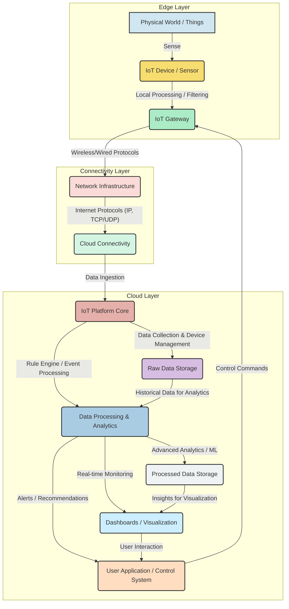

### 1. What is meant by data acquisition in IoT? List the steps involved.

**Data Acquisition in IoT** refers to the fundamental process of collecting raw data from various physical and virtual "things" or devices embedded with sensors within an Internet of Things ecosystem. This process involves detecting changes in the environment (such as temperature, pressure, light, motion, or gas levels) or monitoring the state of devices, and then converting these physical phenomena or states into electrical or digital signals. These signals can then be transmitted, processed, stored, and analyzed to enable intelligent decision-making and control for IoT applications. The primary objective is to gather accurate and timely real-world information to power the system.

The provided document details a comprehensive **10-step "IoT Design Methodology"** on page 35, which guides the complete design of an IoT system. Data acquisition is not a single isolated action but is intricately planned and implemented across several of these steps:

1.  **Step 1: Purpose & Requirements Specification.**
    *   This initial and critical step identifies the overall purpose and requirements of the IoT system. Crucially for data acquisition, it involves capturing **data collection requirements**, specifying *what* data needs to be acquired, *why* it's essential (e.g., for monitoring environmental conditions, tracking asset location), and the necessary characteristics like frequency, resolution, and accuracy.

2.  **Step 2: Process Specification.**
    *   Here, the use cases of the IoT system are formally described. These process flows inherently dictate the specific data inputs required at various stages, thereby detailing the necessary data acquisition scenarios and triggers.

3.  **Step 3: Domain Model Specification.**
    *   This step defines the main concepts, entities, and objects within the IoT system's domain. For data acquisition, this involves identifying the "things" (physical objects) or virtual entities that will serve as data sources (e.g., specific types of sensors, smart appliances, vehicles) and their relationships.

4.  **Step 4: Information Model Specification.**
    *   Following the domain model, this step defines the precise structure of all information within the IoT system. For acquired data, it specifies the attributes of "Virtual Entities" and their relations, thereby determining *how* the raw sensor data will be organized and represented once collected.

5.  **Step 5: Service Specifications.**
    *   This step defines the various services the IoT system will offer (e.g., device monitoring, data publishing, control services). For data acquisition, it specifies how the collected data will be consumed as inputs by these services to enable their functionalities.

6.  **Step 6: IoT Level Specification.**
    *   This step defines the IoT level for the system (e.g., Level-1, Level-2), which determines its complexity, processing capabilities, and data storage approach. This choice indirectly influences the scale and method of data acquisition, such as whether data is processed locally at a single node or distributed across multiple nodes before being sent to the cloud.

7.  **Step 7: Functional View Specification.**
    *   This step defines the functional groups and capabilities of the IoT system. Data acquisition is a core function, and this step outlines how the incoming data will be handled by various functional components, such as data processing, storage, and communication modules.

8.  **Step 8: Operational View Specification.**
    *   This step defines various options related to the deployment and operation of the IoT system. For data acquisition, this includes considering "device options" (selecting appropriate sensors and hardware), "storage options" for the acquired data (local vs. cloud), and network configurations that facilitate data flow.

9.  **Step 9: Device & Component Integration.**
    *   This is the practical implementation phase where the actual devices and components responsible for data generation and initial collection are physically integrated into the IoT environment. This includes connecting sensors, configuring embedded systems, and establishing communication links.

10. **Step 10: Application Development.**
    *   In the final step, IoT applications are developed. These applications interact with the acquired and processed data, providing user interfaces for monitoring, control, and visualization, thus leveraging the data gathered through the earlier acquisition steps.
   
### 2. Differentiate between descriptive, predictive, and prescriptive data analytics.

The document discusses "Big Data Analytics" and "Machine learning" as ways to derive insights, but it doesn't explicitly define descriptive, predictive, and prescriptive analytics as distinct categories. However, their functions can be inferred:

*   **Descriptive Analytics:** These focus on understanding what has happened. The document mentions analytics tools being applied to "telemetry data to generate descriptive reports, to present data through dashboards and data visualizations". This implies summarizing past and current data to describe phenomena.
*   **Predictive Analytics:** These aim to forecast what will happen. The document states that analytics can be used to "predict trends" and "predict the outcome of applying a specific action" in the context of machine learning. Smart grids also use data analysis to "prepare of highly realistic consumption forecasts".
*   **Prescriptive Analytics:** These go a step further by suggesting what action should be taken. The document notes that machine learning can be used to "optimize for specific outcomes" and "optimize the configuration of an IoT system in terms of cost or performance". Smart grids provide "predictive information and recommendations to utilities, their suppliers, and their customers on how best to manage power". This implies suggesting actions based on predictions and desired outcomes.

### 3. Define data validation and explain its importance in IoT applications.

The provided text does not explicitly define "data validation" as a distinct concept. However, its importance can be inferred from discussions around data accuracy and integrity:

**Data Validation** (inferred): This refers to the process of ensuring the accuracy, consistency, and quality of data collected from IoT devices before it is processed, stored, or used for decision-making. It involves checking data against predefined rules and constraints to identify and correct errors, inconsistencies, or outliers.

**Importance in IoT Applications:**
*   **Ensuring Data Accuracy and Integrity:** The document emphasizes the need to "Validate the accuracy and integrity of the IoT data before visualizing it. Check for outliers, missing data, and any data inconsistencies that could affect the reliability and validity of the visualizations". Incorrect or misleading visualizations can lead to poor decision-making.
*   **Reliable Decision-Making:** High-quality and validated data is crucial for making informed and effective decisions, as IoT systems are designed to provide "actionable insights for making smart decisions".
*   **Optimizing Processes:** Valid data ensures that analytics and machine learning models operate on reliable inputs, leading to accurate insights for "optimizing processes" and "improving overall operational efficiency".
*   **Preventing System Failures:** Identifying anomalies and issues through data quality checks can help "proactively address problems or take necessary actions" and "prevent system failures".
*   **Efficient Data Processing:** Validating data at an early stage reduces the need for reprocessing or correcting errors later, making the overall data pipeline more efficient. The document mentions data being "pre-processed to filter out duplicates or to re-order, aggregate or normalize the data prior to analysis" at the edge, which contributes to data quality before deeper analysis.

### 4. What is streaming data processing?

**Streaming data processing** refers to the real-time or near real-time analysis of data as it is generated and transmitted, rather than processing it in batches after it has been stored.

The document highlights:
*   "Real-time analytics are also ideal for time series data, because unlike batch processing, real-time analytics tools usually support controlling the window of time analysis, and calculating rolling metrics".
*   "For real-time data streaming from IoT devices, tools like Apache Kafka and Apache Flink are often used. These tools allow for the data ingestion, processing, and visualization of high-velocity IoT data streams. They provide real-time visualizations and analytics for streaming data, enabling organizations to monitor and analyze IoT data as it flows".
*   "IoT devices generate data in real-time, which requires near-instantaneous analysis. Data visualizations provide real-time monitoring dashboards, enabling organizations to track key performance indicators (KPIs), identify anomalies, and respond promptly to critical events".

This indicates that streaming data processing is essential for applications where immediate insights and responses are required, dealing with high-velocity data streams.

### 5. Explain the key terminologies of the IoT Application Layer. Also discuss in detail the stages of data generation, data acquisition, data validation, and data categorization for storage.

**Key Terminologies of the IoT Application Layer:**
The Application Layer defines how applications interface with lower layer protocols to send data over the network and enables process-to-process communication using ports. Key protocols mentioned include:

*   **HTTP (Hyper Text Transfer Protocol):** Forms the foundation of the WWW, follows a request-response model. RESTful web services use HTTP methods (GET, PUT, POST, DELETE) for communication.
*   **CoAP (Constrained Application Protocol):** Designed for machine-to-machine (M2M) applications with constrained devices, environments, and networks. Uses a client-server architecture.
*   **WebSocket:** Allows full-duplex communication over a single socket connection. WebSocket APIs follow the exclusive pair communication model.
*   **MQTT (Message Queue Telemetry Transport):** A lightweight messaging protocol based on a publish-subscribe model. Uses client-server architecture and is well-suited for constrained environments.
*   **XMPP (Extensible Message and Presence Protocol):** Used for real-time communication and streaming XML data between network entities. Supports client-server and server-server communication.
*   **DDS (Data Distribution Service):** Data-centric middleware standards for device-to-device or machine-to-machine communication. Uses a publish-subscribe model.
*   **AMQP (Advanced Message Queuing Protocol):** An open application layer protocol for business messaging, supporting both point-to-point and publish-subscribe models.

**Stages of Data Generation, Data Acquisition, Data Validation, and Data Categorization for Storage:**

*   **Data Generation:** This is the initial stage where raw data originates from the physical world. In IoT, this primarily occurs through:
    *   **Sensors:** Devices that detect changes in the environment (e.g., temperature, pressure, light, motion, gas) and convert physical phenomena into electrical signals.
    *   **Actuators:** While primarily performing actions, they can also provide feedback or status data to the system.
    *   **IoT Devices:** The "Things" themselves, which have unique identities and perform remote sensing and monitoring capabilities. Examples include smart meters, health and fitness devices, security cameras, and industrial machines.

*   **Data Acquisition:** This stage involves collecting the generated data and bringing it into the IoT system for processing.
    *   IoT devices "collect data from other devices and process the data locally or Send the data to centralized servers or cloud-based application back-ends for processing the data".
    *   Wireless Sensor Networks (WSNs) are used to "monitor the environmental and physical conditions," where a coordinator "collects the data from all the nodes" and acts as a gateway to the internet.
    *   The collection can happen over various communication protocols at the link, network, transport, and application layers (as discussed above).

*   **Data Validation:** This stage focuses on ensuring the quality and reliability of the acquired data.
    *   As inferred earlier, this involves checking data for accuracy, consistency, and completeness.
    *   The document implies this by discussing the need for "pre-processing to filter out duplicates or to re-order, aggregate or normalize the data prior to analysis" which often occurs "at the point of acquisition, on the IoT devices themselves or on gateway devices that aggregate the data".
    *   This is critical to avoid "incorrect or misleading visualizations" and "poor decision-making".

*   **Data Categorization for Storage:** After validation, data is organized and prepared for storage, often based on its type, source, and intended use.
    *   The document mentions that in distributed analytics, "device data might be bucketed into databases for each device per time period, such as hourly, daily, or monthly". This is a form of categorization.
    *   "Big data comes in different forms such as structured or unstructured data including test data, image, audio, video and sensor data". This variety necessitates categorization to manage and store it effectively.
    *   The goal is to store data efficiently for later use, including "intelligent monitoring and activation using other devices" and for various types of analytics.

### 6. Describe the various data storage methods in IoT, including the roles of data stores, data center management, and server management.

The document highlights that storing and processing large amounts of data is a key challenge and a core function of IoT systems.

**Various Data Storage Methods in IoT:**

*   **Local Databases/Storage:**
    *   IoT Level-1 systems have "a single node that... stores data". An example is home automation, where "status information of each light or appliances is maintained in a local database".
    *   Some IoT devices might "process the data locally" before sending it to centralized servers.
    *   M2M data is sometimes collected in "point solutions and often in on-premises storage infrastructure".

*   **Cloud-based Storage:** This is a predominant method for IoT data due to its scalability and accessibility.
    *   "The Internet of Things represents the whole way from collecting data, processing it, taking an action corresponding to the signification of this data to storing everything in the cloud".
    *   IoT data is "collected in the cloud (can be public, private or hybrid cloud)".
    *   Cloud computing provides "storage resources on demand" as "metered services".
    *   Examples include storing soil moisture data in a "cloud database" for smart irrigation or vibration levels in the cloud for package monitoring.
    *   **Infrastructure-as-a-Service (IaaS):** Provides users the ability to provision "computing and storage resources" as "virtual machine instances and virtual storage".
    *   **Platform-as-a-Service (PaaS):** Offers the ability to develop and deploy applications in the cloud, often including data storage solutions.
    *   **Software-as-a-Service (SaaS):** The cloud service provider manages the underlying cloud infrastructure, including storage.
    *   **Public, Private, and Hybrid Clouds:** These different cloud models offer flexibility in how data is stored and accessed, with private clouds offering greater control and security for sensitive data.

*   **Distributed Storage:** For vast amounts of historical data, especially in big data analytics.
    *   "Data can be spread across multiple databases; for example, device data might be bucketed into databases for each device per time period, such as hourly, daily, or monthly".
    *   Frameworks like Apache Hadoop (using MapReduce) and Apache Spark are used to process "distributed data" across storage and compute infrastructure.

**Roles of Data Stores, Data Center Management, and Server Management:**

*   **Data Stores (Databases):**
    *   These are the repositories where IoT data is actually kept. They can be relational databases, NoSQL databases (e.g., Cloudant NoSQL database mentioned for IBM Watson IoT Historian Service), or other specialized data storage solutions.
    *   Their role is to reliably store the processed and categorized data for future use, analysis, and visualization.
    *   The "IoT Functional Blocks" include a "Management" block that "Provides various functions to govern the IoT system" and "Security" for "message and context integrity and data security," which would apply to data in storage.

*   **Data Center Management:**
    *   The document describes cloud computing as involving the "provisioning of computing, networking and storage resources". Data centers are the physical locations housing these resources.
    *   Data center management involves the overall operation, maintenance, and optimization of these facilities. This includes managing power, cooling, physical security, and the infrastructure that supports the data stores and servers.
    *   Well-designed "CI/CD pipelines, structured services, and sandboxed environments" contribute to a "secure environment" within data centers.
    *   The cloud "provides a path for data to reach its destination" within these data centers.

*   **Server Management:**
    *   Servers are the computational backbone that run the IoT platforms, applications, and databases.
    *   Server management involves configuring, monitoring, and maintaining the physical or virtual servers that host IoT services. This includes ensuring their availability, performance, and security.

### 7. How is data structured in databases? Explain the role of distributed databases in IoT.

**How Data is Structured in Databases:**
The provided document mentions that data in IoT systems can come in various forms, including "structured or unstructured data including test data, image, audio, video and sensor data". While it doesn't delve into specific database schemas, the concept of an "Information Model" in the IoT Design Methodology is key. This model "defines the structure of all the information in the IoT system, for example, attributes of Virtual Entities, relations, etc.". This implies that data, especially for analytical purposes, is organized and given a defined structure, often with attributes and relationships. For instance, in distributed analytics, "device data might be bucketed into databases for each device per time period, such as hourly, daily, or monthly".

**Role of Distributed Databases in IoT:**
Distributed databases are crucial in IoT due to the immense scale, speed, and diversity of data generated.

*   **Handling Large Data Volumes:** IoT devices generate "massive volumes of data" that are often too vast to be "stored or processed by a single node". Distributed databases allow this data to be spread across multiple storage locations, accommodating the sheer quantity.
*   **Scalability:** They enable "scalable" solutions, particularly when "multiple nodes are required, the data involved in big and the analysis requirements are computationally intensive". Distributed databases can grow horizontally by adding more nodes, allowing the system to handle increasing data loads without significant performance degradation.
*   **Geographical Distribution:** Data often originates from diverse geographical locations. Distributed databases can store data closer to its source, which can improve "querying across distributed databases" and reduce latency.
*   **High Availability and Fault Tolerance:** By replicating data across multiple nodes, distributed databases ensure that data remains accessible even if some nodes fail. This is critical for continuous IoT operations, where downtime can have significant consequences.
*   **Enabling Distributed Analytics:** They provide the necessary infrastructure for "Distributed analytics," where processing can occur across geographically spread data. The document mentions "Apache Hadoop" and "Apache Spark" as frameworks for processing distributed data.

### 8. Describe various transaction processing methods such as batch, real-time, streaming, and interactive processing.

The document discusses different approaches to data processing, which can be categorized into these methods:

*   **Batch Processing:**
    *   **Description:** This method involves processing data in large batches after it has been collected and stored over a period. It's suitable when immediate results are not required and historical context is important.
    *   **In IoT:** The document states that "Analytics can be performed... through batch processing of historical data". It specifically mentions "Apache Hadoop is a batch processing framework that uses a MapReduce engine to process distributed data". Batch processing is ideal for "historical IoT data analytics... where time sensitivity is not an issue, such as performing analysis over a complete set of data and producing a result at a later time".

*   **Real-time Processing:**
    *   **Description:** This method involves processing data as it arrives or very shortly after its generation, aiming for near-instantaneous analysis and response.
    *   **In IoT:** "IoT devices generate data in real-time, which requires near-instantaneous analysis". "Real-time data visualization empowers organizations to make informed decisions and take timely actions". It's crucial for applications needing immediate insights and responses. Examples include "real-time monitoring dashboards" that display "up-to-date insights and alerts on key performance indicators and metrics".

*   **Streaming Processing:**
    *   **Description:** A subset of real-time processing, streaming processing specifically deals with continuous, high-velocity data streams, analyzing data "in motion" rather than "at rest."
    *   **In IoT:** The document explicitly mentions "Streaming data processing" as a method where "Analytics for high-volume IoT data streams is often performed in real-time, particularly if the stream includes time-sensitive data, where batch processing of data would produce results too late to be useful or any other application where latency is a concern". Tools like "Apache Kafka and Apache Flink" are highlighted for "data ingestion, processing, and visualization of high-velocity IoT data streams".

*   **Interactive Processing:**
    *   **Description:** This method allows users to directly interact with data, explore it dynamically, and receive immediate feedback based on their queries or manipulations.
    *   **In IoT:** The document emphasizes "Interactive Data Exploration" and states that "Interactive visualizations enhance the exploration process and support data-driven decision-making". Tools offer features like "filters, drill-downs, and zoom features, to delve deeper into the data and uncover more detailed insights". This method empowers users to dynamically analyze IoT data for deeper understanding.

### 9. Explain the complete data flow in IoT systems, from generation to storage, with a diagram.

The complete data flow in IoT systems generally involves several stages, from the physical generation of data by devices to its eventual storage and analysis. The provided document implicitly describes this flow across various sections.

**Complete Data Flow in IoT Systems:**

1.  **Data Generation (Things/Devices Layer):**
    *   This is the origin point where raw data is created. In IoT, this primarily occurs from "IoT devices which have unique identities and can perform remote sensing, actuating and monitoring capabilities".
    *   Sensors (e.g., temperature, pressure, motion, gas) embedded in these devices detect physical phenomena or device states and convert them into electrical signals.

2.  **Data Acquisition & Local Processing (Connectivity/Edge Layer):**
    *   The generated raw data is collected from devices through various interfaces (wired or wireless) and communication protocols (e.g., Wi-Fi, Zigbee, LoRa, 6LoWPAN).
    *   "IoT devices can... Collect data from other devices and process the data locally or Send the data to centralized servers or cloud-based application back-ends for processing the data".
    *   "Edge analytics" can occur here to "filter out duplicates or to re-order, aggregate or normalize the data prior to analysis," reducing latency and bandwidth usage before data is sent upstream. Gateways often facilitate this local processing and connectivity to broader networks.

3.  **Data Transmission to Cloud/Centralized Systems:**
    *   The processed or raw data is then transmitted to centralized servers or cloud-based application back-ends for further processing and storage.
    *   This transmission relies on various network protocols, including Link Layer, Network/Internet Layer (IPv4/IPv6), Transport Layer (TCP/UDP), and Application Layer (HTTP, MQTT, CoAP).
    *   "An IoT platform... connects your hardware... to the cloud by using flexible connectivity options".

4.  **Core IoT Features / Cloud Processing:**
    *   Once in the cloud, the data is handled by core IoT platform features. These include "data collection, device management, configuration management, messaging, and OTA software updates".
    *   A "Rule Engine" processes incoming data streams to "trigger alerts and actions" based on predefined conditions.

5.  **Data Analysis (Applications & Analytics Layer):**
    *   Sophisticated analytics, including descriptive, predictive, and prescriptive methods, are applied to the data to extract insights.
    *   This layer performs "Reporting, Visualization, Analytics".
    *   Machine learning techniques may be used to identify patterns, predict outcomes, and optimize system performance.

6.  **Data Storage:**
    *   Both raw and processed data are stored persistently in various data stores, typically within the cloud.
    *   This can involve "centralized servers or cloud-based application back-ends" or "distributed databases" for very large datasets.
    *   "IoT data is collected in the cloud (can be public, private or hybrid cloud)".

7.  **Action & Feedback (User Interface/Actuation Layer):**
    *   Insights derived from analysis are presented to users via "dashboards and data visualizations".
    *   Based on rules or user commands, actions can be initiated, sending control signals back to actuators or devices in the physical world.
    *   Alerts and notifications are also generated to inform stakeholders.

Here's the mermaid diagram representing the complete data flow:

### 10. Discuss types of data analytics in IoT with suitable real-life examples.

The document discusses various forms of data analytics crucial for extracting value from IoT data. These can be broadly categorized as:

1.  **Descriptive Analytics:**
    *   **Description:** Focuses on summarizing past and present data to understand "what has happened." It provides insights into historical data to identify patterns and trends.
    *   **In IoT:** Analytics tools are applied to "telemetry data to generate descriptive reports, to present data through dashboards and data visualizations".
    *   **Real-life Examples:**
        *   **Weather Monitoring Systems:** Nodes collect "temp, humidity and other data, which is aggregated and analyzed" to show current and historical weather patterns for a region.
        *   **Smart Grids:** Collects "data captured in near-real-time about power transmission, distribution and consumption" to understand current energy usage and identify peak consumption times.

2.  **Predictive Analytics:**
    *   **Description:** Uses historical data, statistical models, and machine learning to forecast "what will happen" in the future, identifying potential trends and risks.
    *   **In IoT:** Analytics can "predict trends" and "predict the outcome of applying a specific action". Smart grids use data to "prepare of highly realistic consumption forecasts".
    *   **Real-life Examples:**
        *   **Predictive Maintenance (Industrial IoT):** Monitoring "machinery performance and function" consistently to "see any issue before it occurs" and predict equipment failures, allowing for proactive maintenance scheduling.
        *   **Smart Vending Machines:** Sensors monitor operations and send data to the cloud for "predictive maintenance".

3.  **Prescriptive Analytics:**
    *   **Description:** Goes beyond prediction to recommend "what action should be taken" to achieve desired outcomes. It suggests specific steps to optimize processes or mitigate risks.
    *   **In IoT:** Machine learning can be applied to "optimize for specific outcomes" and "optimize the configuration of an IoT system in terms of cost or performance". Smart grids provide "predictive information and recommendations to utilities... on how best to manage power".
    *   **Real-life Examples:**
        *   **Smart Irrigation:** Analyzing "soil moisture, temperature, and crop health" data to make "informed decisions on irrigation, fertilization, and disease control," potentially automating these processes.
        *   **Smart Lighting:** Adapting "lighting to the ambient conditions" and switching on/off or dimming lights when needed to "save energy".

4.  **Real-time Analytics / Streaming Analytics:**
    *   **Description:** Analyzes data as it is generated and flows through the system, providing immediate insights and enabling prompt responses for time-sensitive situations.
    *   **In IoT:** "IoT devices generate data in real-time, which requires near-instantaneous analysis". Tools like Apache Kafka and Apache Flink are used for "data ingestion, processing, and visualization of high-velocity IoT data streams".
    *   **Real-life Examples:**
        *   **Home Intrusion Detection:** PIR sensors and door sensors "detect intrusion and raise alerts" instantly, sending SMS or email notifications to the user.
        *   **Traffic Congestion Management (Smart Cities):** Real-time monitoring of "vehicle and pedestrian levels" allows "automatically alter the lights based on the current traffic situation to prevent congestion".

5.  **Edge Analytics:**
    *   **Description:** Analytics performed closer to the data source (on IoT devices or gateways) rather than in a centralized cloud. This reduces latency, conserves bandwidth, and enhances privacy.
    *   **In IoT:** "Analytics applied at the edges of the network, as close as possible to the devices generating the data is known as edge analytics". Data is "pre-processed to filter out duplicates or to re-order, aggregate or normalize the data prior to analysis" at this level.
    *   **Real-life Examples:**
        *   **Surveillance Systems:** Use WSNs for "collecting surveillance data (motion data detection)". Basic motion detection processing can occur at the camera itself, sending only event-triggered clips to the cloud.
        *   **Smart Home Level-1 Systems:** A "single node that performs sensing and/or actuation, stores data, performs analysis and host the application" locally, like a thermostat adjusting temperature based on local sensor readings.

### 11. What is event processing (assembly software) in IoT, and why is it important?

**What is Event Processing (Assembly Software) in IoT?**
Event processing in IoT refers to the continuous analysis and interpretation of streams of data, known as events, generated by IoT devices. The goal is to identify significant patterns, situations, or conditions that require a response or action. This is often implemented through a "Rule Engine" or "assembly software" as an integral part of an IoT platform. The document states that the "IoT platform technology stack" includes a "Rule Engine" and "Alerting" within its "Apps & Analytics" layer. For example, in a smart home system, the local server "processes the received sensors’ data, the task checks if any rule became true. In such case the system may launch a command to the proper device processor".

**Why is Event Processing Important?**

Event processing is crucial in IoT for several reasons:

1.  **Real-time Responsiveness:** IoT systems often deal with dynamic environments where timely reactions are critical. Event processing enables "real-time monitoring" and the ability to "respond promptly to critical events, mitigate risks, and ensure optimal operational performance".
2.  **Automation:** By defining rules based on events (e.g., if temperature exceeds a threshold), IoT systems can automate responses without direct human intervention. For instance, an "Intrusion Detection" system uses sensors to "detect intrusion and raise alerts" automatically.
3.  **Proactive Decision Making:** Event processing allows systems to identify emerging situations or anomalies before they escalate into major problems, enabling proactive measures. "Detecting anomalies in real-time helps prevent system failures, optimize processes, and improve overall operational efficiency".
4.  **Complex Pattern Detection:** It can analyze multiple events from various, often heterogeneous, sources to detect complex patterns that might not be obvious from individual data points. This allows for more sophisticated insights and triggers.
5.  **Efficiency and Resource Optimization:** By processing data at the edge or within the core IoT platform to identify significant events, only relevant information needs to be transmitted further or stored. This "reduces bandwidth requirements" and computational load on central systems, improving overall system efficiency.

### 12. Explain the importance of server and data center management in large IoT deployments.

Server and data center management are foundational to the success and sustainability of large IoT deployments. These deployments inherently generate, process, and store massive amounts of data, making robust infrastructure management critical. The document implicitly and explicitly highlights their importance through discussions on cloud computing, infrastructure, and overall system reliability.

**Importance of Server and Data Center Management:**

1.  **Scalability to Handle Massive Data and Devices:**
    *   Large IoT deployments involve "massive volumes of data" and a "large number of nodes or devices". Servers and data centers provide the essential computational and storage resources required to handle this scale.
    *   "Cloud computing involves provisioning of computing, networking and storage resources on demand". Effective server and data center management ensures these resources can be scaled up or down as needed to accommodate fluctuating IoT data loads and increasing numbers of connected devices.

2.  **Reliability and High Availability:**
    *   IoT applications, especially critical ones like smart grids or healthcare monitoring, demand continuous operation. "Cloud architecture must be well-designed since reliability, security, economy, and performance optimization depends upon it".
    *   Proper server and data center management ensures redundancy, fault tolerance, and disaster recovery mechanisms are in place, minimizing downtime and preventing service disruptions.

3.  **Security and Data Protection:**
    *   IoT data often includes sensitive information (e.g., medical records, surveillance footage), making security paramount. "IoT security is critical for organizations to protect their network environments from IoT device-borne threats".
    *   Data center management involves stringent physical security, robust network security measures, and access controls. Server management includes ensuring that operating systems, applications, and databases are regularly patched, securely configured, and continuously monitored for cyber threats. "Cloud solutions provide companies with reliable authentication and encryption protocols".

4.  **Performance and Low Latency:**
    *   Many IoT applications, such as real-time monitoring and control in smart cities or industrial automation, require "near-instantaneous analysis" and "real-time data transmission".
    *   Efficient server and data center management optimize network performance, processing speeds, and data retrieval times, which are crucial for maintaining responsiveness and delivering timely insights and actions. "Data centers with this approach make data processing much faster".

5.  **Cost Efficiency (Economy):**
    *   "Cloud computing involves provisioning of computing, networking and storage resources... as metered services to the users, in a 'pay as you go'".
    *   Effective server and data center management allows for optimal resource utilization, reducing unnecessary expenditures on hardware, power, and cooling, thus saving costs.

6.  **Centralized Management and Orchestration:**
    *   In a large IoT deployment, managing thousands or millions of individual devices and their data flows can be overwhelming. Data centers provide a centralized hub for "orchestration of IoT solution clusters" and "internal platform messaging".
    *   This enables comprehensive monitoring, configuration, and update management across the entire IoT ecosystem from a single point of control.

7.  **Support for Advanced Analytics and Machine Learning:**
    *   "Automated analytics" is essential for making sense of the vast amounts of IoT data. Large-scale analytics and machine learning often require significant computational power, which is provided by well-managed servers within data centers.
    *   These infrastructures enable the deployment of "advanced data analytics systems that make sense of and leverage data collected from systems, informing manufacturing improvements and operations".

In essence, robust server and data center management provides the reliable, secure, scalable, and efficient infrastructure without which large-scale IoT deployments cannot function effectively or deliver their promised value.
    *   In a cloud context, server management is often handled by the cloud service provider (especially in PaaS and SaaS), or by the organization for IaaS or private cloud deployments.
    *   The "Infrastructure-as-a-service (IaaS)" model provides "virtual machine instances," which represent managed server resources.
    *   The "IoT platform technology stack" has an "infrastructure level" which "enables the functioning of the platform," including "container management" and "orchestration of IoT solution clusters," implying server management.
