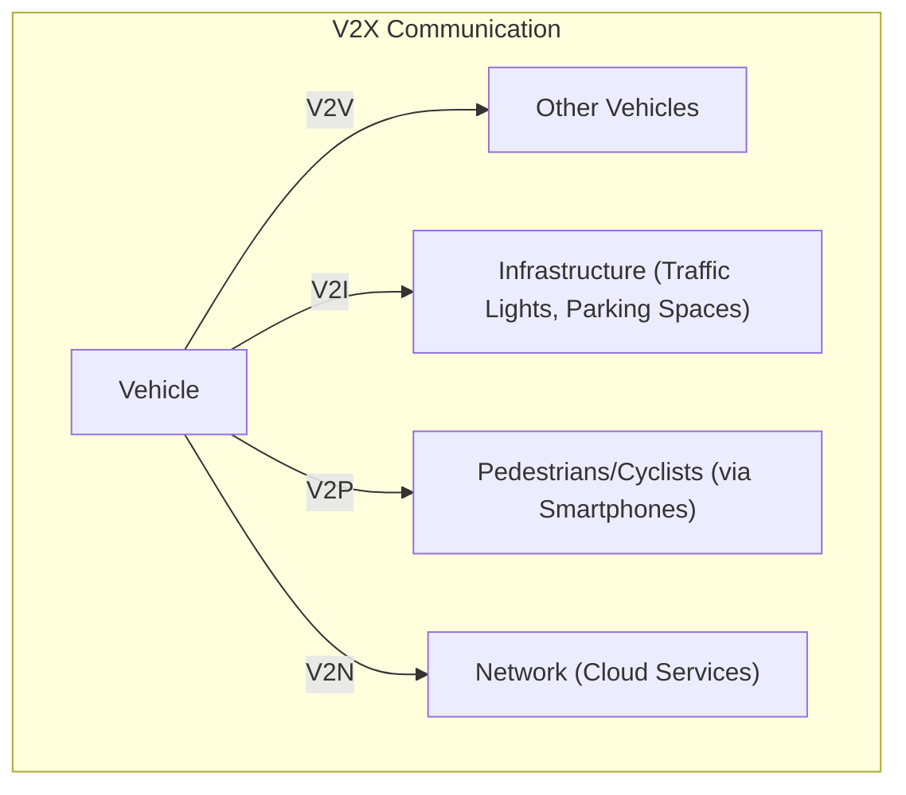
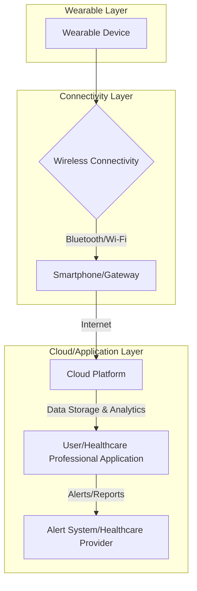

Here are the explanations for the requested IoT concepts and applications, drawing from the provided notes:

---

### 1. What is smart farming? Mention two IoT technologies used in it.

Smart farming refers to the application of IoT systems to monitor and control various aspects of agriculture to improve productivity and resource management. It involves using sensors and connected devices to gather data on environmental and physical conditions to make informed decisions.

Two IoT technologies used in smart farming are:

1.  **Smart Irrigation**: Systems that determine the moisture amount in the soil to optimize water usage.
2.  **Green House Control**: Systems designed to improve productivity within greenhouses.

---

### 2. Explain how a smart street lighting system works using IoT and list its benefits.

A smart street lighting system using IoT involves equipping streetlights with sensors and connecting them to a cloud management solution. These sensors detect conditions (e.g., presence of vehicles or pedestrians, ambient light) and send data to a central system. The cloud management solution processes this data and can then adapt the lighting schedule, intensity, or switch lights on/off based on the current context, lighting zone, and weather conditions.

**Benefits of a Smart Street Lighting System:**
*   **Cost-effectiveness**: Optimizes energy consumption by adjusting lighting as needed.
*   **Improved Maintenance**: Makes maintenance more straightforward and cost-effective by providing data on system status.
*   **Enhanced Public Safety**: Can potentially deter crime by providing appropriate lighting when and where needed.
*   **Environmental Benefits**: Reduces light pollution and energy waste.

---

### 3. Define the concept of a smart grid.

A smart grid is the next generation of electrical networks that are updated with communication technology and connectivity to drive smarter resource use. It's an IoT-enabled energy system that allows for two-way communication between connected devices and hardware, enabling them to sense and respond to user demands. This makes the power infrastructure more resilient, efficient, and less costly.

---

### 4. Mention four applications of IoT in smart city development.

Here are four applications of IoT in smart city development:

1.  **Smart Parking**: IoT systems detect the number of empty parking slots and send information to smart applications, making it easier for drivers to find parking.
2.  **Smart Lighting**: For roads, parks, and buildings, smart lighting systems help in saving energy by adapting to ambient conditions and switching on/off or dimming lights when needed.
3.  **Smart Roads**: Roads equipped with sensors can provide information on driving conditions, estimate travel times, and alert drivers about poor conditions or accidents.
4.  **Weather Monitoring**: Systems collect data from sensors to cloud-based applications for analysis and visualization, helping cities respond to environmental changes.

---

### 5. Explain the design and operation of a home automation system based on IoT, including its main components, communication techniques, and advantages.

**Design and Operation of a Home Automation System based on IoT:**
A smart home, as part of the IoT paradigm, integrates home automation by connecting objects and devices within a home to the internet, allowing users to remotely monitor and control them. This includes controlling lights, appliances, thermostats, and irrigation systems.

**Main Components:**
1.  **Sensors**: Collect internal and external home data, such as temperature, humidity, light, and proximity. These are connected to the home or attached devices.
2.  **Actuators**: Devices like smart switches or valves that perform actions (e.g., turning lights on/off, adjusting temperature, controlling irrigation) based on commands received.
3.  **Local Network (LAN Manager)**: Facilitates communication between sensors, actuators, and a local smart home server.
4.  **Smart Home Server/Processors**: Performs local processing of sensor data, applies rules, and generates commands for actuators. It can also be connected to the cloud for extended resources.
5.  **APIs (Application Programming Interfaces)**: Software components that allow external applications (e.g., smartphone apps) to interact with the system, process sensor data, or manage actions.
6.  **Database**: Stores processed sensor data and information from cloud services for analysis, presentation, and visualization.
7.  **Cloud Computing**: Provides shared computing resources for storage, processing, and communication, especially for tasks requiring extensive resources or remote access.

**Communication Techniques:**
*   **Local Network**: Sensors and actuators communicate with the local smart home server via a local network (e.g., Wi-Fi, Zigbee, Z-Wave, Bluetooth).
*   **Cloud Connectivity**: The local smart home server or individual devices can connect to the internet (and thus to cloud services) using various protocols (e.g., HTTP, MQTT, Wi-Fi) to enable remote monitoring, control, and data storage/analysis.

**Advantages:**
*   **Safety and Security**: Automated door locks, intrusion detection systems, and security cameras enhance home safety.
*   **Convenience**: Remote control of appliances, lighting, and thermostats via smartphones or voice commands.
*   **Energy Saving**: Adapting lighting to ambient conditions and managing thermostats efficiently reduces energy consumption.
*   **Increased Awareness**: Security cameras provide real-time monitoring and alerts.
*   **Easy Management and Control**: Centralized management through various devices like smartphones, laptops, and smartwatches.

---

### 6. Explain the working of a smart healthcare monitoring system using IoT, including sensors and data handling.

A smart healthcare monitoring system leveraging IoT uses connected devices and wearables to remotely monitor a patient's vital signs and collect health data.

**Working Mechanism:**
1.  **Sensors and Wearables**: IoT devices (e.g., smartwatches, specialized medical sensors) are equipped with various sensors to measure physiological parameters such as heart rate, blood pressure, temperature, blood flow, and activity levels.
2.  **Data Collection**: These sensors continuously collect real-time health data from patients.
3.  **Data Transmission**: The collected data is transmitted wirelessly (e.g., via Wi-Fi, Bluetooth) to a local gateway or directly to cloud-based applications.
4.  **Data Handling and Analysis**:
    *   **Cloud Storage and Processing**: The raw health data is stored and processed in the cloud.
    *   **Data Visualization**: Data visualization tools create interactive dashboards, charts, and graphs to present the health data in an easily understandable format to healthcare professionals and patients.
    *   **Trend Identification and Anomaly Detection**: These visualizations and analytics help identify patterns, trends in health parameters, and detect anomalies (e.g., a sudden drop in vital signs). Machine learning algorithms can be employed for predictive analysis, such as anticipating potential health issues.
5.  **Alerts and Decisions**: When anomalies are detected or pre-defined thresholds are crossed, the system can trigger alerts to healthcare workers or family members. This enables timely intervention and personalized care. For instance, an M2M-connected life support device could automatically administer oxygen if a patient's vital signs drop.

---

### 7. Describe the idea of a connected car in IoT. Explain its architecture, communication technologies, and major applications.

The idea of a connected car in IoT, often referred to as **Vehicle to Everything (V2X)**, involves enabling vehicles to communicate with other vehicles, infrastructure, and personal devices. This communication aims to transform surface transportation systems to improve safety, traffic efficiency, and fuel efficiency.

**Architecture and Communication Technologies:**

The V2X communication system facilitates the transfer of information between a vehicle and moving parts of the traffic system that may affect it. The information typically travels through high-bandwidth, high-reliability links.

**Mermaid Diagram: V2X Communication Model**

Key communication components and technologies include:

*   **Vehicle-to-Vehicle (V2V)**: Allows cars, trucks, buses, and other vehicles to "talk" to each other directly using in-vehicle or aftermarket devices. This helps in sharing important safety and mobility information.
*   **Vehicle-to-Infrastructure (V2I)**: Enables vehicles to communicate with external entities like traffic signals, work zones, toll booths, and parking spaces.
*   **Vehicle-to-Pedestrian (V2P)**: Facilitates communication with pedestrians and cyclists, typically via their smartphones, to enhance safety.
*   **Vehicle-to-Network (V2N)**: Connects vehicles to cloud services for broader data exchange, analytics, and service delivery.

**Communication Technologies (underlying V2X):**
*   **Wireless Communication**: Various wireless technologies are utilized, including satellite, cellular (2G/3G/4G/5G), and dedicated short-range communications (DSRC), depending on performance requirements.
*   **Protocols**: Standard communication protocols are used for data exchange between vehicles and other entities.

**Major Applications:**
1.  **Improved Road Safety**: By sharing information about potential dangers, road conditions, and nearby accidents, V2X helps reduce the severity of injuries, road accident fatalities, and collisions.
2.  **Traffic Efficiency and Congestion Management**: Vehicles can communicate with traffic signals to eliminate unnecessary stops and receive alternative route suggestions to avoid congestion, thereby optimizing traffic flow.
3.  **Fuel Efficiency**: Optimized routes and reduced unnecessary stops contribute to better fuel economy.
4.  **Remote Vehicle Diagnostics**: On-board IoT devices collect data on vehicle operations (speed, RPM, etc.) and subsystem status, enabling remote monitoring and predictive maintenance.
5.  **Shipment Monitoring (Logistics)**: IoT-based systems use sensors to monitor conditions (temperature, humidity) of shipments in connected vehicles, helping to detect spoilage.
6.  **Fleet Tracking (Logistics)**: GPS is used to track vehicle locations in real-time.
7.  **Autonomous Vehicles**: V2X systems can provide crucial environmental and traffic information to autonomous vehicles, enabling them to make informed decisions.

---
### 8. How does IoT improve smart grid efficiency and monitoring?

IoT significantly enhances smart grid efficiency and monitoring by enabling real-time data collection, analysis, and automation across the energy distribution system.

Here's how:
*   **Real-time Monitoring and Data Collection**: IoT devices like smart meters and various sensors are deployed across the grid to continuously monitor parameters such as electricity flow, voltage levels, usage patterns, and equipment health. This continuous data flow provides utilities with immediate insights into grid performance.
*   **Optimized Energy Distribution and Load Balancing**: By analyzing real-time data, smart grids can dynamically optimize energy distribution, minimize energy waste, and efficiently allocate resources. This includes balancing the load by influencing consumer behavior through demand response programs, where consumers are incentivized to shift energy usage to non-peak hours.
*   **Predictive Maintenance**: IoT sensors can identify potential issues in grid components (like transformers) before they escalate into major problems. This allows for proactive maintenance, reducing downtime, extending equipment lifespan, and lowering maintenance costs.
*   **Faster Outage Detection and Response**: Real-time data from IoT devices can trigger immediate alerts, enabling operators to quickly identify, locate, and isolate issues. Some IoT-enabled smart grids can even employ self-healing capabilities, automatically rerouting power to minimize the impact of outages and improve reliability.
*   **Integration of Renewable Energy Sources**: IoT facilitates the seamless integration of distributed energy resources (DERs) like solar panels, wind turbines, and energy storage systems. Sensors monitor energy generation and storage levels, optimizing the utilization of renewable sources and managing bi-directional energy flows.
*   **Enhanced Energy Efficiency for Consumers**: Smart meters and IoT devices provide consumers with detailed insights into their energy consumption patterns. This empowers them to make informed decisions about their usage and implement energy-saving measures, promoting overall energy efficiency.
*   **Accurate Billing and Reduced Balancing Costs**: Smart grids provide real-time consumption data, leading to more accurate bills and reducing reliance on estimates. Utilities can use this data for highly realistic consumption forecasts, allowing them to better tailor power production and reduce energy surpluses.

### 9. Explain the structure and functioning of a smart farming system using IoT. Also describe the types of sensors used, communication methods, and benefits in agriculture.

Smart farming, or smart agriculture, leverages IoT technology to enhance efficiency, productivity, and sustainability in agricultural practices. It involves deploying sensors and devices to collect data, enabling farmers to make informed decisions for crop and livestock management.

**Structure and Functioning:**
An IoT-enabled smart farming solution typically follows a four-layer architecture:
1.  **Perception (Sensing and Actuator) Layer**: This foundational layer involves sensors and actuators deployed directly in the fields or on farming assets. Sensors collect various data points, while actuators are responsible for carrying out automated tasks.
2.  **Network Layer**: This layer facilitates secure and efficient communication between the deployed devices (sensors and actuators) and other components of the system, often connecting to cloud platforms.
3.  **Cloud Layer**: This layer is responsible for storing and processing the vast amounts of data collected from the field. It enables advanced analytics and provides a centralized platform for data management.
4.  **Application Layer**: This top layer provides insights and analytics to farmers, often through user-friendly interfaces like mobile applications. It translates raw data into actionable information, helping farmers make decisions and control operations.

The system functions by continuously collecting data from the field via sensors. This data is transmitted through a network, stored, and analyzed in the cloud. Based on the analysis, the system can trigger automated actions through actuators (e.g., irrigation) or provide recommendations to farmers, allowing for precise and timely interventions.

**Types of Sensors Used:**
*   **Soil Moisture Sensors**: Determine the water content in the soil to optimize irrigation.
*   **Temperature Sensors**: Monitor soil and ambient temperatures, crucial for crop growth and environmental control.
*   **Humidity Sensors**: Measure air humidity, which is important for weather prediction and preventing crop diseases.
*   **Light Sensors**: Detect light levels for greenhouse management and optimizing plant growth.
*   **pH Sensors**: Analyze soil pH to guide fertilization strategies.
*   **Crop Monitoring Sensors**: Track crop growth and detect early signs of disease or stress.
*   **Weather Sensors**: Collect data on rainfall and other weather patterns for adaptive decision-making.
*   **Chemical and Gas Sensors**: Can identify hazardous substances in the environment or for soil quality analysis.
*   **Livestock Wearables**: Monitor animal health, vital signs (temperature, heart rate), activity levels, and behavior for improved welfare and early disease detection.

**Communication Methods:**
Smart farming solutions often rely on wireless communication protocols due to the expansive nature of agricultural fields. These can include:
*   **Wireless Sensor Networks (WSN)**: For local data collection from distributed sensors.
*   **Cellular Networks (2G/3G/4G/5G)**: For transmitting data over longer distances to cloud servers.
*   **RF Technologies (e.g., Zigbee, DigiMesh, Bluetooth)**: For short to long-range applications, connecting various IoT farming devices.
*   **Cloud Connectivity**: Securely moves field data to utility systems for processing and storage.

**Benefits in Agriculture:**
*   **Increased Efficiency and Productivity**: Farmers can monitor crops and livestock in real-time, predict problems, and automate processes, leading to higher yields and better quality produce.
*   **Resource Conservation**: Precision farming, enabled by IoT, optimizes the use of water, fertilizers, and pesticides by applying them only where and when needed, reducing waste.
*   **Sustainable Practices**: Minimizing the use of chemicals and optimizing resources leads to more environmentally friendly farming with a smaller carbon footprint.
*   **Early Detection and Prevention**: Sensors assist in the early detection of pests, diseases, and equipment malfunctions, allowing for timely intervention and protection of crops and livestock.
*   **Better Livestock Management**: Continuous monitoring of animal health and behavior leads to improved animal welfare and productivity.
*   **Remote Monitoring and Control**: Farmers can remotely oversee and control various operations like irrigation systems and feeding systems, reducing manual labor.
*   **Data-Driven Decision Making**: IoT provides actionable insights, empowering farmers to make quicker and wiser decisions related to their farm business.

### 10. Describe the IoT architecture used in connected car systems, including the roles of GPS, vehicle sensors, communication modules, cloud services, and mobile applications.

The IoT architecture for connected car systems, often referred to as Vehicle-to-Everything (V2X), transforms vehicles into sophisticated, internet-connected endpoints capable of two-way communication to enhance safety, efficiency, and user experience.

The architecture can be conceptualized in several layers:

1.  **Device/Vehicle Layer**:
    *   **Vehicle Sensors**: These are the "eyes, ears, and nose" of the connected car. They continuously collect vast amounts of real-time data on vehicle operations, internal conditions, and the surrounding environment. Examples include sensors for speed, RPM, fuel consumption, tire pressure, engine status, driver behavior, and external conditions (e.g., weather, road conditions).
    *   **GPS (Global Positioning System)**: Integrated into the vehicle, GPS modules provide precise real-time location tracking. This data is fundamental for navigation, route optimization, asset tracking, and location-based services.
    *   **In-vehicle Hardware/Software (Telematics)**: This foundational layer includes the embedded hardware and software responsible for gathering, processing, and transmitting data from the sensors and GPS. It often includes a chipset (Data Flow Management System) and a built-in antenna for connectivity.

2.  **Communication Layer**:
    *   **Communication Modules**: These modules enable the vehicle to connect to the internet and other entities. They support various technologies to facilitate different types of V2X communication:
        *   **Cellular Networks (2G/3G/4G/5G)**: Provide wide coverage and high speeds, ideal for data-intensive tasks like streaming media, downloading maps, and connecting to cloud services.
        *   **Dedicated Short-Range Communication (DSRC)**: A short-range wireless communication technology specifically designed for connected cars, offering low latency and high reliability for safety-critical applications like collision avoidance.
        *   **Bluetooth/Wi-Fi**: For shorter-range connections to personal devices or local networks.
        *   **Vehicle-to-Vehicle (V2V)**: Direct communication between vehicles to exchange safety and mobility information.
        *   **Vehicle-to-Infrastructure (V2I)**: Communication with road infrastructure like traffic lights, parking spaces, and work zones.
        *   **Vehicle-to-Pedestrian (V2P)**: Communication with pedestrians and cyclists, often via their smartphones.
        *   **Vehicle-to-Network (V2N)**: Connects the vehicle to broader network services and the cloud.

3.  **Cloud Layer**:
    *   **Cloud Services/Platforms**: This is the integration layer where data from connected vehicles is stored, processed, and analyzed in real-time. Cloud platforms like AWS IoT Core or Google Cloud IoT Core provide robust and scalable computing environments.
    *   **Data Ingestion**: Services like Cloud Pub/Sub handle large volumes of data generated by vehicles (GPS, RPM, images).
    *   **Data Storage**: Scalable storage services, such as Cloud BigTable or Amazon S3, are used for time-series data and historical data.
    *   **Data Analytics**: Cloud services like Cloud Dataflow or Amazon SageMaker AI process data pipelines, combine vehicle data with other corporate data, and perform advanced analytics to gain insights into events, trends, and potential failures. Machine learning models are crucial here for predictive analysis, such as predicting equipment failures or optimizing ADAS/AV models.
    *   **Device Management**: Cloud platforms provide tools for secure device management, authentication, authorization, and over-the-air (OTA) updates for vehicle software and firmware.

4.  **Application Layer**:
    *   **Mobile Applications**: Dedicated smartphone apps provided by car manufacturers or third parties allow drivers, fleet managers, and other users to remotely monitor and control their vehicles. This includes features like locking/unlocking doors, checking vehicle location, remote diagnostics, route planning, and receiving alerts.
    *   **Digital Services**: This layer delivers various features directly to users, including infotainment, navigation, predictive maintenance alerts, and usage-based insurance.

This multi-layered architecture ensures secure, reliable, and scalable communication, transforming vehicles into intelligent, interconnected parts of a larger IoT ecosystem.

### 11. How are wearable devices integrated with IoT? Design a basic health monitoring system.

Wearable devices are inherently integrated with the Internet of Things (IoT) as they are smart, often miniaturized, electronic devices equipped with sensors that collect personal data and transmit it over a network. They serve as direct data sources in an IoT ecosystem, extending connectivity and data collection to the human body and immediate environment. This integration allows for continuous monitoring, greater individual awareness of health conditions, and real-time data transmission to healthcare professionals or personal health platforms.

**Design of a Basic Health Monitoring System using Wearable IoT Devices:**

A basic IoT-based health monitoring system leverages wearable devices to track vital physiological parameters and provide real-time insights into a user's health.

**Mermaid Diagram: Basic IoT Health Monitoring System**

**Components and Functioning:**

1.  **Wearable Device (Sensor Layer)**:
    *   **Purpose**: To continuously collect physiological data from the user. These devices are typically compact and worn on the body (e.g., wrist, chest).
    *   **Sensors**:
        *   **Heart Rate Sensor (e.g., PPG sensor)**: Measures the user's pulse or heart rate.
        *   **Temperature Sensor (e.g., thermistor)**: Monitors body temperature.
        *   **Accelerometer/Gyroscope**: Tracks physical activity levels, steps, and can detect falls.
        *   **Pulse Oximeter (SpO2 sensor)**: Measures peripheral oxygen saturation.
    *   **Microcontroller (e.g., ESP32)**: Processes raw sensor data, manages power, and handles local communication.

2.  **Wireless Connectivity (Local Communication)**:
    *   **Purpose**: To transmit collected data from the wearable device to a local gateway or directly to the internet.
    *   **Technologies**:
        *   **Bluetooth Low Energy (BLE)**: Common for short-range, low-power communication to a smartphone.
        *   **Wi-Fi**: For direct connection to a local network if available, or through a smartphone hotspot.

3.  **Smartphone/Gateway**:
    *   **Purpose**: Acts as an intermediary, receiving data from the wearable and forwarding it to the cloud. It can also provide a local display for immediate feedback.
    *   **Role**: A smartphone typically hosts a dedicated application that pairs with the wearable, aggregates data, and uses its internet connection to upload the data. In some setups, a dedicated IoT gateway might perform this function.

4.  **Cloud Platform (Data Processing & Storage Layer)**:
    *   **Purpose**: To securely store, process, and analyze large volumes of health data from multiple users.
    *   **Services**:
        *   **Data Ingestion**: Handles streaming data from devices.
        *   **Secure Storage**: Databases and data lakes for raw and processed health data, ensuring privacy and regulatory compliance (e.g., HIPAA).
        *   **Data Analytics and Machine Learning**: Algorithms analyze trends, identify patterns, and detect anomalies in vital signs or activity levels. This can predict potential health issues or provide personalized insights.
        *   **APIs**: Enable secure access to data for authorized applications and healthcare providers.

5.  **User/Healthcare Professional Application (Application Layer)**:
    *   **Purpose**: Provides an interface for users and healthcare professionals to view, interpret, and manage health data.
    *   **Features**:
        *   **Dashboards and Data Visualization**: Graphical representation of heart rate, temperature, activity trends, and other metrics.
        *   **Personalized Insights**: Summaries of health status, activity goals, and historical data.
        *   **Remote Monitoring**: Allows doctors to track patient health in real-time, offer advice, and conduct remote consultations.

6.  **Alert System**:
    *   **Purpose**: To notify users or healthcare providers of critical events or significant deviations from normal parameters.
    *   **Mechanism**: If an anomaly (e.g., abnormally high heart rate, significant temperature spike, fall detection) is detected by the cloud analytics, the system generates immediate alerts (e.g., push notifications to a smartphone, SMS, email) to the user, designated family members, or healthcare professionals for timely intervention.

This system facilitates continuous, non-invasive health monitoring, enabling early detection of anomalies, improving patient outcomes, and providing greater convenience and access to healthcare.

### 12. Explain how IoT is applied in industrial automation, focusing on predictive maintenance, real-time monitoring, and smart manufacturing processes.

The application of IoT in industrial automation, often referred to as the Industrial Internet of Things (IIoT), is a transformative force that digitizes and connects physical machinery, systems, and people across various industrial sectors. It leverages smart sensors, advanced data analytics, and automation to achieve greater operational efficiency, improved product quality, enhanced safety, and predictive capabilities.

**1. Predictive Maintenance:**
*   **Concept**: IIoT shifts maintenance from reactive (fixing after breakdown) or preventive (fixed schedule) to proactive (fixing before breakdown).
*   **Working**: IoT sensors are strategically placed on industrial machinery to continuously collect real-time data on key operating parameters such as temperature, pressure, vibration, sound, oil levels, and energy consumption. This data is transmitted to centralized systems, often in the cloud.
*   **Data Analysis**: Advanced analytics and machine learning algorithms process this data, identify patterns, and detect subtle deviations from normal operating conditions that indicate potential issues. By leveraging historical data, these algorithms can predict when equipment is likely to fail.
*   **Benefits**:
    *   **Reduced Downtime**: Maintenance can be scheduled precisely when needed, before a critical failure occurs, minimizing unplanned outages and their associated costs (which can be very high in manufacturing).
    *   **Cost Savings**: Optimizes maintenance efforts, reduces unnecessary repairs, extends equipment lifespan, and lowers operational expenses.
    *   **Improved Reliability**: Ensures machinery operates at maximum efficiency and reliability.

**2. Real-time Monitoring:**
*   **Concept**: IIoT provides granular, real-time visibility into every aspect of industrial operations, allowing for immediate insights and responsive control.
*   **Working**: A network of IoT sensors and devices constantly collects operational data from production lines, equipment, and environmental factors. This data is transmitted instantly to centralized dashboards and monitoring systems, often cloud-based.
*   **Data Visualization and Alerts**: Key metrics and performance indicators are displayed on dashboards in real-time. Custom alarms can be set to trigger mobile alerts or notifications when specific criteria or anomalies are detected.
*   **Benefits**:
    *   **Operational Visibility**: Floor managers and operators gain a comprehensive view of the entire production environment.
    *   **Bottleneck Identification**: Real-time data helps identify inefficiencies, bottlenecks, or deviations from desired performance on the production line.
    *   **Quality Control**: Sensors can monitor product quality and dimensions faster and more accurately than human inspection, enabling quick reactions to deviations and preventing defects or recalls.
    *   **Energy Management**: IoT sensors monitor energy usage at the equipment level, and AI algorithms optimize consumption, leading to significant energy cost savings.

**3. Smart Manufacturing Processes:**
*   **Concept**: IIoT integrates digital technologies into manufacturing practices to create intelligent, self-optimizing systems, forming the foundation of Industry 4.0.
*   **Working**:
    *   **Automation**: IIoT enables the automation of manual tasks and processes, leveraging robotics and automated machinery to work more efficiently and accurately.
    *   **Data-Driven Decision Making**: By collecting and analyzing vast amounts of data, manufacturers can make informed, data-driven decisions regarding all manufacturing functions, from production scheduling to resource allocation.
    *   **Process Optimization**: IIoT solutions lead to improved operational efficiency by continuously optimizing processes, detecting equipment anomalies, and reducing rework. This can involve creating "digital twins" (virtual representations of physical assets) to simulate and test scenarios for better decision-making.
    *   **Supply Chain Management**: IoT can be applied to monitor inventory, track assets, and manage the supply chain efficiently.
    *   **Workplace Safety**: IIoT sensors, including wearables, monitor workplace conditions (e.g., noise levels, presence of hazardous gases) and employee safety (e.g., posture, location), generating alerts in case of accidents or non-compliance with safety procedures. This helps in creating a safer working environment.

In essence, IIoT in industrial automation fosters a data-driven ecosystem where machines, systems, and people are interconnected, enabling a new level of operational excellence and adaptability to market changes.
